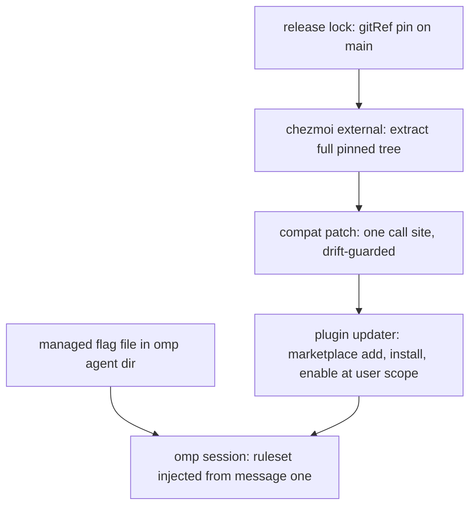
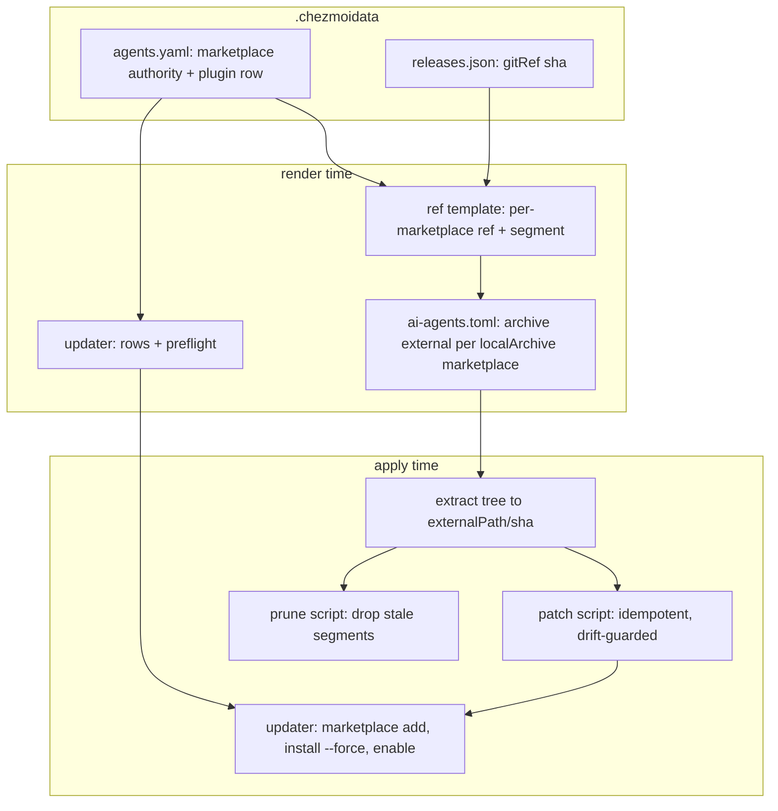

# omp i-have-adhd Integration - Plan

## Goal Capsule

- **Objective:** Ship ADHD-friendly output in every omp session by integrating upstream `ayghri/i-have-adhd` as a managed omp plugin, always on from the first message.
- **Authority hierarchy:** Product Contract (what) > Planning Contract (how) > Implementation Units. Session-settled decisions carry `session-settled:` labels and are not re-litigated.
- **Stop conditions:** the updater cannot keep compound-engineering byte-identical; the compatibility patch's drift guard cannot be made fail-closed; the plugin install cannot pass the isolated-HOME smoke check.
- **Execution profile:** provisioning and data files only (chezmoi source, YAML data, shell templates, one registry entry). No runtime code is authored.
- **Tail ownership:** ce-work implements U1–U8 in dependency order, then the Verification Contract gates the branch.

---

## Product Contract

Product Contract preservation — changed: R4, R6 (precision amendments from research, no scope change), AE2 (escape now covers resume), added R8 (fail-closed layout-drift preflight), added AE5–AE6, removed Outstanding Questions (both resolved during planning), added Scope Boundaries items (persistent opt-out, deferred compat contributions). Review-amended (ce-doc-review pass, all P0/P1 applied): R8 extended to the pi-manifest loadable surface, AE4 amended for the every-apply patch re-assertion, live smoke extended to AE1/AE2, bump-review step added to U1.

### Summary

Integrate the upstream i-have-adhd ruleset into omp as an always-on output mode, delivered through the same marketplace-and-plugin mechanism the repo already uses for compound-engineering. The ruleset injects from message one of every session, and the user can escape it per session.

### Problem Frame

omp's default output buries the actionable answer under preamble, tangents, and closing filler. For an ADHD reader the cost is specific: working memory is small, state between turns is lost, and vague output kills the step from "got it" to "done it". Upstream `ayghri/i-have-adhd` packages the counter-shape as a 10-rule output ruleset (action first, numbered steps, restated state, no preamble) plus a pi-compatible extension that injects the ruleset for a whole session. This repo manages no output shaping today; its composed instruction core governs agent-authored prose, not response shape.

### Key Decisions

- **Always-on activation.** The ruleset applies from the first message of every omp session, with no invocation. (session-settled: user-directed — chosen over on-demand skill and toggle-default-off: the shaping must not depend on remembering to turn it on.) Governs R4, R6.
- **Verbatim upstream ruleset, tracked at a pin.** No local copy, tuning, or overlay of rule content; updates arrive only by bumping the pin. (session-settled: user-directed — chosen over a vendored tuned copy: follow upstream and accept its wording.) Governs R5.
- **Compound-engineering integration pattern.** A marketplace registry authority plus an omp plugin row, not loose pinned extension files. (session-settled: user-directed — chosen over loose pinned files: one plugin mechanism across the repo.) Governs R1, R2, R3.

### Requirements

**Integration**

- R1. i-have-adhd is delivered as an omp plugin through the repo's marketplace registry (an `agents.marketplaces` authority plus an `agents.omp.plugins` row), installed and enabled at user scope by the plugin updater — the same mechanism compound-engineering uses. The marketplace key equals the upstream manifest name `i-have-adhd`.
- R2. The upstream tree is extracted in full by a chezmoi external pinned through the release lock's `gitRef` kind (the `main` branch head resolved to a commit), because upstream publishes no releases or tags.
- R3. The plugin updater and its sibling version-prune script are generalized so every local-archive marketplace resolves its own source path and version segment; the compound-engineering marketplace and plugin behave exactly as before.
- R8. The updater fails closed on upstream layout drift: preflight asserts the extension and ruleset files exist in the extracted tree, and asserts the tree's `package.json` pi manifest declares exactly the authority-declared extension and skill entries — before any plugin mutation.

**Session behavior**

- R4. ADHD mode is active from the first message of every omp session via a managed always-on flag file in the omp agent dir, and the status line shows the ADHD indicator while the mode is on.
- R5. The 10-rule ruleset is used verbatim as shipped by the pinned upstream tree.
- R6. Per-session escape works through upstream's built-ins: "stop adhd mode" / "normal mode" and `/i-have-adhd off` disable the mode, the disabled state persists across resume and branch switches within that session, and a genuinely new session starts enabled again.
- R7. The plugin is eligible on every managed OS and in containers; it is pure TypeScript and Markdown with no daemon or host services.

### Key Flows

- F1. Install on apply
  - **Trigger:** `chezmoi apply` runs with the marketplace authority and plugin row declared.
  - **Steps:** The external extracts the pinned upstream tree; the compat patch applies to the extracted extension; the updater registers the marketplace with omp and installs and enables the plugin at user scope; the flag file is present.
  - **Outcome:** The next omp session starts with ADHD mode on and its status indicator visible.
  - **Covers:** R1, R2, R4
- F2. Per-session escape
  - **Trigger:** The user types "stop adhd mode" mid-session.
  - **Steps:** The extension disables the mode; later responses revert to default style; the disabled state is recorded on the session branch.
  - **Outcome:** Resume and branch switches keep the session escaped; a genuinely new session starts enabled because the flag file is still present.
  - **Covers:** R6
- F3. Pin bump
  - **Trigger:** The release-lock refresh resolves `main` to a new commit.
  - **Steps:** The next apply extracts the new tree into a new version-segment directory, the patch re-applies, and the updater repoints the marketplace and reinstalls the plugin.
  - **Outcome:** omp runs the newer upstream ruleset verbatim; the prune script removes the stale segment directory.
  - **Covers:** R2, R3, R5

### Acceptance Examples

- AE1. Fresh session is already shaped
  - **Covers:** R4, R5
  - **Given** the plugin is installed and the flag file is deployed, **when** a new omp session starts and the user asks a question, **then** the first response leads with the action without any invocation, and the status line shows the ADHD indicator.
- AE2. Escape survives resume
  - **Covers:** R6
  - **Given** ADHD mode is on, **when** the user says "stop adhd mode" and later resumes the same session, **then** responses stay in default style, **and** a genuinely new session has ADHD mode on again.
- AE3. Existing plugin unaffected
  - **Covers:** R3
  - **Given** compound-engineering is installed, **when** the updater runs with both marketplaces declared, **then** compound-engineering remains installed and enabled and the updater exits 0.
- AE4. Unchanged pin converges
  - **Covers:** R2
  - **Given** the lock entry is unchanged, **when** apply runs again, **then** chezmoi re-extracts the tree from the pinned archive, the patch script re-asserts the patch (a no-op when the file is already patched), and the updater does not rerun.
- AE5. Layout drift fails closed
  - **Covers:** R8
  - **Given** a pin bump whose tree moved the extension or ruleset path, or whose pi manifest no longer declares the expected entries, **when** apply runs, **then** the updater preflight fails before any plugin mutation and compound-engineering state is untouched.
- AE6. Patched extension injects cleanly
  - **Covers:** R4
  - **Given** the pinned tree received the compat patch, **when** an omp session starts with the flag file present, **then** the ruleset custom message is injected and no extension error is reported.

### Scope Boundaries

- No local tuning or vendored copy of the ruleset — the exclusion dual of R5.
- No integration into other harnesses (Claude Code, Codex, Gemini, agy) — omp is the only managed harness.
- No separate `agents.skills.external` entry for the i-have-adhd skill — the plugin alone carries the behavior.
- No changes to the composed instruction core for output shaping.
- No persistent opt-out mechanism — the per-session escape (R6) is the only user-level off switch; a permanent disable means removing the plugin row from `agents.omp.plugins`.

#### Deferred to Follow-Up Work

- Native omp or upstream compatibility for `sessionManager.buildContextEntries` (removes the managed patch). Filing in either external repository requires the user's confirmation first.
- A data-declared persistent opt-out switch, if per-session escape proves insufficient in use.

### Dependencies / Assumptions

- Upstream ships `.claude-plugin/marketplace.json` (plugin source `./`) and a `package.json` pi manifest (`pi.extensions`, `pi.skills`), both consumed by the installed omp (verified against the omp binary and a live isolated-HOME install).
- omp's agent dir resolves to `~/.omp/agent`, so the extension's always-on flag path is stable (verified against the omp binary).
- Upstream publishes no releases or tags, so the pin re-resolves the moving `main` branch on each lock refresh; a bump can carry arbitrary upstream changes.
- The extracted extension loader receives a managed one-call-site compatibility patch (KTD3); rule content stays verbatim per R5.
- The updater currently hard-fails any local-archive marketplace other than compound-engineering and resolves the compound-engineering ref unconditionally (`.chezmoiscripts/70-agents/run_onchange_after_update-omp-plugins.sh.tmpl:14-15,51,55`); R3 removes that coupling.

### Sources / Research

- Upstream repo: `github.com/ayghri/i-have-adhd` (MIT; no releases or tags; ships `extensions/i-have-adhd.ts`, `skills/i-have-adhd/SKILL.md`, `.claude-plugin/marketplace.json`, pi manifest in `package.json`).
- Integration precedent: `.chezmoidata/agents.yaml` (marketplaces and plugin rows), `.chezmoiexternals/ai-agents.toml:165-185` (compound-engineering archive block), `packages/release-lock/src/registry.ts:209-213` (gitRef pin precedent).
- Live probe on the installed omp v17.2.12 (isolated HOME, pinned tree `2ed0640`): marketplace add, install, enable succeed; the extension loads through omp's legacy-pi import shim; one API gap found and patch-verified (KTD3); with the patch, session start injects the ruleset custom message with no extension error.

---

## Planning Contract

### Key Technical Decisions

- KTD1. **Generalize local-archive handling per marketplace across the four coupled files** — `.chezmoitemplates/compound-engineering-ref.tmpl`, `.chezmoiexternals/ai-agents.toml`, the plugin updater, and the 00-tools prune script — instead of duplicating compound-engineering-specific blocks. One mechanism serves every local-archive marketplace; compound-engineering behavior stays byte-identical (AE3). The ce-sweep overlays script stays compound-engineering-only. Governs U2, U3, U4, U6; cites R1, R3.
- KTD2. **Full 40-character sha as the version segment for gitRef pins.** It matches the lock entry verbatim, is path-safe, and needs no truncation-collision reasoning; compound-engineering keeps its `v<semver>` tag-derived segment. Governs U2, U3, U4, U6; cites R2.
- KTD3. **Managed apply-time compatibility patch on the extracted extension loader.** The pinned omp v17.2.12 lacks `sessionManager.buildContextEntries`, so the upstream extension throws on every session start (live-probe evidence). The patch rewrites the single call site to `(ctx.sessionManager.buildContextEntries?.() ?? ctx.sessionManager.getBranch())`, is idempotent, and fails closed when the upstream snippet drifts. The feature-detect form prefers the native API once omp ships it. **Conflict call-out:** this modifies upstream loader code, in tension with the settled verbatim-upstream decision; the settlement covers rule content (R5), which the patch never touches, and the alternatives — an upstream contribution or an omp shim PR — need the user's confirmation to file in non-user repositories, so they are deferred (Scope Boundaries). Governs U5; cites R5, R6.
- KTD4. **`getBranch()` fallback accepts a post-compaction re-injection gap.** Branch entries can outlive model-context compaction, so after a compaction the ruleset may not re-inject until the next session start. The gap is bounded to long compacted sessions and disappears automatically when omp adds the native API (KTD3's feature-detect). Governs U5; cites R4.
- KTD5. **Flag file uses the `empty_` source prefix.** A plain empty source file is silently not created by chezmoi (empirically verified); `dot_omp/private_agent/empty_dot_i-have-adhd-always` is the working source name. Governs U7; cites R4.
- KTD6. **Plugin row declared last in `agents.omp.plugins`.** The updater's all-rows preflight fails closed before mutation, so an i-have-adhd breakage already blocks compound-engineering reconciliation; declaring the row last at least guarantees mutation-phase failures leave compound-engineering reconciled. Governs U2; cites R3.

### High-Level Technical Design

Apply-time pipeline across the generalized mechanism:

Authority schema additions (validated by the ref template and updater): `lockTool` (release-lock key) and `versionSegment` strategy per marketplace kind; compound-engineering declares its existing `versionSource: compoundEngineeringRelease` path unchanged, i-have-adhd declares the gitRef lock key with a full-sha segment. An optional `requiredPaths` list on the authority drives the fail-closed layout-drift preflight (R8): each entry is asserted to exist under the extracted tree, and the tree's `package.json` pi manifest (`pi.extensions`, `pi.skills`) is asserted to declare exactly those same paths, so preflight covers the loadable surface rather than file existence alone.

### Assumptions

- The escape and toggle paths (`registerCommand`, `appendEntry`, the `input` event) work under omp's legacy-pi shim; only the session-start/injection path was probe-verified, and the shim's changelog shows sustained legacy-extension compatibility work.
- Task subagents build their own session context, so the injection shapes main-session responses only. This matches the extension's session-branch design and needs no verification target beyond the main session.
- The exact stop phrases are swallowed as whole-message input (upstream behavior); accepted as an input-surface behavior change, not a defect.

### Sequencing

U1 (lock) → U2 (data + ref template) → U3 (external) → U4 (updater) and U5 (patch script, which must sort before the updater at apply) → U6 (prune) → U8 (CI coverage). U7 (flag file) is independent and lands any time before the smoke check.

---

## Implementation Units

### U1. release-lock gitRef entry for i-have-adhd

**Goal:** The release lock resolves and pins the upstream `main` head so every render reads the sha locally.

**Requirements:** R2

**Dependencies:** none

**Files:**
- `packages/release-lock/src/registry.ts` (add the entry beside the `improve` precedent at :209-213)
- `.chezmoidata/releases.json` (regenerated, never hand-edited)

**Approach:**
1. Add `iHaveAdhd: { kind: "gitRef", source: "ayghri/i-have-adhd", ref: "refs/heads/main" }` (key per registry camelCase convention; the lock tool name consumers cite).
2. Regenerate `.chezmoidata/releases.json` with the package's CLI (`bun run packages/release-lock/src/cli.ts`).
3. Bump review (every later i-have-adhd pin move): before regenerating, fetch the upstream repo and review the full diff between the previously pinned sha and the new `main` head — the extension, the `package.json` pi manifest, and the ruleset included — and record the reviewed sha range in the lock-bump commit message. A pin move without that review does not land.

**Patterns to follow:** the `improve` gitRef entry (registry.ts:209-213) and its lock shape (releases.json:234-238).

**Test scenarios:**
- Happy path: the refreshed lock carries a 40-hex sha for the new tool; `git-ref.test.ts` fixtures stay green.
- Registry partition: `registry.test.ts:178-189` passes with no asset-selector table addition (gitRef is version-only).
- Lock parse: `cli.test.ts:173-176` still parses the committed lock.
- Bump review: a lock-bump commit for i-have-adhd cites the reviewed upstream sha range in its message.

**Verification:** `vp run -r test` in `packages/` is green; the lock entry resolves without network at render (render through `release-lock-ref.tmpl`).

### U2. Marketplace authority and ref template generalization

**Goal:** `agents.marketplaces` gains a validated i-have-adhd authority and the ref resolution generalizes beyond compound-engineering.

**Requirements:** R1, R3

**Dependencies:** U1

**Files:**
- `.chezmoidata/agents.yaml` (marketplace authority; plugin row appended last per KTD6)
- `.chezmoitemplates/compound-engineering-ref.tmpl` (generalize or split per KTD1)

**Approach:**
1. Add the authority: `kind: localArchive`, `source: ayghri/i-have-adhd`, `externalPath: .local/share/i-have-adhd`, the gitRef lock key and full-sha segment strategy (KTD2), `os: [linux, darwin]`, `container: keep`, and `requiredPaths: [extensions/i-have-adhd.ts, skills/i-have-adhd/SKILL.md]` (R8).
2. Append `{ name: i-have-adhd, marketplace: i-have-adhd }` as the last `agents.omp.plugins` row.
3. Generalize the ref template so each localArchive authority resolves its own ref and segment; compound-engineering's validation and `v<semver>` segment stay byte-identical.

**Patterns to follow:** the existing authority validation in `compound-engineering-ref.tmpl:16-38` (fail-closed on missing/unsafe fields).

**Test scenarios:**
- Happy path: render emits the i-have-adhd ref as the lock sha and a full-sha segment; compound-engineering output is unchanged.
- Error paths: authority missing a required field, unsafe `source`/`externalPath`, unknown segment strategy — each fails the render with the field named.
- Unknown `lockTool` fails closed through `release-lock-ref.tmpl` naming the key.

**Verification:** `chezmoi execute-template` of the ref template and updater renders both marketplaces; `render-dotfiles.yml` fixtures stay green.

### U3. Archive external for the pinned tree

**Goal:** chezmoi extracts the full pinned upstream tree to a sha-segmented directory.

**Requirements:** R2

**Dependencies:** U2

**Files:**
- `.chezmoiexternals/ai-agents.toml` (generalize the CE one-shot block at :165-185 into per-localArchive emission per KTD1)

**Approach:**
1. Emit one archive external per localArchive marketplace: URL `https://github.com/<source>/archive/<ref>.tar.gz`, `stripComponents = 1`, target `<externalPath>/<segment>`.
2. i-have-adhd gets `exact = true` (no overlay to preserve); compound-engineering stays additive — the overlays test asserts that split.
3. Keep the no-`refreshPeriod` design: the URL carries the resolved ref, so a lock bump drives re-fetch.

**Patterns to follow:** the CE block comment and shape (ai-agents.toml:165-185); the skills blocks' `exact = true` usage (:159-160).

**Test scenarios:**
- Render: the i-have-adhd block has `type = "archive"`, the sha URL, `stripComponents = 1`, `exact = true`; the CE block is unchanged and stays additive.
- Apply convergence: a second render with an unchanged lock produces byte-identical output (AE4).

**Verification:** `.ci/test-compound-engineering-overlays.sh` passes with the new block assertions; render through the scratch op-stub pattern from AGENTS.md.

### U4. Plugin updater generalization

**Goal:** The updater serves every localArchive marketplace and fails closed on layout drift, with compound-engineering behavior byte-identical.

**Requirements:** R1, R3, R8

**Dependencies:** U3

**Files:**
- `.chezmoiscripts/70-agents/run_onchange_after_update-omp-plugins.sh.tmpl`

**Approach:**
1. Replace the unconditional `$ceRef`/`$ceVersion` resolution (:14-15) with per-marketplace ref+segment resolution inside the localArchive branch.
2. Replace the non-CE hard-fail (:51) with generic authority validation; compose `$home/$externalPath/$segment` (:55) per marketplace.
3. Extend the localArchive preflight (:112): keep the `.claude-plugin/marketplace.json` assertion, assert every authority `requiredPaths` entry exists under `$source`, and assert the tree's `package.json` pi manifest declares exactly those paths as its extension/skill entries (R8).
4. Keep the preflight-complete-before-mutation structure and the remove/add/install --force/enable reconcile loop unchanged.

**Patterns to follow:** the existing row pipeline (:17-66, :107-129); per-row `kind`/`container`/`os` validation (:12, :33-45).

**Test scenarios:**
- Rows: the rendered script carries `i-have-adhd\ti-have-adhd\tlocalArchive\t` with the sha-segmented source path (the reconcile test greps rows by exact tab pattern).
- Call shape: stubbed omp records `plugin install --scope user --force i-have-adhd@i-have-adhd` and `plugin enable` for the new row; the CE call shape is unchanged (AE3).
- Preflight: a missing `requiredPaths` file fails the run before any `marketplace add` (AE5); a missing CE manifest fails identically.
- Idempotency: a repeat reconcile with an unchanged lock records zero mutations (AE4).

**Verification:** `.ci/test-omp-agent-reconcile.sh` passes with the new row; `.ci/test-mxm4-haptic-gates.sh` render gates stay green.

### U5. Extension compatibility patch script

**Goal:** The extracted extension loads on the pinned omp without forking upstream content.

**Requirements:** R4, R5, R6

**Dependencies:** U3

**Files:**
- `.chezmoiscripts/70-agents/run_after_patch-i-have-adhd-extension.sh.tmpl` (new; bare `run_after_`, no onchange fingerprint — chezmoi converges the `exact = true` external from the cached archive on every apply, so the patch MUST be re-asserted after every apply's file phase; the every-apply lifecycle matches the sanctioned `run_after_compound-engineering-overlays.sh.tmpl` precedent. ASCII target-name sort inside the after phase lands `patch-` before `update-omp-plugins`, so the updater always reads the patched tree)

**Approach:**
1. Render the sha-segmented tree path from the same authority (U2).
2. Idempotent three-way check on `extensions/i-have-adhd.ts`: patched form present → no-op; exact upstream call site present → apply the KTD3 substitution; anything else → fail with the drift named.
3. Never touch `skills/` content (R5).
4. No fingerprint gate: the script runs on every apply and no-ops on an already-patched file, which also covers chezmoi re-extracting the tree underneath an unchanged lock.

**Patterns to follow:** the fingerprint contract in AGENTS.md (comment-only dependency fingerprint via `.chezmoitemplates/fingerprint.tmpl`).

**Test scenarios:**
- First run patches the upstream call site and leaves every other byte of the tree untouched.
- Second run is a no-op (idempotent).
- Drift: a tree whose extension lacks both the upstream and patched forms fails the script with a nonzero exit.
- Post-patch smoke (mirrors AE6): in an isolated HOME, install from the patched tree, start a session with the flag file, and the ruleset injects with no extension error.

**Verification:** the script's own scenarios plus the isolated-HOME smoke check in the Verification Contract.

### U6. Version-prune generalization

**Goal:** Stale sha-segment directories are pruned for every localArchive marketplace.

**Requirements:** R3

**Dependencies:** U4

**Files:**
- `.chezmoiscripts/00-tools/run_onchange_after_compound-engineering.sh.tmpl` (generalize per KTD1)

**Approach:**
1. Range over localArchive marketplaces instead of the hardcoded compound-engineering name (:3, :26-27).
2. Keep only the current segment per marketplace; guard every destructive path at one choke point and `lstat` before existence checks (repo learning: preserve-user-content guards cover every destructive path).
3. Leave the overlays script compound-engineering-only (ce-sweep-specific).

**Patterns to follow:** the existing prune logic and its comment (:13-14) on sibling-version accumulation.

**Test scenarios:**
- Two stale segments plus the current one: only the current survives, per marketplace.
- A non-directory or symlink in the parent is never removed (lstat-first guard).
- Compound-engineering pruning output is unchanged for an unchanged CE tree.

**Verification:** the prune script's scenarios run in a scratch HOME fixture; `render-dotfiles.yml` stays green.

### U7. Always-on flag file target

**Goal:** The extension's always-on flag deploys as a managed empty file.

**Requirements:** R4, R7

**Dependencies:** none

**Files:**
- `dot_omp/private_agent/empty_dot_i-have-adhd-always` (new empty source; `empty_` prefix per KTD5)

**Approach:**
1. Add the empty source file; no `.chezmoiignore` change — the container ignore block only excludes the haptic extension under `.omp` (:116-117), so the flag deploys in containers (R7).

**Patterns to follow:** `dot_omp/private_agent/` file-prefix conventions (`private_`/`readonly_` semantics in AGENTS.md:7).

**Test scenarios:**
- Render/apply to a scratch destination: the target exists, is empty, and `private_agent/` yields 0700 dirs.
- Container gate render keeps the file (container skip set unchanged).

**Verification:** scratch `chezmoi apply` against the op-stub config shows the target created.

### U8. CI coverage for the new marketplace

**Goal:** The existing harness proves the new row, the new external block, and the patch script.

**Requirements:** R1, R2, R8

**Dependencies:** U4, U5, U6, U7

**Files:**
- `.ci/test-omp-agent-reconcile.sh` (row, call shape, requiredPaths preflight, patch-script scenarios)
- `.ci/test-compound-engineering-overlays.sh` (i-have-adhd block assertions; CE block stays additive)
- `.ci/test-mxm4-haptic-gates.sh` (render-gate expectations if row counts are asserted)

**Approach:**
1. Extend the reconcile test: stage an i-have-adhd fixture marketplace with `.claude-plugin/marketplace.json`, a `package.json` whose pi manifest declares the expected extension and skill entries, and both `requiredPaths` files; assert the rendered row, the stubbed-omp call shape, and the fail-closed preflight when a required path is removed or the manifest entry set drifts.
2. Extend the overlays test: assert the i-have-adhd block carries `exact = true` and the CE block still does not.
3. Keep the tests' existing structure: rendered-script grep over hardcoded rows.

**Patterns to follow:** the fixture staging and omp stub at `.ci/test-omp-agent-reconcile.sh:117-206`.

**Test scenarios:** covered by the file-level assertions above; every new assertion must fail when its target behavior is removed.

**Verification:** the three `.ci/` scripts pass locally and in `ci.yml`.

---

## Verification Contract

| Gate | Command / check | Applies to | Done signal |
|---|---|---|---|
| Unit tests | `vp run -r test` in `packages/` | U1 | release-lock suite green |
| Render | `chezmoi execute-template` over every changed template/external with the AGENTS.md op-stub scratch config | U2–U7 | both marketplaces render; CE output byte-identical |
| Reconcile harness | `.ci/test-omp-agent-reconcile.sh` | U4, U8 | new row + call shape + fail-closed preflight proven |
| Overlays harness | `.ci/test-compound-engineering-overlays.sh` | U3, U8 | i-have-adhd `exact = true`; CE additive |
| Gates harness | `.ci/test-mxm4-haptic-gates.sh` | U2, U4, U7, U8 | container render keeps the row and flag file |
| Live smoke | isolated-HOME install from the patched pinned tree, then: a session start with the flag file (AE6); "stop adhd mode" mid-session, resume, and assert default style persists plus a genuinely new session starts enabled (AE2); the ADHD indicator is visible while the mode is on (AE1) | U5 | ruleset custom message in the session file; no extension error; escape state survives resume; indicator shown |
| Diff hygiene | `git diff --check`, `git status`, diff limited to unit files | all | clean |

Onchange side effects to disclose at apply: the updater restarts no services; it re-registers omp marketplaces and reinstalls plugins. First apply of this change reinstalls compound-engineering alongside installing i-have-adhd.

## Definition of Done

- Every unit's Verification line is green and the Verification Contract table passes end to end.
- AE1–AE6 are demonstrated by the harness or the live smoke; AE3 proves compound-engineering byte-parity.
- `render-dotfiles.yml` and `ci.yml` are green on the pushed branch.
- The plan file reflects the shipped state (any implementation-time decision updates KTDs in place).
- Cleanup: no scratch probe trees, no dead-end patch variants, and no superseded CE-specific blocks remain in the diff.
