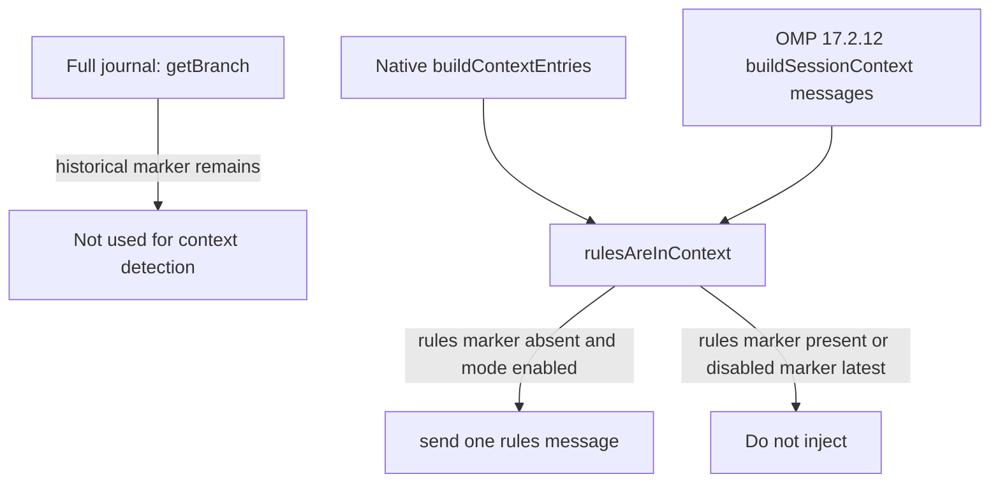

# fix ADHD rule reinjection after OMP compaction - Plan

## Goal Capsule

- **Objective:** Keep the managed i-have-adhd ruleset active in the model context after OMP v17.2.12 compaction without duplicating it when it remains present.
- **Authority hierarchy:** Issue #202 defines the behavior. This plan defines the compatibility mechanism. The pinned upstream extension and OMP v17.2.12 source define the compatible API shapes.
- **Stop conditions:** OMP v17.2.12 cannot expose the rebuilt model context through its public `sessionManager` API, or the pinned upstream loader changes the guarded function before the compatibility patch can be updated safely.
- **Execution profile:** Change the chezmoi-managed patch and its isolated rendered-script regression coverage. Do not change upstream rule content, plugin registration, or the OMP lock pin.
- **Tail ownership:** Execute U1 before U2. Run the rendered-script test and the repository-required source-state checks before shipping.

---

## Product Contract

### Summary

The current fallback reads the full journal branch after compaction.
A historical ADHD marker can remain in that branch after OMP removes it from model context.
The extension then leaves the status as `ADHD ON` but does not inject the rules again.

### Problem Frame

OMP v17.2.12 exposes `sessionManager.buildSessionContext().messages` for the reconstructed model context.
The upstream extension currently prefers a later `buildContextEntries()` API and this repository falls back to `getBranch()`.
The fallback answers a history question, not the context-presence question that `rulesAreInContext()` must answer.

### Requirements

**Context detection**

- R1. On OMP versions with `buildContextEntries()`, retain the native context-entry path and its existing rules/disabled-marker ordering semantics.
- R2. On OMP v17.2.12, determine rule presence from `buildSessionContext().messages`, not `getBranch()`, so compacted-away historical markers cannot suppress reinjection.
- R3. The compatibility path recognizes only model-context custom messages with the upstream rules and disabled marker types, and evaluates them in context order so the latest marker wins.

**Convergence and proof**

- R4. The apply-time patch remains idempotent and fails closed when either the known upstream or the known patched `rulesAreInContext()` function does not match the pinned loader.
- R5. The isolated regression test proves one initial injection, no duplicate while the rules marker remains in model context, one reinjection after compaction removes it despite a retained journal marker, and no second reinjection after that new marker is retained.
- R6. Existing updater, plugin manifest, and rule-content behavior remain unchanged.

### Acceptance Examples

- AE1. Compaction removes rules from context
  - **Covers:** R2, R3, R5
  - **Given** the journal still contains an earlier rules marker but `buildSessionContext().messages` does not, **when** `session_compact` fires while ADHD mode is enabled, **then** the extension sends one new rules message.
- AE2. Rules remain in context
  - **Covers:** R1, R3, R5
  - **Given** the rebuilt context contains the latest rules marker, **when** `session_compact` fires, **then** the extension sends no additional rules message.
- AE3. Managed source drifts
  - **Covers:** R4
  - **Given** the extracted loader has neither the expected upstream function nor the expected patched function, **when** chezmoi applies the patch script, **then** the script exits nonzero without rewriting the loader.

### Scope Boundaries

- Do not alter the pinned OMP version or the pinned upstream i-have-adhd revision.
- Do not vendor, edit, or retune the upstream ADHD ruleset.
- Do not change per-session disable behavior, marketplace reconciliation, or plugin installation.
- Do not contribute a patch to either upstream repository in this work.

### Sources / Research

- Issue #202 documents the compaction failure and requires exactly-once reinjection.
- `.chezmoiscripts/70-agents/run_after_patch-i-have-adhd-extension.sh.tmpl` currently substitutes `getBranch()` as the fallback and reasserts the patch after each apply.
- `can1357/oh-my-pi` tag `v17.2.12`, `packages/coding-agent/src/session/session-manager.ts`, exposes `buildSessionContext()` and documents it as the LLM-message reconstruction API.
- `can1357/oh-my-pi` tag `v17.2.12`, `packages/coding-agent/src/session/session-context.ts`, shows compaction removes earlier context entries while retaining only the compaction summary and kept/post-compaction messages.
- `can1357/oh-my-pi` tag `v17.2.12`, `packages/coding-agent/src/session/messages.ts`, defines context-injected messages as `role: "custom"` with `customType`.
- `.ci/test-omp-agent-reconcile.sh:297-324` already renders and exercises first-run, idempotence, and drift behavior for this patch.

---

## Planning Contract

### Key Technical Decisions

- KTD1. **Use `buildSessionContext().messages` as the v17.2.12 fallback.** It is OMP's public reconstruction of the model-visible context and therefore answers whether a custom rules message survives compaction. This replaces `getBranch()`, which retains the full journal. Governs U1; cites R1, R2, R3.
- KTD2. **Patch the complete `rulesAreInContext()` function, not only its iterator expression.** The native context entries and v17.2.12 reconstructed messages use different discriminants. The patched function must normalize that difference at the boundary while keeping chronological rules/disabled semantics in one body. Exact upstream and patched function comparisons preserve the existing fail-closed patch contract. Governs U1; cites R1, R3, R4.
- KTD3. **Exercise the generated patched loader with a minimal OMP-compatible runtime fixture.** String assertions alone cannot prove the compaction behavior. The regression fixture will invoke the actual patched extension handlers with a model-context source that changes across `session_compact` events. Governs U2; cites R5.

### High-Level Technical Design

The managed patch uses the native context-entry API when present.
Otherwise it reads rebuilt messages and accepts only custom-message marker records.
Both paths feed the same ordered state calculation.

### Risks and Dependencies

- The patch depends on the exact upstream function body at release-lock SHA `2ed064090711586e0c97a2fbbf15465fe8f1808b`. The script must reject a changed body so a future pin bump cannot silently alter behavior.
- `buildSessionContext()` is available in the locked OMP v17.2.12 source. A future OMP API change must use the native path or update the guarded fallback with fresh source evidence.
- The runtime test must model `pi.sendMessage()` as updating the rebuilt context. Otherwise a second compaction would falsely appear to require reinjection again.

### Sequencing

U1 establishes the correct generated loader and drift guard.
U2 proves the generated patch across first injection, retained context, compacted context, and re-retained context.

---

## Implementation Units

### U1. Replace journal fallback with model-context compatibility patch

- **Goal:** Make the rendered patch replace the pinned upstream `rulesAreInContext()` function with a native-first, compaction-aware implementation.
- **Requirements:** R1, R2, R3, R4, R6
- **Dependencies:** none
- **Files:** `.chezmoiscripts/70-agents/run_after_patch-i-have-adhd-extension.sh.tmpl`
- **Approach:** Preserve the every-apply lifecycle, extracted-tree gate, ownership/mode preservation, and atomic replacement pattern. Change the patch contract from one iterator line to the exact upstream and patched function bodies. The patched function uses native context entries when available. Its fallback reads reconstructed messages, distinguishes custom messages by their OMP v17.2.12 shape, and preserves the existing latest-marker-wins state calculation. Compare the complete known function before treating the target as already patched or eligible to rewrite. Reject all other shapes before any rewrite.
- **Patterns:** Follow the current three-way patch state machine in the same template. Use the OMP v17.2.12 `SessionManager.buildSessionContext()` and custom-message shapes recorded in Sources / Research.
- **Test Scenarios:** A pristine pinned loader receives the complete patch. A patched loader is unchanged on the next apply. A loader that differs from both complete known function bodies fails and remains byte-identical. A native `buildContextEntries()` implementation still takes precedence over the fallback.
- **Verification:** Render the template with the repository scratch `op` stub. Run the patch checks embedded in `.ci/test-omp-agent-reconcile.sh` and inspect only the requested source diff.

### U2. Extend isolated patch regression to execute compaction behavior

- **Goal:** Prove the rendered patched extension reinjects rules exactly once after context compaction.
- **Requirements:** R4, R5, R6
- **Dependencies:** U1
- **Files:** `.ci/test-omp-agent-reconcile.sh`
- **Approach:** Replace the line-only patch fixture with the full pinned upstream function fixture and expected patched form. Keep the existing render, first-run, no-op, and drift assertions. Add a Bun-driven runtime fixture that loads the patched extension with only the required OMP and filesystem seams. Its session manager keeps a historical rules entry in `getBranch()` while independently controlling rebuilt model-context messages. Dispatch `session_start` and repeated `session_compact` handlers while `pi.sendMessage()` makes the newly injected custom marker visible to the next context rebuild.
- **Patterns:** Extend the existing isolated `HOME`, rendered-script, and fake-binary harness rather than adding a parallel test runner or changing the GitHub Actions job.
- **Test Scenarios:** Initial enabled restore injects once. A compact event with the marker still in rebuilt context injects zero times. A compact event with an empty rebuilt context and a stale branch marker injects once. The next compact event sees the new marker and injects zero times. Existing malformed patch drift still fails before the loader changes.
- **Verification:** Run `.ci/test-omp-agent-reconcile.sh` through the existing `oh-my-pi agent integration` rendered-artifact setup. Confirm the test runs the patched extension behavior, not only source-text assertions.

---

## Verification Contract

| Scope | Units | Proof |
| --- | --- | --- |
| Rendered patch behavior | U1, U2 | Render the patch template with the repository's scratch `op` stub and execute the isolated script fixture. |
| Compaction regression | U2 | Run the existing `.ci/test-omp-agent-reconcile.sh` integration harness and observe the initial, retained, compacted, and re-retained injection counts. |
| Source-state safety | U1, U2 | Run `git diff --check`, `git status`, and a diff limited to the two requested files. |
| CI | U1, U2 | The `oh-my-pi agent integration` job renders the scripts, installs locked OMP v17.2.12, and runs the changed harness. |

---

## Definition of Done

- U1 replaces `getBranch()` as the v17.2.12 rules-context fallback without changing native API behavior.
- U1 keeps the patch idempotent and fails closed for any unmatched upstream or patched function body.
- U2 executes the patched extension and proves the four-state injection sequence in R5.
- The modified test continues to cover pristine patch, no-op convergence, and drift rejection.
- No unrelated lock, marketplace, updater, rule-content, or workflow changes appear in the diff.
- The rendered-artifact regression and required source-state checks pass.
- Cleanup removes temporary fixtures and abandoned patch variants from the final diff.
