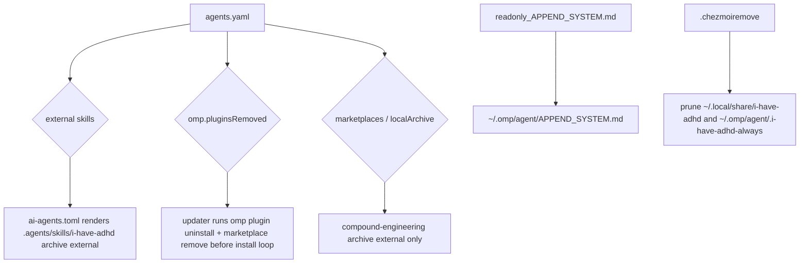

# omp i-have-adhd skill-only always-on delivery

## Goal Capsule

- **Objective:** Replace the managed i-have-adhd *plugin* delivery (omp marketplace, extension, apply-time patch, always-on flag file) with a *skill-only* install plus an always-on block in `~/.omp/agent/APPEND_SYSTEM.md`, using the upstream `ayghri/i-have-adhd` condensed always-on snippet from `INSTALL.md`.
- **Authority hierarchy:** User direction (skill-only + `APPEND_SYSTEM.md`) > repo conventions (chezmoi source state, `.chezmoiremove`, data-driven single source of truth, no teardown scripts) > this plan.
- **Stop conditions:** A render of the plugin updater or any `.tmpl` file fails closed; the release-lock key rename breaks `.chezmoidata/releases.json` regeneration; the pinned OMP binary lacks a working `plugin uninstall` command; CI cannot render `ai-agents.toml` after the authority is removed.
- **Execution profile:** Provisioning/data changes only (chezmoi data, templates, managed files, shell script templates, CI fixtures, AGENTS.md). No new runtime code is authored.
- **Tail ownership:** Implementation commits to this repo; the change lands in `~/.local/share/chezmoi` after merge and applies to the host on the next `chezmoi apply`.

---

## Product Contract

### Summary

The i-have-adhd integration currently ships as an OMP plugin: a chezmoi-extracted archive under `~/.local/share/i-have-adhd/<sha>`, an apply-time patch to `extensions/i-have-adhd.ts` to survive OMP compaction, an always-on flag file `~/.omp/agent/.i-have-adhd-always`, and a status widget that renders `ADHD ON` in the footer. The user wants the plugin machinery gone entirely. The ruleset will instead arrive as an external Agent Skill under `~/.agents/skills/i-have-adhd/` and the always-on behavior will move into the system prompt via OMP's `APPEND_SYSTEM.md` mechanism, which appends plain text to every session's system prompt.

This change removes the runtime extension (and its compaction-patch status-widget complexity) while keeping the ADHD output rules active from the first message. The on-demand skill remains available for explicit invocation.

### Requirements

- R1. Remove the i-have-adhd plugin authority from `agents.marketplaces`, the `agents.omp.plugins` row, the archive external emission, the extension patch script, and the always-on flag source.
- R2. Add i-have-adhd as an external Agent Skill delivered from the same pinned upstream commit, using the repo's existing `agents.skills.external` -> `.chezmoiexternals/ai-agents.toml` channel.
- R3. Manage the upstream condensed always-on block as a readonly file at `~/.omp/agent/APPEND_SYSTEM.md` (source under `dot_omp/private_agent/`).
- R4. Clean deployed leftovers at apply time without standalone teardown scripts: the installed OMP plugin via a data-driven updater removal declaration, and the extracted archive tree plus the flag file via `.chezmoiremove`.
- R5. Keep the compound-engineering plugin and the shared marketplace reconciliation machinery untouched.
- R6. Preserve container eligibility: the new skill and `APPEND_SYSTEM.md` deploy in containers exactly as the old tree/patch/flag did.

### Scope Boundaries

**Deferred for later:**

- Reverting the generalized `localArchive` schema fields (`lockTool`, `versionSegment`, `requiredPaths`) now that only compound-engineering uses the simpler `versionSource` path. They are currently validated but unused after this change; removing them is a separate cleanup to avoid mixing scope.

**Outside this product's identity:**

- Changing the upstream ruleset text (the SKILL.md or the condensed always-on block).
- Modifying the haptic plugin, compound-engineering plugin, MCP servers, model catalog, or OAuth wiring.
- Providing a new per-session escape enforcement beyond what the static system-prompt append can offer.

### Success Criteria

- The rendered plugin updater script contains no `plugin install/enable` calls for i-have-adhd and contains removal calls for it.
- A rendered `dot_omp/private_agent/readonly_APPEND_SYSTEM.md` produces `~/.omp/agent/APPEND_SYSTEM.md` with the verbatim condensed 10-rule block.
- The rendered `ai-agents.toml` contains a `.agents/skills/i-have-adhd` archive external with the correct pinned URL, `exact = true`, `stripComponents = 3`, and `include = ["*/skills/i-have-adhd/**"]`.
- After applying to a scratch HOME, `~/.local/share/i-have-adhd/` and `~/.omp/agent/.i-have-adhd-always` are absent.
- The three affected CI scripts and the full `ci.yml` workflow pass.

---

## Planning Contract

### Key Technical Decisions

- KTD1. **Skill-only + `APPEND_SYSTEM.md` always-on — session-settled: user-directed**, chosen over patching the extension to hide the status widget. Removing the extension also removes the `ADHD ON` indicator and the compaction reinjection workaround by construction.
- KTD2. **Automated leftover removal — session-settled: user-directed**, chosen over a one-time manual operator checklist. The cleanup is implemented as data-driven reconciliation (`.chezmoiremove` plus an updater `pluginsRemoved` list), not as a standalone teardown script, honoring the repo's prohibition on teardown/revert scripts.
- KTD3. **Rename the release-lock key from `iHaveAdhd` to `i-have-adhd`.** The external-skills ref lookup in `.chezmoiexternals/ai-agents.toml` uses `release-lock-ref.tmpl` with `tool = <skill name>` verbatim. The existing camelCase key would fail closed; renaming it aligns the pin key with the skill name. `.chezmoidata/releases.json` must be regenerated in the same change.
- KTD4. **Use the GitHub archive branch of the skill-external template.** For GitHub sources the template already emits an archive external with `stripComponents = 3` and `include = ["*/skills/<name>/**"]`, which isolates the `skills/i-have-adhd/` subtree exactly. A raw single-file branch is hardcoded to GitLab in the current template and would not fit.
- KTD5. **`APPEND_SYSTEM.md` is a static readonly managed target, not a template.** The content is the verbatim upstream condensed block; no per-host templating is needed. It belongs in `dot_omp/private_agent/readonly_APPEND_SYSTEM.md` so the deployed file is mode `0444`, matching other managed instruction targets.
- KTD6. **Add an `agents.omp.pluginsRemoved` list consumed by the plugin updater.** The updater will iterate the list before the install loop, running `omp plugin uninstall --scope user <id>` and `omp plugin marketplace remove <market>` with `|| true` idempotency, mirroring the existing `marketplace remove` before re-add. This extends the reconciler rather than introducing a new script category.
- KTD7. **Prune the orphaned archive tree and flag file via `.chezmoiremove`.** A directory entry removes `~/.local/share/i-have-adhd` recursively, and a file entry removes `~/.omp/agent/.i-have-adhd-always`, following the rich precedent already in `.chezmoiremove` for retired external skills and OMP agent files.

### Assumptions

- The pinned OMP binary (v17.2.12) supports `omp plugin uninstall` and `omp plugin marketplace remove` as stable CLI verbs; `omp plugin --help` lists both.
- OMP's `APPEND_SYSTEM.md` discovery reads `~/.omp/agent/APPEND_SYSTEM.md` at user scope and appends its plain text to the system prompt, surviving compaction by construction.
- Deleting the i-have-adhd `localArchive` authority from `agents.yaml` automatically stops rendering its archive external block from `.chezmoiexternals/ai-agents.toml`.
- The existing `local-archive-ref.tmpl` and updater preflight code tolerate the removal of a `localArchive` consumer and continue to serve compound-engineering.

### High-Level Technical Design



The skill is fetched at apply time by chezmoi's external mechanism, not by the OMP updater. The always-on prompt is a managed readonly file. The updater's only remaining i-have-adhd responsibility is idempotent cleanup of the previously installed plugin.

## Risks & Dependencies

- **Release-lock key mismatch.** The skill-external ref uses `tool = <skill name>` verbatim. If the registry key (`iHaveAdhd`) is not renamed to `i-have-adhd`, every render that touches `ai-agents.toml` fails closed. **Mitigation:** rename the key in `packages/release-lock/src/registry.ts` and regenerate `.chezmoidata/releases.json` in the same commit.
- **Fingerprint trap.** `fingerprint.tmpl` fails closed when a glob pattern matches zero files; deleting the patch script without removing its entry from the updater's fingerprint inputs breaks the updater render. **Mitigation:** remove the patch-script path from `run_onchange_after_update-omp-plugins.sh.tmpl` and from the matching CI assertion in `.ci/test-omp-agent-reconcile.sh` together.
- **Removal ordering.** The new removal loop must run before the install loop so a removed plugin is not re-installed in the same run. `.chezmoiremove` runs during the file phase, before all phase-70 scripts, so any script that still references the old paths must tolerate their absence. **Mitigation:** delete the patch script rather than leaving it; make removal commands idempotent with `|| true`.
- **`omp plugin uninstall --dry-run` is not honored.** The OMP CLI does not simulate plugin uninstallation. **Mitigation:** verify removal commands only via the stub-OMP + `OMP_CALLS` harness in CI; do not rely on `--dry-run` in any script or manual check.
- **CI drift beyond the three named scripts.** `.ci/i-have-adhd-patch-pin` must be deleted; no workflow file references it, so no `.github/workflows/` change is needed. **Mitigation:** delete the pin file and grep the repo for any remaining `i-have-adhd-patch-pin` or `run_after_patch-i-have-adhd-extension` references.
- **Container-gate trap.** `.chezmoiignore` should not gain new skip lines for `.agents/skills/i-have-adhd` or `.omp/agent/APPEND_SYSTEM.md` — both must remain container-eligible. **Mitigation:** update `test-mxm4-haptic-gates.sh` to assert `eligible` for the new targets and remove the old flag/tree assertions.
- **Orphaned archive tree.** The skill external uses `exact = true` on `~/.agents/skills/i-have-adhd`, which only cleans within that target; the retired `~/.local/share/i-have-adhd` tree still needs an explicit `.chezmoiremove` entry. **Mitigation:** add the directory prune entry.
- **New automated-removal pattern vs. prior decommission precedent.** The repo's prior plugin retirement (`unmanaged-repo-guard`) used `.chezmoiremove` plus an operator checklist because the updater had no removal path. Adding `pluginsRemoved` extends the reconciler. **Mitigation:** keep the declaration data-driven and idempotent; document the reversal in AGENTS.md and the plan.

---

## Implementation Units

### U1. Rename release-lock key from `iHaveAdhd` to `i-have-adhd`

- **Goal:** Make the release-lock pin key match the external-skill name so `ai-agents.toml` can resolve the ref fail-closed.
- **Requirements:** R2
- **Dependencies:** none
- **Files:**
  - `packages/release-lock/src/registry.ts`
  - `.chezmoidata/releases.json`
- **Approach:**
  1. Change `iHaveAdhd: { ... }` to `iHaveAdhd` -> `i-have-adhd` in `registry.ts`.
  2. Regenerate `.chezmoidata/releases.json` with the release-lock CLI (`bun run packages/release-lock/src/cli.ts` or the workspace equivalent) so the key appears as `i-have-adhd` with the same pinned SHA.
- **Patterns to follow:** The registry uses camelCase for tool keys but hyphenated keys already exist (e.g., `agent-browser` for `vercel-labs/agent-browser`). The release-lock CLI reads `registry.ts` and overlays resolved refs onto the committed lock.
- **Test scenarios:**
  - `releases.json` contains `"i-have-adhd": { "version": "2ed0640...", ... }` and no `iHaveAdhd` key.
  - `chezmoi execute-template` rendering `ai-agents.toml` resolves the skill external URL using the new key.
- **Verification:** `jq -e '.releases.tools["i-have-adhd"]' .chezmoidata/releases.json` succeeds; `iHaveAdhd` key is absent.

### U2. Remove plugin authority and add skill external

- **Goal:** Stop extracting the i-have-adhd archive as a plugin marketplace and start extracting only the `skills/i-have-adhd/` subtree as an external Agent Skill.
- **Requirements:** R1, R2
- **Dependencies:** U1
- **Files:**
  - `.chezmoidata/agents.yaml`
- **Approach:**
  1. Under `agents.skills.external`, add:
     ```yaml
     - name: i-have-adhd
       source: ayghri/i-have-adhd
     ```
  2. Delete the `i-have-adhd` block under `agents.marketplaces`.
  3. Delete the `agents.omp.plugins` row `{ name: i-have-adhd, marketplace: i-have-adhd }`.
  4. Update the header comment that maps `agents.skills.external` to `ai-agents.toml` if it lists examples.
- **Patterns to follow:** The GitHub skill entries `agent-browser` and `improve` already use exactly this shape; the template defaults to GitHub and resolves the ref via `release-lock-ref.tmpl` keyed by `name`.
- **Test scenarios:**
  - Rendered `ai-agents.toml` contains `[".agents/skills/i-have-adhd"]` with `type = "archive"`, `exact = true`, `stripComponents = 3`, `include = ["*/skills/i-have-adhd/**"]`, and a URL matching `https://github.com/ayghri/i-have-adhd/archive/<sha>.tar.gz`.
  - Rendered `ai-agents.toml` contains no `[".local/share/i-have-adhd/..."]` block.
- **Verification:** Render `ai-agents.toml` via `chezmoi execute-template` and grep for the expected block; confirm the old marketplace external is absent.

### U3. Add managed `APPEND_SYSTEM.md` target

- **Goal:** Deploy the upstream condensed always-on block to `~/.omp/agent/APPEND_SYSTEM.md` as a readonly managed file.
- **Requirements:** R3
- **Dependencies:** none
- **Files:**
  - `dot_omp/private_agent/readonly_APPEND_SYSTEM.md`
  - `AGENTS.md`
- **Approach:**
  1. Create `dot_omp/private_agent/readonly_APPEND_SYSTEM.md` containing the verbatim condensed block from `https://github.com/ayghri/i-have-adhd/blob/main/INSTALL.md` (the 10-rule "Output style" block plus the Exceptions paragraph). Add a leading HTML comment noting the upstream source and pinned commit.
  2. Update `AGENTS.md` to list `APPEND_SYSTEM.md` alongside `AGENTS.md` as a managed OMP instruction target under `dot_omp/private_agent/`.
- **Patterns to follow:** `private_readonly_AGENTS.md.tmpl` and `readonly_models.yml.tmpl` already live in `dot_omp/private_agent/`; a static readonly file uses the `readonly_` source prefix.
- **Test scenarios:**
  - Rendered target path is `~/.omp/agent/APPEND_SYSTEM.md`.
  - File contains the upstream 10-rule block and the Exceptions paragraph.
  - File does not contain the full SKILL.md frontmatter or ruleset.
- **Verification:** Render the source with `chezmoi execute-template` and assert the expected strings and mode metadata.

### U4. Delete the extension patch script and always-on flag source

- **Goal:** Stop managing the extension patch and the always-on flag.
- **Requirements:** R1
- **Dependencies:** U2
- **Files:**
  - `.chezmoiscripts/70-agents/run_after_patch-i-have-adhd-extension.sh.tmpl`
  - `dot_omp/private_agent/empty_dot_i-have-adhd-always`
  - `.ci/i-have-adhd-patch-pin`
- **Approach:**
  1. Delete the patch script template.
  2. Delete the empty flag-file source.
  3. Delete the CI pin file used only to verify the patch.
- **Patterns to follow:** Removing a managed source stops future management; deployed copies are pruned separately via `.chezmoiremove` (U6).
- **Test scenarios:**
  - Source files no longer exist in the repo.
  - Rendering the updater no longer references the patch script in its fingerprint list.
- **Verification:** `git status --short` shows deletions; `chezmoi execute-template < .chezmoiscripts/70-agents/run_onchange_after_update-omp-plugins.sh.tmpl` renders successfully without the patch script path in the fingerprint inputs.

### U5. Add data-driven plugin removal to the updater

- **Goal:** Reconcile a declared list of removed plugins by uninstalling them and removing their marketplace entries before installing declared plugins.
- **Requirements:** R4
- **Dependencies:** U2
- **Files:**
  - `.chezmoidata/agents.yaml`
  - `.chezmoiscripts/70-agents/run_onchange_after_update-omp-plugins.sh.tmpl`
- **Approach:**
  1. Add to `.chezmoidata/agents.yaml` under `agents.omp`:
     ```yaml
     pluginsRemoved:
     - { name: i-have-adhd, marketplace: i-have-adhd }
     ```
  2. In the updater template, render `PLUGINS_REMOVED` as a tab-separated array of `name\tmarketplace`. Removed entries do not need their marketplace to exist in `agents.marketplaces`; only the declared shape is validated. Rendered rows look like the existing `PLUGINS` rows.
  3. Before the install loop, iterate `PLUGINS_REMOVED` and run:
     ```bash
     omp plugin uninstall --scope user "$name@$marketplace" || true
     omp plugin marketplace remove "$marketplace" || true
     ```
- **Patterns to follow:** The existing install loop already runs `omp plugin marketplace remove "$market" >/dev/null 2>&1 || true` immediately before re-adding; the removal loop mirrors that idempotent style. The data-driven `pluginsRemoved` pattern is analogous to `.chezmoidata/system.yaml` `removed:` for `/etc` files.
- **Test scenarios:**
  - Rendered updater contains `plugin uninstall --scope user i-have-adhd@i-have-adhd` and `plugin marketplace remove i-have-adhd` in the removal loop.
  - Rendered updater still installs/enables compound-engineering.
  - With the stub OMP in CI, the call log contains the removal commands and no install/enable commands for i-have-adhd.
- **Verification:** CI `test-omp-agent-reconcile.sh` passes with the updated fixture and assertions.

### U6. Prune deployed leftovers via `.chezmoiremove`

- **Goal:** Remove the already-deployed archive tree and always-on flag file on the next apply.
- **Requirements:** R4, R6
- **Dependencies:** U4
- **Files:**
  - `.chezmoiremove`
- **Approach:**
  1. Add a narrative block explaining that the i-have-adhd plugin was retired and its chezmoi-managed copies survive until pruned.
  2. Add entries:
     ```
     .local/share/i-have-adhd
     .omp/agent/.i-have-adhd-always
     ```
  3. No container gate: the old targets deployed on every managed OS and in containers, so the prune applies everywhere (mirrors the `unmanaged-repo-guard` block reasoning).
- **Patterns to follow:** Existing entries for `.agents/skills/playwright-cli`, `.local/share/omp-plugins/plugins/unmanaged-repo-guard`, and `.omp/agent/CLAUDE.md` provide exact precedent.
- **Test scenarios:**
  - `.chezmoiremove` renders successfully and contains both prune paths.
  - A scratch `chezmoi apply` to a HOME that contains the old paths removes them.
- **Verification:** Render `.chezmoiremove` and assert the two paths are present; optionally run a scratch apply with the old paths present and confirm they are deleted.

### U7. Update CI fixtures and tests

- **Goal:** Remove plugin-era assertions, add skill-external and `APPEND_SYSTEM.md` coverage, and adjust container-gate assertions.
- **Requirements:** R5, R6
- **Dependencies:** U2, U4, U5, U6
- **Files:**
  - `.ci/test-omp-agent-reconcile.sh`
  - `.ci/test-compound-engineering-overlays.sh`
  - `.ci/test-mxm4-haptic-gates.sh`
- **Approach:**
  1. In `test-omp-agent-reconcile.sh`:
     - Remove the patch-script fingerprint assertion.
     - Remove the i-have-adhd fixture tree construction, row relocation, install/enable assertions, requiredPath/marketplace drift cases, and the entire patch/compaction section.
     - Add assertions that the rendered updater contains the removal commands for i-have-adhd and no install/enable commands.
  2. In `test-compound-engineering-overlays.sh`:
     - Remove the `adhd_block` archive-external assertions and prune fixtures.
     - Add assertions for the new `.agents/skills/i-have-adhd` archive external block: `type = "archive"`, `exact = true`, `stripComponents = 3`, `include = ["*/skills/i-have-adhd/**"]`, and correct pinned URL.
  3. In `test-mxm4-haptic-gates.sh`:
     - Replace the three old `assert_gate eligible` lines for `.local/share/i-have-adhd`, the patch script, and `.omp/agent/.i-have-adhd-always` with `eligible` assertions for `.agents/skills/i-have-adhd` and `.omp/agent/APPEND_SYSTEM.md`.
     - Update the container reconcile-row grep to assert the i-have-adhd marketplace row is gone.
- **Patterns to follow:** The existing `ce_block`/`adhd_block` awk extraction in `test-compound-engineering-overlays.sh` and the `assert_gate` helper in `test-mxm4-haptic-gates.sh` provide the assertion shape.
- **Test scenarios:**
  - `test-compound-engineering-overlays.sh` passes and asserts the new skill external URL.
  - `test-mxm4-haptic-gates.sh` passes with the new gate assertions.
  - `test-omp-agent-reconcile.sh` passes and proves removal commands are emitted.
- **Verification:** Run each script locally with a stub `op` on PATH; then push and watch the `omp-agent-integration` and `compound-engineering-overlays` CI jobs.

### U8. Update repository documentation

- **Goal:** Keep `AGENTS.md` accurate about how i-have-adhd is delivered and which instruction targets are managed.
- **Requirements:** R1, R2, R3
- **Dependencies:** U3
- **Files:**
  - `AGENTS.md`
- **Approach:**
  1. In the external-skills paragraph, mention i-have-adhd as a GitHub-sourced external skill example alongside `agent-browser`/`improve` and the GitLab-sourced `glab` skills.
  2. In the managed instruction targets paragraph, list `APPEND_SYSTEM.md` as a managed OMP instruction target alongside `AGENTS.md`.
- **Test scenarios:**
  - `AGENTS.md` contains the updated sentences and no stale references to the i-have-adhd plugin.
- **Verification:** Manual review of `AGENTS.md` diff.

---

## Verification Contract

- **Render checks:** For the modified templates, use the repo's canonical isolated render harness: stub `op` on PATH, empty TOML config, `--source "$PWD"`, `chezmoi execute-template`. Verify that `ai-agents.toml`, the plugin updater, `.chezmoiremove`, and the new `APPEND_SYSTEM.md` source render without error and contain the expected content.
- **Release-lock regeneration:** Run the release-lock CLI to regenerate `.chezmoidata/releases.json` after renaming the key in `packages/release-lock/src/registry.ts`.
- **Affected CI scripts:** Run locally with a real chezmoi binary and the stub `op`:
  - `.ci/test-compound-engineering-overlays.sh`
  - `.ci/test-mxm4-haptic-gates.sh`
  - `.ci/test-omp-agent-reconcile.sh` (requires rendered `auth.sh`, `plugins.sh`, `haptic-package`, `settings.sh` as positional args; see `.github/workflows/ci.yml` for the exact prep).
- **Full CI:** Push the branch and watch `ci.yml` (especially `omp-agent-integration`, `compound-engineering-overlays`, and `ts-workspace` for the release-lock generation) and `render-dotfiles.yml`.
- **Scratch apply (optional but recommended):** In a disposable HOME, run `chezmoi init --source <repo>` and `chezmoi apply` on a host that previously had the plugin installed, confirming the old paths are pruned and the new ones appear.

## Sources & Research

- `https://github.com/ayghri/i-have-adhd/blob/main/INSTALL.md` — the upstream condensed always-on "Output style" block used verbatim in `dot_omp/private_agent/readonly_APPEND_SYSTEM.md`.
- `https://omp.sh/docs/context-files` and `https://github.com/can1357/oh-my-pi/blob/main/docs/system-prompt-customization.md` — OMP's `APPEND_SYSTEM.md` discovery and precedence rules; source read via `xd://github file_read` and web fetch because the rendered docs site returned only metadata.
- `packages/release-lock/src/registry.ts` and `.chezmoidata/releases.json` — release-lock key naming and the existing `iHaveAdhd` pin.
- `.chezmoiremove` — precedent for pruning retired external skills, OMP agent files, and orphaned deployed trees.
- `.chezmoiexternals/ai-agents.toml` — external-skill emission and localArchive marketplace emission templates.
- `.chezmoiscripts/70-agents/run_onchange_after_update-omp-plugins.sh.tmpl` and `run_onchange_after_zz-prune-agent-marketplace-archives.sh.tmpl` — updater reconciliation flow and sibling-version prune scope.
- `.ci/test-omp-agent-reconcile.sh`, `.ci/test-compound-engineering-overlays.sh`, `.ci/test-mxm4-haptic-gates.sh`, and `.ci/lib/render-gate-helpers.sh` — CI render/verification harness and assertion patterns.
- `docs/decommission/unmanaged-repo-guard.md` — prior OMP plugin retirement precedent (operator checklist rather than updater reconciliation).
- `AGENTS.md` — managed instruction targets and external-skills conventions.

---

## Definition of Done

- U1 through U8 are complete and each has at least one passing verification check.
- `.chezmoidata/releases.json` has been regenerated with the new key and the same pinned SHA.
- The rendered plugin updater contains removal commands for i-have-adhd and no install/enable commands for it.
- The rendered `ai-agents.toml` contains only the new skill external and no i-have-adhd marketplace archive block.
- The three affected CI scripts pass locally, and the `ci.yml` `delivery` aggregate is green after push.
- No stale references to the old patch script, flag file, or i-have-adhd plugin authority remain in code or data (historical `docs/plans/*` files may remain).
- `AGENTS.md` accurately describes the new skill-only delivery and the managed `APPEND_SYSTEM.md` target.
