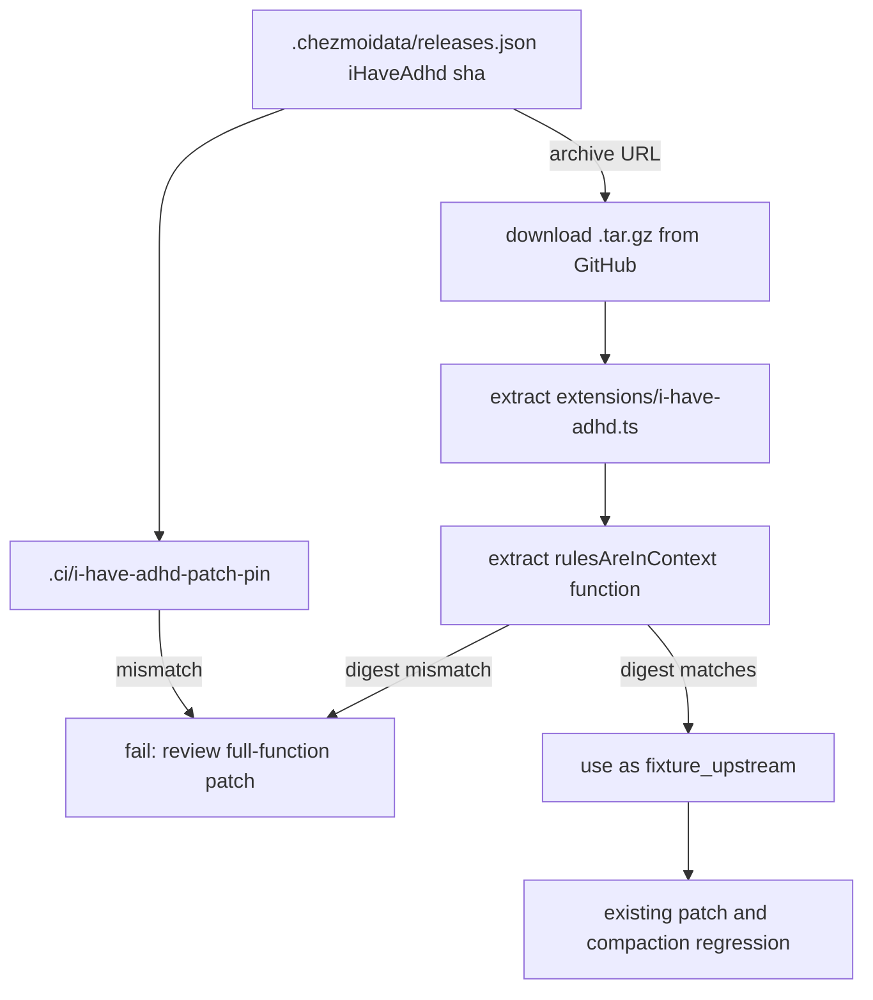

# Fix i-have-adhd upstream fixture static pin in test - Plan

## Goal Capsule

- **Objective:** Replace the hand-copied upstream `rulesAreInContext()` fixture in `.ci/test-omp-agent-reconcile.sh` with a fixture extracted from the pinned archive, and add a static pin assertion that forces explicit compatibility review when the release lock SHA changes.
- **Authority hierarchy:** The residual review finding in `docs/residual-review-findings/georgians-c98cb05.md` defines the problem. This plan defines the mechanism. The pinned upstream extension and the existing patch script define the compatible upstream and patched function shapes.
- **Stop conditions:** The pinned archive or its `extensions/i-have-adhd.ts` path becomes unavailable; the test cannot extract the upstream function deterministically.
- **Execution profile:** Change only the test script and add a small pin file. Do not change the release lock, the patch script template, or the marketplace authority.
- **Tail ownership:** Execute U1 before U2. Run the rendered-script test and the repository-required source-state checks before shipping.

---

## Product Contract

### Summary

The residual review finding `georgians-c98cb05` notes that `.ci/test-omp-agent-reconcile.sh` builds a synthetic upstream loader by hand-copying the `rulesAreInContext()` function. Because the i-have-adhd release lock resolves a moving `refs/heads/main` source to a SHA, a future lock update can change the upstream function while the test fixture remains unchanged. This allows the compatibility patch to be exercised against stale upstream code.

### Problem Frame

The test currently defines `fixture_upstream` as a heredoc. That heredoc was copied from the pinned upstream extension at the time the feature was authored. The release lock already records a full SHA, so the repository knows exactly which upstream archive it expects. The test, however, has no explicit linkage to that SHA or to the archive contents. The patch script template also hand-codes the upstream and patched function bodies, but the patch script is the apply-time mechanism, not the test's upstream oracle.

### Requirements

**Static pin and archive extraction**

- R1. The test must extract the upstream `rulesAreInContext()` function from the archive that the release lock pins, rather than using a hand-copied fixture.
- R2. A static pin file must record the reviewed upstream SHA and the expected SHA-256 digest of the extracted upstream function. The test must fail closed when the release lock SHA differs from the pin file, or when the extracted function digest differs from the recorded digest.
- R3. The pin assertion must print a clear, actionable error that tells the maintainer to review the full-function patch before updating the pin.
- R4. The pin file must be stored in `.ci/` and be readable by the test script without external tooling beyond POSIX shell utilities, `jq`, `curl`, and `sha256sum`.

**Patch and test behavior preservation**

- R5. The patched `rulesAreInContext()` fixture in the test must remain the source of truth for the expected patched output, because the patched form is defined by the managed compatibility patch, not by upstream.
- R6. The existing first-run patch, idempotence, drift-rejection, and compaction-regression assertions must continue to pass unchanged.
- R7. The release lock pin and the patch script template must not be modified by this work.

### Acceptance Examples

- AE1. Pin matches current lock
  - **Covers:** R1, R2, R3, R4
  - **Given** the release lock SHA matches the static pin file, **when** the test extracts the upstream function from the pinned archive, **then** the SHA-256 digest matches the recorded digest and the upstream fixture is used to exercise the patch.
- AE2. Lock advances without review
  - **Covers:** R2, R3
  - **Given** a release-lock refresh changes the i-have-adhd SHA, **when** the test runs before the pin file is updated, **then** the test fails with a message naming the new SHA and instructing a review of the full-function patch.
- AE3. Upstream function changes at the same pin
  - **Covers:** R1, R2
  - **Given** the release lock SHA is unchanged but the archive contents change (e.g., a force-push on the pinned SHA), **when** the test extracts the upstream function, **then** the digest mismatch fails and prevents silent compatibility drift.
- AE4. Existing patch and compaction tests still pass
  - **Covers:** R5, R6
  - **Given** the upstream and patched fixtures are unchanged, **when** the rendered patch script runs and the runtime regression fixture executes, **then** all existing assertions succeed.

### Scope Boundaries

- Do not change the pinned i-have-adhd SHA in `.chezmoidata/releases.json`.
- Do not change the patch script template in `.chezmoiscripts/70-agents/run_after_patch-i-have-adhd-extension.sh.tmpl`.
- Do not change the marketplace authority, chezmoi external, or updater logic.
- Do not generalize the pinning mechanism to other marketplaces in this work.

---

## Planning Contract

### Key Technical Decisions

- KTD1. **Extract the upstream fixture from the pinned archive at test time.** This removes the hand copy and makes the test oracle track the exact upstream code the release lock selects. The archive URL is constructed from the release-lock SHA using the same GitHub archive pattern that chezmoi external uses. Governs U1; cites R1.
- KTD2. **Add a static pin file that records the reviewed upstream SHA and a SHA-256 digest of the extracted function.** The pin file makes the review gate explicit and durable, and it lets the test fail fast when the lock changes without requiring a full archive download. The digest catches content changes even when the SHA is unchanged. Governs U1; cites R2, R3.
- KTD3. **Keep the patched fixture as a hand-coded heredoc.** The patched form is authored by this repository's compatibility patch, not by upstream. The test already compares the rendered patch script's output against that fixture; the upstream fixture must be the only thing that changes when the lock updates. Governs U1; cites R5.
- KTD4. **Use `curl` and `tar` for archive extraction, with clear failure diagnostics.** The CI environment already has network access for tool downloads. Using POSIX `tar` and `curl` keeps the test self-contained and avoids adding a dependency on chezmoi external extraction inside the test. Governs U1; cites R4.

### High-Level Technical Design

### Risks and Dependencies

- The test now depends on network access to GitHub to download the archive. This is acceptable because the CI job already downloads tools and archives, but offline local test runs will fail.
- The upstream archive path `extensions/i-have-adhd.ts` must remain stable. If upstream moves or renames the extension, the test must fail closed, which is correct behavior.
- The `extract_rules_function` awk pattern used in the patch script can be reused to extract the function from the downloaded file, keeping extraction semantics identical.

### Sequencing

U1 establishes the static pin file and the archive-extraction path in the test.
U2 updates the test assertions to use the extracted upstream fixture and adds the pin/digest checks.

---

## Implementation Units

### U1. Add static pin file and archive extraction helper

- **Goal:** Create a durable pin file and a test helper that downloads the pinned archive and extracts the upstream `rulesAreInContext()` function.
- **Requirements:** R1, R2, R3, R4
- **Dependencies:** none
- **Files:** `.ci/i-have-adhd-patch-pin`, `.ci/test-omp-agent-reconcile.sh`
- **Approach:**
  - Create `.ci/i-have-adhd-patch-pin` with a simple `KEY=value` format:
    - `source=ayghri/i-have-adhd`
    - `sha=2ed064090711586e0c97a2fbbf15465fe8f1808b`
    - `rulesAreInContext_sha256=<computed digest of the upstream function>`
  - Add a helper function in the test script that reads the release-lock SHA with `jq`, compares it to the pin file, and on mismatch prints a failure naming both SHAs and instructing the maintainer to review the patch and update the pin file.
  - Add a helper that constructs the archive URL from the pinned SHA, downloads it with `curl`, extracts `extensions/i-have-adhd.ts`, and extracts the `rulesAreInContext()` function using the same awk logic already present in the patch script.
  - Compute the SHA-256 digest of the extracted function and compare it to the pin file; on mismatch fail with a clear message.
- **Patterns:** Reuse the `extract_rules_function` awk from `.chezmoiscripts/70-agents/run_after_patch-i-have-adhd-extension.sh.tmpl`. Use the same GitHub archive URL shape that `.chezmoiexternals/ai-agents.toml` emits: `https://github.com/ayghri/i-have-adhd/archive/<sha>.tar.gz` with `stripComponents=1`.
- **Test Scenarios:**
  - The current release-lock SHA matches the pin file and the extracted function digest matches the recorded digest.
  - A manually changed pin file SHA causes the test to fail before any archive download.
  - A manually changed pin file digest causes the test to fail after extraction.
- **Verification:** Run the test script with the existing CI harness arguments and confirm the new helpers execute before the existing patch tests.

### U2. Replace hand-copied upstream fixture with extracted fixture

- **Goal:** Remove the hand-copied `fixture_upstream` heredoc and use the archive-extracted function instead.
- **Requirements:** R5, R6, R7
- **Dependencies:** U1
- **Files:** `.ci/test-omp-agent-reconcile.sh`
- **Approach:**
  - Delete the `fixture_upstream` heredoc and the line that concatenates it into the loader.
  - Replace the construction of the synthetic loader so it uses the extracted upstream function as the first-pass input to the patch script.
  - Keep the `fixture_patched` heredoc and the comparison logic intact.
  - Ensure the extraction and digest checks happen once, before the first patch run, so a mismatch fails early.
- **Patterns:** Preserve the existing `cat "$fixture_prefix" ... >"$loader"` loader construction; only replace the upstream function source.
- **Test Scenarios:**
  - The first patch run transforms the extracted upstream loader into the patched loader.
  - The second patch run is a no-op.
  - The compaction regression fixture still loads the patched extension and passes the four-state injection sequence.
- **Verification:** Run `.ci/test-omp-agent-reconcile.sh` through the existing `oh-my-pi agent integration` rendered-artifact setup and confirm the full test passes.

---

## Verification Contract

| Scope | Units | Proof |
| --- | --- | --- |
| Static pin file | U1 | `cat .ci/i-have-adhd-patch-pin` shows the correct SHA and digest; a manual mismatch causes the test to fail with the expected message. |
| Archive extraction | U1, U2 | Run the test script; the extracted function matches the recorded digest and the upstream fixture is used. |
| Patch and compaction regression | U2 | Run the existing `.ci/test-omp-agent-reconcile.sh` integration harness and observe all existing assertions pass. |
| Source-state safety | U1, U2 | Run `git diff --check`, `git status`, and a diff limited to `.ci/test-omp-agent-reconcile.sh` and `.ci/i-have-adhd-patch-pin`. |
| CI | U1, U2 | The `oh-my-pi agent integration` job runs the changed harness. |

---

## Definition of Done

- U1 creates `.ci/i-have-adhd-patch-pin` with the current upstream SHA and the SHA-256 digest of the upstream `rulesAreInContext()` function.
- U1 adds helpers that fail closed on lock/pin SHA mismatch and on digest mismatch.
- U2 removes the hand-copied upstream fixture from the test script and uses the archive-extracted function.
- The existing patch first-run, no-op, drift, and compaction assertions continue to pass.
- The release lock, patch script template, and marketplace authority are unchanged.
- The rendered-artifact regression and required source-state checks pass.
- Cleanup removes any temporary archive download artifacts from the final diff.
