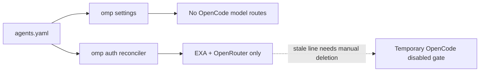

# Remove omp OpenCode Providers - Plan

## Goal Capsule

- **Objective:** Remove the `opencode-go` and `opencode-zen` model-provider integrations from the managed omp configuration and remove every managed OpenCode API-key path.
- **Authority:** The user's request defines the removal scope. `AGENTS.md` defines chezmoi source ownership, no-teardown policy, closed credential reconciliation, and isolated verification.
- **Execution profile:** This is a source-state cutover. Do not apply to live `$HOME`, edit a live dotenv file, or delete a 1Password item. Prove the rendered source and the existing isolated omp reconciliation contract.
- **Stop conditions:** Stop if removing an OpenCode hop leaves a fallback chain empty or removes a role's primary selector. Stop if the final source still resolves `op://Private/Opencode/API Key` outside historical plan records.
- **Residual policy:** The omp dotenv reconciler preserves undeclared lines. A pre-existing `OPENCODE_API_KEY=` line can remain on a deployed host and needs one manual deletion. No teardown script is added.

## Product Contract

### Summary

The repository currently exposes OpenCode model providers through `OPENCODE_API_KEY`, an override-only `opencode-go` model block, and two fallback-chain hops. Remove those active routes and narrow the managed omp dotenv contract to `EXA_API_KEY` and `OPENROUTER_API_KEY`. Keep OpenRouter unchanged.

### Problem Frame

The OpenCode credential enables both `opencode-go` and `opencode-zen`. The current settings use `opencode-go` as a Kimi metadata override and as a retry hop for the Anthropic and advisor tiers. The auth provisioner also fetches and reconciles `op://Private/Opencode/API Key`. Removing only the data entry would leave stale host dotenv content unmanaged, and removing only the route entries would still resolve the secret on every apply. The change must remove both sources of integration while preserving the closed-set and fallback validation contracts.

### Requirements

**Provider routing**

- R1. `agents.omp.models.providers` contains no `opencode-go` provider block or OpenCode model override.
- R2. `agents.omp.settings.retry.fallbackChains` contains no `opencode-go/` selector, and every affected chain remains non-empty with its surviving order documented.
- R3. No active omp model role, task override, fallback chain, or model metadata selector names `opencode-go` or `opencode-zen`.
- R4. The provider availability gate keeps both retiring providers out of automatic catalog-wide selection during the stale-dotenv cleanup window; its comment names the trigger for removing the temporary guard.

**Credential removal**

- R5. `agents.omp.auth.env` declares exactly `EXA_API_KEY` and `OPENROUTER_API_KEY`; it contains no `OPENCODE_API_KEY` record or `op://Private/Opencode/API Key` reference.
- R6. `.chezmoiscripts/70-agents/run_after_config-omp-auth.sh.tmpl` enforces the same ordered two-name closed set and continues to reject unsupported, missing, duplicate, empty, and non-string entries.
- R7. CI fixtures and reconciliation assertions contain no OpenCode API-key sentinel or managed-name assertion, while preserving one duplicate, one overwrite, and one insert-or-existing managed-variable coverage shape.

**Documentation and scope**

- R8. `AGENTS.md` and the data comments describe the retired OpenCode providers, the remaining OpenRouter key, and the stale-dotenv cleanup boundary without claiming that an OpenCode key is still provisioned.
- R9. Historical `docs/plans/**` records remain unchanged. OpenCode harness compatibility settings, OpenCode trust URLs, and unrelated retired-harness cleanup instructions remain out of scope.

### Acceptance Examples

- AE1. **Provider route removal.** Given the final `agents.yaml`, when the settings and models templates render, then no active selector or model override names either retiring provider, and the Anthropic and advisor chains retain their remaining non-empty hops.
- AE2. **Closed-set narrowing.** Given the auth template and data map, when they render with stubbed secrets, then the only managed names are `EXA_API_KEY` and `OPENROUTER_API_KEY`, and the OpenCode 1Password reference is never resolved.
- AE3. **Reconcile preservation.** Given a dotenv file with an unrelated assignment and duplicate/single managed assignments, when the rendered auth script runs, then unrelated content stays byte-identical, each remaining managed name appears once, and the file stays mode `0600`.
- AE4. **Fail-closed validation.** Given an unsupported `OPENCODE_API_KEY` declaration or any malformed auth entry, when the auth template renders, then it fails before script output with the two-name closed-set diagnostic or the existing shape diagnostic.
- AE5. **Stale-host safety.** Given a pre-existing unmanaged `OPENCODE_API_KEY=` line, when the source settings are asserted during the transition, then the temporary disabled-provider guard prevents automatic selection until the operator deletes that line and the guard together.

### Scope Boundaries

- Keep `OPENROUTER_API_KEY`, its 1Password reference, and the `openrouter` disabled-provider entry unchanged.
- Do not remove the `commands.enableOpencodeUser` or `commands.enableOpencodeProject` settings. They disable omp compatibility discovery and are not model-provider integrations.
- Do not edit `docs/plans/**`; those files are historical records and may contain the prior credential contract.
- Do not add a teardown/revert script, edit a live `~/.omp/agent/.env`, revoke OAuth grants, or delete the 1Password item.
- Do not replace OpenCode hops with new providers. The remaining chain hops are sufficient and replacement routing would expand scope.

### Dependencies and Risks

- The auth reconciler intentionally preserves undeclared dotenv assignments, so source removal alone cannot remove a live `OPENCODE_API_KEY=` line.
- The settings catalog gate validates declared selectors only. Removing all OpenCode selectors avoids a missing-provider failure on fresh hosts.
- The existing model-validation fixtures are coupled to the only production override. They must move to a surviving provider fixture rather than be deleted.
- The two-name allowlist is a security boundary. A name-shape check or a silent optional-key change would allow arbitrary environment injection or weaken completeness detection.

## Planning Contract

### Key Technical Decisions

- KTD1. **Drop OpenCode fallback hops without replacement.** Each affected chain retains at least one surviving provider, so replacement routing would change policy beyond the requested de-integration. The implementation must verify chain non-emptiness before and after the edit.
- KTD2. **Keep a temporary disabled-provider guard for both OpenCode provider IDs.** The auth reconciler preserves an undeclared `OPENCODE_API_KEY=` line on existing hosts, so deleting the managed key alone leaves a catalog-wide selection window. The guard is removed together with the stale dotenv line after the operator performs the one-time cleanup.
- KTD3. **Keep production model metadata empty and move validator fixtures to Anthropic.** The `opencode-go` override has no remaining consumer after the route removal. The validator still needs positive and negative `modelOverrides` coverage, so tests use a declared Anthropic selector instead of deleting that coverage.
- KTD4. **Narrow the existing allowlist in place.** Update the data comment, the `$required` list, the reconciliation fixture, and the CI stub without extracting a shared partial. This keeps a narrow credential change reviewable and preserves the current render-time failure behavior.
- KTD5. **Leave historical plans untouched.** The repository's prior provider plans record their state at the time of each change. The live-source absence sweep excludes `docs/plans/**` and checks all active configuration and test surfaces instead.

### Technical Design

The source data becomes the single cutover point. The `models.providers` map becomes empty, the two OpenCode fallback hops are deleted, and the `disabledProviders` list carries both provider IDs as temporary safety gates. The auth data and template narrow to `EXA_API_KEY` and `OPENROUTER_API_KEY`. The existing reconciliation test keeps the same file-safety assertions and changes its expected managed-name set. Model-validation fixtures replace `opencode-go` with `anthropic` while keeping the same validator branches.

The resulting flow is:

### Sequencing

1. Remove OpenCode model metadata and fallback selectors, update the provider-gate and credential comments, and add the temporary `opencode-go` guard beside the existing `opencode-zen` guard.
2. Narrow the auth template and data map to the two remaining variables.
3. Update the reconciliation test, validator fixtures, and CI secret stub.
4. Render all changed templates, run the isolated reconciliation test, run static absence and chain-integrity checks, then inspect the scoped diff.

### Sources and Research

- `.chezmoidata/agents.yaml` — current OpenCode model override, fallback hops, disabled-provider gate, and auth declarations.
- `.chezmoiscripts/70-agents/run_after_config-omp-auth.sh.tmpl` — strict allowlist, completeness check, and preserve-undeclared dotenv behavior.
- `.chezmoitemplates/omp-settings-validate.tmpl` — parasitic model-override validation and declared-selector coupling.
- `.ci/test-omp-agent-reconcile.sh` — managed-name, fixture, and render-negative coverage that must remain after narrowing.
- `.github/workflows/ci.yml` — render-time `op` stub and the integration-test argument contract.
- `docs/plans/2026-08-06-001-chore-remove-expired-zai-provider-plan.md` — repository precedent for credential removal, temporary disabled-provider guards, residual reporting, and no-teardown policy.

## Implementation Units

### U1. Remove OpenCode model routes and metadata

- **Goal:** Make OpenCode providers absent from active omp routing and remove the orphaned model override.
- **Requirements:** R1, R2, R3, R4, R8. Implements KTD1, KTD2, and KTD3.
- **Dependencies:** None.
- **Files:** `.chezmoidata/agents.yaml`, `AGENTS.md`.
- **Approach:** Remove the `models.providers.opencode-go` block and rewrite the related comments. Delete `opencode-go/kimi-k3` from the Anthropic chain and `opencode-go/glm-5.2` from the advisor chain. Add `opencode-go` to `disabledProviders` beside `opencode-zen` with a dated comment that couples both temporary entries to manual deletion of the stale dotenv line. Keep all other provider order and role selectors unchanged. Update `AGENTS.md` to describe the retired-provider gate and credential boundary.
- **Patterns to follow:** The existing `zai` removal note in `.chezmoidata/agents.yaml` and the provider-gate explanation in `AGENTS.md`.
- **Test scenarios:** Parse the data through the settings render. Assert no active selector or model override names `opencode-go` or `opencode-zen`; assert affected chains contain at least one hop; assert the temporary disabled list contains both IDs and the rationale names the stale-line trigger.
- **Verification:** Render `run_after_config-omp-settings.sh.tmpl` with the repository stub recipe and run the existing settings-negative fixtures.

### U2. Remove the OpenCode API key from the managed auth contract

- **Goal:** Make the auth data and rendered reconciler manage only Exa and OpenRouter credentials.
- **Requirements:** R5, R6, R8. Implements KTD4.
- **Dependencies:** U1.
- **Files:** `.chezmoidata/agents.yaml`, `.chezmoiscripts/70-agents/run_after_config-omp-auth.sh.tmpl`.
- **Approach:** Delete the `OPENCODE_API_KEY` record and its `op://Private/Opencode/API Key` reference. Update the closed-set comment. Narrow `$required` to `EXA_API_KEY` and `OPENROUTER_API_KEY`. Keep all existing validation, base64 transport, safe dotenv parsing, duplicate replacement, and mode handling unchanged.
- **Patterns to follow:** The existing `join ", " $required` diagnostic and strict membership/completeness loops.
- **Test scenarios:** Render with Exa and OpenRouter stub values. Confirm the two ordered names and values. Render an `OPENCODE_API_KEY` declaration and confirm the unsupported-variable error names the two-name set. Confirm empty, duplicate, empty-key, and non-string-key negatives still fail.
- **Verification:** Render the auth template with a newline-free `op` stub, run `bash -n` on the output, and inspect the rendered script for the two-name `MANAGED_NAMES` array.

### U3. Preserve reconciliation and model-validator coverage

- **Goal:** Update tests to prove the narrowed credential set and keep model metadata validation without any OpenCode fixture.
- **Requirements:** R7, R1, R3. Implements KTD3 and KTD4.
- **Dependencies:** U1 and U2.
- **Files:** `.ci/test-omp-agent-reconcile.sh`, `.github/workflows/ci.yml`.
- **Approach:** Remove the OpenCode sentinel from the CI `op` stub. Change the fixture comments and expected managed-name list to the two remaining variables. Use one fixture pass with a duplicated Exa assignment and a stale OpenRouter assignment to prove duplicate collapse and overwrite. Use a second fixture pass with only Exa present to prove OpenRouter insertion. Preserve unrelated lines in both passes. Replace the model-keyed positive and negative fixtures with `anthropic/claude-opus-5` and `anthropic` override records. Keep the unknown-provider, non-override-field, credential-reference, and provider-key negatives intact.
- **Patterns to follow:** Existing `grep -c` exact-count checks, ordered-name comparison, `assert_render_fails`, and model metadata fixtures.
- **Test scenarios:** The isolated reconcile script passes with exactly two managed assignments, no OpenCode sentinel, and all three existing reconciliation shapes covered across its two fixture passes. The settings/model fixture still has one valid override and rejects undeclared model IDs, non-override keys, `op://` values, and unsafe provider keys. A rendered CI stub has no OpenCode key branch.
- **Verification:** Run `.ci/test-omp-agent-reconcile.sh` with freshly rendered auth, plugin, settings, and haptic package inputs, as `.github/workflows/ci.yml` does.

### U4. Verify the cutover and residual boundary

- **Goal:** Prove the final source renders, tests pass, and no active OpenCode credential path remains.
- **Requirements:** All requirements.
- **Dependencies:** U1, U2, U3.
- **Files:** None.
- **Approach:** Render changed scripts with the isolated `chezmoi execute-template` recipe and the repo's newline-free `op` stub. Build the existing haptic package only as required by the reconciliation harness. Run the full absence sweep outside `docs/plans/**`, including `OPENCODE_API_KEY`, `op://Private/Opencode/API Key`, `opencode-go/`, and `opencode-zen` active-route occurrences. Run chain-integrity checks and `git diff --check`. Do not apply to live `$HOME`.
- **Patterns to follow:** The root `AGENTS.md` isolated verification recipe and the prior Z.ai removal plan's U6 verification shape.
- **Test scenarios:** Auth/settings templates render successfully. The reconcile harness passes. The absence sweep allows only documented temporary disabled-provider guards and explanatory comments, while no active selector, override, auth declaration, or CI secret fixture remains.
- **Verification:** Record render output, test exit status, absence-sweep results, scoped diff, and any expected manual stale-dotenv residue in the implementation receipt and PR description.

## Verification Contract

- **Render source templates:** Use a scratch `HOME`, empty chezmoi config, `--source "$PWD"`, and a stub `op` that returns newline-free values. Render `.chezmoiscripts/70-agents/run_after_config-omp-auth.sh.tmpl` and `.chezmoiscripts/70-agents/run_after_config-omp-settings.sh.tmpl`.
- **Check auth shape:** Run `bash -n` on the rendered auth script. Assert `MANAGED_NAMES` contains only `EXA_API_KEY` and `OPENROUTER_API_KEY`; assert the rendered text contains no `OPENCODE_API_KEY` or `op://Private/Opencode/API Key`.
- **Run reconciliation coverage:** Build the existing `packages/mxm4-haptic` package when needed and run `.ci/test-omp-agent-reconcile.sh` with the same four arguments used by `.github/workflows/ci.yml`. This proves mode `0600`, duplicate collapse, single-value overwrite, insertion of a missing managed key, unmanaged-line preservation, malformed/symlink safety, auth render negatives, settings validation, and plugin/settings integration.
- **Check provider policy:** Parse `.chezmoidata/agents.yaml` and assert no `opencode-go` or `opencode-zen` occurs in `modelRoles`, `task.agentModelOverrides`, `retry.fallbackChains`, or `models.providers`. Assert every fallback chain is non-empty. Assert the temporary disabled-provider guard is present for both IDs and is documented as removable with the stale dotenv line.
- **Sweep active references:** Search all non-historical source, templates, scripts, CI, tests, and user-facing docs for `OPENCODE_API_KEY` and `op://Private/Opencode/API Key`; allow only the documented stale-dotenv comments, and expect zero auth declarations, secret-resolution references, rendered script names, or CI sentinels. Search provider IDs and classify only the temporary gate and its explanatory text as intentional.
- **Check scope:** Run `git diff --check`, `git status`, and a diff limited to the plan, data, auth script, root policy, reconciliation test, and CI stub. Do not run `chezmoi apply` against the real home.
- **CI gate:** After push, `.github/workflows/ci.yml` and `.github/workflows/render-dotfiles.yml` must reach terminal success through the PR watcher.

## Definition of Done

- `opencode-go` and `opencode-zen` have no active omp selector, model override, or credential declaration; the temporary disabled gate protects existing hosts during manual stale-line cleanup.
- `OPENCODE_API_KEY` and `op://Private/Opencode/API Key` are absent from all active source, template, test, and workflow files outside historical `docs/plans/**`.
- The managed auth closed set is exactly `EXA_API_KEY` and `OPENROUTER_API_KEY`, with existing strict validation and safe reconciliation behavior intact.
- Fallback chains remain non-empty and preserve every surviving role primary and provider order outside the removed hops.
- The isolated render and reconciliation checks pass, including model metadata validation through surviving Anthropic fixtures.
- The scoped diff is clean, contains no teardown or placeholder code, and leaves unrelated OpenCode harness compatibility settings and historical records unchanged.
- The pull-request CI workflow reaches terminal success, or the pipeline reports the exact CI blocker instead of claiming completion.
