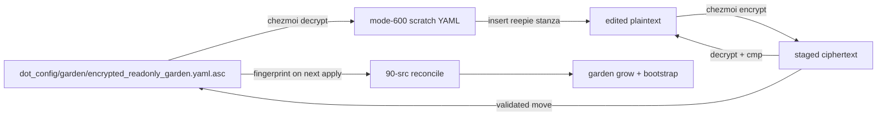

# Register reepie in the ~/src Garden Registry - Plan

## Goal Capsule

- **Objective:** Declare `https://github.com/mcbx-kr/reepie.git` in the encrypted garden registry so the normal `garden grow` and 90-src bootstrap flow can provision it.
- **Authority:** The user's URL and target file define the requested change. The garden manifest's documented tree shapes and the repository instructions define the encrypted edit flow and path conventions.
- **Execution profile:** Lightweight data change — one bare-tree stanza in one GPG-encrypted YAML source.
- **Stop conditions:** Stop rather than broaden scope if the ciphertext cannot be decrypted, the edited plaintext does not round-trip byte-for-byte, the manifest parser rejects the new tree, or the repository appears to require a non-bare/tool-only shape not established by the request.
- **Tail ownership:** The LFG pipeline owns commit, push, pull-request creation, and CI monitoring.

## Product Contract

### Summary

Add a `reepie` tree under `trees:` in `dot_config/garden/encrypted_readonly_garden.yaml.asc`, using the supplied URL and the repository's default bare-tree shape. Keep the decrypted YAML only in per-user scratch during the edit, then re-encrypt and replace the source only after the staged ciphertext passes a round-trip gate.

### Problem Frame

The garden registry is the source of truth for projects provisioned below `~/src`. Its existing first-party code entries use a bare repository at `<host>/<group>/<project>/.bare`, `bare: true`, and an explicit remote fetch refspec. The requested GitHub repository has no existing declaration. A declaration-only change is sufficient: the existing 90-src reconcile script already fingerprints this encrypted source, grows every declared tree, validates bare and non-bare clone shapes, and runs the bootstrap commands.

The requested repository is a private GitHub repository with `main` as its default branch and a minimal README. No request signal identifies it as a third-party tool that must remain a plain clone, so the standard code-project bare shape is the conservative repository-consistent choice.

### Requirements

- **R1.** A new `trees.reepie` entry exists with `url: https://github.com/mcbx-kr/reepie.git`.
- **R2.** The entry resolves to `github.com/mcbx-kr/reepie/.bare`, carries `bare: true`, and includes `remote.origin.fetch: "+refs/heads/*:refs/remotes/origin/*"`.
- **R3.** The source change is limited to the new tree declaration; existing trees, comments, commands, and provisioner logic remain unchanged.
- **R4.** The new ciphertext decrypts to the intended YAML, the garden parser accepts it, and no plaintext registry copy enters the worktree.
- **R5.** The encrypted-source fingerprint consumed by the 90-src reconcile script changes with the ciphertext, so the next user-initiated apply can reconcile the newly declared tree.

### Scope Boundaries

**In scope:** One `trees:` insertion in `dot_config/garden/encrypted_readonly_garden.yaml.asc`; decrypt/edit/staged re-encrypt; round-trip, parse, fingerprint, and hygiene verification.

**Out of scope:**

- Running `garden grow`, `garden cmd`, `chezmoi apply`, or any real clone/network operation.
- Creating or removing the `~/src/github.com/mcbx-kr/reepie` checkout or an aoe session.
- Changing the 90-src reconcile script, `src-audit`, `.chezmoiignore`, package/auth configuration, or garden commands.
- Adding a `worktree:` declaration or treating the repository as a non-bare third-party tool without an explicit requirement.
- Editing the deployed garden target or committing decrypted YAML.

## Planning Contract

### Key Technical Decisions

- **KTD1. Bare tree for a code repository.** Use the established first-party shape rather than a plain clone: the registry's default development layout is a `.bare` repository with aoe-owned worktrees, while non-bare entries are reserved for explicitly tool-like clones. This keeps the new private repository usable through the existing bootstrap contract without adding a second shape.
- **KTD2. Namespace-derived path.** Map the GitHub URL to `github.com/mcbx-kr/reepie/.bare`: `github.com` is the host, `mcbx-kr` is the group, and `reepie` is the project leaf. No path override is needed.
- **KTD3. Preserve the supplied HTTPS URL verbatim.** The user's URL is authoritative; the existing GitHub credential setup handles authentication during a later apply, and this registry edit carries no credentials.
- **KTD4. Stage ciphertext before replacing the source.** Encrypt to a scratch file, decrypt that staged file, and compare it to the edited plaintext before moving it over the canonical source. Direct redirection to the source can truncate the only ciphertext if encryption fails.
- **KTD5. No registry-specific test file.** This is data-only. The manifest parser, ciphertext round-trip, source fingerprint, and existing reconcile shape checks provide the observable coverage without adding a test harness for one declaration.

### High-Level Technical Design



The implementation edits only the scratch plaintext. The staged ciphertext becomes the source after the round-trip gate. Verification parses the staged plaintext with the installed garden CLI but does not grow the tree or contact GitHub.

### Assumptions

- The host has the GPG private key and the configured chezmoi encryption settings needed to decrypt and re-encrypt the source.
- `chezmoi`, `garden`, `git`, and the standard POSIX scratch utilities are available.
- The repository owner intends `reepie` to participate in the normal code-project garden workflow. If that assumption is false, implementation must stop before editing and the tree shape must be explicitly re-scoped.

## Implementation Units

### U1. Add the reepie tree declaration

**Goal:** Add one valid bare-tree entry and no unrelated manifest changes.

**Requirements:** R1, R2, R3, R4, R5

**Dependencies:** none

**Files:**

- `dot_config/garden/encrypted_readonly_garden.yaml.asc` — decrypt to scratch, edit, stage, validate, and replace the ciphertext.

**Approach:**

Create a `0700` scratch directory beneath `${XDG_RUNTIME_DIR:-$HOME/.cache}` with `umask 077` and an exit cleanup trap. Run chezmoi with `--source "$PWD"` because this checkout is a nested worktree. Decrypt the source to scratch, insert the following stanza among the in-root bare trees before the root-external `dotfiles` entry, and preserve the existing two-space indentation and field order:

```yaml
  reepie:
    path: github.com/mcbx-kr/reepie/.bare
    url: https://github.com/mcbx-kr/reepie.git
    bare: true
    gitconfig:
      remote.origin.fetch: "+refs/heads/*:refs/remotes/origin/*"
```

Encrypt the edited plaintext to a second scratch file. Decrypt that staged ciphertext and compare it with the edited plaintext. Only after the comparison succeeds, move the staged ciphertext over `dot_config/garden/encrypted_readonly_garden.yaml.asc`. Remove all scratch plaintext and staged files through the cleanup trap.

**Patterns to follow:** Existing bare entries such as `dimse-bridge` in the decrypted manifest for a direct top-level GitHub namespace; `.chezmoiscripts/90-src/run_onchange_after_reconcile-garden.sh.tmpl` for the encrypted-source fingerprint and bare-tree validation; the manifest header's staged decrypt/edit/re-encrypt procedure.

**Test scenarios:**

- **Covers R1/R2.** The decrypted edited YAML contains exactly one `reepie` tree with the supplied URL, namespace-derived `.bare` path, `bare: true`, and the quoted fetch refspec.
- **Covers R3.** A plaintext diff against the pre-edit decrypt shows only the six new YAML lines; no existing tree, comment, or command body changes.
- **Covers R4.** Decrypting the staged ciphertext and comparing it with the edited plaintext succeeds before the source is replaced.
- **Covers R4.** `garden --config <scratch>/garden.yaml ls --all --no-commands --no-remotes --no-gardens --no-groups -v` accepts the manifest and resolves `reepie` to `github.com/mcbx-kr/reepie/.bare` without growing it.
- **Covers R5.** Rendering the 90-src reconcile script shows a fingerprint for `dot_config/garden/encrypted_readonly_garden.yaml.asc` equal to the source ciphertext's SHA-256.
- **Covers hygiene.** After cleanup, no decrypted registry file exists in the worktree, `git status --porcelain` shows only the intended ciphertext and plan artifacts, and `git diff --check` is clean.
- **Covers the failure boundary.** If the staged round-trip comparison is forced to fail, the source ciphertext remains unchanged and the scratch directory is removed.

**Verification:** Run all scenarios locally. Do not run `chezmoi apply`, `garden grow`, `garden cmd`, or a command that reaches GitHub.

## Verification Contract

Run from the checkout root. Keep plaintext only beneath a `0700` scratch directory under `${XDG_RUNTIME_DIR:-$HOME/.cache}`; never use `/tmp`, `/var/tmp`, or `/dev/shm`.

| Gate | Evidence | Proves |
|---|---|---|
| Source decrypt | `chezmoi --source "$PWD" decrypt dot_config/garden/encrypted_readonly_garden.yaml.asc > "$scratch/current.yaml"` | The configured GPG key and source path work; plaintext stays outside the worktree |
| Staged round-trip | `chezmoi --source "$PWD" decrypt "$scratch/reenc.asc" \| cmp - "$scratch/edited.yaml"` | The replacement ciphertext preserves the exact edited plaintext before the move |
| Manifest parse | `garden --config "$scratch/edited.yaml" ls --all --no-commands --no-remotes --no-gardens --no-groups -v` | The new tree shape and path are accepted without network provisioning |
| Fingerprint | Render `.chezmoiscripts/90-src/run_onchange_after_reconcile-garden.sh.tmpl` and compare its registry fingerprint to `sha256sum dot_config/garden/encrypted_readonly_garden.yaml.asc` | The next apply sees the registry change |
| Scoped hygiene | `git diff --check`, `git status --short`, and a scoped diff review | No plaintext leak, whitespace damage, or unrelated source edit |

Prohibited as verification: `chezmoi apply`, `garden grow`, `garden cmd`, real `aoe` operations, and any operation that clones or fetches `https://github.com/mcbx-kr/reepie.git`.

## Risks & Dependencies

- **Plaintext leak:** Mitigated by `umask 077`, a scratch directory outside the worktree, an exit trap, and a final status check.
- **Ciphertext loss:** Mitigated by encrypting to a staged file and validating its decrypt before `mv`; never redirect encryption directly onto the canonical source.
- **Wrong tree shape:** The path and bare/refspec fields mirror the existing code-project contract. If the repository's intended use is tool-only, stop rather than silently changing it to non-bare.
- **Apply-time side effects:** The ciphertext fingerprint intentionally causes the existing 90-src script to run on the next user-initiated apply. That later action may clone over HTTPS and create an aoe session; it is outside this implementation's verification boundary.
- **Private repository access:** The supplied URL is stored without credentials. A later apply depends on the existing native GitHub credential helper and non-interactive prompt policy.

## Definition of Done

- R1 through R5 hold.
- The staged ciphertext round-trip and garden parse gates pass.
- The source ciphertext is the only requested manifest file changed; no plaintext registry copy remains.
- `git diff --check` is clean and the scoped diff contains no unrelated source edits.
- No live apply, clone, fetch, or aoe mutation was performed.
- The LFG shipping tail creates the required commit and handles remote delivery and CI.

## Sources & Research

- `dot_config/garden/encrypted_readonly_garden.yaml.asc` decrypted to scratch — current tree schema, bare/non-bare conventions, existing namespace mappings, and the sanctioned edit procedure.
- `.chezmoiscripts/90-src/run_onchange_after_reconcile-garden.sh.tmpl` — encrypted-source fingerprint, grow completeness check, and additive bootstrap behavior.
- `docs/plans/2026-07-30-001-chore-garden-register-examvueduo-ai-plan.md` — repository precedent for registering a code repository as a bare tree and validating staged GPG ciphertext.
- GitHub repository metadata for `mcbx-kr/reepie` — private repository, default branch `main`, active, with a minimal README; used only to confirm the requested resource and the absence of a third-party-tool signal.
