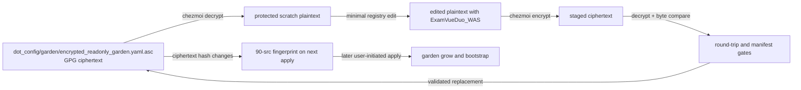

# Register ExamVueDuo_WAS in the ~/src Garden Registry - Plan

## Goal Capsule

- **Objective:** Declare `https://git.jpi.app/products/examvue-duo/ExamVueDuo_WAS.git` in the encrypted garden registry as a bare development tree.
- **Authority:** The supplied URL and the user's confirmed bare-tree choice define the requested behavior. Repository instructions and the live registry schema define the safe edit and path conventions.
- **Execution profile:** Data-only change to one GPG ciphertext source. Decrypted YAML exists only in a protected per-user scratch directory.
- **Stop conditions:** Stop before replacing the source if decryption fails, the staged ciphertext does not round-trip byte-for-byte, the manifest parser rejects the declaration, or an authenticated repository check proves that the supplied URL is invalid.
- **Tail ownership:** The implementer commits the source change. Deployment remains user-initiated because `chezmoi apply` performs network clones and aoe mutations.

## Product Contract

### Summary

Add `ExamVueDuo_WAS` to the encrypted garden registry so the existing 90-src reconciliation flow can grow and bootstrap it with the other `examvue-duo` repositories. Preserve the supplied URL and the standard bare development-tree shape.

### Problem Frame

The garden registry is the source of truth for projects provisioned below `~/src`. The current registry already contains `examvue-apps` and `ExamVueDuo_AI` under the same GitLab product subgroup. It has no `ExamVueDuo_WAS` declaration, so the existing grow and bootstrap flow cannot provision it.

The requested GitLab URL redirects to sign-in for anonymous web access, and the authenticated API lookup available during planning returned HTTP 404. The URL remains authoritative because the user supplied it directly. The plan does not depend on the repository's default branch or visibility metadata.

### Requirements

- R1. The registry declares a tree named `ExamVueDuo_WAS` with the supplied URL unchanged.
- R2. The tree resolves to `git.jpi.app/examvue-duo/ExamVueDuo_WAS/.bare`, carries `bare: true`, and declares the standard remote fetch refspec.
- R3. The change adds one registry declaration and does not modify reconciliation scripts, ignore rules, authentication, or existing tree entries.
- R4. The edited plaintext is kept outside the worktree, the staged ciphertext decrypts to that exact plaintext, and the garden parser accepts the resulting manifest without provisioning the tree.
- R5. The encrypted-source fingerprint consumed by the 90-src reconcile script changes with the new ciphertext, while verification performs no live clone, fetch, apply, or aoe mutation.

### Scope Boundaries

**In scope:** One `trees.ExamVueDuo_WAS` declaration in `dot_config/garden/encrypted_readonly_garden.yaml.asc`, the protected decrypt/edit/re-encrypt cycle, and round-trip, parse, fingerprint, and hygiene verification.

**Out of scope:**

- Running `chezmoi apply`, `garden grow`, `garden cmd`, `src-audit`, or any operation that clones or fetches the supplied repository.
- Creating or changing `~/src/git.jpi.app/examvue-duo/ExamVueDuo_WAS`, an aoe worktree, or an aoe session.
- Editing the deployed `~/.config/garden/garden.yaml`, committing decrypted YAML, or adding a `worktree:` declaration.
- Changing `.chezmoiscripts/90-src/run_onchange_after_reconcile-garden.sh.tmpl`, `.chezmoiignore`, authentication setup, or registry-specific test infrastructure.
- Inferring or recording a default branch, repository visibility, or remote credentials.

## Planning Contract

### Key Technical Decisions

- KTD1. **Preserve the mixed-case tree name.** Use `ExamVueDuo_WAS` verbatim because the existing same-group `ExamVueDuo_AI` entry preserves its remote leaf and the supplied URL is authoritative.
- KTD2. **Drop the `products` umbrella from the local path.** Map the remote subgroup `products/examvue-duo` to the existing local namespace `git.jpi.app/examvue-duo`, matching `examvue-apps` and `ExamVueDuo_AI`.
- KTD3. **Use a bare development tree.** (session-settled: user-directed — chosen over a plain non-bare clone: the requested repository joins the standard managed development layout.)
- KTD4. **Preserve the supplied HTTPS URL verbatim.** The registry stores the remote address without credentials; existing native GitLab authentication handles any later apply-time access.
- KTD5. **Stage ciphertext before replacing the source.** Encrypt to a separate scratch file, decrypt that staged file, and compare it with the edited plaintext before moving it over the canonical source. This prevents an encryption failure from truncating the only committed ciphertext.
- KTD6. **Do not add a registry-specific test file.** The change is data-only. The staged round-trip, garden parser, encrypted-source fingerprint, and hygiene gates provide direct coverage without adding a one-entry test harness.

### High-Level Technical Design

The implementation edits only the scratch plaintext. The canonical source changes only after the staged ciphertext passes the byte-for-byte comparison and manifest parse. The 90-src script already fingerprints the encrypted source, validates `/.bare` trees, and performs the later grow/bootstrap lifecycle, so it needs no change.

### Assumptions

- The implementer's host has the configured GPG private key and can run `chezmoi`, `garden`, and the required scratch utilities.
- The existing `ExamVueDuo_AI` entry remains the namespace and ordering precedent at implementation time. If the registry has drifted or already contains `ExamVueDuo_WAS`, stop and reconcile the source state before editing.
- The supplied repository URL is valid for the user's GitLab account. Planning could not independently resolve its metadata, so implementation must not replace or normalize the URL based on an anonymous 404.

### System-Wide Impact

The encrypted source is deployed as `~/.config/garden/garden.yaml`. Its ciphertext fingerprint causes the existing 90-src after-script to run on the next user-initiated apply. That later run grows all declared trees, checks clone completeness, and runs the existing bootstrap commands. The registry edit itself does not touch `~/src`, network state, credentials, or aoe state.

## Implementation Units

### U1. Add the ExamVueDuo_WAS tree declaration

**Goal:** Add one valid bare-tree declaration beside the existing `examvue-duo` entries without changing any other registry content.

**Requirements:** R1, R2, R3, R4, R5

**Dependencies:** none

**Files:**

- `dot_config/garden/encrypted_readonly_garden.yaml.asc` — decrypt to scratch, edit, stage, validate, and replace the ciphertext.
- No new test file — the data-only change uses the existing manifest, fingerprint, and hygiene gates in the Verification Contract.

**Approach:**

1. Create a `0700` scratch directory beneath `${XDG_RUNTIME_DIR:-$HOME/.cache}` with `umask 077` and an exit cleanup trap before decrypting.
2. Run chezmoi with `--source "$PWD"` and decrypt the canonical source into scratch. Keep the plaintext out of the worktree and out of shared temporary directories.
3. Insert `ExamVueDuo_WAS` immediately after the existing `ExamVueDuo_AI` stanza, preserving the registry's indentation and field order. Set `path` to `git.jpi.app/examvue-duo/ExamVueDuo_WAS/.bare`, `url` to the supplied HTTPS URL, `bare` to `true`, and `gitconfig.remote.origin.fetch` to `+refs/heads/*:refs/remotes/origin/*` in the existing quoted form.
4. Encrypt the edited plaintext to a separate staged ciphertext file. Decrypt the staged file and compare it byte-for-byte with the edited plaintext before replacing the canonical source.
5. Parse the edited manifest without growing the tree, render the 90-src script to confirm its fingerprint matches the new ciphertext hash, then move the staged ciphertext over the source only after all pre-replacement gates pass.
6. Remove plaintext, staged ciphertext, and scratch helpers through the cleanup trap. Confirm that no plaintext registry copy remains.

**Patterns to follow:** The adjacent `examvue-apps` and `ExamVueDuo_AI` entries in the decrypted registry; `.chezmoiscripts/90-src/run_onchange_after_reconcile-garden.sh.tmpl` for the encrypted-source fingerprint and bare-tree contract; `.chezmoi.toml.tmpl` for GPG encryption; `dot_local/bin/executable_src-audit` for bare versus non-bare validation; and `docs/plans/2026-08-11-005-chore-garden-register-reepie-plan.md` for the staged ciphertext workflow.

**Test scenarios:**

- **Covers R1/R2.** The edited plaintext contains exactly one `ExamVueDuo_WAS` tree with the supplied URL, the namespace-derived `.bare` path, `bare: true`, and the quoted remote fetch refspec.
- **Covers R3.** A plaintext diff against the pre-edit decrypt shows only the new tree stanza; existing entries, comments, and command bodies are unchanged.
- **Covers R4.** Decrypting the staged ciphertext and comparing it with the edited plaintext succeeds before the canonical source is replaced.
- **Covers R4.** `garden --config <scratch>/edited.yaml ls --all --no-commands --no-remotes --no-gardens --no-groups -v` accepts the manifest and resolves the new tree path without growing it.
- **Covers R5.** Rendering `.chezmoiscripts/90-src/run_onchange_after_reconcile-garden.sh.tmpl` produces a fingerprint for `dot_config/garden/encrypted_readonly_garden.yaml.asc` equal to the new ciphertext's SHA-256.
- **Covers hygiene.** After cleanup, no decrypted registry file exists in the worktree or scratch directory, `git status --short` shows only the intended ciphertext and plan artifact, and `git diff --check` is clean.
- **Covers the failure boundary.** If the staged round-trip comparison is forced to fail, the canonical ciphertext remains unchanged and the cleanup trap removes the scratch directory.

**Verification:** All scenarios pass locally. The scoped source diff contains only the encrypted registry replacement, and no live apply, clone, fetch, or aoe operation occurs.

## Verification Contract

Run from the checkout root. Keep plaintext only beneath a `0700` scratch directory under `${XDG_RUNTIME_DIR:-$HOME/.cache}`. Never use `/tmp`, `/var/tmp`, or `/dev/shm`.

| Gate | Evidence | Proves |
|---|---|---|
| Source decrypt | `chezmoi --source "$PWD" decrypt --output "$scratch/current.yaml" dot_config/garden/encrypted_readonly_garden.yaml.asc` | The configured GPG key and source path work; plaintext stays outside the worktree. |
| Staged round-trip | `chezmoi --source "$PWD" decrypt --output "$scratch/roundtrip.yaml" "$scratch/reenc.asc"` followed by a byte-for-byte comparison with `$scratch/edited.yaml` | The replacement ciphertext preserves the exact edited plaintext before the move. |
| Manifest parse | `garden --config "$scratch/edited.yaml" ls --all --no-commands --no-remotes --no-gardens --no-groups -v` | The new tree shape and path are accepted without network provisioning. |
| Fingerprint | Render `.chezmoiscripts/90-src/run_onchange_after_reconcile-garden.sh.tmpl` with the documented `op` stub and compare its registry fingerprint with `sha256sum dot_config/garden/encrypted_readonly_garden.yaml.asc`. | The next apply will see the registry change and rerun the existing reconcile script. |
| Scoped hygiene | `git diff --check`, `git status --short`, a scoped diff review, and an injected round-trip failure | No whitespace damage, unrelated source edit, plaintext leak, or unsafe source replacement occurs. |

Prohibited as verification: `chezmoi apply`, `garden grow`, `garden cmd`, real `src-audit` against `~/src`, aoe operations, and any command that reaches `git.jpi.app`.

## Risks & Dependencies

- **GPG key unavailable:** Decryption or re-encryption cannot proceed safely. Stop and ask for the native key setup instead of changing encryption or writing plaintext.
- **Ciphertext loss:** Directly redirecting encryption into the canonical source could truncate it on failure. KTD5 requires a separate staged ciphertext and a successful round-trip before replacement.
- **Whole-file ciphertext churn:** GPG output is non-deterministic, so the source diff is an opaque blob. Review the intended registry fields through the plan and staged plaintext gates, not through ciphertext line changes.
- **Remote metadata unavailable:** The supplied URL returned sign-in/404 responses during planning. Preserve it verbatim and stop if an authenticated implementation check proves it does not exist; do not silently substitute another project.
- **Apply-time side effects:** The changed fingerprint intentionally triggers the existing 90-src reconciliation on a later apply. That operation may clone the repository, fetch refs, and create an aoe session, and is outside this plan's verification boundary.
- **Whole-registry completeness gate:** The later reconcile checks every declared tree, so an unrelated broken or unreachable existing tree can fail that apply even when this declaration is correct. This plan does not run that live gate.

## Documentation / Operational Notes

No script, test, authentication, or ignore-rule change is required. The next user-initiated apply will deploy the updated registry, then the existing 90-src script will grow and bootstrap the new bare tree along with the rest of the manifest. Deployment remains separate from verification because it mutates live `~/src` and aoe state.

## Definition of Done

- R1 through R5 hold.
- The staged ciphertext round-trip and garden parse gates pass before source replacement.
- The rendered 90-src fingerprint equals the new encrypted source's SHA-256.
- The scoped source change contains only the intended registry declaration, with no plaintext copy or scratch artifact remaining.
- `git diff --check` is clean, and no live apply, clone, fetch, or aoe mutation was performed.
- No temporary helper, commented-out registry entry, or unrelated refactor remains.

## Sources & Research

- `dot_config/garden/encrypted_readonly_garden.yaml.asc` — canonical GPG ciphertext, adjacent `examvue-duo` tree shape, field order, namespace comment, and current absence of `ExamVueDuo_WAS`.
- `.chezmoiscripts/90-src/run_onchange_after_reconcile-garden.sh.tmpl` — encrypted-source fingerprint, grow-completeness checks, and bare-tree bootstrap behavior.
- `.chezmoi.toml.tmpl` — `encryption = "gpg"` and the configured recipient used by the source file.
- `.chezmoiignore` — container-only exclusions; no declaration-specific change is needed.
- `dot_local/bin/executable_src-audit` — read-only validation precedent for `/.bare` and plain-clone paths.
- `.chezmoitemplates/agents-instructions.tmpl` — protected scratch, round-trip, recipient-set, and no-plaintext requirements.
- `docs/plans/2026-07-30-001-chore-garden-register-examvueduo-ai-plan.md` — same-group path normalization and mixed-case leaf precedent; its historical `src/` paths and counts are not current source paths.
- `docs/plans/2026-08-11-005-chore-garden-register-reepie-plan.md` — current data-only encrypted registry edit and verification precedent.
- `https://git.jpi.app/products/examvue-duo/ExamVueDuo_WAS.git` — user-supplied authoritative remote URL; metadata was not independently resolved during planning.
