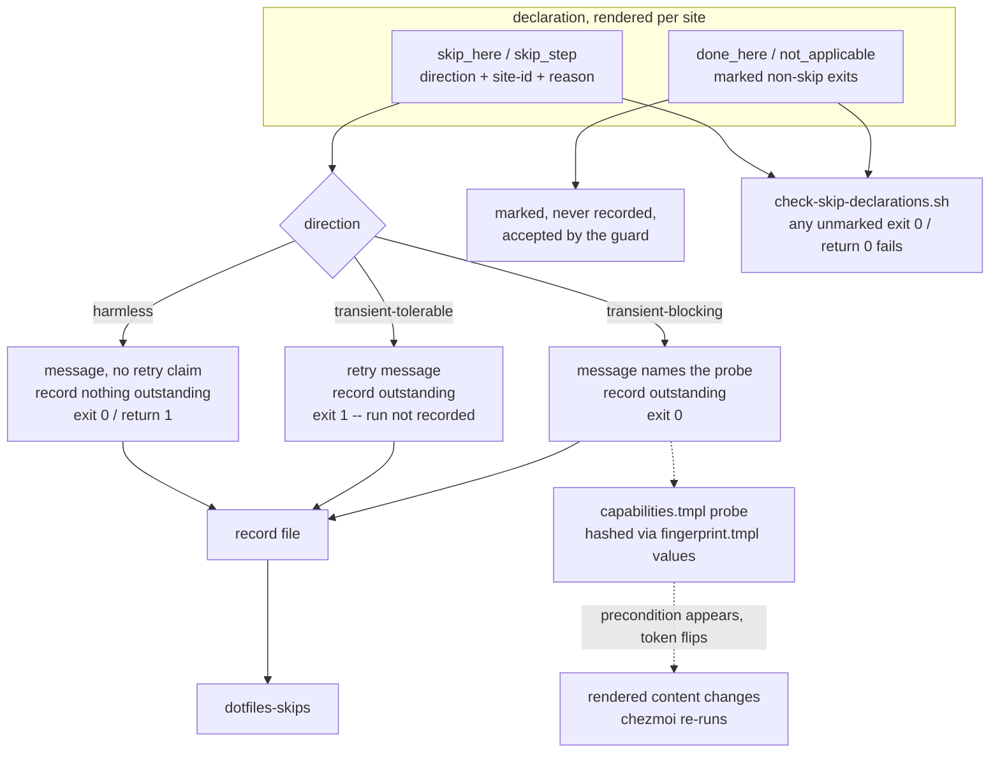

# Skip Declaration Contract - Plan

## Goal Capsule

- **Objective:** Make every place a chezmoi script can give up declare *why* it gave up, and derive the exit behavior, the operator-facing message, and an end-of-run summary from that declaration instead of hand-writing each one. This plan owns the declaration contract and its enforcement; the surgical re-run helper and the durable state-DB summary are named as later work, not active scope.
- **Product authority:** Joosung Park (`iam@h82.dev`), sole maintainer.
- **Open blockers:** None. Every load-bearing fact below was verified against the working tree or established by experiment on this host.
- **Execution profile:** chezmoi template and bash change plus one new CI guard. No runtime service, no data migration. Verify by rendering into a scratch destination with a stub `op`, running the guard against synthetic fixtures, and `bash -n` plus shellcheck on rendered output. Never by a live `chezmoi apply` — that is a deploy, done only if the user asks.
- **Stop conditions:** Stop and ask if classifying a site would change what that script does on a host that satisfies its precondition; if the enforcement guard cannot distinguish a precondition skip from a completion or opted-out early return without rewriting unrelated scripts; or if a `transient-blocking` rerun input cannot be made stable across applies while its precondition is still absent (AE3).
- **Tail ownership:** The caller owns commit, push, PR, and CI. This plan's units stop at a verified working tree.
- **Product Contract preservation:** unchanged. No R-ID, AE-ID, or F-ID was added, split, renumbered, or reworded during enrichment.

---

## Product Contract

### Summary

Introduce a three-value skip declaration — `harmless`, `transient-tolerable`, `transient-blocking` — that every skip path in a `run_onchange_` or `run_once_` script must carry. A shared partial turns the declaration into the exit behavior, the printed message, and a per-host record of what was skipped; a CI check refuses a skip path that declares nothing.

### Problem Frame

chezmoi records a script that exits 0 as a successful run and will not re-run it until its rendered content changes. A script that soft-skips because a precondition is missing therefore claims convergence it did not achieve, and the claim is permanent. `AGENTS.md:20` states this rule plainly, four script headers re-derive it independently, and `.chezmoitemplates/sudo-skip-guard.sh.tmpl:7-11` documents the trap inside the partial that causes it.

The rule is stated and unenforced, and the repository contradicts it in its own output. Ten lines across six scripts print `retries next apply` or `will retry next apply` from a path that exits 0. `run_onchange_after_config-gnome-app-grid-order.sh.tmpl` warns at `:44-48` that the skip is permanent and then promises a retry at `:73`. `run_onchange_after_luks-tpm2.sh.tmpl:66` names the wrong script prefix in its own comment.

The cost is not confusion, it is silent non-convergence discovered late. Package installation was skipped on this host and recovery required `chezmoi state reset`, the coarsest tool available. Nineteen scripts instruct the operator to recover with `chezmoi apply --force`, which re-fires a 612-line Fedora provisioner and a 448-line Rust build to repair three `gsettings` calls, so recovery is expensive enough to defer — which is how a theoretically permanent skip becomes a practical one.

Two properties make this harder than it first appears. First, the trigger is routine rather than rare: `sudo-skip-guard` fires when stdin is not a TTY and sudo is not cached, which describes every agent-driven apply. Second, a stranded skip is not always a script-level skip — inside the Fedora provisioner, `:344-346` and `:372-374` `return 0` from individual functions while the script goes on to exit 0 legitimately. No script skipped, so no per-script check can see it.

The repository already contains the honest idiom and does not know it. Three scripts exit 1 with a retry message, and because a non-zero exit is not recorded, they genuinely do re-run. Nothing distinguishes the scripts that chose correctly from the ones that chose wrongly.

### Key Decisions

- **The declared direction has three values, not two.** (session-settled: user-directed — chosen over a `harmless` / `transient` binary: a binary forces every transient skip to `exit 1`, and an early-phase failure aborts the rest of the apply.) Governs R3, R4, R5, R6.
- **The declaration lives at the skip site, emitted by a shared partial.** (session-settled: user-directed — chosen over a `.chezmoidata` registry validated at render time: a registry can only police the site names already in use, so it would still need the CI check, and it separates the declaration from the code it describes.) Governs R1, R2, R9.
- **The unit of declaration is the skip site, not the script.** A script may hold several skip sites with different directions, and a site inside a function that returns rather than exits is still a site. Governs R1, R7.
- **The summary is derived, never hand-written, and starts as a command.** (session-settled: user-approved — an end-of-apply print is deferred until the command proves insufficient, keeping a new always-run script out of the design.) Governs R8.
- **The fail-direction doctrine is borrowed from the fact registry, not extended into it.** `.chezmoidata/facts.yaml:5-9` deliberately excludes momentary state — a live session bus, a `sudo -n` cache — from host identity. A skip direction is a per-site property and must not become a fact. Governs R3.
- **Scripts that already behave correctly are retrofitted rather than exempted.** (session-settled: user-approved — otherwise "every skip site declares its direction" stops being checkable and reverts to convention.) Governs R7, R9.
- **The state-DB summary is deferred as a storage change, not an open question.** (session-settled: user-directed — chosen over adopting it now: it is a different persistence choice for the same product, and it can replace the summary's backing store later without touching the declaration contract.)

### Requirements

**The declaration**

- R1. Every skip path in a `run_onchange_` or `run_once_` script declares exactly one direction through the shared partial, including a skip that returns from a function rather than exiting the script.
- R2. The declaration is expressed at the skip site itself, in the script, and is visible in the script's rendered content.
- R3. The three directions are `harmless` (this host will never satisfy the precondition, so not acting is correct and final), `transient-tolerable` (an eligible host is missing a precondition, and failing here does not prevent later work), and `transient-blocking` (an eligible host is missing a precondition, and failing here would prevent later phases from running).

**Derived behavior**

- R4. A `harmless` skip exits 0 and is recorded as successful, which is the correct outcome for it.
- R5. A `transient-tolerable` skip exits non-zero so chezmoi does not record it, causing the script to run again on the next apply.
- R6. A `transient-blocking` skip exits 0 and declares a rerun input whose value changes when the missing precondition appears, so the script's rendered content changes and chezmoi re-runs it without operator action.
- R7. Each skip site emits an operator-facing message whose retry claim is derived from the declared direction, so a message cannot promise a retry the direction does not deliver.

**Visibility**

- R8. A single command reports, for the current host, every skip that has been taken and not since resolved, naming the script, the site, the declared direction, and the stated reason.

**Enforcement**

- R9. CI fails when a `run_onchange_` or `run_once_` script contains a skip path that does not go through the shared partial, when a declared direction is not one of the three names, or when a `transient-blocking` site declares no rerun input.
- R10. CI fails when any `run_onchange_` or `run_once_` script contains the literal strings `retries next apply` or `will retry next apply` outside the shared partial, since those messages are derived under R7.

### Key Flows

- F1. Eligible host, precondition absent, later phases at risk
  - **Trigger:** An agent runs `chezmoi apply` with no TTY and no cached sudo credentials; a phase-30 script needs root.
  - **Steps:** The site declares `transient-blocking`; the partial prints a message that promises no retry it cannot deliver, records the skip, and exits 0 so phases 50 through 90 still run. When sudo later becomes available, the declared rerun input changes, the script's content changes, and chezmoi re-runs it.
  - **Outcome:** Later phases are unaffected, and the skipped work self-heals without `--force`.
  - **Covered by:** R3, R6, R7, R8

- F2. Eligible host, precondition absent, failure is safe
  - **Trigger:** A late optional script cannot reach an upstream service.
  - **Steps:** The site declares `transient-tolerable`; the partial prints the retry message and exits non-zero. chezmoi does not record the run.
  - **Outcome:** The script runs again unprompted on the next apply.
  - **Covered by:** R3, R5, R7

- F3. Host will never qualify
  - **Trigger:** A KDE script runs on a GNOME host.
  - **Steps:** The guard resolves the desktop fact; the site declares `harmless`; the partial exits 0 and records nothing needing attention.
  - **Outcome:** Behavior is unchanged from today, and the summary does not report it as outstanding.
  - **Covered by:** R3, R4, R8

- F4. Someone adds an undeclared skip
  - **Trigger:** A new `run_onchange_` script exits 0 on a missing precondition without calling the partial.
  - **Steps:** CI detects the bare skip path and fails.
  - **Outcome:** The declaration cannot be skipped by omission.
  - **Covered by:** R1, R9

### Acceptance Examples

- AE1. **Covers R5, R6.** Given a `transient-tolerable` site and a `transient-blocking` site both take their skip on the same apply, when the apply finishes, then the tolerable script's state entry is absent and the blocking script's entry is present.
- AE2. **Covers R6.** Given a `transient-blocking` site skipped on a previous apply, when the missing precondition appears and no source file has changed, then the script's rendered content differs from the recorded hash and the script runs again.
- AE3. **Covers R6, and this is the boundary case.** Given a `transient-blocking` site whose precondition is still absent, when apply runs repeatedly, then the rendered content is stable across those applies and the script does not re-run each time — a rerun input that changes on every apply is the failure this example exists to catch, because it silently converts the script into an always-run script.
- AE4. **Covers R4, R8.** Given a KDE script on a GNOME host, when the summary is requested, then the harmless skip is not reported as outstanding.
- AE5. **Covers R7.** Given a site declared `harmless`, when it skips, then its message makes no retry claim.
- AE6. **Covers R9.** Given a `transient-blocking` site that declares no rerun input, when CI runs, then CI fails and names the site.
- AE7. **Covers R1, R3.** Given a script with two skip sites declaring different directions, when it takes the second, then only that site's direction governs the exit behavior.

### Success Criteria

- No `run_onchange_` or `run_once_` script prints a retry promise it cannot honor.
- On a host that skipped work, the answer to "what has this machine not done, and will it fix itself?" is one command away and does not require reading apply scrollback.
- A skip whose direction was chosen wrongly is a CI failure or a visible summary entry, not a silent non-convergence discovered weeks later.

<!-- ce-section: work-relationships -->
### How This Work Fits Together

This plan owns one area: the declaration contract and its enforcement. It emerged from a broader look at the apply lifecycle that identified four separately deliverable outcomes. The breakdown below is the current understanding, not a committed roadmap — a later plan may revise, split, merge, or discard any of it.

- Truthful messaging and the declared direction — this plan.
  - Enables the self-healing rerun input, by defining which sites need one.
  - Shares the shared-partial surface with the guard templates, which keep their present exit-0 behavior.
- Self-healing transient skips.
  - Depends on this plan for the classification; a rerun input is meaningless without knowing which sites are transient.
  - Partially absorbed here: R6 pulls in the narrow slice needed for `transient-blocking` sites, and the general capability remains later work.
- Surgical re-run of a single script.
  - Can proceed independently of this plan; the mechanism is a chezmoi builtin and needs no declaration.
  - Enables cheaper recovery for any site this plan classifies as needing operator action.
- Durable, queryable skip history in chezmoi's own state store.
  - Depends on this plan for the recorded content.
  - Still to decide: whether it replaces R8's backing store or supplements it.

### Scope Boundaries

**Deferred for later**

- A helper that deletes a single script's state entry so one script can be re-run without `chezmoi apply --force`. The mechanism exists (`chezmoi state delete --bucket=scriptState --key=<sha>`), and the need is real across 19 recovery instructions, but it is independent of the declaration.
- Moving the summary's backing store into chezmoi's own state DB beside the `scriptState` bucket, as a storage change rather than an open question.
- Deriving fingerprint dependency closures per component instead of hand-enumerating globs.

**Outside this plan**

- Any change to `.chezmoidata/facts.yaml` or the fact registry's contents; the fail-direction doctrine is borrowed from it, not extended into it.
- Any change to script phase numbering or to which phase a script belongs to.
- `run_after_` scripts, which run on every apply and whose exit-0 skip therefore strands nothing.
- Revisiting KTD12's deploy-everywhere-and-self-select shape. Guard partials keep exiting 0 on a non-matching host; that skip is `harmless` and this plan declares it rather than changing it.

### Dependencies / Assumptions

- `chezmoi apply` aborts all subsequent scripts at the first script error, and `--keep-going` is a flag with no config-file equivalent. Established by experiment on this host with chezmoi v2.71.0: three ordered scratch scripts where the second exits 1 produced `chezmoi: .chezmoiscripts/20-b.sh: exit status 1` with the third script not running, and the same tree with `--keep-going` ran the third. This is the sole justification for R3's third direction; if it ever becomes false, the binary rule is sufficient.
- The `scriptState` bucket is readable as `{name, runAt}` keyed by the rendered-content SHA-256, currently ~108 entries on this host. R8's summary may correlate against it.
- `fingerprint.tmpl` today accepts file globs only. R6 requires it to accept a declared value input; the sole precedent is hand-rolled at `.chezmoiscripts/60-build/run_after_build-mxm4-haptic.sh.tmpl:3`, consumed at `:36-38`.
- Classification is a judgement per site and cannot be derived mechanically. CI can prove a direction was declared and is well-formed; it cannot prove the direction is correct.

### Outstanding Questions

**Resolve before planning**

- None.

**Deferred to planning**

- Whether the four `sudo-skip-guard` consumers share one rerun input or declare their own. They share a precondition, which argues for one; they are separate scripts, which argues against.
- What the rerun input for sudo availability actually is, given it must change when the precondition appears but stay stable across applies while it is still absent, per AE3.
- Whether the summary reads from a per-host state file or reconstructs from existing sources.
- How CI recognises a skip path. A bare `exit 0` in a `run_onchange_` script is the obvious signal, but a `return 0` inside a function is the harder half and may need a narrower rule.

### Sources / Research

- `.chezmoitemplates/sudo-skip-guard.sh.tmpl:7-11,28` — the exit-0 trap documented inside the partial that causes it, and the `[[ ! -t 0 ]] && ! sudo -n true` trigger. Four consumers, all in `.chezmoiscripts/30-linux/`.
- `.chezmoitemplates/sudo-require-guard.sh.tmpl:18-19` — the contrasting hard failure used by the Fedora provisioner, which is why package installation cannot silently skip.
- `.chezmoiscripts/50-linux-gnome/run_onchange_after_install-gnome-solaar-extension.sh.tmpl:93-95`, `install-gnome-kimpanel-extension.sh.tmpl:93-95`, `.chezmoiscripts/30-linux/run_onchange_after_install-vscodium-extensions.sh.tmpl:72-74` — the working `exit 1` retry idiom this contract generalizes.
- `.chezmoiscripts/20-linux-fedora/run_onchange_before_fedora.sh.tmpl:344-346,372-374` — skips inside an otherwise successful run, the evidence that the skip site rather than the script is the unit of declaration.
- `.chezmoiscripts/50-linux-gnome/run_onchange_after_config-gnome-app-grid-order.sh.tmpl:44-48,73` — a single file that documents the hazard and then contradicts itself.
- `.chezmoidata/facts.yaml:5-9,76-95` — the momentary-state exclusion and the per-fact fail-direction doctrine this contract borrows.
- `docs/plans/2026-07-14-001-refactor-chezmoidata-fact-registry-plan.md:196` — KTD12, which deferred changing the guard exit-0 shape and which this plan honors rather than reopens.
- `.chezmoitemplates/gnome-guard.sh.tmpl:12` and `.chezmoitemplates/kde-guard.sh.tmpl:9` — headers claiming 7 and 15 include sites against actual counts of 8 and 9. Evidence for keeping the declaration at the skip site: a declaration kept away from the code it describes drifts, and these already have.
- `.ci/test-compound-engineering-overlays.sh:62-70` and `.ci/test-mxm4-haptic-chezmoi-retry.sh:86-88` — existing script-lifecycle checks in CI, so R9 and R10 extend a family rather than introduce one. Neither touches exit-0 doctrine.
- `.ci/lib/render-gate-helpers.sh:18-23` — the scratch-destination render recipe the enforcement check can reuse.

---

## Planning Contract

### Key Technical Decisions

- KTD1. **Every early exit in a `run_onchange_`/`run_once_` script becomes an explicit, marked call — including the ones that are not skips.** The partial exposes four call forms: `skip_here`, `skip_step`, `done_here`, and `not_applicable`. This is what makes R9 decidable: after conversion, a bare `exit 0` or `return 0` on a conditional path in these scripts is *by definition* undeclared, and the guard needs no heuristic to tell a precondition failure from a completion stamp. Governs R1, R9, KTD4's exclusions.
- KTD2. **Terminal and non-terminal declarations are different call forms, not a flag.** `skip_here <direction> <site-id> <reason>` declares and exits the script. `skip_step <direction> <site-id> <reason>` declares, prints, and returns non-zero to its caller so the surrounding function can `return` while the script continues. Three sites in `run_onchange_after_setup-podman-cluster.sh.tmpl` (`:149`, `:187`, `:195`) and the `return 0` sites in `run_onchange_before_fedora.sh.tmpl` (`:344-346`, `:372-374`) require the non-terminal form; an exit-only helper would abort work those scripts deliberately continue. Governs R1, R3.
- KTD3. **The direction is a render-time literal, not a runtime argument.** Each site is written as `{{ includeTemplate "skip.sh.tmpl" (dict "ctx" . "direction" "transient-blocking" "site" "no-session-bus" "reason" "...") }}`, which renders the shell for that one site. A template cannot inspect a value a shell function receives at runtime, so a runtime-argument API could not `fail` on an unknown direction — the render-time literal is what makes R9's unknown-direction rejection and R3's closed set of three enforceable at all. Governs R1, R3, R9.
- KTD4. **A rerun input must be a render-time probe of the precondition itself. A marker file cannot work, and this is proven, not assumed.** Three mechanisms were tested against a scratch source and destination on chezmoi v2.71.0: a marker file whose content changes on each skip re-runs the script on *every* apply (an always-run script, violating AE3); a marker file with stable content ran twice, then stalled permanently and **did not re-run when the precondition appeared** (violating R6); a render-time probe of the precondition ran once, stayed byte-stable across three further applies, and re-ran immediately when the precondition appeared. Only the third satisfies R6 and AE3 together. Governs R6.
- KTD5. **Render-time probes live in a `capabilities.tmpl` partial, deliberately outside the fact registry.** `.chezmoidata/facts.yaml:5-9` excludes momentary state from host *identity* and that exclusion stands: a capability value never gates anything, never appears in a `gates:` expression, and is consumed only as a fingerprint input, so the fail-safe rule it protects is untouched. The repo already performs template-time command execution in `.chezmoitemplates/config-secrets-key.tmpl`, so this is an existing technique applied to a new, narrower purpose. Each probe must exit 0 and emit one of two fixed tokens; a probe that can fail the render is a defect. Governs R6.
- KTD6. **Enforcement is a `check-` guard proved by a `test-`-gates harness, run against rendered output.** Mirrors `.ci/check-windows-references.sh` proved by `.ci/test-windows-references-gates.sh`. Rendered rather than source, because a `{{ if }}` branch can hide an early exit from a source grep; the render recipe at `.ci/lib/render-gate-helpers.sh:18-23` already exists. Governs R9, R10.
- KTD7. **The record is a versioned, per-host, line-oriented file keyed by `script` plus `site-id`.** A site id is stable and unique within its script, so a later successful run can clear exactly the entries it owns and two sites sharing a reason stay distinct. The partial appends; a finalizer clears the current script's entries on a successful completion. Storage stays a plain file, not the chezmoi state DB, so the deferred storage follow-on remains a drop-in replacement. Governs R8.
- KTD8. **Guard partials declare on behalf of their consumers.** `gnome-guard`, `kde-guard`, `headless-guard`, and `sudo-skip-guard` each hold one skip that 8, 9, 3, and 4 consumer scripts inherit respectively. Converting the four partials converts 24 consumers, so the identity guards are one unit of work rather than twenty-four. Governs R1, R3.

### High-Level Technical Design

### Assumptions

- Rendering is deterministic for a fixed host state, so an unchanged capability token produces byte-identical output. Verified by experiment for the probe mechanism.
- Every capability probe can be written to exit 0 and emit one of two fixed tokens. A precondition that cannot be probed without side effects cannot be `transient-blocking`; it classifies as `transient-tolerable` when its phase allows, otherwise `harmless` with the summary as the only signal.
- Guard-partial skips gate on baked host identity and are therefore `harmless`. This preserves KTD12 from `docs/plans/2026-07-14-001-refactor-chezmoidata-fact-registry-plan.md:196`; `sudo-skip-guard` is the one guard whose condition is momentary rather than identity, which is why it alone is `transient-blocking`.

### Sequencing

U1, U2, and U3 are the mechanism and must land first, in that order. U4 is the inventory and produces the matrix every conversion unit consumes. U5 through U9 are conversions and may land in any order once U4 exists. U10 depends on U1's call grammar. U11 depends on U1's record format. U12 lands last.

---

## Implementation Units

| U-ID | Title | Files touched | Depends on |
|---|---|---|---|
| U1 | Skip declaration runtime | `.chezmoitemplates/skip.sh.tmpl` | — |
| U2 | Capability probes | `.chezmoitemplates/capabilities.tmpl` | — |
| U3 | Fingerprint value inputs | `.chezmoitemplates/fingerprint.tmpl` | — |
| U4 | Site inventory and direction matrix | plan appendix | U1 |
| U5 | Guard partials | 4 `*-guard.sh.tmpl` | U1, U2, U3, U4 |
| U6 | 30-linux conversions | `.chezmoiscripts/30-linux/*` | U4, U5 |
| U7 | Desktop conversions | `.chezmoiscripts/50-linux-{gnome,kde}/*` | U4, U5 |
| U8 | Fedora and package conversions | `.chezmoiscripts/20-linux-fedora/*` | U4 |
| U9 | Remaining phases | `00-tools`, `10-auth`, `60-build`, `70-agents`, `80-keys`, `90-src` | U4 |
| U10 | Enforcement guard | `.ci/check-skip-declarations.sh`, `.ci/test-skip-declaration-gates.sh`, `.github/workflows/ci.yml` | U1, U5-U9 |
| U11 | Summary command | `dot_local/bin/executable_dotfiles-skips` | U1 |
| U12 | Documentation | `AGENTS.md` | U1-U11 |

### U1. Skip declaration runtime

- **Goal:** One partial owning four marked call forms, three directions, derived messages, and the record append.
- **Requirements:** R1, R2, R3, R4, R5, R7
- **Files:** `.chezmoitemplates/skip.sh.tmpl` (new).
- **Approach:** Take a dict (`ctx`, `direction`, `site`, `reason`, optional `probe`), mirroring `gnome-guard.sh.tmpl:35-37`'s dict guard that aborts the render when handed a bare string. `fail` at render time on a direction outside the three names, on a missing site id, and on `transient-blocking` without a `probe`. Emit the message, the record append, and the exit or return for that one site. Provide `skip_here` (exits), `skip_step` (returns non-zero to the caller), and the non-skip markers `done_here` and `not_applicable`, which print nothing to the record and exist purely so the guard can accept them.
- **Patterns to follow:** `.chezmoitemplates/gnome-guard.sh.tmpl:35-43`; `.chezmoitemplates/fingerprint.tmpl:30-32` for the `fail` idiom.
- **Test scenarios:** Each of the three directions renders its matching exit or return. An unknown direction fails the render naming the three valid values (AE6-adjacent). A missing site id fails the render. `transient-blocking` without a probe fails the render (AE6). A bare-string argument fails the render. A `harmless` render contains no retry wording (AE5). A two-site script renders each site's behavior independently, and taking the second does not invoke the first's direction (AE7). `skip_step` returns without exiting, and the caller's subsequent work still runs.
- **Verification:** Render each form through the scratch recipe; execute a rendered two-site fixture and a rendered `skip_step` fixture and assert observed control flow.

### U2. Capability probes

- **Goal:** Render-time probes that give `transient-blocking` sites a stable, flipping input.
- **Requirements:** R6
- **Files:** `.chezmoitemplates/capabilities.tmpl` (new).
- **Approach:** One partial exposing named probes, each emitting exactly one of two fixed tokens and never failing the render. Start with the probes the inventory requires — at minimum sudo usability (`TTY present OR sudo -n true OR already root`) and session-bus presence. Use the template-time execution idiom already present in `.chezmoitemplates/config-secrets-key.tmpl`. Document in the header that these are deliberately not facts, never gate anything, and are consumed only as fingerprint inputs.
- **Test scenarios:** Each probe emits one of its two tokens and nothing else. A probe whose underlying command fails still exits 0 and emits the negative token. Two renders with unchanged host state emit the same token.
- **Verification:** Render with the precondition absent and present; assert the token flips and is otherwise stable.

### U3. Fingerprint value inputs

- **Goal:** Let a script hash a declared non-file value so a capability flip changes rendered content.
- **Requirements:** R6
- **Files:** `.chezmoitemplates/fingerprint.tmpl`.
- **Approach:** Accept an optional `values` key beside `globs`: a list of `{name, value}` whose value is already resolved. Emit `#   value:<name>  <sha256>` lines. Extend the zero-match `fail` to an empty value. Purely additive — a call passing only `globs` must render byte-identically, and a call passing only `values` must be valid.
- **Execution note:** Enumerate the existing call sites and prove the empty diff against that enumerated list rather than a hardcoded count.
- **Test scenarios:** Every existing call site renders byte-identically. A `values` entry's hash changes with its value and is stable otherwise. An empty value fails the render. `globs` and `values` together emit both line kinds.
- **Verification:** Render every enumerated existing call site before and after; the diff must be empty.

### U4. Site inventory and direction matrix

- **Goal:** A committed, per-site classification the conversion units execute against, so no implementer makes a product judgement mid-conversion.
- **Requirements:** R1, R3
- **Files:** this plan's `## Appendix`.
- **Approach:** Enumerate every conditional early exit in the 45 `run_onchange_`/`run_once_` scripts — currently 112 `exit 0` occurrences across 28 files and 37 `return 0` occurrences — plus the four guard partials. Classify each into `harmless`, `transient-tolerable`, `transient-blocking`, or a KTD4 non-skip (`done_here` / `not_applicable`). Record script, line, condition, direction, call form, and probe name where blocking. Phase position decides tolerable versus blocking: a site in a phase with later phases after it cannot exit 1.
- **Test scenarios:** Every enumerated site has exactly one classification. Every `transient-blocking` row names a probe that U2 provides. No row in a phase before `90-src` is `transient-tolerable` unless its script is the last in its phase and nothing later depends on it.
- **Verification:** Count rows against the measured site count; a shortfall means a missed site.

### U5. Convert the guard partials

- **Goal:** Convert 4 partials and thereby 24 consumer scripts.
- **Requirements:** R1, R3, R6, R7
- **Files:** `.chezmoitemplates/gnome-guard.sh.tmpl`, `kde-guard.sh.tmpl`, `headless-guard.sh.tmpl`, `sudo-skip-guard.sh.tmpl`.
- **Approach:** The three identity guards declare `harmless` — they gate on baked facts an ineligible host will never satisfy. `sudo-skip-guard` declares `transient-blocking` with U2's sudo probe, and its consumers gain the matching `fingerprint.tmpl` `values` entry. Remove `sudo-skip-guard`'s header paragraph directing the operator to `chezmoi apply --force`; it is superseded.
- **Execution note:** Changing a guard changes the rendered content of every consumer, so all 24 re-run on the next apply. Disclose per-script effects per U6/U7.
- **Test scenarios:** An ineligible host renders the harmless declaration and exits 0. Two renders with sudo unusable are byte-identical (AE3); a render with sudo usable differs (AE2). The sudo guard exits 0, never 1, so later phases still run. All 24 consumers render with the declaration present.
- **Verification:** Render one consumer of each guard in both states and diff.

### U6. Convert `30-linux`

- **Goal:** Convert every site in the phase holding the sudo consumers and the LUKS and podman scripts.
- **Requirements:** R1, R3, R6, R7
- **Files:** every `.chezmoiscripts/30-linux/run_onchange_*` and `run_once_*` script carrying a site in U4's matrix.
- **Approach:** Apply the matrix. The three podman sites at `:149`, `:187`, `:195` use `skip_step`, not `skip_here` — they skip a substep and the script continues. Correct the stale `run_after` wording in the `luks-tpm2` header at `:66`.
- **Execution note:** Full re-run disclosure required in the commit body. `install-system-30-network` reloads firewalld, repoints `/etc/resolv.conf`, restarts active DNS-path services, and cleans NetworkManager links — its first re-run must be from a local console, never over SSH or Tailscale. `setup-podman-cluster` can write the cgroup delegation drop-in, reload systemd, enable user podman, prune and minikube units, and configure minikube. `chsh-zsh` can append to `/etc/shells` and change the login shell. `install-system-10-files` can install or remove `/etc` content and reload systemd, udev, sysctl, and dconf. `install-system-20-host` enables lingering, masks podman services, and can disable active zram.
- **Test scenarios:** Each converted site renders its matrix direction. `skip_step` sites let the script continue. No rendered script contains `retries next apply` or `will retry next apply`. Rendered scripts pass `bash -n` and shellcheck.
- **Verification:** Render every file in the phase; grep for banned strings and for unmarked early exits.

### U7. Convert `50-linux-gnome` and `50-linux-kde`

- **Goal:** Convert the desktop phase, the densest source of the lying messages.
- **Requirements:** R1, R3, R6, R7
- **Files:** every script in both directories carrying a matrix site.
- **Approach:** Apply the matrix. Session-bus skips are `transient-blocking` with U2's session-bus probe, because phases 60, 70, and 90 run after. Completion stamps and data opt-outs — `config-gnome-app-grid-order.sh.tmpl:60-63` and `:66-69` — become `done_here` / `not_applicable`, never a direction.
- **Test scenarios:** Adjacent sites in one script take different call forms per the matrix. Session-bus sites render stably while absent and differ once present. No banned strings remain.
- **Verification:** Render both directories; run the guard against the rendered output.

### U8. Convert `20-linux-fedora`

- **Goal:** Convert the in-function `return 0` sites the Problem Frame names.
- **Requirements:** R1, R3
- **Files:** `.chezmoiscripts/20-linux-fedora/run_onchange_before_fedora.sh.tmpl`.
- **Approach:** Apply the matrix. `:344-346` (dotnet absent) and `:372-374` (nvidia-ctk absent) use `skip_step`. The all-packages-present fast path at `:276-280` is `done_here`, not a skip. Leave `sudo-require-guard`'s `exit 1` alone — a hard failure is not a skip.
- **Test scenarios:** `skip_step` sites let `main` continue to later functions. The fast path renders as `done_here`. The script still exits 0 overall when a substep skips.
- **Verification:** Execute the rendered script against stubs and assert later functions still run.

### U9. Convert the remaining phases

- **Goal:** Close R1 across `00-tools`, `10-auth`, `60-build`, `70-agents`, `80-keys`, and `90-src`.
- **Requirements:** R1, R3
- **Files:** every script in those directories carrying a matrix site.
- **Approach:** Apply the matrix. `run_after_` scripts are out of scope per the Product Contract and must not be converted.
- **Test scenarios:** Every matrix site in these phases renders its direction. No `run_after_` script was modified.
- **Verification:** Render all six directories and run the guard.

### U10. Enforcement guard and fixture harness

- **Goal:** An unmarked early exit cannot reach the tree.
- **Requirements:** R9, R10
- **Files:** `.ci/check-skip-declarations.sh` (new), `.ci/test-skip-declaration-gates.sh` (new), `.github/workflows/ci.yml`.
- **Approach:** Render every `run_onchange_`/`run_once_` script and fail on: a conditional `exit 0` or `return 0` not emitted by the partial, an unknown direction, `transient-blocking` without a probe, or either banned retry string. Decidability comes from KTD1 — after U5-U9 every legitimate early exit is marked, so anything unmarked is a finding. The gates harness proves each failure class against synthetic fixtures built from the real adjacent shapes in `config-gnome-app-grid-order.sh.tmpl:60-83`, not invented labels. Register in `ci.yml` beside the existing `.ci/test-*` calls and confirm the delivery aggregate covers it.
- **Patterns to follow:** `.ci/check-windows-references.sh` and `.ci/test-windows-references-gates.sh`; `.ci/lib/render-gate-helpers.sh:18-23`.
- **Test scenarios:** A bare `exit 0` on a precondition path fails. A `done_here` completion stamp passes. A `not_applicable` opt-out passes. An unknown direction fails naming the valid values. `transient-blocking` with no probe fails (AE6). A banned retry string fails. The real tree passes after U5-U9.
- **Verification:** Run the gates harness, then the guard against the tree.

### U11. Summary command

- **Goal:** One command answers what this host skipped and whether it self-heals.
- **Requirements:** R8
- **Files:** `dot_local/bin/executable_dotfiles-skips` (new).
- **Approach:** Read the KTD7 record. Print outstanding entries with script, site, direction, and reason. Omit `harmless` entries (AE4). Honor the finalizer's clearing so a resolved site disappears. Exit non-zero only on a read error.
- **Test scenarios:** A record with one entry per direction reports only the two transient ones (AE4). An absent record prints nothing and exits 0. A malformed line is reported without aborting the listing. A site recorded then completed by a later run no longer appears.
- **Verification:** Run against fixture records, including a record-then-complete sequence.

### U12. Document the contract

- **Goal:** The rule an agent reads matches the rule CI enforces.
- **Requirements:** R1, R3
- **Files:** `AGENTS.md`.
- **Approach:** Replace the lifecycle sentence at `AGENTS.md:20` with the contract: three directions, four call forms, declaration through the partial, and the guard as the enforcement site. Keep it short; mechanism lives in the partial's header.
- **Test scenarios:** The rule names the three directions, the four call forms, and the enforcement site. Every remaining `--force` mention in `AGENTS.md` is still accurate.
- **Verification:** Grep `AGENTS.md` for `--force` and for the old wording.

---

## Verification Contract

| Gate | Command | Applies to | Done signal |
|---|---|---|---|
| Render | `chezmoi --config "$scratch/empty.toml" --source "$PWD" --destination "$scratch/target" execute-template` with stub `op` on `PATH` | U1-U9, U12 | Exits 0, emits valid bash |
| Additive proof | Render every enumerated `fingerprint.tmpl` call site before and after U3 | U3 | Empty diff |
| Probe stability | Render a `transient-blocking` consumer twice with the precondition absent, then once present | U2, U5, U6, U7 | Identical, then different (AE2, AE3) |
| Lifecycle | Scratch-source `chezmoi apply` sequence over a tolerable and a blocking fixture | U1, U5 | Tolerable leaves no `scriptState` entry; blocking does (AE1) |
| Multi-site | Execute a rendered two-site fixture, taking the second site | U1 | Only that site's direction governs (AE7) |
| Non-terminal | Execute a rendered `skip_step` fixture | U1, U6, U8 | Caller continues after the declaration |
| Banned strings | `grep -R 'retries next apply\|will retry next apply'` over rendered output | U6, U7, U10 | Zero hits |
| Guard fixtures | `.ci/test-skip-declaration-gates.sh` | U10 | Every fixture produces its expected verdict |
| Guard vs tree | `.ci/check-skip-declarations.sh` | U10 | Passes after U5-U9 |
| Syntax | `bash -n` on every rendered script | U1, U5-U9 | Clean |
| Lint | `render-dotfiles.yml` shellcheck job | all | Clean |
| CI | `ci.yml` and `render-dotfiles.yml` | all | Both green, delivery aggregate included |

Never run a live `chezmoi apply` against `$HOME` as verification.

---

## Definition of Done

- R1-R10 satisfied; AE1-AE7 each demonstrated by a named scenario in the table above.
- Every conditional early exit in a `run_onchange_`/`run_once_` script is a marked call — a direction, or a `done_here` / `not_applicable` marker. No unmarked conditional `exit 0` or `return 0` remains.
- Every U4 matrix row is converted, and the converted count equals the enumerated count.
- No rendered script contains `retries next apply` or `will retry next apply`.
- Every pre-existing `fingerprint.tmpl` call site renders byte-identically.
- Every `transient-blocking` site renders stably while its precondition is absent and differently once present.
- `.ci/check-skip-declarations.sh` is registered in `ci.yml`, covered by the delivery aggregate, and passes; `.ci/test-skip-declaration-gates.sh` proves each failure class.
- `AGENTS.md` describes the three directions, the four call forms, and the enforcement site.
- `run_after_` scripts and `sudo-require-guard`'s hard failure are unchanged.
- No abandoned experimental code, scratch fixtures, or dead branches in the diff.
- The commit body carries the per-script re-run disclosure from U5-U7, and states that the network-changing re-run must first be applied from a local console.

---

## Appendix

### Site inventory and direction matrix

Produced by U4. Three parallel inventory passes covered every `run_onchange_*` and `run_once_*` template plus the four shared guard partials. `run_after_*` scripts are out of scope.

**130 sites across 30 files and 4 partials.**

| Scope | Sites | harmless | transient-tolerable | transient-blocking | done_here | not_applicable | UNRESOLVED |
|---|---:|---:|---:|---:|---:|---:|---:|
| `30-linux` | 19 | 4 | 0 | 13 | 1 | 1 | 0 |
| `20-linux-fedora` | 14 | 0 | 0 | 2 | 2 | 10 | 0 |
| `50-linux-gnome` | 44 | 19 | 0 | 11 | 6 | 4 | 4 |
| `50-linux-kde` | 28 | 12 | 0 | 10 | 1 | 5 | 0 |
| `00-tools` | 4 | 1 | 0 | 3 | 0 | 0 | 0 |
| `10-auth` | 4 | 0 | 0 | 4 | 0 | 0 | 0 |
| `60-build` | 10 | 2 | 0 | 2 | 0 | 0 | 6 |
| `70-agents` | 3 | 0 | 0 | 1 | 0 | 2 | 0 |
| `80-keys`, `90-src` | 0 | — | — | — | — | — | — |
| guard partials | 4 | 3 | 0 | 1 | 0 | 0 | 0 |
| **total** | **130** | **41** | **0** | **47** | **10** | **22** | **10** |

Site-level detail lives in the three inventory passes; the counts above are the contract the conversion units execute against. Sites are counted per call site, not per literal token: a helper reached from three conditions is three sites.

### Finding 1 — `transient-tolerable` has zero sites in this repository

Every one of the 130 sites classifies as `harmless`, `transient-blocking`, `done_here`, `not_applicable`, or `UNRESOLVED`. **None is `transient-tolerable`**, because `90-src` is the only phase with nothing after it and it contains no skip sites at all. Everywhere else an `exit 1` aborts the remaining phases.

The direction was added so a transient skip could self-heal cheaply, by reusing the `exit 1` idiom already in the tree. The inventory shows that idiom is never safe here.

### Finding 2 — seven existing `exit 1` sites are live bugs

These already exit non-zero with a retry message, and each aborts every later phase on a real apply:

| Site | Phase | Aborts |
|---|---|---|
| `30-linux/run_onchange_after_install-vscodium-extensions.sh.tmpl:74` | 30 | 50, 60, 70, 80, 90 |
| `50-linux-gnome/run_onchange_after_install-gnome-solaar-extension.sh.tmpl:90,124,136` | 50 | 60, 70, 80, 90 |
| `50-linux-gnome/run_onchange_after_install-gnome-kimpanel-extension.sh.tmpl:95,129,141` | 50 | 60, 70, 80, 90 |

They predate this plan. A network blip during extension install currently prevents the Rust build, every omp agent setting, and the garden reconcile from running at all — silently, because the apply reports the extension failure and nothing mentions the six phases that never ran.

### Finding 3 — the probe mechanism does not scale as specified

The blocking sites need roughly 35 distinct probes (`session-bus-present`, `sudo-usable`, `zsh-present`, `chsh-present`, `curl-present`, `codium-present`, `dotnet-present`, `nvidia-ctk-present`, `mise-present`, `plasmashell-running`, `akonadi-socket-present`, and so on). `capabilities.tmpl` as built runs one `output` subprocess per call, so a fully converted tree would run ~35 subprocesses on **every** chezmoi command — `status` and `diff` included, not just `apply`.

The fix is the architecture the fact registry already uses: resolve every probe once per chezmoi command in the `read-source-state.pre` hook that already writes the facts cache, and have `capabilities.tmpl` read that cache instead of shelling out per call. One subprocess per command, and rendering becomes reproducible within a command rather than per-call.

### Finding 4 — ten UNRESOLVED error paths

Ten sites exit 0 on what is an error, not a precondition: `gsettings get` failures and malformed-dconf parser results in GNOME (4), and dependency-install, build, and missing-dist failures in the Figma and Kimi build scripts (6). They are recorded as UNRESOLVED rather than classified, because calling an error a skip is the same category of lie this plan exists to remove. Each needs a decision: exit non-zero, or declare a direction deliberately.
