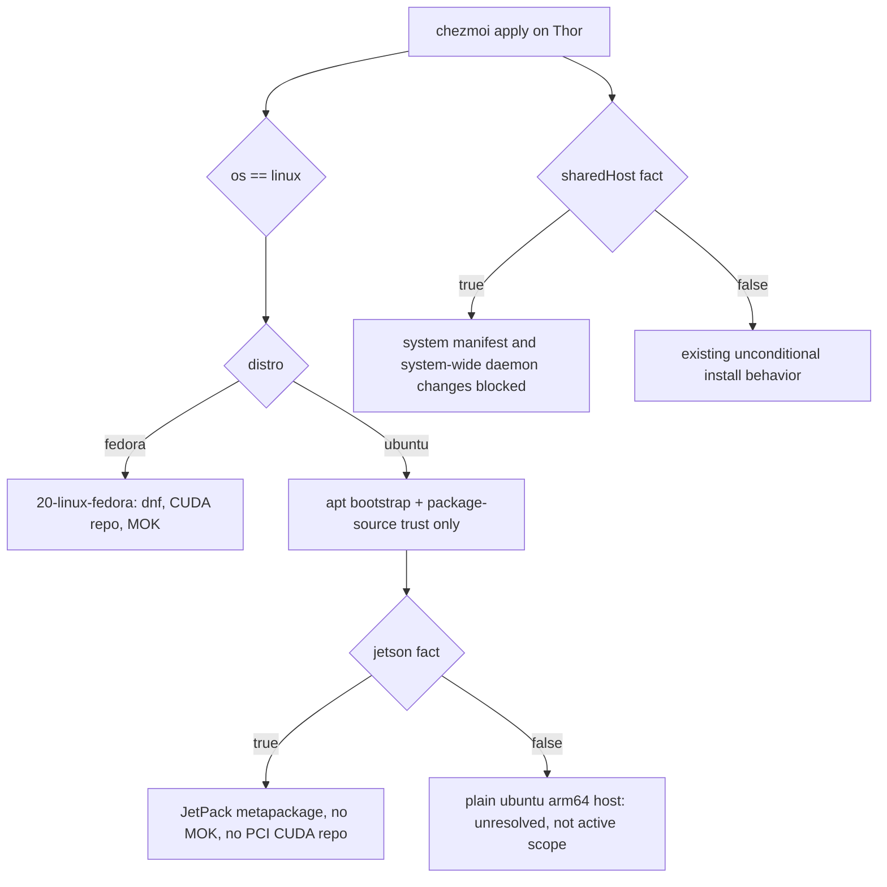
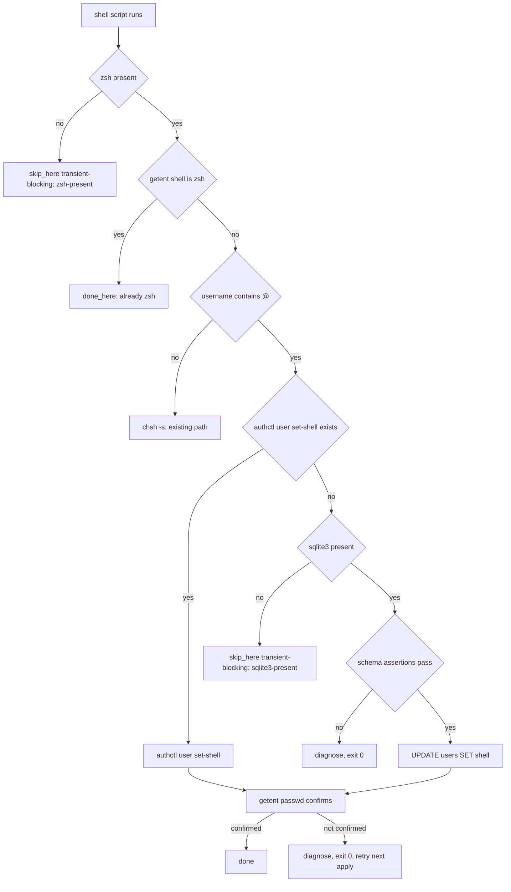

# NVIDIA Jetson AGX Thor Host Support - Plan

## Goal Capsule

- **Objective:** Make an NVIDIA Jetson AGX Thor developer kit a chezmoi-managed desktop host, on a shared multi-user box, without changing how the existing Fedora x86_64 workstation behaves.
- **Product authority:** The Product Contract below. Thor is a hardware profile (`jetson`) on Ubuntu 24.04 arm64. Ubuntu opens only as far as bootstrap and package-source trust require. Generic multi-host Ubuntu support is not active scope.
- **Authority hierarchy:** An R wins on product behavior. A KTD wins on implementation mechanism inside its cited R constraints. A unit overrides neither.
- **Execution profile:** Source-state edits only. Never apply to the live `$HOME`. Verify by rendering into a scratch destination with `--source "$PWD"` and a stub `op`.
- **Stop conditions:** Stop and ask if a change would alter Fedora x86_64 behavior beyond the fact-block delta R22 permits, if `sharedHost` would gate a path the operator expects to keep, or if U1's board preflight contradicts a Key Decision.
- **Tail ownership:** This plan does not own commit, push, or PR. The operator decides when to land.

---

## Product Contract

### Summary

Add Jetson AGX Thor as a managed desktop host by introducing a `jetson` hardware fact, admitting `ubuntu` as a recognized distro for bootstrap and package-source trust only, and inverting the system-manifest default from install-always to blocked-by-default behind a new `sharedHost` fact. Extend the login-shell change to recognize authd-managed accounts, deliver 1Password from the release lock, and let JetPack own CUDA.

### Problem Frame

The repository is Fedora-shaped end to end. `.install-prerequisites.sh:821-836` reads `/etc/os-release` `ID`, dispatches only on `fedora`, and exits with an unsupported-distro error for anything else — a Thor is rejected before the first template renders. `.chezmoidata/facts.yaml:107-117` allow-lists `distro` as `[fedora, ""]`, and `.chezmoitemplates/packages-validate.tmpl:11-16` hardcodes the platform set to Fedora and macOS in three places.

Architecture is not the expensive half. Every artifact-bearing tool in `.chezmoidata/releases.json` already carries a native `linux-arm64` URL and digest, and the externals compose their paths from `.chezmoi.arch`. The distribution is what is closed.

Two properties of this specific host make a straight Fedora-to-Ubuntu port wrong rather than merely large. First, the board is shared: `.chezmoidata/system.yaml:11-14` installs an `/etc` file unconditionally when no override entry matches it, which is the correct default for a single-owner workstation and the wrong one where other people's sessions live on the same machine. Second, the GPU is not a peripheral the repository knows how to detect — the `nvidia` fact probes `grep -qx '0x10de' /sys/bus/pci/devices/*/vendor` (`.install-prerequisites.sh:188-195`), and a Tegra SoC has no such PCI entry. The Fedora NVIDIA path is not something to port; the CUDA repository URL carries a literal `/x86_64/` segment (`.chezmoiscripts/20-linux-fedora/run_onchange_before_fedora.sh.tmpl:209-211`) and MOK enrollment refuses to proceed unless `mokutil` reports Secure Boot enabled (`:515-518`).

The account is also not a local one. It is provisioned through authd against Entra ID, so it has no `/etc/passwd` row and `chsh` cannot rewrite its login shell.

### Key Decisions

- KD1. **Jetson is a hardware profile; Ubuntu is a bootstrap concession.** The real discriminator for every Thor-specific behavior is the vendor BSP, not the distribution. (session-settled: user-approved — chosen over modeling Ubuntu as a full peer platform of Fedora: a peer port would restate "not applicable here" across roughly forty capability rows for software that will never run on this board.) Governs R1, R2, R8.
- KD2. **The `nvidia` fact stays false on Thor and is redocumented as "discrete NVIDIA GPU on the PCI bus".** (session-settled: user-directed — chosen over extending the probe to detect Tegra: a false value already skips exactly the Fedora CUDA, persistenced, and MOK paths that must not run here, so widening the probe would buy a truer fact and then need `jetson` checks at every consumer to undo it.) Governs R3, R13.
- KD3. **System writes flip to blocked-by-default behind one declared fact, not per-path classification.** (session-settled: user-approved — chosen over a `scope:` field on each `system.yaml` entry: a single fact keeps the decision legible in one place instead of a hundred.) Governs R4, R5, R26.
- KD4. **`nvidia-jetpack` is the CUDA authority on the board.** (session-settled: user-directed — chosen over selecting sub-metapackages or leaving CUDA unmanaged: BSP-to-CUDA version alignment becomes the vendor's problem rather than this repository's.) Governs R11, R12.
- KD5. **The 1Password desktop app is delivered from the release lock, not from a moving URL and not by hand.** (session-settled: user-directed — chosen over leaving the aarch64 tarball a documented manual step: the vendor publishes a machine-readable version feed and a version-pinned artifact, so the same lock that owns every other external can own this one. The accepted residual is that `after-install.sh` still installs a setuid helper and a polkit policy on a shared host, and that step stays outside the repository.) Governs R7, R24, R28, R29, R31.
- KD6. **`apply` runs only from the board's local GUI session.** (session-settled: user-directed — chosen over supporting apply over SSH: the keyring-backed and pinentry-backed provisioning steps need an unlocked session, and SSH stays a usage mode rather than a provisioning mode.)
- KD7. **The authd shell change prefers `authctl user set-shell` and falls back to a direct database update.** (session-settled: user-directed — chosen over an authctl-only path: the supported CLI landed after release tag v0.6.4 and is absent on this board, so an authctl-only path would soft-skip forever and ship a dead requirement.) Governs R14, R15, R16, R17.
- KD8. **Tailscale does not run on a Jetson.** (session-settled: user-directed — chosen over gating it on `sharedHost` alone: the operator wants the board off the tailnet outright, which is a host-profile decision rather than a shared-host one.) Governs R30.
- KD9. **`sharedHost` is declared by three independent signals, any one of which is enough.** (session-settled: user-directed — chosen over a head-count probe over `getent passwd`: authd enumeration is unreliable, while a marker file, the `jetson` profile, and an authd-managed account are each deterministic and each independently imply a centrally-managed machine.) Governs R4, R32.

The gating axes a planner has to keep straight:

### Requirements

**Host identity and gating**

- R1. The `distro` fact accepts `ubuntu` in addition to `fedora` and the empty value, and `.chezmoitemplates/facts-validate.tmpl` accepts `distro.ubuntu` in gate expressions.
- R2. A new `jetson` boolean fact identifies a Jetson board from the presence of `/etc/nv_tegra_release`, probed in the template layer like `thinkpad`. It gates every JetPack-specific behavior.
- R3. The `nvidia` fact keeps its current PCI probe, and its registry entry says the fact means a discrete NVIDIA GPU on the PCI bus. It resolves false on Thor, and that value is correct rather than a defect to work around.
- R4. A new `sharedHost` boolean fact blocks the system manifest install and every change to a system-wide daemon's identity or configuration.
- R32. `sharedHost` is true when any one of three signals holds: `/etc/dotfiles-shared-host` exists, the `jetson` fact is true, or the invoking username contains `@`. All three resolve in the template layer, so the fact needs no cache.
- R5. Package installation and package-source trust configuration are outside the `sharedHost` gate. The gate covers the `system.yaml` manifest, hostname, user lingering, zram, resolver and firewall state, the CDI descriptor, group and subid membership, and the enable-or-restart of a system-wide daemon.
- R26. `INSTALL_SYSTEM_CONFIG_FORCE` continues to override only the headless guard. It never bypasses `sharedHost`.

**Bootstrap**

- R6. The prerequisite hook accepts `ubuntu` as a supported Linux distribution and installs, through apt, every binary whose absence hard-fails a later phase. The closure is at least the 1Password CLI, mise, `zsh`, `curl`, `tar`, `xz-utils`, `coreutils`, `libsecret-tools`, `gnupg`, `expect`, and `sqlite3`.
- R7. The 1Password CLI is a managed capability on Ubuntu arm64, installed from the vendor's official apt source.
- R24. The 1Password desktop application is a managed capability on Ubuntu arm64, delivered from the version-pinned aarch64 tarball the release lock records. Running the vendor's `after-install.sh` stays an operator step outside the repository, because it installs a setuid helper and a polkit policy.
- R28. `.chezmoidata/releases.json` records the 1Password desktop version and its arm64 artifact URL. The generator resolves the version from the vendor's release feed and composes the artifact URL; it records no sha256, because the vendor publishes none.
- R29. The artifact's detached GPG signature is verified against the vendor's published signing key before the tarball is unpacked.
- R31. The 1Password desktop entry is installed system-wide at `/usr/share/applications/1password.desktop`, matching what the amd64 package ships. The aarch64 tarball ships no working entry, so without it the app has no launcher.
- R25. A board preflight step records the facts this plan asserts but cannot verify from the source tree, and it runs before any other unit lands.

**Package authority**

- R8. `packages.authority.supportedArchitectures` declares `ubuntu: [arm64]`, and the validator's platform list, platform loops, owner branch, backend allow-list, and capability-key check all accept it.
- R9. Every capability declares an Ubuntu delivery. Capabilities that Thor will not run are `notApplicable` with a reason; capabilities that are wanted but unproven are `unresolved` and counted by a named release gate with its own open-or-closed rule.
- R33. A capability that only applies on a Jetson carries a gate expression naming the `jetson` fact, and the installer derives its apt list from that gate rather than from a hardcoded name.
- R10. The `emulated` architecture state is never used for Ubuntu deliveries. `.chezmoitemplates/packages-validate.tmpl:49-52` rejects it outright, so an arm64-unavailable capability is `notApplicable` or `unresolved`.

**NVIDIA and JetPack**

- R11. `nvidia-jetpack` is the declared CUDA delivery on a `jetson` host, and the user's environment exposes the JetPack CUDA install location.
- R12. `nvidia-cuda-toolkit` is never installed on a `jetson` host, and the package data carries the reason so a later editor does not add it back.
- R13. MOK generation and Secure Boot enrollment never run on a `jetson` host.

**Login shell**

- R14. The login-shell change treats an account whose username contains `@` as authd-managed. The heuristic is deliberate and provisional.
- R15. For an authd-managed account the shell is changed with `authctl user set-shell` only when that exact subcommand exists, and otherwise by updating the `shell` column of the `users` row in the authd database with the `sqlite3` CLI.
- R16. The database fallback asserts the schema before it writes: the `users` table, its `shell` column, a `schema_version` row, and a matching user row must all be present. The change is confirmed with `getent passwd`, without restarting the authd daemon.
- R17. Every failure path in the authd branch prints a diagnostic and never leaves a partial write. A schema this authd build can never satisfy is a `harmless` skip and exits zero. A write or confirmation that fails on a host whose schema did check out is a `transient-tolerable` skip and exits non-zero, because chezmoi records an `onchange` script that exits zero as complete and would never rerun it. Neither path aborts a later phase's own work.
- R34. A confirmation failure is retryable rather than recorded as final, so a transient NSS or daemon fault does not permanently strand the shell change. This is what forces the non-zero exit in R17: the two requirements cannot both hold with a uniform exit-zero rule.
- R27. Every early exit added by this plan declares its skip direction at the site, and `.ci/skip-declaration-site-matrix.yaml` is updated in the same change so `.ci/check-skip-declarations.sh` still passes.

**Desktop and per-host skips**

- R18. The GNOME desktop configuration, font, input-method, and editor paths apply on Thor through the existing `desktop` fact without a Jetson-specific branch.
- R19. The mxm4-haptic build, unit installation, and readiness checks never render on a Thor, so a Thor apply is not failed by them.
- R20. An external whose upstream publishes no Linux arm64 artifact is gated out before its release-lock lookup is evaluated. The lock keeps its hard-fail-on-missing-key contract unchanged.
- R21. The Podman cluster setup stays Fedora-gated. Thor does not receive it.
- R30. The Tailscale authentication script and its daemon enable do not render on a Jetson. The board does not join the tailnet.
- R35. The new Ubuntu installer phase is skipped in a container, in the same single `.chezmoiignore` block that already skips the Fedora phase.

**Regression safety**

- R22. Fedora x86_64 behavior is unchanged. The only permitted textual difference in a rendered Fedora script is the fact block that `.chezmoitemplates/facts-sh.tmpl` generates, which necessarily grows by the new fact names; no Fedora control flow, command, or target changes.
- R23. CI gains a render-only Ubuntu arm64 leg that fails on any render error. No full apply leg is added.

### Key Flows

- F1. First apply on a freshly imaged Thor
  - **Trigger:** The operator runs `chezmoi apply` from the board's local GUI session.
  - **Steps:** The prerequisite hook recognizes `ubuntu`, installs the R6 closure through apt, and writes the capability cache. Rendering resolves secrets live through `op`. Provisioning installs the JetPack metapackage and the lock-pinned 1Password app, applies the user-scope desktop and CLI configuration, and skips the system manifest, the haptic build, Tailscale, and every capability declared unavailable on arm64.
  - **Outcome:** A managed desktop host whose system configuration outside the user's own account is untouched.
  - **Covered by:** R4, R5, R6, R7, R11, R19, R20, R24, R30

- F2. Login-shell change for an authd-managed account
  - **Trigger:** The login-shell script runs and `getent passwd "$USER"` reports a shell that is not a zsh.
  - **Steps:** The script resolves zsh and branches on whether the username contains `@`. A local account takes the existing `chsh` path. An authd account takes `authctl user set-shell` only when that subcommand exists. Otherwise the script asserts the database schema, updates the `shell` column, and re-reads `getent passwd` to confirm.
  - **Outcome:** The next login opens zsh, or the script reports why it could not, exits zero, and stays retryable.
  - **Covered by:** R14, R15, R16, R17, R34

### Acceptance Examples

- AE1. Jetson host, CUDA delivery
  - **Covers R11, R12, R13.**
  - **Given** a host where `jetson` is true, **when** provisioning runs, **then** the JetPack metapackage is the only CUDA source, `nvidia-cuda-toolkit` is absent, and no MOK or Secure Boot step executes.

- AE2. Shared host, system manifest
  - **Covers R4, R5.**
  - **Given** `sharedHost` is true, **when** provisioning runs, **then** nothing under the system manifest is written and no system-wide daemon is enabled or restarted, while package installation and apt source configuration proceed normally.

- AE3. `sharedHost` signal independence
  - **Covers R32.**
  - **Given** a host with no marker file and a local username, **when** `jetson` is true, **then** `sharedHost` is still true; and given a non-Jetson host with a local username, **when** the marker file exists, **then** `sharedHost` is true.

- AE4. Local account on the Fedora workstation
  - **Covers R14, R22.**
  - **Given** a render where `distro` is `fedora`, **when** the login-shell script renders, **then** the authd branch is absent from the rendered text and the only difference from the pre-change render is the generated fact block.

- AE5. authd account, supported subcommand absent
  - **Covers R15.**
  - **Given** an authd account on a host whose `authctl` has no `user set-shell` subcommand, **when** the login-shell script runs, **then** it takes the database path rather than failing.

- AE6. authd database schema mismatch
  - **Covers R16, R17.**
  - **Given** an authd database whose `users` table has no `shell` column, **when** the login-shell script runs, **then** it writes nothing, prints a diagnostic, and exits zero.

- AE7. `sqlite3` absent
  - **Covers R6, R27.**
  - **Given** an authd account on a host with no `sqlite3`, **when** the login-shell script runs, **then** it soft-skips as a transient-blocking site and re-runs on its own once the tool appears.

- AE8. Capability with no arm64 upstream
  - **Covers R10, R20.**
  - **Given** an external whose upstream publishes no Linux arm64 artifact, **when** the source state renders on arm64, **then** the external is absent from the rendered output and its release-lock lookup is never evaluated.

- AE9. Force override on a shared host
  - **Covers R26.**
  - **Given** `sharedHost` is true and `INSTALL_SYSTEM_CONFIG_FORCE=1` is exported, **when** the manifest installer runs, **then** it still writes nothing.

- AE10. Haptic on Thor
  - **Covers R19.**
  - **Given** a host where `jetson` is true, **when** the source state renders, **then** the haptic build script and its systemd units are absent from the rendered target set.

- AE11. Lock-pinned 1Password delivery
  - **Covers R24, R28.**
  - **Given** a `jetson` host, **when** the installer runs, **then** it downloads the version named by `.chezmoidata/releases.json` and never requests `1password-latest.tar.gz`.

- AE12. Tampered artifact
  - **Covers R29.**
  - **Given** a downloaded tarball whose detached signature does not verify against the vendor key, **when** the installer runs, **then** nothing is unpacked and the run fails loudly.

- AE13. System-wide desktop entry
  - **Covers R31.**
  - **Given** a `jetson` host where the app is unpacked, **when** the installer finishes, **then** `/usr/share/applications/1password.desktop` exists and its `Exec` resolves to an executable file.

- AE14. Tailscale on Thor
  - **Covers R30.**
  - **Given** a host where `jetson` is true, **when** the source state renders, **then** the Tailscale auth script is absent and no Tailscale auth-key secret is resolved.

- AE15. Ubuntu container
  - **Covers R35.**
  - **Given** a render where `container` is true and `distro` is `ubuntu`, **when** the source state renders, **then** the Ubuntu installer phase is absent from the target set.

- AE16. Non-Jetson Ubuntu host
  - **Covers R33.**
  - **Given** an Ubuntu host where `jetson` is false, **when** the source state renders, **then** the Jetson-gated capabilities are absent and no `linux-arm64`-only lock lookup is evaluated for a non-arm64 host.

### Scope Boundaries

**Deferred for later**

- Generic Ubuntu host support. Only what Thor needs is managed; the remainder is `unresolved` and counted by a named release gate.
- The Podman cluster on Thor. It writes `/etc/systemd/system/user@.service.d/delegate.conf` and runs `systemctl daemon-reload`, so serving a shared host would require splitting the script into a user-unit half and a system half, which exceeds the agreed complexity budget.
- A CI full-apply leg for Linux arm64. The hosted runners carry no JetPack BSP.
- Replacing the `@` heuristic with a real authd-membership probe.
- Running `after-install.sh` from the repository. It installs a setuid helper and a polkit policy, so it stays an operator step.
- Pinning the 1Password desktop app by content hash. The vendor publishes no checksum, so R29's signature check is the integrity anchor instead.

**Outside this work's identity**

- Fedora on Thor. The vendor driver, CUDA, and multimedia stack ship only for JetPack's Ubuntu base.
- KDE on Thor. The board runs the GNOME session JetPack ships.
- LUKS TPM2 unlock and the Wi-Fi importer. Both are Fedora-gated or wired-irrelevant here.
- Cross-building Jetson images from the x86_64 workstation.

### Dependencies and Assumptions

- Thor runs JetPack 7.2.1-b49 (L4T R39.2.1) on Ubuntu 24.04 LTS, aarch64, kernel 6.8.12-1021-tegra, with CUDA supplied through the vendor's BSP-aligned packages. Measured on the board on 2026-08-16 (U1).
- The operator has sudo on the board and is restrained by policy rather than by missing privilege.
- PCI vendor `0x10de` is present on Thor's PCIe bus: unlike older Tegra SoCs (Xavier/Orin), Thor's Blackwell GPU exposes a 3D controller (`10de:2b00`) and PCIe bridges (`10de:22e6`, `10de:22d8`). The `nvidia` fact therefore resolves `true` on Thor, but Fedora driver/CUDA/MOK paths are fully isolated by `distro == "fedora"` while Jetson package delivery is gated by `distro == "ubuntu"` and `jetson == true`. Measured on the board on 2026-08-16 (U1).
- `/etc/nv_tegra_release` is present (`R39 (release), REVISION: 2.1, GCID: 46758480, BOARD: generic, EABI: aarch64`), confirming `jetson: true`. Measured on the board on 2026-08-16 (U1).
- `/etc/apt/sources.list.d/nvidia-l4t-apt-source.list` is preconfigured on the flashed board (`r39.2` main/som/ffmpeg repositories). Measured on the board on 2026-08-16 (U1).
- `nvidia-jetpack` is version 7.2.1-b49 (193 KiB metapackage); the full runtime and dev closure contains 148 packages totaling ~3.16 GiB (3,312,608 KiB). Measured on the board on 2026-08-16 (U1).
- The board's authd is version 0.6.4~ubuntu24.04 (PPA) and has no `authctl user set-shell` subcommand (only `lock`, `unlock`, `set-uid` exist). Measured on the board on 2026-08-16 (U1).
- The authd SQLite database at `/var/lib/authd/authd.sqlite3` has `schema_version = 2` and its `users` table contains `shell TEXT DEFAULT "/bin/bash"` (verified with user `hyperlapse@jpi.co.kr` set to `/usr/bin/zsh`). Measured on the board on 2026-08-16 (U1).
- authd serves `getent` through a fresh gRPC lookup per query and reads the database per query, so a direct write is visible without a daemon restart. The write is still an unsupported interface and can race the daemon's single-connection database manager, which is why R17 makes every failure non-fatal and R34 keeps it retryable.
- authd honors `/etc/shells` through `checkValidShell`; root gets a warning rather than a refusal for an unlisted shell. Ubuntu's `zsh` package registers its own path, so this plan does not write `/etc/shells`.
- WakaTime's key is seeded into the Secret Service keyring at provisioning time because its own lookup has a two-second cap (`.chezmoiscripts/30-linux/run_onchange_after_config-wakatime-keyring.sh.tmpl:10-16`). Under KD6 the seeding succeeds, but a consumer running inside an SSH session with no unlocked keyring will not find the key. This degrades SSH usage, not provisioning.
- The 1Password desktop app runs on the board and its CLI integration is enabled, verified by the operator on 2026-08-14 from the local GUI session. The `after-install.sh` polkit owner list excludes the authd account, and desktop integration works regardless, so the polkit allowlist is not the gate on CLI integration.
- The version-pinned artifact `https://downloads.1password.com/linux/tar/stable/aarch64/1password-8.12.32.arm64.tar.gz` returns HTTP 200 and is byte-identical to `1password-latest.tar.gz` (206,918,527 bytes, same ETag). The same pattern resolves for the prior 8.12.30 release, so pinning is stable across versions. The tarball's top-level directory is `1password-<version>.arm64`, so an unpack into `/opt/1Password` must strip that component.
- The vendor publishes no checksum for that artifact. `.sha256`, `.asc`, `SHA256SUMS`, and every sibling variant return 404. The detached `.sig` returns 200 and verifies GOOD against `https://downloads.1password.com/linux/keys/1password.asc`, signer `Code signing for 1Password <codesign@1password.com>`, fingerprint `3FEF9748469ADBE15DA7CA80AC2D62742012EA22`.
- `https://releases.1password.com/linux/stable/index.xml` is the only machine-readable source for the Linux desktop version, and its items run oldest to newest. `app-updates.agilebits.com` publishes histories for Mac, Windows, iOS, Android, Web, the extension, CLI, and SCIM, but none for the Linux desktop.

### Outstanding Questions

**Deferred to Planning**

- None. All planning-time questions are resolved; the remaining unknowns are board measurements owned by U1.

### Sources and Research

- `.install-prerequisites.sh:31-39, 50-51, 188-216, 235-276, 372-398, 430-437, 821-836` — the 1Password readiness probe, the PCI-only NVIDIA probe, the fact-cache writer, capability-row validation, the `command-present` resolver that only runs `command -v` on the key prefix, and the Fedora-only Linux dispatch.
- `.chezmoidata/facts.yaml:5-9, 155-166, 232-249` — facts are host identity rather than momentary availability; `thinkpad` is the template-probe example and `headless` the hook example with an inverted `absentDefault`.
- `.chezmoitemplates/facts.tmpl:177-190`, `facts-validate.tmpl:62-100`, `facts-sh.tmpl:34-61` — probe assignment, registry-probe parity, and the `FACT_*` block that emits every registry fact into every consuming script.
- `.chezmoidata/.capability-registry.tsv:1-36` — six-column sorted TSV; a `command-present` row derives its binary name by trimming the `-present` suffix.
- `.chezmoitemplates/skip.sh.tmpl:31-47, 160-176, 200-223`, `.chezmoiscripts/30-linux/run_onchange_after_chsh-zsh.sh.tmpl:1-49, 57-118`, `sudo-skip-guard.sh.tmpl:1-42` — the skip forms, the transient-blocking fingerprint requirement, and the canonical worked example.
- `.ci/check-skip-declarations.sh:8, 78-85, 150-151` and `.ci/skip-declaration-site-matrix.yaml` — the checker requires the matrix, freezes owner and instance totals, and renders only Fedora and macOS profiles today.
- `.chezmoiscripts/20-linux-fedora/run_onchange_before_fedora.sh.tmpl:1-111, 120-212, 209-211, 230-323, 399, 515-518, 571-573, 617, 629-630, 641-658` — installer gating, data arrays, repo-before-install ordering, the literal `/x86_64/` CUDA segment, the CDI descriptor write, the Secure Boot precondition, unit enablement, and group and subid changes.
- `.chezmoiscripts/30-linux/run_onchange_after_install-system-10-files.sh.tmpl:58-92, 153-163, 214-228` — the headless guard, the sudo and manifest sequence, the first-match default application, and the distro filter on `removed:`.
- `.chezmoiscripts/30-linux/run_after_setup-podman-cluster.sh.tmpl:133-144` — the `/etc/systemd/system/user@.service.d/delegate.conf` write plus `systemctl daemon-reload`.
- `.chezmoiscripts/10-auth/run_once_after_auth-tailscale.sh.tmpl:30` — `systemctl enable --now tailscaled.service`.
- `.chezmoiignore:19-59, 95-115` — the per-OS gating blocks and the single container block that lists `20-linux-fedora/*.sh` but no Ubuntu phase.
- `.chezmoiexternals/system.toml:58-63, 60-82` — WinBox resolves its version *before* the Linux-amd64 condition, so it is a counter-example for lazy gating rather than a precedent; R20 requires the inverse ordering.
- `.github/workflows/render-dotfiles.yml:52-74, 357-369, 409-464, 438-454, 529-543, 817-852` — the x86_64 `apply --init` job, the internals matrices, the empty-config dummy-`op` recipe, the render loop that records `.render-error.txt` and continues, the Fedora smoke guards, and the shellcheck artifact download.
- `.ci/test-packages-manifest.sh:1-30, 64-87`, `.ci/test-capability-cache.sh`, `.ci/test-fingerprint-gates.sh`, `.ci/test-package-ownership.sh` — scratch-copy fixtures with `--override-data`, and the existing guards this work must keep green.
- `.chezmoitemplates/packages-validate.tmpl:11-16, 24, 33-35, 38-40, 45, 49-52, 60-63, 95-98` — the platform list, the backend allow-list that rejects `apt`, the capability-key check that rejects an `ubuntu` key, the legacy Fedora group gate, and the hardcoded `g0` counter.
- `docs/plans/2026-08-05-003-refactor-drop-windows-trim-ci-plan.md`, `docs/plans/2026-08-06-003-refactor-windows-release-lock-purge-plan.md` — the closest prior art for opening or closing a platform axis: change type, registry, validators, and consumers atomically, and test stale-key pruning explicitly.
- `docs/plans/2026-08-13-001-feat-skip-declaration-contract-plan.md` — every early return declares direction at the site; transient-blocking requires a flipping fingerprint input.
- [JetPack SDK Setup, Jetson AGX Thor Developer Kit](https://docs.nvidia.com/jetson/agx-thor-devkit/user-guide/latest/setup_jetpack.html) and the r38.4 arm64 [package index](https://repo.download.nvidia.com/jetson/common/dists/r38.4/main/binary-arm64/Packages) — the metapackage, its runtime and dev dependency split, and the instruction not to install `nvidia-cuda-toolkit`.
- [Jetson AGX Thor BSP setup](https://docs.nvidia.com/jetson/agx-thor-devkit/user-guide/latest/setup_bsp.html) — `/etc/nv_tegra_release` as the release marker and `/etc/apt/sources.list.d/nvidia-l4t-apt-source.list` as the expected source file on a flashed board.
- [canonical/authd `create_schema.sql`](https://github.com/canonical/authd/blob/main/internal/users/db/sql/create_schema.sql), [`consts.go`](https://github.com/canonical/authd/blob/main/internal/consts/consts.go), [`set-shell.go`](https://github.com/canonical/authd/blob/main/cmd/authctl/user/set-shell.go), [NSS passwd module](https://github.com/canonical/authd/blob/main/nss/src/passwd/mod.rs) — the `users.shell` column, `schema_version`, the database location, the unreleased CLI, and the per-query gRPC lookup.
- [1Password CLI apt setup](https://www.1password.dev/cli/get-started.md) and [Linux install support](https://support.1password.com/install-linux/) — the arm64 apt source for the CLI, and the aarch64-tarball-only path for the desktop app with its GPG key.
- [1Password Linux releases feed](https://releases.1password.com/linux/stable/index.xml) — the only machine-readable Linux desktop version source, ordered oldest to newest.
- `https://downloads.1password.com/linux/tar/stable/aarch64/1password-<version>.arm64.tar.gz` and its sibling `.sig`, verified against [the vendor signing key](https://downloads.1password.com/linux/keys/1password.asc) — the version-pinned artifact and its only published integrity anchor. Neither the Debian nor the RPM aarch64 index carries the desktop app; both list only `1password-cli`.
- `packages/release-lock/src/types.ts:12-20, 49-58`, `packages/release-lock/src/vendor-manifest.ts:6-42` — `LockedArtifact.sha256` is already nullable for a digest-less source, and `resolveWinbox` is the non-GitHub vendor precedent.
- [mise installation docs](https://mise.jdx.dev/installing-mise.html) — `extrepo` is the documented Ubuntu 24.04 path; the PPA is 26.04 and later.

---

## Planning Contract

### Product Contract preservation

Changed: R4, R5, R6, R14, R15, R16, R17, R20, R21, R22, R24 — research, the operator's board check, and an independent plan review invalidated the mechanism each one assumed. Restructured, no scope change: R7 split into R7 (managed CLI) and R24 (desktop app). Added: R24 through R35. R21 keeps its ID and records the resolved outcome rather than leaving a gap.

The load-bearing corrections:

- R4 and R5 originally read as "all `/etc` writes". Taken literally, the gate would block the apt source and keyring files that R6's bootstrap must write, making the board unable to provision under its own policy. The gate is now scoped to the system manifest and system-wide daemon state, and R5 enumerates the actions review found uncovered.
- R4 originally declared a `sharedHost` fact with no probe. R32 now defines the three signals.
- R6 originally named only the CLI and mise. Four existing scripts hard-fail on a missing binary, so the bootstrap closure is larger.
- R15 through R17 originally specified a database write plus a conditional daemon restart. The daemon holds no shell cache, and the supported CLI is unreleased, so the mechanism is now subcommand-checked CLI first with a schema-checked database fallback and no restart.
- R20 originally said an arm64-less external is "skipped without failing the render". The release lock hard-fails on a missing key by contract, so the requirement now demands the gate be evaluated before the lookup.
- R22 originally demanded byte-identical Fedora scripts. `.chezmoitemplates/facts-sh.tmpl:34-61` emits every registry fact into every consuming script, so adding a fact necessarily changes those bytes. R22 now permits exactly that delta and nothing else.
- R17 and R34 originally read as a uniform "exits zero". An independent code review of the implementation showed the two cannot both hold: chezmoi records an `onchange` script that exits zero as complete, so an exit-zero deferral is never retried and the shell change is stranded, which is precisely what R34 forbids. R17 now splits by cause — permanent-unsupported exits zero, transient-deferred exits non-zero — and this is the first use of the repository's `transient-tolerable` skip direction, so `.ci/test-capability-cache.sh` gained `terminate-script-exit-1` as an admitted continuation plus an assertion that the direction may not terminate zero.
- R5's enumeration was implemented only on the three `install-system-*` scripts. The same review found the Fedora package installer and the Podman cluster script perform system-wide mutation with no guard, so both now include `.chezmoitemplates/shared-host-guard.sh.tmpl` and the shared-guard fan-out is five consumers, not three.

### Key Technical Decisions

- KTD1. **`jetson` is a template-layer `stat` probe on `/etc/nv_tegra_release`.** NVIDIA's own BSP documentation reads that file to identify the L4T release, and `apply_binaries.sh` copies it into every flashed rootfs. A device-tree model string is hardware identity that a custom device tree can change. Same probe layer as `thinkpad`, so it costs nothing per render. Governs R2.
- KTD2. **`sharedHost` is a template-layer probe, not a hook probe.** All three of R32's signals are available in-process: two `stat` calls and a substring test on `.chezmoi.username`. A template fact has no cache, so it cannot be wrong because a cache is missing, and `write_facts_cache` needs no change at all. Governs R4, R32.
- KTD3. **The `sharedHost` block sits at script level, after the headless guard and before the sudo and manifest work.** `.chezmoidata/system.yaml` has no per-path default entry to hang a gate on, and `.chezmoiscripts/30-linux/run_onchange_after_install-system-10-files.sh.tmpl:153-163` applies the first-match default inline. One guard at the top of each installer is legible and cannot be bypassed per path. Governs R4, R26.
- KTD4. **The authd branch is gated at template compile time on `distro.ubuntu`, not at runtime.** A runtime branch would add authd control flow to the Fedora render and break R22. A compile-time gate leaves Fedora with only the generated fact-block delta. Governs R14, R22. (session-settled: user-directed — chosen over an authctl-only implementation: the supported CLI is absent on this board, so a single-path implementation would ship a requirement that never fires.)
- KTD5. **The authctl capability probes the subcommand, not the binary.** `command-present` only runs `command -v` on the key prefix (`.install-prerequisites.sh:430-437`), so an older `authctl` would pass, take the CLI branch, and fail under `set -e` without ever reaching the fallback. This needs a new read-only resolver kind that checks `authctl user set-shell --help`, or an equivalent help-text probe. `sqlite3-present` stays a plain `command-present` row. Governs R15, R27.
- KTD6. **An arm64-less external must place its arch condition *before* its lock lookup.** WinBox is the counter-example, not the model: `.chezmoiexternals/system.toml:58-63` resolves the version first and only then tests the arch, which under R20 would still hard-fail on a missing key. Each converted external moves the condition above the `release-lock-ref.tmpl` call. Governs R20.
- KTD7. **Ubuntu capability rows are added to the authority in the same commit as the validator change.** The Windows-removal plans establish that a platform axis moves atomically across type, registry, validator, and consumers; a partial move fails the render for every host, not just the new one. Governs R8, R9.
- KTD8. **mise installs through `extrepo` on Ubuntu 24.04.** The vendor documents `extrepo` for Debian 11+ and Ubuntu 22.04+, and reserves the PPA for Ubuntu 26.04 and later. Governs R6.
- KTD9. **Thor receives no flatpak and no snap delivery.** The legacy `flatpaks` list is Fedora-scoped in practice, and adding a second sandboxed-app mechanism to a shared board buys nothing this plan needs. Every affected capability is `notApplicable` with that reason. Governs R9.
- KTD10. **1Password joins the lock as a `vendorManifest` source, not a new resolver kind.** `packages/release-lock/src/types.ts:49-58` already declares that kind, and `VendorName` already carries `winbox` as the working precedent for a non-GitHub source. The version comes from the RSS feed, whose newest item is last. Governs R28.
- KTD11. **The lock records the artifact with a null digest and the install verifies the detached signature instead.** `LockedArtifact.sha256` is already `string | null` for exactly this case (`packages/release-lock/src/types.ts:14-15`). The vendor publishes no `.sha256`, so hashing would force the hourly refresher to download a 197 MiB artifact and break its no-download property; the sibling `.sig` gives a stronger anchor at install time for free. Governs R28, R29.
- KTD12. **The desktop entry is written by the package-delivery path, not by the system manifest.** `/usr/share/applications/1password.desktop` is a file the amd64 package would have shipped, so it is package delivery, which R5 already places outside the `sharedHost` gate. Routing it through the manifest instead would need a per-path exemption, which is what KD3 rejected, and would mean `sharedHost` blocks the entry on the one board it exists for. Governs R31.
- KTD13. **The Ubuntu installer is gated on `distro.ubuntu` *and* `jetson` *and* arm64.** A plain non-Jetson Ubuntu host is not active scope, and U12 emits only a `linux-arm64` artifact key, so an ungated body would reach a lock lookup that hard-fails on any other architecture. Governs R33, R20.
- KTD14. **The authd confirmation failure is retryable through a bare `run_after_` script, not a `run_onchange_` one.** The repository reserves bare `run_after_` for exactly this case: live state that must be retried on every apply. A `run_onchange_` exit-zero would record success and never retry. Governs R34.

### High-Level Technical Design

The login-shell decision, which is the only genuinely branching piece of new control flow:

### Assumptions

- The capability cache is written by the `read-source-state.pre` hook before the source state renders, so a first apply records `unavailable` for binaries the same apply is about to install. Every affected site is transient-blocking, so the next chezmoi command settles it. This plan accepts that a first apply may leave one or two sites deferred to the second. Facts are unaffected, because both new facts are template-layer.
- The NVIDIA apt source is preconfigured on a flashed Thor. U1 confirms it; if absent, U5 adds it.

### Sequencing

U1 and U12 are parallel roots. U2 gates U3 through U9. U5 additionally needs U12. U11 needs U2 through U9 and U12 in place to have anything to assert. U10 tracks whatever the other units settle.

### System-Wide Impact

- **Shared files.** `.chezmoidata/facts.yaml`, `.chezmoitemplates/facts.tmpl`, `.chezmoitemplates/packages-validate.tmpl`, `.chezmoidata/packages.yaml`, `.chezmoidata/.capability-registry.tsv`, `.install-prerequisites.sh`, `.chezmoiignore`, and the system installers are read on every host. Each carries a Fedora-regression risk that R22 and the U11 baseline exist to catch.
- **Every consuming script.** Adding two facts grows the `FACT_*` block that `.chezmoitemplates/facts-sh.tmpl:34-61` writes into every script that sources it. That is a textual change on Fedora with no behavioral effect, and R22 permits exactly it.
- **Other users on the board.** The `sharedHost` gate is the whole mitigation. A gap in its coverage is a change to somebody else's machine.

### Risks

- **Direct authd database writes are unsupported.** The vendor may change the schema. Mitigation: R16's schema assertions, R17's non-fatal failure, R34's retryability, and KTD5's preference for the CLI once it ships.
- **The Ubuntu authority rows are large and mostly negative.** A mistyped disposition fails the render for Fedora too. Mitigation: KTD7's atomic change plus the U11 Fedora baseline.
- **`sharedHost` fails open on an undeclared shared host.** A local account on a non-Jetson shared machine with no marker file resolves false. Mitigation: the marker file is documented in U10; the residual is accepted because R32's signals are deterministic and a head-count probe is not.
- **`nvidia-jetpack` closure size is unmeasured.** Mitigation: U1 measures it before U5 declares it.

---

## Implementation Units

| U-ID | Title | Files touched | Depends on |
|---|---|---|---|
| U1 | Board preflight verification | none (recorded in this plan) | — |
| U2 | `jetson` and `sharedHost` facts | `.chezmoidata/facts.yaml`, `.chezmoitemplates/facts.tmpl` | U1 |
| U3 | Ubuntu admission and apt bootstrap | `.install-prerequisites.sh`, `.chezmoidata/facts.yaml` | U2 |
| U4 | Ubuntu platform in the package authority | `.chezmoidata/packages.yaml`, `.chezmoitemplates/packages-validate.tmpl`, `.ci/test-packages-manifest.sh` | U2 |
| U5 | Jetson package installer and 1Password delivery | `.chezmoiscripts/20-linux-ubuntu/`, `.chezmoidata/packages.yaml` | U3, U4, U12 |
| U6 | `sharedHost` gate on system mutation | three `install-system-*` scripts, the Tailscale script, `.ci/skip-declaration-site-matrix.yaml` | U2 |
| U7 | authd-aware login shell | the shell script, `.chezmoidata/.capability-registry.tsv`, `.install-prerequisites.sh`, `.ci/skip-declaration-site-matrix.yaml` | U2, U3 |
| U8 | Per-host skips | `.chezmoiexternals/*.toml`, `.chezmoidata/packages.yaml` | U2, U4 |
| U9 | Host-profile and container ignore blocks | `.chezmoiignore` | U2 |
| U10 | Documentation | `README.md`, `AGENTS.md` | U2–U9, U12 |
| U11 | CI leg and fixtures | `.github/workflows/render-dotfiles.yml`, `.ci/` | U2–U9, U12 |
| U12 | 1Password in the release lock | `packages/release-lock/src/`, its tests, `.chezmoidata/releases.json` | — |

### U1. Board preflight verification

- **Goal:** Record the board measurements this plan asserts but cannot verify from the source tree, so later units declare facts rather than guesses.
- **Requirements:** R25.
- **Dependencies:** none.
- **Files:** none. Findings land in this plan's Dependencies and Assumptions section.
- **Approach:** Run read-only checks on the board from its local session, then write each result into this plan. Completed on 2026-08-16:
  1. `ls /sys/bus/pci/devices/*/vendor | xargs grep -l 0x10de` — measured 5 matches on PCIe (`10de:2b00` 3D controller, `10de:22e6`, `10de:22d8` bridges); `nvidia` fact resolves true on Thor and is isolated by distro checks.
  2. `cat /etc/nv_tegra_release` — measured `R39 (release), REVISION: 2.1, GCID: 46758480, BOARD: generic, EABI: aarch64`, confirming `jetson: true`.
  3. `ls /etc/apt/sources.list.d/nvidia-l4t-apt-source.list` — confirmed present with `r39.2` repositories.
  4. `apt-get -s install nvidia-jetpack` — measured `nvidia-jetpack` 7.2.1-b49 closure (148 packages, 3.16 GiB total installed size).
  5. `sudo sqlite3 /var/lib/authd/authd.sqlite3 '.schema users'` plus `'SELECT version FROM schema_version'` — confirmed `schema_version = 2` and `shell TEXT DEFAULT "/bin/bash"` in `users` table.
  6. `apt policy authd` — measured installed version `0.6.4~ubuntu24.04` and confirmed absence of `authctl user set-shell`.
- **Execution note:** This unit is measurement only. It makes no configuration change.
- **Test scenarios:** `Test expectation: none -- measurement unit with no repository change.`
- **Verification:** This plan's Dependencies and Assumptions section names a measured value for each of the six checks.

### U2. `jetson` and `sharedHost` facts

- **Goal:** Add the two facts that gate every later unit, and correct the `nvidia` entry's documented meaning.
- **Requirements:** R2, R3, R4, R32. Covers KD2, KD3, KD9, KTD1, KTD2.
- **Dependencies:** U1.
- **Files:** `.chezmoidata/facts.yaml`, `.chezmoitemplates/facts.tmpl`.
- **Approach:**
  1. Declare `jetson` in the registry with `probe: template`, mirroring the `thinkpad` entry at `.chezmoidata/facts.yaml:155-166`, and implement the `stat` probe in `.chezmoitemplates/facts.tmpl` alongside the other template probes.
  2. Declare `sharedHost` with `probe: template`. Implement it as the disjunction R32 names: `stat /etc/dotfiles-shared-host`, the `jetson` result, or `.chezmoi.username` containing `@`. Order the probe so `jetson` is resolved first and reused.
  3. Say in the `sharedHost` registry entry that it has no `absentDefault` because a template fact has no cache, and record the fail-open residual the Risks section names.
  4. Rewrite the `nvidia` entry's `source:` and `gates:` prose to say the fact means a discrete NVIDIA GPU on the PCI bus. Leave the probe alone.
- **Approach note:** Do not touch `write_facts_cache` or the emitted-name set in `.install-prerequisites.sh`. Both facts are template-layer, so the hook needs no change.
- **Patterns to follow:** `thinkpad` for a template probe. `.chezmoitemplates/facts-validate.tmpl:62-100` fails the apply on registry-probe drift, so declaration and probe land together.
- **Test scenarios:**
  - A render on a Jetson resolves `jetson` true and `sharedHost` true with no marker file present.
  - A render with the marker file and no Jetson resolves `sharedHost` true.
  - A render with an `@` username, no marker, and no Jetson resolves `sharedHost` true.
  - A render with none of the three signals resolves `sharedHost` false.
  - Declaring a fact without implementing its probe fails the render with the registry-parity error.
  - A gate expression naming `distro.ubuntu` validates once R1 lands, and one naming `distro.debian` still fails.
- **Verification:** `chezmoi execute-template` against a scratch destination resolves all four `sharedHost` cases, and `.ci/test-fingerprint-gates.sh` stays green.

### U3. Ubuntu admission and apt bootstrap

- **Goal:** Let the prerequisite hook accept an Ubuntu host and install the full binary closure that later phases hard-fail without.
- **Requirements:** R1, R6, R7. Covers KTD8.
- **Dependencies:** U2.
- **Files:** `.install-prerequisites.sh`, `.chezmoidata/facts.yaml`.
- **Approach:**
  1. Add `ubuntu)` to the Linux dispatch at `.install-prerequisites.sh:821-836`, beside the existing `fedora)` arm. Leave the `*)` unsupported-distro arm intact.
  2. Add an apt install function beside the dnf one at `:759-796`. Configure the 1Password apt source with the vendor's documented keyring, debsig policy, and `arch=$(dpkg --print-architecture)` source line. Configure mise through `extrepo`.
  3. Install the R6 closure: `1password-cli`, `mise`, `zsh`, `curl`, `tar`, `xz-utils`, `coreutils`, `libsecret-tools`, `gnupg`, `expect`, `sqlite3`.
  4. Extend the `distro` allow-list in `.chezmoidata/facts.yaml` to include `ubuntu`.
- **Execution note:** The four hard-fail sites are `.chezmoiscripts/00-tools/run_onchange_before_kitty.sh.tmpl`, `.chezmoiscripts/30-linux/run_onchange_after_config-wakatime-keyring.sh.tmpl`, `.chezmoiscripts/10-auth/run_once_after_auth-tailscale.sh.tmpl`, and `.chezmoiscripts/80-keys/run_once_before_import-gpg-key.sh.tmpl`. Read each one's precondition before finalizing the package list rather than trusting this enumeration.
- **Test scenarios:**
  - A host reporting `ID=ubuntu` reaches the apt path instead of the unsupported-distro exit.
  - A host reporting `ID=fedora` still reaches the dnf path unchanged.
  - A host reporting `ID=debian` still exits with the unsupported-distro error.
  - The apt source line carries `arch=arm64` on an arm64 host.
  - Every binary named by the four hard-fail sites appears in the installed closure, `coreutils` included.
- **Verification:** The Fedora dispatch path is byte-identical under diff, and a stubbed Ubuntu run reaches the apt function.

### U4. Ubuntu platform in the package authority

- **Goal:** Open the authority to `ubuntu: [arm64]` and give every capability an Ubuntu disposition.
- **Requirements:** R8, R9, R10, R33. Covers KTD7, KTD9.
- **Dependencies:** U2.
- **Files:** `.chezmoidata/packages.yaml`, `.chezmoitemplates/packages-validate.tmpl`, `.ci/test-packages-manifest.sh`.
- **Approach:**
  1. Add `ubuntu: [arm64]` to `supportedArchitectures` and to `$expectedArchitectures` at `.chezmoitemplates/packages-validate.tmpl:11-16`.
  2. Extend the backend allow-list at `:24` to accept `apt`, and the capability-key check at `:33-35` to accept an `ubuntu` delivery key. Both currently reject them outright.
  3. Extend both `list "fedora" "macos"` loops at `:39-40` and the owner branch at `:60-63` to know `ubuntu` and its `apt` owner.
  4. Add the apt and NVIDIA-Jetson source rows to `$canonicalOrigins`.
  5. Generalize the gate field so a capability may name any registry fact, not only the legacy Fedora group gate at `:38-40`, so R33's Jetson-gated rows validate.
  6. Add a named gate `g1` beside the hardcoded `g0` counter at `:45` and `:95-98`, counting `unresolved` Ubuntu rows with its own open-or-closed rule.
  7. Give every capability an `ubuntu` delivery. Managed for the R6 closure, JetPack, and 1Password. `notApplicable` with a reason for flatpak, snap, WinBox, Solaar, VSCodium, and the browser and media capabilities Thor will not run. `unresolved` for anything wanted but unproven.
  8. Extend `.ci/test-packages-manifest.sh` with the Ubuntu render-data override and assertions for the new gate.
- **Approach note:** `emulated` fails validation at `:49-52` with an explicit Windows-era message. Never use it here.
- **Test scenarios:**
  - The authority validates with the new platform and every capability carrying an Ubuntu delivery.
  - A capability missing its Ubuntu delivery fails validation with a named error.
  - An Ubuntu delivery with backend `apt` validates, and one with an unknown backend still fails.
  - An Ubuntu delivery using `emulated` fails with the existing rejection message.
  - An Ubuntu delivery naming a source absent from `$canonicalOrigins` fails as an undeclared third-party source.
  - A capability gated on `jetson` validates; one gated on an unknown fact fails.
  - `g1` is closed while `unresolved` rows remain, and opening it with rows outstanding fails.
  - The existing Fedora amd64 assertions in `.ci/test-packages-manifest.sh` still pass unchanged.
- **Verification:** `.ci/test-packages-manifest.sh` and `.ci/test-package-ownership.sh` pass.

### U5. Jetson package installer and 1Password delivery

- **Goal:** Install the JetPack metapackage, the Ubuntu package set, and the lock-pinned 1Password desktop app on a Jetson board.
- **Requirements:** R11, R12, R13, R24, R29, R31, R33. Covers KD4, KD5, KTD12, KTD13.
- **Dependencies:** U3, U4, U12.
- **Files:** a new `.chezmoiscripts/20-linux-ubuntu/` phase script, `.chezmoidata/packages.yaml`.
- **Approach:**
  1. Gate the whole script on Linux, `distro.ubuntu`, `jetson`, and `arm64`. Every lock lookup sits inside that gate, so no other platform evaluates a `linux-arm64`-only artifact key.
  2. Follow the Fedora installer's ordering: sources first, then install. Derive the apt list from the authority's gate expressions rather than inlining names.
  3. Install `nvidia-jetpack`. Add the NVIDIA apt source only if U1 found it absent.
  4. Export the JetPack CUDA location for the user's shell through the existing dotfile path rather than appending to a shell rc from a script.
  5. Deliver 1Password: read the version and artifact URL through `.chezmoitemplates/release-lock-ref.tmpl`, download the tarball and its sibling `.sig`, verify the signature against the vendor key `3FEF9748469ADBE15DA7CA80AC2D62742012EA22`, then unpack into `/opt/1Password` with the leading `1password-<version>.arm64` component stripped, and write `/usr/share/applications/1password.desktop`. Skip the whole block when the installed version already matches the locked one.
  6. Do not run `after-install.sh`. It installs a setuid helper and a polkit policy, so it stays an operator step recorded in `README.md`.
  7. Port no MOK, Secure Boot, DKMS, COPR, or CUDA-repository block. Those are Fedora mechanisms.
- **Approach note:** The desktop entry's `Exec` is `/opt/1Password/1password %U` and its `Icon` is the unpacked `resources/icons/hicolor/256x256/apps/1password.png`. Both paths are only correct after the strip in step 5; verify the binary exists at that path before writing the entry.
- **Patterns to follow:** `.chezmoiscripts/20-linux-fedora/run_onchange_before_fedora.sh.tmpl:120-212, 230-323, 641-658` for data-array reading, repo-before-install ordering, and the main sequence.
- **Test scenarios:**
  - The script renders to nothing on Fedora, on macOS, on a non-Jetson Ubuntu host, and on Ubuntu amd64.
  - A non-Jetson render evaluates no release-lock lookup.
  - With `jetson` true on arm64, the rendered body installs `nvidia-jetpack`.
  - The rendered body never names `nvidia-cuda-toolkit`.
  - The rendered body contains no MOK, `mokutil`, DKMS, or CUDA-repository text.
  - The rendered body names the locked 1Password version, never `1password-latest.tar.gz`.
  - A tampered tarball fails signature verification and the script installs nothing.
  - After unpack, `/opt/1Password/1password` exists, proving the strip is correct.
  - A host already carrying the locked version re-runs without downloading.
  - The rendered body never invokes `after-install.sh`.
  - A second run with unchanged data changes no fingerprint.
- **Verification:** Rendered output diffed across all four negative platforms; a grep for the forbidden identifiers returns nothing.

### U6. `sharedHost` gate on system mutation

- **Goal:** Stop every system-mutating action from running on a shared host.
- **Requirements:** R4, R5, R26, R27. Covers KD3, KTD3.
- **Dependencies:** U2.
- **Files:** `.chezmoiscripts/30-linux/run_onchange_after_install-system-10-files.sh.tmpl`, `run_onchange_after_install-system-20-host.sh.tmpl`, `run_onchange_after_install-system-30-network.sh.tmpl`, `.chezmoiscripts/10-auth/run_once_after_auth-tailscale.sh.tmpl`, `.ci/skip-declaration-site-matrix.yaml`.
- **Approach:**
  1. Insert a `sharedHost` guard in each of the three installers immediately after the headless guard and before any sudo acquisition or manifest work. The reference site is `.chezmoiscripts/30-linux/run_onchange_after_install-system-10-files.sh.tmpl:58-92`.
  2. Guard the Tailscale daemon enable at `.chezmoiscripts/10-auth/run_once_after_auth-tailscale.sh.tmpl:30`. On a Jetson U9 removes the script entirely, so this guard serves a non-Jetson shared host.
  3. Declare each exit with the skip contract's `skip_here` form and the permanent direction. A shared host stays shared, so it is not transient-blocking.
  4. Add each new site to `.ci/skip-declaration-site-matrix.yaml` with its predicate and continuation digests, and update the owner and instance totals the checker freezes at `.ci/check-skip-declarations.sh:78-85`.
  5. Leave `INSTALL_SYSTEM_CONFIG_FORCE` wired to the headless guard only.
- **Approach note:** A true `sharedHost` removes nothing already installed. Write no cleanup branch; the repository forbids teardown scripts. The Fedora installer's own CDI write, unit enablement, and group changes are covered by R5 but reached only on Fedora, so they are gated in the same pass at `.chezmoiscripts/20-linux-fedora/run_onchange_before_fedora.sh.tmpl:399, 571-573, 617, 629-630`.
- **Test scenarios:**
  - With `sharedHost` true, each of the three installers exits before acquiring sudo.
  - With `sharedHost` true and `INSTALL_SYSTEM_CONFIG_FORCE=1`, each still exits before acquiring sudo.
  - With `sharedHost` false, each script's behavior is unchanged from before this work.
  - The Tailscale script does not enable or restart `tailscaled` when `sharedHost` is true.
  - The Fedora CDI write, unit enablement, and group changes do not run when `sharedHost` is true.
  - `.ci/check-skip-declarations.sh` passes with the updated matrix, and fails if a new site is omitted from it.
- **Verification:** `.ci/check-skip-declarations.sh` and `.ci/test-skip-declaration-gates.sh` pass; rendered scripts diffed for both fact values.

### U7. authd-aware login shell

- **Goal:** Change the login shell for an authd-managed account without `chsh`.
- **Requirements:** R14, R15, R16, R17, R27, R34. Covers KD7 via KTD4, KTD5, KTD14.
- **Dependencies:** U2, U3.
- **Files:** `.chezmoiscripts/30-linux/run_onchange_after_chsh-zsh.sh.tmpl`, `.chezmoidata/.capability-registry.tsv`, `.install-prerequisites.sh`, `.ci/skip-declaration-site-matrix.yaml`.
- **Approach:**
  1. Add a `sqlite3-present` row to `.chezmoidata/.capability-registry.tsv` in the six-column `command-present` shape, sorted, `linux`-scoped.
  2. Add an `authctl-set-shell` capability whose resolver checks the subcommand rather than the binary, and implement that resolver kind beside `command-present` in `.install-prerequisites.sh:430-437`. A plain `command-present` row would pass on an older `authctl` and break the fallback.
  3. Wrap the whole authd branch in a template conditional on `distro.ubuntu` so Fedora gains no authd control flow.
  4. Inside the branch, follow the flow in the High-Level Technical Design: `@` test, then the subcommand capability, then `sqlite3-present`, then schema assertions, then the update, then the `getent passwd` confirmation.
  5. Assert before writing: the `users` table exists, it has a `shell` column, `schema_version` returns a row, and a row matches the current username. Any failure diagnoses and exits zero.
  6. Move the confirmation-failure path into a bare `run_after_` script per KTD14 so a transient fault is retried on the next apply instead of being recorded as done.
  7. Add both capability values to the script's `fingerprint.tmpl` values list, next to the existing `sudo-usable`, `zsh-present`, and `chsh-present` entries at `:44-47`, and add the new sites to `.ci/skip-declaration-site-matrix.yaml`.
  8. Write no `/etc/shells` entry. Ubuntu's `zsh` package registers its own path, and that file is system state on a shared host.
- **Approach note:** No daemon restart. authd reads the database per query and NSS opens a fresh client per lookup, so a write is visible immediately.
- **Patterns to follow:** the existing skip declarations and fingerprint block in the same file at `:1-49, 57-118`.
- **Test scenarios:**
  - A Fedora render of this script differs from the pre-change render only by the generated fact block.
  - A username with no `@` takes the `chsh` path on both distros.
  - A username with `@` and the `set-shell` subcommand present emits the `authctl user set-shell` call.
  - A username with `@` and an `authctl` that lacks `set-shell` takes the database path rather than failing.
  - A username with `@`, no usable `authctl`, and `sqlite3` present emits the database path.
  - A username with `@` and neither tool usable emits a transient-blocking skip.
  - A database whose `users` table has no `shell` column exits zero and writes nothing.
  - A database with no row for the username exits zero and writes nothing.
  - A `getent passwd` that still reports the old shell after the update exits zero and is retried on the next apply.
  - An account already on zsh takes the existing `done_here` path before any authd logic runs.
  - The rendered script contains no `python3` invocation and no `systemctl restart authd`.
- **Verification:** `.ci/check-skip-declarations.sh` and `.ci/test-capability-cache.sh` pass; the Fedora render diff is limited to the fact block.

### U8. Per-host skips

- **Goal:** Keep arm64-unavailable and device-dependent surfaces from reaching a Thor.
- **Requirements:** R19, R20, R21. Covers KTD6.
- **Dependencies:** U2, U4.
- **Files:** `.chezmoiexternals/system.toml`, `.chezmoiexternals/dev-tools.toml`, `.chezmoiexternals/k8s.toml`, `.chezmoidata/packages.yaml`.
- **Approach:**
  1. For each external whose upstream publishes no Linux arm64 artifact, place the arch condition *above* the `release-lock-ref.tmpl` call. WinBox at `.chezmoiexternals/system.toml:58-63` currently resolves its version first, which is the ordering R20 forbids; fix it in the same pass.
  2. Audit the emulated-amd64 fallbacks in `dev-tools.toml:103-110` and `k8s.toml` and convert each to an arm64 skip, since a substituted x86_64 binary will not run on this board.
  3. Leave `.chezmoiscripts/30-linux/run_after_setup-podman-cluster.sh.tmpl` Fedora-gated and unchanged.
- **Test scenarios:**
  - An arm64 render omits every external with no arm64 artifact and evaluates no lock lookup for them.
  - An amd64 render is unchanged.
  - An arm64 render performs no emulated-amd64 substitution.
  - Removing an arm64 artifact key from the lock still hard-fails for a tool that is not arch-gated, proving the lock contract is intact.
- **Verification:** Rendered externals diffed for both architectures.

### U9. Host-profile and container ignore blocks

- **Goal:** Keep haptic, Tailscale, and the new Ubuntu phase out of the target sets where they do not belong.
- **Requirements:** R19, R30, R35. Covers KD8.
- **Dependencies:** U2.
- **Files:** `.chezmoiignore`.
- **Approach:**
  1. Add one `{{- if $f.jetson }}` block mirroring the container block's shape at `.chezmoiignore:95-115`. Drop the mxm4-haptic build script, its systemd units, the haptic omp extension, and `.chezmoiscripts/10-auth/run_once_after_auth-tailscale.sh.tmpl`. Keep every user-scope target.
  2. Add `.chezmoiscripts/20-linux-ubuntu/*.sh` to the existing container block, which today lists `20-linux-fedora/*.sh` but no Ubuntu phase. Without this a real Ubuntu container would install packages.
- **Approach note:** Change host-profile and container skips only in these two single blocks, per the container rule in `AGENTS.md`. Dropping the Tailscale script also removes its `op://` auth-key read from a Thor render, so the board needs no tailnet credential.
- **Test scenarios:**
  - A render with `jetson` true omits the haptic build script and its units from the target set.
  - A render with `jetson` true omits the Tailscale auth script.
  - A render with `jetson` true resolves no Tailscale auth-key secret.
  - A render with `container` true and `distro` `ubuntu` omits the Ubuntu installer phase.
  - A render with `jetson` false is unchanged, and the Tailscale script still renders.
  - The block drops no user-scope target.
- **Verification:** `chezmoi archive --exclude=encrypted,externals,scripts` target-tree comparison for each fact combination, plus a separate rendered-script diff because the archive omits scripts.

### U10. Documentation

- **Goal:** Make the repository's own instructions true for a Thor.
- **Requirements:** R24, R31, R32.
- **Dependencies:** U2 through U9, U12.
- **Files:** `README.md`, `AGENTS.md`.
- **Approach:**
  1. `README.md:3-5, 30-75, 93-145` currently says Fedora and describes 1Password desktop-first bootstrap. Add the Ubuntu arm64 path, the local-GUI-apply precondition, the `/etc/dotfiles-shared-host` marker and what declaring it does, and the one remaining operator step: running `sudo /opt/1Password/after-install.sh` once after the first apply.
  2. `AGENTS.md` currently states Fedora is the only managed Linux distribution. Correct it, and record the `sharedHost` gate and its three signals, the `jetson` profile, the authd shell mechanism, and the new `onePassword` lock vendor in the host-facts, system-configuration, and release-lock paragraphs.
- **Test scenarios:** `Test expectation: none -- documentation unit; `.ci/test-agent-instructions.sh` covers the instruction-file contract.`
- **Verification:** `.ci/test-agent-instructions.sh` passes.

### U11. CI leg and fixtures

- **Goal:** Prove the Ubuntu arm64 render and the Fedora non-regression in CI.
- **Requirements:** R18, R22, R23.
- **Dependencies:** U2 through U9, U12.
- **Files:** `.github/workflows/render-dotfiles.yml`, new fixtures under `.ci/`.
- **Approach:**
  1. Add the Ubuntu arm64 leg as a new render-only job, or as an explicit Arm runner matrix member of `render-internals` at `.github/workflows/render-dotfiles.yml:357-369`. Do **not** extend the job at `:52-74`: that is the x86_64 `apply --init` job, and adding an aarch64 assertion there would both fail and violate R23.
  2. Use the empty config and dummy `op` recipe from the internals leg at `:409-464`, pass `--source "$PWD"`, and run no apply.
  3. Make the new leg fail on any render error. The existing loop at `:438-454` records `.render-error.txt` and continues, so a leg copied from it would stay green while every template failed. Assert the error file is absent, or assert each expected rendered file exists.
  4. Extend the shellcheck artifact download at `:817-852` to include the new leg's artifact.
  5. Add a fixture asserting the Fedora x86_64 rendered baseline changes only by the generated fact block, following the `--override-data` scratch-copy pattern in `.ci/test-packages-manifest.sh:1-30`.
  6. Add a fixture covering the `sharedHost` gate and the authd branch's rendered control flow, following the isolated-scratch pattern in `.ci/test-tmux-kitty-passthrough.sh:1-31`.
  7. Add an Ubuntu profile to `.ci/check-skip-declarations.sh`, which renders only Fedora and macOS at `:150-151` and therefore cannot see the Ubuntu-only authd branch today.
- **Test scenarios:**
  - The Ubuntu arm64 leg renders every template, and a deliberately broken template fails the job rather than being recorded and skipped.
  - The Fedora baseline fixture fails when a shared file changes Fedora control flow, and passes when only the fact block grows.
  - The `sharedHost` fixture fails when a system installer loses its guard.
  - The authd fixture fails when the Fedora render gains authd control flow.
  - The skip-declaration checker observes the Ubuntu-only sites and fails when one lacks a declaration.
  - The Ubuntu arm64 render keeps the GNOME desktop, font, input-method, and editor targets, proving R18 needs no Jetson-specific branch.
- **Verification:** Both new fixtures pass locally and the workflow reaches terminal success.

### U12. 1Password in the release lock

- **Goal:** Make the generated lock the authority for the 1Password desktop version and artifact URL.
- **Requirements:** R28. Covers KD5, KTD10, KTD11.
- **Dependencies:** none. This unit is a parallel root with U1 and can land first.
- **Files:** `packages/release-lock/src/types.ts`, `packages/release-lock/src/vendor-manifest.ts`, `packages/release-lock/src/registry.ts`, `packages/release-lock/test/vendor-manifest.test.ts`, `.chezmoidata/releases.json`.
- **Approach:**
  1. Add `onePassword` to the `VendorName` union at `packages/release-lock/src/types.ts:58`.
  2. Add a `resolveOnePassword` branch to `packages/release-lock/src/vendor-manifest.ts:36-42`, mirroring `resolveWinbox`. Fetch `https://releases.1password.com/linux/stable/index.xml` and select the item with the newest `pubDate`. The feed is ordered oldest to newest, so taking the first item yields the oldest release. Extract the version from the `1Password for Linux <version>` title and reject anything that does not match a dotted-numeric shape, the way `resolveWinbox` does.
  3. Unlike winbox, emit an `artifacts` map. Compose `https://downloads.1password.com/linux/tar/stable/aarch64/1password-<version>.arm64.tar.gz` for `linux-arm64`, with `sha256: null`.
  4. Register the tool in `packages/release-lock/src/registry.ts` with `kind: "vendorManifest"` and `vendor: "onePassword"`.
  5. Add tests with a local feed fixture. Do not reach the network in tests.
  6. Regenerate `.chezmoidata/releases.json` with the package's CLI. Never hand-edit the lock.
- **Approach note:** Emit only the `linux-arm64` key. `.chezmoitemplates/release-lock-ref.tmpl` hard-fails on a missing artifact key, so every consumer must be gated per KTD13.
- **Patterns to follow:** `resolveWinbox` at `packages/release-lock/src/vendor-manifest.ts:28-34` is the closest precedent; its header comment already documents the version-only vendor case.
- **Test scenarios:**
  - A feed fixture ordered oldest to newest resolves the newest version, not the first item.
  - The emitted artifact carries `sha256: null` and no `emulated` marker.
  - The emitted map carries only `linux-arm64`.
  - A feed whose title does not match the expected shape raises a `ResolutionError` naming the source.
  - An unreachable feed raises a `ResolutionError` rather than emitting a partial entry.
  - The resolver issues no request for the artifact body, so the refresher keeps its no-download property.
  - A refresh that resolves an unchanged version leaves the committed lock byte-identical.
  - Every other tool's lock entry is unchanged by this addition.
- **Verification:** The package's own test suite passes, and `.chezmoidata/releases.json` differs only by the added tool.

---

## Verification Contract

| Gate | Command | Applies to | Signal |
|---|---|---|---|
| Render isolation | The `AGENTS.md:78-89` scratch recipe, run once per template and script this plan changes, enumerated from each unit's Files list | every unit | each named render input renders with no error |
| Rendered-script diff | `chezmoi execute-template` per changed script, both platforms, text-compared | U2, U5, U6, U7, U8 | Fedora differs only by the generated fact block |
| Package authority | `.ci/test-packages-manifest.sh`, `.ci/test-package-ownership.sh` | U4 | authority validates, Fedora assertions unchanged, `g1` counted |
| Skip contract | `.ci/check-skip-declarations.sh`, `.ci/test-skip-declaration-gates.sh` | U6, U7 | every new exit declares direction and appears in the site matrix |
| Capability cache | `.ci/test-capability-cache.sh` | U7 | the new subcommand probe and `sqlite3-present` resolve |
| Fingerprints | `.ci/test-fingerprint-gates.sh` | U2, U7 | transient-blocking sites pair with a flipping input |
| Instructions | `.ci/test-agent-instructions.sh` | U10 | instruction-file contract holds |
| Release lock | The `packages/release-lock` test suite, then a resolve run | U12 | the added tool resolves and no other entry changes |
| Signature | `gpg --verify` of the locked artifact against the vendor key | U5, U12 | GOOD signature before any unpack |
| Workflows | `render-dotfiles.yml` and `ci.yml` to terminal success | U11 | both green, and the Arm leg fails on a deliberately broken template |
| Board smoke | `chezmoi apply` from the Thor's local GUI session, then a second apply | all | second apply changes zero targets and reruns zero onchange scripts |

The board smoke test is the real proof. The second-apply cleanliness check is this repository's own idempotence metric from `STRATEGY.md`.

---

## Definition of Done

**Global**

- Every requirement R1 through R35 is implemented or explicitly recorded as deferred in Scope Boundaries.
- Fedora x86_64 rendered scripts differ from their pre-change form only by the generated fact block, proven by the U11 baseline fixture rather than by inspection.
- A `chezmoi apply` on the board succeeds from its local GUI session, and a second apply changes zero targets and reruns zero onchange scripts.
- The board's other users see no change to the system manifest, hostname, resolver, firewall, or any system-wide daemon.
- `render-dotfiles.yml` and `ci.yml` both reach terminal success, and the new Arm leg fails when a template is deliberately broken.
- No `python3` and no `systemctl restart authd` appears in any rendered script.
- No teardown or revert script was added.
- Abandoned experimental code from this work is removed from the diff.

**Per unit**

- U1: every one of its six checks has a recorded value in this plan.
- U2: all four `sharedHost` signal cases resolve correctly, and registry-probe parity holds.
- U3: an Ubuntu host bootstraps to the full R6 closure; Fedora dispatch is byte-identical.
- U4: the authority validates with the new platform, `apt` backend, fact-named gates, and a closed `g1`.
- U5: JetPack and the locked 1Password install on a Jetson arm64 host, `/opt/1Password/1password` exists, and the script renders to nothing on all four negative platforms.
- U6: all three installers, the Tailscale script, and the Fedora CDI, unit, and group actions skip under `sharedHost`, including under the force override, with the site matrix updated.
- U7: the shell changes on the board through the database path, an old `authctl` falls back instead of failing, and the Fedora render gains no authd control flow.
- U8: no arm64-less external renders on the board, every arch condition precedes its lock lookup, and the lock's hard-fail contract still holds.
- U9: haptic and Tailscale targets are absent from a Thor render, and the Ubuntu phase is absent from a container render.
- U10: `README.md` and `AGENTS.md` no longer claim Fedora is the only managed Linux distribution, and both document the marker file.
- U11: every new fixture fails when its guard is removed.
- U12: the lock carries the 1Password entry with a null digest and only the `linux-arm64` key, and every other entry is byte-identical.
