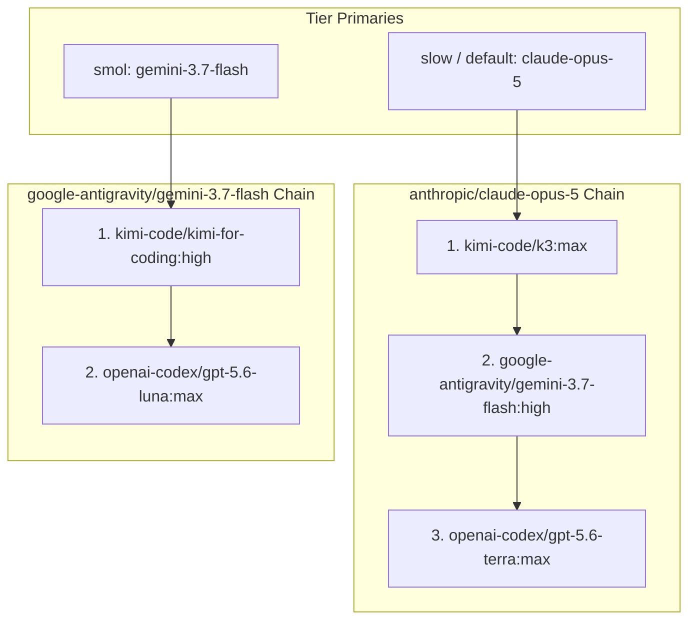

# OMP Model Priority Reorder - Plan

## Goal Capsule

- **Objective:** Reorder the omp model fallback priority to Claude → Kimi → Gemini Flash → GPT and remap the `smol` role to `gemini-3.7-flash` with a `kimi-for-coding` → `gpt-5.6-luna` fallback path.
- **Product authority:** User direction in this session and `AGENTS.md` repository rules.
- **Execution profile:** Targeted data edit in `.chezmoidata/agents.yaml` with render-time validation and CI reconcile suite execution.
- **Stop conditions:** Do not modify unmanaged credentials or run live `chezmoi apply` against `$HOME`.
- **Open blockers:** None.

---

## Product Contract

### Summary

Reconfigure `.chezmoidata/agents.yaml` so that default and slow fallback recovery follows the Claude → Kimi → Gemini Flash → GPT ladder. Update the `smol` tier to use `google-antigravity/gemini-3.7-flash:high` as primary, retuning light-weight agent tasks (`scout`, `librarian`, `sonic`, `commit`) to recover through `kimi-code/kimi-for-coding:high` and `openai-codex/gpt-5.6-luna:max`.

### Key Decisions

- **KD1. Primary Fallback Hierarchy:** Recovery chains follow the order Claude → Kimi → Gemini Flash → GPT. (session-settled: user-directed — chosen over Claude → Kimi → GPT → Gemini: user explicitly requested placing Gemini Flash before GPT in fallback chains). Governs R1, R2.
- **KD2. Smol Tier Reassignment:** `smol` primary moves to `google-antigravity/gemini-3.7-flash:high` with `kimi-code/kimi-for-coding:high` → `openai-codex/gpt-5.6-luna:max` fallbacks. (session-settled: user-directed — chosen over `gpt-5.6-luna` primary: user specified `gemini-3.7-flash` as primary and Luna as final hop). Governs R3, R4.
- **KD3. Thinking Level Constraints:** `gemini-3.7-flash` and `kimi-for-coding` cap reasoning level at `:high`, whereas `k3`, `claude-opus-5`, and `gpt-5.6-terra` use `:max`. Governs R1, R2, R3, R4.

### Requirements

**Default and Fallback Priority**
- R1. `agents.omp.settings.retry.fallbackChains.anthropic/claude-opus-5` declares recovery hops in the order `kimi-code/k3:max` → `google-antigravity/gemini-3.7-flash:high` → `openai-codex/gpt-5.6-terra:max`.
- R2. `agents.omp.settings.retry.fallbackChains.default` declares floor recovery hops in the order `anthropic/claude-opus-5:high` → `kimi-code/k3:max` → `google-antigravity/gemini-3.7-flash:high` → `openai-codex/gpt-5.6-terra:max`.

**Smol Role and Fallback Path**
- R3. `agents.omp.settings.modelRoles.smol` is set to `google-antigravity/gemini-3.7-flash:high`.
- R4. `agents.omp.settings.retry.fallbackChains` declares `google-antigravity/gemini-3.7-flash` with hops `kimi-code/kimi-for-coding:high` → `openai-codex/gpt-5.6-luna:max`, and removes the former `openai-codex/gpt-5.6-luna` chain key.

**Stability and Boundaries**
- R5. `agents.omp.settings.modelRoles.advisor` (`openai-codex/gpt-5.6-terra:xhigh`) and `tiny` (`google-antigravity/gemini-3.1-flash-lite:minimal`) remain unchanged.
- R6. `agents.omp.settings.enabledModels` and `disabledProviders` remain unchanged.

### Key Flows

- F1. **Ceiling/Default Tier Fallback**
  - **Trigger:** A `default` or `slow` session on `anthropic/claude-opus-5` encounters a rate limit or plan cap exhaustion.
  - **Steps:** omp falls back to `kimi-code/k3:max`; if Kimi fails, to `google-antigravity/gemini-3.7-flash:high`; if Gemini fails, to `openai-codex/gpt-5.6-terra:max`.
  - **Outcome:** Session recovers in Claude → Kimi → Gemini Flash → GPT order.
  - **Covered by:** R1, R2

- F2. **Smol / Light Agent Fallback**
  - **Trigger:** A subagent aliased to `@smol` (`scout`, `librarian`, `sonic`, `commit`) encounters a rate limit or failure.
  - **Steps:** omp transitions from `google-antigravity/gemini-3.7-flash:high` to `kimi-code/kimi-for-coding:high`; if Kimi fails, to `openai-codex/gpt-5.6-luna:max`.
  - **Outcome:** Light tasks recover without escalating to a deliberation tier.
  - **Covered by:** R3, R4

### Acceptance Examples

- AE1. **Covers R1, R2.** Given the rendered settings, when inspecting `retry.fallbackChains["anthropic/claude-opus-5"]` and `retry.fallbackChains["default"]`, then both list `kimi-code/k3:max` before `google-antigravity/gemini-3.7-flash:high`, and `gemini-3.7-flash` before `openai-codex/gpt-5.6-terra:max`.
- AE2. **Covers R3, R4.** Given the rendered settings, when inspecting `modelRoles.smol` and `retry.fallbackChains`, then `modelRoles.smol` is `google-antigravity/gemini-3.7-flash:high`, `google-antigravity/gemini-3.7-flash` is a chain key with hops `[kimi-code/kimi-for-coding:high, openai-codex/gpt-5.6-luna:max]`, and `openai-codex/gpt-5.6-luna` is not a chain key.
- AE3. **Covers R1-R6.** Given `.ci/test-omp-agent-reconcile.sh` executed against rendered settings, then the script succeeds with zero errors, proving catalog reachability and chain validity.

### Scope Boundaries

- **In scope:** `.chezmoidata/agents.yaml` `modelRoles.smol` and `retry.fallbackChains` entries.
- **Out of scope:** Modifying `advisor` or `tiny` roles, editing provider authentication env vars, adding new external models to `enabledModels`.

---

## Planning Contract

### Key Technical Decisions

- KTD1. **Key fallback chains strictly on tier primaries.** `google-antigravity/gemini-3.7-flash` becomes the chain key for the light tier since it is `modelRoles.smol`'s primary selector. `openai-codex/gpt-5.6-luna` becomes a hop only and loses its chain key, preventing recovery hijacking per `AGENTS.md`. Governs R3, R4.
- KTD2. **Shared recovery ordering across tier primary and default floor.** The `default` fallback chain replicates the Claude → Kimi → Gemini → GPT order with `anthropic/claude-opus-5:high` at its head as the un-keyed model entry point. Governs R1, R2.
- KTD3. **Supported reasoning levels verified against catalog.** Reasoning level `:high` is used for `gemini-3.7-flash` and `kimi-for-coding` because omp catalog schema only admits `[minimal, low, medium, high]` for those models, avoiding render-time or runtime validation failures. Governs R1, R2, R3, R4.

### Technical Design

The change is isolated to `.chezmoidata/agents.yaml`. When rendered through `.chezmoiscripts/70-agents/run_after_config-omp-settings.sh.tmpl`, the declared JSON is validated by `.chezmoitemplates/omp-settings-validate.tmpl` to ensure:
1. Every model selector has a valid provider and model ID.
2. Every chain key containing `/` corresponds to a named selector or hop.
3. No duplicate keys exist in `retry.fallbackChains`.

### Sequencing

1. Edit `.chezmoidata/agents.yaml` with the updated `modelRoles.smol` and `retry.fallbackChains`.
2. Render `.chezmoiscripts/70-agents/run_after_config-omp-settings.sh.tmpl` with chezmoi in scratch.
3. Run `.ci/test-omp-agent-reconcile.sh` and `.ci/check-omp-agent-roster.sh` to verify catalog reachability and chain validity.

### Sources and Research

- `.chezmoidata/agents.yaml` — current model roles and retry fallback chains.
- `.chezmoitemplates/omp-settings-validate.tmpl` — render-time settings validation contract.
- `.ci/test-omp-agent-reconcile.sh` — CI integration test for omp agent settings reconciliation and reachability.
- `AGENTS.md` — model policy and fallback chain invariants.

---

## Implementation Units

### U1. Update model roles and fallback chains in .chezmoidata/agents.yaml

- **Goal:** Configure Claude → Kimi → Gemini Flash → GPT priority and update `smol` tier mappings in `.chezmoidata/agents.yaml`.
- **Requirements:** R1, R2, R3, R4, R5, R6. Implements KTD1, KTD2, KTD3.
- **Files:**
  - `.chezmoidata/agents.yaml`
- **Patterns:**
  - `agents.omp.settings.modelRoles`
  - `agents.omp.settings.retry.fallbackChains`
- **Test Scenarios:**
  - Rendering `.chezmoiscripts/70-agents/run_after_config-omp-settings.sh.tmpl` produces valid JSON for `modelRoles` and `retry.fallbackChains`.
  - `retry.fallbackChains` contains keys `anthropic/claude-opus-5`, `google-antigravity/gemini-3.7-flash`, and `default`.
  - No orphan chain keys exist; `openai-codex/gpt-5.6-luna` is not a chain key.
- **Verification:**
  - `chezmoi execute-template < .chezmoiscripts/70-agents/run_after_config-omp-settings.sh.tmpl` succeeds with no errors.

### U2. Verify with test-omp-agent-reconcile.sh and check-omp-agent-roster.sh

- **Goal:** Prove that the updated configuration satisfies all CI validation and reachability rules.
- **Requirements:** R1, R2, R3, R4, R5, R6. Covers AE1, AE2, AE3.
- **Files:**
  - `.ci/test-omp-agent-reconcile.sh`
  - `.ci/check-omp-agent-roster.sh`
- **Test Scenarios:**
  - Run `.ci/test-omp-agent-reconcile.sh` with rendered scripts in an isolated scratch environment.
  - Run `.ci/check-omp-agent-roster.sh` against rendered settings script.
- **Verification:**
  - Both test scripts exit with code 0.

---

## Verification Contract

| Command | Purpose |
|---|---|
| `scratch=$(mktemp -d); PATH="$scratch/op-stub:$PATH" chezmoi --config "$scratch/empty.toml" --source "$PWD" execute-template < .chezmoiscripts/70-agents/run_after_config-omp-settings.sh.tmpl > "$scratch/settings.sh"` | Render settings script |
| `.ci/test-omp-agent-reconcile.sh "$scratch/auth.sh" "$scratch/plugins.sh" "$scratch/haptic-package" "$scratch/settings.sh"` | Run omp reconciliation test suite |
| `.ci/check-omp-agent-roster.sh "$scratch/settings.sh"` | Verify bundled agent override roster |

---

## Definition of Done

- `.chezmoidata/agents.yaml` reflects the new model roles and fallback chains.
- Rendered settings script passes `.chezmoitemplates/omp-settings-validate.tmpl` checks.
- `.ci/test-omp-agent-reconcile.sh` and `.ci/check-omp-agent-roster.sh` pass cleanly in an isolated test environment.
