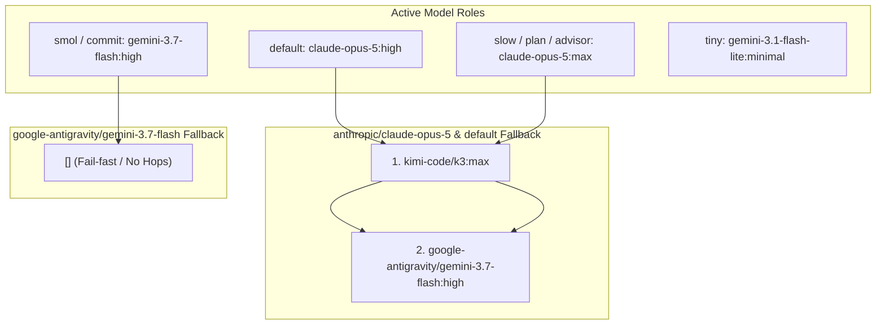

# OMP Smol Gemini Isolation and Codex Fallback Pruning - Plan

## Goal Capsule

- **Objective:** Isolate the `smol` role strictly to `google-antigravity/gemini-3.7-flash:high` with fail-fast execution (`[]` fallback chain), prune all `openai-codex` models from fallback chains, `enabledModels`, and `providers.imageOrder`, and remap the `advisor` and `reviewer` roles to `@slow` (`anthropic/claude-opus-5:max`).
- **Product authority:** User direction in this session and `AGENTS.md` repository model placement policies.
- **Execution profile:** Targeted configuration edit in `.chezmoidata/agents.yaml` with render-time validation and CI reconciliation verification.
- **Stop conditions:** Do not modify unmanaged credentials or run live `chezmoi apply` against `$HOME`.
- **Open blockers:** None.

---

## Product Contract

### Summary

Reconfigure `.chezmoidata/agents.yaml` to isolate the `smol` tier strictly on `google-antigravity/gemini-3.7-flash:high` without external fallback hops (`[]`). Decouple `openai-codex` from the entire active configuration by removing it from `retry.fallbackChains`, pruning `openai-codex/*` selectors from `enabledModels` and `providers.imageOrder`, and remapping the `advisor` role and `reviewer` subagent to `@slow` (`anthropic/claude-opus-5:max`). The ceiling and default recovery chains consolidate to a three-tier ladder: Claude Opus 5 → Kimi K3 → Gemini 3.7 Flash.

### Key Decisions

- KD1. **Smol Fail-Fast Isolation:** `google-antigravity/gemini-3.7-flash` declares an empty fallback chain `[]` in `retry.fallbackChains`, failing immediately on rate limits or provider errors rather than escalating or falling back to other providers. (session-settled: user-directed — chosen over Gemini-family or multi-provider fallback: user explicitly requested using Gemini 3.7 Flash only for SMOL tasks). Governs R1, R2.
- KD2. **Complete Codex Model Decoupling:** `openai-codex` models are completely removed from fallback chains (`anthropic/claude-opus-5`, `default`), `enabledModels`, and `providers.imageOrder`. (session-settled: user-directed — chosen over keeping fallback or manual access: user requested complete decoupling across roles and chains). Governs R3, R4, R7, R8.
- KD3. **Advisor and Reviewer Role Consolidation:** `modelRoles.advisor` and `task.agentModelOverrides.reviewer` remap from `openai-codex/gpt-5.6-terra:xhigh` to `@slow` (`anthropic/claude-opus-5:max`), maintaining deep code review capabilities on the primary deliberation tier. (session-settled: user-directed — chosen over Kimi K3 or Gemini Flash: user selected @slow for reviewer). Governs R5, R6.
- KD4. **Three-Provider Recovery Ladder:** `anthropic/claude-opus-5` and `default` recovery ladders consolidate to Anthropic → Kimi (`k3:max`) → Google (`gemini-3.7-flash:high`). Governs R3, R4.

### Requirements

**Smol Role and Isolation**
- R1. `agents.omp.settings.modelRoles.smol` is set to `google-antigravity/gemini-3.7-flash:high`.
- R2. `agents.omp.settings.retry.fallbackChains."google-antigravity/gemini-3.7-flash"` is set to `[]` (empty list), preventing any fallback hop when Gemini 3.7 Flash encounters errors.

**Fallback Chain Pruning**
- R3. `agents.omp.settings.retry.fallbackChains."anthropic/claude-opus-5"` declares recovery hops in the exact order `kimi-code/k3:max` → `google-antigravity/gemini-3.7-flash:high`, with no `openai-codex` hop.
- R4. `agents.omp.settings.retry.fallbackChains.default` declares floor recovery hops in the exact order `anthropic/claude-opus-5:high` → `kimi-code/k3:max` → `google-antigravity/gemini-3.7-flash:high`, with no `openai-codex` hop.

**Advisor and Reviewer Remapping**
- R5. `agents.omp.settings.modelRoles.advisor` is set to `anthropic/claude-opus-5:max`.
- R6. `agents.omp.settings.task.agentModelOverrides.reviewer` remains aliased to `@advisor` (or `@slow`).

**Whitelisting and Provider Ordering**
- R7. `agents.omp.settings.enabledModels` removes all `openai-codex/*` entries (`openai-codex/gpt-5.6-luna`, `openai-codex/gpt-5.6-terra`, `openai-codex/gpt-5.6-sol`), retaining only Anthropic, Google, and Kimi selectors.
- R8. `agents.omp.settings.providers.imageOrder` updates its priority list to `[antigravity, openrouter]`, removing `openai-codex`.

### Key Flows

- F1. **Smol Agent Execution and Error Handling**
  - **Trigger:** A light subagent aliased to `@smol` (`scout`, `librarian`, `sonic`, `commit`) encounters a rate limit or execution error on `google-antigravity/gemini-3.7-flash`.
  - **Steps:** omp checks `retry.fallbackChains["google-antigravity/gemini-3.7-flash"]`, finds `[]`, and immediately terminates without retrying or falling back to other models.
  - **Outcome:** Light tasks fail fast and maintain model exclusivity without escalating to other providers.
  - **Covered by:** R1, R2
- F2. **Deliberation / Default Recovery**
  - **Trigger:** A primary session on `anthropic/claude-opus-5` encounters a rate limit or plan cap exhaustion.
  - **Steps:** omp transitions from `claude-opus-5` to `kimi-code/k3:max`; if K3 fails, it transitions to `google-antigravity/gemini-3.7-flash:high`.
  - **Outcome:** Session recovers across Kimi and Gemini without referencing Codex.
  - **Covered by:** R3, R4
- F3. **Code Review Execution**
  - **Trigger:** `reviewer` subagent is spawned.
  - **Steps:** omp resolves `@advisor` to `anthropic/claude-opus-5:max`.
  - **Outcome:** Deep analysis executes on Claude Opus 5 with maximum reasoning effort.
  - **Covered by:** R5, R6

### Acceptance Examples

- AE1. **Covers R1, R2.** Given rendered settings, when inspecting `modelRoles.smol` and `retry.fallbackChains["google-antigravity/gemini-3.7-flash"]`, then `modelRoles.smol` is `google-antigravity/gemini-3.7-flash:high` and `retry.fallbackChains["google-antigravity/gemini-3.7-flash"]` is `[]`.
- AE2. **Covers R3, R4.** Given rendered settings, when inspecting `retry.fallbackChains["anthropic/claude-opus-5"]` and `retry.fallbackChains["default"]`, then neither contains any `openai-codex/` selector, and both contain `kimi-code/k3:max` followed by `google-antigravity/gemini-3.7-flash:high`.
- AE3. **Covers R5, R6.** Given rendered settings, when inspecting `modelRoles.advisor` and `task.agentModelOverrides.reviewer`, then `modelRoles.advisor` is `anthropic/claude-opus-5:max` and `task.agentModelOverrides.reviewer` is `@advisor`.
- AE4. **Covers R7, R8.** Given rendered settings, when inspecting `enabledModels` and `providers.imageOrder`, then no entry starts with `openai-codex`.
- AE5. **Covers R1-R8.** Given `.ci/test-omp-agent-reconcile.sh` and `.ci/check-omp-agent-roster.sh` executed against rendered settings, then both exit with code 0.

### Scope Boundaries

- **In scope:** `.chezmoidata/agents.yaml` `modelRoles`, `task.agentModelOverrides`, `retry.fallbackChains`, `enabledModels`, and `providers.imageOrder`; `AGENTS.md` prose alignment.
- **Out of scope:** Modifying `tiny` role (`gemini-3.1-flash-lite:minimal`), modifying MCP server configs or static auth environment variables.

---

## Planning Contract

### Key Technical Decisions

- KTD1. **Empty list encoding for fail-fast model chains.** `retry.fallbackChains` supports empty arrays `[]`. Setting `google-antigravity/gemini-3.7-flash: []` prevents omp from consulting the default floor when the primary model fails. (session-settled: user-directed — chosen over Gemini-family fallback: user requested complete isolation). Governs R1, R2.
- KTD2. **Consistent provider removal across whitelisting, routing, and image order.** When removing `openai-codex`, all references in `enabledModels`, `modelRoles`, `retry.fallbackChains`, and `providers.imageOrder` are cleaned up together to ensure catalog integrity. (session-settled: user-directed — chosen over keeping fallback or manual access: user requested complete decoupling). Governs R3, R4, R5, R7, R8.
- KTD3. **Align AGENTS.md model policy prose.** Update the documentation in `AGENTS.md` to reflect the removal of `openai-codex` hops and the fail-fast status of the `smol` tier. Governs R1, R3, R4.

### Technical Design

The configuration in `.chezmoidata/agents.yaml` is rendered by `.chezmoiscripts/70-agents/run_after_config-omp-settings.sh.tmpl` and verified against `.chezmoitemplates/omp-settings-validate.tmpl`.

### Sequencing

1. Edit `.chezmoidata/agents.yaml` to update `modelRoles.advisor`, `enabledModels`, `retry.fallbackChains`, and `providers.imageOrder`.
2. Update `AGENTS.md` model placement prose.
3. Render `.chezmoiscripts/70-agents/run_after_config-omp-settings.sh.tmpl` with chezmoi in scratch.
4. Run `.ci/test-omp-agent-reconcile.sh` and `.ci/check-omp-agent-roster.sh`.

### Sources and Research

- `.chezmoidata/agents.yaml` — current model roles, fallback chains, and whitelist.
- `.chezmoitemplates/omp-settings-validate.tmpl` — settings validator contract.
- `.ci/test-omp-agent-reconcile.sh` — CI integration test for omp agent settings reconciliation.
- `AGENTS.md` — model policy and fallback chain documentation.

---

## Implementation Units

### U1. Update model roles, fallback chains, whitelist, and image order in .chezmoidata/agents.yaml

- **Goal:** Isolate `smol` to fail-fast Gemini 3.7 Flash and remove `openai-codex` from fallback chains, `enabledModels`, `modelRoles`, and `providers.imageOrder`.
- **Requirements:** R1, R2, R3, R4, R5, R6, R7, R8. Implements KTD1, KTD2.
- **Files:**
  - `.chezmoidata/agents.yaml`
- **Patterns:**
  - `agents.omp.settings.modelRoles`
  - `agents.omp.settings.retry.fallbackChains`
  - `agents.omp.settings.enabledModels`
  - `agents.omp.settings.providers.imageOrder`
- **Test Scenarios:**
  - `modelRoles.smol` is `google-antigravity/gemini-3.7-flash:high`.
  - `modelRoles.advisor` is `anthropic/claude-opus-5:max`.
  - `retry.fallbackChains["google-antigravity/gemini-3.7-flash"]` is `[]`.
  - `retry.fallbackChains["anthropic/claude-opus-5"]` and `retry.fallbackChains["default"]` contain only `kimi-code/k3:max` and `google-antigravity/gemini-3.7-flash:high`.
  - `enabledModels` contains no `openai-codex` entry.
  - `providers.imageOrder` starts with `antigravity`.
- **Verification:**
  - `chezmoi execute-template < .chezmoiscripts/70-agents/run_after_config-omp-settings.sh.tmpl` succeeds with no errors.

### U2. Align AGENTS.md model policy prose

- **Goal:** Update the model placement and fallback chain descriptions in `AGENTS.md` to reflect the three-provider ladder and SMOL fail-fast status.
- **Requirements:** R1, R3, R4. Implements KTD3.
- **Files:**
  - `AGENTS.md`
- **Patterns:**
  - Section "Host facts, gates, and system configuration" / "Agent surfaces and ownership"
- **Test Scenarios:**
  - `AGENTS.md` describes Claude → Kimi (`k3`) → Gemini Flash (`gemini-3.7-flash`) without mentioning GPT-5.6 Terra as a fallback hop.
  - `AGENTS.md` describes SMOL as fail-fast without Kimi/OpenAI fallback.
- **Verification:**
  - `git diff AGENTS.md` shows clean, accurate prose alignment.

### U3. Verify settings with test-omp-agent-reconcile.sh and check-omp-agent-roster.sh

- **Goal:** Prove that the updated configuration satisfies all CI validation and reachability rules.
- **Requirements:** R1, R2, R3, R4, R5, R6, R7, R8. Covers AE1, AE2, AE3, AE4, AE5.
- **Files:**
  - `.ci/test-omp-agent-reconcile.sh`
  - `.ci/check-omp-agent-roster.sh`
- **Test Scenarios:**
  - Run `.ci/test-omp-agent-reconcile.sh` in isolated scratch environment.
  - Run `.ci/check-omp-agent-roster.sh` against rendered settings script.
- **Verification:**
  - Both test scripts exit with code 0.

---

## Verification Contract

| Command | Purpose |
|---|---|
| `scratch=$(mktemp -d); PATH="$scratch/op-stub:$PATH" chezmoi --config "$scratch/empty.toml" --source "$PWD" execute-template < .chezmoiscripts/70-agents/run_after_config-omp-settings.sh.tmpl > "$scratch/settings.sh"` | Render settings script |
| `.ci/test-omp-agent-reconcile.sh "$scratch/auth.sh" "$scratch/plugins.sh" "$scratch/haptic-package" "$scratch/settings.sh"` | Run omp reconciliation test suite |
| `.ci/check-omp-agent-roster.sh "$scratch/settings.sh"` | Verify bundled agent override roster |

---

## Definition of Done

- `.chezmoidata/agents.yaml` reflects the new model roles, fallback chains, enabled models, and image order.
- `AGENTS.md` model policy prose matches the configuration.
- Rendered settings script passes `.chezmoitemplates/omp-settings-validate.tmpl` checks.
- `.ci/test-omp-agent-reconcile.sh` and `.ci/check-omp-agent-roster.sh` pass cleanly in an isolated test environment.
