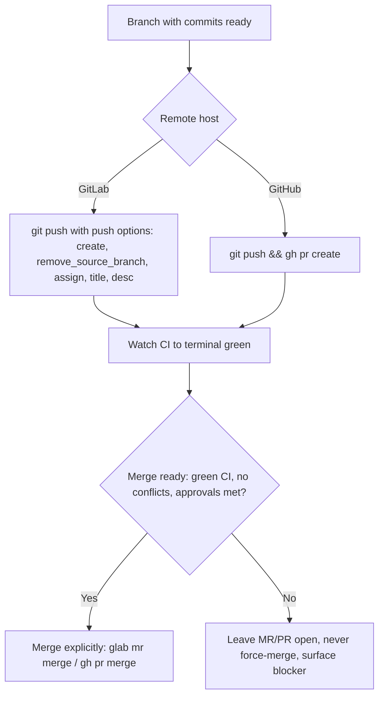

# Remove Manual Merge Instruction Rune - Plan

## Goal Capsule

- **Objective:** Remove the attended-run draft / "for a human to merge" instruction rune from the common agent instruction core in `.chezmoitemplates/agents-instructions.tmpl`. Unify merge behavior across all runs so that after CI is green, the agent confirms merge readiness and executes the merge itself (`glab mr merge` / `gh pr merge`) rather than leaving MRs/PRs in a draft state or open for manual human merge.
- **Product authority:** The user's request: "remove rune for leaving MR/PR open to merge by hand". Root `AGENTS.md` governs chezmoi source attributes, single-source-of-truth templates, and isolated verification. `.chezmoitemplates/agents-instructions.tmpl` is the single source for the deployed instruction target.
- **Execution profile:** Clause-scoped edits to `.chezmoitemplates/agents-instructions.tmpl`. Isolated render and instruction test verification. Never apply source state directly to live `$HOME`.
- **Stop conditions:** Stop if changes break existing needles in `.ci/test-agent-instructions.sh`, reintroduce banned tokens, weaken the prohibition against force-merging not-merge-ready MRs, or drop auto-closing issue keyword requirements.

---

## Product Contract

### Summary

In `.chezmoitemplates/agents-instructions.tmpl`, remove the rule that directs attended runs to pass `-o merge_request.draft` and mark the MR ready with `glab mr update <id> --ready` "for a human to merge", and remove `(optionally --draft)` from the GitHub creation instructions. Also adjust the issue closure wording to "on merge to the default branch" rather than "when a human merges to the default branch". All runs follow the unified flow: open MR ready without auto-merge, wait for CI to be green, verify merge readiness, and merge explicitly via `glab mr merge <id>` or `gh pr merge <id>` (or leave open if blocked).

### Problem Frame

Previously, `.chezmoitemplates/agents-instructions.tmpl` maintained a split between attended runs and unattended runs (`lfg`):
1. Attended runs were instructed to create draft MRs (`-o merge_request.draft`), wait for CI, mark the MR ready (`glab mr update <id> --ready`), and stop "for a human to merge".
2. On GitHub, attended runs were instructed that `gh pr create (optionally --draft)` was used.
3. Issue closure prose stated "when a human merges to the default branch".

This created an unnecessary friction rune where agents in interactive sessions stopped short at an open PR/MR waiting for manual user intervention to click merge, even when CI was green and the PR was fully verified and merge-ready. Removing this rune streamlines both GitLab and GitHub workflows to complete the merge autonomously once CI passes and criteria are verified.

### Key Decisions

- **KD1 — Remove attended draft / human-to-merge rune completely.** Unify all runs to create merge requests ready (no `-o merge_request.draft`), avoiding the draft-to-ready two-step. Governs R1, R2.
- **KD2 — Preserve the prohibition against `-o merge_request.auto_merge` on GitLab.** Auto-merge does not reliably trigger `Closes #N` issue closing on GitLab; explicit `glab mr merge` / `gh pr merge` after CI passes ensures platform-driven issue closing occurs. Governs R3.
- **KD3 — Preserve the non-force-merge guard for unmergeable MRs/PRs.** If an MR/PR is not merge-ready (conflicts, missing approvals, failing pipeline), the agent leaves it open, never force-merges, and surfaces the blocker. Governs R4.
- **KD4 — Update issue closure phrasing.** Change "when a human merges to the default branch" in the issue-lifecycle paragraph to "on merge to the default branch" to reflect autonomous completion while maintaining the rule against direct issue close/reopen. Governs R5.

### Requirements

**Instruction core (`.chezmoitemplates/agents-instructions.tmpl`)**

- R1. The GitLab push-option paragraph MUST NOT instruct attended runs to pass `-o merge_request.draft` or mark the MR ready with `glab mr update <id> --ready` for a human to merge.
- R2. The GitHub paragraph MUST NOT include `(optionally --draft)`.
- R3. The GitLab push-option paragraph MUST instruct that the opening push MUST NOT pass `-o merge_request.auto_merge` because auto-merge does not fire `Closes #N` issue auto-closing.
- R4. The GitLab and GitHub instructions MUST retain the rule that once CI reports terminal green, the agent confirms the MR/PR is merge-ready and merges it itself (`glab mr merge <id>` on GitLab, `gh pr merge <id>` on GitHub), and if not merge-ready leaves it open without force-merging.
- R5. The issue-lifecycle paragraph MUST state that the platform closes the issue on merge to the default branch, removing the reference to a human merger.

**Surfaces that do not change**

- R6. The `lfg` autopilot paragraph in `## Routing and mirrors` remains unchanged.
- R7. All existing rules regarding issue linking, assignee carve-outs, keyword repetition (`Closes #1, Closes #2`), blocking CI watchers, and subagent delegation remain unchanged.
- R8. `.ci/test-agent-instructions.sh`'s `NEEDLES` and `BANNED` lists remain satisfied without modification.

### Acceptance Examples

- AE1. GitLab MR flow in instructions.
  - **Given:** Rendered agent instructions.
  - **When:** An agent reads the GitLab instructions.
  - **Then:** The opening push creates the MR ready without draft or auto_merge push options; after CI is green, the agent verifies merge readiness and merges via `glab mr merge <id>`.
- AE2. GitHub PR flow in instructions.
  - **Given:** Rendered agent instructions.
  - **When:** An agent reads the GitHub instructions.
  - **Then:** `gh pr create` is used without `--draft`; after CI is green, the agent merges via `gh pr merge <id>`.
- AE3. Issue closure prose in instructions.
  - **Given:** Rendered agent instructions.
  - **When:** An agent reads the issue closure rules.
  - **Then:** Issue closure is described as occurring on merge to the default branch without requiring a human to merge.

---

## Planning Contract

### Key Technical Decisions

- **KTD1 — Minimal surgical text edits.** Edit only the specific clauses in `.chezmoitemplates/agents-instructions.tmpl` lines 52 and 70, preserving all other policy lines and avoiding reflow of unwrapped lines.
- **KTD2 — Isolated chezmoi rendering verification.** Test the change using `.ci/test-agent-instructions.sh` and isolated `chezmoi execute-template` rendering of `dot_omp/private_agent/private_readonly_AGENTS.md.tmpl`.

---

## Implementation Units

### U1. Update `.chezmoitemplates/agents-instructions.tmpl`

- **Goal:** Remove the manual merge / draft runes from lines 52 and 70 of `.chezmoitemplates/agents-instructions.tmpl`.
- **Requirements:** R1, R2, R3, R4, R5, R6, R7, R8.
- **Files:** `.chezmoitemplates/agents-instructions.tmpl`
- **Approach:**
  1. In line 52 (issue lifecycle): replace `when a human merges to the default branch` with `on merge to the default branch`.
  2. In line 70 (GitLab and GitHub MR/PR instructions): replace the attended draft sentence and unattended prefix with a unified statement: `The opening push MUST NOT pass -o merge_request.auto_merge, because an auto-merge does not fire the MR description's Closes #N issue auto-closing; the CI-watch obligation above still applies, so once it reports terminal green the agent confirms the MR/PR is merge-ready (mergeable, no conflicts, required approvals satisfied) and merges it itself with an explicit command or tool — glab mr merge <id> on GitLab, gh pr merge <id> on GitHub — so the platform fires any Closes #N on the real merge to the default branch; if it is not merge-ready (conflicts, missing approvals, or no pipeline), the agent leaves the MR/PR open, never force-merges, and surfaces the blocker.`
  3. In line 70: replace `gh pr create (optionally --draft)` with `gh pr create`.
- **Verification:** Run `.ci/test-agent-instructions.sh` and verify clean rendering.

---

## Verification Contract

- **Test suite:** Run `.ci/test-agent-instructions.sh` to assert all required needles pass and banned tokens are absent.
- **Render check:** Render `dot_omp/private_agent/private_readonly_AGENTS.md.tmpl` via chezmoi in scratch to verify output.
- **Diff scope:** `git diff --check` and `git status` show only `.chezmoitemplates/agents-instructions.tmpl` and this plan document.

---

## Definition of Done

- `.chezmoitemplates/agents-instructions.tmpl` is updated to remove draft / human-to-merge runes on GitLab and GitHub.
- `.ci/test-agent-instructions.sh` passes.
- `git diff --check` is clean.
- Work is committed on a descriptive Git-Flow branch, pushed, and verified.
