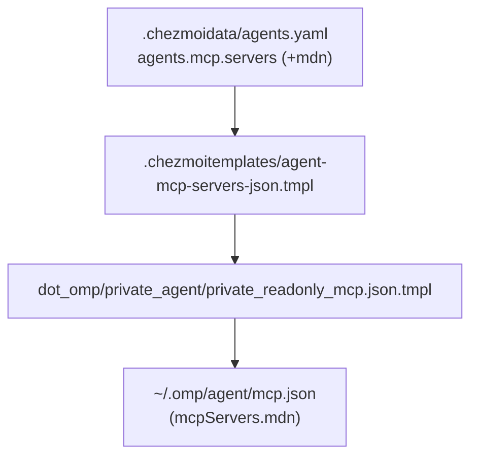

# Add MDN MCP Server - Plan

## Goal Capsule

- **Objective:** Enable Oh My Pi (omp) to query Mozilla Developer Network (MDN) search, documentation, and browser compatibility data via the official MDN MCP server.
- **Means:** Declare the `mdn` remote Streamable HTTP MCP server with an analytics opt-out header in `.chezmoidata/agents.yaml`.
- **Product Authority:** User instruction via `ce-brainstorm` session.
- **Execution Profile:** `execution: code`
- **Stop Conditions:** `.chezmoidata/agents.yaml` declares `mdn` and `dot_omp/private_agent/private_readonly_mcp.json.tmpl` renders valid JSON containing the server.
- **Open Blockers:** None.

---

## Product Contract

### Summary

Add the official MDN MCP remote server (`https://mcp.mdn.mozilla.net/`) to `.chezmoidata/agents.yaml` under `agents.mcp.servers`. The server connects over Streamable HTTP and includes the `X-Moz-1st-Party-Data-Opt-Out: "1"` header to preserve query privacy.

### Problem Frame

Coding agents frequently need up-to-date web platform documentation, CSS property definitions, JavaScript standard API references, and cross-browser compatibility data. Adding MDN's official MCP server provides direct, authoritative answers for open web technologies without relying on stale model training data or web search scraping.

### Key Decisions

- **Remote Streamable HTTP transport:** (session-settled: user-approved — chosen over local stdio binary: official remote endpoint requires no local toolchain or package installations) Governs R2.
- **First-party analytics opt-out header:** (session-settled: user-directed — chosen over omitting analytics header: prevents Mozilla first-party telemetry on tool queries) Governs R3.

### Requirements

- R1. `.chezmoidata/agents.yaml` declares an MCP server named `mdn` in the `agents.mcp.servers` list.
- R2. The `mdn` server specifies `transport: http` and `url: https://mcp.mdn.mozilla.net/`.
- R3. The `mdn` server specifies the request header `X-Moz-1st-Party-Data-Opt-Out: "1"`.
- R4. Template rendering of `dot_omp/private_agent/private_readonly_mcp.json.tmpl` produces a valid `mcpServers.mdn` object with `"type": "http"`, `"url": "https://mcp.mdn.mozilla.net/"`, and `"headers": { "X-Moz-1st-Party-Data-Opt-Out": "1" }`.

### Acceptance Examples

- AE1. Rendered MCP JSON structure (Covers R1, R2, R3, R4)
  - **Given** `.chezmoidata/agents.yaml` with the `mdn` server defined
  - **When** `dot_omp/private_agent/private_readonly_mcp.json.tmpl` is evaluated for `omp`
  - **Then** the generated `~/.omp/agent/mcp.json` contains:
    ```json
    "mdn": {
      "headers": {
        "X-Moz-1st-Party-Data-Opt-Out": "1"
      },
      "type": "http",
      "url": "https://mcp.mdn.mozilla.net/"
    }
    ```

### Scope Boundaries

- **Out of scope (deferred/excluded):**
  - Local stdio package installation (e.g. `@modelcontextprotocol/server-mdn`).
  - 1Password secret resolution (the MDN endpoint is public and requires no credentials).
  - Modifying other agent harness configurations or unrelated MCP servers.

### Sources / Research

- MDN MCP Server Documentation: `https://developer.mozilla.org/en-US/mcp`
- Upstream MCP Endpoint: `https://mcp.mdn.mozilla.net/`
- Configuration Target: `.chezmoidata/agents.yaml` (`agents.mcp.servers`)
- Template Consumer: `.chezmoitemplates/agent-mcp-servers-json.tmpl` and `dot_omp/private_agent/private_readonly_mcp.json.tmpl`

---

## Planning Contract

### Key Technical Decisions

- **KTD1. Neutral HTTP server declaration in agents.yaml.** Declare `mdn` under `agents.mcp.servers` using `transport: http`, `url: https://mcp.mdn.mozilla.net/`, and the literal string header `X-Moz-1st-Party-Data-Opt-Out: "1"`. Governs R1, R2, R3.
- **KTD2. Zero-template-change consumer integration.** Existing `.chezmoitemplates/agent-mcp-servers-json.tmpl` and `dot_omp/private_agent/private_readonly_mcp.json.tmpl` already handle `transport: http` with arbitrary `headers` maps without modification. Governs R4.

### High-Level Technical Design



---

## Implementation Units

### U1. Declare MDN MCP server in agents.yaml
- **Goal:** Add the `mdn` server configuration to `agents.mcp.servers` in `.chezmoidata/agents.yaml`.
- **Files:** `.chezmoidata/agents.yaml`
- **Patterns:** Existing `context7` entry under `agents.mcp.servers`.
- **Requirements Covered:** R1, R2, R3, R4.
- **Test Scenarios:**
  - `agents.mcp.servers` contains a server named `mdn` with `transport: http`, `url: https://mcp.mdn.mozilla.net/`, and `headers: { X-Moz-1st-Party-Data-Opt-Out: "1" }`.
  - `chezmoi execute-template < dot_omp/private_agent/private_readonly_mcp.json.tmpl` succeeds and emits a valid JSON object containing `mcpServers.mdn`.

---

## Verification Contract

### Automated Verification
```bash
# 1. Verify template rendering in isolation
chezmoi execute-template < dot_omp/private_agent/private_readonly_mcp.json.tmpl | jq -e '.mcpServers.mdn.type == "http" and .mcpServers.mdn.url == "https://mcp.mdn.mozilla.net/" and .mcpServers.mdn.headers["X-Moz-1st-Party-Data-Opt-Out"] == "1"'

# 2. Check git status and whitespace
git diff --check
```

---

## Definition of Done

- [ ] `.chezmoidata/agents.yaml` declares the `mdn` server under `agents.mcp.servers`.
- [ ] `dot_omp/private_agent/private_readonly_mcp.json.tmpl` renders valid JSON containing the `mdn` server definition with expected URL and header.
- [ ] Automated verification passes.
- [ ] Clean `git diff --check`.
