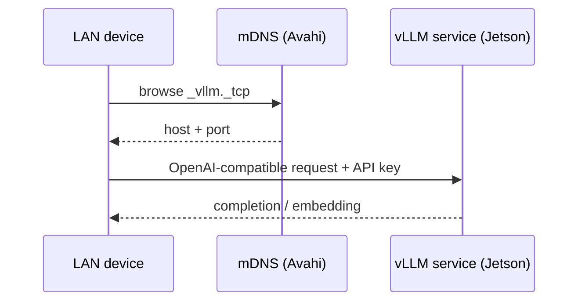
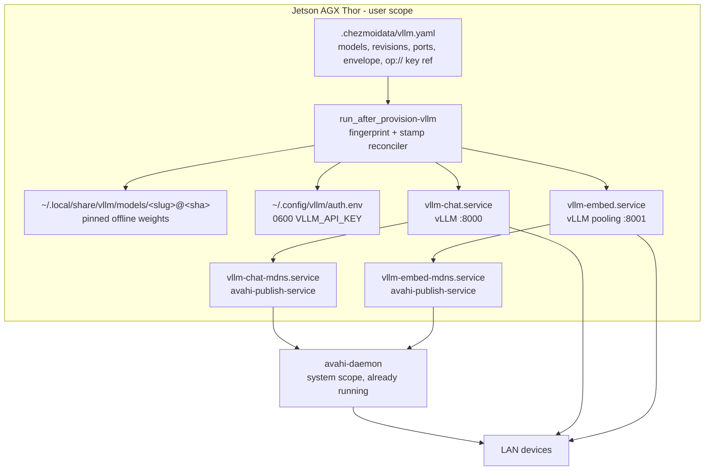
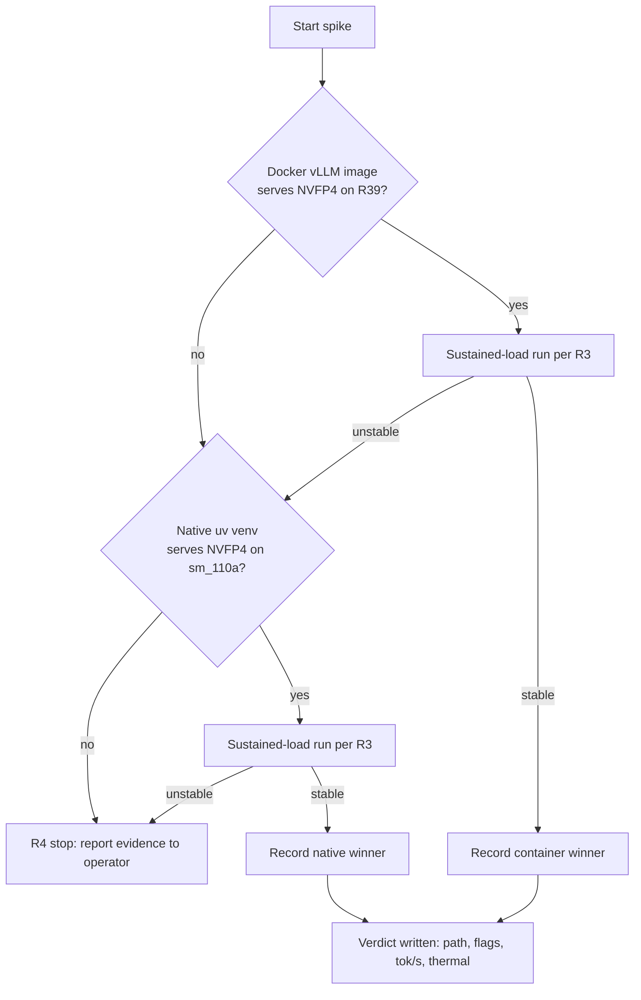

# Jetson Local LLM Service - Plan

## Goal Capsule

- **Objective:** Any of the operator's LAN devices can discover and use a local OpenAI-compatible chat endpoint (Qwen3.8-27B) and an embedding endpoint hosted on the Jetson AGX Thor, with the whole stack declared in this repository so a host rebuild reproduces it.
- **Means:** vLLM serving `unsloth/Qwen3.8-27B-NVFP4` plus a Qwen3-Embedding model, as user-scoped systemd services, after a spike proves a stable serve on this Thor (per the Product Contract Key Decisions).
- **Product authority:** The operator (single-user dotfiles repository).
- **Stop condition:** If the spike shows no acceptable NVFP4 serve path on Thor's sm_110a GPU, work halts and returns to the operator with evidence (per R4).
- **Execution profile:** `ce-work` on the Jetson host itself; U1 runs the spike live on this machine, later units land the dotfiles declarations and are verified in scratch renders plus CI fixtures.
- **Tail ownership:** The operator runs the real `chezmoi apply` after the PR lands; this pipeline never deploys to live `$HOME` (repository rule).
- **Open blockers:** None.

---

## Product Contract

### Summary

A LAN inference box on the Jetson: vLLM serving `unsloth/Qwen3.8-27B-NVFP4` plus an embedding model, running as user-scoped systemd services, advertised over mDNS, gated by an API key. A spike first proves a stable serve on this Thor and picks the packaging path (NVIDIA's Jetson container vs native install) before anything lands in the dotfiles.

### Problem Frame

The operator wants local inference on the Jetson AGX Thor — 122 GiB of unified memory that currently serves no model workload — instead of routing everything through the hosted providers this repository configures. The consumer is not this host's agent harness but the operator's other devices on the LAN, so the endpoint must be discoverable and reachable off-host. One constraint narrows the engine field sharply: the operator excludes llama.cpp (and transitively ollama, which bundles it) over the GGUF parser supply-chain risk, and TensorRT-LLM's Jetson successor does not support this model's hybrid architecture — leaving vLLM as the only engine that both loads the chosen checkpoint and has an official recipe for it.

### Key Decisions

- **Runtime is vLLM** (session-settled: user-directed — chosen over llama.cpp and ollama: GGUF parser supply-chain risk; TensorRT-LLM/TensorRT-Edge-LLM do not support the Qwen3.8 hybrid architecture). Governs R1, R6.
- **Model artifact is `unsloth/Qwen3.8-27B-NVFP4`** (session-settled: user-directed — chosen over FP8 and other quants: operator's pick; the checkpoint is vLLM-only because its `lm_head` is FP8, which locks the runtime with it). Governs R4, R6.
- **Spike before provisioning** (session-settled: user-directed — chosen over straight-to-provisioning: Thor's unknowns — R39 container mismatch, sm_110a kernel paths, thermal behavior — get settled by evidence, not by apply failures). Governs R1, R2, R3.
- **Spike pass line is "any stable serve"** (session-settled: user-directed — chosen over decode-speed thresholds: speed decides tuning, not the model; an unstable serve drops to a smaller model). Governs R3, R4.
- **API-key authentication on the LAN** (session-settled: user-directed — chosen over open LAN and localhost-only: exposure was chosen with a gate, not a trusted network). Governs R8.
- **Two services, one shared key** (session-settled: user-approved — vLLM serves one model per process, so chat and embed are separate units; one shared API key assumed and surfaced at scope confirmation). Governs R5, R7, R10.
- **Group repair is authd-aware** (session-settled: user-directed — chosen over unconditional `usermod`: on this host the operator's account is authd-managed, and `usermod` edits only local `/etc/passwd` users). Governs R5.

### Requirements

**Spike**

- R1. A timeboxed manual spike serves `unsloth/Qwen3.8-27B-NVFP4` under vLLM on the Jetson AGX Thor (L4T R39.2.1, sm_110a) before any dotfiles change lands.
- R2. The spike tries the vendor container path (NVIDIA's Jetson vLLM image) first and a native user-level install second, and records which path produces a stable serve; provisioning adopts the proven path.
- R3. The spike passes when the server starts, answers a chat completion correctly, and survives a sustained-load run without thermal stalls or crashes; decode speed is recorded but does not gate the model choice.
- R4. If no NVFP4 path serves acceptably on sm_110a, the spike stops and reports the evidence to the operator; no silent fallback to another quantization.

**Services**

- R5. The chat service and the embedding service each run as a user-scoped systemd unit gated on the `jetson` fact, following the repository's data-driven user-unit pattern (`dot_config/systemd/user/`, rendered from `.chezmoidata`).
- R6. The chat endpoint serves `unsloth/Qwen3.8-27B-NVFP4` with reasoning parsing and tool calling enabled, per the model's official vLLM recipe.
- R7. The embedding endpoint serves a Qwen3-Embedding-family model sized to run alongside the 27B chat model within unified memory.
- R8. Both endpoints require an API key, one shared key across both, provisioned through the repository's secrets pattern (1Password reference, private env file for the units).
- R9. Both endpoints bind the LAN interface; no host firewall change is required (none is active on this host).
- R10. Both services are advertised over mDNS via the host's Avahi daemon with stable, human-recognizable service names.

**Supply chain**

- R11. Every artifact the services consume — container image or Python packages, and both models' weights — is pinned by version and digest or revision, per the repository's hermetic supply-chain track; no render-time network resolution.

### Key Flows

- F1. Spike to provisioning
  - **Trigger:** Operator starts the work.
  - **Steps:** Run the container arm of the spike; if it fails on L4T R39, run the native arm; record stability, decode speed, and the winning packaging path; on pass, write the dotfiles service declarations; on NVFP4 infeasibility, stop per R4.
  - **Outcome:** A proven serve configuration becomes declared, reproducible configuration.
  - **Covered by:** R1, R2, R3, R4.

- F2. LAN client discovery and use
  - **Trigger:** A device on the LAN wants the chat or embedding endpoint.
  - **Steps:** Client browses mDNS for the advertised service name; resolves the Jetson's address and port; calls the OpenAI-compatible endpoint presenting the shared API key.
  - **Outcome:** Client uses the endpoint without any manual address configuration.
  - **Covered by:** R8, R9, R10.

### Acceptance Examples

- AE1. **Covers R3.** Given the spike server is running, when a sustained decode load runs for an extended session, then the server keeps answering correctly and the Thor shows no BPMP thermal kworker stalls.
- AE2. **Covers R8.** Given either endpoint is running, when a request arrives without the API key, then the request is rejected.
- AE3. **Covers R10.** Given both services are running, when another LAN device browses mDNS, then both advertised names resolve to the Jetson with their ports.
- AE4. **Covers R4.** Given every NVFP4 serve attempt on sm_110a fails or is unusable, when the spike ends, then no dotfiles change has landed and the operator holds the failure evidence.

### Success Criteria

- The spike produces a written verdict: stable/unstable, recorded decode speed, and the winning packaging path.
- After provisioning, `chezmoi apply` on the Jetson converges idempotently — a second apply changes nothing and reruns nothing.
- A LAN device goes from zero configuration to a successful authenticated chat completion using only mDNS discovery and the shared key.

### Scope Boundaries

- No omp or agent-harness integration as a local provider — deferred; the LAN shape keeps it possible without rework.
- No access beyond the LAN — Tailscale is deliberately skipped on this host.
- No llama.cpp, ollama, or GGUF artifacts anywhere in the stack — the operator's supply-chain exclusion.
- No system-level (`/etc`) manifests or system-daemon changes — `sharedHost` gates them off on the Jetson; the work stays user-scoped. The sole exception is the authd-aware group/linger repair named in the Key Decisions above, an imperative hardware entitlement the Tegra device-node permissions require; it does not weaken the `sharedHost` invariant for declarative system state.
- No multi-user concurrency tuning, batch API, or fine-tuning.

### Dependencies / Assumptions

- Avahi daemon is present and enabled on the host (verified: active/enabled); advertisement runs user-scoped through `avahi-publish-service` from companion units (KTD3), so no `/etc/avahi` change is needed.
- No host firewall blocks the LAN ports (verified: ufw absent, firewalld inactive, iptables INPUT policy ACCEPT).
- Rootless podman is unresolved on Ubuntu arm64 Jetson (`.chezmoidata/packages.yaml:565-569`); Docker 29.7.2 is present on the host and is the spike's container runtime (KTD1).
- CUDA comes solely from the `nvidia-jetpack` BSP metapackage on this host (per the Thor support plan, `docs/plans/2026-08-14-001-feat-jetson-agx-thor-support-plan.md`).
- 122 GiB unified memory fits the NVFP4 chat weights (~11 GiB for the unsloth mixed-precision build), the embedding model, and generous KV cache without contention, under the envelope in KTD6.

### Outstanding Questions

- Does any NVFP4 kernel path serve acceptably on sm_110a, given the Marlin NVFP4 exclusion on sm_110? — Answered by execution: U1's spike, with R4 governing failure. Planning evidence is encouraging: native sm_110a builds (CUDA 13.0+, PyTorch 2.11+) compile and run FlashInfer CUTLASS NVFP4 kernels on Thor.
- Which packaging path does provisioning adopt? — Answered by execution: U1 records the winner; U2 declares it in data.
- Which Qwen3-Embedding variant and size? — Resolved by default: KTD7 picks the 4B variant; change it in `.chezmoidata/vllm.yaml` if LAN consumers need different embedding dimensions.
- Which smaller model is the fallback if the 27B cannot serve stably at all? — Deferred to the R4 stop path; chosen with the operator if the spike fails.
- mDNS service types and exact names? — Resolved by default: `_vllm._tcp` with names from data (KTD3).

### Sources / Research

- vLLM recipe for this model, including eager-mode and KV sizing notes: https://recipes.vllm.ai/Qwen/Qwen3.8-27B
- Chosen checkpoint (vLLM-only quant, MTP head, tool-calling notes): https://huggingface.co/unsloth/Qwen3.8-27B-NVFP4
- vLLM pooling/embedding serving: https://docs.vllm.ai/en/stable/models/pooling_models
- dusty-nv/jetson-containers vLLM package: https://github.com/dusty-nv/jetson-containers/blob/master/packages/llm/vllm/README.md
- Hugging Face Hub offline/revision environment variables: https://huggingface.co/docs/huggingface_hub/package_reference/environment_variables
- llama.cpp hybrid-architecture support thread (the excluded engine's record): https://github.com/ggml-org/llama.cpp/issues/27237
- vLLM DeltaNet CUDA-graph mismatch forcing eager mode: https://github.com/vllm-project/vllm/issues/35238
- Thor thermal-stall report under large CUDA unified-memory workloads: https://forums.developer.nvidia.com/t/jetson-agx-thor-r38-4-bpmp-thermal-path-stalls-after-large-cuda-vllm-unified-memory-workload-nvfancontrol-and-thermal-kworkers-stuck-in-d-state/370477
- Repository anchors: `dot_config/systemd/user/mxm4-hapticd.service.tmpl` (user-unit pattern), `.chezmoidata/facts.yaml:174` (`jetson` fact), `.chezmoidata/facts.yaml:289-301` (`sharedHost` disjunction), `.chezmoidata/packages.yaml:565-569` (podman unresolved on Jetson).

---

## Planning Contract

Product Contract preservation: one added Key Decision (authd-aware group repair, from the operator's mid-planning directive) and Outstanding Questions reclassified with their planning resolutions; no scope change beyond that directive.

### Key Technical Decisions

- KTD1. **Packaging arms: vendor container on Docker first, native uv venv second** (per R2's ordering). Docker 29.7.2 is present on the host; podman is absent and unresolved for Jetson in `.chezmoidata/packages.yaml:565-569`, so the container arm runs on Docker and a container win implies declaring that delta in data. The native arm creates a `uv`-managed venv at `~/.local/share/vllm/venv` with a pinned vLLM version; if no aarch64 wheel serves sm_110a, the native arm builds from source through the jetson-containers build recipes — and if neither arm serves, R4 stops the work.
- KTD2. **Weights are prefetched, pinned, and served offline.** The provisioner runs `hf download <repo> --revision <40-hex commit>` into `~/.local/share/vllm/models/<slug>@<short-sha>/` before units start, and units run with `HF_HUB_OFFLINE=1` and `TRANSFORMERS_OFFLINE=1` pointing at the local path. `huggingface-cli` is deprecated in huggingface-hub >= 1.27.0; the provisioner invokes `hf` through `uvx --from huggingface_hub hf`. Revisions live in `.chezmoidata/vllm.yaml` (R11).
- KTD3. **mDNS advertisement uses `avahi-publish-service` companion units.** `avahi-utils` joins `.chezmoidata/packages.yaml` as a Jetson-gated Ubuntu apt row; each serving unit gets a companion unit running `avahi-publish-service` in the foreground with `BindsTo=` the serving unit, so stopping the service withdraws the record. Service type `_vllm._tcp`; names come from data (default `Jetson Qwen Chat` / `Jetson Qwen Embed`). This avoids `/etc/avahi/services` (sharedHost-blocked) and new Python scripting (repository rule); the Avahi system D-Bus policy was verified to permit unprivileged advertisement on this host. Companion units carry `Restart=on-failure` with `RestartSec=5` so a system `avahi-daemon` restart re-advertises. mDNS is a discovery convenience, never a trust anchor: any LAN device can publish or poison records, so the API key is the only access boundary, and clients that care pin host and port instead of browsing.
- KTD4. **The shared API key renders from an `op://` reference into a 0600 env file.** `.chezmoidata/vllm.yaml` holds the unresolved `op://` reference; the provisioner resolves it into `~/.config/vllm/auth.env` (0600, inside a 0700 directory) and units consume it with `EnvironmentFile=` as `VLLM_API_KEY`. The `--api-key` flag form is forbidden because `/proc/<pid>/cmdline` is world-readable on a shared host. The change fingerprint hashes the unresolved reference, never the rendered secret (repository fingerprint contract). The 1Password item should carry at least 256 bits of entropy. Rotation means updating the item and touching the reference comment in data so the fingerprint moves; an in-place 1Password edit alone does not dirty the fingerprint.
- KTD5. **The provisioner asserts host prerequisites: `video`/`render` group membership (authd-aware) and user lingering, and never restarts the user manager inline.** `/dev/nvmap` is `0440 root:video` and the operator's user is not in `video`/`render`, so CUDA allocation from a user unit fails without this. The repair branches on the account type: when `.chezmoi.username` contains `@` the account is authd-managed (repository rule) and membership is added with `sudo gpasswd -a <user> <group>`, which edits `/etc/group` directly and resolves the user through NSS — `usermod` only edits local `/etc/passwd` users and fails here, and this host's `authctl` has no membership subcommand (only `lock`/`unlock`/`set-uid`/`set-gid`, verified). Local accounts keep `sudo usermod -aG`. Sudo use is preflighted with `sudo -n true` and skipped entirely when `id -nG` already shows membership. New group membership only reaches processes in a fresh user session, and `systemctl restart user@<uid>` would kill the operator's whole desktop session — including an in-flight apply — so the provisioner is forbidden from restarting the user manager inline (repository deferred-restart convention); when membership changed it enables the units, prints an operator notice to reboot or re-login, and records a deferred-activation skip instead of failing readiness. Lingering is already enabled for this user (`/var/lib/systemd/linger/`); the provisioner asserts it idempotently for rebuilds.
- KTD6. **Resource envelope on the shared 122 GiB unified memory:** chat `--gpu-memory-utilization 0.65`, embed `0.12`, `PYTORCH_CUDA_ALLOC_CONF=expandable_segments:True`, `--kv-cache-dtype fp8`, bounded `--max-model-len` and `--max-num-seqs` so a single client cannot exhaust the pool, and `OOMScoreAdjust=500` on both units so the OOM killer reaps a serving process before desktop or system processes. The envelope caps physical memory only; GPU compute queues and LPDDR5X bandwidth stay unpartitioned, so sustained decoding can stutter the desktop compositor and push SoC thermals. Values live in data and are tunable.
- KTD7. **Embedding model default: `Qwen/Qwen3-Embedding-4B`, pinned revision.** The middle of the family: ~8 GiB in bf16 fits the KTD6 envelope, with better retrieval quality than the 0.6B. An unlabeled planning default — change it in data if LAN consumers need the 1024-dimensional 0.6B or the 4096-dimensional 8B.
- KTD8. **Rollout runs as five Go/No-Go gates, each aborting the apply on failure.** (1) Preflight: at least 45 GiB free on the weights filesystem, declared ports unheld by unmanaged processes, `sudo -n true` succeeds when group repair is needed (per KTD5), and the `op` reference resolvable non-interactively. (2) Fetch: weights for new revisions are downloaded and verified complete before any unit is touched, so a 23 GiB download never crash-loops a unit. (3) Unit verification: staged units pass `systemd-analyze --user verify` before `daemon-reload` (repository rule: never in preflight). (4) Staged activation: the embed unit starts and answers health first, then the chat unit, each with its own timeout. (5) Advertisement: companion mDNS units start only after both endpoints are healthy, so the LAN never sees a broken record. Units carry `Restart=on-failure` with `RestartSec=30` as the failure-mode floor.

### High-Level Technical Design

Component topology on the host:

Spike decision gate (U1, per R2/R4):

### System-Wide Impact

- **User session lifecycle:** KTD5's group repair only reaches processes in a fresh user session, and restarting the user manager would kill the whole `user-<uid>.slice` — the GNOME session, agent harnesses, and any in-flight apply. The provisioner therefore defers activation with an operator notice instead of restarting anything inline (KTD5).
- **Memory headroom:** the KTD6 envelope pre-allocates about 94 GiB across both services and leaves roughly 28 GiB for the host OS and desktop; `OOMScoreAdjust=500` keeps the OOM killer pointed at the inference engines first.
- **Compute and bandwidth contention:** unified memory does not partition compute queues or bus bandwidth, so sustained decoding competes with the Wayland compositor and can cause frame drops and DVFS thermal throttling even within the memory envelope.
- **Always-on baseline:** linger plus boot-enabled services turns the host into a 24/7 inference appliance — the loaded models hold GPU memory, block deep SoC low-power states, and raise the idle power and fan floor. The operator restores a quiet desktop with `systemctl --user stop vllm-chat vllm-embed` (companions withdraw the records via `BindsTo=`).
- **Shared Avahi dependency:** graceful stops withdraw records with goodbye packets; ungraceful kills leave stale LAN cache entries bounded by the mDNS TTL, and companion restart policy (KTD3) covers system `avahi-daemon` restarts.
- **Multi-homed exposure:** the host answers on both Ethernet (`192.168.10.198/24`) and Wi-Fi (`192.168.188.104/24`); binding and advertising across all interfaces is deliberate, and the API key is the access boundary on every interface.

### Risks & Mitigations

**Security posture**

- Risk: plaintext HTTP with a static Bearer key on the LAN is sniffable and spoofable (ARP/mDNS poisoning). Mitigation: accepted risk for the operator's private single-tenant LAN, recorded here; the key rides in an env file, not the command line (KTD4); mDNS is discovery, not trust (KTD3). Do not expose these ports on guest or public networks — the data file's bind and advertisement are the only exposure knobs.
- Risk: vLLM exposes operational endpoints beyond inference (for example `/metrics`) to any key holder, and unbounded requests can exhaust the shared memory pool. Mitigation: KTD6's `--max-model-len` / `--max-num-seqs` bounds; single shared key means no per-client attribution — accepted for one operator.
- Risk: supply-chain residual — the checkpoint is third-party (unsloth) even pinned. Mitigation: safetensors-only invariant, `--trust-remote-code` forbidden, 40-hex revision pins with hub-side LFS checksum verification on download (KTD2).
- Risk: the provisioner's passwordless sudo is a blast-radius surface. Mitigation: KTD5 preflights `sudo -n true`, checks membership before invoking sudo, and uses sudo only for the group repair and linger assertion.

**Rollout and rollback**

- Risk: a degraded model revision reaches the LAN. Mitigation: KTD8's gates; rollback is flipping the revision SHA in data — old weight directories stay on disk, so a revert is a zero-download unit restart.
- Risk: returning to a zero-service state must not violate the repository's no-teardown rule. Mitigation: removing `.chezmoidata/vllm.yaml` and the unit sources stops management, and U5 adds `docs/decommission/vllm-jetson-services.md`, an operator-run manual reversal checklist (stop and disable units, remove deployed unit files and `auth.env`, `daemon-reload`, optional weight-cache reclamation).
- Risk: mid-apply failure on the live desktop host (disk exhaustion, interrupted download). Mitigation: KTD8 gate 1 checks disk before any write; downloads complete and verify before units change.

**First-24h operational watchpoints**

- Thermal: `tegrastats` for thermal-zone saturation and `dmesg` for BPMP kworker D-state stalls under sustained LAN load.
- OOM: `dmesg` for OOM-killer invocations; confirm the serving process, not a desktop process, was reaped.
- Crash loops: `systemctl --user show vllm-chat.service -p NRestarts` trending up before systemd's restart cap.
- Discovery: companion units stable; a LAN device's browse keeps resolving both names.

### Assumptions

- The embedding model is the 4B variant (KTD7) — an unconfirmed default, chosen for quality headroom; LAN consumer quality needs are unknown.
- The spike runs inside this pipeline on the host (U1), authorized by the operator's request to run the model on this device; the dotfiles provisioning it feeds is verified in scratch renders and CI fixtures, and the live `chezmoi apply` stays operator-run after merge.
- vLLM publishes or builds a working aarch64 artifact for sm_110a within the spike's timebox; the R4 stop path covers the negative case.
- `avahi-publish-service` lifetime semantics (foreground process; record withdrawn on exit) hold on the packaged Ubuntu 24.04 avahi-utils; the companion-unit `BindsTo=` design depends on it.
- `gpasswd -a` accepts an authd-managed user through NSS on this host (the user resolves via `getent`; KTD5). The provisioner verifies membership took effect and fails loudly if it did not.

### Sequencing

U1 (spike) gates everything: its verdict supplies the `packaging:` value U2 declares. U2's data then drives U3's templates and U4's provisioner; U3 and U4 can proceed in parallel once U2 lands. U5 (CI and docs) runs last against the settled file set.

---

## Implementation Units

### U1. Spike: prove the NVFP4 serve on this Thor

- **Goal:** A written spike verdict — winning packaging path, working flag set, decode speed, and thermal outcome — before any repository change.
- **Requirements:** R1, R2, R3, R4; F1; AE1, AE4.
- **Dependencies:** none.
- **Files:** none in the repository; spike scratch lives under `~/src/spike-vllm-thor/` (removed after the verdict, per the Definition of Done cleanup criterion).
- **Approach:**
  1. Container arm first (R2): find a `dustynv/vllm` tag targeting the newest available L4T for Thor, record its digest, and run it on Docker with host networking, the weights volume, and the recipe flag set for this model.
  2. On any L4T-mismatch or sm_110a failure, native arm: create the venv per KTD1, install the pinned vLLM, and serve from the prefetched weights per KTD2.
  3. Serve with the recipe's chat flags: `--reasoning-parser qwen3 --enable-auto-tool-choice --tool-call-parser qwen3_coder --kv-cache-dtype fp8`; try CUDA graphs first and fall back to `--enforce-eager` only on the documented DeltaNet/graph failures, recording which was needed.
  4. Prefetch weights with `hf download unsloth/Qwen3.8-27B-NVFP4 --revision <pinned sha>` (the spike fixes the exact 40-hex revision that U2 declares).
  5. Sustained-load run per AE1: repeated chat completions over an extended session while watching for BPMP thermal kworker stalls.
  6. On double failure, stop per R4/AE4: write the evidence and halt the pipeline.
- **Execution note:** This is host-interactive packaging work; prefer runtime smoke evidence (server logs naming the selected NVFP4 kernel, a real chat completion, observed decode tok/s) over any static check.
- **Test scenarios:**
  - Covers AE1. Sustained decode load over an extended session: server keeps answering; process and kernel logs show no BPMP thermal kworker stalls.
  - Chat completion with a tool-calling prompt returns a parsed tool call, not raw markup (proves the parser flags).
  - Startup log names a real NVFP4 kernel path (e.g. FlashInfer/CUTLASS) rather than an emulation fallback; if only a fallback exists, record the decode penalty.
  - Covers AE4. Both arms failing produces the R4 stop with captured logs, not a silently different quant.
- **Verification:** The verdict is written down with: packaging winner, exact image digest or vLLM version, flag set, observed decode tok/s, thermal outcome, and the pinned weight revision.

### U2. Service data and secrets declaration

- **Goal:** One data file declares everything the units and provisioner consume, including the U1 verdict.
- **Requirements:** R5, R6, R7, R8, R10, R11.
- **Dependencies:** U1.
- **Files:**
  - `.chezmoidata/vllm.yaml` (create)
  - `.chezmoidata/packages.yaml` (add the Jetson-gated `avahi-utils` apt row, per KTD3)
- **Approach:**
  1. Declare both models with repo id, pinned 40-hex revision, local-path slug, and served name; the chat entry carries the U1 flag set.
  2. Declare ports (chat 8000, embed 8001), the KTD6 memory envelope, mDNS type and names, and `packaging:` from U1's verdict.
  3. Declare the API key as an unresolved `op://` reference (KTD4).
  4. Add the `avahi-utils` row following the existing Jetson-gated row shape in `packages.yaml`.
- **Patterns to follow:** `.chezmoidata/haptic.yaml` (service knob data) and the Jetson-gated package rows in `.chezmoidata/packages.yaml`.
- **Test scenarios:**
  - Render check: templates consuming the data render for `jetson: true` and produce empty output for `jetson: false` (mirrors `.ci/test-jetson-installer-render.sh`).
  - The data file parses as YAML and every declared revision is a 40-hex string.
  - The API-key entry is an `op://` reference, never a literal (CI grep gate in U5).
- **Verification:** Data renders in the scratch harness; no secret material exists in the repository.

### U3. Systemd user units and mDNS companions

- **Goal:** Four user unit templates declare the two serving processes and their advertisements.
- **Requirements:** R5, R6, R7, R8, R9, R10; F2; AE2, AE3.
- **Dependencies:** U2.
- **Files:**
  - `dot_config/systemd/user/vllm-chat.service.tmpl` (create)
  - `dot_config/systemd/user/vllm-embed.service.tmpl` (create)
  - `dot_config/systemd/user/vllm-chat-mdns.service.tmpl` (create)
  - `dot_config/systemd/user/vllm-embed-mdns.service.tmpl` (create)
  - `.chezmoiignore` (extend the gated block to exclude these on non-Jetson hosts)
- **Approach:**
  1. Serving units render from `.chezmoidata/vllm.yaml`: `EnvironmentFile=` the KTD4 auth env, offline env per KTD2, resource envelope per KTD6, `Restart=on-failure` with `RestartSec=30` per KTD8.
  2. The chat unit's `ExecStart` uses the U1 flag set; the embed unit uses the pooling runner on its own port (two processes are required — vLLM serves one model per process). Each `ExecStart` renders per the declared `packaging:` value: a `docker run` invocation with host networking and the weights volume for `container`, or the venv binary at `~/.local/share/vllm/venv/bin/vllm` for `native`. Both units restrict cross-origin browser access (vLLM's `--allowed-origins`), so a web page on any LAN device cannot drive the endpoints cross-origin; consumers are non-browser clients.
  3. Companion units run `avahi-publish-service` in the foreground with `BindsTo=` and `After=` their serving unit, plus their own `Restart=on-failure` with `RestartSec=5` to survive system `avahi-daemon` restarts (KTD3). All four units install with `[Install] WantedBy=default.target` — `BindsTo=` binds lifecycle, not boot activation, so without an install target the enabled units would not start with the user manager.
  4. Units are gated to render only on Jetson hosts via the existing `.chezmoiignore` fact-gated block.
- **Patterns to follow:** `dot_config/systemd/user/mxm4-hapticd.service.tmpl` (data-driven user unit) and its haptic companions.
- **Test scenarios:**
  - Covers AE2. Rendered serving units wire auth such that a keyless request is rejected (asserted live in U4's readiness probe, not unit-testable here).
  - Rendered units pass `systemd-analyze --user verify` after staging install (never in preflight — repository rule).
  - Companion units carry `BindsTo=` their serving unit, so stop propagates to the advertisement.
  - Non-Jetson render excludes all four units; Jetson render includes them.
- **Verification:** Rendered units verify clean in the scratch destination and the ignore matrix behaves per the `.ci` fixtures in U5.

### U4. Provisioner script

- **Goal:** One reconciler turns the data into a running, pinned, authenticated, advertised pair of services.
- **Requirements:** R5, R8, R11; F1; AE2.
- **Dependencies:** U2, U3.
- **Files:**
  - `.chezmoiscripts/60-build/run_after_provision-vllm.sh.tmpl` (create)
- **Approach:**
  1. Gate on the `jetson` fact through the shared `fact_gate()` helper; non-Jetson hosts skip with a `skip.sh.tmpl` declaration.
  2. Order per KTD8's five gates: preflight (disk, ports, `sudo -n true`, `op` resolvable) → prefetch weights (KTD2) → install or update the runtime per `packaging:` (KTD1) → render `auth.env` (KTD4) → stage units and `systemd-analyze --user verify` after staging → `daemon-reload` → staged activation (embed health first, then chat) → advertise.
  3. Prerequisites per KTD5: authd-aware group repair with membership checked before any sudo, linger asserted idempotently, and — when membership changed — units enabled with an operator reboot/re-login notice and a deferred-activation skip, never an inline user-manager restart.
  4. Fingerprint the data file, the unit templates, and the script itself via `.chezmoitemplates/fingerprint.tmpl`; the fingerprint includes the unresolved `op://` reference and never the rendered secret.
  5. Readiness probe: poll each port's health route, then assert a keyless request is refused and a keyed request accepted (AE2) — with `skip.sh.tmpl` declarations for transient states. The keyed request passes the Authorization header to `curl` via stdin (`-H @-`) or a temp config file, never a command-line argument, and secret extraction runs with shell tracing off — KTD4's `/proc` rule covers the probe too. Preflight also verifies the rendered `auth.env` matches the current 1Password value when `op` is reachable, so a rotated key cannot silently go stale (KTD4).
  6. Port preflight is gate 1 of KTD8: fail with a named error when an unmanaged process holds a declared port.
- **Patterns to follow:** `.chezmoiscripts/60-build/run_after_build-mxm4-haptic.sh.tmpl` (fingerprint + stamp reconciliation, manager verification ordering) and the `skip.sh.tmpl` four-form declarations.
- **Test scenarios:**
  - Unchanged source: second run exits 0 with zero actions (stamp match).
  - Changed model revision: weights prefetch runs before any unit restart.
  - Changed `op://` reference: units restart without the fingerprint ever containing secret bytes.
  - Occupied port: run fails with the named preflight error.
  - Non-Jetson host: script skips with its declared harmless reason.
  - Group repair: with an `@`-containing username the membership lands via `gpasswd` and is verified with `id -nG` semantics (KTD5); the run fails loudly if verification fails.
- **Verification:** The `.ci` fixtures for skip declarations and fingerprint globs pass (U5), and a scratch render shows the script's gated output on Jetson and empty output elsewhere.

### U5. CI fixtures and repository documentation

- **Goal:** The new surface is covered by the repository's existing check suite and documented for future operators.
- **Requirements:** R5, R11.
- **Dependencies:** U2, U3, U4.
- **Files:**
  - `.ci/check-skip-declarations.sh` / `.ci/skip-declaration-site-matrix.yaml` (extend for the new script)
  - `.ci/test-fingerprint-gates.sh` fixtures (the new fingerprint globs must resolve)
  - `.ci/test-chezmoiignore-script-paths.sh` (the new ignore entries)
  - `.ci/test-jetson-installer-render.sh` fixtures if the render pattern adds one
  - `docs/decommission/vllm-jetson-services.md` (create — operator-run manual reversal checklist per the repository's no-teardown rule; mirrors the cli-proxy-api precedent)
  - `AGENTS.md` (a short paragraph registering the vLLM service data, units, and provisioner in the script tree table and secrets conventions)
- **Approach:**
  1. Extend each check's matrix with the new paths rather than adding parallel checks.
  2. Add the CI grep gate from U2: no literal API key may appear under tracked source (only `op://` references).
  3. Write the decommission checklist: stop and disable the four units, remove the deployed unit files and `auth.env`, `daemon-reload`, optional weight-cache reclamation, and the KTD5 group/linger note (left in place; harmless).
  4. Document the service in `AGENTS.md` where the script tree and secrets conventions are described, including the key-rotation path (KTD4's comment-touch, backstopped by U4's parity check).
- **Patterns to follow:** The existing `.ci` check scripts and the haptic fixtures they run.
- **Test scenarios:**
  - Each extended check passes with the new entries and fails when one is removed.
  - `shellcheck` on the rendered provisioner is clean (matching `ci.yml`).
- **Verification:** Local runs of the touched `.ci` scripts pass; the render workflow's scratch apply stays clean.

---

## Verification Contract

- Scratch render harness per the repository's verification block: per-user scratch dir, stub `op`, empty config, throwaway destination, `--source "$PWD"`; every changed template renders through `execute-template`.
- `.ci/check-skip-declarations.sh`, `.ci/test-fingerprint-gates.sh`, `.ci/test-chezmoiignore-script-paths.sh`, `.ci/test-jetson-installer-render.sh` — all pass locally.
- `git diff --check` clean; `shellcheck` clean on rendered scripts (as `ci.yml` runs it).
- U1 spike evidence: server log naming the NVFP4 kernel path, a real chat completion, a keyless request refused, sustained-load thermal observation.
- Live post-apply signals (the operator's apply, checked against the running host): `/health` on both ports answers; `/v1/models` refuses without and answers with the key; a chat completion returns valid JSON with a parsed tool call and `/v1/embeddings` returns the declared dimension; an off-host LAN browse of `_vllm._tcp` resolves both names and ports; memory consumption stays within the KTD6 envelope with headroom for the desktop; `tegrastats`/`dmesg` show no BPMP stalls through warm-up inference.
- Idempotency proof: second scratch apply produces an empty `chezmoi diff` and reruns zero scripts.
- Exit criterion: all of the above green; the live-host apply is the operator's post-merge action, not this pipeline's.

---

## Definition of Done

- Global: every unit landed; the spike verdict is recorded in `.chezmoidata/vllm.yaml`; all Verification Contract items pass; the branch diff contains no spike scratch, no abandoned container references, and no secret material.
- U1: verdict written with packaging winner, flags, tok/s, thermal outcome, pinned revision; spike scratch removed.
- U2: data renders on the scratch harness; revisions are 40-hex; the key is an `op://` reference only.
- U3: four unit templates render, verify post-staging, and respect the Jetson ignore gate.
- U4: provisioner passes its fixture scenarios, including unchanged-convergence, changed-revision ordering, the authd-aware group-repair branch, and the deferred-activation path (no inline user-manager restart).
- U5: extended `.ci` checks pass; `AGENTS.md` registers the new surface; the decommission checklist exists.
