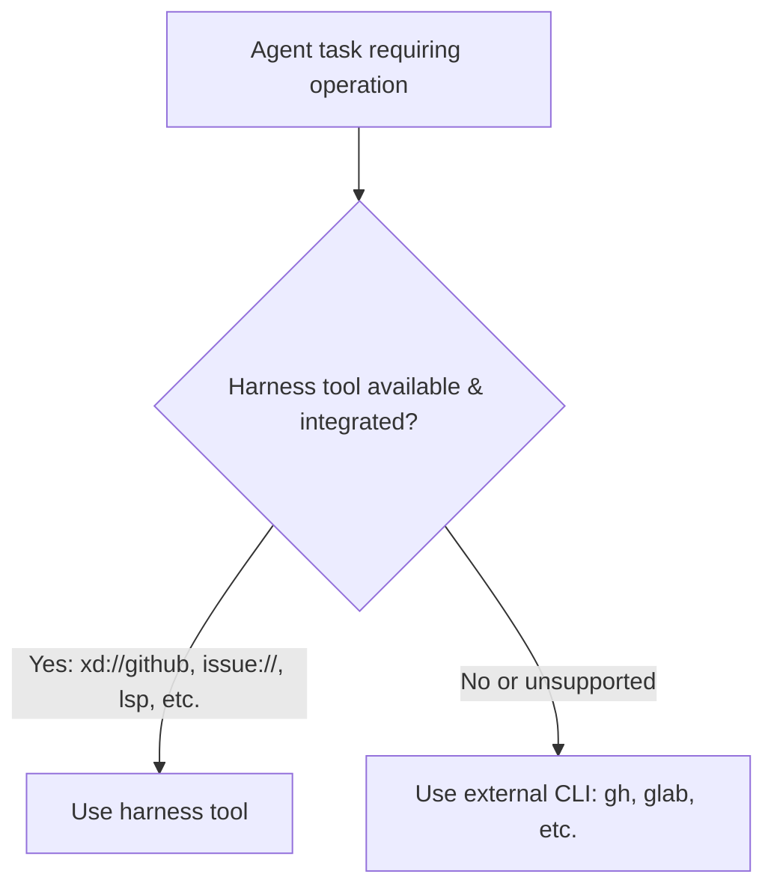

# Prefer Provided Harness Tools Over CLI in Instructions - Plan

## Goal Capsule

- **Objective:** Update the common agent instruction core in `.chezmoitemplates/agents-instructions.tmpl` to guide agents to prefer harness-provided tools (e.g. `xd://github`, built-in file and search tools, internal URL schemes `issue://` and `pr://`) over external CLI commands (`gh`, shell utilities) where well-integrated and available.
- **Product authority:** Issue #254: "docs(agents): prefer provided harness tools over CLI in instructions". Root `AGENTS.md` governs repository conventions, single-source-of-truth templates, and isolated verification.
- **Execution profile:** Clause-scoped edits to `.chezmoitemplates/agents-instructions.tmpl` and needle assertions in `.ci/test-agent-instructions.sh`. Isolated render and instruction test verification. Never apply source state directly to live `$HOME`.
- **Stop conditions:** Stop if changes break existing needles in `.ci/test-agent-instructions.sh`, reintroduce banned tokens, or conflict with the GitLab `glab` CLI preference under omp.

---

## Product Contract

### Summary

In `.chezmoitemplates/agents-instructions.tmpl`, add clear instructions guiding agents to prefer harness-provided tools over external CLI commands whenever available and well-integrated. Specifically:
1. Prefer harness-provided tools (e.g. `xd://github`, internal URL schemes `issue://<N>` / `pr://<N>`) for GitHub issue/PR searches, reads, creation, and CI watching over shelling out to `gh` CLI commands.
2. Prefer specialized harness tools (e.g. `read`, `edit`, `write`, `grep`, `glob`, `lsp`, `xd://ast_grep`, `xd://ast_edit`) over shell commands (`cat`, `sed`, `grep`, `rg`, `curl`) that shadow built-in capabilities.
3. Keep external CLI invocations (e.g. `gh`, `glab`) as valid fallbacks when harness tools are unavailable, unsupported, or explicitly preferred (such as `glab` CLI over glab MCP under omp).

### Problem Frame

Agents operating within Oh My Pi (omp) and similar harnesses have access to first-class integrated tools (`xd://github`, `read`, `edit`, `grep`, `glob`, `lsp`, internal schemes `issue://`, `pr://`). However, the existing instruction core frequently references raw CLI commands (e.g. `gh issue create`, `gh run watch`, `gh pr merge`) without explicitly instructing agents to prioritize harness-provided tools when available. This leads agents to unnecessarily spawn subprocesses with `gh` or shell commands for operations the harness handles natively with structured I/O and better context efficiency.

### Key Decisions

- **KD1 — Establish explicit harness tool preference.** Agents MUST prefer harness-provided tools (`xd://github`, `read`, `edit`, `write`, `grep`, `glob`, `lsp`, `issue://`, `pr://`) over raw CLI commands (`gh`, `grep`, `sed`, `curl`) where well-integrated and available. Governs R1, R2.
- **KD2 — Retain CLI commands as supported fallbacks.** Keep `gh` and `glab` commands documented as standard fallbacks when harness tools are absent or lack specific functionality. Governs R3.
- **KD3 — Preserve the omp GitLab CLI preference.** The existing rule preferring `glab` CLI over `glab` MCP under omp remains in place due to known MCP compatibility issues. Governs R4.

### Requirements

**Instruction core (`.chezmoitemplates/agents-instructions.tmpl`)**

- R1. `.chezmoitemplates/agents-instructions.tmpl` MUST specify that agents prefer harness-provided tools (e.g. `xd://github`, built-in file/search tools, `issue://`, `pr://` internal URLs) over external CLI commands (`gh`, shell utilities) when available and well-integrated.
- R2. The GitHub and issue interaction instructions MUST cite harness tools alongside CLI fallbacks.
- R3. External CLI commands (`gh`, `glab`) MUST remain documented as valid fallbacks when harness tools are unavailable or do not support the required operation.
- R4. The omp-specific note preferring `glab` CLI over glab MCP MUST remain intact.
- R5. Existing safety rules, branch/commit rules, issue closing keyword rules, and subagent delegation rules MUST remain unchanged.

**Test suite (`.ci/test-agent-instructions.sh`)**

- R6. `.ci/test-agent-instructions.sh` MUST assert positive needles for the new harness tool preference while continuing to pass all existing positive and negative needles.

### Acceptance Examples

- AE1. Tool selection in instructions.
  - **Given:** Rendered agent instructions.
  - **When:** An agent checks how to interact with GitHub or files.
  - **Then:** The instructions clearly state to prefer integrated harness tools (e.g. `xd://github`, `issue://`, `pr://`, `read`, `edit`, `lsp`) over external CLI commands (`gh`, `curl`, etc.) where available.
- AE2. Fallback compatibility.
  - **Given:** An environment or operation where a harness tool is unavailable.
  - **When:** An agent needs to perform a GitHub or GitLab action.
  - **Then:** The agent falls back to the official CLI (`gh`, `glab`).

---

## Planning Contract

### Key Technical Decisions

- **KTD1 — Surgical addition to `.chezmoitemplates/agents-instructions.tmpl`.** Add the harness tool preference guidance in the delegation and processes / tooling section and update the GitHub issue/PR interaction phrasing, preserving all unwrapped line invariants and existing needles.
- **KTD2 — Needle assertion in `.ci/test-agent-instructions.sh`.** Add needles ensuring the harness-provided tool preference is permanently enforced by CI.
- **KTD3 — Isolated verification.** Verify rendered output of `dot_omp/private_agent/private_readonly_AGENTS.md.tmpl` via `.ci/test-agent-instructions.sh`.

---

## Implementation Units

### U1. Update `.chezmoitemplates/agents-instructions.tmpl` and `.ci/test-agent-instructions.sh`

- **Goal:** Update the common instruction core to specify preferring harness-provided tools over CLI commands, and pin the rule with CI test needles.
- **Requirements:** R1, R2, R3, R4, R5, R6.
- **Files:** `.chezmoitemplates/agents-instructions.tmpl`, `.ci/test-agent-instructions.sh`.
- **Approach:**
  1. In `.chezmoitemplates/agents-instructions.tmpl`:
     - Under `## Delegation and processes` (or in tool guidance), state that agents MUST prefer harness-provided tools (e.g. `xd://github`, built-in file and search tools, `lsp`, internal URL schemes `issue://`, `pr://`) over external CLI commands (`gh`, `curl`, `grep`, `sed`, etc.) where well-integrated and available.
     - In `## Branches, commits, issues, blockers`, clarify that GitHub interactions (searches, issue reads/filing, PR creation, CI watching) should use harness tools (e.g. `xd://github`, `issue://`, `pr://`) when available, with `gh` CLI as the fallback.
  2. In `.ci/test-agent-instructions.sh`:
     - Add positive needle assertions for the harness tool preference.
- **Patterns to follow:** Concise ASD-STE100 prose; RFC 2119 terminology; single-line unwrapped structure matching existing file conventions.
- **Test scenarios:**
  - `.ci/test-agent-instructions.sh` passes with new positive needles.
  - Rendered `dot_omp/private_agent/private_readonly_AGENTS.md.tmpl` contains the updated guidance.
- **Verification:** Execute `.ci/test-agent-instructions.sh`.

---

## Verification Contract

- **Test suite:** Run `.ci/test-agent-instructions.sh` to assert all required needles pass and banned tokens are absent.
- **Render check:** Render `dot_omp/private_agent/private_readonly_AGENTS.md.tmpl` via chezmoi in scratch to verify output.
- **Diff scope:** `git diff --check` and `git status` show only `.chezmoitemplates/agents-instructions.tmpl`, `.ci/test-agent-instructions.sh`, and this plan document.

---

## Definition of Done

- `.chezmoitemplates/agents-instructions.tmpl` is updated to guide agents to prefer harness-provided tools over external CLI commands.
- `.ci/test-agent-instructions.sh` asserts the new rule and passes.
- `git diff --check` is clean.
- All changes are verified in isolated scratch rendering.
