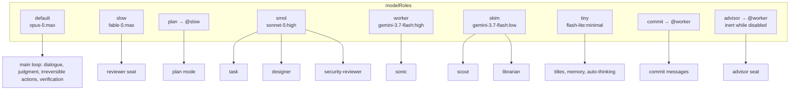
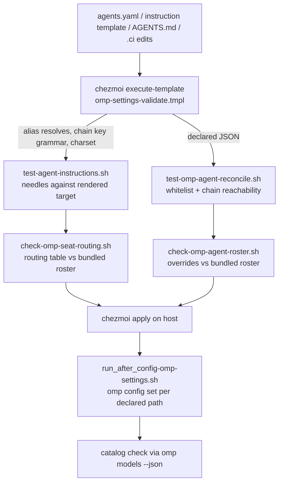

# omp Delegation-First Instruction Core and Model Tiers - Plan

## Goal Capsule

- **Objective:** An omp session spends its frontier seat on user dialogue and judgment, while investigation, extraction, and mechanical execution run on delegated seats — so a long task finishes sooner and the frontier quota is still available when judgment is needed.
- **Means:** Rewrite the shared instruction core's delegation section in the shape other harnesses and plugins already use, re-seat the model roles into four tiers, key the fallback chains to `oh-my-openagent`, and remove the per-dispatch thinking override so seat choice is the only capability lever.
- **Product authority:** The user. The repository supplement `AGENTS.md` owns omp settings and model-placement policy and is updated by this work, not bypassed.
- **Execution profile:** Data, template, prose, and CI edits only. No runtime code, no dependency changes, no provisioner edits.
- **Stop conditions:** Stop and ask when a validator or CI failure implies a product-scope change, and when an omp release moves the bundled roster mid-implementation. A failed U1 probe is not a stop: it takes U1's documented fallback and reports the collapse.
- **Tail ownership:** The implementer runs the Verification Contract locally, then owns commit, branch, MR/PR, and CI watch per the repository's delivery rules.
- **Open blockers:** None.

---

## Product Contract

### Summary

Rewrite `## Delegation and processes` in the shared instruction core so delegation is the default and direct execution is a named exception, carrying the operating rules that `oh-my-openagent`, Claude Code, Codex CLI, and Antigravity already publish. Re-seat `.chezmoidata/agents.yaml` into four tiers — frontier main loop, Fable 5 planning and review ceiling, Sonnet 5 executor, Flash extraction — with fallback chains derived from `oh-my-openagent`, and disable the per-dispatch thinking override so a dispatch chooses a seat and nothing else.

### Problem Frame

Every omp delegation target is the same model today. All seven bundled seats map to `@smol`, which resolves to `google-antigravity/gemini-3.7-flash:high` (`.chezmoidata/agents.yaml:156-163`, `:154`). A seat is therefore chosen for its tools and prompt, never for the capability the work needs, so an agent that wants a more capable helper has no seat to send it to and does the work itself on the frontier model.

The instruction core does not push back on that. Its delegation text says how to delegate — the native `task` tool, never a nested agent CLI — and where the boundary sits between a harness tool and a shell command (`.chezmoitemplates/agents-instructions.tmpl:56-62`). It never says what belongs to the main loop and what belongs to a subagent, so the split is decided per turn by whichever model is running.

Two consequences compound. The frontier seat spends its context on file reads and searches whose results it will not reference again, which is the exact cost every vendor's subagent documentation exists to avoid. And when that spend exhausts a subscription cap mid-session, the fallback chain silently substitutes a weaker model for the judgment work the frontier seat was being saved for. Quota pressure is a quality failure with a delay, not a billing line.

### Key Decisions

- KD1. **Delegation is the default; direct execution names its exception.** A closed reservation list is what makes the default checkable rather than aspirational. (session-settled: user-directed — chosen over a permissive "delegate when useful" phrasing: the harness already suggests delegation and the split still collapses toward direct work.) Governs R1, R2, R3, R4.
- KD2. **The delegation section is modeled on published delegation-optimized instruction sets, not written from scratch.** `oh-my-openagent` supplies the operating rules and Claude Code, Codex CLI, and Antigravity supply the context-preservation rationale and the write-parallelism caution. (session-settled: user-directed — chosen over an omp-original formulation: four independent harnesses converged on the same rules, and `oh-my-openagent` publishes the most complete delegation-optimized instruction set of them.) Governs R5, R6, R7, R8, R9, R10, R11, R12, R13, R14.
- KD3. **Seats are tiered by the work they receive, not uniformly by price.** Four capability tiers replace today's single delegation tier, plus a low-thinking skim rung for pure extraction. The extraction seats share one model at low thinking, the same binding `oh-my-openagent` uses for its `explore` and `librarian` units. Governs R20, R21, R22, R23, R26.
- KD4. **The review seat is the ceiling seat.** `reviewer` carries `@slow`, which makes "consult a stronger model" a dispatchable action rather than an unavailable one, mirroring the read-only ceiling advisor that `oh-my-openagent` consults after repeated failures. Governs R13, R14, R26.
- KD5. **Kimi K2.7 is excluded from every seat.** (session-settled: user-directed — chosen over a `kimi-code/kimi-for-coding-highspeed` executor seat: its 32k output cap truncates large edits and the highspeed variant consumes subscription quota heavily.) Governs R22, R26.
- KD6. **The main loop runs at `:max`.** (session-settled: user-directed — chosen over retaining `:high`: the earlier `:high` recommendation rested on token and latency cost, and cost ceased to be a constraint once all usage is subscription-based.) Governs R20.
- KD7. **Fallback chains follow `oh-my-openagent` under a stated mapping rule.** (session-settled: user-directed — chosen over composing chains independently: the `oh-my-openagent` plugin already encodes tested orderings.) The rule is mechanical because most of its hops are unreachable here: preserve omo's order, drop every hop outside the enabled provider set, and append a hop from our own tiers only when every remaining omo hop is unavailable. Governs R28, R29.
- KD8. **Sonnet 5 becomes a primary and gains its own fallback chain.** A model that occupies a role and two seats is no longer hop-only, so a chain keyed on it is now correct rather than a hijack. Governs R28.
- KD9. **The per-dispatch thinking override is disabled.** (session-settled: user-directed — chosen over keeping `task.enableEffort: true`: with the override gone, seat selection is the single capability lever and a seat's declared level is its contract.) Governs R17, R30.
- KD10. **Seat names live behind the omp harness conditional.** The instruction core is composed per harness and seat names are omp-specific vocabulary. Governs R19.
- KD11. **The reservation list describes risk, not files.** (session-settled: user-directed — chosen over enumerating chezmoi fingerprints, skip declarations, facts gates, and validators by name: repository-specific paths do not belong in a harness-neutral core, and the repository supplement already owns them.) Governs R2.
- KD12. **Routing guidance replaces a seat inventory.** omp already injects every bundled seat name and description into the `task` tool description, and a hand-maintained name list rots on each release. Governs R16, R18.
- KD13. **Obligations the harness already imposes are not restated.** Todo tracking and the "verify before claiming" rule arrive from omp's own system prompt, so the instruction core adds only what the harness does not already say.
- KD14. **Error-class-aware retry is out of reach for configuration.** Overloaded errors triggering fallback was investigated and dropped: the chain is consulted on the first attempt for every retryable error class, no setting or hook can gate it by class, and suppressing chains by wildcard also removes quota fallback. No requirement is carried.

### Requirements

Preservation: clarified R10, R16, R31, and R32 with qualifiers; added R34-R37 for consistency edits planning research found. No requirement was weakened and no scope was removed.

**Delegation disposition — `.chezmoitemplates/agents-instructions.tmpl`**

- R1. The instruction core states that delegation is the default disposition and that direct execution by the main loop is the exception.
- R2. It carries a closed main-tier reservation list: dialogue and approval with the user; scope, interpretation, and cross-subagent synthesis judgment; irreversible repository and platform actions; edits whose correctness depends on repository conventions that a fresh-context subagent cannot infer; and the final verification judgment.
- R3. It requires the agent to name the applicable reservation item when it performs work directly instead of delegating.
- R4. It requires a check before any direct execution: whether a seat matches the work, then whether a role prompt can be seeded into a seat, and only then whether direct execution is genuinely the better result.

**Delegation mechanics — `.chezmoitemplates/agents-instructions.tmpl`**

- R5. It forbids repeating an investigation that has already been delegated, including a partial re-check of the same files while that subagent is still running.
- R6. It states why duplication is forbidden: it spends the main loop's context, it produces findings that can contradict the subagent's, and it removes the parallel throughput that motivated the dispatch.
- R7. It requires independent work units to be decomposed and dispatched together in one batch rather than run one after another.
- R8. It sets a fan-out floor: an investigation with independent sub-questions dispatches at least two read-only seats in a single batch, and a single-target lookup stays one dispatch rather than being split to meet a count.
- R9. It requires a write-parallel batch to state its shared interface contract in the batch `context` before dispatch.
- R10. It requires every dispatch prompt to carry its target, its change, its acceptance signal, its must-do and must-not-do constraints, the expected shape of the returned result, and the context a fresh-context subagent cannot infer.
- R11. It forbids polling for a background result before that result is delivered.
- R12. It requires a follow-up to reuse the subagent that produced the earlier result rather than opening a fresh dispatch.
- R13. It defines the failure ladder: after three consecutive failed attempts at the same objective, stop editing, restore the last known good state, record what was attempted, consult the ceiling review seat with the full failure context, and ask the user only if that consultation does not resolve it.
- R14. It states that work the ceiling review seat was asked to decide is blocked until that seat returns, and that a final answer is not delivered before its result is collected.

**Delegation routing — `.chezmoitemplates/agents-instructions.tmpl`**

- R15. It states that a subagent inherits no conversation history, which is why R10 exists.
- R16. It carries a work-shape-to-seat routing table whose right-hand column names only dispatchable seats and marks each seat read-only or mutating, so edit work never routes to a read-only seat.
- R17. It states that a dispatch selects a seat rather than a model, and that no per-dispatch thinking override is available.
- R18. It states that compound-engineering role prompts under `skills/*/references/agents/` are prompts to seed into a bundled seat and are not dispatchable agent types.
- R19. Every clause that names an omp seat, role, or setting sits inside the `{{ if eq .harness "omp" }}` conditional.
- R34. It forbids a dispatch prompt from asking a bundled seat to spawn further subagents.

**Model roles and seats — `.chezmoidata/agents.yaml`**

- R20. `modelRoles.default` resolves to `anthropic/claude-opus-5:max`.
- R21. `modelRoles.slow` resolves to `anthropic/claude-fable-5:max`, and `modelRoles.plan` keeps its `"@slow"` indirection.
- R22. `modelRoles.smol` resolves to `anthropic/claude-sonnet-5:high`.
- R23. A `worker` role resolves to `google-antigravity/gemini-3.7-flash:high` and a `skim` role resolves to `google-antigravity/gemini-3.7-flash:low`.
- R24. `modelRoles.commit` and `modelRoles.advisor` resolve to `"@worker"`.
- R25. `modelRoles.tiny` keeps `google-antigravity/gemini-3.1-flash-lite:minimal`.
- R26. `task.agentModelOverrides` maps `scout` and `librarian` to `"@skim"`; `sonic` to `"@worker"`; `task`, `designer`, and `security-reviewer` to `"@smol"`; and `reviewer` to `"@slow"`, remaining exhaustive over the bundled set.
- R27. `enabledModels` gains the exact selector `anthropic/claude-fable-5` and keeps Anthropic enumerated by exact selector rather than a wildcard.

**Fallback chains — `.chezmoidata/agents.yaml`**

- R28. `retry.fallbackChains` declares `anthropic/claude-opus-5` → `[kimi-code/k3:high, google-antigravity/gemini-3.1-pro:high]`, `anthropic/claude-fable-5` → `[kimi-code/k3:max, google-antigravity/gemini-3.1-pro:high]`, and `anthropic/claude-sonnet-5` → `[kimi-code/k3:high, google-antigravity/gemini-3.7-flash:high]`, each derived from its `oh-my-openagent` counterpart under KD7's mapping rule.
- R29. The `google-antigravity/gemini-3.7-flash` chain key carries `[google-antigravity/gemini-3.1-flash-lite:minimal, anthropic/claude-sonnet-5:medium]` in place of its current empty list. The cheap same-provider hop absorbs extraction fan-out before any Anthropic quota is spent, and the executor hop is the floor that keeps a flash seat off the `default` chain's frontier hop.

**Dispatch and thinking settings — `.chezmoidata/agents.yaml`**

- R30. `task.enableEffort` is `false`.
- R35. `defaultThinkingLevel` resolves to `max`, tracking `modelRoles.default`.
- R36. `task.maxEffort` is declared as `max`, so no ceiling clamps the ceiling seat's `:max` contract on a host that already has the old value.

**Documentation and verification**

- R31. `AGENTS.md` describes the four tiers, records Sonnet 5 as a primary, states the evidence behind each seat assignment, records KD7's mapping rule so a later chain edit can reproduce it, and carries no surviving claim that contradicts the new seating.
- R32. `.ci/test-agent-instructions.sh` asserts a needle for each new load-bearing clause from R1-R19 and R34 against the rendered instruction target, and keeps every existing delegation needle.
- R33. CI fails when the routing table's seat set and the bundled agent set diverge in either direction.
- R37. `.ci/test-omp-agent-reconcile.sh` accepts the new declared model whitelist and its chain-reachability assertion passes for every new chain key.

### Acceptance Examples

- AE1. Anti-duplication holds under impatience.
  - **Covers R5, R6.**
  - **Given** a read-only seat was dispatched to locate a behavior and has not returned.
  - **When** the main loop wants the same fact.
  - **Then** it waits for or reads that seat's output instead of running its own search over the same files.
- AE2. Independent units go out together.
  - **Covers R7, R8.**
  - **Given** four independent units of work are identified.
  - **When** the main loop dispatches them.
  - **Then** all four go out in one batch, not one at a time and not two followed by two.
- AE3. A request for more thinking resolves to a seat.
  - **Covers R17, R26, R30.**
  - **Given** a delegated slice needs more capability than the executor tier.
  - **When** the main loop acts on that need.
  - **Then** it dispatches the ceiling review seat, because the dispatch carries neither a model argument nor a thinking override.
- AE4. The failure ladder consults before asking.
  - **Covers R13, R14.**
  - **Given** two attempts at the same objective have failed.
  - **When** a third attempt fails.
  - **Then** editing stops, the working tree returns to the last known good state, the ceiling review seat receives the full failure context, and the user is asked only if that consultation does not resolve it.
- AE5. The extraction tier degrades to the executor tier rather than to the frontier.
  - **Covers R29.**
  - **Given** a `skim` or `worker` seat is running on the extraction model.
  - **When** that model fails or its cap is reached.
  - **Then** the dispatch continues on `anthropic/claude-sonnet-5:medium` and never falls through to the `default` chain's frontier hop.
- AE6. A roster change fails CI in both places.
  - **Covers R26, R33.**
  - **Given** a new omp release adds or removes a bundled agent.
  - **When** CI runs.
  - **Then** both the override map and the routing table are reported as diverged from the bundled set.

### Scope Boundaries

- Kimi K2.7 seats (`kimi-code/kimi-for-coding` and its highspeed variant) — excluded per KD5.
- New or shadowing agent definitions under `~/.omp/agent/agents/`. A read-only seat carrying `lsp` and `ast_grep` would widen what research can be delegated, but it costs a hand-maintained system prompt and the current bundled seats cover the common case.
- `task.agentPrewalk`, `task.agentAdvisor`, `advisor.enabled`, `tier.subagent`, and `contextPromotion.enabled` stay at their current values. Prewalk is the strongest next candidate: it is structurally the same split as aider's architect and editor models, which is published as a quality gain rather than only a cost saving.
- Rules from `oh-my-openagent` that depend on capabilities omp does not expose: dispatch-time skill attachment, category-based routing, and a background-execution flag. Their intent is carried by R10 and R16 where it ports and dropped where it does not.
- Obligations omp's own system prompt already imposes — todo tracking, and verifying a delegated result before claiming it — are not restated per KD13.
- Harnesses other than omp. The managed harness set is omp alone, and R19 keeps seat vocabulary conditional so that stays true.
- Measurement. This work adds no instrumentation for delegation rate, turn latency, or quota consumption.

### Dependencies / Assumptions

- Every selector named in R20-R29 exists in the catalog of the pinned omp release, verified on 2026-08-19 via `omp models --json`: `anthropic/claude-fable-5` (1M context, 128k output, `max` available), `anthropic/claude-sonnet-5`, `google-antigravity/gemini-3.1-pro` (thinking levels `low` and `high` only), and `google-antigravity/gemini-3.7-flash`.
- All usage is subscription-based, so the binding constraint is quota and latency rather than per-token price.
- `oh-my-openagent` resolves a chain both proactively against connected providers before dispatch and reactively on a runtime error. omp has only the reactive half plus usage-aware fallback, so a chain hop here fires on failure or a cap, never on a model simply being absent.
- `modelRoles` accepts a custom role name, and `task.agentModelOverrides` resolves an `@alias` through it; the omp documentation gives this exact pattern for worker tiers.
- A thinking suffix carried on a role selector governs the seat that resolves through it, including a bundled agent whose frontmatter configures `auto`. This is assumed from the role-suffix precedence rule and is the one behavior planning should confirm empirically before relying on it, because R23 now depends on it twice.
- A fallback chain key matches `provider/model-id` without a thinking suffix, so `skim` and `worker` share the single R29 chain even though their seats think at different levels.
- The bundled agent set is exactly seven seats, and no plugin or user agent directory adds a dispatchable name on this host.
- `advisor.enabled` remains `false`, so R24's `advisor` assignment is inert until that changes.
- No measured baseline exists for turn latency or quota exhaustion. The policy is intent-driven, and its verification reaches the presence of each clause, not its effect.
- `.ci/check-omp-agent-roster.sh` needs a real `omp` binary on `PATH`, so R33 inherits that requirement wherever it lands.

### Outstanding Questions

**Deferred to implementation**

- Whether `google-antigravity/gemini-3.7-flash-tiered` belongs ahead of the executor hop in R29's chain. It is a same-tier sibling, which is the shape the upstream plugin uses for its extraction agents, but its catalog entry is not title-cased like its neighbours and may be a provider-routing variant rather than a distinct model. U2 keeps the single hop unless the implementer confirms it is a distinct model.
- Whether the `default` role chain's first hop tracks `:max` for consistency with R20 or stays at `:high`. U2 keeps `:high`: that chain is the floor for a hand-picked model no key names, and the ceiling seats carry their own chains.
- Whether `modelRoles.task` and `modelRoles.designer` should be declared explicitly. U2 leaves them undeclared because `task.agentModelOverrides` resolves ahead of them for every bundled seat.

### Sources / Research

- `.chezmoitemplates/agents-instructions.tmpl:56-62` — the delegation text this work rewrites; `:71-73` is the only existing omp harness conditional.
- `dot_omp/private_agent/private_readonly_AGENTS.md.tmpl:1` — the sole composition site for the instruction core.
- `.chezmoidata/agents.yaml:137-163`, `:178-186`, `:195-198` — current `enabledModels`, `modelRoles`, `task.agentModelOverrides`, `retry.fallbackChains`, and the `task.*` settings this work changes.
- `AGENTS.md:64-70` — the tool-approval, provider-gate, model-placement, and chain-policy paragraphs; `:68` and `:70` are the two this work rewrites.
- `.ci/test-agent-instructions.sh`, `.ci/check-omp-agent-roster.sh` — the needle gate and the bidirectional roster comparison that R32 and R33 extend.
- `docs/plans/2026-08-16-2128-refactor-omp-subagents-gemini-flash-plan.md` — the decision that consolidated all seven seats onto `@smol`, which this work supersedes.
- `https://github.com/can1357/oh-my-pi` — the omp source; its `packages/coding-agent/src/session/turn-recovery.ts:1812`, `packages/ai/src/error/flags.ts:407-414`, and `packages/coding-agent/src/session/retry-fallback-chains.ts:285-321` were read on 2026-08-19 to establish that error-class-aware fallback gating is not expressible in settings (see KD14).
- `omp://tools/task.md`, `omp://task-agent-discovery.md`, `omp://vibe-mode.md`, `omp://models.md`, `omp://settings.md`, `omp://skills.md` — dispatch schema without a model field, the effort hint that R30 disables, alias resolution order, the worker-tier alias pattern, and the fact that a skill can pin neither a model nor a seat.
- `https://github.com/code-yeongyu/oh-my-openagent` — a plugin for the `opencode` harness (a different author from omp's `can1357`) and this work's primary model. Its seat map (lead orchestrator on Opus 5 at max, planner on Fable 5, executor on Sonnet 5, extraction agents on a fast utility model, a read-only ceiling advisor consulted after repeated failures) is the closest prior art. `packages/model-core/src/agent-model-requirements.ts` and `category-model-requirements.ts` are the chains R28 derives from; `packages/omo-opencode/src/agents/` holds the prompt sections R1-R14 are modeled on, including the mandatory delegation check, the anti-duplication rule and its rationale, the parallel-dispatch floor, the mandatory dispatch-prompt structure, the non-polling rule, session reuse, the three-failure ladder, and the blocking rule for ceiling consultation. `docs/guide/agent-model-matching.md` supplies the framing that a model is a fit for a role rather than a rank.
- `https://code.claude.com/docs/en/sub-agents`, `https://antigravity.google/docs/subagents`, `https://learn.chatgpt.com/docs/agent-configuration/subagents.md` — vendor rationale for delegation as context preservation, and the caution that write-heavy parallelism needs coordination that read-heavy fan-out does not.
- `https://aider.chat/2024/09/26/architect.html` — the architect, editor, and weak model split, its reported benchmark gain, and the precedent for keeping commit-message and summarization work on the cheapest seat.
- `https://docs.continue.dev/customize/model-roles/00-intro`, `https://docs.roocode.com/features/api-configuration-profiles`, `https://docs.cline.bot/core-workflows/plan-and-act`, `https://opencode.ai/docs/agents/` — four independent per-role or per-mode model-binding surfaces that converge on the same tiering shape as `modelRoles`.

---

## Planning Contract

### Key Technical Decisions

- KTD1. **Probe role-suffix precedence before the data edit.** A role's `:level` suffix must beat a bundled seat's `auto` thinking configuration or the `skim`/`worker` split collapses; U1 settles it against the installed omp rather than the docs. Governs R23, R26.
- KTD2. **Neutralize `task.maxEffort` rather than leave it at `xhigh`.** (session-settled: user-approved — chosen over retaining `xhigh`: the retained ceiling clamps the review seat below the `:max` its role declares.) The mechanism is KTD10's: declare `max`, do not delete the key. Governs R36.
- KTD3. **Ship the routing-table drift check as a new `.ci` script with its own workflow step.** (session-settled: user-approved — chosen over extending `.ci/check-omp-agent-roster.sh`: that script compares declared settings against the bundled roster and never renders the instruction target, so the render dependency would be new to it either way.) Governs R33.
- KTD4. **Split the instruction text by harness scope.** Disposition, mechanics, and the failure ladder stay in the neutral core when phrased without omp vocabulary; every clause that names a seat, role, or setting moves inside the existing `{{ if eq .harness "omp" }}` block. Governs R19.
- KTD5. **Keep one unwrapped line per paragraph and preserve existing needles verbatim.** The needle gate matches fixed substrings against the rendered target, so a reflowed paragraph or a reworded existing clause reads as a lost rule. Governs R32.
- KTD6. **Apply the chain mapping rule mechanically.** (session-settled: user-directed — chosen over composing chains independently: preserve `oh-my-openagent` order, drop hops outside the enabled provider set, and append an own-tier hop only when every remaining upstream hop is unavailable.) Governs R28, R29.
- KTD7. **Move `defaultThinkingLevel` with `modelRoles.default`.** A hand-picked model inherits the session default, so leaving it at `high` would silently contradict the `:max` main loop. Governs R35.
- KTD8. **Land every `agents.yaml` change in one commit.** Alias resolution is render-time, so a commit that adds `@skim`/`@worker` references without their `modelRoles` entries fails `chezmoi execute-template` for every consumer of that data file. Governs R23, R26.
- KTD9. **Seat choice is the only capability lever.** (session-settled: user-directed — chosen over keeping `task.enableEffort: true`: with the hint gone, a seat's declared level is its contract and the routing table is the whole interface.) Governs R17, R30.
- KTD10. **Declare a setting to retire it; never just delete it.** The provisioner asserts declared paths and never unsets an undeclared one, so a deleted key keeps its old value on every provisioned host. Governs R36.
- KTD11. **Co-locate a CI expectation with the data edit that breaks it.** The reconcile test's whitelist assertion fails the moment the new selector lands, so it moves in U2 rather than waiting for the CI unit. Governs R37.

### High-Level Technical Design

The edits pass through four gates. Each one fails closed, and the first three run before anything reaches a host.

### Assumptions

- The installed omp release keeps the seven bundled seats and the `@alias` resolution order the plan reads from its documentation.
- `omp config set` continues to accept an alias value whose target role is asserted later in the same run, so the provisioner needs no ordering change.

### System-Wide Impact

- Every omp session inherits the new rules from the rendered `~/.omp/agent/AGENTS.md` on its next start; no gate proves the rules changed behavior, only that they are present.
- Plan mode moves models. `modelRoles.plan` keeps its `"@slow"` indirection, so it follows `slow` from Opus 5 to Fable 5 — a reasoning-style change nobody asked for explicitly, and the reason R21 states the indirection rather than repointing `plan`.
- `modelRoles.commit` and `modelRoles.advisor` change alias but not model: `@smol` and `@worker` both resolved to `gemini-3.7-flash:high` before this change, so commit-message behavior is unchanged and the advisor stays inert.
- `modelRoles.tiny` is untouched, so session titles, memory, and auto-thinking classification keep running on flash-lite.
- An apply during a live session is split-brain until that session restarts: the running process holds the old prompt while newly spawned subagents resolve the new config. Converge by restarting the session, not by re-applying.

### Risks & Dependencies

- The `skim`/`worker` split rests on role-suffix precedence. U1 settles it and carries a deterministic fallback, so a failed probe collapses the two roles and reports the change instead of stalling the run.
- A removed setting does not un-set on a host. The provisioner asserts declared paths only, which is why R36 declares `task.maxEffort: max` instead of deleting the key.
- An omp release can move the bundled roster. Detection already exists: `.ci/check-omp-agent-roster.sh` for the override map and the new routing-table check for the instruction text.
- A provider can retire a selector. Detection is layered: the render-time validator, the reconcile test's whitelist, and the provisioner's catalog probe at apply time.
- The executor and extraction chains point at each other: Sonnet 5 hops to Flash and Flash's last hop is Sonnet 5. The retry engine skips selectors that are still cooling down, so a real outage walks the chain rather than looping — but if a release changes that behavior, this pair is where a loop would appear first.
- The instruction text grows. The harness conditional keeps seat vocabulary out of neutral renders, and U5 bounds the growth rather than leaving it unmeasured.

### Sequencing

U1 gates U2. U2 gates U5's reconcile and roster expectations. U3 and U4 may proceed in parallel with U2 once U1 settles, but U5 lands last because it pins what U2, U3, and U4 produced.

---

## Implementation Units

### U1. Probe role-suffix precedence over seat frontmatter

- **Goal:** Settle whether a `modelRoles` entry's `:level` suffix governs a bundled seat whose frontmatter configures `auto`, before any data lands.
- **Requirements:** R23, R26.
- **Dependencies:** none.
- **Files:** none — this unit produces a finding, not a diff.
- **Approach:**
  1. Declare a scratch role and point one seat at it in a throwaway config, not the managed data file.
  2. Dispatch that seat and read the resolved model and thinking level from the session's own reporting.
  3. Record the result in this plan's Assumptions, replacing the assumption with a fact.
- **Execution note:** This is a read-mostly probe against a scratch config; do not touch `~/.omp/agent/config.yml` or the managed data file.
- **Test expectation: none — probe only.**
- **Verification:** The finding states, with the observed evidence, whether a role suffix wins. If it does not win, do not halt: collapse `skim` into `worker` at `google-antigravity/gemini-3.7-flash:high`, map `scout`, `librarian`, and `sonic` all to `"@worker"`, carry that collapse through U4's seat table and U5's routing table, and report the collapse to the user as a change to R23 and R26 rather than asking permission mid-implementation.

### U2. Re-seat roles, seats, chains, and effort settings

- **Goal:** Make `.chezmoidata/agents.yaml` express the four tiers, the skim rung, the derived chains, and the disabled effort override.
- **Requirements:** R20, R21, R22, R23, R24, R25, R26, R27, R28, R29, R30, R35, R36, R37.
- **Dependencies:** U1.
- **Files:** `.chezmoidata/agents.yaml`, `.ci/test-omp-agent-reconcile.sh`
- **Approach:**
  1. Add `anthropic/claude-fable-5` to `enabledModels` first; the provisioner's catalog check rejects a selector the whitelist does not cover.
  2. Set `modelRoles` in one pass: `default`, `slow`, `smol`, the new `worker` and `skim`, `commit`, `advisor`, and `defaultThinkingLevel`.
  3. Repoint all seven `task.agentModelOverrides` entries, keeping the key set exhaustive.
  4. Replace the chain block per R28 and R29, keeping every key an unsuffixed `provider/model-id`.
  5. Set `task.enableEffort: false` and declare `task.maxEffort: max`. Declaring beats deleting: the provisioner asserts declared paths and never unsets an undeclared one, so a removed key would leave `xhigh` clamping every host that already has it.
  6. Update the reconcile test's declared-whitelist expectation in the same unit, because the whitelist assertion fails the moment step 1 lands.
- **Patterns to follow:** the alias-indirection convention from `docs/plans/2026-08-16-2128-refactor-omp-subagents-gemini-flash-plan.md` — concrete selectors live in `modelRoles`, seats carry `@alias` values only.
- **Test scenarios:**
  - `chezmoi execute-template` on the settings provisioner renders without a validator failure.
  - A deliberately removed `modelRoles.skim` makes the render fail with the dangling-alias diagnostic, proving the alias check covers the new roles.
  - A chain key written with a thinking suffix makes the render fail with the chain-key diagnostic.
  - The rendered declared JSON contains all seven override keys, and `task.maxEffort` resolves to `max`.
  - Covers AE5. A `worker` or `skim` seat whose model fails resolves to `anthropic/claude-sonnet-5:medium` and never to the `default` chain's frontier hop.
  - Covers AE6. `.ci/check-omp-agent-roster.sh` passes against the rendered provisioner, and fails when an override key is removed.
  - `.ci/test-omp-agent-reconcile.sh` passes with the new whitelist, and its chain-reachability assertion covers all four chain keys.
- **Verification:** The render is clean, both existing settings gates pass, and every hop selector in the new chains is covered by `enabledModels`.

### U3. Rewrite the instruction core's delegation section

- **Goal:** Make the deployed instruction text state delegation as the default and carry the mechanics, routing, and failure ladder.
- **Requirements:** R1 through R19, R34.
- **Dependencies:** U1.
- **Files:** `.chezmoitemplates/agents-instructions.tmpl`
- **Approach:**
  1. Rewrite the neutral delegation paragraphs for disposition, the reservation list, the justification duty, and the mechanics that need no omp vocabulary.
  2. Extend the existing harness conditional with the routing table, the seat names and their read-only or mutating marker, the seat-not-model rule, the role-prompt-seed note, and the ceiling-seat clauses of the failure ladder.
  3. Keep every paragraph one unwrapped line and leave the existing pinned clauses byte-identical.
- **Patterns to follow:** the RFC 2119 phrasing and single-line paragraph shape already used in this file; the harness-conditional block at its end.
- **Test scenarios:**
  - The rendered target contains each new clause as a fixed substring.
  - The rendered target still contains all seven existing delegation needles.
  - A render with a non-omp harness value contains no seat name and no routing table.
  - Covers AE1, AE2. The rendered text states the anti-duplication rule and the batch fan-out floor as MUST-shaped clauses, not as advice.
  - Covers AE3. The rendered text states that a dispatch selects a seat and that no thinking override exists.
  - Covers AE4. The rendered text carries the three-failure ladder with its restore step and its ceiling-seat consultation before the user is asked.
  - The routing table names only bundled seats and marks each read-only or mutating.
- **Verification:** `.ci/test-agent-instructions.sh` passes with the new needles added in U5, and a non-omp render carries no omp vocabulary.

### U4. Rewrite the repository model-policy documentation

- **Goal:** Make `AGENTS.md` describe the new tiers and carry no claim the re-seating contradicts.
- **Requirements:** R31.
- **Dependencies:** U2.
- **Files:** `AGENTS.md`
- **Approach:**
  1. Rewrite the model-placement paragraph: four tiers, the Fable 5 ceiling, the Sonnet 5 executor, the Flash extraction rung and its two levels, and the seat table.
  2. Rewrite the chain-policy paragraph: the third Anthropic selector, the new keys, the replaced Flash chain, and KD7's mapping rule.
  3. Remove or rewrite every stale claim: three tiers, the ceiling and main loop sharing one model id, the light tier carrying all bundled subagents, Sonnet 5 never a primary, the two-selector whitelist, the `:xhigh` rationale, and the `defaultThinkingLevel` tracking sentence.
- **Test scenarios:**
  - No sentence in `AGENTS.md` claims three tiers, an all-subagent light tier, a two-selector Anthropic whitelist, or that Sonnet 5 is never a primary.
  - The mapping rule is stated precisely enough to reproduce the chains from the upstream source.
- **Verification:** A reader can derive the whole seat table and every chain from `AGENTS.md` alone and reach the values `agents.yaml` declares.

### U5. Pin the new policy and detect roster drift in CI

- **Goal:** Make CI fail when a new rule disappears, when the routing table and bundled roster diverge, or when the model whitelist drifts.
- **Requirements:** R32, R33.
- **Dependencies:** U2, U3, U4.
- **Files:** `.ci/test-agent-instructions.sh`, `.ci/check-omp-seat-routing.sh`, `.github/workflows/ci.yml`
- **Approach:**
  1. Add one positive needle per new load-bearing clause to the existing heredoc, leaving current needles untouched.
  2. Add `.ci/check-omp-seat-routing.sh`, mode 755: guard on `command -v omp`, unpack the bundled roster under a bare `HOME`, render the instruction target through the shared render helper, and compare the routing table's seat set against the roster in both directions.
  3. Fix the parsing contract in both directions so the gate cannot rot: the routing table is a markdown table whose seat column holds exactly one backtick-enclosed seat name per row, and the script extracts from that column only. U3 writes the table to that shape; the script's failure message names the shape when it finds none.
  4. Add the new script as a step in the `omp-agent-integration` job after the locked-omp install, so the binary the check needs is already present.
- **Patterns to follow:** `.ci/check-omp-agent-roster.sh` for the roster unpack, the bare-`HOME` isolation, and the two-direction `comm` comparison; `.ci/lib/render-gate-helpers.sh` for rendering.
- **Test scenarios:**
  - Covers AE1, AE2, AE3, AE4. Deleting any one new clause from the template fails the needle gate and names that clause.
  - Covers AE6. A routing table that omits a bundled seat fails the new script; one that names a non-bundled seat fails it too.
  - The new script exits with a clear diagnostic when `omp` is absent rather than a stack trace.
  - `shellcheck` passes on the new script, which the render workflow discovers automatically across `.ci/*.sh`.
  - The rendered instruction target grows by no more than the new delegation section, so the added rules do not crowd the system prompt.
- **Verification:** Every gate in the Verification Contract passes locally against a fresh render, and each new gate has been shown to fail when its guarded property is broken.

---

## Verification Contract

| Gate | Command | Applies to |
|---|---|---|
| Instruction render and needles | `.ci/test-agent-instructions.sh` | U3, U5 |
| Settings render and validator | `chezmoi --config "$scratch/empty.toml" --source "$PWD" --destination "$scratch/target" execute-template < .chezmoiscripts/70-agents/run_after_config-omp-settings.sh.tmpl` with a stub `op` on `PATH` | U2 |
| Declared settings reconcile | `.ci/test-omp-agent-reconcile.sh <rendered-auth> <rendered-plugins> <haptic-package> <rendered-settings>` — the script requires all four positional arguments | U2 |
| Seat roster exhaustiveness | `.ci/check-omp-agent-roster.sh <rendered-settings-script>` | U2 |
| Routing table drift | `.ci/check-omp-seat-routing.sh` | U3, U5 |
| Non-omp harness isolation | render the omp wrapper and a neutral-harness render of `.chezmoitemplates/agents-instructions.tmpl`, then diff for seat vocabulary | U3 |
| Shell lint | `shellcheck .ci/check-omp-seat-routing.sh` — the render workflow lints every `.ci/*.sh` | U5 |

Scratch verification follows the repository rule: a per-user scratch directory, a stub `op` that prints newline-free secrets, an empty config, a throwaway destination, and `--source "$PWD"`. Never apply to the live home directory.

---

## Definition of Done

- Every requirement R1 through R37 is satisfied or explicitly renegotiated with the user.
- U1's finding is recorded in Assumptions as an observed fact, not an assumption.
- Every gate in the Verification Contract passes locally, and each new gate has been shown to fail when its property is broken.
- `AGENTS.md` carries no claim that the new seating contradicts.
- No scratch role, throwaway config, or probe artifact from U1 survives in the repository or in the managed data.
- The commit subject is a lowercase Conventional Commit under `refactor:`, and CI reaches terminal green after the push.
