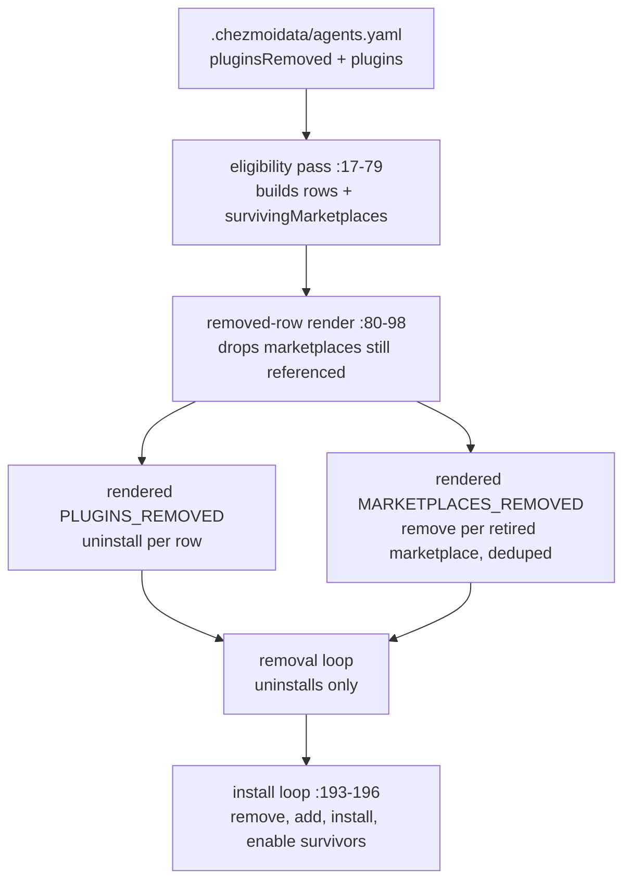

# Finish the unmanaged-repo-guard Removal - Plan

## Goal Capsule

- **Objective:** No omp host loads the `unmanaged-repo-guard` extension, its runtime state is gone, and reaching that state costs no operator step on any host.
- **Means:** Declare the plugin in `agents.omp.pluginsRemoved`, prune its runtime state through `.chezmoiremove`, and stop the plugin updater from removing a marketplace a surviving plugin still needs (KTD1, KTD2, KTD4).
- **Product authority:** The user's request governs scope, including the choice of automated convergence over the existing operator checklist. Root `AGENTS.md` governs chezmoi source attributes, single-source-of-truth data ownership, and the prohibition on teardown scripts.
- **Execution profile:** A bounded removal across one data file, one reconciler template, one prune manifest, one CI workflow, and two documentation surfaces. Verification is isolated rendering under a stub `op`, the two affected `.ci` suites, and a repository-wide reference sweep. Never apply the source state to live `$HOME`.
- **Stop conditions:** Stop if the render-gate fixture cannot express the per-platform marketplace matrix. Stop if extending the canary pattern would weaken an existing absence assertion. Stop if the reconciler edit would change the failure contract of an existing `fail`-closed validation.
- **Tail ownership:** CI owns the prune proof and the reconciler assertions. Host convergence is owned by the next `chezmoi apply` on each host; this run never performs it.
- **Open blockers:** None.

---

## Product Contract

**Product Contract preservation:** restructured, no scope change — the illustrative diagram under R3 moved to Planning Contract's High-Level Technical Design and was updated to the chosen mechanism; every R/KD/AE text is unchanged. The Outstanding Questions section dissolved: its three deferred questions are answered by KTD1/KTD2, KTD5, and KTD6.

### Summary

`unmanaged-repo-guard` is declared removed in `.chezmoidata/agents.yaml`, so every provisioned host uninstalls it on the next apply and its runtime state directory is pruned in the same pass. The plugin updater stops issuing `omp plugin marketplace remove` for a marketplace that a surviving plugin still references. The manual decommission checklist is deleted, and root `AGENTS.md` records `agents.omp.pluginsRemoved` as a sanctioned removal mechanism.

### Problem Frame

The source-side removal landed on 2026-08-10 and never reached the hosts. `docs/plans/2026-08-10-001-refactor-remove-unmanaged-repo-guard-plan.md` deleted the plugin tree, dropped its catalog entry, and pruned the deployed target. It could not reach the copy omp installed under `~/.omp/plugins`, which is outside chezmoi's control.

That copy is still installed and still enabled. `~/.omp/plugins/installed_plugins.json` carries `unmanaged-repo-guard@h82-dotfiles` with `enabled: true`, and `~/.omp/plugins/omp-plugins.lock.json` agrees. The plugin is still firing: `~/.local/state/unmanaged-repo-guard/blocks.jsonl` holds 28 blocks, the last at `2026-08-19T04:37:25.551Z`.

Every one of those 28 blocks is a malfunction. The tally is 13 `indeterminate` and 15 `invalid-target`, with no other outcome value — not one block was a repository the user genuinely did not manage. The origin plan's KTD7 made the guard block and explain without ever asking, so a block is terminal for the run. Twenty-eight turns died on a false positive.

The prior change anticipated the gap and shipped `docs/decommission/unmanaged-repo-guard.md` as manual operator guidance. It has not run on any host in the nine days since, which is why the blocks continued. Its own instruction is now unfollowable: `docs/decommission/unmanaged-repo-guard.md:43-44` directs the operator to a note in `docs/plans/feedback-sweep-plan.md` that has since rotated to `docs/plans/feedback-sweep-plan-2026-08-10.md`. The checklist also predates `agents.omp.pluginsRemoved`, which `docs/plans/2026-08-11-003-feat-omp-i-have-adhd-skill-only-plan.md` added the following day, so the mechanism that would have made it unnecessary did not exist when it was written.

### Key Decisions

- KD1. **Data-declared removal replaces the operator checklist.** (session-settled: user-directed — chosen over working through `docs/decommission/unmanaged-repo-guard.md` on each host: the checklist has not run anywhere since 2026-08-10 and the fleet is more than one Fedora workstation.) Governs R1, R9.
- KD2. **The shared-marketplace hazard is closed at render time.** (session-settled: user-directed — chosen over a runtime guard in the rendered script and over deleting `omp plugin marketplace remove` from the removal loop: the declared data is fully known at render, and deleting the command would forfeit the ability to retire an exclusive marketplace.) Governs R3.
- KD3. **Convergence outranks evidence retention.** (session-settled: user-directed — chosen over keeping the per-host block logs readable: the statistics were not needed from any host other than this one.) Governs R4, R10.
- KD4. **Root `AGENTS.md` is the documentation target; the instruction core is not.** `.chezmoitemplates/agents-instructions.tmpl` holds zero references to the guard, `pluginsRemoved`, or teardown, so it needs no edit. Governs R6, R7, R8.
- KD5. **Only mechanism is removed, never intent.** The ask-first rule the 2026-08-10 change installed in the instruction core is the surviving control and stays untouched.

### Requirements

**Removal declaration**

- R1. `.chezmoidata/agents.yaml` declares `unmanaged-repo-guard` under `agents.omp.pluginsRemoved` with marketplace `h82-dotfiles`, so the phase-70 reconciler uninstalls it on every eligible host.
- R2. The existing `i-have-adhd` removal row and both surviving `agents.omp.plugins` rows are unchanged.
- R3. The reconciler never issues `omp plugin marketplace remove` for a marketplace that a surviving eligible plugin row still references, and it decides that from the declared data at render time.

**Runtime state**

- R4. `.chezmoiremove` prunes `.local/state/unmanaged-repo-guard`, so the block log and its directory leave every host without operator action.
- R5. The new prune carries the same automated proof the existing guard prune already carries in CI.

**Documentation**

- R6. Root `AGENTS.md` names `agents.omp.pluginsRemoved` in the sentence enumerating sanctioned removal mechanisms, so a future plugin retirement does not default to a manual checklist.
- R7. Root `AGENTS.md`'s single-source-of-truth row for `.chezmoidata/agents.yaml` covers plugin install and removal declarations.
- R8. Root `AGENTS.md` records that `.chezmoiremove` may prune a path chezmoi never deployed.

**Record reconciliation**

- R9. `docs/decommission/unmanaged-repo-guard.md` is deleted and no surviving repository text directs an operator to it.
- R10. The aggregate block evidence — 28 blocks, 13 `indeterminate`, 15 `invalid-target`, last on 2026-08-19 — is recorded in the reversal note at `docs/plans/feedback-sweep-plan-2026-08-10.md` before the prune destroys its source.

### Acceptance Examples

- AE1. **Covers R3.**
  - **Given:** the guard is declared removed from marketplace `h82-dotfiles` and `mxm4-haptic` survives in that same marketplace.
  - **When:** the reconciler renders for a host where the `h82-dotfiles` rows are eligible.
  - **Then:** the rendered removal loop issues the guard's `omp plugin uninstall` and no `omp plugin marketplace remove` for `h82-dotfiles`.
- AE2. **Covers R3.**
  - **Given:** the same declaration on a host where the marketplace's own gates exclude every plugin that references it.
  - **When:** the reconciler renders for that host.
  - **Then:** the marketplace removal is still issued, because nothing surviving needs it.
- AE3. **Covers R1, R4.**
  - **Given:** a host with the plugin installed and a populated block log.
  - **When:** `chezmoi apply` runs once.
  - **Then:** omp lists neither `unmanaged-repo-guard@h82-dotfiles` nor the plugin's runtime state directory, and no operator ran a command.
- AE4. **Covers R10.**
  - **Given:** the prune will delete the block log on every host.
  - **When:** this change is committed.
  - **Then:** the aggregate counts already exist in the repository record.

### Scope Boundaries

- Mechanical enforcement of the unmanaged-repository boundary is not restored. Per KD5 the instruction core's ask-first rule remains the only control, and `.chezmoitemplates/agents-instructions.tmpl` is not edited.
- The existing `.chezmoiremove` entry for `.local/share/omp-plugins/plugins/unmanaged-repo-guard` is not removed, and its CI canary keeps asserting that prune. R5 adds proof for the new prune alongside it rather than replacing it.
- The `i-have-adhd` removal row stays declared, even though it is now a permanent no-op on provisioned hosts.
- Historical plan and review records are not rewritten; no historical record changes beyond the R10 evidence note in `docs/plans/feedback-sweep-plan-2026-08-10.md`. The checklist's dead pointer resolves by the deletion itself.
- No teardown or revert script is introduced, and no script uninstalls an omp plugin outside the phase-70 reconciler.

### Dependencies / Assumptions

- A `pluginsRemoved` row is validated for shape only and does not require its marketplace to exist in `agents.marketplaces` (`.chezmoiscripts/70-agents/run_onchange_after_update-omp-plugins.sh.tmpl:86-98`), so naming `h82-dotfiles` there is valid.
- `omp plugin uninstall` resolves its target from `~/.omp/plugins/installed_plugins.json` independently of the catalog, so an apply that already dropped the guard from the catalog does not strand the uninstall.
- `.chezmoidata/agents.yaml` is already a fingerprint input of the reconciler, so editing it re-triggers the onchange script once per host — that is what carries the removal to hosts whose state is otherwise converged.
- `omp plugin uninstall --dry-run` is not honored; it performs the uninstall. Verification must not rehearse with that flag.
- The guard was never installed where the `h82-dotfiles` marketplace is skipped, so the declaration is a no-op on those hosts rather than a repair.

### Sources / Research

- `.chezmoiscripts/70-agents/run_onchange_after_update-omp-plugins.sh.tmpl:86-98` — render-time validation of each `pluginsRemoved` row: length, key names, name regex, duplicate rejection.
- `.chezmoiscripts/70-agents/run_onchange_after_update-omp-plugins.sh.tmpl:144-150` — the removal loop, with `omp plugin uninstall` at `:148` and the unconditional `omp plugin marketplace remove` at `:149`.
- `.chezmoiscripts/70-agents/run_onchange_after_update-omp-plugins.sh.tmpl:192-196` — the install loop, which removes and re-adds each surviving plugin's marketplace at `:193-194`.
- `.chezmoidata/agents.yaml` — the two surviving `agents.omp.plugins` rows, the single `i-have-adhd` removal row, and the `container: skip` / `jetson: skip` gates on marketplace `h82-dotfiles`.
- `AGENTS.md:24` — sanctioned removal mechanisms, currently without `pluginsRemoved`. `AGENTS.md:113` — the single-source-of-truth row for `.chezmoidata/agents.yaml`.
- `.chezmoiremove:150` — the existing guard prune. No entry under `.local/state/` exists today.
- `.github/workflows/render-dotfiles.yml:190,223,698,727` — canary seeding and absence assertion for the existing guard prune.
- `docs/decommission/unmanaged-repo-guard.md` — the checklist R9 deletes; `:43-44` carries the dead pointer.
- `docs/plans/feedback-sweep-plan-2026-08-10.md:42-45` — the `Reversed on 2026-08-10` note under decision 1, R10's destination.
- `docs/plans/2026-08-10-001-refactor-remove-unmanaged-repo-guard-plan.md` — the source-side removal. Its assumption A4 concluded that no prune could reach the guard's runtime state; R4 supersedes that conclusion.
- `docs/plans/2026-08-11-003-feat-omp-i-have-adhd-skill-only-plan.md` — KTD2 and KTD6 introduced `agents.omp.pluginsRemoved` and chose automated reconciliation over an operator checklist.
- Live state read on 2026-08-19: `~/.omp/plugins/installed_plugins.json` and `~/.omp/plugins/omp-plugins.lock.json` both report the plugin enabled; `~/.local/state/unmanaged-repo-guard/blocks.jsonl` holds 28 lines tallying 13 `indeterminate` and 15 `invalid-target`, with a maximum timestamp of `2026-08-19T04:37:25.551Z`.

---

## Planning Contract

### Key Technical Decisions

- KTD1. **The surviving-marketplace set is computed inside the existing eligibility pass.** (session-settled: user-directed — chosen over a runtime guard and over deleting the remove command: instantiates KD2; governs R3.) The `$plugins` loop already knows per-host eligibility where it appends rows (`.chezmoiscripts/70-agents/run_onchange_after_update-omp-plugins.sh.tmpl:76-78`), and that pass completes before `$removedRows` renders (`:80-98`), so a `$survivingMarketplaces` dict built there is complete when the removal rows need it.
- KTD2. **Marketplace removal is a separate render-emitted array, not a per-row field.** `MARKETPLACES_REMOVED` carries each removed row's marketplace when absent from `$survivingMarketplaces`, deduplicated at render, and the shell splits today's combined removal loop (`:144-150`) into per-plugin uninstalls followed by per-marketplace removals. Chosen over a third per-row flag: removal is marketplace-scoped and two removed rows may share one marketplace. Governs R1, R3.
- KTD3. **Uninstall stays unconditional and idempotent per row.** `omp plugin uninstall --scope user "$id" || true` is a no-op where the plugin was never installed (Jetson, containers, fresh hosts). The existing swallow-failure style is kept to match the i-have-adhd precedent; the accepted cost is that a silently failed uninstall retries only on the next fingerprint change.
- KTD4. **The state prune is ungated, and the guard's `.chezmoiremove` comment is rewritten in the same change.** The comment block at `.chezmoiremove:131-149` currently directs operators to the checklist that R9 deletes, so it is rewritten to state that uninstall is reconciler-driven and to cite `.agents/skills/ce-*` (`:5-19`) as the existing precedent for pruning runtime-created paths chezmoi never deployed. Governs R4, R8, R9.
- KTD5. **CI proof reuses the two existing harnesses; no new test file ships.** Static and stub-`omp` dynamic assertions extend `.ci/test-omp-agent-reconcile.sh`, the four-platform render matrix in `.ci/test-mxm4-haptic-gates.sh` gains the AE1/AE2 marketplace assertions, and the prune canaries extend `.github/workflows/render-dotfiles.yml` at the known insertion points in both apply jobs. Governs R5 and proves AE1, AE2.
- KTD6. **R10's ordering is enforced by the commit, not by CI.** The aggregate counts land in the `Reversed on 2026-08-10` note in the same commit as the prune declaration, so the repository can never carry the prune without the record. Governs R10.

### High-Level Technical Design

The hazard the filter removes: today `:149` removes `h82-dotfiles` unconditionally, and only the install loop's re-add at `:193-194` restores it — a `die` between the loops would strand the marketplace, and the onchange fingerprint would not rerun the script.

### Assumptions

- A1. Historical-record citations of the deleted checklist (`docs/plans/*`, `docs/residual-review-findings/*`) stay untouched. R9's "no surviving repository text directs an operator to it" reads as live operational text only — the `.chezmoiremove` comment block, which KTD4 rewrites. A citation describing the past does not direct anyone.
- A2. On hosts where every `h82-dotfiles` plugin is gate-skipped, the rendered script still emits the `h82-dotfiles` marketplace removal (AE2). That is desirable residue cleanup, not merely tolerated.
- A3. An omp session already running keeps the guard extension loaded until restart; the uninstall takes effect in the next session. No restart orchestration is added.

---

## Implementation Units

### U1. Render-time marketplace filter and the removal declaration

**Goal:** The reconciler renders removal rows that uninstall `unmanaged-repo-guard` on every host while issuing `omp plugin marketplace remove` only for marketplaces no surviving eligible plugin references — and the data row that triggers all of it lands in the same atomic commit, so no commit in history pairs the declaration with the unfiltered loop.

**Requirements:** R1, R2, R3, AE1, AE2. Settled owners: KD1, KD2 via KTD1 and KTD2.

**Dependencies:** none.

**Files:** `.chezmoiscripts/70-agents/run_onchange_after_update-omp-plugins.sh.tmpl`, `.chezmoidata/agents.yaml`, `.ci/test-omp-agent-reconcile.sh`, `.ci/test-mxm4-haptic-gates.sh`.

**Approach:**
1. In the `$plugins` loop, initialize a `$survivingMarketplaces` dict before iteration and set it at the same conditional that appends to `$rows` (`:76-78`), so the set is exactly the marketplaces of surviving eligible rows.
2. In the `$removedRows` loop (`:80-98`), keep the existing shape validation unchanged and accumulate a deduplicated `$removedMarketplaces` list of marketplaces absent from `$survivingMarketplaces`.
3. Render a second array `MARKETPLACES_REMOVED` beside `PLUGINS_REMOVED`; in the shell body split the combined removal loop (`:144-150`) into per-row `omp plugin uninstall` (`:148`, unchanged flags and `|| true` per KTD3) followed by per-marketplace `omp plugin marketplace remove`. Keep the existing skip declarations and preflight untouched.
4. Append `{ name: unmanaged-repo-guard, marketplace: h82-dotfiles }` to `agents.omp.pluginsRemoved` in `.chezmoidata/agents.yaml` (`:102-103`). Per R2, no other row changes.
5. Extend `.ci/test-omp-agent-reconcile.sh` alongside its existing i-have-adhd assertions (`:109-115` static, `:223-228` dynamic), and extend the platform matrix assertions in `.ci/test-mxm4-haptic-gates.sh`.

**Patterns to follow:** The i-have-adhd removal row for the data shape; the existing `fail`-closed validation style for any new render-time check; `render_reconciler` in `.ci/lib/render-gate-helpers.sh:84-104` for fact-patched rendering.

**Test scenarios:**
- Static: the rendered script contains the `unmanaged-repo-guard\th82-dotfiles` removal row, and its `MARKETPLACES_REMOVED` contains `i-have-adhd` but not `h82-dotfiles` on the default host render.
- Dynamic under the stub `omp`: `$OMP_CALLS` records `plugin uninstall --scope user unmanaged-repo-guard@h82-dotfiles` and still records `plugin marketplace remove i-have-adhd`. The `h82-dotfiles` absence assertion is scoped to the removal phase — the call log up to the first install-loop call contains no `plugin marketplace remove h82-dotfiles`, because the install loop (`:193`) legitimately re-issues that command for the surviving `mxm4-haptic` row. Covers AE1.
- Platform matrix: Linux-container and Jetson renders do emit the `h82-dotfiles` marketplace removal while Linux and macOS host renders do not. Covers AE2.
- Regression: the existing i-have-adhd assertions pass unchanged, and a malformed removed row still aborts rendering with the existing `fail` message.
- Negative: the rendered script contains no `marketplace remove` line for a marketplace named by a surviving plugin row under any fact profile the fixture exercises.

**Verification:** `bash .ci/test-omp-agent-reconcile.sh` and `bash .ci/test-mxm4-haptic-gates.sh` pass, and the isolated render of the reconciler template (root `AGENTS.md` recipe) shows the split loops with the guard row present.

### U2. Runtime-state prune, CI canaries, and the `.chezmoiremove` comment rewrite

**Goal:** Every host loses `~/.local/state/unmanaged-repo-guard` on the next apply, CI proves it, and the prune manifest's live comment no longer directs operators to the checklist U3 deletes.

**Requirements:** R4, R5. Settled owners: KD3 via KTD4, KTD5.

**Dependencies:** none. Lands before or with U3 so the comment never points at a deleted file.

**Files:** `.chezmoiremove`, `.github/workflows/render-dotfiles.yml`.

**Approach:**
1. Add an ungated `.local/state/unmanaged-repo-guard` entry to `.chezmoiremove` beside the existing guard prune (`:150`), with a comment citing the `.agents/skills/ce-*` precedent (`:5-19`) for pruning runtime-created paths.
2. Rewrite the comment block at `:131-149`: drop the pointer to `docs/decommission/unmanaged-repo-guard.md`, state that the plugin uninstall is reconciler-driven via `agents.omp.pluginsRemoved`, and keep the explanation of why the deployed-tree prune exists.
3. In both apply jobs of `.github/workflows/render-dotfiles.yml`, extend the three known insertion points — the `mkdir -p` lists (`:165`, `:673`), the seed blocks (`:185`, `:695`), and the ungated-prune assertions (`:215`, `:720`) — for the new state path, mirroring the existing guard canary exactly. The entry is ungated, so both jobs assert `test ! -e` identically.

**Patterns to follow:** The existing guard canary triple in the same workflow; the comment style of the `.agents/skills/ce-*` block.

**Test scenarios:**
- Covers R5. The workflow seeds `blocks.jsonl` (or `prune-canary`) under the state path in both jobs and asserts the directory is absent after apply, while sibling state paths survive.
- Rendered `.chezmoiremove` contains the new entry under every fact profile the root `AGENTS.md` render recipe can express (default, container, macOS, Jetson), because the entry is ungated.

**Verification:** Isolated render of `.chezmoiremove` shows the entry ungated; the workflow diff shows symmetric canary additions in both jobs; CI runs the assertions (owned by the pipeline tail, not this session's local proof).

### U3. Record reconciliation

**Goal:** The manual checklist is gone, its aggregate evidence is recorded, and no live text points operators at it.

**Requirements:** R9, R10, AE4. Settled owners: KD1, KD3 via KTD6.

**Dependencies:** U2 (the `.chezmoiremove` comment rewrite removes the last live pointer).

**Files:** `docs/decommission/unmanaged-repo-guard.md` (delete), `docs/plans/feedback-sweep-plan-2026-08-10.md`.

**Approach:**
1. Delete `docs/decommission/unmanaged-repo-guard.md` with `git rm`.
2. Append one sentence to the `Reversed on 2026-08-10` note under decision 1 (`:42-45`) carrying the aggregates verbatim: 28 blocks, 13 `indeterminate`, 15 `invalid-target`, last block `2026-08-19T04:37:25.551Z`, and that the counts come from this host's `blocks.jsonl` before the R4 prune.
3. Run the reference sweep and confirm the only remaining matches for the checklist path are historical-record citations per A1.

**Test scenarios:**
- Covers AE4. The sweep note diff contains all four aggregate figures.
- A content search for `docs/decommission/unmanaged-repo-guard.md` returns only matches under `docs/plans/` and `docs/residual-review-findings/`, and none of them is phrased as an instruction to run the checklist.

**Verification:** The file is absent from the git index, the note carries the counts, and the sweep output matches A1's boundary.

### U4. Root `AGENTS.md` documentation

**Goal:** The repository's own rules record the removal mechanism this change uses, so the next plugin retirement does not re-invent a manual checklist.

**Requirements:** R6, R7, R8. Settled owner: KD4.

**Dependencies:** none.

**Files:** `AGENTS.md`.

**Approach:**
1. Extend the sanctioned-removal sentence (`:24`) to name `agents.omp.pluginsRemoved` as the removal mechanism for omp plugins, alongside managed-source deletion and `system.yaml` `removed:`.
2. Extend the single-source-of-truth row for `.chezmoidata/agents.yaml` (`:113`) to cover plugin install and removal declarations.
3. Record near the same lifecycle prose that `.chezmoiremove` may prune runtime-created paths chezmoi never deployed, citing the existing `.agents/skills/ce-*` entries as precedent and the new `.local/state/unmanaged-repo-guard` entry as the state-dir case. This corrects the 2026-08-10 plan's A4 conclusion on the record.

**Test expectation:** none — documentation-only unit; the root `AGENTS.md` review conventions (plain-language supplement, no contradiction with the common core) are the check, exercised by review.

**Verification:** The diff touches only the three named spots, each sentence reads as a rule a future maintainer can apply, and no instruction-core file changed.

---

## Verification Contract

- Isolated render of every changed template and `.chezmoiremove` through `chezmoi execute-template` with the stub-`op` scratch recipe from root `AGENTS.md` (`--source "$PWD"`), comparing rendered text on both sides where a script changed.
- `bash .ci/test-omp-agent-reconcile.sh` — reconciler render and stub-`omp` behavior, including the new guard assertions.
- `bash .ci/test-mxm4-haptic-gates.sh` — four-platform render matrix, including the AE1/AE2 marketplace assertions.
- A repository-wide content search proving the deleted checklist has no live pointer (U3's sweep).
- `git diff --check`, `git status`, and a diff limited to this scope.
- After push, `.github/workflows/ci.yml` and `.github/workflows/render-dotfiles.yml` must reach terminal success; the canary assertions for the new prune run there.
- Never rehearse `omp plugin uninstall --dry-run` (it uninstalls) and never apply the source state to live `$HOME`; AE3's host-level proof belongs to the next operator apply, per tail ownership.

---

## Definition of Done

- R1-R10 are each true in the merged diff: the data row exists, the filter is render-time, the prune and its canary exist, the checklist is deleted with its evidence recorded, and the three `AGENTS.md` rules landed.
- Both `.ci` suites pass locally and both workflows reach terminal green on the PR.
- Every `Governs R…` link above still points at the requirement that owns its rule; no requirement lost its owner during the Product Contract restructure.
- Cleanup criterion: the reconciler template carries no leftover runtime-guard code path or unused variable from the filter's rejected alternatives, and no scratch fixture leaked into the diff.
- Per-unit: U1's tests prove AE1/AE2; U2's canary assertions are present in both jobs; U3's sweep shows no live pointer; U4's diff is exactly three spots in `AGENTS.md`.
