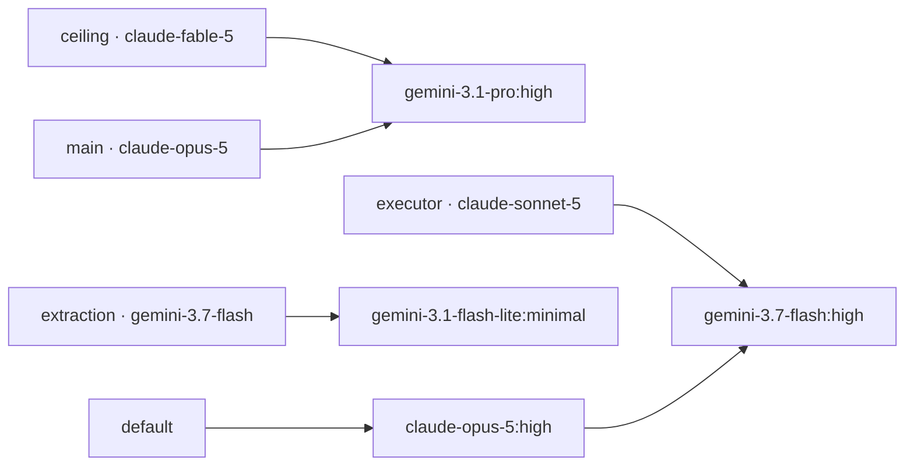

# Remove kimi-code Hops from the omp Fallback Chains - Plan

## Goal Capsule

- **Objective:** No automatic omp retry can route to the kimi-code subscription, while a hand-picked `/model` switch to it still works for as long as the subscription lasts.
- **Means:** Delete every `kimi-code/*` hop from `agents.omp.settings."retry.fallbackChains"` and leave the `kimi-code/*` entry in `enabledModels` untouched, then reconcile the root `AGENTS.md` model-policy paragraph that documents the retired hops (KTD1, KTD5).
- **Product authority:** The user's request governs scope: remove the hops, keep manual switching. Root `AGENTS.md` governs single-source-of-truth data ownership, the omp settings contract, and isolated verification.
- **Execution profile:** A bounded data edit in one file plus one documentation paragraph. Verification is isolated rendering under a stub `op`, the chain-shape and chain-reachability assertions that `.ci/test-omp-agent-reconcile.sh` runs over the rendered declared JSON, and a live-catalog check of the surviving hops. Never apply the source state to live `$HOME`.
- **Stop conditions:** Stop if removing a hop would leave any chain with zero hops (an empty chain list fails fast instead of recovering; only an absent chain key reopens fallthrough to the `default` chain's frontier hop). Stop if a surviving hop selector is absent from `omp models --json`, because the phase-70 provisioner exits 1 on an unserved selector.
- **Tail ownership:** LFG owns implementation, review, commit, PR creation, and CI observation. Host convergence is owned by the next `chezmoi apply`; this run never performs it.
- **Open blockers:** None.

---

## Product Contract

### Summary

`agents.omp.settings."retry.fallbackChains"` in `.chezmoidata/agents.yaml` currently routes five recovery hops to `kimi-code/k3`. The kimi-code subscription is ending, so an unattended retry must never land there. Every kimi-code hop is deleted; each chain keeps its remaining hops in order. `enabledModels` keeps `kimi-code/*`, so `/model` still offers Kimi for a deliberate manual switch until the subscription lapses. Root `AGENTS.md`'s model-policy paragraph is reconciled so it describes the chains that ship and records why kimi-code is whitelisted but unchained.

### Problem Frame

A fallback chain fires unattended, mid-session, with nobody watching: that is the whole point of `retry.usageAwareFallback`. A hop into a subscription that is about to lapse is dead weight every recovery walk must cross — at minimum a wasted attempt at the exact moment the session was trying to recover, and a failed recovery if omp does not advance past a failed hop (see Open Questions). Either way it fails silently, because the chain is walked by omp, not by the user.

Five hops carry that risk today (`.chezmoidata/agents.yaml:182-198`): the ceiling chain hops to `kimi-code/k3:max` first, the main-loop, executor, and `default` chains each hop to `kimi-code/k3:high`, and the extraction chain terminates on `kimi-code/k3:high`. Manual use is the opposite case — the user picks the model, sees the failure, and switches again — so the whitelist that makes Kimi reachable from `/model` carries none of that risk and is not what needs to change.

Root `AGENTS.md:70` is the repository's model-policy record and currently argues *for* those hops in detail: it makes the ceiling's `kimi-code/k3:max` hop load-bearing on K3's 1M context, and makes the extraction chain terminate on Kimi so the executor and extraction chains never reference each other. Leaving that text in place would tell the next editor to restore exactly the hops this change removes.

### Key Decisions

- KD1. **The whitelist stays; only the chains change.** (session-settled: user-directed — chosen over adding `kimi-code` to `disabledProviders` or dropping `kimi-code/*` from `enabledModels`: the user will keep switching to Kimi by hand while the subscription winds down, and a disabled provider also disappears from `/model`.) Governs R1, R2, R3.
- KD2. **This is a routing change, not a Kimi decommission.** The Kimi CLI external, its credentials, and the retired `kimi-reconcile` package are out of scope; the subscription's actual end is a later, separate edit. Governs R8, and the Scope Boundaries below.

### Requirements

**Chain data**

- R1. `agents.omp.settings."retry.fallbackChains"` in `.chezmoidata/agents.yaml` contains zero hops naming the `kimi-code` provider.
- R2. `enabledModels` still contains `kimi-code/*`, unchanged and in place, so a manual `/model` switch still reaches the provider.
- R3. `disabledProviders` does not gain `kimi-code`.
- R4. All five chain keys survive, each with at least one hop, and every surviving hop keeps its current relative order: `anthropic/claude-fable-5` and `anthropic/claude-opus-5` keep `google-antigravity/gemini-3.1-pro:high`; `anthropic/claude-sonnet-5` keeps `google-antigravity/gemini-3.7-flash:high`; `google-antigravity/gemini-3.7-flash` keeps `google-antigravity/gemini-3.1-flash-lite:minimal`; `default` keeps `anthropic/claude-opus-5:high` then `google-antigravity/gemini-3.7-flash:high`.
- R5. No other key under `agents.omp.settings` changes — `modelRoles`, `task.agentModelOverrides`, `retry.usageAwareFallback`, and `agents.omp.models` are byte-identical.

**Gates**

- R6. Every surviving hop selector and every model-oriented chain key is served by the live catalog (`omp models --json`), so the phase-70 catalog gate in `.chezmoiscripts/70-agents/run_after_config-omp-settings.sh.tmpl:98-104` does not exit 1.
- R7. Chain reachability still holds: every model-oriented chain key is still named by a `modelRoles` selector, a `task.agentModelOverrides` value, or a surviving hop, so `.ci/test-omp-agent-reconcile.sh:403-419` stays silent.
- R10. `.ci/test-omp-agent-reconcile.sh` fails when any `retry.fallbackChains` hop names the `kimi-code` provider, and passes on the shipped data after U1 (KTD4).

**Documentation**

- R8. Root `AGENTS.md`'s model-policy paragraph names the chains that ship, carries no claim that a kimi-code hop exists, and records both why kimi-code stays in `enabledModels` without a chain hop and what to remove when the subscription actually ends.
- R9. The paragraph's `oh-my-openagent` derivation rule states the kimi-code exclusion, because the rule as written ("drop every hop outside this checkout's enabled provider set") would otherwise re-derive a kimi-code hop on the next retune while the provider is still enabled.

### Acceptance Examples

- AE1. **Covers R1-R5.** Given the rendered `run_after_config-omp-settings.sh.tmpl`, when its embedded declared JSON is inspected, then `."retry.fallbackChains"` has five keys, no value under any key contains `kimi-code`, every value array is non-empty and matches R4 exactly, and `.enabledModels` still equals the current five-entry list including `kimi-code/*`.
- AE2. **Covers R6.** Given the surviving hop and key selectors harvested from that declared JSON, when each is compared against `[.models[].selector]` from `omp models --json`, then every one is present.
- AE3. **Covers R7.** Given the same declared JSON, when the chain-reachability query from `.ci/test-omp-agent-reconcile.sh` runs over it, then it emits nothing.
- AE4. **Covers R8, R9.** Given root `AGENTS.md`, when the model-policy paragraph is read, then it contains no `k3` or Kimi hop claim, states the manual-switch posture and its removal trigger, and its derivation rule names the exclusion.
- AE5. **Covers R10.** Given `.ci/test-omp-agent-reconcile.sh`'s new assertion applied to two scratch declared-JSON documents, when one carries a `kimi-code/…` hop and one matches the shipped post-U1 chains, then the first fails with the assertion's message and the second passes.

### Open Questions

Deferred, none blocking:

- When a fallback hop's provider errors, does omp advance to the next hop or terminate the walk? The Problem Frame claims only dead weight; the harder failure mode depends on this answer, which this repository cannot supply.
- Do any of omp's built-in `priority.json` bare patterns match a kimi-code model id? If one does, the retained whitelist leaves a non-manual automatic selection path open until the decommission edit (KD2).

### Scope Boundaries

- No `disabledProviders` edit. Disabling the provider would also remove it from `/model`, which is the exact capability the user is keeping (KD1). Consequence of keeping the provider enabled: omp's catalog-wide automatic scans (the text-only-model vision fallback, `providers.imageOrder`'s built-in tail, `priority.json`'s bare patterns) can still rank a kimi-code model, because only `disabledProviders` removes a backend from those paths. Closing them is part of the eventual decommission edit (KD2), not this change.
- No `enabledModels` edit. Removing `kimi-code/*` is the *next* change, when the subscription ends (KD2).
- No `modelRoles`, `task.agentModelOverrides`, or `agents.omp.models` retune. No seat changes hands and no tier is repointed.
- The CI absence assertion is chains-scoped only (KTD4): it fails on a kimi-code hop and says nothing about the `kimi-code/*` whitelist entry, which stays legitimate until the decommission edit.
- Nothing about the Kimi Code CLI external in `.chezmoiexternals/ai-agents.toml`, `~/.kimi-code` credentials, the `README.md` Figma-credential paragraph, or the already-retired `kimi-reconcile` package.
- No `chezmoi apply`, and no live `$HOME` write.

### Sources

- `.chezmoidata/agents.yaml:138-198` — the declared whitelist, provider gate, roles, and the five chains.
- `.chezmoitemplates/omp-settings-validate.tmpl:105-134` — render-time chain-key grammar and selector charset checks.
- `.chezmoiscripts/70-agents/run_after_config-omp-settings.sh.tmpl:81-123` — the apply-time catalog gate: an unserved selector under a covered provider exits 1.
- `.ci/test-omp-agent-reconcile.sh:353-419` — the shipped-data policy assertion, the selector harvest, and the chain-reachability check.
- Root `AGENTS.md:66-70` — the provider-gate and model-policy paragraphs.
- `omp models --json` on this host — `kimi-code/k3` and `google-antigravity/gemini-3.1-pro` both report a 1,048,576-token context window; covered providers are `anthropic`, `google-antigravity`, `kimi-code`, `openai-codex`.

---

## Planning Contract

### Key Technical Decisions

- KTD1. **Delete the hops, keep the whitelist.** Instantiates KD1. `retry.fallbackChains` is the only automatic router in this data; `enabledModels` is a visibility whitelist that gates `/model` and the catalog-wide scans. Editing only the chains removes the unattended path and leaves the manual one intact (R1, R2, R3).
- KTD2. **The ceiling loses no context capacity.** The retired rationale made `kimi-code/k3:max` load-bearing because a mid-session fallback must hold the context the failing model held, and only `k3` was 1M. The live catalog reports `google-antigravity/gemini-3.1-pro` at 1,048,576 — the same as `kimi-code/k3` — so promoting the existing second hop to first costs nothing that argument was protecting. No replacement hop is added (R4). The retired text also argued for K3 on a capability leg — the strongest non-Anthropic option by Agentic Index; that leg is abandoned because the subscription is ending, not because gemini-3.1-pro matched it, and a future retune should not read this promotion as a capability endorsement.
- KTD3. **The extraction chain keeps exactly one same-provider hop.** Chosen over appending an Anthropic hop now that Kimi is gone: the standing rule is that an extraction outage must not spend Anthropic quota, and one declared hop is already enough to suppress fallthrough to the `default` chain's frontier hop. The chain stays the documented deliberate exception to "leave your own provider on the first hop" (R4).
- KTD4. **Add a chains-only CI absence assertion, because no existing gate covers reintroduction.** `.ci/test-omp-agent-reconcile.sh` gains one jq assertion over the shipped declared JSON that fails when any `retry.fallbackChains` hop names `kimi-code`. A blanket provider grep would be wrong — `kimi-code/*` legitimately remains in the same declared map — but a chains-scoped assertion is exact. Neither existing gate is cover for this: chain reachability is provider-agnostic, and the apply-time catalog gate validates a kimi hop while the provider is served and fails open by design once it is unauthenticated — precisely after the lapse, when a reintroduced hop turns into the dead-hop failure this change removes. The derivation rule would re-add the hops on a retune (R9) and this repository retunes model policy often enough that the prose rule alone will be missed; the assertion stays true after the eventual whitelist removal, so that edit may drop it as optional cleanup rather than being forced to (R10).
- KTD5. **Reconcile the derivation rule, not just the hop list.** Instantiates R9. The paragraph derives chains from `oh-my-openagent` by dropping hops outside the enabled provider set; kimi-code stays inside that set, so the rule needs an explicit exclusion clause or the next retune re-adds what this change removes.

### High-Level Technical Design



Five chains, one hop each except `default`, which keeps two. Every Anthropic-keyed chain still leaves Anthropic on its first hop; the extraction chain remains the one same-provider exception.

### Assumptions

- A1. `google-antigravity` stays authenticated on every provisioned host. It was already the terminal hop of four of the five chains, so this change concentrates rather than introduces that dependency. The accepted cost is recorded, not hidden: post-change every chain terminates on google-antigravity and four of the five carry a single hop, so one google-antigravity auth or quota event exhausts all unattended recovery at once — before this change, kimi-code was an independent-quota hop in every chain. `openai-codex` is the only other catalog-covered provider (four 1M-context models), and it was deliberately decoupled from `enabledModels` and the chains on 2026-08-16, so cross-provider depth restoration through it is deferred rather than rejected; re-adding it is a separate, user-settled decision.
- A2. `google-antigravity/gemini-3.1-pro` remains in the catalog under the `google-antigravity/gemini-3.*` whitelist entry; it is not separately whitelisted.

### Sequencing

U1 then U2. U2's prose must describe the chains U1 actually ships.

---

## Implementation Units

### U1. Drop every kimi-code hop from the chains

- **Goal:** `retry.fallbackChains` routes no automatic retry to kimi-code, nothing else in the settings map moves, and CI refuses a future kimi-code hop.
- **Requirements:** R1, R2, R3, R4, R5, R6, R7, R10
- **Dependencies:** None.
- **Files:** `.chezmoidata/agents.yaml`, `.ci/test-omp-agent-reconcile.sh`
- **Approach:** In `agents.omp.settings."retry.fallbackChains"`, delete the five `- kimi-code/k3:*` list items. Touch nothing else — the surrounding `enabledModels`, `disabledProviders`, `modelRoles`, `task.agentModelOverrides`, and `retry.usageAwareFallback` keys stay byte-identical. Keep the existing two-space list indentation. In `.ci/test-omp-agent-reconcile.sh`, add one assertion immediately after the whitelist-policy block (the jq `-e` over `$declared_json` at lines 358-370): extract every `."retry.fallbackChains"` hop value from the same `$declared_json`, and fail with a message naming the offending hop when any starts with `kimi-code/`. The comment above the assertion records the KTD4 rationale: the catalog gate fails open once the provider is unauthenticated, so this is the only barrier between a retune and the dead-hop failure mode, and the assertion may be dropped with the `kimi-code/*` whitelist entry, never before.
- **Patterns to follow:** the current block's YAML shape at `.chezmoidata/agents.yaml:182-198`; the adjacent `$declared_json` jq assertions in `.ci/test-omp-agent-reconcile.sh`.
- **Test scenarios:** `Covers AE1, AE2, AE3, AE5.` Render the phase-70 settings provisioner in isolation and assert over its embedded declared JSON: `."retry.fallbackChains"` has exactly the five keys; no hop string contains `kimi-code`; each chain's hop list equals R4's expected list exactly; `.enabledModels` still equals the current five entries with `kimi-code/*` present; `.disabledProviders` is unchanged. Harvest every surviving hop and model-oriented key and assert each appears in `[.models[].selector]` from `omp models --json`. Run the chain-reachability jq from `.ci/test-omp-agent-reconcile.sh:403-412` and assert empty output. For the new assertion, run its jq against a scratch copy of the shipped declared JSON (passes) and against a copy with a `kimi-code/k3:high` hop seeded into one chain (fails with the assertion's message).
- **Verification:** The render succeeds (so `omp-settings-validate.tmpl` accepted the map) and every assertion above passes.

### U2. Reconcile the AGENTS.md model-policy paragraph

- **Goal:** The repository's model-policy record describes the chains that ship and states why kimi-code is reachable by hand but never by retry.
- **Requirements:** R8, R9
- **Dependencies:** U1.
- **Files:** `AGENTS.md`
- **Approach:** Edit the `enabledModels`/`retry.fallbackChains` paragraph. Remove the two sentences that make `kimi-code/k3:max` the ceiling's first hop and cite K3's index scores, and remove the extraction chain's "then to `kimi-code/k3:high`" and "terminating on Kimi" clauses. Keep every surviving invariant: the chain-key-is-not-a-hop-only-model rule, "each chain leaves its own provider on the first hop", the extraction chain as the deliberate same-provider exception whose motive is that an extraction outage must not spend Anthropic quota, and "a declared chain suppresses fallthrough to the `default` chain's frontier hop; an empty list would fail fast instead". Add the exclusion clause to the derivation rule (KTD5) and one statement of the new posture: kimi-code stays in `enabledModels` for a deliberate `/model` switch while the subscription winds down, no chain hop names it because a hop fires unattended, and when the subscription ends the `kimi-code/*` whitelist entry is what to delete — no chain edit will be needed. Record that the ceiling's surviving hop still satisfies the mid-session context requirement (KTD2). Match the file's existing dense-paragraph voice; do not add a heading or a bullet list.
- **Patterns to follow:** the adjacent `disabledProviders` paragraph at `AGENTS.md:66`, which pairs a rule with its cost and its removal trigger.
- **Test scenarios:** `Covers AE4.` The paragraph contains no `k3`, `Kimi`, or `kimi-code` hop claim; it names each shipped chain's hops consistently with U1's data; it states the manual-switch posture and the whitelist-removal trigger; its derivation rule names the kimi-code exclusion. Re-read the paragraph against the edited data and confirm no sentence describes a hop that no longer exists.
- **Verification:** A diff limited to that one paragraph, and a repository-wide search for `kimi-code` hop claims showing only legitimate matches: historical plans under `docs/plans/` (point-in-time records), this plan, and the arbitrary `kimi-code/k3` string fixture in `packages/settings-reconcile/test/reconcile.test.ts`, which tests the TOML reconciler and makes no policy claim.

---

## Verification Contract

| Gate | Scope | Expectation |
|---|---|---|
| Isolated render | `.chezmoiscripts/70-agents/run_after_config-omp-settings.sh.tmpl` | Renders with a stub `op`, empty config, throwaway destination, and `--source "$PWD"`; a render failure is `omp-settings-validate.tmpl` rejecting the map. |
| Declared-JSON policy | rendered settings script | AE1's jq assertions over the embedded `$declared` heredoc. |
| Catalog coverage | surviving hops and model-oriented keys | Each selector present in `[.models[].selector]` from `omp models --json` (AE2). |
| Chain reachability | rendered declared JSON | `.ci/test-omp-agent-reconcile.sh:403-412`'s query emits nothing (AE3). |
| Guard behavior | new assertion's jq | Passes on the shipped declared JSON; fails with its message on a seeded `kimi-code/…` hop (AE5). |
| Documentation truth | `AGENTS.md` | AE4; no surviving repository text claims a kimi-code fallback hop. |
| Repository integrity | full scoped diff | `git diff --check` clean; `git status` shows only `.chezmoidata/agents.yaml`, `.ci/test-omp-agent-reconcile.sh`, `AGENTS.md`, and this plan. |
| CI | GitHub Actions | `render-dotfiles.yml` and `ci.yml` both reach terminal success after push; `ci.yml` runs the full `.ci/test-omp-agent-reconcile.sh` with its four rendered inputs and the locked `omp`. |

Isolated render setup (per root `AGENTS.md`):

```sh
scratch="$HOME/.cache/agent-scratch/chezmoi-op-stub"
mkdir -p "$scratch/bin" "$scratch/target"
: > "$scratch/empty.toml"
printf '#!/usr/bin/env bash\ncase "${1-}" in whoami) printf dummy@example.invalid;; *) printf dummy-secret;; esac\n' > "$scratch/bin/op"
chmod 700 "$scratch/bin/op"
env PATH="$scratch/bin:$PATH" chezmoi --config "$scratch/empty.toml" --source "$PWD" --destination "$scratch/target" execute-template < .chezmoiscripts/70-agents/run_after_config-omp-settings.sh.tmpl
```

---

## Definition of Done

- No hop under `agents.omp.settings."retry.fallbackChains"` names the `kimi-code` provider; all five chain keys survive with at least one hop each, in the order R4 specifies (R1, R4).
- `.ci/test-omp-agent-reconcile.sh` fails when a chain hop names `kimi-code` and passes on the shipped data (R10).
- `enabledModels` still whitelists `kimi-code/*` and `disabledProviders` does not name `kimi-code`, so a manual `/model` switch still reaches the provider (R2, R3).
- No other `agents.omp` key changed (R5).
- Every surviving hop and model-oriented chain key is served by the live catalog, and chain reachability holds (R6, R7).
- Root `AGENTS.md`'s model-policy paragraph describes the shipped chains, states the whitelisted-but-unchained posture with its removal trigger, and carries the derivation-rule exclusion (R8, R9).
- Every Verification Contract gate passes; the working tree carries no abandoned attempt; both workflows are terminally green after push.
- Per-unit: U1 is done when AE1-AE3 and AE5 pass; U2 is done when AE4 holds and the diff is confined to that one paragraph.
