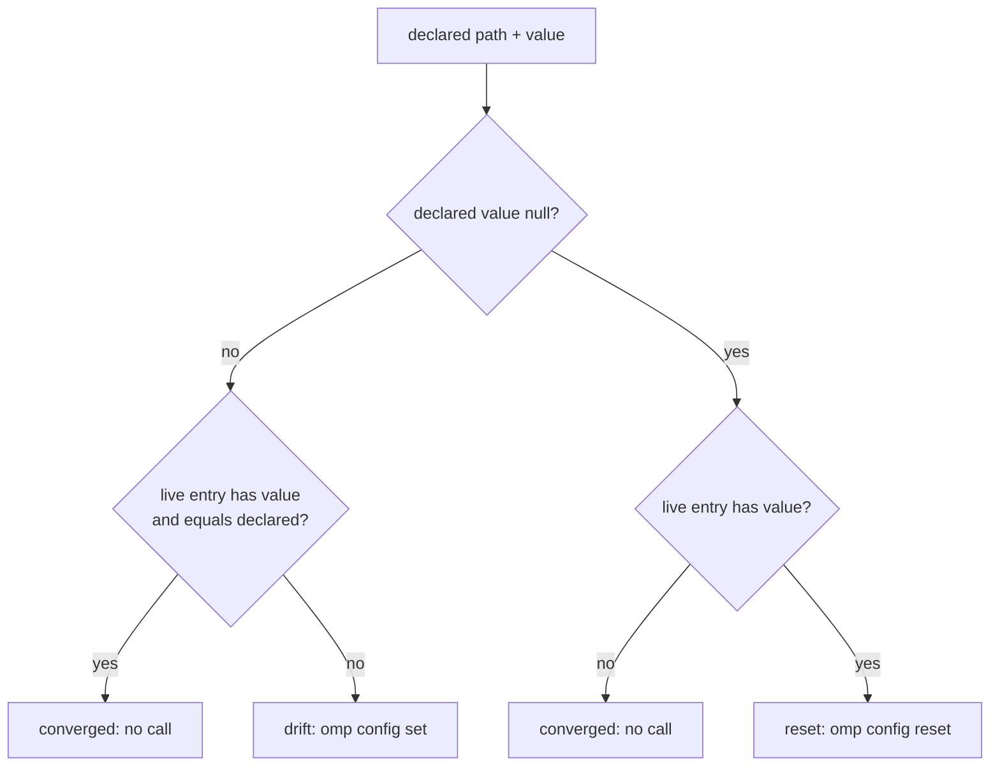

# Quota Optimization and Settings Fixes - Plan

## Goal Capsule

- **Objective:** Reduce Anthropic 5-hour quota burn by removing hidden fallback leakage, shifting three high-volume agent seats to Gemini, separating Fable onto its own role, and establishing strict usage-reserve retry and fallback behavior.
- **Means:** Bundle four open issues (#260, #261, #262, #264) into a single configuration update targeting `agents.yaml` and `AGENTS.md`.
- **Authority:** Product Contract below.
- **Execution profile:** Source-state changes only.
- **Stop conditions:** The provisioner supports `null` values idempotently, and all specified `agents.yaml` and `AGENTS.md` updates are applied and validated.
- **Tail ownership:** The implementation tail owns focused verification, commit, push, pull request, and CI watch.

---

## Product Contract

Product Contract preservation: unchanged.

### Summary

Four open quota-related issues (#260, #261, #262, #264) are bundled into a single configuration update targeting `agents.yaml` and `AGENTS.md`. This update introduces `null`-value support in the settings provisioner to plug a silent web search leak, migrates volume seats to Gemini 3.7 Flash, isolates the Claude Fable model role, and fully adopts four new usage-aware retry and fallback levers to protect quota headroom.

### Problem Frame

The shared `anthropic:5h` bucket is experiencing severe pressure (peaking at 100%). This is exacerbated by three factors: a silent web search grounding failure that falls back to Anthropic without notice, high-frequency execution seats (`task`, `designer`, `security-reviewer`) running on Anthropic Sonnet 5, and the `reviewer` seat drawing from the scarce weekly Fable bucket due to shared aliases. Additionally, the existing retry and reserve policies allow the 5-hour bucket to drain completely without protective headroom or stable fallback persistence.

### Key Decisions

- **Bundle all four issues into one update.** Minimizes CI runs and merge conflicts across identical YAML and `AGENTS.md` lines, despite coupling independent concerns.
- **Adopt `never` for fallback revert policy.** 5-hour buckets reset on a rolling basis, so reverting on cooldown expiry risks thrashing between a capable fallback (Gemini) and a newly refilled but fragile Anthropic bucket. Stability on the fallback is preferred. Governs R6.
- **Adopt `auto` and 15% reserve.** While the current state is often depleted past this window, protecting the last 15% when the bucket resets ensures immediate headroom. Governs R4, R5.
- **Disable model in prompt.** Mid-session model switches (exacerbated by moving seats to Gemini) bust the prompt cache if the model name is included, and cache savings outweigh the model knowing its own name. Governs R7.

### Requirements

**Settings Provisioner and Web Search Leak (#262)**
- R1. The `run_after_config-omp-settings.sh.tmpl` provisioner must support a literal `null` value for scalar paths, implementing it as `omp config reset <path>` to restore the upstream default.
- R2. The provisioner's convergence predicate must treat an already-unset key (missing `value` in the live JSON) as converged when the declared value is `null`, ensuring idempotence.
- R3. The `providers.webSearchGeminiModel` setting must be declared as `null` in `agents.yaml` to allow the upstream `gemini-2.5-flash` default, preventing the silent fallback to Anthropic.

**Quota Levers and Retry Policy (#264)**
- R4. `retry.usageReservePolicy` must be set to `auto` to apply fallbacks without interactive confirmation inside the reserve window.
- R5. `retry.usageReservePct` must be set to `15` to protect a slightly larger headroom buffer.
- R6. `retry.fallbackRevertPolicy` must be set to `never` to prevent automatic thrashing back to Anthropic when its cooldown expires.
- R7. `includeModelInPrompt` must be set to `false` to preserve prompt cache hits across mid-session model switches.

**Role Re-seating (#260, #261)**
- R8. The `task`, `designer`, and `security-reviewer` seats must be moved to the `@worker` alias (Gemini 3.7 Flash) in `task.agentModelOverrides`.
- R9. The `fable` role must be explicitly declared as `anthropic/claude-fable-5:max`, and the `plan` role must inherit it (`@fable`).
- R10. The `slow` role must be changed to `anthropic/claude-opus-5:max`, and the `reviewer` seat must remain on `@slow`.
- R11. `defaultThinkingLevel` must be lowered to `xhigh`, and the `default` role must reflect `anthropic/claude-opus-5:xhigh`.
- R12. Root `AGENTS.md` must be updated to remove claims that Sonnet 5 is the executor primary, that the audit seat avoids the cheap tier, that `slow` is Fable, that `reviewer` shares plan mode's model, and that `defaultThinkingLevel` is `max`.

### Scope Boundaries

- **K3 recovery hop promotion.** The fallback chains already bypass `kimi-code` and point directly to `gemini-3.1-pro:high`, making the question of accepting a lower-tier K3 hop moot. This is deferred as no action is required.
- **Applying #262 bug fix independently.** The bundle decision groups the provisioner `null` capability with the quota data edits, meaning a provisioner bug could block the quota savings. This risk is accepted.

#### Deferred to Follow-Up Work

- **Post-apply host verification and quota measurement.** The issues carry host-side acceptance criteria that no source-state change can prove: `omp config get` reads after apply, `web_search` provider attribution in a fresh session (#262 criteria 2-4), the 24-hour Fable rate re-read (#260 criterion 5), and the one-week shared-bucket re-read (#261 criterion 5). These run after deployment, not in this plan.
- **Live-session convergence.** A running omp session keeps the pre-change configuration until it restarts (issue #260). Convergence is by restart, not re-apply, and needs no source change.

---

## Planning Contract

### Key Technical Decisions

- KTD1. **Null maps to a third reconcile state, `reset`.** A declared `null` on a scalar path runs `omp config reset <path>`; convergence for a null path means the live `omp config list --json` entry lacks `value`. That rule holds only for empty-default keys — a key whose unset live entry carries its schema default under `value` would reset on every apply — so null is valid only for keys whose unset entry omits `value` (verified against the locked omp release: 34 of 454 schema keys, `providers.webSearchGeminiModel` among them). A null path absent from a successful live listing entirely is treated as a typo and fails loudly, because omp lists every schema key even when unset. `reset` is omp's only unset primitive, and un-declaring is not un-setting because the provisioner asserts declared paths and never prunes (issue #262). The `examined -ne` guard keeps counting null paths as examined. On a failed live read the provisioner substitutes `{}` and its contract is that fail-open still delivers the declared set, so that branch fires `omp config reset` for null-declared paths too; converged-on-missing-`value` applies only to successful reads. Governs R1, R2.
- KTD2. **The validator admits `null` fail-closed.** `omp-settings-validate.tmpl` allows `null` only on plain scalar paths and rejects it on record-typed paths (`modelRoles`, `task.agentModelOverrides`, `retry.fallbackChains`, `tools.approval`) and list-typed routing gates (`enabledModels`, `disabledProviders`, `providers.webSearchOrder`, `providers.imageOrder`), so a `reset` can never wipe a declared record, restore a routing gate's upstream default list, or bypass selector validation. Today `null` passes silently because the string gates are `kindIs "string"`-guarded; the change turns that accident of gate order into an explicit contract. Governs R1.
- KTD3. **`smol` keeps its Sonnet 5 selector with no seats attached.** After R8 nothing references `@smol`; the role stays declared so `anthropic/claude-sonnet-5` remains a named model (chain reachability in `.ci/test-omp-agent-reconcile.sh`) and remains available as a re-seat target if the seat move is reverted (issue #261). Governs R8.
- KTD4. **Fable isolation uses a custom role; the reviewer seat follows an alias.** `fable` is a custom `modelRoles` entry that `plan` inherits through `"@fable"`. `reviewer` keeps its literal `"@slow"` value and follows `slow` onto Opus 5 automatically, which is why the seat routes through the alias rather than a pinned model (issue #260). Governs R9, R10.
- KTD5. **Capability lands before the data that needs it.** The provisioner null support (U1) lands before the declaration of a null value (U2), because every apply runs the provisioner against declared data; data-first ordering would pass the literal string `"null"` to `omp config set` on the first apply. Governs R1, R3.

### High-Level Technical Design

The one non-obvious mechanism is the per-path reconcile decision in the provisioner. Each declared path resolves to exactly one of three states:

Every path increments the `examined` counter regardless of state, preserving the incomplete-stream guard.

### Assumptions

- `omp config reset <path>` removes the key from `~/.omp/agent/config.yml` and leaves the schema default in force. Issue #262 verified this against an isolated `OMP_PROFILE`; it is assumed to hold for the locked omp release that CI installs.
- No declared setting depends on the current broken behavior (a declared `null` reaching `omp config set` as the literal string `"null"`). Research found no null values in `agents.omp.settings` today.
- Host-side verification and quota measurement after apply are manual follow-ups (see Deferred to Follow-Up Work), outside this plan's source-state stop conditions.

### Sequencing

U1 -> U2 is a hard dependency (KTD5). U3 is technically independent but is ordered after U2 so the `agents.yaml` edits land serially. U4 depends on U3 because the documentation must describe the final role state.

---

## Implementation Units

### U1. Null-value support in the settings pipeline

**Goal:** The settings provisioner and its render-time validator support a declared `null` as reset-to-upstream-default, idempotently.

**Requirements:** R1, R2 (KTD1, KTD2, KTD5)

**Dependencies:** none

**Files:**
- `.chezmoiscripts/70-agents/run_after_config-omp-settings.sh.tmpl` (modify)
- `.chezmoitemplates/omp-settings-validate.tmpl` (modify)
- `.ci/test-omp-agent-reconcile.sh` (modify)

**Approach:**
1. In the provisioner's jq projection, emit a third state `reset` when the declared value is null and the live entry carries `value`, and `converged` when the declared value is null and the live entry lacks `value`. Keep the existing converged/drift logic for non-null values. On the failed-live-read branch (the `{}` fallback), treat null-declared paths as `reset` per KTD1 so fail-open still delivers the declared set.
2. In the shell loop, branch `reset` to `omp config reset "$path"` and keep `drift` on `omp config set "$path" "$value"`. Mirror the existing failure handling on the new branch. The `examined` counter increments for null paths unchanged, and the `reset` branch increments `asserted` like the `set` branch so the `asserted N of M` summary arithmetic is preserved.
3. In `omp-settings-validate.tmpl`, add the explicit null admission rule per KTD2, placed in the per-path loop before the existing `modelRoles` map gate so a `modelRoles: null` fails with the null contract's named error.
4. In `.ci/test-omp-agent-reconcile.sh`, make the dynamically harvested fixtures null-aware and add the null fixtures per the test scenarios below: the full-fixture per-path loop expects `config reset <path>` for null-valued keys, the live-converged and live-partial generators emit the null-declared path's entry without a `value` key, and the null fixture path is selected from the harvested declaration the way the existing `drift_key` selection works, so the fixtures activate when U2's data lands.

**Execution note:** Confirm `omp config reset` exits 0 on an already-unset path in the locked omp release. If it does not, the fail-open branch's blind reset must tolerate that specific outcome without going fatal.

**Patterns to follow:** The existing drift/set branch and its error exit in the provisioner script; the `run_settings` fixture harness and the `assert_render_fails`/`assert_render_ok` helpers in `.ci/test-omp-agent-reconcile.sh`.

**Test scenarios:**
- Declared null + live entry has `value` -> exactly one `omp config reset <path>` is recorded, and no `config set` fires for that path.
- Declared null + live entry lacks `value` -> converged; zero config calls for that path, proving second-apply idempotence.
- Mixed declaration (one null path plus one drifted scalar) -> one `reset` and one `set`, and `examined` equals the declared count so the incomplete-stream guard does not fire.
- Failed live read (the `{}` fallback) -> a null-declared path records a `reset` call, so every no-live fixture still records exactly one call per declared path and the `asserted N of N` arithmetic holds.
- The existing convergence and partial-drift fixtures pass after their null-aware regeneration: the null path's generated live entry carries no `value` key, so the zero-call converged fixture and the exactly-2 partial fixture stay at their counts.
- Render-negative: `modelRoles: null`, `task.agentModelOverrides: null`, `retry.fallbackChains: null`, and `tools.approval: null` each fail rendering with the validator's null error.
- Render-positive: a plain scalar path declared `null` renders clean.

**Verification:** `.ci/test-omp-agent-reconcile.sh` passes with the new fixtures, and the provisioner renders through `chezmoi execute-template`.

### U2. Hold the Gemini web search grounding model at upstream default

**Goal:** Declare `providers.webSearchGeminiModel: null` so omp's `gemini-2.5-flash` default returns to force and the silent Anthropic search fallback ends.

**Requirements:** R3

**Dependencies:** U1

**Files:**
- `.chezmoidata/agents.yaml` (modify)

**Approach:** Change the scalar value at the `providers.webSearchGeminiModel` key to `null`. Keep the key declared rather than deleting it, matching the `tools.approvalMode: yolo` precedent: the data states the intent, and an upstream default change appears as a diff instead of a silent behavior change (issue #262).

**Test scenarios:**
- The reconcile suite's dynamically harvested fixtures prove the real null declaration through the null-aware branches added in U1: the no-live fixtures record the `reset` call for `providers.webSearchGeminiModel`, and the converged/partial fixtures generate its live entry without a `value` key.

**Verification:** `.ci/test-omp-agent-reconcile.sh` is green and the rendered provisioner carries the null declaration.

### U3. Role re-seating and quota levers in agents.yaml

**Goal:** Apply the model-role restructure and the four adopted quota levers.

**Requirements:** R4, R5, R6, R7, R8, R9, R10, R11 (KTD3, KTD4)

**Dependencies:** none (ordered after U2 to keep the `agents.yaml` edits serial)

**Files:**
- `.chezmoidata/agents.yaml` (modify)

**Approach:**
1. `modelRoles`: `default` becomes `anthropic/claude-opus-5:xhigh`; add `fable: anthropic/claude-fable-5:max` (the block is alphabetized; place it accordingly); `plan` becomes `"@fable"`; `slow` becomes `anthropic/claude-opus-5:max`. `smol` keeps `anthropic/claude-sonnet-5:high` per KTD3.
2. `defaultThinkingLevel` becomes `xhigh`.
3. `task.agentModelOverrides`: `designer`, `security-reviewer`, and `task` move to `"@worker"`; `reviewer` keeps its literal `"@slow"` per KTD4.
4. Add `retry.usageReservePolicy: auto`, `retry.usageReservePct: 15`, and `retry.fallbackRevertPolicy: never` beside the existing `retry.usageAwareFallback` entry.
5. Add `includeModelInPrompt: false`.

**Patterns to follow:** Existing `modelRoles` alias indirection (`plan`, `advisor`, `commit`) and the existing scalar entries under `agents.omp.settings`.

**Test scenarios:**
- The reconcile suite passes with its existing assertions: the hardcoded `enabledModels` array-equality literal is unchanged, the kimi-code guard finds no kimi role, override, or hop, and chain reachability passes because `anthropic/claude-fable-5` stays named by `modelRoles.fable` and `anthropic/claude-sonnet-5` stays named by `modelRoles.smol`.
- The validator resolves the `@fable` and `@worker` aliases against declared `modelRoles` keys.
- The four new scalar settings pass the validator's path-grammar and safe-charset gates.

**Verification:** `.ci/test-omp-agent-reconcile.sh` is green and the provisioner renders.

### U4. Root AGENTS.md model-policy rewrite

**Goal:** Remove the retired model-placement claims and state the new placement accurately.

**Requirements:** R12

**Dependencies:** U3

**Files:**
- `AGENTS.md` (modify)

**Approach:** Rewrite the model-placement paragraph and adjust the chain-policy paragraph in root `AGENTS.md`. The rewritten text must:
1. Drop the claim that Sonnet 5 is the executor primary and the claim that a security review on the cheapest tier is the wrong economy. State that `task`, `designer`, and `security-reviewer` sit on `@worker` (Gemini 3.7 Flash at `:high`), noting that the named evidence base (Artificial Analysis Intelligence Index v4.1.1) scores it 56 against Sonnet 5's 55, which is what resolves the audit-seat objection.
2. State that `slow` is `anthropic/claude-opus-5:max` and that `reviewer` follows it through `@slow`.
3. State that Fable lives on the dedicated `fable` role and that `plan` is its only declared consumer.
4. State that `default` is `anthropic/claude-opus-5:xhigh` and `defaultThinkingLevel` is `xhigh`.
5. Keep every claim R12 does not name accurate: the extraction tier (`worker`/`skim`), `tiny`, `task.enableEffort` and `task.maxEffort`, the kimi-code posture, the chain mapping rule, and the `enabledModels` narrowing.

**Test expectation:** none -- documentation-only unit; the stale-claim grep audit in the Verification Contract is its proof.

**Verification:** The grep audit finds no retired claim, and `.ci/check-omp-seat-routing.sh` and `.ci/check-omp-agent-roster.sh` still pass.

---

## Verification Contract

| Gate | Command | Applies to |
|---|---|---|
| Provisioner render | `chezmoi execute-template` of `.chezmoiscripts/70-agents/run_after_config-omp-settings.sh.tmpl` with the per-user op-stub scratch recipe from the repository's verification section (`--source "$PWD"`, throwaway destination) | U1, U2, U3 |
| Reconcile suite | `.ci/test-omp-agent-reconcile.sh <auth.sh> <plugins.sh> <haptic-package> <settings.sh>` against the four scripts rendered as in the `omp-agent-integration` job of `.github/workflows/ci.yml`; the CI job is the canonical gate and its steps are the local reproduction recipe | U1, U2, U3 |
| Companion checks | `.ci/check-omp-agent-roster.sh`, `.ci/check-omp-seat-routing.sh`, `.ci/check-skip-declarations.sh` | U1-U4 |
| Stale-claim audit | grep of root `AGENTS.md` for the retired claims: `slow` as Fable, `defaultThinkingLevel: max`, Sonnet 5 as executor primary, the cheap-tier audit-seat justification, `reviewer` sharing plan mode's model | U4 |
| Diff hygiene | `git diff --check` and `git status`; diff limited to the five touched files | U1-U4 |

Never run `chezmoi apply` against a live `$HOME` for this plan; all verification is render-time and fixture-based per the repository rules.

---

## Definition of Done

**Global:**
- R1-R12 are implemented and each requirement traces to a landed unit.
- The `omp-agent-integration` CI job and its companion checks are green on the pull request.
- The diff touches only `.chezmoiscripts/70-agents/run_after_config-omp-settings.sh.tmpl`, `.chezmoitemplates/omp-settings-validate.tmpl`, `.ci/test-omp-agent-reconcile.sh`, `.chezmoidata/agents.yaml`, and `AGENTS.md`, plus this plan file.
- No dead-end or experimental edits remain in the diff.
- The Product Contract is unchanged from its requirements-only form.

**Per unit:**
- U1: The null fixtures pass and the existing set/drift fixtures are unregressed.
- U2: The null declaration renders and validates.
- U3: The reconcile suite passes with the new roles, seats, and levers.
- U4: The stale-claim audit is clean and the rewritten paragraphs match the landed data.
