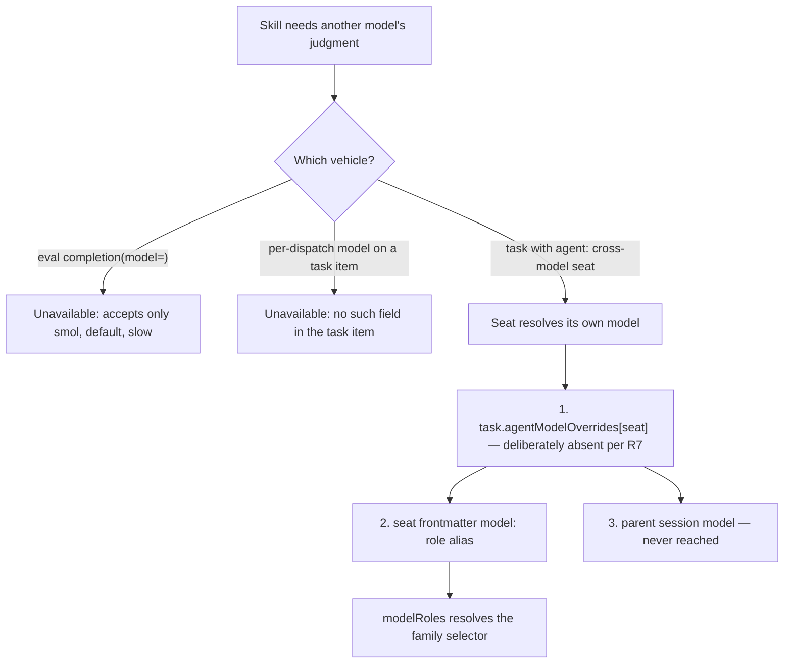
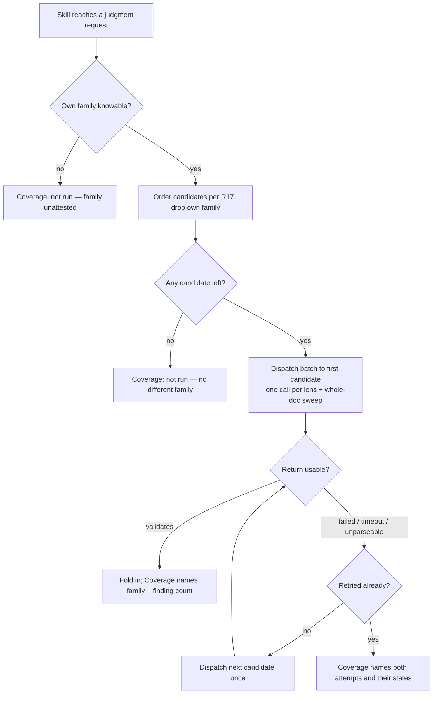

# OMP-Native Cross-Model Review - Plan

## Goal Capsule

- **Objective.** A cross-model review reaches a genuinely different model family and returns usable findings, on a host whose instruction core forbids invoking a foreign agent CLI.
- **Means.** Family-named `modelRoles` plus read-only custom omp seats pinned to them, with the pass contract split across the instruction core, a personal skill, and the seat prompts (KD3, KTD1).
- **Authority.** `.chezmoidata/agents.yaml` owns which families exist and which model each answers on. The root `AGENTS.md` owns the model-placement rationale. `STRATEGY.md` owns the declare-as-data standard. Compound-engineering's shipped skill tree is not modified.
- **Execution profile.** Data and template changes plus CI guards in one chezmoi source repo. No runtime service, no migration, no user-facing UI.
- **Stop conditions.** Stop and surface if `omp` gains a bundled agent named `claude`, `codex`, or `gemini` (U4's target paths would collide), or if `modelRoles` rejects any of the three family keys at render time.
- **Tail ownership.** This plan is executed under `lfg`; the shipping tail (commit, push, PR, CI watch) belongs to that pipeline, not to a unit here.

---

## Product Contract

### Summary

Declare three family-named omp model roles (`claude`, `codex`, `gemini`), pin one read-only custom seat to each, and route every skill procedure that asks for a foreign agent CLI's judgment into those seats instead. Open `openai-codex` to exactly one model behind a CI guard that keeps it off every automatic path.

### Problem Frame

The instruction core prohibits invoking an agent CLI to perform work, in any form. Compound-engineering's cross-model passes are built entirely on that prohibited transport: `ce-doc-review` and `ce-code-review` each shell out through `cross-model-doc-review.sh` / `cross-model-adversarial-review.sh` to `claude`, `codex`, `grok`, or `cursor-agent`, and `ce-brainstorm`'s reasoning elevation calls `claude -p` from `elevation-dispatch.sh`. The result is not a loud failure but a silent one: every such pass reports "cross-model pass: not run" and the review proceeds single-family. The capability is paid for and unreachable.

The cost lands on exactly the reviews that need it most. Both review skills gate the pass on their adversarial and judgment lenses — the lenses selected when a change touches auth, payments, persistence, or a verification mechanism that can go green while the real thing is red. Those are the findings a second model family is most likely to catch and a same-family reviewer most likely to share a blind spot on.

The quota picture makes the gap worse rather than neutral. The Anthropic bucket that serves the main loop sits at 86% of its 7-day allowance, while the authenticated `openai-codex` account is at 34% with a `pro` plan. Review work is currently either not happening or competing for the one constrained bucket.

### Key Decisions

- KD1. **The pass is redirected from the instruction core and a personal skill, never by overlaying upstream's files.** (session-settled: user-directed — chosen over overlaying `ce-doc-review`'s `cross-model-review.md` and `cross-model-eval.md`: those are archive-owned, so an overlay silently reverts upstream's own edits on every compound-engineering version bump.) Governs R9, R11.
- KD2. **The full upstream contract is re-expressed, not thinned to a summary.** (session-settled: user-directed — chosen over a lean substitute and over a fold-in-contract-only port: lens slicing, the whole-doc sweep, and the promotion rules carry the review value, not just the dispatch.) Governs R11, R12.
- KD3. **The contract is split across the instruction core, the personal skill, and the seat prompts.** (session-settled: user-approved — chosen over putting the whole contract in the instruction core: the core is loaded on every turn of every session, and the pass fires rarely.) Governs R9, R11, R12.
- KD4. **New custom seats carry the pass; no bundled seat is repointed.** Repointing `reviewer` or `security-reviewer` would change their everyday behavior to buy a capability used occasionally. Governs R5, R7.
- KD5. **Family roles hold explicit provider-qualified selectors, not `@default` / `@worker` aliases.** A family role that aliases the main loop moves whenever the main loop moves, which is the opposite of what an attestably different family needs. Governs R1.
- KD6. **Three of upstream's subsystems are dropped rather than ported.** Identity receipts exist because a CLI shell-out cannot prove which model served a request; sandbox flags exist because a foreign CLI's privileges are otherwise unconstrained; the detached job supervisor exists because a shell-out has no lifecycle. omp resolves the served model itself, enforces a declarative `tools:` allowlist, and already owns background-job dispatch. Governs R6, R13, R20.
- KD7. **`openai-codex` opens through one exact-selector whitelist entry.** The provider is already absent from `disabledProviders`; whitelist omission is what excludes it today. An exact selector opens one model while every other openai-codex model stays closed, and a wildcard would open all seven. Governs R2, R3, R15.
- KD8. **Write-delegation is out of scope, not merely unimplemented.** A read-only seat cannot serve `ce-work`'s `work_engine_mode`, whose peer authors code. Governs R14.

### Requirements

**Model roles and provider access**

- R1. `agents.omp.settings.modelRoles` declares three family-named roles: `claude` as `anthropic/claude-opus-5:xhigh`, `codex` as `openai-codex/gpt-5.6-sol:xhigh`, and `gemini` as `google-antigravity/gemini-3.7-flash:high`. Each value is an explicit provider-qualified selector.
- R2. `agents.omp.settings.enabledModels` gains exactly one new entry, the exact selector `openai-codex/gpt-5.6-sol`. No `openai-codex/*` wildcard and no second openai-codex entry.
- R3. `openai-codex` stays absent from `disabledProviders`, so the whitelisted model remains selectable through `/model` and resolvable by the `codex` role.
- R4. Automatic model fallback stays off. `retry.fallbackChains` remains `{}` and `retry.usageAwareFallback` remains `false`.

**Cross-model seats**

- R5. Three user-scoped agent definitions deploy to `~/.omp/agent/agents/`, one per family role, each pinning its model through frontmatter `model:` referencing the role alias.
- R6. Each seat declares an empty `tools:` list and no `spawns`. A peer reviews only what the dispatch prompt inlines; it cannot read the filesystem, write, run shell commands, or dispatch further subagents.
- R7. No seat receives a `task.agentModelOverrides` key. The seat's own frontmatter is the only model binding.
- R8. Each seat is an explicit source template that reads its selector from `agents.omp.settings.modelRoles`, so the data file stays the one place a family's model is written.

**Instruction core and the pass contract**

- R9. The instruction core states that when a skill's procedure calls for a foreign agent CLI to obtain another model's judgment, the agent dispatches the matching cross-model seat instead and never invokes the CLI.
- R10. The instruction core presents the cross-model seats outside the existing three-column seat-routing table, because that table is pinned bidirectionally to the bundled agent set.
- R11. A personal skill at `dot_agents/skills/cross-model-review/` carries the host-side pass contract: which lenses activate it, the reviewer-specific slice each peer receives, the whole-doc sweep, the schema-shaped return, the fold-in and agreement-promotion rules, and the Coverage line naming family and terminal state.
- R12. Peer-side contract lives in the seat prompts: return findings in the requested schema, echo the peer's own resolved model identity in the return, claim no apply authority, and reason only from the material the prompt supplies.
- R13. Independence is verified from the peer's echoed model identity, not assumed from its declared role. The host compares that identity's family against its own and records the pass as non-independent when they match or the identity is absent.
- R14. The instruction-core rule covers every skill procedure that seeks another model's **judgment**, without naming individual skills. Write-delegation is excluded per KD8.

**Runtime dispatch behavior**

- R15. A CI guard rejects any declared `modelRoles` value, `task.agentModelOverrides` value, or `retry.fallbackChains` hop naming `openai-codex/`, with `modelRoles.codex` as the sole permitted exception. It mirrors the existing kimi-code automatic-routing guard, including its non-zero exit and per-reference message.
- R16. `agents.omp.settings.includeModelInPrompt` becomes `true`, so a turn can name its own active model and therefore exclude its own family.
- R17. The skill declares a deterministic peer order per host family: a `claude` host tries `codex` then `gemini`; a `codex` host tries `claude` then `gemini`; a `gemini` host tries `claude` then `codex`. `codex` leads for a `claude` host because the Anthropic bucket is the constrained one.
- R18. A peer dispatch that fails before returning a usable result falls over to the next family in R17's order exactly once, then reports the pass as not run.
- R19. Peer dispatches carry `schemaMode: permissive`, and the host validates each return against the findings schema before fold-in. A return that fails validation is reported as unparseable rather than aborting the review.
- R20. The pass is non-blocking. No peer outcome fails, blocks, or delays the parent review beyond the skill's declared wait budget.
- R21. Coverage names, per attempt, the attempted family, one terminal state drawn from — not run, no different family available, failed, timed out, unparseable, no additional issues, or a finding count — and whether the attempt was independent. Independence is reported separately from the state, because a peer can return findings and still be non-independent.
- R26. The skill defines model-identity to family resolution explicitly, and fails closed when an identity does not map — it records the pass as not run rather than guessing a family.
- R27. The three new role selectors are covered by the existing selector-shape check in `.ci/test-omp-agent-reconcile.sh`, which harvests `modelRoles` values and rejects a malformed provider, model id, or thinking level. No new validation is added: that check already exists precisely because `omp models --json` returns an empty catalog without credentials, so neither render time nor CI can confirm a model id exists.

**Guardrails, CI, and docs**

- R22. The `enabledModels` exact-array assertion in `.ci/test-omp-agent-reconcile.sh` is updated to include the new entry, since it is an equality check that fails on any whitelist change.
- R23. `.ci/test-agent-instructions.sh` gains a required needle for the substitution rule, so the rule cannot be silently dropped from the rendered core.
- R24. `.ci/check-omp-seat-routing.sh` and `.ci/check-omp-agent-roster.sh` continue to pass without modification. Both enumerate bundled agents in an isolated `HOME`, so user-authored seats are invisible to them as long as R7 and R10 hold.
- R25. The root `AGENTS.md` is updated where this change contradicts it: the closed seven-seat dispatch list, the model-placement paragraph, and the `enabledModels` narrowing paragraph.

### Why a seat is the only vehicle

### Key Flows

- F1. Cross-model pass under the substituted transport
  - **Trigger:** A skill's procedure reaches the point where it would resolve a foreign CLI route and shell out.
  - **Actors:** The host agent, one cross-model seat per dispatch, the session's own model as the family to differ from.
  - **Steps:** The host reads the pass contract from the personal skill; names its own family from the in-prompt model identity; picks the first seat in R17's order whose family differs; dispatches one call per activated lens plus the whole-doc sweep, each carrying that lens's slice and the requested return schema; collects the returns; validates them; folds them into synthesis under the skill's promotion rules; names family and terminal state in Coverage.
  - **Outcome:** Findings from a different model family enter synthesis with no agent CLI invoked. Content now reaches OpenAI, which R2 opens to this host for the first time — the `openai-codex` whitelist omission previously kept every one of its models unreachable.
  - **Covers R9, R11, R12, R13, R16, R17, R21.**

- F2. Primary peer unusable
  - **Trigger:** The first-choice family's dispatch fails, times out, or returns nothing usable.
  - **Actors:** The host agent.
  - **Steps:** The host records that attempt's terminal state, dispatches the second family in R17's order once, and stops there regardless of that outcome.
  - **Outcome:** One retry across families, never a loop. Coverage carries both attempts.
  - **Covers R18, R20, R21.**

- F3. No different family available
  - **Trigger:** Every seat that differs from the session's family is unreachable, or the host cannot name its own family.
  - **Actors:** The host agent.
  - **Steps:** The host records the pass as not run with the reason and continues with in-process reviewers only.
  - **Outcome:** The review completes single-family and says so.
  - **Covers R13, R20, R21.**

### Acceptance Examples

- AE1. Substitution replaces the shell-out
  - **Covers R9, R14.**
  - **Given** a skill procedure that instructs the agent to run a foreign agent CLI for a second model's judgment.
  - **When** the agent reaches that step.
  - **Then** it dispatches the matching cross-model seat and no agent CLI process is started.

- AE2. The codex guard rejects an automatic route
  - **Covers R15.**
  - **Given** declared settings where `task.agentModelOverrides.reviewer` is set to a selector under `openai-codex/`.
  - **When** CI runs.
  - **Then** the guard names that reference and exits non-zero.

- AE3. The codex guard permits the one sanctioned role
  - **Covers R1, R15.**
  - **Given** declared settings where `modelRoles.codex` is the only reference to `openai-codex/`.
  - **When** CI runs.
  - **Then** the guard passes.

- AE4. User-authored seats stay invisible to the bundled-agent checks
  - **Covers R7, R10, R24.**
  - **Given** three new seat definitions with no `task.agentModelOverrides` keys and no rows added to the three-column seat-routing table.
  - **When** `.ci/check-omp-agent-roster.sh` and `.ci/check-omp-seat-routing.sh` run.
  - **Then** both pass unmodified.

- AE5. Same-family dispatch is declined
  - **Covers R13, R17.**
  - **Given** a session whose in-prompt model identity is `anthropic/claude-opus-5`.
  - **When** the pass selects a seat.
  - **Then** the `claude` seat is skipped and `codex` is tried first.

- AE6. An unauthenticated primary falls over once
  - **Covers R18, R21.**
  - **Given** a `claude` host where `openai-codex` has no usable credential.
  - **When** the pass runs.
  - **Then** the `codex` attempt is recorded as failed, `gemini` is dispatched, and Coverage names both.

- AE7. A malformed peer return degrades rather than aborts
  - **Covers R19, R20.**
  - **Given** a peer return that does not validate against the findings schema.
  - **When** the host collects it.
  - **Then** that attempt is reported as unparseable and the review completes with its in-process findings.

- AE8. Apply is idempotent on an unauthenticated host
  - **Covers R2, R3.**
  - **Given** a host where the model catalog has no `openai-codex` models.
  - **When** `chezmoi apply` runs twice.
  - **Then** the settings reconciler skips validating the `codex` selector, both applies succeed, and the second changes no target.

- AE9. A peer that answers on the host's own family is not counted as independent
  - **Covers R12, R13.**
  - **Given** a peer return whose echoed model identity resolves to the same family as the host's.
  - **When** the host collects it.
  - **Then** the findings may still fold in, but the pass is recorded as non-independent and no agreement promotion is applied.

- AE10. A peer that echoes no identity is not counted as independent
  - **Covers R12, R13.**
  - **Given** a peer return that omits the echoed model identity.
  - **When** the host collects it.
  - **Then** the pass is recorded as non-independent for the same reason, without failing the review.

### Scope Boundaries

**Deferred to follow-up work**

- A write-capable peer for `ce-work`'s `work_engine_mode`. It needs a seat with write tools and its own trust posture, which is a separate design (KD8).
- Any `.compound-engineering/` config change. `cross_model_peer` and `cross_model_review_mode` configure the CLI transport this work bypasses.

**Non-goals**

- Modifying compound-engineering's shipped skill tree. No archive file is overlaid, patched, or forked, and `.ci/test-compound-engineering-overlays.sh` is untouched.
- Reimplementing upstream's identity-receipt fields, per-route sandbox flags, or detached job supervisor (KD6).
- Adding or removing any provider in `disabledProviders`.
- Changing any bundled seat's model or thinking level.

### Dependencies / Assumptions

- The `openai-codex` account remains authenticated. Verified: `swkang0513@gmail.com`, plan `pro`, 7-day allowance at 34% used. An expired grant makes the `codex` seat unavailable, which F2 and F3 already handle.
- `openai-codex/gpt-5.6-sol` remains in omp's catalog with `xhigh` among its thinking levels. Verified, alongside `max`.
- `omp models --json` returns an empty catalog without credentials. That is why the apply-time reconciler skips catalog validation for an uncovered provider, and why no render-time or CI check can confirm a model id exists. R15, R22, and R27 pin what is checkable; the smoke test covers the rest.
- `~/.omp/agent/agents/` is also `omp agents unpack --user`'s default target. `claude`, `codex`, and `gemini` do not collide with any current bundled agent name; a future collision is a stop condition.
- The three role values are the user's stated selectors, carried as given. `gemini` sits at that model's thinking ceiling, since `google-antigravity/gemini-3.7-flash` exposes only `low`, `medium`, and `high`.

### Outstanding Questions

**Deferred to planning or implementation**

- Whether the `gemini` seat should run a reasoning tier instead of a flash tier. `google-antigravity/gemini-3.1-pro:high` is already inside the existing `google-antigravity/gemini-3.*` whitelist entry, so switching costs no whitelist change. Recorded rather than applied, because the flash selector was stated directly.
- Whether to declare `modelRoles.vision`. An undeclared `vision` role resolves `@vision`, then `@default`, then the active session model, then the first catalog entry, and the chosen model must advertise image input. Because `default` is vision-capable, the catalog-order last resort is unreachable, so whitelisting a vision-capable OpenAI model changes nothing today. Declaring `vision` matters only if `default` later moves to a text-only model.
- The payload size at which the whole-doc sweep stops inlining. Peers hold no tools (KTD4), so an oversized document is out of the sweep's reach rather than read from disk — the bound decides where that line sits.
- How upstream drift is detected. Re-expressing upstream's contract (KD2) means a compound-engineering release that changes its lens set or promotion rules never reaches this host. Candidate: a periodic audit comparing the skill against the installed `ce-doc-review` and `ce-code-review` references, pinned to the version recorded in `.chezmoidata/releases.json`. Deferred because the audit cadence is a judgment call, not a blocker.

### Sources / Research

- `.chezmoidata/agents.yaml` — `agents.omp.settings` holds `modelRoles`, `enabledModels`, `disabledProviders`, `task.agentModelOverrides`, `includeModelInPrompt`, and the retry policy this work extends.
- `.ci/test-omp-agent-reconcile.sh` — the `enabledModels` exact-array assertion, the fallback-policy assertion, and the kimi-code automatic-routing guard that R15 mirrors. `$declared_json` is extracted from the rendered settings script by `awk`.
- `.ci/check-omp-agent-roster.sh`, `.ci/check-omp-seat-routing.sh` — both enumerate bundled agents through `omp agents unpack` inside an isolated `HOME`; the seat-routing check extracts column two of a strictly three-column table.
- `.ci/test-agent-instructions.sh` — a `NEEDLES` heredoc checked with `grep -F` against the rendered core.
- `.chezmoiexternals/ai-agents.toml` — records that downloaded skills coexist with locally-authored skills under `dot_agents/skills/<name>/`. `.chezmoiremove` prunes only `.agents/skills/ce-*`, `lfg`, and `playwright-cli`.
- `STRATEGY.md` — the declare-as-data standard and the duplicate-knowledge metric that KTD3 answers.
- `omp://task-agent-discovery.md` — user agent discovery from `~/.omp/agent/agents/*.md`, the `AgentDefinition` frontmatter contract, and task model precedence.
- `omp://tools/task.md`, `omp://tools/eval.md` — the task item shape including `outputSchema` and `schemaMode`, and `completion`'s three-tier `model` restriction.
- `omp://models.md`, `omp://tools/inspect_image.md` — the built-in role list and the concrete `@vision` fallback chain.
- No prior learning in `docs/solutions/` covers omp routing policy, cross-model review, or the overlay mechanism; this is the first such change.

---

## Planning Contract

### Product Contract preservation

Restructured, with one narrowing. `R8` was reworded from "render from `.chezmoidata/agents.yaml`" to "explicit source template reading its selector from `modelRoles`" — no scope change, because the repo has no precedent for one data list materializing N markdown targets and chezmoi requires 1-to-1 sources. `R14` **changed**: it previously claimed the rule also covers `ce-work`'s implementation engine; a read-only seat cannot author code, so write-delegation is now an explicit non-goal (KD8). `R16`–`R21` are new, added because Phase 1.5 found the original rule unimplementable without host self-attestation and a deterministic peer order. Original `R15` (the openai-codex routing guard) keeps its number; original `R16`–`R19` renumbered to `R22`–`R25`. No requirement was dropped.

### Key Technical Decisions

- KTD1. **Host-side orchestration lives in the personal skill; seats stay atomic evaluators.** A seat prompt describes only how to review the material it is handed and how to shape its return. Lens selection, family exclusion, batching, failover, validation, and fold-in live in the skill. A seat that knew the workflow would need editing whenever the workflow changed, and three copies would drift. Governs R11, R12.
- KTD2. **Self-attestation comes from `includeModelInPrompt`, not inference.** The alternative — reading `omp config get modelRoles.default` on demand — was evaluated and rejected: it returns the configured default, so a mid-session `/model` switch would silently make the host pick a same-family peer. The accepted cost is a short, session-stable identity string per turn, which sits in the cacheable prefix rather than fragmenting it. Revisit if that string ever becomes non-constant within a session. Governs R16.
- KTD3. **A family role duplicating `default`'s or `worker`'s selector is coincidence, not duplicated knowledge.** `default` means "what the main loop runs on"; `claude` means "the Anthropic-family reviewer". They are independent facts that happen to share a value today, so `STRATEGY.md`'s duplicate-knowledge metric is not violated — the same reasoning that lets `fable` exist beside `slow`. Governs R1.
- KTD4. **Material is inlined into the dispatch prompt; peers hold no tools at all.** Every slice, diff, and whole-doc sweep is inlined, so a peer never reads from disk. Granting even read-only filesystem tools would let a peer acting on attacker-influenceable material reach credential stores and echo them into its findings, and the design already inlines by default — the tools bought only the large-sweep path. The cost is that a sweep is bounded by a payload limit instead of a path reference. Governs R6, R11, R12.
- KTD5. **`schemaMode: permissive` with host-side validation.** `strict` fails a retry-exhausted invalid result, which would turn a peer's formatting slip into a hard error inside an additive pass. Permissive plus an explicit host check degrades to "unparseable" instead. Governs R19.
- KTD6. **One cross-family retry, never a loop.** Failover tries the next family once. Upstream's budgeted multi-round supervisor existed because a detached process could hang; a `task` dispatch already has a bounded lifecycle. Governs R18.
- KTD9. **The peer proves its own family; the host does not take the role's word for it.** Each seat echoes its resolved model identity in its return and the host checks that family against its own before fold-in. A declared `model:` alias states what was requested, not what served the request, so without the echo a misbinding or a provider-side substitution would produce single-family findings under a cross-model badge. Governs R12, R13.
- KTD7. **The new CI guard sits immediately after the kimi-code guard, before catalog harvesting.** It reads the same `$declared_json` and reuses the same jq shape, so the two policies read as siblings. Governs R15.
- KTD8. **Seats are excluded from both bundled-agent CI checks by construction, not by editing them.** Omitting `task.agentModelOverrides` keys keeps the roster check's bidirectional match intact, and keeping the seats out of the three-column table keeps the routing check's match intact. Governs R7, R10, R24.

### High-Level Technical Design

Selection and lifecycle, which R16–R21 own between them:

Ownership of the pass contract across three files:

| Layer | File | Carries |
| --- | --- | --- |
| Routing rule | `.chezmoitemplates/agents-instructions.tmpl` | The substitution itself and the seat names. Loaded every turn, so it stays short. |
| Host orchestration | `dot_agents/skills/cross-model-review/SKILL.md` | Lens activation, slicing, sweep, order, failover, schema, fold-in, Coverage. Loaded on demand. |
| Peer behavior | `dot_omp/private_agent/agents/private_readonly_<family>.md.tmpl` | Review posture, return shape, no-apply-authority. Loaded per dispatch. |

### Assumptions

- `includeModelInPrompt: true` names the model in a form the skill can map to a provider family. If the rendered identity is a bare model name with no provider, R26's explicit resolution table carries the mapping and fails closed on an unknown name.
- A peer can review usefully from inlined material alone. Any material too large to inline is out of the sweep's reach rather than fetched by the peer.

### System-Wide Impact

`includeModelInPrompt: true` (R16) is the one change here that touches every turn of every session, not just a review. It adds the active model's identity to each prompt. That is the point — self-attestation is what makes own-family exclusion possible — but it is a global prompt change bought for a capability that fires occasionally, and it is the first thing to revisit if prompt overhead ever matters.

Opening `openai-codex` adds a third provider bucket to a host that previously spent only Anthropic, Google, and Kimi quota. Spend stays attributable because `modelRoles.codex` is the only declared path to it (R15), but the account is now reachable from an ordinary review.

The instruction-core rule (R9) changes behavior for skills this repo does not own. A compound-engineering release that restructures its cross-model references does not break the rule, because the rule names no skill — but it can move where the rule needs to fire, and nothing in CI detects that.

### Risks

- **Fan-out amplifies tokens and can trip a secondary provider's rate limit.** One dispatch per activated lens plus a whole-doc sweep, each carrying inlined material (KTD4), multiplies input tokens on one provider at once. Now that peers hold no tools, every sweep is inlined too, which raises the ceiling further. R20's non-blocking rule keeps the review from stalling and R18 caps retries at one, but the skill needs a payload bound — the open question on sweep payload size is this risk's mitigation.
- **No automated gate can prove a model id exists.** The catalog is empty without credentials, so a well-formed selector naming a model that does not exist passes render time, CI, and apply, and surfaces only at dispatch — where F3 records it as a skip and the review continues single-family. R27 catches a misshaped selector; the dogfood smoke test is the only control on a misspelled one.
- **A future bundled agent named `claude`, `codex`, or `gemini` would collide** with U4's target paths in `~/.omp/agent/agents/`. Declared as a Goal Capsule stop condition rather than defended against, because omp's bundled roster is currently role-named and a rename is observable at apply time.
- **The dogfood smoke test is the only end-to-end proof.** No unit test can dispatch a seat, so a mistake in the seat frontmatter or the skill's dispatch shape survives all four CI gates and appears only when a review runs.

### Sequencing

U1 lands the data first, because U2, U3, and U4 all read it. U5 and U6 are the instruction-core rule and the skill it points at; they land together so the rule never references an absent skill. U7 reconciles the docs last, once the surfaces it describes exist.

---

## Implementation Units

### U1. Declare the family roles, the codex whitelist entry, and in-prompt model identity

- **Goal.** `.chezmoidata/agents.yaml` becomes the single source for which families exist, which model each answers on, and the one openai-codex model that is reachable.
- **Requirements.** R1, R2, R3, R4, R16.
- **Dependencies.** None.
- **Files.** `.chezmoidata/agents.yaml`
- **Approach.**
  1. Add `claude`, `codex`, and `gemini` to `agents.omp.settings.modelRoles`, keeping the block's existing alphabetical key order and quoting nothing that is not an `@` alias.
  2. Insert `openai-codex/gpt-5.6-sol` into `enabledModels`. Place it after the `google-antigravity` entry and before `kimi-code/*` so the list stays provider-grouped.
  3. Flip `includeModelInPrompt` from `false` to `true`.
  4. Leave `disabledProviders`, `retry.fallbackChains`, `retry.usageAwareFallback`, and every `task.agentModelOverrides` key untouched.
- **Patterns to follow.** The existing `fable` role is the precedent for a custom role with an explicit selector beside a built-in role that shares its provider.
- **Test scenarios.** Test expectation: none — this unit is data whose behavior is proved by U2 and U3.
- **Verification.** The settings template renders without a `fail`, and the rendered declared-settings JSON contains the three new roles, the new whitelist entry, and `includeModelInPrompt: true`.

### U2. Withdrawn — no new validation is needed

Dropped during implementation. The intended checks already exist: `.ci/test-omp-agent-reconcile.sh` harvests every `modelRoles` value into a selector-shape check that rejects a bad provider, model id, or thinking level, and its `enabledModels` exact-array assertion already fails on any whitelist edit including a wildcard. Adding a render-time twin would duplicate a rule that has an owner, which `STRATEGY.md` counts as a duplicate-knowledge defect. R27 records the coverage instead.

### U3. Add the openai-codex automatic-routing guard and update the whitelist assertion

- **Goal.** CI fails if any automatic path can reach an openai-codex model, and the whitelist assertion reflects the new entry.
- **Requirements.** R15, R22.
- **Dependencies.** U1.
- **Files.** `.ci/test-omp-agent-reconcile.sh`
- **Approach.**
  1. Update the `.enabledModels` exact-array literal to include `openai-codex/gpt-5.6-sol` in the same position U1 used.
  2. Immediately after the kimi-code guard block and before catalog harvesting, add a sibling guard reading the same `$declared_json`. It collects `modelRoles` entries, `task.agentModelOverrides` values, and `retry.fallbackChains` hops that start with `openai-codex/`, excluding only the `modelRoles.codex` entry, and exits non-zero naming each offender.
  3. Mirror the kimi-code guard's comment shape, stating why the guard exists and that the apply-time catalog gate fails open.
- **Patterns to follow.** The kimi-code guard block verbatim, including its `while IFS= read -r ref` loop and its per-reference `printf` to stderr.
- **Test scenarios.**
  - Covers AE3. The guard passes when `modelRoles.codex` is the only openai-codex reference.
  - Covers AE2. The guard fails when a `task.agentModelOverrides` value names an openai-codex selector.
  - The guard fails when a `retry.fallbackChains` hop names an openai-codex selector.
  - The guard fails when a second `modelRoles` key besides `codex` names an openai-codex selector.
  - The updated `enabledModels` equality assertion passes against the real rendered settings.
- **Verification.** The test passes against the real rendered settings script and fails against each scratch copy above.

### U4. Render the three tool-less cross-model seats

- **Goal.** Three dispatchable seats exist, each pinned to one family role, each holding no tools and carrying the peer-side contract.
- **Requirements.** R5, R6, R7, R8, R12.
- **Dependencies.** U1.
- **Files.** `dot_omp/private_agent/agents/private_readonly_claude.md.tmpl`, `dot_omp/private_agent/agents/private_readonly_codex.md.tmpl`, `dot_omp/private_agent/agents/private_readonly_gemini.md.tmpl`
- **Approach.**
  1. Create the `agents/` subdirectory under `dot_omp/private_agent/`, mirroring how `rules/` sits there today.
  2. Give each file frontmatter with `name`, `description`, `model: "@<family>"`, an empty `tools` list, and no `spawns`. Read the family's selector from `agents.omp.settings.modelRoles` for the description so the data file stays authoritative.
  3. Write one shared body describing the peer-side contract per R12: reason only from the material the prompt supplies, return findings in the requested schema, echo the peer's own resolved model identity in that return, claim no apply authority, and never propose applying a change.
  4. Do not add a `task.agentModelOverrides` key for any of them.
- **Patterns to follow.** `dot_omp/private_agent/rules/readonly_comment-hash.md` for the managed-subtree naming and read-only attribute; the `AgentDefinition` frontmatter contract from `omp://task-agent-discovery.md`.
- **Test scenarios.**
  - Covers AE4. `.ci/check-omp-agent-roster.sh` passes unchanged with the three seats present.
  - Each rendered seat's frontmatter parses and names exactly one `model` alias resolving to a declared role.
  - No rendered seat declares any tool, nor a write, shell, or spawn capability.
  - Each rendered seat body instructs the peer to echo its resolved model identity.
- **Verification.** Each template renders to valid frontmatter, and the roster check passes.

### U5. Add the instruction-core substitution rule and its needle

- **Goal.** Every agent turn on this host knows to substitute a cross-model seat for a foreign agent CLI, and CI keeps the rule from being dropped.
- **Requirements.** R9, R10, R14, R23, R24.
- **Dependencies.** U4, U6.
- **Files.** `.chezmoitemplates/agents-instructions.tmpl`, `.ci/test-agent-instructions.sh`
- **Approach.**
  1. In the delegation section, after the existing seven-seat routing table, add a short paragraph: a judgment request that a skill's procedure routes to a foreign agent CLI is served by the matching cross-model seat, the seats are named in prose, and the full contract lives in the `cross-model-review` skill. State that write-delegation is not covered.
  2. Keep the seats out of the three-column table so `.ci/check-omp-seat-routing.sh`'s bidirectional match stays intact.
  3. Append the rule's key sentence verbatim to the `NEEDLES` heredoc in `.ci/test-agent-instructions.sh`.
- **Patterns to follow.** The existing `MUST NOT invoke an agent CLI` paragraph, which this one qualifies; the `NEEDLES` heredoc's one-string-per-line shape.
- **Test scenarios.**
  - Covers AE1. The rendered core contains the new needle.
  - `.ci/check-omp-seat-routing.sh` passes, proving no new row entered the three-column table.
  - The rendered core still contains every pre-existing needle.
- **Verification.** `.ci/test-agent-instructions.sh` and `.ci/check-omp-seat-routing.sh` both pass.

### U6. Author the cross-model-review personal skill

- **Goal.** The host-side pass contract exists on disk, loaded on demand rather than every turn.
- **Requirements.** R11, R13, R17, R18, R19, R20, R21, R26.
- **Dependencies.** U4.
- **Files.** `dot_agents/skills/cross-model-review/SKILL.md`
- **Approach.**
  1. Write frontmatter with `name: cross-model-review` and a description naming when it fires. The name avoids `ce-*`, `lfg`, and `playwright-cli`, so `.chezmoiremove` does not prune it and no registration is needed anywhere.
  2. Document, in order: the activation gate (which lenses earn a pass); self-attestation from the in-prompt model identity, with R26's explicit identity-to-family table and its fail-closed behavior on an unmapped name; the candidate order and own-family exclusion per R17; the dispatch batch, one call per activated lens plus one whole-doc sweep, all in a single `task` batch; the inline-only material rule and its payload bound per KTD4; the return schema and `schemaMode: permissive` per R19; the echoed-identity check that decides independence per R13 and KTD9; the single cross-family retry per R18; the fold-in and agreement-promotion rules; and the Coverage vocabulary per R21.
  3. Define the findings schema explicitly, with the fields fold-in consumes.
  4. State that peer findings never carry apply authority.
- **Patterns to follow.** The compound-engineering skills' own reference-file shape for a staged contract; the existing `~/.agents/skills/` deployment convention.
- **Test scenarios.**
  - Covers AE5. Given a `claude` in-prompt identity, the documented order selects `codex` first and never `claude`.
  - Covers AE6. Given a failed primary, the documented flow dispatches the secondary exactly once and records both attempts.
  - Covers AE7. Given a return that fails schema validation, the documented flow records unparseable and completes the review.
  - Every Coverage state in R21 has exactly one documented trigger.
  - Given a peer return whose echoed identity resolves to the host's own family, the documented flow records the pass as non-independent and withholds agreement promotion.
  - Given an in-prompt identity the resolution table does not cover, the documented flow records the pass as not run rather than guessing.
- **Verification.** The skill deploys to `~/.agents/skills/cross-model-review/SKILL.md`, and a fresh read of it answers each test scenario above without inference.

### U7. Reconcile the root AGENTS.md

- **Goal.** The repository supplement stops contradicting the surfaces this change adds.
- **Requirements.** R25.
- **Dependencies.** U1, U4, U5, U6.
- **Files.** `AGENTS.md`
- **Approach.**
  1. Amend the closed seven-seat sentence so it describes the bundled dispatchable set and names the cross-model seats as a separate, non-bundled category.
  2. Extend the model-placement paragraph with the three family roles and the quota rationale for `codex` leading a `claude` host.
  3. Extend the `enabledModels` paragraph with the exact-selector openai-codex entry and its guard, mirroring how the kimi-code guard is already described.
  4. Note that `includeModelInPrompt` is now on and why.
- **Patterns to follow.** The existing kimi-code paragraph, which states the whitelist entry, the guard, and the removal procedure together.
- **Test scenarios.** Test expectation: none — documentation reconciliation with no behavioral surface. The needle gate in U5 covers the rendered instruction core, which is a different file.
- **Verification.** No sentence in `AGENTS.md` still asserts that only seven seats are dispatchable or that no openai-codex model is reachable.

---

## Verification Contract

Render the settings script and the fixtures the tests consume, then run the four gates. This mirrors the `omp-agent-integration` job in `.github/workflows/ci.yml`.

| Gate | Command | Applies to | Done signal |
| --- | --- | --- | --- |
| Render validation | `chezmoi --config <empty> --source "$PWD" execute-template < .chezmoiscripts/70-agents/run_after_config-omp-settings.sh.tmpl > <scratch>/settings.sh` | U1, U2 | Renders with no `fail`; declared JSON carries the new roles, whitelist entry, and `includeModelInPrompt: true` |
| Reconcile + guards | `.ci/test-omp-agent-reconcile.sh <auth.sh> <plugins.sh> <haptic-package> <settings.sh>` | U1, U3 | Passes; the new guard rejects each scratch copy that routes to openai-codex |
| Roster | `.ci/check-omp-agent-roster.sh <settings.sh>` | U4 | Passes unmodified |
| Instruction core | `.ci/test-agent-instructions.sh` and `.ci/check-omp-seat-routing.sh` | U5 | Both pass; the new needle is found |

All four render steps use an empty chezmoi config and an `op` stub on `PATH` so no real vault read occurs, exactly as CI does. The `op` stub must return newline-free secrets.

**Dogfood smoke test (manual, required).** After apply, run a document review that activates a judgment lens and confirm from the review's own Coverage line that a cross-model seat ran on a different family, that the finding count or terminal state is named, and that no agent CLI process was started. This is the only proof that the seats are dispatchable and the skill is loadable; no unit test can produce it.

---

## Definition of Done

**Global**

- Every requirement R1–R27 is either implemented or explicitly deferred in Scope Boundaries.
- All four Verification Contract gates pass locally before the branch is pushed.
- The dogfood smoke test has been run and its Coverage line recorded.
- `chezmoi apply` twice in a row changes zero targets on the second run and reruns zero onchange scripts, per `STRATEGY.md`'s idempotent-apply metric.
- No abandoned or experimental code from this run remains in the diff.
- The branch lands as a real two-parent merge commit; `.ci/check-merge-commit-only.sh` rejects squash and rebase landings.

**Per unit**

| Unit | Done when |
| --- | --- |
| U1 | Declared settings JSON carries three family roles, the exact openai-codex selector, and `includeModelInPrompt: true` |
| U2 | Render fails on an `openai-codex/*` wildcard, a provider-less selector, and a bad thinking suffix; succeeds on the real data |
| U3 | The guard rejects a role, an override, and a chain hop naming openai-codex, and permits `modelRoles.codex` |
| U4 | Three seats render with a resolving `model` alias, an empty `tools` list, and no `spawns`; each body requires the echoed identity; the roster check passes |
| U5 | The new needle is present and the seat-routing check still passes |
| U6 | The skill deploys and answers each of its test scenarios on a cold read |
| U7 | No sentence in `AGENTS.md` contradicts the shipped surfaces |
