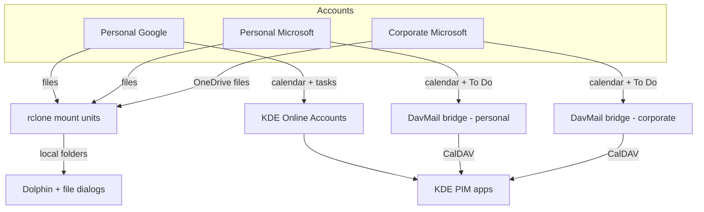
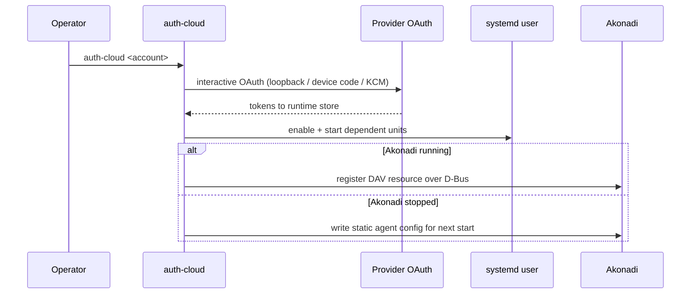
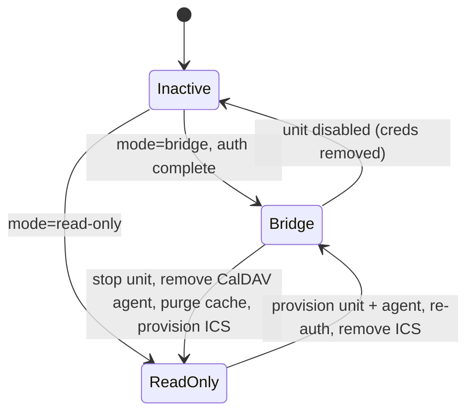

# Cloud Drive and PIM Integration for KDE Plasma - Plan

## Goal Capsule

- **Objective:** On any KDE host this repo provisions, the operator's three cloud accounts — personal Google, personal Microsoft, corporate Microsoft — are reachable KDE-natively: drives browsable in Dolphin and file dialogs, calendars and tasks in KDE PIM apps, with no manual setup beyond per-account OAuth sign-in.
- **Means:** uniform rclone mounts as data-declared systemd user services for files; KDE Online Accounts for Google PIM; two isolated DavMail Microsoft Graph bridge instances for Microsoft PIM, authenticated with a self-registered Entra app (KTD3, KTD5, KTD6).
- **Product authority:** this document's Product Contract.
- **Execution profile:** `code`; units U1–U8 land in dependency order (U1 → {U2, U3, U4, U5} → U6 → U7 → U8).
- **Stop conditions:** a unit's verification fails twice on the same defect; tenant consent validation (R14) fails closed; any step would commit a secret to the repository.
- **Open blockers:** none.
- **Tail ownership:** ce-work implements; branch, commit, and CI follow the repository's delivery rules.

---

## Product Contract

Product Contract preservation: unchanged except Outstanding Questions resolved by planning research — no scope change.

### Summary

Provision personal Google Drive, personal OneDrive, and corporate OneDrive for Business as on-demand folders via declarative rclone user services, wire Google Calendar and Tasks through KDE Online Accounts, and bridge both Microsoft accounts' calendars and tasks into KDE PIM apps through a DavMail Microsoft Graph gateway using a self-registered Entra app.

### Problem Frame

KDE's Online Accounts panel offers only ownCloud, Nextcloud, and a Google provider limited to calendars, contacts, and tasks — no file access and no Microsoft accounts at all. Today the operator reaches these drives through browser tabs, which keeps files out of Dolphin, file dialogs, and shell tooling. Microsoft additionally retires Exchange Web Services for Exchange Online with phased disablement beginning 2026-10-01 and full shutdown on 2027-04-01, so every EWS-based Linux client is a dead end; any Microsoft PIM integration built now must be Microsoft Graph-based.

### Key Decisions

- **Uniform rclone gateway for all three drives, over kio-gdrive for Google.** One data-declared mechanism instead of two; fits the repo's declare-as-data strategy. (session-settled: user-directed — chosen over the kio-gdrive hybrid: a single reconciler beats per-provider special cases.) Governs R1, R2.
- **On-demand mount access, not local sync.** No full mirror on any host; files stream when opened. (session-settled: user-directed — chosen over local sync and hybrid: no disk cost, and KIO-style access was judged sufficient.) Governs R1.
- **DavMail Microsoft Graph bridge for Microsoft PIM.** The only maintained KDE-native path; EWS-based clients lose Exchange Online access starting 2026-10-01. (session-settled: user-directed — chosen over read-only ICS minimalism: keeps Microsoft To Do and writable calendars.) Governs R6, R7, R8.
- **Self-registered Entra app for corporate auth.** The operator holds `az` rights to create app registrations in the corporate tenant, sidestepping third-party admin consent for the app itself. (session-settled: user-directed.) Governs R6, R7, R10, R14.
- **SharePoint team sites are not a requirement.** Whatever the corporate mount exposes natively is acceptable; no named site is provisioned. (session-settled: user-directed.)
- **Interactive first-auth per host per account.** OAuth tokens are runtime state in the OS keyring or the tool's own store, following the repo's `auth-glab` precedent; provisioning can never complete auth headlessly. Governs R9, R10.
- **1Password holds static OAuth application credentials.** Client IDs and client secrets for Google and Microsoft resolve through `op://` references at render time, matching the repo's established secrets pattern. (session-settled: user-directed.) Governs R13.

### Requirements

**File access**

- R1. Personal Google Drive, personal OneDrive, and corporate OneDrive for Business are browsable and read-writable as ordinary folders in Dolphin and KDE file open/save dialogs, streamed on demand with no full local mirror. Mounts carry bounded VFS cache settings and are excluded from KDE file indexing and thumbnail generation, so browsing never triggers provider rate limiting.
- R2. Mounts are declared as data and provisioned as systemd user services that restart on failure and start on login once the account's credentials exist; units stay inactive until initial authentication completes, and a reboot or re-login restores mounts without operator action. Each mount is registered in KDE Places so it appears in the Dolphin sidebar and file dialogs.
- R3. All provisioning for this feature is gated to KDE desktop hosts via the repo's `desktop.kde` gate; headless, container, and GNOME hosts skip cleanly.

**Personal information management**

- R5. Google Calendar and Google Tasks from the personal Google account sync into KDE PIM apps (KOrganizer/Merkuro and the Plasma calendar applet) via KDE Online Accounts.
- R6. The corporate Exchange calendar is readable and writable from KDE PIM apps.
- R7. Microsoft To Do tasks from the corporate account sync into KDE PIM apps.
- R8. Personal Microsoft (Outlook.com) calendar and To Do sync into KDE PIM apps through a dedicated bridge instance isolated from the corporate account's instance — separate credentials, token stores, and listeners per account. If the bridge cannot serve consumer tenants, the personal account degrades to a read-only calendar subscription and its tasks drop out of scope.

**Auth and secrets**

- R9. OAuth tokens issued by interactive sign-in are runtime state in the OS keyring or the tool's runtime store, never committed to the repo or rendered into deployed files. Runtime credential files are mode 0600 and token or mount cache directories are mode 0700.
- R10. First-time authentication for each account is an interactive, operator-initiated browser OAuth step with a documented command or entry point per account, following the repo's existing interactive-auth helper precedent. On successful initial authentication the entry point starts the dependent user services immediately, without a re-login. The same entry points are re-runnable when a token expires or is revoked, refreshing stored credentials and resuming dependent services.
- R13. OAuth application credentials for Google and Microsoft — client IDs and any client secrets — live in 1Password and resolve through `op://` references at render time, never committed to the repo. Read-only calendar subscription (ICS) URLs are pre-authenticated secrets and resolve through 1Password the same way. Rendered files carrying these credentials deploy with mode 0600. The corporate Entra app uses least-privilege delegated scopes for calendar and tasks read/write.
- R15. Each Microsoft account's PIM integration mode is declared in the repo's data files as bridge or read-only subscription; switching an account to read-only retires its bridge unit and provisions the calendar subscription instead, with no hand-edited units. A mode switch also reconciles the account's KDE PIM (Akonadi) resources — disabling or removing the superseded CalDAV resource — so no orphaned resource polls a retired listener.
- R14. Corporate tenant consent for the Entra app's delegated scopes is validated before the bridge is provisioned; if consent requires administrator approval the operator cannot obtain, corporate PIM integration degrades to a read-only calendar until approval lands. Corporate file mounts authenticate independently of the Entra app and are unaffected by its consent state.
- R12. The Microsoft PIM bridge binds its CalDAV/HTTP listeners to loopback (`127.0.0.1`) only and refuses non-local connections.

**Declarative ownership**

- R11. Every package, config file, user unit, and KDE setting this feature installs is declared in the repo's data files and templates, so a second `chezmoi apply` on unchanged source changes zero targets and reruns no onchange scripts.



### Key Flows

- F1. Daily file access
  - **Trigger:** Operator opens Dolphin on a provisioned KDE host.
  - **Steps:** User services are already running; the three drives appear as folders; opening a file streams it; saving writes back.
  - **Outcome:** Cloud files behave like local folders with no sync window.
  - **Covered by:** R1, R2
- F2. First-time account setup on a host
  - **Trigger:** A freshly provisioned host, or an account not yet authenticated on this host.
  - **Steps:** Apply completes; the operator runs the documented auth step for each account; browser OAuth completes; tokens land in the keyring; services pick them up.
  - **Outcome:** The account becomes reachable with no hand-edited config.
  - **Covered by:** R9, R10
- F3. Calendar and tasks in daily use
  - **Trigger:** Operator opens the Plasma calendar applet or a KDE PIM app.
  - **Steps:** Google events and tasks arrive via Online Accounts; corporate and personal Microsoft events and tasks arrive through the Graph bridge; creating or moving an event in KDE writes back to the source account.
  - **Outcome:** One KDE-native view across all three accounts.
  - **Covered by:** R5, R6, R7, R8

### Acceptance Examples

- AE1. Fresh KDE host
  - **Covers R2, R3, R5, R10.**
  - **Given** a freshly provisioned KDE host, **when** the operator completes the documented auth step for each account, **then** all three drives are browsable in Dolphin and calendars and tasks appear in KDE PIM apps, with no manual package installs or hand-edited files.
- AE2. Non-KDE host apply
  - **Covers R3.**
  - **Given** a container or GNOME host, **when** `chezmoi apply` runs, **then** no cloud-mount package, unit, or setting is deployed and the apply reports a clean skip.
- AE3. Idempotent re-apply
  - **Covers R11.**
  - **Given** a host where the feature is fully provisioned, **when** `chezmoi apply` runs again on unchanged source, **then** zero targets change and no onchange script reruns.
- AE4. Corporate event round trip
  - **Covers R6.**
  - **Given** the bridge is authenticated, **when** the operator creates an event on the corporate calendar in a KDE PIM app, **then** the event appears in Outlook web for the same account.
- AE5. Task round trip
  - **Covers R7.**
  - **Given** the bridge is authenticated, **when** the operator completes a task on the corporate To Do list in a KDE PIM app, **then** the completion appears in Microsoft To Do for the same account.
- AE6. File write-back
  - **Covers R1.**
  - **Given** a mounted cloud drive, **when** the operator saves a new file into it from a KDE app, **then** the file appears in that provider's web interface.
- AE7. Degraded mode provisioning
  - **Covers R8, R14, R15.**
  - **Given** a Microsoft account whose integration mode is declared read-only, **when** `chezmoi apply` runs, **then** no bridge unit runs for that account and its calendar appears as a read-only subscription in KDE PIM apps.
- AE8. Personal Microsoft round trip
  - **Covers R8.**
  - **Given** the personal account's bridge instance is authenticated, **when** the operator creates an event and completes a task on the personal account in a KDE PIM app, **then** both appear in Outlook.com for the same account.

### Scope Boundaries

**Deferred for later**

- Local sync or offline copies of cloud files — on-demand access only; revisit if a real offline need appears.
- Named SharePoint team-site mounts — deferred until a specific site is actually needed.

**Outside this product's identity**

- Email integration for any account.
- Google Contacts sync — it arrives free with the KDE Google provider but is not a requirement and is not verified.

### Dependencies / Assumptions

- Microsoft retires EWS for Exchange Online: phased disablement begins 2026-10-01, full shutdown 2027-04-01 (Microsoft message center MC1227454). This fact excludes every EWS-based client from consideration.
- DavMail 6.8 (2026-06) added an active Microsoft Graph backend with OAuth interactive and device-code modes and custom Entra client IDs (DavMail release notes). This is the load-bearing upstream dependency for R6–R8.
- Assumption: DavMail's Graph mode serves consumer Outlook.com tenants. Unverified; governs R8 and OQ1.
- Assumption: the operator's `az` rights cover consenting to the delegated Graph scopes the bridge needs (e.g. `Calendars.ReadWrite`, `Tasks.ReadWrite`); some tenants still require admin consent per scope. Governs OQ2.
- Assumption: rclone is available through a packaging path compatible with the repo's hermetic supply-chain rules. Governs OQ3.

### Outstanding Questions

All planning-era questions are resolved:

- OQ1 (Resolved): DavMail 6.8+ `O365Graph` mode serves consumer Outlook.com accounts; Microsoft Graph v1.0 covers calendar and To Do endpoints for personal accounts with delegated scopes. R8's fallback contract stays as the safety net.
- OQ2 (Resolved): the Entra app needs delegated `Calendars.ReadWrite`, `Tasks.ReadWrite`, and `offline_access` as a public client; tenant consent is validated at first auth per R14.
- OQ3 (Resolved): rclone ships in the Fedora 44 repositories (1.74.3) and takes the dnf path (KTD1); DavMail takes the release-lock external path (KTD2).

### Sources / Research

- Microsoft EWS retirement: Microsoft message center MC1227454 and the Exchange team announcement "Exchange Online EWS: your time is almost up" (techcommunity.microsoft.com).
- DavMail Graph backend: DavMail 6.8 release notes (davmail.sourceforge.net; github.com/mguessan/davmail `RELEASE-NOTES.md`).
- Repo precedents verified for this work: `dot_config/systemd/user/mxm4-hapticd.service.tmpl` and `.chezmoiscripts/60-build/run_after_build-mxm4-haptic.sh.tmpl` (user-service pattern); `.chezmoidata/kde.yaml` with `.chezmoiscripts/50-linux-kde/run_onchange_after_config-kde-settings.sh.tmpl` (declarative KDE settings); `dot_local/bin/executable_auth-glab` (interactive OAuth helper precedent); `.chezmoidata/facts.yaml` (`desktop.kde` gate grammar); `.chezmoidata/packages.yaml` (`fuse3` already declared).

---

## Planning Contract

### Key Technical Decisions

- KTD1. **rclone ships as a Fedora dnf package.** Fedora 44 carries rclone 1.74.3; the repository prefers native dnf over externals whenever a package exists. Declared in `.chezmoidata/packages.yaml` with an authority-ledger capability entry.
- KTD2. **DavMail ships as a release-lock archive external resolved from SourceForge.** No Fedora package exists, and upstream publishes git tags only on GitHub with no release assets — the registry entry uses the `vendorManifest` resolver against the official SourceForge distribution, keeping the supply chain hermetic (pinned URL + digest, no render-time network). The Java runtime needs no new package — `java-latest-openjdk-devel` is already declared.
- KTD3. **One data file owns the feature.** `.chezmoidata/cloud.yaml` declares the three accounts, rclone remote names, mount paths under `~/Cloud/`, per-account DavMail CalDAV ports, the per-account integration mode (`bridge` or `read-only`), and the `op://` credential references. Every template and script derives from it. Governs R3, R11, R15.
- KTD4. **rclone.conf is merged, never replaced.** rclone persists OAuth tokens into its own config file, so whole-file management would wipe live tokens on every apply. A chezmoi modify script (`modify_private_rclone.conf.tmpl`) is a pure stream filter: it reads the current file on stdin, upserts only the static remote stanzas (backend type, drive metadata, `client_id`/`client_secret` resolved from `op://`), preserves every runtime key, prints the merged config to stdout, and exits non-zero on malformed input. chezmoi owns the atomic swap, the backup, and mode 0600 through the `private_` attribute; the script never touches the filesystem directly. Governs R9, R11, R13.
- KTD5. **Mount units are `Type=notify` template instances with FUSE cleanup.** `rclone-mount@.service` mounts one remote per instance with `--vfs-cache-mode full`, bounded cache (`--vfs-cache-max-size`, `--vfs-cache-max-age 24h`, values from cloud.yaml), `--dir-cache-time 1h`, and `--timeout 30s` so provider throttling or network drops cannot hang Dolphin indefinitely. The cache directory is created mode 0700 by `ExecStartPre`, which also runs `fusermount3 -u -z` (mirrored in `ExecStopPost`) so a poisoned mountpoint after sleep or a crash cannot wedge restarts. Both cleanup commands carry systemd's `-` prefix so a not-mounted path (the normal clean-boot state) cannot abort the unit. `Restart=on-failure`. The reconciler enables an instance only when its remote exists in rclone.conf, so units never crash-loop before first auth. Governs R1, R2.
- KTD6. **DavMail runs as isolated `davmail@.service` instances.** Each account gets its own `private_` properties template: server mode, `O365Graph`, a distinct loopback CalDAV port from cloud.yaml, the POP/IMAP/SMTP/LDAP listeners explicitly disabled so only CalDAV is served (DavMail enables them by default, which would collide across instances and contradict the no-email scope boundary), `bindAddress=127.0.0.1` with remote access off, a per-account `tokenFilePath` under `~/.local/state/davmail/` (directory mode 0700), and the Entra client ID/secret resolved from `op://`. The unit carries restart backoff (`RestartSec=15s`, `StartLimitBurst=4`) so a revoked consent cannot hammer the Graph API, and declares `StateDirectory=davmail` with mode 0700 so token refresh never fails on a missing directory. Governs R6, R7, R8, R12, R13.
- KTD7. **Runtime-mutated KDE state is merged, never managed whole-file.** Baloo exclusions merge into `baloofilerc` via kreadconfig6-read, set-union, kwriteconfig6-write because the exclusion key is a single scalar list. Thumbnail generation is disabled for the mount trees (the FUSE mounts present as local paths to KIO, so the exclusion must be configured explicitly; the exact setting is settled at implementation), keeping R1's no-indexing-no-thumbnailing guarantee complete. Dolphin Places merge into `user-places.xbel` through an idempotent XML merge because KFilePlacesModel rewrites that file at runtime. Every merge snapshots the target first, parses fail-closed, and writes atomically (temp file plus rename), so a concurrent desktop write or a malformed file can never truncate user bookmarks or exclusions. The merge helpers live inside the reconciler script, never as standalone `run_*` scripts that chezmoi would execute independently. Governs R1, R2, R11.
- KTD8. **Akonadi resources are registered instances, never orphaned config drops.** One DAV groupware resource per Microsoft account, its URL derived from the same cloud.yaml port the matching DavMail instance binds, with a 30-minute default sync interval; agent configs deploy mode 0600. Akonadi does not auto-discover dropped agent configs, so registration goes over D-Bus when Akonadi runs and otherwise upserts the instance definition into `~/.config/akonadi/agentsrc` (the live instance registry in Plasma 6; `akonadi_controlrc` is obsolete) so the agent spawns on next start. Registration happens only when the account's tokens exist, so a fresh apply never points Akonadi at a dead listener. Mode switches are symmetric singleton transitions: exactly one active resource per account — bridge→read-only stops the unit, warns on un-synced outbox items, removes the CalDAV agent, and archives (never deletes) its cache and the account's DavMail token file under a timestamped backup before provisioning the ICS resource, so no dormant read/write credential outlives the bridge; read-only→bridge reverses the sequence. The reconciler prunes any stale agent of the other mode on every apply. Governs R6, R7, R8, R15.
- KTD9. **Google PIM uses a kaccounts provider drop-in with custom OAuth credentials.** A `private_` template at `.local/share/accounts/providers/google.provider` overrides the system provider and carries the `op://`-resolved client ID and secret, avoiding the bundled client ID's throttling and verification blocks. First auth is GUI-only through the Online Accounts KCM; kio-gdrive is deliberately not used (Product Contract Key Decision). Governs R5, R13.
- KTD10. **auth-cloud owns the interactive auth lifecycle.** One helper runs every account's OAuth: Entra app bootstrap via `az` with consent validation, rclone loopback authorize per remote, DavMail `O365Interactive`/`O365DeviceCode` first auth writing the token file, and guided KCM auth for Google. It starts dependent units on success and is re-runnable on expiry or revocation. (session-settled: user-approved — implements the interactive first-auth decision: tokens stay runtime state, never in the repo.) Governs R10, R14.

### High-Level Technical Design

Provisioning data flow — one data file feeds every surface:

```mermaid
flowchart TB
  CY[.chezmoidata/cloud.yaml] --> PK[packages.yaml + release lock]
  CY --> RC[modify script: rclone.conf merge]
  CY --> DP[DavMail properties renderer]
  CY --> AK[Akonadi agent configs]
  CY --> UI[Baloo + Places merge helpers]
  OP[1Password op:// refs] --> RC
  OP --> DP
  OP --> GP[google.provider drop-in]
  RC --> MU[rclone-mount@ instances]
  DP --> DU[davmail@ instances]
  AK --> PIM[KDE PIM apps]
  MU --> D[Dolphin + file dialogs]
```

First-auth sequence per account:



Mode-switch state machine per Microsoft account:



### Assumptions

- The corporate tenant grants user consent for the Entra app's delegated scopes; R14 owns the validation and the degraded contract if it does not.
- The kaccounts provider drop-in path overrides the system provider on Plasma 6.4+; confirmed at implementation smoke time.
- DavMail's release asset layout (archive name, strip-components depth, jar entry point) is confirmed when the release-lock entry is generated in U1.
- First apply on any host is interactive (the repo's 1Password TTY gate) or carries `OP_SERVICE_ACCOUNT_TOKEN`; this feature adds no new constraint there.
- The kaccounts signond stack is fragile upstream; the custom provider drop-in mitigates, but Google first-auth may need a KCM retry and stays operator-visible.

### Constraints

- No render-time network: versions, URLs, and digests resolve only through the generated release lock.
- Every conditional script exit uses `.chezmoitemplates/skip.sh.tmpl` declarations; a `transient-blocking` site hashes its probe token in the fingerprint values.
- No secret enters git, a long-lived service's process arguments, or a file broader than mode 0600.
- A second `chezmoi apply` on unchanged source changes zero targets and reruns zero onchange scripts.

### Research

- rclone mount systemd operation and VFS cache semantics: rclone.org/commands/rclone_mount (`Type=notify`, `--vfs-cache-mode full` for desktop use).
- DavMail server-mode and Graph configuration: davmail.sourceforge.net/serversetup.html and the 6.8 release notes (github.com/mguessan/davmail `RELEASE-NOTES.md`).
- Akonadi DAV groupware agent configs: `~/.config/akonadi/agent_config_akonadi_davgroupware_resource_*` with URL `http://127.0.0.1:<port>/users/<email>/`.
- Packaging and gating data shapes: `.chezmoidata/packages.yaml` gates map and `packages.authority.capabilities` ledger; release-lock registry at `packages/release-lock/src/registry.ts`.
- Secrets and modes precedents: `private_` chezmoi attribute (0600), `atomic_install ... 0600` in `.chezmoiscripts/60-build/run_after_build-mxm4-haptic.sh.tmpl`.
- Service reconciliation and CI fixture precedents: `.chezmoiscripts/60-build/run_after_build-mxm4-haptic.sh.tmpl`, `.ci/test-mxm4-haptic-provision.sh`.

---

## Implementation Units

### U1. Cloud data file and packaging declarations

- **Goal:** One authoritative data file for the feature exists, and every package the units need is declared and resolvable.
- **Requirements:** R3, R11 (foundation for all units)
- **Dependencies:** none
- **Files:** `.chezmoidata/cloud.yaml` (new), `.chezmoidata/packages.yaml`, `packages/release-lock/src/registry.ts`, `.chezmoidata/releases.json` (regenerated), `.chezmoiexternals/system.toml`
- **Approach:**
  1. Declare the three accounts in cloud.yaml: remote names (`gdrive`, `onedrive`, `onedrive-corp`), mount paths under `~/Cloud/`, DavMail CalDAV ports (distinct, loopback), per-account `mode: bridge`, and `op://` references for the Google and Microsoft client credentials.
  2. Add `rclone` to `packages.linux.fedora.packages` and register its capability in `packages.authority.capabilities` per the schema-2 ledger.
  3. Register `davmail` in the release-lock registry as a `vendorManifest` entry resolving the official SourceForge distribution (KTD2), run the lock CLI to resolve URL and digest, and declare the archive external under `~/.local/lib/davmail` through `release-lock-ref.tmpl`.
- **Patterns to follow:** gate map and capability ledger in `.chezmoidata/packages.yaml`; existing registry entries in `packages/release-lock/src/registry.ts`.
- **Test scenarios:**
  - Manifest validation accepts the new package and capability entries (`.ci/test-packages-manifest.sh`).
  - The release-lock CLI resolves a davmail asset URL and digest for both amd64 and arm64, or records a deliberate `emulatedPlatforms` entry.
  - The rendered externals TOML carries the lock's URL and matching digest for davmail.
- **Verification:** `.ci/test-packages-manifest.sh` passes; `.chezmoidata/releases.json` contains a davmail entry with per-platform digests.

### U2. rclone config merge and mount units

- **Goal:** The three remotes exist in rclone.conf with static credentials, live tokens survive every apply, and each remote mounts through its own user service once authenticated.
- **Requirements:** R1, R2, R9, R13; AE6, F1
- **Dependencies:** U1
- **Files:** `dot_config/rclone/modify_private_rclone.conf.tmpl` (new, chezmoi modify script), `dot_config/systemd/user/rclone-mount@.service.tmpl` (new)
- **Approach:**
  1. The modify script parses the current rclone.conf on stdin (tolerating absence), upserts the three `[remote]` stanzas from cloud.yaml with `client_id`/`client_secret` resolved through `onepasswordRead` at render, preserves every other key (tokens included), prints the merged config to stdout, and exits non-zero on malformed input (KTD4).
  2. The unit template mounts `%i` with uniform arguments per KTD5; per-remote flag overrides from cloud.yaml render into the remote stanzas in rclone.conf or an instance environment file, because a single template unit cannot branch on `%i` at chezmoi render time.
- **Patterns to follow:** unit structure and `%h` usage in `dot_config/systemd/user/mxm4-hapticd.service.tmpl`.
- **Execution note:** This is mostly packaging/config; prefer render and runtime smoke verification over unit coverage.
- **Test scenarios:**
  - Modify script with an existing rclone.conf containing token keys: tokens preserved byte-for-byte, stanzas upserted, output mode 0600.
  - Modify script with a malformed existing file: exits non-zero, target untouched, backup intact.
  - Modify script with no existing file: creates a valid config with all three stanzas.
  - Modify script run twice: second run is a byte-identical no-op.
  - Rendered unit carries the cache bounds, `--timeout 30s`, mode-0700 cache directory, and FUSE cleanup lines; passes the fixture's `systemd-analyze` stub.
- **Verification:** the merge fixture scenarios pass; the rendered unit contains the FUSE cleanup lines and the instance parameter.

### U3. DavMail bridge instances

- **Goal:** Two isolated DavMail Graph bridges run as user services, each bound to its own loopback port with its own token store, ready for first auth.
- **Requirements:** R6, R7, R8, R12, R13; AE4, AE5, AE8, F3
- **Dependencies:** U1
- **Files:** `dot_config/systemd/user/davmail@.service.tmpl` (new), `dot_config/davmail/private_corporate.properties.tmpl` (new), `dot_config/davmail/private_personal.properties.tmpl` (new)
- **Approach:**
  1. Declare per-account properties as `private_` templates (mode 0600) rendered from cloud.yaml per KTD6, with only the CalDAV listener enabled; token state stays outside chezmoi ownership under `~/.local/state/davmail/`.
  2. The unit runs the archived jar with headless JVM flags against the instance properties, declaring `StateDirectory=davmail` mode 0700; enablement is gated on the token file existing, so instances stay inactive before first auth.
- **Patterns to follow:** instance-unit mechanics and enable/start/is-active reconciliation in `.chezmoiscripts/60-build/run_after_build-mxm4-haptic.sh.tmpl`.
- **Test scenarios:**
  - Rendered properties for the two accounts differ in port and tokenFilePath and share the loopback bind with remote access off.
  - Rendered unit carries the restart backoff limits (`RestartSec`, `StartLimitBurst`) from KTD6.
  - No client secret appears in any committed file or in the rendered unit's process arguments.
  - Unit stays disabled when the token file is absent; reconciler enables it when present (fixture-asserted).
- **Verification:** fixture asserts per-account port isolation, loopback binding, and credential-gated enablement.

### U4. KDE desktop integration helpers

- **Goal:** Mounts appear in Dolphin Places and stay out of Baloo, Akonadi has one correctly-addressed DAV resource per Microsoft account, and read-only mode provisions an ICS resource — all without clobbering runtime-mutated state.
- **Requirements:** R1, R2, R11, R15; AE7, F1, F3
- **Dependencies:** U1
- **Files:** `.chezmoiscripts/50-linux-kde/run_onchange_after_config-kde-cloud.sh.tmpl` (new — created here as the script skeleton carrying the merge helper functions), agent-config templates under `dot_config/akonadi/` (new)
- **Approach:**
  1. Baloo helper: read `exclude folders` from `baloofilerc` with kreadconfig6, union the three mount paths (trailing-slash form), write back with kwriteconfig6.
  2. Places helper: idempotent XBEL merge adding one bookmark per mount path with a cloud icon, keyed by href so reruns and user edits coexist; snapshot, fail-closed parse, atomic swap per KTD7.
  3. Thumbnail helper: apply the KTD7 thumbnail exclusion for the three mount trees.
  3. Akonadi: DAV groupware agent config per Microsoft account with URL derived from cloud.yaml ports, plus the `agentsrc` instance upsert from KTD8 gated on token existence; an ICS (ical remote) agent config carrying the 1Password-resolved feed URL for read-only mode; all agent configs mode 0600.
- **Patterns to follow:** `kwriteconfig6` argument shape in `.chezmoiscripts/50-linux-kde/run_onchange_after_config-kde-settings.sh.tmpl`; `/usr/bin/python3` for structured-file manipulation per repository rules.
- **Test scenarios:**
  - Baloo merge with pre-existing user exclusions: user paths preserved, mount paths added, rerun is a no-op.
  - Places merge with user bookmarks present: user entries untouched, cloud bookmarks present exactly once after two runs.
  - Places merge with a malformed or concurrently-locked XBEL: exits non-zero, target and backup intact.
  - Agent config URLs match the cloud.yaml ports for each account; agent configs render mode 0600; no literal ICS URL appears in any committed file (op-stub render assertion).
- **Verification:** merge fixtures pass; no user-owned entry is lost across two consecutive runs of each helper.

### U5. Google kaccounts provider

- **Goal:** KDE Online Accounts offers Google sign-in backed by the operator's own OAuth client, so calendar and tasks sync without the bundled client ID's blocks.
- **Requirements:** R5, R13; AE1, F3
- **Dependencies:** U1
- **Files:** `dot_local/share/accounts/providers/private_google.provider.tmpl` (new), `.chezmoidata/packages.yaml` (kdePackages additions)
- **Approach:**
  1. Add the kaccounts stack (`kaccounts-integration`, `kaccounts-providers`, signond) to `kdePackages`; verify exact Fedora package names at implementation.
  2. Deploy the provider drop-in as a `private_` template (mode 0600) carrying the `op://`-resolved Google client ID and secret, overriding the system provider.
- **Test scenarios:**
  - Rendered provider file is valid and carries the custom credentials; deployed mode is 0600.
  - Template renders with the op-stub scratch without leaking the secret into any non-private target.
- **Verification:** provider file deploys at the override path with mode 0600; the Online Accounts KCM lists Google with the custom client at smoke time.

### U6. auth-cloud interactive helper

- **Goal:** One command per account completes OAuth, validates corporate consent, activates the dependent services, and registers Akonadi resources — re-runnable for expiry and revocation.
- **Requirements:** R10, R14; AE1, AE4, AE5, AE8, F2
- **Dependencies:** U2, U3, U4, U5
- **Files:** `dot_local/bin/executable_auth-cloud` (new)
- **Approach:**
  1. Follow the `auth-glab` shape: per-account subcommands, idempotent status checks, `--force`, headless detection (device-code flow when no display).
  2. Corporate: bootstrap or validate the Entra app via `az` (public client, `Calendars.ReadWrite`, `Tasks.ReadWrite`, `offline_access`), fail closed with the R14 degraded guidance when consent is admin-gated.
  3. rclone remotes: loopback `rclone authorize` per remote; DavMail: first auth in `O365Interactive` or `O365DeviceCode` so the token file lands; Google: detect the GUI session and walk the operator through the Online Accounts KCM.
  4. On success: start the account's units and register the Akonadi resource per KTD8.
  5. A `--status` probe reports per-account health (token validity, Graph 401/403 consent errors, signond responsiveness) with the matching remediation: re-auth, or switch the account to read-only mode in cloud.yaml.
- **Patterns to follow:** `dot_local/bin/executable_auth-glab` (registry array, headless detection, idempotence, storage security check).
- **Test scenarios:**
  - Stubbed-CLI fixture: each account flow invokes the right auth path and starts the right units on success.
  - Headless invocation selects a device-code path for rclone and DavMail and prints GUI guidance for Google.
  - Consent-validation failure exits non-zero with the R14 degraded-mode message and provisions nothing.
  - Simulated revoked-consent response from the provider: `--status` names it and prints the degraded-mode guidance.
  - Google flow with an unresponsive signond stub: prints diagnostics and the KCM recovery path instead of hanging.
  - Re-run after success is a no-op unless `--force`.
- **Verification:** fixture covers all four account flows plus the consent failure path; no token appears in stdout, logs, or the repo.

### U7. Feature reconciler script

- **Goal:** One onchange script converges units, properties, Akonadi resources, and modes from cloud.yaml on every apply — idempotently, gated, and with ordered mode-switch teardown.
- **Requirements:** R2, R3, R11, R15; AE2, AE3, AE7, F1, F3
- **Dependencies:** U2, U3, U4, U5, U6
- **Files:** `.chezmoiscripts/50-linux-kde/run_onchange_after_config-kde-cloud.sh.tmpl` (extended from U4's skeleton with the full reconciliation logic), `.ci/skip-declaration-site-matrix.yaml`
- **Approach:**
  1. Fingerprint cloud.yaml plus the unit and helper sources via `fingerprint.tmpl` over raw source globs — probe tokens and `op://` reference strings are hashed unresolved, so no resolved secret or ICS URL can land in the script header or chezmoi state; gate on `desktop.kde` and the user-manager-bus capability with declared skips.
  2. Run non-destructive pre-flight checks (listener ports free, token files readable, mountpaths exist) and an `ERR` trap that force-unmounts any wedged FUSE mountpoint and drops intermediate scratch, so a mid-flight failure leaves a clean baseline the next apply can converge from.
  3. Per account: reconcile mode lifecycle per KTD8 — singleton agent ownership, symmetric teardown with archive-before-purge and the un-synced-outbox warning, stale-agent pruning; mount instances reconcile against rclone.conf remote presence.
  4. Run the U4 merge helpers from here so one script owns the feature's live surface, and re-assert mode 0600 on every Akonadi agent config this feature owns (Akonadi rewrites them at runtime with default permissions).
- **Patterns to follow:** reconciliation and post-assertion shape in `.chezmoiscripts/60-build/run_after_build-mxm4-haptic.sh.tmpl`; skip-declaration forms in `.chezmoitemplates/skip.sh.tmpl`.
- **Test scenarios:**
  - Fresh-host convergence: all expected units enabled-or-inactive per credential state, properties and agent configs written.
  - Second run on unchanged input: zero mutations (fixture asserts no stub invocations beyond reads).
  - Mode flip bridge→read-only: stub log shows stop → outbox warning → agent removal → cache archive → ICS provisioning in that order.
  - Mode flip read-only→bridge: the ICS agent is removed before the DAV agent activates (singleton per KTD8).
  - Fault injection (port blocked mid-run): the `ERR` trap force-unmounts wedged mountpoints, the script exits non-zero, and the next run converges without manual cleanup.
  - Akonadi stopped during apply with tokens present: instance definition lands in `agentsrc`; a simulated Akonadi start spawns the agent.
  - Non-KDE host: declared `harmless` skip, zero mutations.
- **Verification:** the fixture scenarios pass and `.ci/check-skip-declarations.sh` accepts the script's declarations.

### U8. CI fixtures and validation

- **Goal:** The feature's provisioning is provable in CI: an isolated fixture covers convergence, idempotency, mode lifecycle, and fault paths, and every validation gate knows the new surface.
- **Requirements:** R11; AE2, AE3
- **Dependencies:** U7
- **Files:** `.ci/test-cloud-provision.sh` (new), `.ci/skip-declaration-site-matrix.yaml`, `.chezmoidata/.capability-registry.tsv` (any new probes)
- **Approach:**
  1. Mirror `.ci/test-mxm4-haptic-provision.sh`: isolated `HOME`/XDG, stubbed `systemctl`, `systemd-analyze`, `kwriteconfig6`/`kreadconfig6`, `akonadictl`, and the auth CLIs; convergence, drift-repair, and staged-failure cases.
  2. Register new skip sites in the matrix and any new capability probes in the registry.
  3. Add render checks for every new template per the repository's op-stub verification block.
- **Test scenarios:** the fixture is the test; it must cover clean install, active no-op, both mode-flip orderings (including token-file archival on retirement), missing-credential gating, malformed-merge fail-closed, mid-flight fault cleanup, offline-Akonadi provisioning via `agentsrc`, archive-before-purge, secret-in-argv inspection, no resolved secret or ICS URL in the rendered script or fingerprint header, agent-config permission re-assertion, and non-KDE skip.
- **Verification:** `.ci/test-cloud-provision.sh` passes locally and in CI alongside the existing gates.

---

## Risks & Dependencies

| Risk | Severity | Existing control | Added mitigation (owner) |
|---|---|---|---|
| Token and secret exposure at rest — rclone.conf, DavMail token files, provider drop-in readable by other local processes | High | R9, R13 file and directory modes; `op://`-only secrets | `umask 0077`, snapshot, atomic swap on every credential-bearing write (KTD4) |
| Plaintext VFS cache of corporate documents persists on disk across reboots | Medium-High | Bounded cache and Baloo exclusion (KTD5, KTD7); host LUKS standard | Cache directory mode 0700 and explicit bounds (KTD5) |
| Unauthenticated loopback CalDAV listener reachable by other local users | High | Loopback-only bind, remote access off (R12, KTD6) | Host-level user isolation plus restart backoff limits (KTD6); no static credential exists on the bridge in OAuth mode |
| ICS feed URLs are MFA-bypassing bearer tokens | Medium-High | Classified as secrets in R13 | `op://` references only, mode-0600 agent configs, fingerprints hash the raw reference never the resolved URL (KTD3, KTD8) |
| Corporate consent revoked or Conditional Access tightened after deployment | Medium | R14 degraded contract; re-runnable auth (R10) | Restart backoff prevents Graph hammering (KTD6); `--status` probe with remediation guidance (U6) |
| Supply-chain tampering of the DavMail archive or rclone package | High | dnf for rclone (KTD1); pinned digest via release lock (KTD2); no render-time network | Lock validates archive layout and digest per platform (U1); headless JVM flags (U3) |
| Provider rate limiting freezes FUSE mounts and file dialogs | Medium | Baloo exclusion (KTD7); custom Google client (KTD9) | `--timeout 30s` and cache tuning (KTD5); 30-minute Akonadi sync interval (KTD8) |
| signond/kaccounts stack fragility blocks Google auth | Medium | Custom provider drop-in (KTD9); operator-visible KCM flow | signond health diagnostics and recovery guidance in auth-cloud (U6) |

---

## Verification Contract

| Gate | Command | Proves |
|---|---|---|
| Skip contract | `.ci/check-skip-declarations.sh` and `.ci/test-skip-declaration-gates.sh` | every conditional exit in the new scripts is declared |
| Package manifest | `.ci/test-packages-manifest.sh` | rclone and kaccounts entries satisfy schema 2 and the authority ledger |
| Capability registry | `.ci/test-capability-cache.sh` | new probes are registered and handled |
| Feature fixture | `.ci/test-cloud-provision.sh` | convergence, idempotency, mode lifecycle, fault paths (U8) |
| Template rendering | `chezmoi execute-template` per the repository's op-stub block for every new or changed template | templates render without leaking secrets |
| Diff hygiene | `git diff --check` and a scoped diff review | no whitespace errors, no out-of-scope changes |
| Operator smoke (manual, post-apply) | AE1, AE4, AE5, AE6, AE7, AE8 walked on a real KDE host | the Product Contract's acceptance examples hold against live providers |

No `release:validate` applies. Behavioral skill evaluation: none — this feature ships no agent skill.

---

## Definition of Done

**Global**

- All eight units landed; every Verification Contract gate is green, including the new fixture in CI.
- A second `chezmoi apply` on unchanged source changes zero targets and reruns zero onchange scripts (fixture-asserted and confirmed on a real host).
- No secret value appears in the repository, in rendered non-private targets, or in long-lived process arguments.
- Abandoned-attempt code from implementation dead ends is removed from the diff.
- Operator smoke on one KDE host confirms AE1 and AE4–AE8 against the live accounts.

**Per unit**

- U1: manifest and lock validations green; davmail resolves with digests.
- U2: merge preserves tokens, is idempotent, deploys 0600; units render with FUSE cleanup.
- U3: per-account isolation (ports, token stores) fixture-proven; loopback-only bind asserted.
- U4: merge helpers preserve user state across reruns; agent URLs match cloud.yaml.
- U5: provider drop-in deploys 0600 at the override path.
- U6: all account flows and the consent failure path fixture-proven; no token leakage.
- U7: convergence, no-op rerun, mode-flip ordering, and non-KDE skip fixture-proven.
- U8: fixture and registry/matrix updates land; all gates run in CI.
