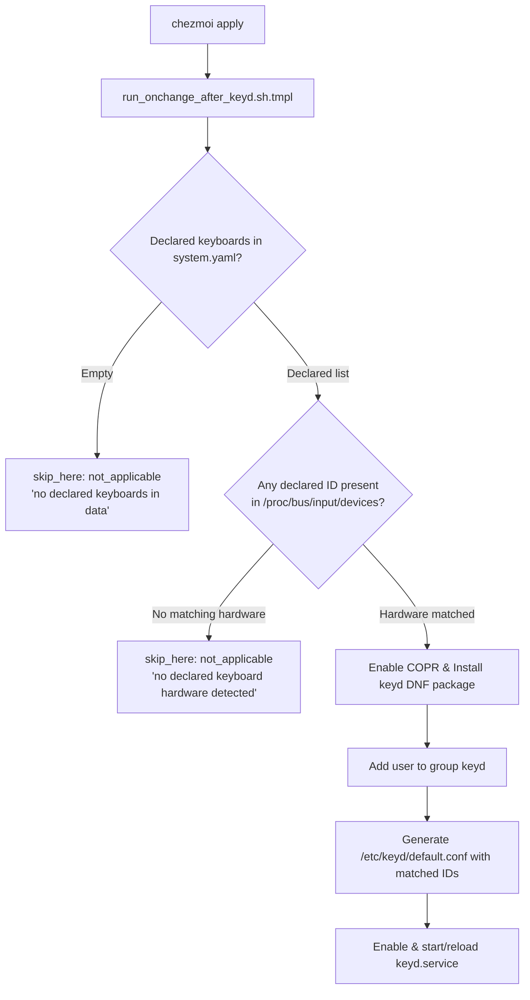

# Isolate keyd Setup and Gate on Declared Keyboard Hardware - Plan

## Goal Capsule

- **Objective:** keyd is decoupled from general OS and system provisioning so that hosts without declared keyboard hardware never install the keyd package, enable its service, or create its configuration.
- **Means:** extract keyd package installation, group creation, service enablement, and whitelist configuration into a dedicated onchange script gated on runtime detection of declared keyboard hardware IDs. (KTD1, KTD2)
- **Product Authority:** this requirements plan, the session-settled isolation decisions in Key Decisions, and the repository's single-source-of-truth conventions.
- **Open Blockers:** none.

---

## Product Contract

### Summary
Extract all keyd provisioning (COPR repository, package installation, user group, service activation, and configuration generation) into a dedicated script. Gate the entire keyd setup on whether any keyboard hardware ID declared in `.chezmoidata/system.yaml` is physically present on the target host at runtime. When no declared keyboard is detected, skip keyd provisioning entirely.

### Problem Frame
Currently, keyd is installed and enabled globally on all Fedora hosts via common packages and base provisioning scripts. Its configuration matches all devices (`[ids] *`) with only a negative exclusion for the Logi Bolt receiver. On machines without custom keyboard remapping needs or with different peripherals (like audio endpoints or mice that expose keyboard handlers), keyd is installed unnecessarily and intercepts devices by default.

### Key Decisions
- **Extract keyd into a dedicated provisioning script.** (session-settled: user-directed — chosen over keeping keyd in common package/installer scripts: isolates all package, group, service, and config operations into `.chezmoiscripts/30-linux/run_onchange_after_keyd.sh.tmpl`). Governs R1, R2, R3.
- **Gate keyd provisioning on declared hardware detection.** (session-settled: user-directed — chosen over unconditional installation: probe `/proc/bus/input/devices` and sysfs at runtime and skip all provisioning if no declared ID is present). Governs R4.
- **Declare keyboard hardware IDs in `.chezmoidata/system.yaml`.** (session-settled: user-directed — chosen over separate data file: keeps system hardware and /etc manifests consolidated). Governs R5.
- **Do not auto-inject host devices.** (session-settled: user-directed — chosen over auto-detecting current machine devices: only explicitly declared IDs in `system.yaml` are recognized). Governs R5, R6.
- **Common keymap applied to all declared keyboards.** (session-settled: user-directed — chosen over per-keyboard keymaps: all matching keyboards share uniform CapsLock to Hangeul and Meta layer mappings). Governs R6.

### Requirements

#### Provisioning Isolation
- R1. `alternateved/keyd` COPR repository and `keyd` package are removed from `.chezmoidata/packages.yaml` and general package provisioning.
- R2. `enable_unit keyd` and `groups=(keyd)` are removed from `.chezmoiscripts/20-linux-fedora/run_onchange_before_fedora.sh.tmpl`, and keyd configuration and reload logic are removed from `.chezmoiscripts/30-linux/run_onchange_after_install-system-10-files.sh.tmpl` and `system/linux/etc/keyd/default.conf`.
- R3. A dedicated script `.chezmoiscripts/30-linux/run_onchange_after_keyd.sh.tmpl` owns the complete lifecycle for keyd: COPR setup, package installation, user group assignment, `/etc/keyd/default.conf` generation, and service enablement/start.

#### Hardware-Gated Execution
- R4. The dedicated keyd script inspects declared keyboard hardware IDs at runtime (via `/proc/bus/input/devices` or sysfs). If no declared keyboard device is detected on the host, the script exits immediately with a clean skip declaration (`not_applicable`).
- R5. Keyboard hardware IDs (`vendor:product`) are declared under `system.linux.keyd.keyboards` (list of device items with `id` and optional `name`) in `.chezmoidata/system.yaml`. No default hardware IDs from the development machine are automatically injected.
- R6. When declared keyboard hardware is detected, the script generates `/etc/keyd/default.conf` containing only the declared IDs in `[ids]`, with the common keymap layers (`[control]` capslock=capslock, `[main]` capslock=hangeul, leftshift+leftmeta+f23=layer(meta)), and enables/reloads `keyd.service`.

#### Testing and Baselines
- R7. CI baseline checks (`.ci/test-fedora-fact-block-baseline.sh`) and template renders are updated to reflect the removal of keyd from base Fedora scripts and the addition of the isolated keyd provisioning script.

### Acceptance Examples
- AE1. Host with no declared keyboards or no matching hardware connected
  - **Given:** `.chezmoidata/system.yaml` has an empty keyboard list or none of the declared keyboards are plugged into the host.
  - **When:** `chezmoi apply` runs.
  - **Then:** `.chezmoiscripts/30-linux/run_onchange_after_keyd.sh.tmpl` exits with `not_applicable` ("no declared keyboard hardware detected"), no DNF COPR/package operations execute, no `keyd` group is added, and no `/etc/keyd/` files are written.

- AE2. Host with a declared keyboard hardware connected
  - **Given:** `.chezmoidata/system.yaml` declares a keyboard (e.g. `19f5:3275`) and that device is connected to the host.
  - **When:** `chezmoi apply` runs.
  - **Then:** The dedicated script enables the COPR repo if needed, installs `keyd` via DNF, adds the target user to group `keyd`, generates `/etc/keyd/default.conf` with `[ids] 19f5:3275`, and ensures `keyd.service` is active.

- AE3. Non-keyboard device with keyboard handler attached
  - **Given:** A USB microphone or mouse exposing a keyboard handler is plugged in.
  - **When:** `keyd` runs on a machine with a declared keyboard.
  - **Then:** `keyd` only captures the declared keyboard ID and leaves the microphone/mouse to native input handling.

### Scope Boundaries
- No auto-population of connected devices on the development machine.
- No per-keyboard custom keymap variations; all declared keyboards share the same layer definitions.
- No modifications to OpenLogi, Solaar, or mouse udev/libinput rules.

---

## Planning Contract

### Key Technical Decisions
- KTD1. **Consolidate all keyd lifecycle operations into `.chezmoiscripts/30-linux/run_onchange_after_keyd.sh.tmpl`.** Removes keyd from base packages, base service enablement, and base system file installation so keyd is completely decoupled from hosts that don't need it. Governs R1, R2, R3.
- KTD2. **Runtime hardware detection via `/proc/bus/input/devices` and sysfs.** The script extracts `Vendor=XXXX Product=YYYY` from `/proc/bus/input/devices` (or `/sys/class/input/event*/device/id/`) and compares them against the declared `vendor:product` hex IDs case-insensitively. Governs R4.
- KTD3. **Declarative schema under `system.linux.keyd.keyboards` in `.chezmoidata/system.yaml`.** Keyboards are declared as `{ id: "<vendor>:<product>", name: "<label>" }`. Governs R5.
- KTD4. **Change-gated configuration install and reload.** The script writes the rendered `/etc/keyd/default.conf` using `sudo install -D -m 0644` only when the file differs (`cmp -s`), and reloads or restarts `keyd.service` accordingly. Governs R6.
- KTD5. **Update `.ci/test-fedora-fact-block-baseline.sh` baseline hashes.** The baseline fixture verifies the exact rendered output of Fedora installer templates. Removing keyd from `run_onchange_before_fedora.sh.tmpl` and `run_onchange_after_install-system-10-files.sh.tmpl` changes their hashes and removes the old keyd assertions. Governs R7.

### High-Level Technical Design



### System-Wide Impact
- Eliminates unnecessary package installation and service creation on Fedora machines without custom keyboards.
- Prevents non-keyboard peripherals (Logi Bolt receiver, USB mics, etc.) from being grabbed by keyd.
- Retains single-source-of-truth declaration in `.chezmoidata/system.yaml`.

---

## Implementation Units

### U1. Decouple keyd from Base Fedora and System Provisioning

- **Goal:** Remove all keyd references from common packages, base Fedora provisioning, and common /etc system file deployment.
- **Requirements:** R1, R2
- **Dependencies:** none
- **Files:**
  - `.chezmoidata/packages.yaml`
  - `.chezmoiscripts/20-linux-fedora/run_onchange_before_fedora.sh.tmpl`
  - `.chezmoiscripts/30-linux/run_onchange_after_install-system-10-files.sh.tmpl`
  - `system/linux/etc/keyd/default.conf`
  - `system/README.md`
- **Approach:**
  1. In `.chezmoidata/packages.yaml`, remove `alternateved/keyd` from `coprs:` and `keyd` from `systemPackages:`.
  2. In `.chezmoiscripts/20-linux-fedora/run_onchange_before_fedora.sh.tmpl`, remove `enable_unit keyd`, `groups=(keyd)`, and `keyd` from the deferred activation notice.
  3. In `.chezmoiscripts/30-linux/run_onchange_after_install-system-10-files.sh.tmpl`, remove `keyd_changed` check and `keyd reload` section.
  4. Delete static `system/linux/etc/keyd/default.conf`.
  5. Update `system/README.md` table to reflect that keyd is now managed via dedicated script.
- **Test scenarios:**
  - `Test expectation: none -- static configuration removal and script trimming verified by render tests.`
- **Verification:**
  - Render `run_onchange_before_fedora.sh.tmpl` and `run_onchange_after_install-system-10-files.sh.tmpl` in scratch environment and confirm no `keyd` references remain.

### U2. Declare Keyboards in Data and Create Dedicated Provisioner

- **Goal:** Add `system.linux.keyd.keyboards` declaration in `system.yaml` and create `.chezmoiscripts/30-linux/run_onchange_after_keyd.sh.tmpl` with hardware probing, package installation, user group assignment, config generation, and service management.
- **Requirements:** R3, R4, R5, R6
- **Dependencies:** U1
- **Files:**
  - `.chezmoidata/system.yaml`
  - `.chezmoiscripts/30-linux/run_onchange_after_keyd.sh.tmpl`
- **Approach:**
  1. In `.chezmoidata/system.yaml`, add `system.linux.keyd.keyboards: []` with documented schema comments.
  2. Create `.chezmoiscripts/30-linux/run_onchange_after_keyd.sh.tmpl` using standard guards (`headless-guard`, `shared-host-guard`, `sudo-skip-guard`, `skip.sh.tmpl`).
  3. If `system.linux.keyd.keyboards` is empty or no declared keyboard is present on the system (probed via `/proc/bus/input/devices` or `/sys/class/input/event*/device/id/`), invoke `skip_here` with `not_applicable` and reason `"no declared keyboard hardware detected on this host"`.
  4. If a declared keyboard hardware is detected:
     - Check if `keyd` binary exists; if missing, enable `alternateved/keyd` COPR and install `keyd` via DNF.
     - Ensure user belongs to `keyd` group.
     - Generate `/etc/keyd/default.conf` containing `[ids]` with declared keyboard IDs, followed by `[control]` and `[main]` layers.
     - If config changed or service is inactive, reload/enable `keyd.service`.
- **Test scenarios:**
  - **Happy path (matching keyboard connected):** Script detects device ID, installs package, generates `/etc/keyd/default.conf`, and enables service. (AE2)
  - **Skip path (no matching keyboard):** Script detects no matching hardware and exits with `not_applicable` skip notice without installing packages or modifying system state. (AE1)
- **Verification:**
  - Render `.chezmoiscripts/30-linux/run_onchange_after_keyd.sh.tmpl` with empty and non-empty keyboard data in scratch environment.
  - Run `bash -n` on the rendered script.

### U3. Update CI Baseline Tests and Documentation

- **Goal:** Update CI fact block baseline test fixtures to match the updated template renders and add verification for `run_onchange_after_keyd.sh.tmpl`.
- **Requirements:** R7
- **Dependencies:** U1, U2
- **Files:**
  - `.ci/test-fedora-fact-block-baseline.sh`
- **Approach:**
  1. In `.ci/test-fedora-fact-block-baseline.sh`, update the baseline SHA-256 hashes for `run_onchange_before_fedora.sh.tmpl` and `run_onchange_after_install-system-10-files.sh.tmpl`.
  2. Remove obsolete `keyd` assertions from `run_onchange_before_fedora.sh` and `run_onchange_after_install-system-10-files.sh` test sections.
  3. Add assertions verifying `run_onchange_after_keyd.sh.tmpl` renders cleanly and passes `bash -n`.
- **Test scenarios:**
  - **CI baseline pass:** Running `.ci/test-fedora-fact-block-baseline.sh` passes with exit code 0.
- **Verification:**
  - Run `.ci/test-fedora-fact-block-baseline.sh` and confirm all checks succeed.

---

## Verification Contract

### Test Commands and Quality Gates
```bash
# 1. Verify Fedora fact block baseline and template renders
.ci/test-fedora-fact-block-baseline.sh

# 2. Verify template syntax in isolated scratch environment
scratch="$HOME/.cache/agent-scratch/chezmoi-op-stub"
mkdir -p "$scratch/bin" "$scratch/target"
: > "$scratch/empty.toml"
printf '#!/usr/bin/env bash\ncase "${1-}" in whoami) printf dummy@example.invalid;; *) printf dummy-secret;; esac\n' > "$scratch/bin/op"
chmod 700 "$scratch/bin/op"

for script in \
  .chezmoiscripts/20-linux-fedora/run_onchange_before_fedora.sh.tmpl \
  .chezmoiscripts/30-linux/run_onchange_after_install-system-10-files.sh.tmpl \
  .chezmoiscripts/30-linux/run_onchange_after_keyd.sh.tmpl; do
  env PATH="$scratch/bin:$PATH" chezmoi --config "$scratch/empty.toml" --source "$PWD" --destination "$scratch/target" execute-template < "$script" > "$scratch/rendered.sh"
  bash -n "$scratch/rendered.sh"
done

# 3. Clean diff check
git diff --check
```

---

## Definition of Done

- [ ] All `keyd` references removed from `packages.yaml`, `run_onchange_before_fedora.sh.tmpl`, `run_onchange_after_install-system-10-files.sh.tmpl`, and `system/linux/etc/keyd/default.conf`.
- [ ] `system.linux.keyd.keyboards` schema added in `.chezmoidata/system.yaml`.
- [ ] Dedicated script `.chezmoiscripts/30-linux/run_onchange_after_keyd.sh.tmpl` cleanly skips with `not_applicable` when no declared keyboard is present.
- [ ] When declared keyboard is present, the script handles package install, user group, whitelist config, and service reload.
- [ ] `.ci/test-fedora-fact-block-baseline.sh` passes with updated hashes.
- [ ] Template execution and `bash -n` checks pass on all changed scripts.
