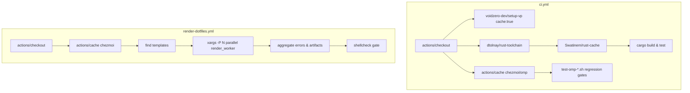

## Goal Capsule

- **Objective:** Reduce GitHub Actions CI workflow wall-clock duration across pull requests and main branch pushes while preserving all existing test, lint, and rendering quality gates.
- **Means:** Introduce Rust build artifact caching, parallelize sequential template execution loops in dotfiles workflows, and cache external tool binaries (KTD1, KTD2, KTD3).
- **Product authority:** CI pipeline performance and repository developer velocity.
- **Open blockers:** None.

---

## Product Contract

### Summary

Optimize `.github/workflows/ci.yml` and `.github/workflows/render-dotfiles.yml` by integrating Rust compilation caching via `Swatinem/rust-cache`, parallelizing the sequential template rendering loop in `render-dotfiles.yml` using isolated multi-worker processes, and caching downloaded tool binaries (chezmoi, omp) across jobs while maintaining unconditional execution of all quality gates on every run.

### Problem Frame

The repository runs comprehensive CI across Linux (Fedora container, Ubuntu runner) and macOS (`macos-26` runner) on every push and pull request.

Three major bottlenecks contribute to elevated wall-clock and runner minutes:
1. `crates/mxm4-haptic` builds from scratch in `ci.yml` on both `ubuntu-latest` and `macos-26` without cargo caching.
2. `render-dotfiles.yml` runs a sequential shell loop executing `chezmoi execute-template` individually across 50+ template files in `.chezmoiscripts` and `.chezmoiexternals`, dominating the duration of `render-internals` and `apply-macos`.
3. Standalone binaries (`chezmoi`, `omp`) are downloaded repeatedly over HTTP in multiple workflow steps without caching.

Addressing these bottlenecks directly shortens feedback cycles for contributors without reducing the rigor of any test suite.

### Key Decisions

- **KD1. Always-run quality gates over path-filtering:** Keep all CI workflow jobs active on every PR rather than conditionally skipping jobs based on changed file paths, ensuring status checks and required aggregators (`delivery`, `gate`) remain uniform. (session-settled: user-directed — chosen over Hybrid / Path-filtering: keep all quality gates and checks always running on every PR, optimizing execution speed via caching, binary caching, template loop parallelization, and container tuning without path-based job skipping) Governs R1, R2.
- **KD2. Layered Pipeline Acceleration:** Combine compilation caching, multi-process template rendering, and tool binary caching over job sharding or pure caching, maximizing wall-clock speedup while avoiding runner VM queue inflation. (session-settled: user-approved — chosen over Pure Caching and Job Sharding: Layered Pipeline Acceleration combining Rust compilation caching, multi-process template rendering loops, and tool binary caching to cut wall-clock time without increasing runner VM contention) Governs R3, R4, R5.
- **KD3. Process-isolated template execution:** Parallelize the `render-internals` and `apply-macos` template loops using process workers with independent per-worker temporary scratch directories to prevent output collision or race conditions. Governs R4.

### Requirements

#### Build & Tool Caching

- R1. The `rust-crate` job in `.github/workflows/ci.yml` must cache cargo registry, index, and target artifacts on both `ubuntu-latest` and `macos-26` runners using `Swatinem/rust-cache`.
- R2. Tool binary installation steps downloading locked `chezmoi` and `omp` releases across `.github/workflows/ci.yml` and `.github/workflows/render-dotfiles.yml` must cache binaries keyed by tool version or `.chezmoidata/releases.json` hash to prevent redundant network fetches.
- R3. Existing `setup-vp` cache configurations in `ci.yml` must remain active and preserved.

#### Template Rendering Parallelization

- R4. The template rendering loops in `.github/workflows/render-dotfiles.yml` (`render-internals` and `apply-macos`) must execute `chezmoi execute-template` in parallel across available CPU cores using worker-isolated scratch paths (`${RUNNER_TEMP}/worker-$$` or equivalent).
- R5. Parallel template execution must cleanly aggregate errors, recording all template render failures and setting non-zero exit codes if any template fails.

#### Quality Gate & Workflow Integrity

- R6. All existing quality checks, behavioral regression fixtures (`.ci/test-*.sh`), shellcheck linting, and aggregate jobs (`delivery` in `ci.yml`, `gate` in `render-dotfiles.yml`) must continue to run unconditionally on every push and pull request.
- R7. Job outputs, artifacts (`rendered-files-*`, `rendered-internals-*`, `shellcheck-report`), and step summaries must remain identical in structure and content to current workflow artifacts.

### Key Flows

- F1. Pull request CI execution:
  - **Trigger:** A pull request is opened or updated.
  - **Actors:** GitHub Actions runner fleet (Ubuntu, macOS, Fedora container).
  - **Steps:**
    1. Workflows `ci.yml` and `render-dotfiles.yml` start in parallel.
    2. `rust-crate` restores cached cargo dependencies and targets, compiling only changed crate modules.
    3. `render-internals` and `apply-macos` spawn parallel workers to render 50+ templates concurrently.
    4. Quality test scripts and shellcheck execute across all rendered outputs.
    5. Aggregate gates (`delivery`, `gate`) evaluate job success and report terminal status.
  - **Outcome:** Green CI delivered in roughly half the prior wall-clock duration with full test coverage.
  - **Covered by:** R1, R2, R4, R5, R6, R7.

### Acceptance Examples

- AE1. Rust compilation caching in CI:
  - **Covers:** R1
  - **Given:** A pull request that modifies a single file in `crates/mxm4-haptic` or unrelated repo files.
  - **When:** `ci.yml` runs the `rust-crate` matrix on `ubuntu-latest` and `macos-26`.
  - **Then:** `Swatinem/rust-cache` restores existing cargo build artifacts, avoiding full clean dependency rebuilds.

- AE2. Concurrent template rendering in dotfiles validation:
  - **Covers:** R4, R5, R7
  - **Given:** `.chezmoiscripts` and `.chezmoiexternals` containing 50+ template files.
  - **When:** `render-dotfiles.yml` runs `render-internals` on Fedora / Ubuntu arm64 or `apply-macos` on macOS.
  - **Then:** Templates are rendered concurrently across runner CPUs with isolated scratch configs, producing complete `rendered-internals-*` artifacts without race conditions.

- AE3. Unconditional quality gate enforcement:
  - **Covers:** R6
  - **Given:** A pull request containing only documentation or non-script changes.
  - **When:** CI runs.
  - **Then:** All jobs in `ci.yml` and `render-dotfiles.yml` execute and pass, resulting in `delivery` and `gate` reporting green status.

### Scope Boundaries

#### Deferred for later
- Path-based PR job filtering (skipping CI jobs on non-matching file changes).
- Docker image pre-building for the Fedora container environment.

#### Outside scope
- Self-hosted GitHub Actions runner infrastructure or runner fleet migration.
- Weakening, skipping, or removing any existing `.ci/test-*.sh` regression test or shellcheck lint rule.

---

## Planning Contract

### Key Technical Decisions

- **KTD1. Cargo Caching with `Swatinem/rust-cache@v2`:** Add `Swatinem/rust-cache@v2` with `workspaces: "crates/mxm4-haptic -> target"` to `.github/workflows/ci.yml` in the `rust-crate` matrix job. This automatically keys cache by Cargo.lock and OS matrix targets. Governs R1.
- **KTD2. Chezmoi & Tool Binary Caching with `actions/cache@v4`:** Wrap binary installation steps in `ci.yml` and `render-dotfiles.yml` with `actions/cache@v4` using cache paths (such as `~/.cache/chezmoi-bin` or `$RUNNER_TEMP/bin`) keyed on `.chezmoidata/releases.json` hash and platform. Governs R2.
- **KTD3. Thread-safe Worker Isolation for `xargs -P` in Template Rendering:** Implement parallel rendering in `render-internals` and `apply-macos` via `xargs -0 -P $(nproc 2>/dev/null || sysctl -n hw.ncpu 2>/dev/null || echo 4)`. Each worker invocation creates a sub-scratch directory (`${scratch}/worker-$$`) with its own `empty.toml` and target destination, avoiding concurrent write locks or stdout interleaving. Governs R4, R5.

### High-Level Technical Design

---

## Implementation Units

### U1. Rust compilation caching in `ci.yml`

- **Goal:** Enable cargo build and target caching in the `rust-crate` job across `ubuntu-latest` and `macos-26`.
- **Files:** `.github/workflows/ci.yml`
- **Requirements:** R1
- **Approach:**
  - In `jobs.rust-crate.steps`, insert `uses: Swatinem/rust-cache@v2` immediately after `uses: dtolnay/rust-toolchain@stable`.
  - Configure `workspaces: "crates/mxm4-haptic -> target"` and `cache-all-targets: "true"`.
- **Test Scenarios:**
  - Verify cargo build, cargo test, and cargo fmt execute smoothly.
- **Verification:**
  - Validate YAML schema with action lint / yaml checks.

### U2. Multi-process parallel template rendering in `render-dotfiles.yml`

- **Goal:** Parallelize the sequential template execution loop in `render-internals` and `apply-macos` to maximize CPU core utilization.
- **Files:** `.github/workflows/render-dotfiles.yml`
- **Requirements:** R4, R5, R7
- **Approach:**
  - In `render-internals` (Fedora container and Ubuntu arm64 runner) and `apply-macos` (macos-26 runner), refactor the `while IFS= read` loop.
  - Define a worker script / function that accepts a template file path, generates an isolated per-process scratch dir, executes `chezmoi execute-template`, and logs stderr to `.render-error.txt` on failure.
  - Dispatch using `find .chezmoiscripts .chezmoiexternals -type f -print0 | xargs -0 -P "$(( $(nproc 2>/dev/null || sysctl -n hw.ncpu 2>/dev/null || echo 4) * 2 ))" -n 1 bash -c ...`.
  - Maintain the total template count, failed count, error logging, and artifact staging unchanged.
- **Test Scenarios:**
  - Local simulation of parallel template execution on all templates in `.chezmoiscripts` and `.chezmoiexternals`.
  - Ensure zero template collisions and verify all rendered files match expected outputs.
- **Verification:**
  - Run template rendering across all templates locally in parallel and assert identical output.

### U3. Tool binary caching across CI workflows

- **Goal:** Cache downloaded `chezmoi` and `omp` binaries across steps in `ci.yml` and `render-dotfiles.yml`.
- **Files:** `.github/workflows/ci.yml`, `.github/workflows/render-dotfiles.yml`
- **Requirements:** R2, R3
- **Approach:**
  - Use `actions/cache@v4` on path `$RUNNER_TEMP/bin/chezmoi` (or `$RUNNER_TEMP/bin/omp`) keyed on `${{ runner.os }}-chezmoi-${{ hashFiles('.chezmoidata/releases.json') }}`.
  - If cache misses, execute download/verification and place into `$RUNNER_TEMP/bin`.
- **Test Scenarios:**
  - Verify download fallback works on cache miss.
  - Verify binary permissions and sha256 checksum validation remain intact.
- **Verification:**
  - Verify scripts and checksum logic in workflow steps.

---

## Verification Contract

| Test Suite / Command | Scope | Target Success Signal |
|---|---|---|
| `git diff --check` | Entire repo | Zero trailing whitespace or syntax errors |
| Local parallel template render test | `.chezmoiscripts/**`, `.chezmoiexternals/**` | 100% of templates render without errors |
| `packages/` workspace check | `packages/` | `vp check` / `vp run -r build` passes |
| `crates/mxm4-haptic` tests | `crates/mxm4-haptic` | `cargo check` / `cargo test` passes |

---

## Definition of Done

- [ ] `Swatinem/rust-cache@v2` added to `rust-crate` matrix in `.github/workflows/ci.yml`.
- [ ] Template rendering in `render-dotfiles.yml` parallelized with per-process worker isolation.
- [ ] Tool binary caching added with sha256 checksum verification intact.
- [ ] All existing regression tests, checks, and required gate aggregators (`delivery`, `gate`) preserved without degradation.
- [ ] Local tests and template executions pass cleanly.
