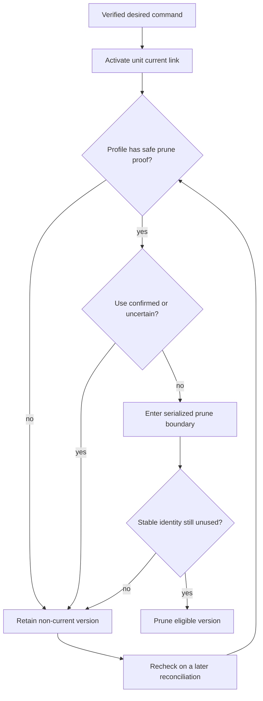
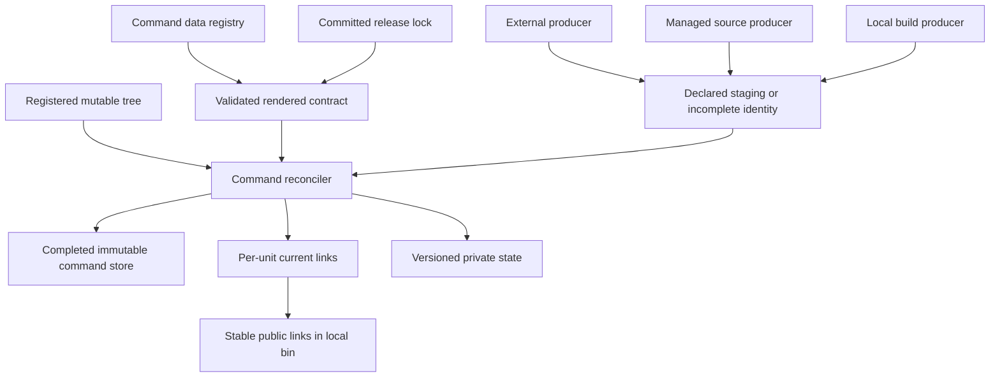
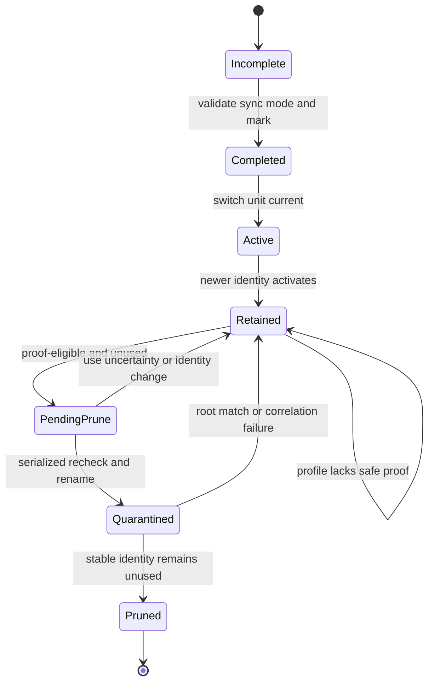
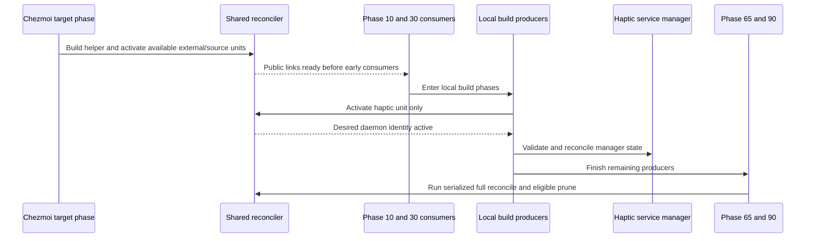
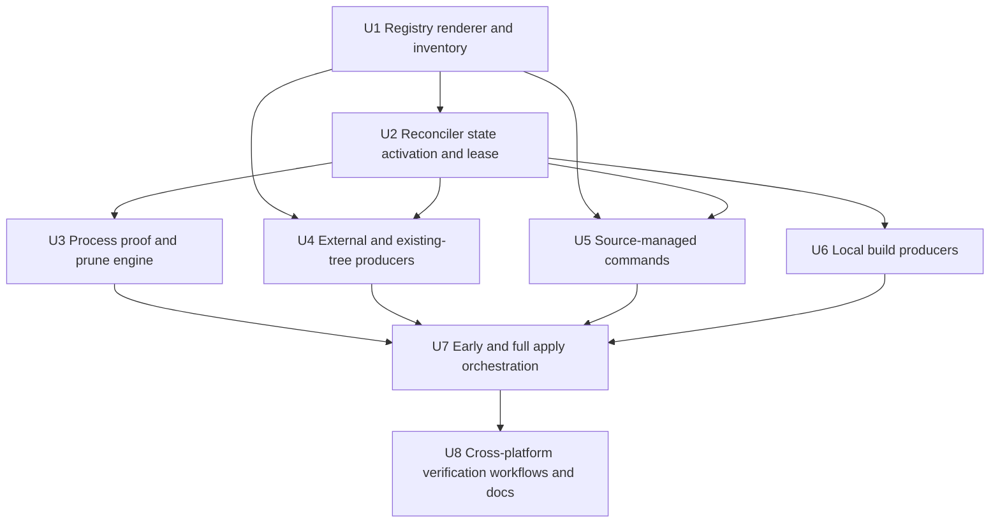

# Versioned Repo-Owned Command Installation - Plan

## Goal Capsule

- **Objective:** Updating managed commands must not remove the executable version used by a running process, and every repository-owned entry in `~/.local/bin` must be a symbolic link.
- **Means:** Use one declared command registry, stable public links, atomic per-unit activation, proof-classified pruning, and fail-closed retention. KTD1-KTD10 own this mechanism.
- **Product authority:** The Product Contract owns behavior and scope. The Planning Contract owns implementation choices within those constraints.
- **Execution profile:** Deep code refactor. Use isolated filesystem and process fixtures first. Never apply this plan to the live home during verification.
- **Stop conditions:** Stop the affected unit before activation when ownership is ambiguous or materialized bytes fail validation. When safe pruning cannot be established, retain the candidate, report the skipped prune, and keep an otherwise valid activation. Continue unrelated valid units per R23.
- **Tail ownership:** The implementing run owns code, fixtures, documentation, cleanup, and repository checks. Live deployment remains a separate user-authorized action.

---

## Product Contract

### Summary

Repository-managed commands will use version-addressed backing units and symbolic links in `~/.local/bin`.
One shared policy will install, activate, retain, and safely prune immutable-capable commands while registering required mutable vendor trees without breaking their normal writes.

### Problem Frame

The repository currently installs 24 single-binary externals and 13 source-managed scripts as regular files in `~/.local/bin`.
Three local build pipelines expose five distinct commands across platform gates: `figma-auth`, `settings-reconcile`, `mxm4-hapticd`, `mxm4-haptic`, and Linux-only `mxm4-haptic-notify`.
Codegraph, Flutter, and Kitty already use links to versioned locations, but each has a separate reconciler and prune rule.
Codegraph removes every non-current version, while Kitty keeps one previous generation without checking which exact backing unit a process uses.
This fragmented model cannot guarantee that an apply is safe for a live workstation or that every repository-owned command follows the same ownership rule.

### Key Decisions

- **All repository-owned commands share the invariant.** (session-settled: user-directed — chosen over external-only migration or directory-wide enforcement: cover every command this repository owns without touching foreign files.) Governs R1-R4, R19.
- **Protect the exact version used by a live process.** (session-settled: user-directed — chosen over retaining every version for an active tool or keeping a fixed rollback count: preserve only versions with a current reason to exist.) Governs R8-R12, R20-R21.
- **Use one manifest and reconciler.** (session-settled: user-directed — chosen over component-specific reconcilers and whole-generation snapshots: keep ownership, activation, and prune safety under one policy.) Governs R2, R6-R17, R19-R27.
- **Limit this unit to Linux and macOS.** (session-settled: user-directed — chosen over making full repository Windows removal part of this work: keep two independently useful outcomes separately plannable.) Governs R18.
- **Fail closed when use cannot be established.** (session-settled: user-approved — chosen over best-effort deletion: uncertain process state must not risk a live command.) Governs R11, R20-R21, R27.
- **Keep mutable vendor trees in the registry without forcing immutability.** (session-settled: user-approved — chosen over copying mutable SDK trees or excluding their public commands: preserve one link authority without breaking normal vendor writes.) Governs R26.

<!-- ce-section: work-relationships -->
### How This Work Fits Together

This plan owns versioned installation, link activation, and safe pruning for repository-managed commands on Linux and macOS.
The broader breakdown is the current understanding, not a committed roadmap:

- **Later area: remove repository-wide Windows support.** Can proceed independently of this plan. It shares the decision that no new versioned-command behavior is required for Windows.

### Requirements

**Ownership and command layout**

- R1. Every command that this repository exposes through `~/.local/bin` on Linux or macOS must participate in the shared ownership contract, including current externals, source-managed scripts, locally built binaries, and existing linked commands.
- R2. One declarative manifest must be the authority for each repository-owned command's producer, identity policy, exposed name, and lifecycle policy. It declares the desired backing version for deterministic units, while state records the runtime-created active generation for R24-R25 commands.
- R3. Every repository-owned `~/.local/bin` entry must be a symbolic link to a managed backing command outside that directory.
- R4. The reconciler must not replace, reject, or prune an entry that the repository does not own.
- R5. Each immutable-capable non-secret backing unit must use a deterministic identity bound to a digest of its materialized bytes, and an existing identity may be reused only after digest verification.

**Activation and failure safety**

- R6. A desired backing version must be complete and valid before its public link becomes active.
- R7. Link activation must be atomic from the command caller's perspective.
- R8. The backing version referenced by the active link must never be a prune candidate.
- R9. A backing version used by a live process must never be a prune candidate, even after a newer version becomes active.
- R10. A non-current backing version may be pruned only when no live process uses an executable from that prune unit.
- R11. If the reconciler cannot determine whether a candidate is in use, it must retain the candidate and surface the skipped prune without failing an otherwise valid activation.
- R12. When one backing unit exposes several commands, use of any contained executable must protect the whole unit from pruning.
- R13. A process started from an older backing version must continue to use that version after a newer link becomes active.



**Migration and convergence**

- R14. The first migration must replace each repository-owned regular command with its managed link without making the command unavailable between states.
- R15. A failed download, build, render, validation, or activation must preserve the last working link and backing version.
- R16. A successful unchanged reconciliation must not rewrite links, recreate backing versions, or rerun prune work with no candidates.
- R17. Released external artifacts must continue to use the committed release lock as their version, URL, and integrity authority, with no source-state network resolution.

**Platform boundary**

- R18. The shared versioned-command contract must operate on Linux and macOS only; Windows-specific cleanup belongs to the separate repository-wide Windows removal work.

**Ownership and race completeness**

- R19. An existing public entry may be migrated only when durable provenance proves repository ownership; otherwise the reconciler must leave it untouched and report an ownership conflict.
- R20. A live interpreted command, including a descendant that retains or re-executes its version, must protect its originating script backing unit from pruning.
- R21. Pruning must remain safe when use of a non-current backing unit begins between the final use check and deletion.

**Shared policy boundaries**

- R22. Onboarding a command producer may extend materialization behavior, but it must not add another repository ownership, activation, or shared immutable-store pruning path or change existing producers' behavior. R26 is the detailed exception for producer-owned mutable-tree maintenance and pruning.
- R23. A materialization or validation failure for one backing unit must leave that unit unchanged while reconciliation continues for unrelated valid units.

**Private rendered commands**

- R24. A command containing rendered secrets must never persist a digest derived from its rendered secret bytes.
- R25. Each changed secret-bearing output must create a private opaque immutable generation, while unchanged output may reuse the active generation through direct byte comparison.

**Mutable and prune-ineligible backing units**

- R26. A vendor-mutated version tree that exposes public commands must remain in the shared registry, while its producer retains tree mutation and pruning authority until it supplies the shared reconciler with safe proof.
- R27. Automatic pruning requires a profile with a stated proof that activation and deletion cannot break a running or concurrently starting command; every other non-current unit must remain retained.

### Key Flows

- F1. **Reconcile a desired version**
  - **Trigger:** Source state declares a command version that is not active.
  - **Steps:** Materialize and validate the immutable backing version, switch the owned unit-current link, then evaluate non-current versions against R8-R12.
  - **Outcome:** New command invocations use the desired version while protected old versions remain available.
  - **Covers:** R2, R5-R12, R15, R17.
- F2. **Update while an old process runs**
  - **Trigger:** A live process uses the old backing version when a new version becomes desired.
  - **Steps:** Activate the new unit-current link, identify that the old executable is live, and skip pruning its backing unit until a later reconciliation.
  - **Outcome:** The live process remains safe and new invocations use the new version.
  - **Covers:** R7-R10, R12-R13.
- F3. **Handle uncertain process state**
  - **Trigger:** Exact use detection is unavailable or fails for a prune candidate.
  - **Steps:** Keep the candidate, report the skipped prune, and preserve the valid active link.
  - **Outcome:** Uncertainty consumes storage but cannot break a live command.
  - **Covers:** R8-R11, R15.
- F4. **Migrate an existing regular command**
  - **Trigger:** Durable provenance identifies a repository-owned regular file at the public command path.
  - **Steps:** Create its immutable backing version and replace the proven-owned public file with a link.
  - **Outcome:** The command remains callable and the public path satisfies the symlink-only invariant.
  - **Covers:** R1-R7, R14-R16, R19.
- F5. **Protect prune-ineligible or late use**
  - **Trigger:** A non-current unit is interpreted, multi-file, vendor-mutated, or lacks stable use proof.
  - **Steps:** Classify the unit as retained unless its profile supplies proof that covers the whole unit and the serialized prune boundary confirms stable identity remains unused.
  - **Outcome:** A quiet snapshot alone never authorizes deletion of a unit whose live use cannot be proved.
  - **Covers:** R9-R12, R20-R21, R26-R27.
- F6. **Handle an ownership conflict**
  - **Trigger:** A public command entry exists without durable repository-ownership provenance.
  - **Steps:** Leave the entry untouched and report the conflict.
  - **Outcome:** Migration does not claim a foreign command.
  - **Covers:** R4, R19.
- F7. **Isolate a backing-unit failure**
  - **Trigger:** One backing unit fails materialization or validation while another valid unit has a pending change.
  - **Steps:** Preserve the failed unit's working state and continue reconciliation for the unrelated valid unit.
  - **Outcome:** One producer failure does not block unrelated command updates.
  - **Covers:** R15, R23.
- F8. **Materialize a private rendered command**
  - **Trigger:** A private staged command's rendered bytes differ from its active generation.
  - **Steps:** Compare bytes without hashing them, create a private opaque generation, validate its mode, and activate it through the shared lifecycle.
  - **Outcome:** Secret rotation produces an immutable version without persisting a secret-derived digest.
  - **Covers:** R15, R24-R25.
- F9. **Register a mutable vendor tree**
  - **Trigger:** A versioned vendor tree exposes one or more public commands and mutates during normal use.
  - **Steps:** Register its command links and active tree without copying, making read-only, or admitting it to shared pruning.
  - **Outcome:** Public links remain centrally owned while the vendor tree keeps its required write behavior.
  - **Covers:** R1-R3, R22, R26-R27.

### Acceptance Examples

- AE1. **Running `omp` survives an update.**
  - **Covers R7-R10, R12-R13.** Given `omp` version A is running, when version B becomes active, then new invocations resolve to B and A remains installed until no process uses it.
- AE2. **An unused old version is removed later.**
  - **Covers R8-R10, R27.** Given version B is active and version A belongs to a proof-eligible profile that has passed its stable unused proof, when reconciliation runs, then A is pruned and B remains unchanged.
- AE3. **Detection failure retains data.**
  - **Covers R11, R15.** Given an old version is a prune candidate and a new version was otherwise activated successfully, when exact use detection cannot complete, then the old version remains installed and the newly activated public link remains active.
- AE4. **Owned files migrate without claiming foreign files.**
  - **Covers R1-R4, R14, R19.** Given one regular command has durable repository provenance and another does not, when migration runs, then only the proven-owned command becomes a managed link and the ownership conflict is reported.
- AE5. **A shared backing unit remains whole.**
  - **Covers R10, R12.** Given one command from a multi-command backing unit is live, when pruning evaluates that unit, then no part of the unit is removed.
- AE6. **Unchanged apply converges cleanly.**
  - **Covers R16.** Given every desired version and link is already correct and no prune candidate exists, when reconciliation runs again, then it changes no target or backing version.
- AE7. **An interpreted command protects its script version.**
  - **Covers R9-R12, R20.** Given a source-managed script version is running through an interpreter or retained by a descendant, when a newer version becomes active, then the originating script backing unit remains installed.
- AE8. **A native process starts during eligible pruning.**
  - **Covers R9-R10, R21, R27.** Given a native single-file unit has stable identity proof, when use begins at the prune boundary, then the final identity check retains the unit needed by that process.
- AE9. **A reused identity has different bytes.**
  - **Covers R5, R15.** Given an existing non-secret backing identity has a different content digest from newly materialized output, when reconciliation runs, then it does not reuse or replace that backing version and preserves the working link.
- AE10. **A new producer keeps the shared lifecycle.**
  - **Covers R2, R22.** Given a new command producer needs different materialization behavior, when it joins the manifest, then ownership, activation, and pruning still use the existing shared paths and existing producers remain unchanged.
- AE11. **One failed unit does not block another.**
  - **Covers R15, R23.** Given one backing unit fails validation and an unrelated valid unit has a pending version, when reconciliation runs, then the failed unit keeps its working state and the valid unit becomes active.
- AE12. **A Wi-Fi secret rotates without a secret-derived hash.**
  - **Covers R15, R24-R25.** Given the private Wi-Fi command renders different secret bytes from unchanged source references, when reconciliation runs, then it creates and activates a private opaque generation without persisting a digest of those bytes.
- AE13. **A mutable SDK remains registered and writable.**
  - **Covers R1-R3, R22, R26-R27.** Given a versioned SDK mutates its own tree during normal use, when reconciliation runs, then its public commands remain registry-owned links and the shared reconciler neither copies, makes read-only, nor prunes that tree.

### Scope Boundaries

- Full removal of Windows branches, artifacts, CI coverage, facts, and documentation is deferred to separate work.
- User-owned and otherwise unmanaged `~/.local/bin` entries remain untouched, even when they are regular files.
- Externals that do not expose commands through `~/.local/bin`, such as fonts, skills, plugins, and application bundles, are outside this plan.
- Fixed-count rollback retention and manual version selection are outside this plan; only active-link status, confirmed live-process use, or inability to establish use protects an old version.
- Vendor self-update interfaces are not reconfigured. Immutable-capable units reject in-place mutation, while R26 preserves required writes in registered mutable trees.

### Dependencies / Assumptions

- Linux procfs can identify native executables and open roots for same-user processes.
- macOS process-root discovery can use the system `lsof` surface; probe failure classifies the candidate as uncertain.
- Interpreted-command ancestry and mutable multi-file use are not kernel guarantees, so KTD5 retains those units until a cooperative or stable proof exists.
- The committed release lock remains authoritative for released external artifacts.
- Retaining live or uncertain versions may increase local storage use; KTD6 governs low-space behavior without weakening retention safety.

### Sources / Research

- `STRATEGY.md:17-18,24-32,53-58` — data ownership, live-workstation safety, idempotency, and version-and-digest addressing.
- `.chezmoiexternals/ai-agents.toml`, `.chezmoiexternals/dev-tools.toml`, `.chezmoiexternals/k8s.toml`, `.chezmoiexternals/system.toml`, `.chezmoiexternals/vcs.toml` — current direct command externals.
- `dot_local/bin/` — current source-managed command targets.
- `.chezmoiscripts/60-build/` — current local build producers.
- `.chezmoiscripts/00-tools/run_onchange_after_codegraph.sh.tmpl`, `.chezmoiscripts/00-tools/run_onchange_after_flutter.sh.tmpl`, `.chezmoiscripts/00-tools/run_onchange_before_kitty.sh.tmpl` — existing version, link, and prune patterns.
- `packages/settings-reconcile/src/reconcile.ts` — path containment, no-follow reads, concurrent-change detection, staging, fsync, and atomic rename patterns.
- [POSIX `rename`](https://pubs.opengroup.org/onlinepubs/9799919799/functions/rename.html) — atomic same-directory public-link replacement.
- [POSIX `unlink`](https://pubs.opengroup.org/onlinepubs/9699919799/functions/unlink.html) — open-file lifetime after directory-entry removal.
- [Linux procfs](https://man7.org/linux/man-pages/man5/proc.5.html) and [`pidfd_open`](https://man7.org/linux/man-pages/man2/pidfd_open.2.html) — process executable, command-line, descriptor, and PID-stability constraints.
- [Nix garbage collection](https://nixos.org/guides/nix-pills/11-garbage-collector.html) — runtime roots and quarantine prior art.

---

## Planning Contract

**Product Contract preservation:** changed: the Problem Frame now distinguishes three build pipelines from their five platform-gated commands; R5 and R24-R25 add the repository-required no-hash path for rendered secrets; R26-R27 and AE13 preserve shared link ownership while exempting vendor-mutated trees from immutable storage and automatic pruning. The inventory correction, security constraint, and user-approved mutable-tree policy do not narrow public-command scope.

### Key Technical Decisions

- KTD1. **A data registry renders one closed command contract.** (session-settled: user-directed — chosen over component-specific reconcilers and whole-generation snapshots: one lifecycle policy must cover every repository-owned public command.) A new command data file declares producer class, safety profile, platform gate, backing unit, public commands, identity input, mode, privacy, mutable-tree status, and legacy evidence. A validator rejects unknown classes, duplicate public names, unsafe paths, undeclared release-lock tools, and Windows eligibility. Governs R1-R2, R17-R18, R22, R24-R27.
- KTD2. **Stable public links point through one atomic unit-current link.** Each public link points to a stable command path below its unit's `current` link. Activation creates a temporary `current` symlink beside the live link and replaces it with POSIX `rename`. One rename switches every command in a multi-command unit. Governs R3, R6-R8, R12-R14.
- KTD3. **Producers populate incomplete inputs; the reconciler alone completes immutable units.** External, source, and build producers write only declared staging or incomplete identity paths. The reconciler validates bytes, syncs metadata, applies final modes, and writes the completion marker before activation. A producer cannot touch public links, lifecycle state, or prune APIs. Registered mutable trees are referenced in place and never receive an immutable completion marker. Governs R5-R6, R15-R17, R22, R26.
- KTD4. **Mutation-time evidence proves current ownership.** A committed legacy owner is only a claim source. Migration also requires class-specific current evidence: a release or content digest, an exact prior managed symlink target, or direct no-hash byte comparison for private rendered content. Later repair requires the current node and target or bytes to match the last repository-authored state. State alone never authorizes reclaim. Governs R4, R14, R19, R24-R25.
- KTD5. **Prune eligibility follows proof strength, not quiet-scan count.** Linux procfs and macOS system `lsof` supply same-user runtime roots. Only a profile with a documented linearization argument may enter automatic pruning. Native single-file units qualify through stable file identity. Interpreted, multi-file, mutable, or adapter-ambiguous units remain retained unless a cooperative or equivalent whole-unit proof is added. Governs R9-R13, R20-R21, R26-R27. **Conflict note:** kernel process identity cannot prove every interpreted descendant without cooperation; the settled fail-closed decision makes indefinite retention authoritative when proof is incomplete.
- KTD6. **Eligible pruning uses stable identity inside one serialized boundary.** The reconciler records the candidate's device and inode plus original and quarantine path aliases, enters the store-wide lease, rechecks runtime roots, renames within the same store, and rechecks the same identity before deletion. A failed correlation, conflicting restore path, or changed identity restores or retains the unit. Disk pressure never changes eligibility. Governs R8-R11, R15-R16, R21, R23, R27.
- KTD7. **Secret-bearing commands use opaque private generations.** A private rendered command compares staged bytes directly with the active generation, creates a random opaque generation only when bytes change, never persists a digest of those bytes, and secures every parent and file to the existing private-command modes. Governs R15, R24-R25.
- KTD8. **The helper exposes two mutation operations with disjoint scope.** `activate-unit` validates and activates one already-materialized unit, performs no migration outside that unit, and never prunes. `reconcile-all` handles full migration, drift repair, reporting, and eligible pruning. Both require the same manifest contract and helper schema version. The haptic manager proceeds only after its scoped activation reports the desired daemon identity active. Governs R2, R6-R7, R15-R16, R22-R23.
- KTD9. **One versioned state API and store-wide lease own every mutation.** `packages/command-reconcile/src/state.ts` is the sole reader and writer of `~/.local/state/chezmoi-command-reconcile/state.json` under contract `command-reconcile/v1`. It records repository-authored public evidence, active identities, opaque generations, pending prune identities, quarantine aliases, and a monotonic revision. An exclusive lease serializes every completion, activation, state, quarantine, restore, and prune mutation. Unknown, corrupt, or newer state disables reclaim and prune while preserving active links. Startup scans quarantine and completion markers to recover interrupted work. Governs R4, R8-R11, R15-R16, R19, R21, R23.
- KTD10. **Activation runs before the earliest consumer, then full reconciliation runs after producers.** The phase-00 helper build precedes a phase-00 activation pass for available external and source commands, so phase-10 and phase-30 consumers see public links on first apply. Local builds activate at their required boundary; haptic uses KTD8 before manager mutation. Phase 65 performs the full pass before phase-90 source reconciliation. Governs R3, R6-R7, R14-R16, R23.

### High-Level Technical Design

**Authority and data flow**



**Backing-unit lifecycle**



**Apply and service ordering**



Every mutating arrow into the reconciler holds the same store-wide lease. Read-only inspection may run outside the lease, but it must revalidate state revision and candidate identity after acquiring it.

### Output Structure

```text
.chezmoidata/
  commands.yaml
.chezmoitemplates/
  command-manifest.tmpl
  command-manifest-validate.tmpl
packages/command-reconcile/
  package.json
  tsconfig.json
  vite.config.ts
  src/
    cli.ts
    lease.ts
    manifest.ts
    paths.ts
    process-linux.ts
    process-darwin.ts
    producer.ts
    prune.ts
    reconcile.ts
    state.ts
  test/
    lease.test.ts
    manifest.test.ts
    process.test.ts
    prune.test.ts
    reconcile.test.ts
    state.test.ts
.chezmoiscripts/00-tools/
  run_onchange_after_10-build-command-reconcile.sh.tmpl
  run_after_90-activate-command-links.sh.tmpl
.chezmoiscripts/65-commands/
  run_after_reconcile-commands.sh.tmpl
.ci/
  test-build-command-reconcile.sh
  test-command-manifest.sh
  test-command-reconcile-apply.sh
  test-command-reconcile-process.sh
```

### Alternative Approaches Considered

- **Extend `settings-reconcile`.** Rejected because TOML leaf ownership and executable lifecycle have different inputs, state, failure modes, and process-safety requirements. Reuse its filesystem patterns, not its package boundary.
- **Implement the reconciler in shell.** Rejected because cross-platform process snapshots, structured manifest validation, concurrent state updates, and race-safe path handling exceed a maintainable shell boundary.
- **Use native macOS `libproc` bindings.** Rejected for this plan because Apple treats the header as SPI. Use the system `lsof` surface and fail closed when it is absent or restricted.
- **Keep each current linker and prune loop.** Rejected by the settled single-authority decision. Producer-specific materialization remains, but lifecycle ownership moves to one reconciler.
- **Delete uncertain versions under a count or disk threshold.** Rejected because pressure cannot override active or uncertain retention. Disk pressure fails the affected materialization and preserves the working link.

### System-Wide Impact

- **Apply lifecycle:** Phase 00 activates available external and source commands before early consumers. Phase 65 performs full drift repair and eligible pruning after local builds.
- **PATH consumers:** Public command names remain unchanged. Existing scripts, services, and shells continue to invoke `~/.local/bin`.
- **Service startup:** The haptic daemon unit activates through the scoped helper operation before systemd or launchd validation and manager mutation.
- **Persistent state:** One versioned state file and one store-wide lease serialize ownership, activation, quarantine, and prune transitions. Unknown state disables destructive actions.
- **Secrets:** Private rendered staging and opaque generations remain owner-only. No secret-derived digest enters a path, state file, log, or report.
- **Containers:** The helper and early activation remain eligible where repository-owned external and source commands are eligible. Desktop-only and haptic rows stay data-gated.
- **Mutable trees:** Flutter-style vendor trees keep their producer-owned writes and are retained outside shared automatic pruning while their public links remain registry-owned.
- **Storage:** Active, uncertain, interpreted, multi-file, and mutable units may remain. Reports expose retained units and aggregate bytes without deleting them under pressure.
- **Release supply chain:** URLs, semantic versions, and published digests stay owned by `.chezmoidata/releases.json`; the new registry does not resolve releases.
- **Reversal:** The cutover is intentionally one-way. A source revert does not restore safe direct-file ownership; forward recovery uses state, completion markers, and registry evidence.

### Risk Analysis and Mitigation

| Risk | Consequence | Mitigation |
|---|---|---|
| Quiet scans are mistaken for proof | An interpreted or multi-file live unit can be deleted | Admit only proof-eligible native single-file profiles to automatic pruning; retain every ambiguous class |
| Producers and the reconciler both write final identities | Partial bytes can become trusted or immutable state can be overwritten | Producers write incomplete inputs; only the reconciler validates completion and activation |
| Concurrent scoped and full runs overlap | State, current links, quarantine, and restore decisions can diverge | Serialize every mutation under one store-wide lease and monotonic state revision |
| State is corrupt, newer, or lost | Ownership can be reclaimed incorrectly or prune observations can be misread | Fail closed, preserve active links, rediscover filesystem markers, and require explicit forward recovery |
| The initial cutover changes many command owners at once | A missing row or path can remove a command from PATH | Use the exact migration inventory, activate before earliest consumers, and exercise first apply in an isolated home |
| Current live content no longer matches prior ownership | A user replacement can be overwritten | Require mutation-time target or byte evidence in addition to registry and historical state |
| Haptic activation ordering drifts | Service validation can see an absent or stale daemon path | Use scoped activation before manager mutation and retain the existing first-apply fixtures |
| Quarantine identity cannot be correlated after rename | A late native process can be missed | Record device/inode and both path aliases; retain on mismatch, collision, or incomplete adapter evidence |
| Secret-bearing generations leak metadata | A path or state digest can reveal equality across secret values | Use opaque generation IDs and persist no rendered-byte digest |
| Mutable vendor trees are forced read-only | Normal SDK operation or self-update fails | Register by reference, keep producer mutation authority, and exclude from shared prune until safe proof exists |
| Retained versions exhaust free space | A new version cannot be staged safely | Remove proven-dead quarantine first, report retained bytes, fail the affected materialization before activation, and continue unrelated units |

### Sequencing



---

## Implementation Units

### U1. Declare and validate the command registry

- **Goal:** Establish one data authority, one rendered contract, and one exact migration inventory for every repository-owned public command.
- **Requirements:** R1-R2, R5, R17-R18, R22, R24-R27; KTD1, KTD3, KTD7.
- **Dependencies:** None.
- **Files:** `.chezmoidata/commands.yaml` (new), `.chezmoitemplates/command-manifest.tmpl` (new), `.chezmoitemplates/command-manifest-validate.tmpl` (new), `.ci/test-command-manifest.sh` (new).
- **Approach:**
  1. Declare closed producer classes, safety profiles, platform gates, unit identities, public names, modes, privacy, mutable-tree status, and class-specific legacy evidence.
  2. Render one canonical contract that resolves release versions from the existing lock and local identities from raw source fingerprints.
  3. Define the normalized producer handoff as an incomplete unit root, declared `bin/` entries, mode/privacy metadata, identity policy, and validation result.
  4. Prohibit producer strategies from public-link, lifecycle-state, completion-marker, or prune access.
  5. Maintain the Appendix migration inventory as the auditable one-to-one map from every old owner to its new producer and action.
- **Patterns to follow:** `.chezmoidata/system.yaml` plus its validator, `.chezmoitemplates/release-lock-ref.tmpl`, `.chezmoitemplates/fingerprint.tmpl`.
- **Test scenarios:**
  - Render Linux and macOS contracts from the same data and assert only eligible rows and public commands appear.
  - Add duplicate public names, parent traversal, an unknown producer or safety class, or Windows eligibility and assert render-time failure names the row.
  - Reference a missing release-lock tool or artifact and assert the existing fail-loud behavior remains authoritative.
  - Mark a rendered-secret row as content-digested or a mutable-tree row as immutable and assert validation fails before materialization. Covers AE12 and AE13.
  - Add a fixture producer with distinct materialization behavior and assert it uses the unchanged completion, activation, and lifecycle contract while an existing producer renders byte-identically. Covers AE10.
  - Compare the registry with the Appendix inventory and assert every current external, source, build, and existing-tree public command is claimed exactly once.
- **Verification:** The rendered contract is deterministic, secret-free, platform-correct, extension-safe, and complete for the confirmed inventory.

### U2. Build the serialized reconciliation core

- **Goal:** Create the standalone helper, versioned state API, exclusive lease, immutable completion boundary, and atomic activation path.
- **Requirements:** R2-R8, R12, R14-R16, R19, R22-R27; KTD2-KTD4, KTD7-KTD9.
- **Dependencies:** U1.
- **Files:** `packages/command-reconcile/package.json` (new), `packages/command-reconcile/tsconfig.json` (new), `packages/command-reconcile/vite.config.ts` (new), `packages/command-reconcile/src/cli.ts` (new), `packages/command-reconcile/src/lease.ts` (new), `packages/command-reconcile/src/manifest.ts` (new), `packages/command-reconcile/src/paths.ts` (new), `packages/command-reconcile/src/producer.ts` (new), `packages/command-reconcile/src/reconcile.ts` (new), `packages/command-reconcile/src/state.ts` (new), `packages/command-reconcile/test/lease.test.ts` (new), `packages/command-reconcile/test/manifest.test.ts` (new), `packages/command-reconcile/test/reconcile.test.ts` (new), `packages/command-reconcile/test/state.test.ts` (new), `.chezmoiscripts/00-tools/run_onchange_after_10-build-command-reconcile.sh.tmpl` (new), `.ci/test-build-command-reconcile.sh` (new).
- **Approach:**
  1. Follow the existing standalone Bun package shape without adding runtime dependencies.
  2. Validate producer handoffs, sync content and directories, apply final modes, and atomically create completion markers before activation.
  3. Install the helper under `~/.local/libexec`; do not expose it as another public command.
  4. Make `state.ts` the sole API for `~/.local/state/chezmoi-command-reconcile/state.json` under schema `command-reconcile/v1`.
  5. Record current repository-authored evidence, active identity, opaque generation, pending identity, quarantine aliases, and monotonic revision.
  6. Serialize every mutation under one store-wide lease. Unknown, corrupt, missing-after-migration, or newer state preserves public links and disables reclaim and prune.
  7. Expose the disjoint `activate-unit` and `reconcile-all` operations from KTD8.
- **Execution note:** Start with filesystem characterization tests around `packages/settings-reconcile/src/reconcile.ts`, then extend its no-follow, expected-content, fsync, and atomic-rename boundaries.
- **Patterns to follow:** `packages/settings-reconcile/src/reconcile.ts`, `packages/settings-reconcile/vite.config.ts`, `.chezmoiscripts/60-build/run_onchange_after_build-settings-reconcile.sh.tmpl`.
- **Test scenarios:**
  - Complete version A, create public links, activate B, and assert every public path remains a symlink while one unit-current rename switches all commands. Covers AE1 and AE5.
  - Reconcile unchanged state and assert no content, link, state revision, or completion marker changes. Covers AE6.
  - Present incomplete, digest-mismatched, wrong-mode, or concurrently changed producer output and assert no activation. Covers AE9.
  - Present a foreign regular file, foreign symlink, changed state-authored target, symlinked parent, or non-regular state file and assert no target is reclaimed. Covers AE4.
  - Change one private staged file and assert a new mode-0700 opaque generation activates without a persisted content digest. Covers AE12.
  - Run scoped and full operations concurrently and assert one lease serializes them without lost state or partial activation.
  - Interrupt state write, completion, activation, and quarantine-state transitions and assert startup recovery preserves active links and reconstructs safe state.
  - Load corrupt or newer-schema state and assert all destructive behavior fails closed.
- **Verification:** Package tests prove completion ownership, atomic unit activation, state versioning, lease contention, crash recovery, current ownership evidence, secret handling, and partial success.

### U3. Add proof-classified process roots and pruning

- **Goal:** Prune only native single-file units with a defensible linearization proof and retain every unit whose live use remains ambiguous.
- **Requirements:** R8-R13, R15-R16, R20-R21, R23, R26-R27; KTD5-KTD6, KTD9.
- **Dependencies:** U2.
- **Files:** `packages/command-reconcile/src/process-linux.ts` (new), `packages/command-reconcile/src/process-darwin.ts` (new), `packages/command-reconcile/src/prune.ts` (new), `packages/command-reconcile/test/process.test.ts` (new), `packages/command-reconcile/test/prune.test.ts` (new), `.ci/test-command-reconcile-process.sh` (new).
- **Approach:**
  1. Scan same-user executable, mapping, descriptor, and command-line roots on Linux through procfs.
  2. Parse null-delimited system `lsof` output on macOS and classify absence, denial, malformed records, or incomplete snapshots as uncertainty.
  3. Keep interpreted, multi-file, mutable, and adapter-ambiguous profiles in Retained unless a future cooperative whole-unit proof is declared.
  4. For native single-file candidates, record device/inode identity and original path before acquiring the lease.
  5. Revalidate state revision, device/inode, and live roots under the lease. Move only the same identity to same-store quarantine.
  6. Match post-rename roots against device/inode plus original and quarantine aliases. Restore or retain on any mismatch, collision, or incomplete correlation.
  7. Delete only proven-dead quarantine and report retained bytes without imposing a retention cap.
- **Execution note:** Use deterministic adapter fixtures first, then isolated real-process smokes on both supported operating systems.
- **Patterns to follow:** `.chezmoiscripts/00-tools/run_onchange_before_kitty.sh.tmpl` for live-generation motivation and `.chezmoiscripts/70-agents/run_onchange_after_zz-prune-agent-marketplace-archives.sh.tmpl` for symlink-safe directory iteration.
- **Test scenarios:**
  - Hold a native version-A process open, activate B, and assert A remains until exit and a later proof-eligible pass completes. Covers AE1 and AE2.
  - Run a shebang script or multi-file command and assert its non-current unit remains retained because the profile lacks whole-unit proof. Covers AE7.
  - Start a native process at the prune boundary, rename the candidate, and assert the post-rename adapter attributes the same device/inode before any deletion. Covers AE8.
  - Feed permission denial, disappearing PID, PID reuse, malformed command line, missing `lsof`, and partial descriptor snapshots and assert fail-closed retention. Covers AE3.
  - Mark one command in a multi-command unit live and assert the whole unit remains. Covers AE5.
  - Seed a mutable vendor tree and assert the shared prune engine never admits it. Covers AE13.
  - Seed dead quarantine plus protected retained units under low space and assert only proven-dead quarantine is deleted; the affected activation fails without blocking unrelated units. Covers AE11.
- **Verification:** Unit fixtures and Linux/macOS process smokes prove proof eligibility, stable identity across rename, uncertainty retention, lease serialization, quarantine recovery, and byte reporting.

### U4. Move external and existing-tree producers behind the registry

- **Goal:** Stage every release-backed command and register existing versioned trees without leaving any component-specific public-link owner.
- **Requirements:** R1-R8, R12-R18, R22, R26-R27; KTD1-KTD3, KTD5-KTD6.
- **Dependencies:** U1, U2.
- **Files:** `.chezmoiexternals/ai-agents.toml`, `.chezmoiexternals/dev-tools.toml`, `.chezmoiexternals/k8s.toml`, `.chezmoiexternals/system.toml`, `.chezmoiexternals/vcs.toml`, `.chezmoiscripts/00-tools/run_onchange_after_codegraph.sh.tmpl` (remove), `.chezmoiscripts/00-tools/run_onchange_after_flutter.sh.tmpl`, `.chezmoiscripts/00-tools/run_onchange_before_kitty.sh.tmpl`, `.ci/test-command-external-render.sh` (new), `.ci/test-package-ownership.sh`.
- **Approach:**
  1. Retarget each direct file or archive-file external to its registry-declared incomplete identity while preserving URL, asset, checksum, mode, musl, and platform behavior.
  2. Let the reconciler exclusively validate and mark immutable external identities complete before activation.
  3. Register Codegraph and Kitty as immutable-capable existing-tree producers after removing their public-link and prune loops.
  4. Register Flutter as a mutable tree by reference. Preserve its current installer, version directory, and required writes. Remove only public-link ownership; do not copy, chmod, or admit it to shared pruning.
  5. Delete the Codegraph script only after a focused assertion proves it contains lifecycle glue only and the external remains its materializer.
  6. Keep all shared workflow edits for U8.
- **Execution note:** Prove rendered URLs, checksums, target paths, and completion boundaries before process smokes.
- **Patterns to follow:** `.chezmoitemplates/release-lock-ref.tmpl`, current grouped external comments, and the Appendix migration inventory.
- **Test scenarios:**
  - Render every external group on Linux amd64, Linux arm64, Linux musl, macOS amd64, and macOS arm64 and assert release URLs and digests are unchanged while direct public targets disappear.
  - Interrupt one external materialization and assert no completion marker or current-link activation trusts partial bytes.
  - Render Codegraph and Kitty producers and assert their component scripts contain no public-link or prune operation.
  - Render Flutter and assert its public links are registry-owned while the producer tree remains writable and outside shared prune. Covers AE13.
  - Update one locked version in a fixture and assert the previous completed identity remains available for proof-classified retention.
  - Run package-ownership coverage and assert no external command is duplicated by mise or native packages.
- **Verification:** Cross-platform renders and extraction fixtures prove supply-chain parity, explicit incomplete/completed boundaries, mutable-tree compatibility, and one public lifecycle owner.

### U5. Relocate source-managed commands and activate early consumers

- **Goal:** Move source-managed commands out of direct PATH targets while preserving first-apply availability, template behavior, platform gates, modes, and private-secret boundaries.
- **Requirements:** R1-R7, R14-R16, R18-R19, R22, R24-R25; KTD1-KTD4, KTD7, KTD10.
- **Dependencies:** U1, U2.
- **Files:** The 13 exact source moves listed in the Appendix, `dot_local/share/chezmoi/command-sources/` (new), `.chezmoiignore`, `.chezmoidata/networking.yaml`, `.chezmoidata/packages.yaml`, `.chezmoiscripts/10-auth/run_onchange_after_auth-tokscale.sh.tmpl`, `.chezmoiscripts/30-linux/run_onchange_after_import-wifi-1password.sh.tmpl`, `.chezmoiscripts/30-linux/run_onchange_after_luks-tpm2.sh.tmpl`, `.ci/test-dotfiles-skips.sh`, `.ci/test-git-prune-local-branches.sh`, `.ci/test-chezmoiignore-script-paths.sh`.
- **Approach:**
  1. Move source targets to a non-PATH staging tree while retaining source attributes, private modes, template inputs, and OS gates.
  2. Declare mutation-time legacy evidence for each former direct target as listed in the Appendix.
  3. Activate all available external and source units in phase 00 before any phase-10 or phase-30 consumer runs.
  4. Keep every runtime caller on the unchanged public name. Update only fingerprint source paths, source-layout comments, and tests.
  5. Route private Wi-Fi output through KTD7 and keep staging, generation, state, and logs owner-only.
  6. Keep shared workflow edits for U8 and preserve historical plan artifacts.
- **Execution note:** Render private commands with the stub-`op` recipe. Never print, snapshot, or hash rendered Wi-Fi secrets.
- **Patterns to follow:** Root source-attribute rules, `.chezmoitemplates/fingerprint.tmpl`, and the current private Wi-Fi mode and render boundary.
- **Test scenarios:**
  - Start from an empty home and exercise phase-10 `tokscale` plus phase-30 Wi-Fi and LUKS consumers at their real order; assert public links exist before invocation.
  - Render every moved command on each eligible OS and assert staged content and modes match prior output while direct public target state is absent.
  - Render ineligible Linux, macOS, container, desktop, and headless variants and assert existing gates remain equivalent.
  - Run source-level tests for `dotfiles-skips` and branch pruning against exact new source paths.
  - Change only a Wi-Fi secret fixture and assert a new opaque private generation activates without a hash or secret in paths, state, or logs. Covers AE12.
  - Seed a same-name file whose bytes do not match committed legacy evidence and assert early activation reports a conflict and preserves it. Covers AE4.
- **Verification:** First-apply ordering, rendered-target comparison, mode checks, gate tests, and command fixtures prove behavior parity and early symlink availability.

### U6. Convert local build producers and preserve haptic ordering

- **Goal:** Stage every locally built public command for shared completion and keep haptic service activation transactional.
- **Requirements:** R1-R8, R12, R14-R16, R22-R23; KTD2-KTD3, KTD8-KTD10.
- **Dependencies:** U1, U2.
- **Files:** `.chezmoiscripts/60-build/run_onchange_after_build-figma-auth.sh.tmpl`, `.chezmoiscripts/60-build/run_onchange_after_build-settings-reconcile.sh.tmpl`, `.chezmoiscripts/60-build/run_after_build-mxm4-haptic.sh.tmpl`, `.ci/test-build-figma-auth.sh`, `.ci/test-build-settings-reconcile.sh`, `.ci/test-mxm4-haptic-provision.sh`, `.ci/test-mxm4-haptic-gates.sh`, `.ci/test-mxm4-haptic-chezmoi-retry.sh`, `.ci/skip-declaration-site-matrix.yaml`, `dot_config/systemd/user/mxm4-hapticd.service.tmpl`, `dot_config/systemd/user/mxm4-haptic-notify.service.tmpl`, `Library/LaunchAgents/dev.h82.mxm4-hapticd.plist`.
- **Approach:**
  1. Keep each producer's existing input fingerprint, toolchain resolution, build, staging, and artifact validation.
  2. Write validated output into an incomplete unit root instead of replacing public files. Let the shared helper complete and activate it.
  3. Treat `mxm4-hapticd`, `mxm4-haptic`, and Linux-only `mxm4-haptic-notify` as one platform-gated backing unit.
  4. Invoke `activate-unit` for haptic before service-definition validation and manager mutation. Require the result to name the desired daemon identity active.
  5. Let phase 65 activate other local builds before phase-70 consumers and perform the later full pass.
  6. Update fixtures that currently require direct regular files so they require incomplete input, completed backing, and public symlinks.
- **Execution note:** Preserve the haptic fixture's first-apply and every-apply transaction boundaries before simplifying builder code.
- **Patterns to follow:** Current haptic staging and validation order, existing build skip declarations, and KTD8's scoped result contract.
- **Test scenarios:**
  - Build each producer from an empty home and assert incomplete output is completed by the helper before public activation.
  - Inject dependency, build, missing-output, helper-schema, completion, and activation failures and assert the last working unit remains.
  - Run haptic on Linux and macOS fixtures and assert the daemon identity is active before service validation and manager mutation.
  - Run scoped haptic activation concurrently with a full pass and assert the shared lease serializes both.
  - Change one haptic component fingerprint and assert selective rebuild behavior remains while all public links resolve through one unit-current link.
  - Repeat an unchanged haptic apply and assert manager drift repairs without rebuilding or replacing backing units.
- **Verification:** Existing producer fixtures, updated for incomplete/completed boundaries, prove build semantics, helper compatibility, service ordering, contention, and failure isolation.

### U7. Orchestrate early activation, migration, and the full pass

- **Goal:** Activate available commands before their earliest consumer, then run one serialized full migration, drift-repair, reporting, recovery, and eligible-prune pass.
- **Requirements:** R1-R27; KTD1-KTD10.
- **Dependencies:** U3-U6.
- **Files:** `.chezmoiscripts/00-tools/run_after_90-activate-command-links.sh.tmpl` (new), `.chezmoiscripts/65-commands/run_after_reconcile-commands.sh.tmpl` (new), `.ci/test-command-reconcile-apply.sh` (new), `.ci/test-fingerprint-gates.sh`, `.ci/test-capability-cache.sh`, `.ci/test-skip-declaration-gates.sh`, `.ci/skip-declaration-site-matrix.yaml`.
- **Approach:**
  1. Run `activate-unit` across available external and source rows in late phase 00. Perform no global prune.
  2. Let local builders use scoped activation only where a same-phase consumer requires it.
  3. Run `reconcile-all` in phase 65 before phase-70 and phase-90 consumers.
  4. Reclaim only entries whose current mutation-time evidence matches. Record conflicts without touching foreign state.
  5. Continue unrelated valid units after per-unit failures and report completed, activated, unchanged, retained, conflicted, failed, quarantined, recovered, and pruned units.
  6. Retry live drift, lease recovery, quarantine recovery, and pending eligible prune state on every apply.
  7. Keep row eligibility in the registry instead of duplicating host gates in either runner.
- **Producer-to-consumer ordering:**

  | Earliest consumer | Required activation |
  |---|---|
  | Phase 10 auth and token setup | All eligible external auth tools and `tokscale` in late phase 00 |
  | Phase 30 Wi-Fi and LUKS setup | Private Wi-Fi and LUKS commands in late phase 00 |
  | Phase 60 haptic manager work | Haptic unit through scoped activation inside its builder |
  | Phase 70 agent configuration | Local-build command units through phase 65 |
  | Phase 90 garden reconciliation | `aoe` and `garden` already active from phase 00; phase 65 repairs drift |

- **Execution note:** Use an isolated HOME and stubbed producers. No fixture may target the live store.
- **Patterns to follow:** The haptic every-apply repair model, marketplace archive prune isolation, and shared skip declarations.
- **Test scenarios:**
  - Start from an empty home and execute each early consumer at its real phase; assert its public command resolves before invocation.
  - Start from current regular files, existing links, and build outputs; run migration while concurrent probes invoke one single-command and one multi-command unit. Assert every observation sees a complete old or new executable and never `ENOENT` or a mixed unit. Covers AE4.
  - Add fault points before and after public replacement and assert the last working public entry remains callable.
  - Seed foreign siblings, same-name mismatches, and symlinked parents and assert foreign state remains byte-identical.
  - Inject one invalid unit among valid updates and assert partial success plus final status follows R23. Covers AE11.
  - Run a second unchanged pass and assert no target or state mutation except an eligible pending-prune transition.
  - Seed orphan completion markers, stale lease metadata, corrupt state, and quarantine not recorded in state and assert forward recovery preserves active links.
  - Exercise active, uncertain, prune-ineligible, pending, quarantined, and dead versions and assert only proof-eligible dead units are deleted. Covers AE1-AE3, AE8, and AE13.
- **Verification:** The isolated apply fixture proves first-apply order, atomic migration, current ownership, partial success, recovery, row gates, and end-to-end proof-classified pruning.

### U8. Wire cross-platform CI and reconcile documentation

- **Goal:** Make the new ownership model independently verifiable and remove stale direct-install, ordering, and prune-owner assumptions.
- **Requirements:** R1-R27; KTD1-KTD10.
- **Dependencies:** U7.
- **Files:** `.github/workflows/ci.yml`, `.github/workflows/render-dotfiles.yml`, `.ci/test-command-manifest.sh`, `.ci/test-build-command-reconcile.sh`, `.ci/test-command-reconcile-apply.sh`, `.ci/test-command-reconcile-process.sh`, `.ci/test-package-ownership.sh`, `.ci/test-chezmoiignore-script-paths.sh`, `AGENTS.md`, `README.md`, `.chezmoidata/networking.yaml`, `.chezmoidata/packages.yaml`.
- **Approach:**
  1. Become the sole owner of shared workflow edits requested by U1, U4, and U5.
  2. Run package build, typecheck, tests, and checks through the existing TypeScript workspace job.
  3. Add a focused Linux/macOS process fixture with native, interpreted, multi-command, stable-identity, lease-contention, and recovery cases.
  4. Render all templates and externals for both supported operating systems with the existing empty-config and stub-secret harness.
  5. Update ownership, source-layout, apply-phase, state, reversal, and versioned-install documentation. Preserve historical artifacts.
  6. Sweep active code, tests, comments, and workflow assertions for stale regular-file and component-prune assumptions.
- **Patterns to follow:** Existing `ci.yml` focused fixtures, `render-dotfiles.yml` internal render artifacts, and the root verification recipe.
- **Test scenarios:**
  - Ubuntu and macOS jobs each run native-process, process-start identity, uncertainty, lease, and quarantine-recovery scenarios.
  - Rendered Linux and macOS target trees contain no repo-owned regular file under `~/.local/bin`; unmanaged regular canaries remain untouched.
  - Existing OMP completion, haptic, auth, Wi-Fi, LUKS, garden, and command-specific tests resolve commands through public links at their real phases.
  - A source reference sweep returns no active documentation or test that expects a migrated public command to be a regular file.
  - CI does not fetch release metadata at render time and does not resolve or hash real secrets.
- **Verification:** Both repository workflows reach terminal success, rendered artifacts show the intended staging/completion/link topology, and active documentation matches final owner boundaries.

---

## Verification Contract

| ID | Scope | Evidence | Applies to |
|---|---|---|---|
| V1 | TypeScript package | From `packages/`, run the recursive build, typecheck, test, and `vp check` workflow used by the existing TypeScript CI job; state, lease, completion, recovery, and operation-mode tests must pass | U2-U3 |
| V2 | Registry and template render | Run `.ci/test-command-manifest.sh` and render the registry, grouped externals, helper build, early activation, and phase-65 runner for Linux and macOS with the stub-`op` empty-config harness | U1, U4-U7 |
| V3 | Isolated first apply | Run `.ci/test-command-reconcile-apply.sh` against a scratch HOME with current regular files, existing links, foreign canaries, and mixed producers; concurrent public-path probes must observe only complete old or new units during migration | U2, U4-U7 |
| V4 | Real process safety | Run `.ci/test-command-reconcile-process.sh` on Ubuntu and macOS with native stable-identity, process-start, permission, uncertainty, prune-ineligible, mutable-tree, and quarantine-correlation cases | U3, U7 |
| V5 | Existing regressions | Run the updated build-settings, build-figma, haptic provision/gates/retry, package ownership, chezmoiignore path, dotfiles-skips, branch-prune, OMP completion, Wi-Fi, and LUKS fixtures | U4-U8 |
| V6 | Rendered target comparison | Use `chezmoi archive --exclude=encrypted,externals,scripts` for file targets, render scripts and externals separately, and compare Linux/macOS output with pre-change behavior outside the declared command topology | U4-U8 |
| V7 | Repository quality | Run `git diff --check`, inspect `git status`, and review a diff limited to the requested scope | All units |
| V8 | Release validation | Not applicable unless implementation changes `packages/release-lock` or generated `.chezmoidata/releases.json`; if it does, run the package validation path and regenerate the lock rather than editing it | U1, U4 |
| V9 | Inventory and recovery | Compare registry rows with the Appendix inventory, then run interrupted completion, stale lease, corrupt/newer state, orphan quarantine, and one-way migration recovery fixtures | U1-U2, U7-U8 |

The smoke boundary is a throwaway HOME and store. No verification step runs `chezmoi apply` against the user's live home, restarts live services, or prunes live command versions.

---

## Definition of Done

- All R1-R27 behavior is implemented and every F1-F9 path has test or fixture coverage.
- All AE1-AE13 examples are enforced by a named unit scenario and verification row.
- Every Appendix command is represented exactly once in the registry and every repository-owned Linux/macOS public entry appears as a symlink in rendered or scratch-applied state.
- Every producer writes only its declared incomplete or mutable input; only the reconciler completes immutable units and owns public links, state, and eligible pruning.
- Active, uncertain, interpreted, multi-file, mutable, and identity-ambiguous units survive; only proof-eligible native single-file units are automatically pruned.
- State schema, monotonic revision, store-wide lease, completion markers, quarantine aliases, and startup recovery pass interruption and concurrency fixtures.
- Private rendered commands persist no digest derived from secret bytes and retain owner-only modes through staging, backing, state, and logs.
- Existing release URLs, checksums, platform selection, command names, service paths, and runtime behavior remain unchanged outside the declared ownership topology.
- Every command used before phase 65 is activated before its earliest consumer on a clean home.
- One failed or conflicted unit does not block unrelated valid units, and every failure preserves the last working public link.
- Early activation and the phase-65 pass converge on unchanged later runs and retry live-state drift safely.
- V1-V7 and V9 pass locally or in the named CI environment. V8 runs only when its applicability condition is met.
- `AGENTS.md`, `README.md`, data headers, template comments, workflow assertions, and active tests describe final layout, state, reversal, and owner boundaries.
- No obsolete component linker, eligible prune loop, direct `dot_local/bin` target, abandoned experiment, temporary migration shim, or stale active fixture remains in the diff.
- Product Contract preservation is visible, all stable IDs remain intact, and no launch-blocking open question remains.

---

## Appendix

### Migration Inventory

This table is the audit baseline for U1, U4, U5, and U6. Public names are exact. Historical plans are not migration inputs.

| Class | Unit | Public command(s) | Legacy owner | Gate / mode | New action |
|---|---|---|---|---|---|
| External | `agent-browser` | `agent-browser` | `.chezmoiexternals/ai-agents.toml` `[agent-browser]` | Linux/macOS, 0755 | Stage locked file; shared completion and links |
| External | `omp` | `omp` | `.chezmoiexternals/ai-agents.toml` `[omp]` | Linux/macOS, 0755 | Stage locked file; shared completion and links |
| External | `aoe` | `aoe` | `.chezmoiexternals/ai-agents.toml` `[aoe]` | Linux/macOS, 0755 | Stage archive-file output; shared completion and links |
| External | `ast-grep` | `ast-grep` | `.chezmoiexternals/dev-tools.toml` `[ast-grep]` | Linux/macOS, 0755 | Stage archive-file output; shared completion and links |
| External | `sg` | `sg` | `.chezmoiexternals/dev-tools.toml` `[sg]` | Linux/macOS, 0755 | Stage archive-file output; shared completion and links |
| External | `buf` | `buf` | `.chezmoiexternals/dev-tools.toml` `[buf]` | Linux/macOS, 0755 | Stage archive-file output; shared completion and links |
| External | `protoc-gen-buf-breaking` | `protoc-gen-buf-breaking` | `.chezmoiexternals/dev-tools.toml` matching stanza | Linux/macOS, 0755 | Stage archive-file output; shared completion and links |
| External | `protoc-gen-buf-lint` | `protoc-gen-buf-lint` | `.chezmoiexternals/dev-tools.toml` matching stanza | Linux/macOS, 0755 | Stage archive-file output; shared completion and links |
| External | `marksman` | `marksman` | `.chezmoiexternals/dev-tools.toml` `[marksman]` | Linux/macOS, 0755 | Stage locked file; shared completion and links |
| External | `shellcheck` | `shellcheck` | `.chezmoiexternals/dev-tools.toml` `[shellcheck]` | Linux/macOS, 0755 | Stage archive-file output; shared completion and links |
| External | `wasm-pack` | `wasm-pack` | `.chezmoiexternals/dev-tools.toml` `[wasm-pack]` | Linux/macOS, 0755 | Stage archive-file output; shared completion and links |
| External | `rust-analyzer` | `rust-analyzer` | `.chezmoiexternals/dev-tools.toml` `[rust-analyzer]` | Linux/macOS, 0755 | Stage decompressed file; shared completion and links |
| External | `uv` | `uv` | `.chezmoiexternals/dev-tools.toml` `[uv]` | Linux/macOS, 0755 | Stage archive-file output; shared completion and links |
| External | `uvx` | `uvx` | `.chezmoiexternals/dev-tools.toml` `[uvx]` | Linux/macOS, 0755 | Stage archive-file output; shared completion and links |
| External | `kubectl` | `kubectl` | `.chezmoiexternals/k8s.toml` `[kubectl]` | Linux/macOS, 0755 | Stage locked file; shared completion and links |
| External | `kubectl-convert` | `kubectl-convert` | `.chezmoiexternals/k8s.toml` matching stanza | Linux/macOS, 0755 | Stage locked file; shared completion and links |
| External | `helm` | `helm` | `.chezmoiexternals/k8s.toml` `[helm]` | Linux/macOS, 0755 | Stage archive-file output; shared completion and links |
| External | `minikube` | `minikube` | `.chezmoiexternals/k8s.toml` `[minikube]` | Linux/macOS, 0755 | Stage archive-file output; shared completion and links |
| External | `docker-credential-secretservice` | `docker-credential-secretservice` | `.chezmoiexternals/system.toml` matching stanza | Linux, 0755 | Stage locked file; shared completion and links |
| External | `docker-credential-osxkeychain` | `docker-credential-osxkeychain` | `.chezmoiexternals/system.toml` matching stanza | macOS, 0755 | Stage locked file; shared completion and links |
| External | `wakatime-cli` | `wakatime-cli` | `.chezmoiexternals/system.toml` `[wakatime-cli]` | Linux/macOS, 0755 | Stage archive-file output; shared completion and links |
| External | `gh` | `gh` | `.chezmoiexternals/vcs.toml` `[gh]` | Linux/macOS, 0755 | Stage archive-file output; early shared activation |
| External | `glab` | `glab` | `.chezmoiexternals/vcs.toml` `[glab]` | Linux/macOS, 0755 | Stage archive-file output; early shared activation |
| External | `garden` | `garden` | `.chezmoiexternals/vcs.toml` `[garden]` | Linux/macOS, 0755 | Stage archive-file output; early shared activation |
| Source | `auth-glab` | `auth-glab` | `dot_local/bin/executable_auth-glab` | Linux/macOS, 0755 | Move source to command staging; early activation |
| Source | `code` | `code` | `dot_local/bin/executable_code` | Linux/macOS, 0755 | Move source to command staging; early activation |
| Source | `docker-credential-dockerhub` | `docker-credential-dockerhub` | `dot_local/bin/executable_docker-credential-dockerhub` | Linux/macOS, 0755 | Move source to command staging; early activation |
| Source | `dotfiles-skips` | `dotfiles-skips` | `dot_local/bin/executable_dotfiles-skips` | Linux/macOS, 0755 | Move source to command staging; early activation |
| Source | `encryption-status` | `encryption-status` | `dot_local/bin/executable_encryption-status` | macOS, 0755 | Move source to command staging; early activation |
| Source | `git-prune-local-branches` | `git-prune-local-branches` | `dot_local/bin/executable_git-prune-local-branches` | Linux/macOS, 0755 | Move source to command staging; early activation |
| Source | `host-facts` | `host-facts` | `dot_local/bin/executable_host-facts.tmpl` | Linux, 0755 | Move template to command staging; early activation |
| Source | `kde-color-picker` | `kde-color-picker` | `dot_local/bin/executable_kde-color-picker` | KDE Linux, 0755 | Move source to command staging; early activation |
| Source | `setup-luks-tpm2-unlock` | `setup-luks-tpm2-unlock.sh` | `dot_local/bin/executable_setup-luks-tpm2-unlock.sh.tmpl` | Linux, 0755 | Move template to command staging; early activation |
| Source | `src-audit` | `src-audit` | `dot_local/bin/executable_src-audit` | Linux/macOS, 0755 | Move source to command staging; early activation |
| Source | `import-wifi-linux` | `import-wifi-1password` | `dot_local/bin/private_executable_import-wifi-1password.tmpl` | Linux, 0700 private | Move template; opaque private generations; early activation |
| Source | `import-wifi-macos` | `import-wifi-1password-macos.sh` | `dot_local/bin/private_executable_import-wifi-1password-macos.sh.tmpl` | macOS, 0700 private | Move template; opaque private generations; early activation |
| Source | `tokscale` | `tokscale` | `dot_local/bin/private_executable_tokscale.tmpl` | Linux/macOS, 0700 | Move template to private staging; early activation |
| Build | `figma-auth` | `figma-auth` | `.chezmoiscripts/60-build/run_onchange_after_build-figma-auth.sh.tmpl` | Eligible POSIX hosts, 0755 | Stage build output; phase-65 completion and activation |
| Build | `settings-reconcile` | `settings-reconcile` | `.chezmoiscripts/60-build/run_onchange_after_build-settings-reconcile.sh.tmpl` | Eligible POSIX hosts, 0755 | Stage build output; phase-65 completion and activation |
| Build | `mxm4-haptic` | `mxm4-hapticd`, `mxm4-haptic`, `mxm4-haptic-notify` | `.chezmoiscripts/60-build/run_after_build-mxm4-haptic.sh.tmpl` | Linux has 3; macOS has 2; 0755 | Stage one unit; scoped activation before manager |
| Existing tree | `codegraph` | `codegraph` | Codegraph external plus `run_onchange_after_codegraph.sh.tmpl` | Linux/macOS, 0755 | Preserve materializer; delete lifecycle-only script; register immutable tree |
| Existing tree | `flutter` | `flutter`, `dart` | `run_onchange_after_flutter.sh.tmpl` | Eligible Linux/macOS, vendor-writable | Preserve mutable materializer; register links; no shared prune |
| Existing tree | `kitty` | `kitty`, `kitten` | `run_onchange_before_kitty.sh.tmpl` | Eligible desktop Linux/macOS, 0755 | Preserve materializer; strip links/prune; register retained multi-file tree |
