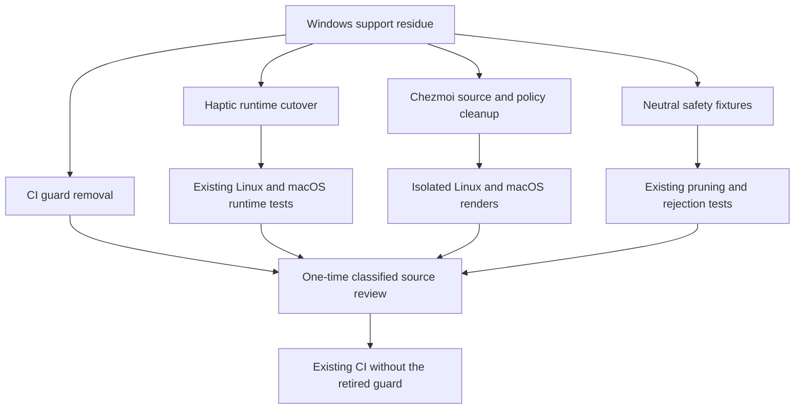

# Windows Platform Support Purge - Plan

## Goal Capsule

- **Objective:** Make the active repository support contract Linux/macOS-only without weakening retained cross-platform tools or platform-neutral safety behavior.
- **Means:** Collapse haptic IPC to the existing POSIX transport, remove Windows-only source paths, and retain generic defenses through neutral fixtures (KTD1-KTD7).
- **Product authority:** This plan owns Windows platform support residue outside pre-existing `docs/**` files. It does not own historical documentation, PowerShell, WinBox, or unavoidable transitive dependency metadata.
- **Open blockers:** None.
- **Execution profile:** Source-tree and CI changes (`execution: code`).

---

## Product Contract

### Summary

Reduce the active repository to a Linux/macOS support contract. Remove Windows-only runtime paths, configuration, direct dependencies, tests, guards, and non-doc prose while preserving the agreed exceptions and platform-neutral safety behavior.

### Problem Frame

Windows is no longer a managed host target, but the current tree still carries active Windows support in haptic IPC, chezmoi gates, host-specific source fragments, package policy, tests, and CI. These paths add platform-specific knowledge to a repository whose strategy centers on declarative, rebuild-grade Linux/macOS host state.

A literal keyword purge would remove unrelated or necessary content. PowerShell is managed on Fedora/macOS, WinBox is MikroTik management software, surviving dependencies can carry Windows-target metadata in generated lock files, and several Windows-shaped tests protect platform-neutral behavior. The purge therefore follows the support contract rather than product names or raw strings.

### Key Decisions

- **Use a semantic Linux/macOS support boundary, not a zero-string target.** (session-settled: user-approved — chosen over a literal zero-reference purge: the retained tools and transitive metadata are not Windows host support.) Governs R1, R4-R8.
- **Leave pre-existing `docs/**` files unchanged.** (session-settled: user-directed — chosen over deleting or rewriting historical documentation: documentation was excluded from the requested cleanup.) Governs R14.
- **Preserve PowerShell and WinBox.** (session-settled: user-directed — chosen over name-based deletion: PowerShell serves Fedora/macOS and WinBox is unrelated MikroTik management software.) Governs R6, R7.
- **Preserve unavoidable transitive lock metadata.** (session-settled: user-directed — chosen over removing upstream dependencies that publish Windows-target packages: surviving Linux/macOS dependencies remain authoritative.) Governs R8.
- **Generalize defensive behavior instead of deleting it or retaining Windows fixtures.** (session-settled: user-directed — chosen over both keeping explicit Windows-shaped defenses and removing the defenses: retired-platform cleanup, unsupported-OS rejection, path normalization, and CRLF handling remain useful.) Governs R9, R10.
- **Use one-time review instead of an automatic reintroduction guard.** (session-settled: user-directed — chosen over a new or retained CI guard: completion is established by the purge review and existing changed-contract checks.) Governs R12.

**Product Contract preservation:** unchanged.

### Requirements

**Active support contract**

- R1. All managed behavior outside existing `docs/**` files must treat Linux and macOS as the only supported host operating systems.
- R2. The haptic daemon and client packages must remove Windows runtime transport, Windows-only build features, direct Win32 dependencies, Windows-only tests, and package-local Windows support documentation while preserving Linux/macOS behavior.
- R3. Chezmoi source must remove Windows host gates and Windows-specific Git, SSH, and GPG fragments, including every include or selector that makes those fragments reachable.
- R4. Direct package policy and configuration entries whose only purpose is Windows host support must be removed from managed source.
- R5. Comments, messages, examples, package-local READMEs, and other non-`docs/**` prose must stop describing Windows support, parity, setup, or retired Windows counterparts.

**Preserved capabilities**

- R6. Fedora/macOS PowerShell installation and the non-Windows configuration required for that tool must remain supported.
- R7. WinBox installation and management for macOS must remain supported; only unrelated Windows comparison prose may change.
- R8. Generated lock files may retain Windows-target transitive metadata only when a surviving Linux/macOS dependency requires it; directly managed Windows-only policy is not covered by this exception.

**Generalized safety**

- R9. Retired-platform cleanup and unsupported-OS rejection must preserve their observable behavior while replacing Windows-specific fixtures and wording with platform-neutral cases.
- R10. Backslash path normalization and CRLF acceptance must remain as platform-neutral input handling, without rationale tied to retired Windows hooks.
- R11. Windows-only file-ignore patterns must be removed; platform-neutral ignore rules must remain unchanged.
- R12. The current Windows-reference CI guard, its dedicated tests, and its workflow integration must be removed without a replacement automatic guard.

**Cutover boundaries**

- R13. Every caller, include, selector, test, and comment that depends on removed Windows support must migrate in the same cutover; no compatibility shim or dormant alias may remain.
- R14. No `docs/**` file that predates this unified plan may be edited or deleted by the implementation.

### Acceptance Examples

- AE1. **Covers R2.** Given the haptic daemon and client on Linux or macOS, when they exchange a command after the purge, then they use the existing POSIX transport and preserve current command behavior without carrying a Windows transport branch.
- AE2. **Covers R3, R13.** Given a chezmoi render for a supported host, when Git, SSH, and GPG configuration is assembled, then no Windows fragment or Windows host selector participates and no include points to a removed source file.
- AE3. **Covers R9, R10.** Given a retired platform key, unsupported host value, backslash-separated input, or CRLF input, when the generalized defenses process it, then cleanup, rejection, normalization, and parsing retain their current outcomes without a Windows-specific fixture or explanation.
- AE4. **Covers R6-R8.** Given the completed purge, when the retained tool and dependency inventory is reviewed, then Fedora/macOS PowerShell, macOS WinBox, and required transitive lock metadata remain while no direct Windows host support is restored through those exceptions.
- AE5. **Covers R11, R12.** Given the completed source cleanup, when repository ignore and CI configuration is reviewed, then Windows-only ignore patterns and the Windows-reference guard are absent while unrelated rules and workflow checks remain.
- AE6. **Covers R14.** Given historical Windows references in pre-existing `docs/**` files, when the implementation diff is reviewed, then those files have no changes.

### Success Criteria

- All direct Windows host runtime, build, configuration, source-fragment, and test paths outside existing `docs/**` files are removed.
- Every remaining Windows-adjacent reference outside existing `docs/**` files is attributable to retained PowerShell, retained WinBox, or required generated transitive metadata.
- Linux/macOS haptic, chezmoi render, PowerShell, WinBox, retired-platform cleanup, unsupported-OS rejection, path normalization, and CRLF behavior remain intact.
- Existing changed-contract checks pass without a Windows-specific reintroduction guard.
- No pre-existing `docs/**` file appears in the implementation diff.

### Scope Boundaries

- Pre-existing `docs/**` content remains historical source material and is not normalized to the new active support contract. This unified plan is the only document this work creates and may be enriched in place by planning.
- PowerShell remains a supported Fedora/macOS tool. Its name and required configuration are not Windows residue.
- WinBox remains supported on macOS as MikroTik management software.
- Generated lock-file entries for Windows-target packages remain when they are transitive requirements of surviving Linux/macOS dependencies.
- Git history is not rewritten. The purge applies to the current source tree only.
- No new automatic Windows-reference CI guard is added.

### Dependencies / Assumptions

- Windows remains a retired host target for this repository.
- Surviving cross-platform dependencies can publish platform-specific packages for operating systems this repository does not support.
- Pre-existing `docs/**` files may continue to describe historical Windows work without implying active support.

### Sources / Research

- `STRATEGY.md` defines declarative, rebuild-grade host state and low duplicate knowledge as repository goals.
- `crates/mxm4-haptic/Cargo.toml`, `crates/mxm4-haptic/src/lib.rs`, `crates/mxm4-haptic/src/bin/mxm4-hapticd.rs`, and `packages/mxm4-haptic/src/index.ts` contain current Windows runtime support.
- `dot_config/.chezmoiignore`, `dot_ssh/.config_windows`, `dot_config/git/.config_windows`, and `private_dot_gnupg/.gpg-agent.windows.conf` contain current Windows host configuration.
- `packages/release-lock/test/lock.test.ts`, `packages/release-lock/test/cli.test.ts`, `packages/figma-auth/test/oauth.test.ts`, and `.chezmoitemplates/facts.tmpl` contain Windows-shaped examples for behavior that must become platform-neutral.
- `.ci/check-windows-references.sh`, `.ci/test-windows-references-gates.sh`, and `.github/workflows/render-dotfiles.yml` contain the automatic guard selected for removal.
- `docs/plans/2026-08-06-003-refactor-windows-release-lock-purge-plan.md` records the earlier purge and its explicit exclusions.

---

## Planning Contract

### Key Technical Decisions

- KTD1. **Collapse both haptic clients and the daemon onto the existing POSIX IPC contract.** Remove the Rust and TypeScript named-pipe branches together and add no replacement transport abstraction. This keeps the cross-language endpoint contract byte-for-byte aligned for Linux/macOS. Governs R1, R2, R13 and covers AE1.
- KTD2. **Keep dynamic OS fragment selection and delete only the retired fragments.** Linux and macOS continue to select their existing sibling files. Any unsupported OS fails closed because its sibling is absent. Governs R3, R13 and covers AE2.
- KTD3. **Generalize test data without changing the production defenses.** Use one noncanonical retired platform key for release-lock pruning and one unsupported POSIX identifier for browser-launch rejection. Preserve the current path normalization, CRLF tolerance, pruning, and rejection logic. Governs R9, R10 and covers AE3.
- KTD4. **Retire the complete temporary TypeScript cooldown exclusion block, not selected platform entries.** Bun resolves every optional native package before it applies the cooldown gate, so a partial list can break Linux/macOS installation. Remove the block only when the normal install proves that the pinned release has cleared the one-week policy. Governs R4, R8 and covers AE4.
- KTD5. **Regenerate lock metadata through its owning package manager.** Remove direct Windows dependencies from manifests, then accept only lock changes produced by the normal install or build flow. Preserve surviving transitive target packages and never hand-edit a lock file. Governs R2, R8 and covers AE4.
- KTD6. **Remove the CI guard as one atomic workflow cutover.** Delete both guard scripts, their workflow steps, and the remaining reference comment together. Preserve the workflow's timeout, concurrency, and aggregate dependency boundaries. Governs R12, R13 and covers AE5.
- KTD7. **Use a one-time classified source inventory instead of a committed allowlist.** Review each remaining Windows-adjacent match against the Product Contract exceptions, then keep no scanner, allowlist, or replacement CI gate in the repository. Governs R5-R8, R11, R12, R14 and covers AE4-AE6.

### High-Level Technical Design

The four change tracks converge on existing runtime, render, unit-test, and workflow contracts. The one-time review then classifies surviving references as retained PowerShell, retained WinBox, or required transitive metadata before the ordinary CI workflows run.

### Assumptions

- The temporary TypeScript release-age exclusion is ready for retirement. If the normal package install still rejects the pinned release, implementation stops rather than retaining a partial platform list or weakening the one-week policy.
- Missing dynamic include fragments are the intended fail-closed result on an unsupported host OS.
- Linux/macOS runtime behavior is authoritative. This work does not migrate Windows state or preserve a dormant Windows execution path.

### Implementation Constraints

- Edit the chezmoi source state only. Do not deploy or apply changes to the live home directory.
- Preserve the source-of-truth boundaries in `.chezmoidata`, shared templates, generated locks, and package manifests.
- Keep exact dependency pins and the one-week package cooldown policy unchanged.
- Do not edit any pre-existing `docs/**` file. This unified plan is the only document that planning may modify.

### System-Wide Impact

- **Haptic runtime:** Rust daemon/client and TypeScript plugin clients share one POSIX socket path after the cutover.
- **Host rendering:** Linux and macOS Git, SSH, GPG, package, and external templates keep their current rendered behavior. Unsupported OSes fail closed.
- **Dependency policy:** Direct Windows dependencies and temporary platform policy disappear. Surviving optional target packages may remain in generated locks.
- **CI:** Existing build, test, render, and merge gates remain. Only the dedicated Windows-reference guard disappears.
- **Documentation:** Package-local READMEs and source comments match the active support contract. Pre-existing `docs/**` files remain historical and unchanged.

### Risks and Mitigations

- **Over-broad source cleanup could remove PowerShell or WinBox.** Treat their active Fedora/macOS manifests and scripts as named exceptions during the one-time review.
- **A partial TypeScript cooldown list could break package installation.** Remove the complete temporary exclusion block and verify the standard install before accepting the change.
- **Deleting an OS fragment could break a supported render.** Render the dynamic Git, SSH, and GPG includes for Linux and macOS after deletion.
- **Hand-cleaning generated locks could discard required optional packages.** Regenerate through Cargo or Bun and classify surviving target metadata per KTD5.
- **Workflow surgery could remove shared safety bounds.** Limit the CI edit to the two guard steps and preserve job timeout, concurrency, and dependency configuration.

---

## Implementation Units

### U1. Collapse the Rust haptic runtime to POSIX

- **Goal:** Remove the Rust daemon and client Windows runtime while preserving the current Linux/macOS socket and HID behavior.
- **Requirements:** R1, R2, R8, R13; AE1, AE4.
- **Dependencies:** None.
- **Files:** `crates/mxm4-haptic/Cargo.toml`, `crates/mxm4-haptic/Cargo.lock`, `crates/mxm4-haptic/src/lib.rs`, `crates/mxm4-haptic/src/bin/mxm4-hapticd.rs`, `crates/mxm4-haptic/src/bin/mxm4-haptic-notify.rs`.
- **Approach:**
  1. Remove the direct Win32 dependency set and the Windows HID feature from the manifest.
  2. Delete the named-pipe endpoint, Windows client, Windows server module, and Windows-only test from the Rust library.
  3. Make the existing Unix socket client and server the single runtime path, per KTD1.
  4. Regenerate `Cargo.lock` through Cargo and retain any surviving transitive target metadata, per KTD5.
  5. Update package metadata and crate documentation comments to Linux/macOS.
- **Patterns to follow:** Existing Unix socket path resolution, stale-socket cleanup, mode `0600` binding, and waveform command parsing in `crates/mxm4-haptic/src/lib.rs`.
- **Test scenarios:**
  - Covers AE1. With `XDG_RUNTIME_DIR` set, the Rust client and server resolve the same socket and exchange a waveform command.
  - With only `TMPDIR` set on macOS-shaped input, socket resolution keeps the existing fallback behavior.
  - With no daemon socket, the client returns the existing missing-socket error.
  - Cargo resolves the crate without a direct Windows target dependency and preserves required transitive lock entries only.
- **Verification:** The Rust crate builds and its full unit suite passes on the current supported host. The manifest and generated lock contain no direct Windows runtime dependency.

### U2. Collapse the TypeScript haptic client to POSIX

- **Goal:** Keep the OMP plugin client aligned with the Rust POSIX endpoint and remove dead platform skips.
- **Requirements:** R1, R2, R5, R13; AE1.
- **Dependencies:** U1.
- **Files:** `packages/mxm4-haptic/src/index.ts`, `packages/mxm4-haptic/test/send-command.test.ts`, `packages/mxm4-haptic/test/omp-plugin.test.ts`, `packages/mxm4-haptic/test/drift-guard.test.ts`, `packages/mxm4-haptic/README.md`.
- **Approach:**
  1. Remove the named-pipe constant and platform branch from socket resolution.
  2. Keep the existing runtime-directory fallback and socket error mapping unchanged.
  3. Convert platform-skipped suites to ordinary suites.
  4. Update package-local transport and support prose.
- **Patterns to follow:** The Rust/TypeScript endpoint parity comments and drift guard in `packages/mxm4-haptic/test/drift-guard.test.ts`.
- **Test scenarios:**
  - Covers AE1. `sendCommand` connects through the POSIX runtime-directory hierarchy and flushes the waveform payload.
  - Missing and refused sockets retain their existing typed errors.
  - The bundled OMP plugin remains isolated and imports the TypeScript client without unresolved native dependencies.
  - The endpoint and waveform drift guards remain aligned with the Rust crate.
- **Verification:** The mxm4-haptic workspace tests, typecheck, and build pass without platform skips or a named-pipe branch.

### U3. Remove Windows host fragments and dead template branches

- **Goal:** Make chezmoi source selection Linux/macOS-only and remove Windows-derived helper variables.
- **Requirements:** R1, R3, R4, R5, R13; AE2.
- **Dependencies:** None.
- **Files:** `dot_ssh/.config_windows`, `dot_ssh/config.tmpl`, `dot_config/git/.config_windows`, `dot_config/git/config.tmpl`, `private_dot_gnupg/.gpg-agent.windows.conf`, `private_dot_gnupg/gpg-agent.conf.tmpl`, `dot_config/.chezmoiignore`, `.chezmoi.toml.tmpl`, `.chezmoiexternals/ai-agents.toml`, `.chezmoiexternals/dev-tools.toml`, `.chezmoiexternals/k8s.toml`, `.chezmoiexternals/system.toml`, `.chezmoiexternals/vcs.toml`.
- **Approach:**
  1. Delete the three retired OS fragments and the Windows-only tmux/zsh ignore block.
  2. Keep the dynamic include pattern for supported sibling fragments, per KTD2.
  3. Remove constant extension variables and collapse their callers to the Linux/macOS value.
  4. Remove stale platform rationale from nearby comments.
- **Execution note:** This unit is template and configuration work. Prove it with isolated renders before broader test suites.
- **Patterns to follow:** Existing `.config_linux`, `.config_darwin`, `.gpg-agent.linux.conf`, and `.gpg-agent.darwin.conf` sibling ownership.
- **Test scenarios:**
  - Covers AE2. Linux renders select the existing Linux Git, SSH, and GPG fragments after the retired fragments are deleted.
  - Covers AE2. macOS renders select the existing Darwin Git, SSH, and GPG fragments after the retired fragments are deleted.
  - The root chezmoi config renders the same supported-host hook paths after constant extension helpers are removed.
  - Grouped external templates render valid Linux/macOS artifact declarations with no dead extension interpolation.
- **Verification:** Scratch renders succeed for Linux and macOS with `--source \"$PWD\"`. No supported-host render references a deleted fragment.

### U4. Generalize defensive fixtures and dependency policy

- **Goal:** Preserve platform-neutral safety behavior while removing Windows-specific examples, ignores, and direct package policy.
- **Requirements:** R4, R8-R11; AE3-AE5.
- **Dependencies:** None.
- **Files:** `packages/release-lock/test/lock.test.ts`, `packages/release-lock/test/cli.test.ts`, `packages/figma-auth/test/oauth.test.ts`, `.chezmoitemplates/packages-validate.tmpl`, `.chezmoitemplates/facts.tmpl`, `dot_config/git/ignore`, `packages/bunfig.toml`, `packages/bun.lock`.
- **Approach:**
  1. Replace retired-platform fixtures with one noncanonical platform key and replace the browser test input with one unsupported POSIX identifier, per KTD3.
  2. Keep production pruning, rejection, backslash normalization, and CRLF parsing unchanged.
  3. Remove Windows-only ignore patterns and platform-specific error rationale.
  4. Remove the complete temporary TypeScript cooldown exclusion block when the standard install proves the age gate is clear, per KTD4.
  5. Accept no generated lock movement unrelated to the owning dependency changes, per KTD5.
- **Execution note:** Run the package install proof before changing the cooldown policy. Stop if the pinned release has not cleared the existing one-week gate.
- **Patterns to follow:** Canonical vocabulary pruning in `packages/release-lock/src/lock.ts` and strict allowlist rejection in `packages/figma-auth/src/browser.ts`.
- **Test scenarios:**
  - Covers AE3. A noncanonical artifact key is pruned while supported Linux/macOS artifacts remain unchanged.
  - Covers AE3. A failed partial refresh keeps last-good supported artifacts and drops the neutral retired key.
  - Covers AE3. An unsupported POSIX browser platform returns the existing rejection behavior.
  - Covers AE3. Backslash-separated and CRLF input still passes the current normalization and cache-shape checks.
  - Covers AE4. Package installation succeeds with the normal cooldown policy and retains required optional dependency metadata in `packages/bun.lock`.
- **Verification:** Release-lock, figma-auth, package manifest, and workspace checks pass. The standard package install succeeds without the temporary exclusion block.

### U5. Remove the Windows-reference CI guard

- **Goal:** Delete the guard and its tests without weakening unrelated workflow safety.
- **Requirements:** R12, R13; AE5.
- **Dependencies:** U3, U4.
- **Files:** `.ci/check-windows-references.sh`, `.ci/test-windows-references-gates.sh`, `.github/workflows/render-dotfiles.yml`, `.ci/check-merge-commit-only.sh`, `.ci/test-merge-commit-only-gates.sh`.
- **Approach:**
  1. Remove both dedicated guard scripts.
  2. Remove their two workflow steps and nearby guard-specific comments.
  3. Remove the merge-check comment reference while leaving its behavior unchanged.
  4. Preserve workflow timeout, concurrency, matrix, and aggregate dependency structure, per KTD6.
- **Patterns to follow:** The existing bounded-job and concurrency conventions in `.github/workflows/render-dotfiles.yml`.
- **Test scenarios:**
  - The workflow no longer calls either deleted script.
  - The merge-commit-only gate test retains its current pass and failure behavior.
  - Shellcheck and workflow parsing cover all remaining scripts and steps.
- **Verification:** The remaining CI gate scripts pass locally where supported. The workflow reaches the same downstream jobs without missing-script failures.

### U6. Complete the non-doc source sweep and exception review

- **Goal:** Remove remaining Windows support prose and source residue while proving every surviving reference belongs to an agreed exception.
- **Requirements:** R5-R8, R11, R13, R14; AE4-AE6.
- **Dependencies:** U1-U5.
- **Files:** `.install-prerequisites.sh`, `.chezmoidata/facts.yaml`, `.chezmoidata/haptic.yaml`, `.chezmoidata/kde.yaml`, `.chezmoidata/networking.yaml`, `.chezmoidata/packages.yaml`, `.chezmoiremove`, `.chezmoiscripts/00-tools/run_onchange_after_winbox-macos.sh.tmpl`, `.chezmoiscripts/30-linux/run_onchange_after_chsh-zsh.sh.tmpl`, `.chezmoiscripts/30-linux/run_after_install-vscodium-extensions.sh.tmpl`, `.chezmoiscripts/30-linux/run_onchange_after_set-default-browser.sh.tmpl`, `.chezmoiscripts/90-src/run_onchange_after_reconcile-garden.sh.tmpl`, `.chezmoitemplates/config-secrets-key-ensure.tmpl`, `.chezmoitemplates/facts-validate.tmpl`, `dot_config/VSCodium/User/settings.json.tmpl`, `Library/Application Support/VSCodium/User/settings.json.tmpl`, `private_dot_gnupg/.gpg-agent.darwin.conf`, `.vscode/settings.json`, `dot_local/share/applications/wezterm.desktop`, `dot_local/bin/executable_auth-glab`, `dot_local/bin/executable_code`, `dot_local/bin/executable_docker-credential-dockerhub`, `dot_local/bin/executable_encryption-status`, `dot_local/bin/private_executable_import-wifi-1password-macos.sh.tmpl`, `dot_local/bin/private_executable_import-wifi-1password.tmpl`.
- **Approach:**
  1. Remove stale parity, counterpart, setup, and platform-comparison prose from the known source surfaces.
  2. Remove source-only residues such as the unused PowerShell-template editor association and retired AppData cleanup entries.
  3. Run the one-time classified inventory in KTD7 across every non-`docs/**` source path.
  4. Confirm that retained PowerShell, WinBox, and generated dependency metadata still satisfy R6-R8.
  5. Confirm that no pre-existing `docs/**` file changed.
- **Test scenarios:** `Test expectation: none -- this unit removes prose and retired source metadata without changing retained runtime behavior; U1-U5 carry the behavioral coverage.`
- **Verification:** The classified inventory has no unexplained Windows-support residue. The diff preserves the named exceptions and contains no pre-existing `docs/**` changes.

---

## Verification Contract

| Gate | Command or method | Coverage |
|---|---|---|
| Rust haptic crate | `cargo test --manifest-path crates/mxm4-haptic/Cargo.toml` | U1; R2, R8, R13; AE1, AE4 |
| Package install | `vp install` from `packages/` | U2, U4; KTD4, KTD5 |
| Package build | `vp run -r build` from `packages/` | U2, U4 |
| Package typecheck | `vp run -r typecheck` from `packages/` | U2, U4 |
| Package tests | `vp run -r test` from `packages/` | U2, U4; AE1, AE3, AE4 |
| Package full check | `vp check` from `packages/` | U2, U4 |
| Haptic provisioning fixtures | `.ci/test-mxm4-haptic-gates.sh`, `.ci/test-mxm4-haptic-provision.sh`, `.ci/test-mxm4-haptic-chezmoi-retry.sh` | U1-U3 |
| Package and template contracts | `.ci/test-packages-manifest.sh`, `.ci/test-capability-cache.sh`, `.ci/check-skip-declarations.sh`, `.ci/test-skip-declaration-gates.sh` | U3, U4 |
| Merge gate contracts | `.ci/test-merge-commit-only-gates.sh` | U5 |
| Chezmoi rendering | Isolated scratch `chezmoi execute-template` and target render with `--source \"$PWD\"`; no live apply | U3, U6; AE2 |
| One-time residue review | Case-insensitive source inventory outside pre-existing `docs/**`, followed by exception classification; no committed scanner | U6; KTD7; AE4-AE6 |
| Repository hygiene | `git diff --check`, scoped status, and requested-scope diff review | All units |
| Hosted CI | `ci.yml` and `render-dotfiles.yml` reach terminal success after push | All requirements |

---

## Definition of Done

- The Product Contract is unchanged and every R-ID is implemented or protected by an explicit exception.
- U1-U6 are complete with their listed tests and verification outcomes.
- Rust and TypeScript haptic clients use the same POSIX endpoint and contain no direct Windows runtime path.
- Supported Linux/macOS chezmoi renders select only existing fragments and preserve current output.
- Retired-platform, unsupported-OS, path, and CRLF defenses remain covered with platform-neutral fixtures.
- PowerShell, WinBox, and required generated transitive metadata remain intact.
- The dedicated Windows-reference guard and its workflow integration are absent, with no replacement scanner or allowlist committed.
- No pre-existing `docs/**` file changed.
- All abandoned or superseded code, comments, files, test skips, and temporary scaffolding from the purge are removed.
- Local verification passes and both repository workflows reach terminal green after push.
