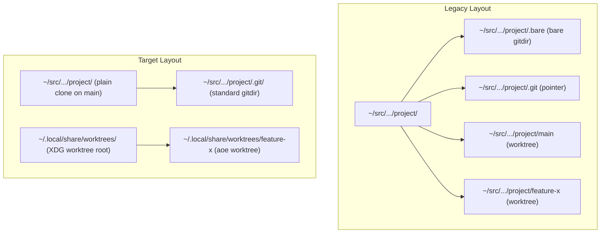
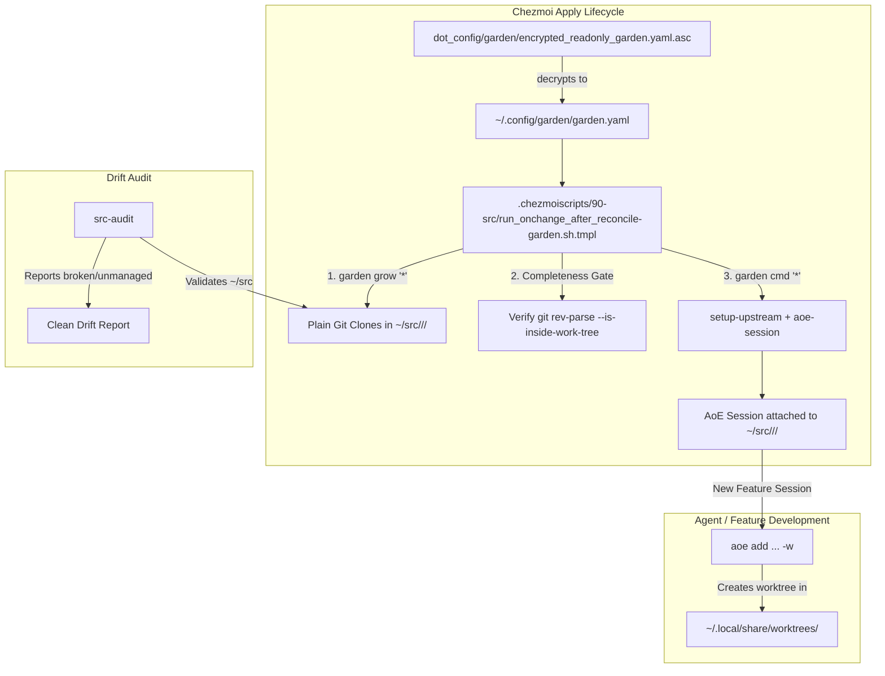

## Goal Capsule

- **Objective:** Manage repositories under `~/src/` as plain, default-branch checkouts while centralizing ephemeral agent and feature worktrees under `~/.local/share/worktrees/`.
- **Means:** Transition `garden.yaml` tree definitions from `.bare` containers to plain clones, simplify garden bootstrap and reconcile scripts, update `src-audit` drift detection, and update agent instructions (KTD1, KTD2).
- **Product Authority:** The dotfiles repository configuration, garden manifest, apply scripts, and agent instruction templates.
- **Open Blockers:** None.

---

## Product Contract

<!-- ce-preservation: Product Contract unchanged -->

### Summary

Transition all `~/src/<host>/<group>/<project>` repositories to plain git checkouts on their default branch (`main` or `develop`), matching the existing `nix-config` pattern. Relocate all agent-of-empires (`aoe`) and feature branch worktrees to a centralized user-wide directory at `~/.local/share/worktrees/<aoe-managed-name>`.

### Problem Frame

The current repository layout uses bare clones (`<project>/.bare`) with a synthetic `.git` pointer file (`gitdir: ./.bare`) and creates worktree subdirectories directly inside the project folder. This introduces pointer fragility, complicates tools expecting standard `.git/` working trees, clutters project directories with transient branch worktrees, and requires complex custom bootstrap commands (`setup-gitdir`, `setup-upstream`) in garden and chezmoi reconcile scripts.

### Key Decisions

- K1. **Plain checkouts in `~/src`** — (session-settled: user-directed — chosen over bare repo containers: aligns all repositories with standard git layout and direct tool inspection). Governs R1, R2, R3, R4.
- K2. **Centralized XDG worktrees** — (session-settled: user-directed — chosen over in-project or sibling worktree directories: keeps source directories clean while isolating ephemeral branch checkouts under `~/.local/share/worktrees/`). Governs R5, R6.
- K3. **Primary checkout for default branch** — (session-settled: user-approved — chosen over worktrees for all branches: enables direct inspection and base sessions on the default branch without creating unnecessary worktrees). Governs R1, R7.
- K4. **AoE-managed worktree naming** — (session-settled: user-directed — chosen over manually mirrored path hierarchies: leverages AoE's global unique session/worktree name enforcement). Governs R6, R7.
- K5. **Clean cutover migration** — (session-settled: user-directed — chosen over automated backward migration scripting: avoids complex in-place mutation of legacy `.bare` structures in favor of clean re-growth). Governs R9.

### Requirements

#### Repository Layout and Manifest

- R1. Every managed repository under `~/src/<host>/<group>/<project>` must be cloned as a standard non-bare git repository checked out to its default branch.
- R2. `dot_config/garden/encrypted_readonly_garden.yaml.asc` (and deployed `~/.config/garden/garden.yaml`) must declare tree paths without `/.bare` suffixes and without `bare: true`.
- R3. Garden tree definitions for plain clones must omit explicit `remote.origin.fetch` refspec overrides, relying on git's native clone branch tracking.
- R4. The `dotfiles` checkout at `~/.local/share/chezmoi` must remain a declared root-external non-bare tree with its existing `aoe_group` variable and external worktree location.

#### Worktree Management

- R5. All feature branch worktrees created by `aoe` or development tooling must be placed under `~/.local/share/worktrees/`.
- R6. Worktrees under `~/.local/share/worktrees/` must use AoE's unique managed session/worktree name as their directory leaf (`~/.local/share/worktrees/<name>`).
- R7. The primary repository checkout at `~/src/<host>/<group>/<project>` must remain dedicated to the default branch and must not host feature worktree subdirectories.

#### Automation and Drift Audit

- R8. `.chezmoiscripts/90-src/run_onchange_after_reconcile-garden.sh.tmpl` must verify that every declared tree is a valid working tree via `git rev-parse --is-inside-work-tree` and must remove bare repository checks.
- R9. Garden bootstrap commands (`setup-gitdir`, `setup-upstream`, `aoe-session`) must be simplified: `setup-gitdir` retired or no-oped, `setup-upstream` streamlined, and `aoe-session` configured to attach default sessions directly to the primary checkout.
- R10. `dot_local/bin/executable_src-audit` must report drift based on plain checkouts without checking for `gitdir: ./.bare` pointers.

#### Rules and Documentation

- R11. `.chezmoitemplates/agents-instructions.tmpl` and root `AGENTS.md` must be updated to document the plain checkout rule and the `~/.local/share/worktrees/` external worktree convention.

### Visualizations

### Key Flows

- F1. Initial repository provisioning
  - **Trigger:** `chezmoi apply` triggers `.chezmoiscripts/90-src/run_onchange_after_reconcile-garden.sh.tmpl`.
  - **Actors:** Garden CLI, Git, AoE CLI.
  - **Steps:** `garden grow` clones plain repositories under `~/src/`; completeness check verifies each working tree; `aoe-session` registers a base session attached directly to `~/src/.../<project>`.
  - **Covered by:** R1, R2, R3, R8, R9.

- F2. Feature branch worktree creation
  - **Trigger:** User or agent creates a session for a feature branch.
  - **Actors:** User, AoE CLI, Git.
  - **Steps:** AoE creates a git worktree in `~/.local/share/worktrees/<name>` linked to the primary repository, then launches the session in that worktree.
  - **Covered by:** R5, R6, R7.

- F3. Repository drift audit
  - **Trigger:** User runs `src-audit` to detect missing, broken, or unmanaged repositories.
  - **Actors:** `src-audit` script, Garden CLI, Git.
  - **Steps:** Script compares grown trees against `garden.yaml`, verifies each repository is a valid git work tree, and reports any unmanaged repositories under `~/src/`.
  - **Covered by:** R10.

### Acceptance Examples

- AE1. Standard repository checkout
  - **Covers:** R1, R2, R3
  - **Given:** A declared tree `examvue-apps` in `garden.yaml` with path `git.jpi.app/examvue-duo/examvue-apps`.
  - **When:** `garden grow examvue-apps` runs.
  - **Then:** `~/src/git.jpi.app/examvue-duo/examvue-apps` is a standard git clone on branch `main` with a `.git/` directory (not `.bare`).

- AE2. Feature session worktree isolation
  - **Covers:** R5, R6, R7
  - **Given:** Primary repository `~/src/git.jpi.app/examvue-duo/examvue-apps` checked out on `main`.
  - **When:** A new feature session `feature/add-auth` is added via AoE.
  - **Then:** The worktree is created at `~/.local/share/worktrees/feature-add-auth` and `~/src/git.jpi.app/examvue-duo/examvue-apps` contains no feature worktree subdirectories.

- AE3. Drift verification passes on plain checkouts
  - **Covers:** R8, R10
  - **Given:** Plain checkouts provisioned under `~/src/`.
  - **When:** `src-audit` runs.
  - **Then:** It exits with code 0 and reports zero broken repositories without complaining about missing `gitdir: ./.bare` pointers.

### Scope Boundaries

#### Deferred for later

- Automating cleanup of abandoned legacy worktree directories in old `.bare` paths.
- Dynamic pruning policies for stale worktrees in `~/.local/share/worktrees/`.

#### Outside this product's identity

- Moving repository root away from `~/src/`.
- Changing chezmoi's own source checkout location (`~/.local/share/chezmoi`).

---

## Planning Contract

### Key Technical Decisions

- KTD1. **Plain Git Clones in Garden Manifest** — (session-settled: user-directed — chosen over bare clones: eliminates synthetic `.git` pointer files and simplifies repository inspection). `garden.yaml` tree entries remove `bare: true`, remove the `/.bare` path suffix, and drop `remote.origin.fetch` overrides. Governs R1, R2, R3.
- KTD2. **Garden Bootstrap Command Modernization** — Update custom garden commands in `garden.yaml`: retire `setup-gitdir` (or make it an exit-0 no-op), retain `setup-upstream` with `remote set-head origin --auto`, and simplify `aoe-session` to attach sessions directly to the primary checkout without creating default-branch worktrees. Governs R9.
- KTD3. **Unified Worktree Completeness Verification** — Update `.chezmoiscripts/90-src/run_onchange_after_reconcile-garden.sh.tmpl` `check_tree()` to assert `git -C "$tp" rev-parse --is-inside-work-tree` for all declared trees, eliminating bare clone branching. Governs R8.
- KTD4. **Drift Detection Streamlining in `src-audit`** — Update `dot_local/bin/executable_src-audit` broken-tree check to inspect `--is-inside-work-tree` uniformly for all grown trees, removing `.bare` pointer validation. Governs R10.
- KTD5. **Instruction Core and Supplement Alignment** — Update `.chezmoitemplates/agents-instructions.tmpl` and root `AGENTS.md` to document the plain checkout model under `~/src` and external worktree location at `~/.local/share/worktrees/`. Governs R11.

### High-Level Technical Design

### Assumptions & Constraints

- `garden` version installed supports standard `garden grow` for plain git clones without `bare: true`.
- Existing `dotfiles` checkout at `~/.local/share/chezmoi` continues to function as an external non-bare tree.
- `aoe` session manager creates external worktrees when invoked on plain git checkouts.

---

## Implementation Units

### U1. Update Garden Manifest and Custom Commands

- **Goal:** Convert tree declarations from `.bare` to plain checkouts and update custom commands (`setup-gitdir`, `setup-upstream`, `aoe-session`).
- **Requirements:** R1, R2, R3, R4, R9
- **Dependencies:** None
- **Files:**
  - `dot_config/garden/encrypted_readonly_garden.yaml.asc`
- **Approach:**
  1. Decrypt `dot_config/garden/encrypted_readonly_garden.yaml.asc` using `chezmoi decrypt`.
  2. For all declared trees (except root-external `dotfiles`), remove `/.bare` from `path:`, remove `bare: true`, and remove `gitconfig:` refspec overrides.
  3. Update `commands.setup-gitdir` to be an exit-0 no-op.
  4. Update `commands.setup-upstream` to run `git remote set-head origin --auto` and set tracking for existing branches.
  5. Update `commands.aoe-session` to session the primary checkout directly: `aoe add "$proj" -t "$branch" -g "$group"`.
  6. Re-encrypt with `chezmoi encrypt` and verify round-trip parsing and tree count preservation.
- **Test Scenarios:**
  - Decrypt round-trip verifies identical tree count and valid YAML schema.
  - Tree paths do not contain `/.bare` (except any intentionally external trees).
- **Verification:** Decrypted manifest parses cleanly with YAML parser and passes tree count check.

### U2. Update Garden Reconcile Apply Script

- **Goal:** Update apply-time completeness verification and bootstrap commands in `run_onchange_after_reconcile-garden.sh.tmpl`.
- **Requirements:** R8, R9
- **Dependencies:** U1
- **Files:**
  - `.chezmoiscripts/90-src/run_onchange_after_reconcile-garden.sh.tmpl`
- **Approach:**
  1. Update `check_tree()` function: remove `*/.bare` branch and test all trees via `git -C "$tp" rev-parse --is-inside-work-tree`.
  2. Update the `garden cmd '*'` execution line: replace `setup-gitdir setup-upstream aoe-session` with `setup-upstream aoe-session` (or keep no-op `setup-gitdir`).
  3. Ensure the dependency fingerprint correctly tracks the encrypted garden manifest.
- **Test Scenarios:**
  - `check_tree` succeeds for plain work tree directories.
  - `check_tree` fails when a directory is not a valid git work tree.
- **Verification:** Script renders cleanly without syntax errors and passes shellcheck / template render tests.

### U3. Update `src-audit` Drift Detection

- **Goal:** Update `src-audit` to detect broken checkouts based on plain work trees instead of `.bare` pointers.
- **Requirements:** R10
- **Dependencies:** U1, U2
- **Files:**
  - `dot_local/bin/executable_src-audit`
- **Approach:**
  1. In `src-audit` broken check loop: remove the `*/.bare` case checking `gitdir: ./.bare`.
  2. Verify all grown trees with `git -C "$tree_path" rev-parse --is-inside-work-tree`.
  3. Update unmanaged filter to check plain project roots directly.
- **Test Scenarios:**
  - `src-audit` reports clean (exit 0) when all grown repositories are valid plain git checkouts.
  - `src-audit` flags broken repos if a directory is missing `.git/` or corrupted.
- **Verification:** `src-audit` runs without syntax errors on plain checkouts.

### U4. Update Agent Instruction Core and Supplement

- **Goal:** Update agent instructions in `.chezmoitemplates/agents-instructions.tmpl` and root `AGENTS.md`.
- **Requirements:** R11
- **Dependencies:** U1, U2, U3
- **Files:**
  - `.chezmoitemplates/agents-instructions.tmpl`
  - `AGENTS.md`
- **Approach:**
  1. In `.chezmoitemplates/agents-instructions.tmpl`:
     - Update "Repository layout and garden ownership": state that projects in `~/src/<host>/<group>/<project>` are plain checkouts on default branch.
     - State that feature branch worktrees are managed by `aoe` under `~/.local/share/worktrees/`.
     - Update worktree rules: work in external worktree for feature branches; default branch checkout is for inspection and base sessions.
  2. Update root `AGENTS.md` to mirror the updated `~/src` repository and worktree layout.
- **Test Scenarios:**
  - `.ci/test-agent-instructions.sh` passes with all required needles preserved.
  - No banned instructions reintroduced.
- **Verification:** `.ci/test-agent-instructions.sh` exits 0.

---

## Verification Contract

| Test / Gate | Command / Target | Purpose |
|---|---|---|
| Agent instructions check | `bash .ci/test-agent-instructions.sh` | Verifies agent instruction needles and bans |
| Skip declarations check | `bash .ci/check-skip-declarations.sh` | Verifies skip declarations across all chezmoi scripts |
| Shellcheck / script gates | `shellcheck dot_local/bin/executable_src-audit` | Verifies bash/sh syntax correctness in audit script |
| Chezmoi render test | `chezmoi execute-template < .chezmoiscripts/90-src/run_onchange_after_reconcile-garden.sh.tmpl` | Proves template rendering converges without errors |

---

## Definition of Done

- [x] Product Contract requirements R1–R11 are fully addressed by implementation units U1–U4.
- [x] `garden.yaml` tree definitions and bootstrap commands updated for plain checkouts.
- [x] `.chezmoiscripts/90-src/run_onchange_after_reconcile-garden.sh.tmpl` checks working trees and executes updated bootstrap commands.
- [x] `dot_local/bin/executable_src-audit` verifies plain work trees without requiring `gitdir: ./.bare`.
- [x] `.chezmoitemplates/agents-instructions.tmpl` and `AGENTS.md` document the plain checkout and `~/.local/share/worktrees/` conventions.
- [x] All `.ci/` test suites pass.
- [x] No abandoned or experimental code remains in the diff.
