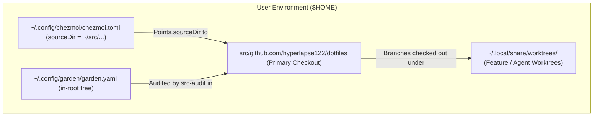

## Goal Capsule

- **Objective:** Manage the dotfiles repository as a standard in-root checkout under `~/src/github.com/hyperlapse122/dotfiles` with unified worktrees and native garden registry management.
- **Means:** Relocate source directory configuration, update `.chezmoi.toml.tmpl` with `sourceDir` and updated hook paths, register `dotfiles` as a standard in-root tree in `garden.yaml`, consolidate worktrees under `~/.local/share/worktrees/`, and update CI fixtures, prerequisites scripts, and agent instructions (KTD1, KTD2, KTD3, KTD4, KTD5).
- **Product Authority:** Dotfiles repository configuration, garden manifest, apply scripts, CI workflows, and agent instruction templates.
- **Open Blockers:** None.

---

## Product Contract

<!-- ce-preservation: Product Contract unchanged -->

### Summary

Relocate the chezmoi source checkout from `~/.local/share/chezmoi` to `~/src/github.com/hyperlapse122/dotfiles`, aligning dotfiles with the canonical `~/src/<host>/<group>/<project>` layout. Update `.chezmoi.toml.tmpl` to configure `sourceDir` and hook scripts, register `dotfiles` as a standard in-root tree in `garden.yaml`, consolidate feature worktrees under `~/.local/share/worktrees/`, and update all CI fixtures, prerequisites scripts, and agent documentation.

### Problem Frame

The dotfiles repository currently resides at `~/.local/share/chezmoi` outside the `~/src` tree. This requires special-case handling: `garden.yaml` treats it as a root-external tree with explicit `aoe_group` variable overrides, agent instructions document it as an exception, feature branch worktrees live in a separate `~/.local/share/chezmoi-worktrees/` directory, and `src-audit` bypasses standard path-derived validations. Moving dotfiles into the standard `~/src` hierarchy eliminates these exceptions and establishes a uniform development and auditing model across all repositories.

### Key Decisions

- K1. **Relocate chezmoi source to `~/src/github.com/hyperlapse122/dotfiles`** — (session-settled: user-directed — chosen over keeping `~/.local/share/chezmoi`: aligns dotfiles with the canonical `~/src/<host>/<group>/<project>` structure). Governs R1, R2, R3.
- K2. **Native in-root tree in `garden.yaml`** — (session-settled: user-directed — chosen over root-external tree declaration: removes custom `aoe_group` variable and allows native `src-audit` scanning). Governs R2, R3, R4, R5.
- K3. **Configure `sourceDir` and hook paths in `.chezmoi.toml.tmpl`** — (session-settled: user-directed — chosen over CLI-only `--source` flags: enables persistent default source directory and relative hook script execution). Governs R6, R7, R8.
- K4. **Consolidate feature worktrees under `~/.local/share/worktrees/`** — (session-settled: user-directed — chosen over retaining dedicated `~/.local/share/chezmoi-worktrees/`: unifies worktree management across all repositories). Governs R9, R10.
- K5. **Clean cutover without transitional fallback shims** — (session-settled: user-directed — chosen over backwards-compatibility path fallbacks: avoids lingering technical debt across scripts and documentation). Governs R10, R11, R12.

### Requirements

#### Repository Layout & Garden Manifest

- R1. The primary dotfiles checkout must reside at `~/src/github.com/hyperlapse122/dotfiles`.
- R2. `dot_config/garden/encrypted_readonly_garden.yaml.asc` (and deployed `~/.config/garden/garden.yaml`) must declare `dotfiles` as a standard in-root tree under `path: github.com/hyperlapse122/dotfiles` with `url: https://github.com/hyperlapse122/dotfiles.git`.
- R3. Root-external tree definitions, documentation comments, and explicit `aoe_group` variable overrides for dotfiles in `garden.yaml` must be removed.
- R4. `src-audit` (`dot_local/bin/executable_src-audit`) must audit `~/src/github.com/hyperlapse122/dotfiles` as a normal in-root tree without special-case exemptions.
- R5. The `reconcile-garden` script (`.chezmoiscripts/90-src/run_onchange_after_reconcile-garden.sh.tmpl`) must recognize `dotfiles` as an in-root tree, verify its git integrity, and register its aoe session under group `github.com/hyperlapse122/dotfiles`.

#### Chezmoi Configuration & Hooks

- R6. `.chezmoi.toml.tmpl` must define `sourceDir = "{{ .chezmoi.homeDir }}/src/github.com/hyperlapse122/dotfiles"`.
- R7. `.chezmoi.toml.tmpl` hook `[hooks.read-source-state.pre].script` must be updated to `"src/github.com/hyperlapse122/dotfiles/.install-prerequisites.sh"`.
- R8. `.install-prerequisites.sh` fallback resolution for `_DOTFILES_ROOT` must point to `"$HOME/src/github.com/hyperlapse122/dotfiles"`.

#### Worktree Management & Documentation

- R9. Feature branch and agent development worktrees for dotfiles must be placed under `~/.local/share/worktrees/<name>`, retiring `~/.local/share/chezmoi-worktrees/`.
- R10. `AGENTS.md` and `.chezmoitemplates/agents-instructions.tmpl` must be updated to document that dotfiles is a standard `~/src` repository and that its worktrees live under `~/.local/share/worktrees/`, removing references to `~/.local/share/chezmoi` and `~/.local/share/chezmoi-worktrees/`.
- R11. `README.md` bootstrap and initialization documentation must be updated to reference `~/src/github.com/hyperlapse122/dotfiles` and `chezmoi init --source ~/src/github.com/hyperlapse122/dotfiles`.

#### CI & Test Fixtures

- R12. `.github/workflows/render-dotfiles.yml` test setup and fakehome paths must replicate the source tree at `~/src/github.com/hyperlapse122/dotfiles` instead of `~/.local/share/chezmoi`.

### Key Flows

- F1. **Fresh Host Bootstrap Flow**
  - **Trigger:** Operator runs chezmoi bootstrap on a fresh machine.
  - **Actors:** Operator, Chezmoi Engine, Prerequisites Hook (`.install-prerequisites.sh`).
  - **Steps:**
    1. Operator runs `chezmoi init --source ~/src/github.com/hyperlapse122/dotfiles https://github.com/hyperlapse122/dotfiles.git`.
    2. Chezmoi clones repository directly into `~/src/github.com/hyperlapse122/dotfiles`.
    3. Chezmoi renders `.chezmoi.toml.tmpl` with `sourceDir = "{{ .chezmoi.homeDir }}/src/github.com/hyperlapse122/dotfiles"` and hook script `"src/github.com/hyperlapse122/dotfiles/.install-prerequisites.sh"`.
    4. Prerequisites hook executes and provisions base dependencies.
    5. `chezmoi apply` completes, and `90-src/run_onchange_after_reconcile-garden.sh.tmpl` verifies `dotfiles` as a grown in-root garden tree and registers its default branch in `aoe`.
  - **Outcome:** Clean, standard workstation layout established with zero root-external exceptions.
  - **Covered by:** R1, R2, R5, R6, R7, R8.

### Scope Boundaries

#### Explicit Non-Goals

- Implementing transitional dual-path fallback shims across scripts (clean cutover only).
- Altering the repository layout or garden bootstrap mechanism for non-dotfiles repositories.
- Modifying dotfiles source file attributes or template rendering engines beyond path updates.

### Acceptance Examples

- AE1. **Chezmoi Source Directory Resolution**
  - **Given:** A host initialized with updated `.chezmoi.toml.tmpl`.
  - **When:** `chezmoi source-path` is executed.
  - **Then:** Output matches `$HOME/src/github.com/hyperlapse122/dotfiles`.
  - **Covers:** R1, R6.

- AE2. **Garden Manifest and In-Root Audit**
  - **Given:** Deployed `~/.config/garden/garden.yaml` containing in-root `dotfiles` tree.
  - **When:** `src-audit` is run on a host with `~/src/github.com/hyperlapse122/dotfiles` checked out.
  - **Then:** `src-audit` reports no missing, broken, or unmanaged drift for `dotfiles`, with no root-external tree warnings.
  - **Covers:** R2, R3, R4.

- AE3. **Pre-read Hook Resolution**
  - **Given:** Chezmoi runs `read-source-state.pre` hook during `chezmoi diff` or `chezmoi apply`.
  - **When:** Hook script path `src/github.com/hyperlapse122/dotfiles/.install-prerequisites.sh` is executed.
  - **Then:** Hook executes successfully without failing to find the source root.
  - **Covers:** R7, R8.

- AE4. **CI Workflow Parity**
  - **Given:** CI execution in `.github/workflows/render-dotfiles.yml`.
  - **When:** Workflow runs `chezmoi init` and `chezmoi apply` in `fakehome`.
  - **Then:** Workflow initializes source at `$HOME/src/github.com/hyperlapse122/dotfiles` and all template rendering and test passes succeed.
  - **Covers:** R12.

---

## Planning Contract

### Key Technical Decisions

- KTD1. **Explicit `sourceDir` configuration in `.chezmoi.toml.tmpl`** — Define `sourceDir = "{{ .chezmoi.homeDir }}/src/github.com/hyperlapse122/dotfiles"` at the top level of the config template, ensuring chezmoi commands default to the new path across interactive and non-interactive sessions without relying on explicit `--source` flags. (Governs R6).
- KTD2. **Relative hook path in `.chezmoi.toml.tmpl`** — Set `[hooks.read-source-state.pre].script = "src/github.com/hyperlapse122/dotfiles/.install-prerequisites.sh"`, matching chezmoi's home-relative hook resolution. (Governs R7, R8).
- KTD3. **Plain in-root tree definition in `garden.yaml`** — Replace root-external `${HOME}/.local/share/chezmoi` declaration in `dot_config/garden/encrypted_readonly_garden.yaml.asc` with standard `path: github.com/hyperlapse122/dotfiles` and `url: https://github.com/hyperlapse122/dotfiles.git`, removing `aoe_group` overrides. (Governs R2, R3).
- KTD4. **Consolidated worktree hierarchy** — Retire `~/.local/share/chezmoi-worktrees/` in agent instructions and scripts, standardizing on `~/.local/share/worktrees/<aoe-managed-name>`. (Governs R9, R10).
- KTD5. **CI fakehome path modernization** — Update `.github/workflows/render-dotfiles.yml` to clone/copy the source tree into `${HOME}/src/github.com/hyperlapse122/dotfiles` in test fakehomes, aligning CI verification with real host layout. (Governs R12).

### Technical Design

### Assumptions

- The operator will move or re-clone the existing checkout from `~/.local/share/chezmoi` to `~/src/github.com/hyperlapse122/dotfiles` upon applying these changes.
- Chezmoi natively resolves home-relative script paths declared in `hooks.read-source-state.pre.script`.

---

## Implementation Units

### U1. Update Chezmoi Configuration Template and Prerequisites Hook

- **Goal:** Configure `.chezmoi.toml.tmpl` with the new sourceDir and hook path, and update `.install-prerequisites.sh` fallback resolution.
- **Requirements:** R6, R7, R8.
- **Files:**
  - `.chezmoi.toml.tmpl`
  - `.install-prerequisites.sh`
- **Approach:**
  - Add `sourceDir = "{{ .chezmoi.homeDir }}/src/github.com/hyperlapse122/dotfiles"` to `.chezmoi.toml.tmpl`.
  - Update `[hooks.read-source-state.pre].script = "src/github.com/hyperlapse122/dotfiles/.install-prerequisites.sh"`.
  - In `.install-prerequisites.sh`, update the fallback `_DOTFILES_ROOT` from `"$HOME/.local/share/chezmoi"` to `"$HOME/src/github.com/hyperlapse122/dotfiles"`.
- **Test Scenarios:**
  - Render `.chezmoi.toml.tmpl` via `chezmoi execute-template` with scratch home directory; assert `sourceDir` and `script` point to `src/github.com/hyperlapse122/dotfiles`.
  - Verify `.install-prerequisites.sh` syntax and execution without errors.
- **Verification:**
  - Template rendering test succeeds and paths are verified.

### U2. Update Encrypted Garden Registry Manifest

- **Goal:** Update `dot_config/garden/encrypted_readonly_garden.yaml.asc` to declare `dotfiles` as a standard in-root tree.
- **Requirements:** R2, R3, R4, R5.
- **Files:**
  - `dot_config/garden/encrypted_readonly_garden.yaml.asc`
- **Approach:**
  - Decrypt `dot_config/garden/encrypted_readonly_garden.yaml.asc` to a secure temporary file in `$XDG_RUNTIME_DIR`.
  - Edit `dotfiles` tree: set `path: github.com/hyperlapse122/dotfiles`, `url: https://github.com/hyperlapse122/dotfiles.git`, and remove `variables.aoe_group`.
  - Update documentation comments to remove references to root-external dotfiles exceptions and `~/.local/share/chezmoi-worktrees/`.
  - Re-encrypt to `dot_config/garden/encrypted_readonly_garden.yaml.asc` and verify round-trip decryption, tree count, and recipient keys.
- **Test Scenarios:**
  - Decrypt and parse YAML; assert valid YAML structure, tree count is unchanged (19 trees), `dotfiles.path` is `github.com/hyperlapse122/dotfiles`.
- **Verification:**
  - GPG decryption round-trip succeeds with clean diff against expected manifest.

### U3. Update CI Workflows and Test Fixtures

- **Goal:** Update `.github/workflows/render-dotfiles.yml` to mirror the new `~/src/github.com/hyperlapse122/dotfiles` layout in test environments.
- **Requirements:** R12.
- **Files:**
  - `.github/workflows/render-dotfiles.yml`
- **Approach:**
  - In `.github/workflows/render-dotfiles.yml`, replace `${HOME}/.local/share/chezmoi` with `${HOME}/src/github.com/hyperlapse122/dotfiles` across fakehome initialization, source copying, and cleanup steps.
- **Test Scenarios:**
  - Verify workflow syntax and validate path consistency across all steps.
- **Verification:**
  - Workflow YAML parses cleanly and has no remaining `.local/share/chezmoi` references.

### U4. Update Agent Instructions, Templates, and README

- **Goal:** Update agent instructions and repository documentation to reflect standard `~/src` location and unified worktrees.
- **Requirements:** R1, R9, R10, R11.
- **Files:**
  - `AGENTS.md`
  - `.chezmoitemplates/agents-instructions.tmpl`
  - `dot_omp/private_agent/private_readonly_AGENTS.md.tmpl`
  - `README.md`
- **Approach:**
  - In `AGENTS.md`, `.chezmoitemplates/agents-instructions.tmpl`, and `dot_omp/private_agent/private_readonly_AGENTS.md.tmpl`, remove statements claiming `~/.local/share/chezmoi` is an external tree and that chezmoi worktrees live under `~/.local/share/chezmoi-worktrees/`.
  - Document that dotfiles is a standard `~/src` plain checkout and its worktrees live under `~/.local/share/worktrees/<aoe-managed-name>`.
  - In `README.md`, update bootstrap commands and cloning instructions to use `~/src/github.com/hyperlapse122/dotfiles`.
- **Test Scenarios:**
  - Run `.ci/test-agent-instructions.sh` to ensure all positive and negative instruction rules pass.
- **Verification:**
  - `.ci/test-agent-instructions.sh` exits 0.

### U5. Full Quality Gate Verification

- **Goal:** Run complete test suite and linters to verify zero regressions.
- **Requirements:** R1 through R12.
- **Files:** All modified files.
- **Approach:**
  - Run `.ci/check-skip-declarations.sh`.
  - Run `.ci/test-agent-instructions.sh`.
  - Run `.ci/test-skip-declaration-gates.sh`.
  - Execute template renders across modified files.
- **Test Scenarios:**
  - All CI verification scripts pass with zero exit codes.
- **Verification:**
  - Terminal green on all checks.

---

## Verification Contract

| Test / Gate | Command | Applicability | Done Signal |
|---|---|---|---|
| Agent instructions gate | `.ci/test-agent-instructions.sh` | Unit U4 | Exit 0 |
| Skip declarations check | `.ci/check-skip-declarations.sh` | Unit U1, U4 | Exit 0 |
| Skip declaration gates | `.ci/test-skip-declaration-gates.sh` | Unit U1 | Exit 0 |
| Manifest round-trip | `chezmoi decrypt dot_config/garden/encrypted_readonly_garden.yaml.asc` | Unit U2 | Exit 0, parses valid YAML |
| Git diff sanity | `git diff --check` | All units | No whitespace/syntax errors |

---

## Definition of Done

- All five implementation units (U1–U5) are completed and verified.
- `.chezmoi.toml.tmpl` renders `sourceDir` and relative hook path targeting `src/github.com/hyperlapse122/dotfiles`.
- `encrypted_readonly_garden.yaml.asc` declares `dotfiles` as a standard in-root tree under `github.com/hyperlapse122/dotfiles`.
- CI workflows in `.github/workflows/render-dotfiles.yml` use the new source directory layout.
- Agent instructions and documentation contain no obsolete references to `~/.local/share/chezmoi` or `~/.local/share/chezmoi-worktrees/`.
- All verification gates pass cleanly with zero errors.
