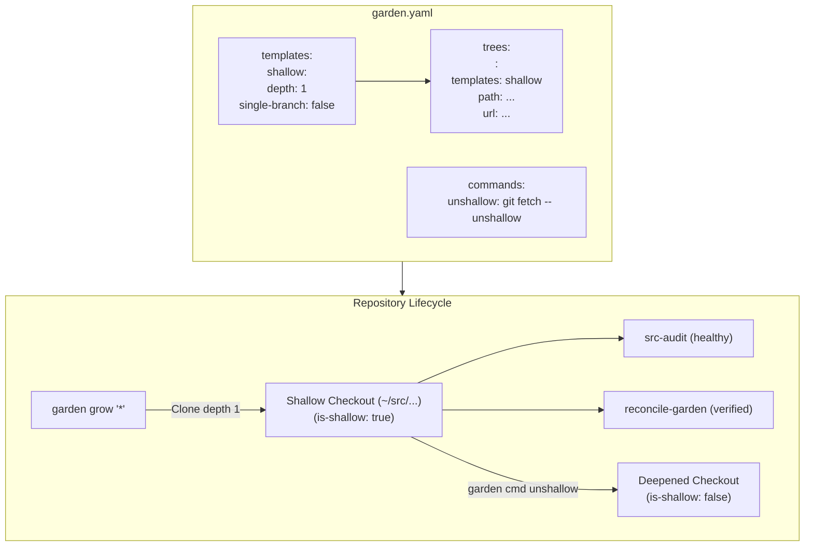

## Goal Capsule

- **Objective:** Reduce initial machine bootstrap time, network bandwidth, and disk usage for `garden grow` across repositories under `~/src/` by enabling shallow history by default while providing on-demand history deepening.
- **Means:** Configure `templates: shallow` (`depth: 1`, `single-branch: false`) on garden trees in `garden.yaml`, add an `unshallow` garden custom command (`garden cmd <tree> unshallow`), verify reconcile and audit compatibility, and update documentation and tests (KTD1, KTD2, KTD3).
- **Product Authority:** Dotfiles repository configuration, garden manifest, apply scripts, and agent instruction templates.
- **Open Blockers:** None.

---

## Product Contract

<!-- ce-preservation: Product Contract unchanged -->

### Summary

Enable shallow clones (`depth: 1`, `single-branch: false`) for `garden grow` by default across declared repositories in `garden.yaml`, add an `unshallow` custom command in `garden.yaml` for on-demand history retrieval, and ensure `.chezmoiscripts/90-src/run_onchange_after_reconcile-garden.sh.tmpl` and `dot_local/bin/executable_src-audit` work seamlessly with shallow repositories.

### Problem Frame

During initial machine bootstrap or `chezmoi apply` (`.chezmoiscripts/90-src/run_onchange_after_reconcile-garden.sh.tmpl`), running `garden grow '*'` clones full git histories for every repository declared in `~/.config/garden/garden.yaml`. For inactive repositories or large codebases not actively under development on the current host, full commit history downloads consume excessive network bandwidth, increase provisioning time, and inflate disk usage under `~/src/`.

### Key Decisions

- K1. **Shallow clones with full remote refspecs by default** — (session-settled: user-directed — chosen over blobless partial clone `--filter=blob:none` or full clones: `depth: 1` with `single-branch: false` is natively supported by `garden` via `templates: shallow`, avoids server-side partial clone compatibility issues, and preserves `+refs/heads/*:refs/remotes/origin/*` tracking). Governs R1, R2, R3.
- K2. **On-demand deepening via `unshallow` garden command** — (session-settled: user-directed — chosen over manual ad-hoc `git fetch --unshallow`: `garden cmd <tree> unshallow` provides an idempotent, built-in workflow across trees or for a specific tree). Governs R4, R5.
- K3. **Compatibility across reconcile and audit tooling** — (session-settled: user-directed — chosen over separate shallow/deep audit paths: `rev-parse --is-inside-work-tree` and upstream tracking already function cleanly on shallow repositories). Governs R6, R7.

### Requirements

#### Garden Manifest & Configuration

- R1. `dot_config/garden/encrypted_readonly_garden.yaml.asc` (and deployed `~/.config/garden/garden.yaml`) must declare a `shallow` template with `depth: 1` and `single-branch: false`.
- R2. Declared project trees in `garden.yaml` must apply `templates: shallow` by default.
- R3. Initial `garden grow` of trees must clone with depth 1 and preserve full remote tracking refspecs (`+refs/heads/*:refs/remotes/origin/*`).
- R4. `garden.yaml` must declare a custom command `unshallow` that deepens history via `git fetch --unshallow` when a repository is shallow and reports cleanly if already unshallow.
- R5. `garden cmd <tree> unshallow` and `garden cmd '*' unshallow` must execute idempotently without corrupting repository state or tracking configuration.

#### Reconcile, Audit & Automation

- R6. `.chezmoiscripts/90-src/run_onchange_after_reconcile-garden.sh.tmpl` must run cleanly and verify tree integrity on shallow repositories.
- R7. `dot_local/bin/executable_src-audit` must audit shallow repositories as valid, healthy checkouts without false-positive drift warnings.

#### Documentation & Testing

- R8. Documentation in `AGENTS.md` and `.chezmoitemplates/agents-instructions.tmpl` must document shallow garden grow defaults and the `garden cmd <tree> unshallow` workflow.
- R9. Test coverage in `.ci/test-garden-shallow-pull.sh` must verify shallow clone creation, `setup-upstream` compatibility, `unshallow` command execution, and `src-audit` validation on shallow checkouts.

### Visualizations



---

## Planning Contract

### Key Technical Decisions

- KTD1. **Declare `shallow` template and attach to trees in `garden.yaml`**:
  ```yaml
  templates:
    shallow:
      depth: 1
      single-branch: false
  ```
  Each tree stanza specifies `templates: shallow` (or `templates: [shallow]`), ensuring that initial `garden grow` passes `--depth 1 --no-single-branch` to git clone.

- KTD2. **Add `unshallow` command to `garden.yaml`**:
  ```yaml
  commands:
    unshallow: |
      if git -C "${TREE_PATH}" rev-parse --is-shallow-repository 2>/dev/null | grep -q true; then
        echo "Unshallowing ${TREE_NAME}..."
        git -C "${TREE_PATH}" fetch --unshallow
      else
        echo "${TREE_NAME} is already unshallow"
      fi
  ```
  Provides a native, safe, and idempotent command for deepening repositories on demand.

- KTD3. **Create isolated test script `.ci/test-garden-shallow-pull.sh`**:
  Automates testing of garden template application, shallow cloning, `setup-upstream` execution, `unshallow` command execution, and `src-audit` compatibility using disposable local bare git repositories.

### Assumptions & Dependencies

- `garden` CLI (v2.6.2+) natively supports `templates:`, `depth:`, and `single-branch:`.
- `git fetch --unshallow` works with the configured remote origin and tracking refspecs.
- Reconcile scripts and `src-audit` rely on `git rev-parse --is-inside-work-tree`, which succeeds on shallow git checkouts.

---

## Implementation Units

### U1. Update Garden Manifest (`dot_config/garden/encrypted_readonly_garden.yaml.asc`)

- **Goal:** Declare `shallow` template, attach `templates: shallow` to trees, and add `unshallow` custom command in the encrypted garden registry.
- **Requirements:** R1, R2, R3, R4, R5
- **Dependencies:** None
- **Files:** `dot_config/garden/encrypted_readonly_garden.yaml.asc`
- **Approach:**
  1. Decrypt `dot_config/garden/encrypted_readonly_garden.yaml.asc` into a mode-600 temporary scratch file under `$XDG_RUNTIME_DIR`.
  2. Add `templates:` section with `shallow: { depth: 1, single-branch: false }`.
  3. Add `templates: shallow` to declared trees.
  4. Add `unshallow:` command under `commands:`.
  5. Update comments in the header describing shallow clones and history deepening.
  6. Encrypt back to `dot_config/garden/encrypted_readonly_garden.yaml.asc` and verify round-trip decryption.
  7. Clean up scratch files.
- **Patterns to follow:** Existing garden template and command formatting in `docs/plans/2026-08-31-0923-refactor-src-worktree-management-plan.md`.
- **Test scenarios:**
  - Decrypt round-trip verifies parsed YAML structure and tree counts match expected declarations.
  - `garden ls -v` accepts the manifest and resolves all tree paths.
- **Verification:** Decrypted YAML parses without errors and staged ciphertext diff contains only intended template, tree, and command lines.

---

### U2. Update Documentation & Agent Instructions

- **Goal:** Document shallow clone defaults and the `unshallow` command in agent instructions.
- **Requirements:** R8
- **Dependencies:** U1
- **Files:** `.chezmoitemplates/agents-instructions.tmpl`, `AGENTS.md`
- **Approach:**
  1. In `.chezmoitemplates/agents-instructions.tmpl` (under `Repository layout and garden ownership`), document that `garden grow` performs shallow clones (`depth: 1`) by default.
  2. Document `garden cmd <name> unshallow` or `git fetch --unshallow` for retrieving full history when needed for development, rebase, or log audits.
  3. Update root `AGENTS.md` accordingly.
- **Patterns to follow:** Existing garden layout instructions in `AGENTS.md`.
- **Test scenarios:**
  - Instructions clearly document the command syntax and rationale.
- **Verification:** Text changes are concise, accurate, and consistent across template and composed targets.

---

### U3. Add CI Integration Test for Shallow Pull and Unshallow

- **Goal:** Add automated test covering shallow clones, `setup-upstream`, `unshallow` command, and `src-audit`.
- **Requirements:** R6, R7, R9
- **Dependencies:** U1, U2
- **Files:** `.ci/test-garden-shallow-pull.sh`
- **Approach:**
  1. Create executable test script `.ci/test-garden-shallow-pull.sh`.
  2. Set up a dummy local bare git repository with multiple commits.
  3. Generate a test `garden.yaml` declaring a tree with `templates: shallow` and the `setup-upstream` / `unshallow` commands.
  4. Run `garden grow` and assert `git rev-parse --is-shallow-repository` is `true` and commit count is 1.
  5. Run `garden cmd <tree> setup-upstream` and verify tracking refs are intact.
  6. Run `src-audit` on the shallow checkout and assert exit code is 0 with no broken/unmanaged reports.
  7. Run `garden cmd <tree> unshallow` and assert `git rev-parse --is-shallow-repository` is `false` and commit count equals full history.
  8. Run `garden cmd <tree> unshallow` again and verify clean idempotent execution.
- **Patterns to follow:** `.ci/test-tmux-kitty-passthrough.sh` and other `.ci/` test fixtures.
- **Test scenarios:**
  - Happy path: Initial clone is shallow (`--depth 1`).
  - Upstream configuration succeeds on shallow clone.
  - `src-audit` reports shallow checkouts as healthy.
  - `unshallow` retrieves full history and is idempotent.
- **Verification:** Script runs to completion and exits 0.

---

## Verification Contract

- **Automated Tests:**
  - `.ci/test-garden-shallow-pull.sh` executes and passes all assertions.
  - `.ci/check-skip-declarations.sh` and other relevant CI scripts pass.
- **Security & Hygiene:**
  - `dot_config/garden/encrypted_readonly_garden.yaml.asc` is properly GPG-encrypted; no plaintext scratch files remain.
  - `git diff --check` and `git status` show only expected files.

---

## Definition of Done

- `templates: shallow` and `unshallow` command configured in `garden.yaml`.
- All declared project trees use `templates: shallow`.
- `reconcile-garden` and `src-audit` verified compatible with shallow checkouts.
- `.ci/test-garden-shallow-pull.sh` added and passing.
- `AGENTS.md` and `.chezmoitemplates/agents-instructions.tmpl` updated.
- All verification steps pass cleanly.
