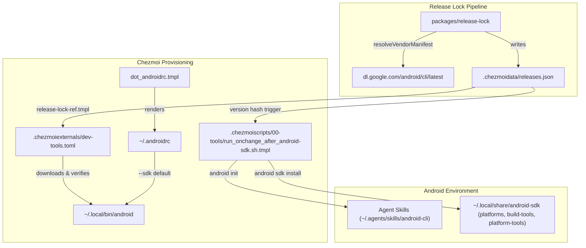

## Goal Capsule

- **Objective:** Android SDK components, build tools, platforms, and agent skills are initialized idempotently and non-interactively using Google's official `android` CLI across Linux and macOS.
- **Means:** Delivery of the `android` binary via static release lock tracking (`packages/release-lock` + `.chezmoiexternals/dev-tools.toml`), configuration via `dot_androidrc.tmpl`, and modern SDK lifecycle orchestration in `.chezmoiscripts/00-tools/run_onchange_after_android-sdk.sh.tmpl` (KTD1, KTD2).
- **Authority:** Issue #291 + official Android CLI distribution specification.
- **Stop conditions:** `android` binary is provisioned to `~/.local/bin/android`, `.chezmoiscripts/00-tools/run_onchange_after_android-sdk.sh.tmpl` executes non-interactively without legacy `sdkmanager` zip bootstraps, `~/.androidrc` configures `--sdk`, and package tests pass.
- **Execution profile:** Code implementation in dotfiles chezmoi templates, package release lock, and test fixtures.

---

## Product Contract

### Summary

Replace legacy Android SDK bootstrap and `sdkmanager` license piping with Google's official agent-first Android CLI (`android`). The `android` binary is tracked in `packages/release-lock` as a locked vendor manifest, delivered via `.chezmoiexternals/dev-tools.toml` to `~/.local/bin/android`, and managed via `~/.androidrc`. The SDK provisioning script executes `android init` and `android sdk install` non-interactively.

### Problem Frame

Currently, Android SDK provisioning in `.chezmoiscripts/00-tools/run_onchange_after_android-sdk.sh.tmpl` downloads legacy `commandlinetools` zips to scratch directories, extracts binaries, and drives `sdkmanager` with `yes | sdkmanager --licenses`. This legacy workflow is brittle, verbose, requires Java runtime presence before bootstrap, and lacks integration with modern AI coding agent skills. Google has released the standalone `android` CLI that bundles its own runtime, accepts licenses during SDK install, and provides agent environment initialization (`android init`).

### Requirements

**CLI Delivery & Tracking**
- R1. `packages/release-lock` resolves `android` CLI binaries for Linux x86_64, macOS arm64, and macOS x86_64, and supports Linux arm64 under emulation.
- R2. `.chezmoidata/releases.json` records the locked `android` tool version, URLs, and sha256 checksums.
- R3. `.chezmoiexternals/dev-tools.toml` provisions the `android` binary to `.local/bin/android` as an executable file with verified checksum.

**SDK Lifecycle & Agent Initialization**
- R4. `.chezmoiscripts/00-tools/run_onchange_after_android-sdk.sh.tmpl` uses `android init` to configure the environment and agent skills.
- R5. `run_onchange_after_android-sdk.sh.tmpl` installs `platform-tools`, `build-tools/35.0.0`, and `platforms/android-36` idempotently using `android sdk install`.
- R6. `run_onchange_after_android-sdk.sh.tmpl` executes non-interactively and cleans up legacy `cmdline-tools` scratch bootstrap code.

**Configuration**
- R7. `dot_androidrc.tmpl` manages `~/.androidrc` declaring `--sdk` pointing to `${HOME}/.local/share/android-sdk`.

### Success Criteria

- Running `packages/release-lock` tests passes with unit test coverage for `android` manifest resolution.
- Rendering `dev-tools.toml` produces valid external definitions for `[android]`.
- Rendering `run_onchange_after_android-sdk.sh.tmpl` produces clean, non-interactive bash scripting using `android sdk install`.
- Rendering `dot_androidrc.tmpl` produces valid `--sdk` flag configuration.

### Scope Boundaries

- **In Scope:** `android` tool definition in `packages/release-lock`, `dev-tools.toml` external definition, `run_onchange_after_android-sdk.sh.tmpl` script migration, `dot_androidrc.tmpl` template, and resolution test suite.
- **Out of Scope:** Modifications to Flutter SDK installation (`run_onchange_after_flutter.sh.tmpl`), changes to existing environment variables in `dot_config/environment.d/` or `dot_config/zsh/dot_zprofile`, or non-Android SDK packages.

---

## Planning Contract

### Key Technical Decisions

- KTD1. **Vendor Manifest Resolution for `android` in `packages/release-lock`.** Implement `resolveAndroidCli` under `vendorManifest` in `packages/release-lock/src/vendor-manifest.ts`. The resolver fetches the platform binaries from Google's static endpoints (`https://dl.google.com/android/cli/latest/${os_arch}/android`), computes sha256 hashes, and extracts the embedded `version=([0-9.]+)` from the binary payload. Governs R1, R2.
- KTD2. **Single-file External Binary Delivery.** Declare `[android]` in `.chezmoiexternals/dev-tools.toml` with `type = "file"`, `targetPath = '.local/bin/android'`, and checksum verification via `release-lock-ref.tmpl`. Governs R3.
- KTD3. **Android CLI SDK Management Script.** Refactor `.chezmoiscripts/00-tools/run_onchange_after_android-sdk.sh.tmpl` to hash the locked `android` release tag, resolve the `android` binary from `$PATH` or `~/.local/bin/android`, run `android init`, and execute `android sdk install platform-tools build-tools/35.0.0 platforms/android-36`. Governs R4, R5, R6.
- KTD4. **Declarative Configuration in `dot_androidrc.tmpl`.** Add `dot_androidrc.tmpl` defining `--sdk={{ .chezmoi.homeDir }}/.local/share/android-sdk` to enforce default SDK root location for all CLI invocations. Governs R7.

### High-Level Technical Design



### Assumptions

- Google's official `dl.google.com/android/cli/latest/` endpoints remain available and provide Linux x86_64, Darwin ARM64, and Darwin x86_64 binaries.
- Linux ARM64 systems (such as Jetson) borrow the Linux x86_64 binary via emulation, matching the Flutter tool pattern.

---

## Implementation Units

### U1. Register `android` in `packages/release-lock`

**Goal:** Add `android` vendor manifest resolution to `packages/release-lock`.

**Requirements:** R1.

**Dependencies:** None.

**Files:**
- `packages/release-lock/src/types.ts`
- `packages/release-lock/src/registry.ts`
- `packages/release-lock/src/vendor-manifest.ts`

**Approach:**
1. In `packages/release-lock/src/types.ts`, add `"android"` to `VendorName`.
2. In `packages/release-lock/src/registry.ts`, register `android: { kind: "vendorManifest", vendor: "android", source: "https://dl.google.com/android/cli/latest", emulatedPlatforms: ["linux-arm64"] }`.
3. In `packages/release-lock/src/vendor-manifest.ts`, implement `resolveAndroidCli` fetching binaries for `linux_x86_64`, `darwin_arm64`, and `darwin_x86_64`, computing sha256 checksums, and parsing version string from the binary buffer.

**Test scenarios:**
- Resolver correctly parses `version=1.0.15985488` from binary content.
- Missing or failing HTTP endpoints throw `ResolutionError`.
- Emulated platform `linux-arm64` receives `emulated: true` with the linux-amd64 artifact URL and digest.

**Verification:**
- `bun test` in `packages/release-lock` compiles and runs successfully.

---

### U2. Add Unit Tests and Lock `android` in `releases.json`

**Goal:** Add unit tests for `android` vendor manifest resolution and generate locked entry in `.chezmoidata/releases.json`.

**Requirements:** R1, R2.

**Dependencies:** U1.

**Files:**
- `packages/release-lock/test/vendor-manifest.test.ts`
- `.chezmoidata/releases.json`

**Approach:**
1. In `packages/release-lock/test/vendor-manifest.test.ts`, add test cases covering `resolveAndroidCli` with stubbed HTTP routes.
2. Run `packages/release-lock` CLI or resolve `android` to update `.chezmoidata/releases.json` with the locked tool artifacts.

**Test scenarios:**
- Unit test proves `resolveVendorManifest` returns expected artifact URLs and hashes for all 4 platforms without unmocked network traffic.
- `.chezmoidata/releases.json` contains valid `"android"` entry under `releases.tools`.

**Verification:**
- `cd packages/release-lock && bun test` passes.
- `.chezmoidata/releases.json` validates with `jq .releases.tools.android .chezmoidata/releases.json`.

---

### U3. Declare `[android]` in `.chezmoiexternals/dev-tools.toml`

**Goal:** Declare the external binary delivery for `android` in `.chezmoiexternals/dev-tools.toml`.

**Requirements:** R3.

**Dependencies:** U2.

**Files:**
- `.chezmoiexternals/dev-tools.toml`

**Approach:**
1. In `.chezmoiexternals/dev-tools.toml`, add `[android]` entry:
   - `type = "file"`
   - `targetPath = '.local/bin/android'`
   - `url = {{ includeTemplate "release-lock-ref.tmpl" (dict "ctx" . "tool" "android" "field" "url" "platform" "auto") | quote }}`
   - `executable = true`
   - `[android.checksum]` with `sha256 = '{{ includeTemplate "release-lock-ref.tmpl" (dict "ctx" . "tool" "android" "field" "sha256" "platform" "auto") }}'`

**Test scenarios:**
- Template renders valid TOML on Linux and macOS.
- Checksum block evaluates to the locked sha256 hash.

**Verification:**
- `chezmoi execute-template < .chezmoiexternals/dev-tools.toml` renders valid TOML containing `[android]`.

---

### U4. Migrate `run_onchange_after_android-sdk.sh.tmpl`

**Goal:** Refactor Android SDK provisioning script to use `android` CLI commands.

**Requirements:** R4, R5, R6.

**Dependencies:** U3.

**Files:**
- `.chezmoiscripts/00-tools/run_onchange_after_android-sdk.sh.tmpl`

**Approach:**
1. Include `{{- $androidVersion := (includeTemplate "release-lock-ref.tmpl" (dict "ctx" . "tool" "android")) -}}` as the onchange version fingerprint.
2. Resolve the `android` binary: check `$HOME/.local/bin/android` then `command -v android`.
3. Set `ANDROID_HOME="${ANDROID_HOME:-$HOME/.local/share/android-sdk}"` and `ANDROID_SDK_ROOT="${ANDROID_SDK_ROOT:-$HOME/.local/share/android-sdk}"`.
4. Run `android init` non-interactively to initialize agent skills and environment.
5. Run `android --sdk="$ANDROID_HOME" sdk install platform-tools build-tools/35.0.0 platforms/android-36` to install packages idempotently.

**Test scenarios:**
- Script renders valid bash with no syntax errors.
- Script skips execution cleanly in container environments.
- Script resolves `ANDROID_HOME` and passes `--sdk` to `android sdk install`.

**Verification:**
- `chezmoi execute-template < .chezmoiscripts/00-tools/run_onchange_after_android-sdk.sh.tmpl` outputs valid bash.

---

### U5. Add `dot_androidrc.tmpl`

**Goal:** Configure default CLI flags via `~/.androidrc`.

**Requirements:** R7.

**Dependencies:** None.

**Files:**
- `dot_androidrc.tmpl`

**Approach:**
1. Create `dot_androidrc.tmpl` containing:
   ```text
   # Managed by chezmoi -- do not edit directly
   --sdk={{ .chezmoi.homeDir }}/.local/share/android-sdk
   ```

**Test scenarios:**
- Template renders with absolute user home directory path for `--sdk`.

**Verification:**
- `chezmoi execute-template < dot_androidrc.tmpl` outputs `--sdk=/home/.../.local/share/android-sdk`.

---

## Verification Contract

| Test / Gate | Command | Expected Outcome |
|---|---|---|
| Release lock unit tests | `cd packages/release-lock && bun test` | All tests pass |
| Workspace typecheck & test | `cd packages && bun run build && bun run test` | All workspace tests pass |
| Template rendering | `chezmoi execute-template < .chezmoiexternals/dev-tools.toml` | Valid TOML with `[android]` |
| Script rendering | `chezmoi execute-template < .chezmoiscripts/00-tools/run_onchange_after_android-sdk.sh.tmpl` | Valid bash script |
| Dotfile rendering | `chezmoi execute-template < dot_androidrc.tmpl` | Valid `.androidrc` output |
| Repository hygiene | `git diff --check`, `git status` | Clean diff within scope |

---

## Definition of Done

- All implementation units U1 through U5 are completed.
- All verification commands pass with zero failures.
- `android` CLI is fully integrated into release lock, externals, provisioning scripts, and configuration.
