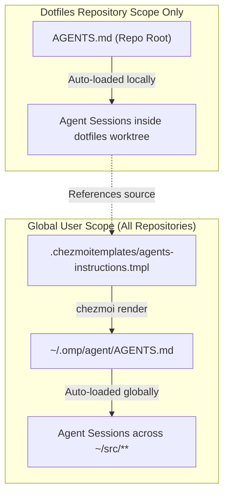

# Refactor Agent Instructions and Repository Supplement Boundary Plan

## Goal Capsule

- **Objective:** Eliminate AI agent confusion between machine-wide global instructions and repository-local rules by strictly defining the boundary between `.chezmoitemplates/agents-instructions.tmpl` (global user-scoped core rendered into `~/.omp/agent/AGENTS.md`) and `AGENTS.md` (dotfiles repository supplement), removing obsolete multi-harness scaffolding, moving Chezmoi-specific skip rules into local scope, and condensing verbose architectural narratives into actionable operational invariants.
- **Means:** Refactor `.chezmoitemplates/agents-instructions.tmpl` and `AGENTS.md` in place, update cross-referencing text, migrate Chezmoi skip declaration rules to `AGENTS.md`, adjust `.ci/test-agent-instructions.sh` needles, streamline `agents-instructions.tmpl` for single-harness OMP deployment, and verify rendered output against all CI needle and seat routing contracts.
- **Product authority:** User-directed decisions in this brainstorm session; CI instruction tests `.ci/test-agent-instructions.sh` and `.ci/check-omp-seat-routing.sh`.
- **Open blockers:** None.

---

## Product Contract

### Summary

This change establishes a clean, unambiguous separation of responsibility between the global user-scoped instruction template (`.chezmoitemplates/agents-instructions.tmpl`) and the dotfiles repository supplement (`AGENTS.md`). The global template retains only universal development practices, safety boundaries, delegation seat routing, and tool policies across all repositories, simplified for single-harness OMP deployment. The root `AGENTS.md` governs Chezmoi source attributes, host facts, script lifecycles (incorporating Chezmoi skip declarations), and local verification workflows, with historical architectural essays compressed into direct operational invariants.

### Problem Frame

AI agents working in this repository frequently confuse `AGENTS.md` (in the repository root) and `.chezmoitemplates/agents-instructions.tmpl` (which renders to `~/.omp/agent/AGENTS.md`). Several factors cause this confusion:

1. **Ambiguous Framing in Openings:** The global template contains phrases like "The repository root `AGENTS.md` is the local supplement; read it before changing this checkout", which confuses agents working in non-dotfiles repositories or makes agents in the dotfiles checkout uncertain whether an instruction edit belongs in the global core or local supplement.
2. **Boundary Leakage:** The global template contains dotfiles-specific Chezmoi skip declarations (`skip_here`, `skip_step`, `done_here`, `not_applicable`, `harmless`, `transient-tolerable`, `transient-blocking`), which are irrelevant to general projects under `~/src/`.
3. **Multi-Harness Scaffolding Leftovers:** Following the unmanagement of legacy harnesses (Claude, Codex, OpenCode, AGY, Pi), `.chezmoitemplates/agents-instructions.tmpl` still retains conditional logic (`{{- if eq .harness "omp" }}`) and references to "composed per harness into each agent wrapper", even though OMP is the sole managed harness.
4. **Verbose Architectural Essays in AGENTS.md:** The repository `AGENTS.md` contains over 130 lines of detailed background justification (AI benchmark index scores, model comparison essays, tmux graphics escape transport history) that obscure actionable rules and consume unnecessary agent context tokens.

### Key Decisions

- **KTD1. Strict Global vs Local Role Boundary.** `.chezmoitemplates/agents-instructions.tmpl` is designated exclusively as the user-scoped cross-repository instruction core (deployed to `~/.omp/agent/AGENTS.md`), while the repository root `AGENTS.md` is designated exclusively as the dotfiles repository supplement. (session-settled: user-directed — chosen over keeping blurred boundaries: prevents target and rule confusion across repositories). Governs R1, R2, R4, R5.
- **KTD2. Relocate Chezmoi Skip Declarations to AGENTS.md and Prune Test Needles.** The `## Skip declarations` section in `.chezmoitemplates/agents-instructions.tmpl` is moved to `AGENTS.md` under `## Apply lifecycle and script tree`. Corresponding skip-related positive needles are removed from `.ci/test-agent-instructions.sh`, delegating script skip enforcement to `.ci/check-skip-declarations.sh`. (session-settled: user-directed — chosen over keeping Chezmoi needles in the global instruction test). Governs R3, R6, R13.
- **KTD3. Streamline agents-instructions.tmpl for Single-Harness OMP.** Remove remaining `{{- if eq .harness ... }}` conditional blocks and multi-wrapper phrasing, structuring the template as the direct OMP instruction core. (session-settled: user-directed — chosen over preserving obsolete multi-harness scaffolding). Governs R7, R8, R11, R12.
- **KTD4. Condense AGENTS.md Architectural Narratives into Operational Invariants.** Transform narrative essays in `## Agent surfaces and ownership` into concise, actionable invariant rules (model role mappings, fallback prohibition, tmux passthrough+protocol pair requirements, single-source-of-truth pointers) while pruning benchmark metrics and historical bug anecdotes. (session-settled: user-directed — chosen over separate doc migration or keeping narrative prose). Governs R9, R10.

### Requirements

#### Global Instruction Core (`.chezmoitemplates/agents-instructions.tmpl`)

- R1. The opening framing MUST explicitly define the file as the machine-wide user-scoped instruction core deployed to `~/.omp/agent/AGENTS.md`, and MUST clarify that any repository-root instruction file (`AGENTS.md` or equivalent) acts as a local supplement for that specific repository.
- R2. The template MUST contain only cross-repository developer workflows, communication/writing standards (ASD-STE100), safe execution boundaries, git conventions, delegation table and reservation list, tool preferences, and language ecosystem rules (JS/mise/GitLab).
- R3. The Chezmoi-specific `## Skip declarations` section MUST be removed from `.chezmoitemplates/agents-instructions.tmpl`.
- R4. All positive needles asserted by `.ci/test-agent-instructions.sh` that belong to global rules MUST be preserved verbatim or updated synchronously in both the template and the test.
- R5. The delegation routing table in the template MUST retain the exact markdown table shape (`| <Work shape> | `<Seat>` | <Access> |`) required by `.ci/check-omp-seat-routing.sh`.

#### Repository Supplement (`AGENTS.md`)

- R6. `AGENTS.md` MUST explicitly state that its rules apply solely to the `github.com/hyperlapse122/dotfiles` checkout and MUST incorporate the complete Chezmoi script skip declaration contract (`skip_here`, `skip_step`, `done_here`, `not_applicable`, `harmless`, `transient-tolerable`, `transient-blocking`, and `dotfiles-skips`) under `## Apply lifecycle and script tree`.
- R7. The opening framing in `AGENTS.md` MUST clearly reference `.chezmoitemplates/agents-instructions.tmpl` as the source template for the user-scoped global core and direct agents to edit the template when modifying global instructions.
- R8. Stale references to retired multi-harness wrappers (e.g. "each agent wrapper") MUST be removed or updated, while active OMP instruction targets (AGENTS.md and APPEND_SYSTEM.md) remain accurately documented.
- R9. The `## Agent surfaces and ownership` section in `AGENTS.md` MUST be streamlined: lengthy architectural background essays (such as Artificial Analysis index rankings, detailed model capability tradeoffs, and DCS vs APC tmux Kitty graphics escape sequence deep-dives) MUST be condensed into concise operational constraints, invariants, and single-source-of-truth pointers.
- R10. `AGENTS.md` MUST preserve all load-bearing Chezmoi source conventions, fact gate definitions, `/etc` manifest ownership rules, isolated verification recipes (`chezmoi execute-template`), and the single-source-of-truth table.

#### Template Simplification and Verification

- R11. `.chezmoitemplates/agents-instructions.tmpl` MUST eliminate all `{{- if eq .harness "omp" }}` conditional wrappers, presenting an unconditional, clean markdown body.
- R12. `dot_omp/private_agent/private_readonly_AGENTS.md.tmpl` MUST continue to render `.chezmoitemplates/agents-instructions.tmpl` cleanly.
- R13. `.ci/test-agent-instructions.sh` MUST be updated by removing the relocated skip-related positive needles (lines 76-79), and MUST pass with zero errors.
- R14. `.ci/check-omp-seat-routing.sh` MUST pass with zero errors on the rendered output.

### Acceptance Examples

- AE1. Clear Role Identification
  - **Given:** An AI agent inspects either instruction file.
  - **When:** Reading the header of `AGENTS.md` or `.chezmoitemplates/agents-instructions.tmpl`.
  - **Then:** The agent immediately identifies whether the file is the global cross-repo core (`agents-instructions.tmpl`) or the dotfiles-local supplement (`AGENTS.md`), with unambiguous edit target guidance.
  - **Covers:** R1, R6, R7

- AE2. No Chezmoi Rules in Global Template
  - **Given:** `.chezmoitemplates/agents-instructions.tmpl` is rendered via `chezmoi execute-template`.
  - **When:** Grepping for `skip_here`, `skip_step`, `dotfiles-skips`, or `Chezmoi script early exits` in the rendered output.
  - **Then:** No matches are found in the global rendered output, while `AGENTS.md` contains the full skip declaration contract.
  - **Covers:** R3, R6

- AE3. Unconditional OMP Template Body
  - **Given:** `.chezmoitemplates/agents-instructions.tmpl` source file.
  - **When:** Inspecting template syntax.
  - **Then:** No `{{ if eq .harness ... }}` or harness conditional branches remain in the file.
  - **Covers:** R11, R12

- AE4. CI Gate Compliance
  - **Given:** Updated instruction template, repository `AGENTS.md`, and CI scripts.
  - **When:** Running `.ci/test-agent-instructions.sh` and `.ci/check-omp-seat-routing.sh`.
  - **Then:** Both tests pass with return code 0 and confirm all required needles and seat routing rows are present without skip-related needle failures.
  - **Covers:** R4, R5, R13, R14

### Scope Boundaries

- **In Scope:**
  - Refactoring `.chezmoitemplates/agents-instructions.tmpl` and `AGENTS.md`.
  - Updating `.ci/test-agent-instructions.sh` to remove relocated skip needles.
  - Verifying rendered output with `.ci/check-omp-seat-routing.sh`, `.ci/test-agent-instructions.sh`, and isolated `chezmoi execute-template`.
- **Out of Scope:**
  - Changing functional behavior of git workflow, branch prefix conventions, Conventional Commits, or issue handling rules.
  - Changing the bundled seat routing table or adding/removing OMP seats.
  - Deploying changes to live `$HOME` (handled separately when requested by the user).

---

## Planning Contract

### High-Level Technical Design

The implementation is executed as three coordinated, atomic steps:

1. **Global Instruction Core Streamlining (`.chezmoitemplates/agents-instructions.tmpl`):**
   - Rewrite header and footer to establish universal cross-repo scope.
   - Delete `## Skip declarations` section.
   - Remove `{{- if eq .harness "omp" }}` conditionals (lines 73 and 103) and render unconditional markdown.
   - Maintain exact seat routing table and all non-skip positive needles.

2. **Repository Supplement Restructuring (`AGENTS.md`):**
   - Rewrite header to explicitly declare dotfiles-only scope and point global edits to `.chezmoitemplates/agents-instructions.tmpl`.
   - Incorporate the full Chezmoi skip declaration contract under `## Apply lifecycle and script tree`.
   - Compress `## Agent surfaces and ownership` by replacing verbose narrative essays with direct operational constraints (model roles, fallback prohibition, tmux Kitty passthrough pair requirement, single-source-of-truth data links).
   - Ensure all fact gates, system manifest rules, and isolated test recipes remain intact.

3. **CI Test Needle Alignment (`.ci/test-agent-instructions.sh`):**
   - Remove the four skip-related needles from the positive needle list in `test-agent-instructions.sh`.
   - Run the full suite of verification scripts to guarantee zero regressions.

### Assumptions

- `dot_omp/private_agent/private_readonly_AGENTS.md.tmpl` is the sole surviving harness wrapper, including `agents-instructions.tmpl` with `(dict "harness" "omp")`.
- `APPEND_SYSTEM.md` remains an actively managed target for OMP system prompt injection under `dot_omp/private_agent/private_readonly_APPEND_SYSTEM.md`.
- Relocating skip declarations out of the global template does not weaken script skip enforcement, as `.ci/check-skip-declarations.sh` statically analyzes rendered scripts across all chezmoi `run_` scripts.

---

## Implementation Units

### U1. Refactor Global Instruction Template (`.chezmoitemplates/agents-instructions.tmpl`)

- **Goal:** Update `.chezmoitemplates/agents-instructions.tmpl` to be an unconditional, clean, user-scoped global instruction core without Chezmoi-specific rules or multi-harness conditional blocks.
- **Requirements:** R1, R2, R3, R4, R5, R11, R12
- **Dependencies:** None
- **Files:** `.chezmoitemplates/agents-instructions.tmpl`
- **Approach:**
  1. Update opening lines 1-4: explicitly state that the file is the user-scoped instruction core rendered into `~/.omp/agent/AGENTS.md`, and that repository-root instruction files (`AGENTS.md` or equivalent) act as local supplements for individual checkouts.
  2. Remove the entire `## Skip declarations` section (lines 27-30).
  3. Remove `{{- if eq .harness "omp" }}` at line 73 and line 103, along with their matching `{{ end }}` tags, leaving the OMP delegation table, cross-model review seats, and glab CLI guidance unconditional.
  4. Update `## Project supplement` at lines 107-109: state generically that the target repository's root `AGENTS.md` (or repo instruction file) defines repository-specific attributes, delivery constraints, and verification workflows.
  5. Verify that all global positive needles required by `.ci/test-agent-instructions.sh` and the seat routing table required by `.ci/check-omp-seat-routing.sh` remain byte-intact.
- **Test Scenarios:**
  - Isolated render of `dot_omp/private_agent/private_readonly_AGENTS.md.tmpl` via `chezmoi execute-template` succeeds with zero template errors.
  - Rendered output contains no Chezmoi skip rules or harness conditional markers.
- **Verification:** `chezmoi execute-template < dot_omp/private_agent/private_readonly_AGENTS.md.tmpl` produces valid markdown.

### U2. Refactor Repository Supplement (`AGENTS.md`)

- **Goal:** Clarify `AGENTS.md` as the dotfiles-only repository supplement, integrate the Chezmoi skip declaration contract under script lifecycles, and condense verbose architectural essays into concise operational invariants.
- **Requirements:** R6, R7, R8, R9, R10
- **Dependencies:** U1
- **Files:** `AGENTS.md`
- **Approach:**
  1. Update opening lines 1-4: declare that this file is the repository supplement for `github.com/hyperlapse122/dotfiles` only, and direct agents to edit `.chezmoitemplates/agents-instructions.tmpl` for global instruction changes.
  2. Under `## Apply lifecycle and script tree`, add the complete skip declaration specification: `skip_here`, `skip_step`, `done_here`, `not_applicable` call forms, `harmless`, `transient-tolerable`, `transient-blocking` skip directions, and the `dotfiles-skips` inspection command.
  3. Under `## Agent surfaces and ownership`:
     - Condense the lengthy model policy rationale (Artificial Analysis benchmarks, Gemini Flash vs Sonnet 5 reasoning, Claude Fable 5 allocations, disabled providers) into concise, operational rules and single-source-of-truth references (`.chezmoidata/agents.yaml`).
     - Condense the tmux Kitty passthrough essay (APC vs DCS graphics protocol escape handling) into the essential operational constraint: `allow-passthrough on` and `PI_FORCE_IMAGE_PROTOCOL kitty` must remain paired in `dot_config/tmux/tmux.conf` to support OMP inline images, verified by `.ci/test-tmux-kitty-passthrough.sh`.
     - Update stale references to retired multi-harness wrappers while affirming active OMP targets (`AGENTS.md` and `APPEND_SYSTEM.md`).
  4. Ensure all fact gates, system manifest rules, single-source-of-truth table, and isolated verification recipes remain intact.
- **Test Scenarios:**
  - `AGENTS.md` clearly states its dotfiles scope and references the global template.
  - Complete skip declaration rules are present in `AGENTS.md`.
  - Operational invariants for model roles and tmux Kitty passthrough are preserved concisely.
- **Verification:** Markdown formatting and repository structure review.

### U3. Synchronize CI Needle Tests and Verify Full Test Suite

- **Goal:** Update `.ci/test-agent-instructions.sh` to remove relocated skip needles and verify all instruction and skip test suites reach terminal green.
- **Requirements:** R4, R5, R13, R14
- **Dependencies:** U1, U2
- **Files:** `.ci/test-agent-instructions.sh`
- **Approach:**
  1. Edit `.ci/test-agent-instructions.sh` to remove the 4 positive needles corresponding to Chezmoi skip declarations (lines 76-79).
  2. Run `.ci/test-agent-instructions.sh` to confirm all surviving needles and banned needle checks pass.
  3. Run `.ci/check-omp-seat-routing.sh` to confirm the seat routing table matches bundled OMP seats.
  4. Run `.ci/check-skip-declarations.sh` to confirm Chezmoi script skip validation remains fully functional.
  5. Run repository-wide render gate checks via isolated scratch execution.
- **Test Scenarios:**
  - `.ci/test-agent-instructions.sh` exits 0.
  - `.ci/check-omp-seat-routing.sh` exits 0.
  - `.ci/check-skip-declarations.sh` exits 0.
- **Verification:** Execute all test scripts via bash and verify exit code 0.

---

## Verification Contract

| Test Command | Purpose | Expected Outcome | Governs |
|---|---|---|---|
| `.ci/test-agent-instructions.sh` | Validate positive and banned needles on rendered global agent instructions | Exit code 0, "agent instruction gates passed" | R1, R2, R3, R4, R13 |
| `.ci/check-omp-seat-routing.sh` | Validate 1:1 parity between bundled OMP seats and delegation routing table | Exit code 0, "check-omp-seat-routing: 7 bundled agents all routed" | R5, R14 |
| `.ci/check-skip-declarations.sh` | Validate Chezmoi script early exit and skip declarations across run_ scripts | Exit code 0, all script skip declarations verified | R6 |
| `chezmoi execute-template < dot_omp/private_agent/private_readonly_AGENTS.md.tmpl` | Validate clean template compilation of global instructions | Exit code 0, non-empty rendered markdown output | R11, R12 |

---

## Definition of Done

1. `.chezmoitemplates/agents-instructions.tmpl` contains only universal cross-repository instructions with no Chezmoi skip rules or multi-harness conditional wrappers (`{{- if eq .harness ... }}`).
2. `AGENTS.md` explicitly defines its dotfiles-only scope, references `.chezmoitemplates/agents-instructions.tmpl` for global instruction edits, incorporates the Chezmoi skip declaration contract, and condenses architectural essays into crisp operational invariants.
3. `.ci/test-agent-instructions.sh` has relocated skip needles pruned and passes with exit code 0.
4. `.ci/check-omp-seat-routing.sh` passes with exit code 0.
5. `.ci/check-skip-declarations.sh` passes with exit code 0.
6. All changes are verified in isolated scratch environments without modifying live `$HOME`.
