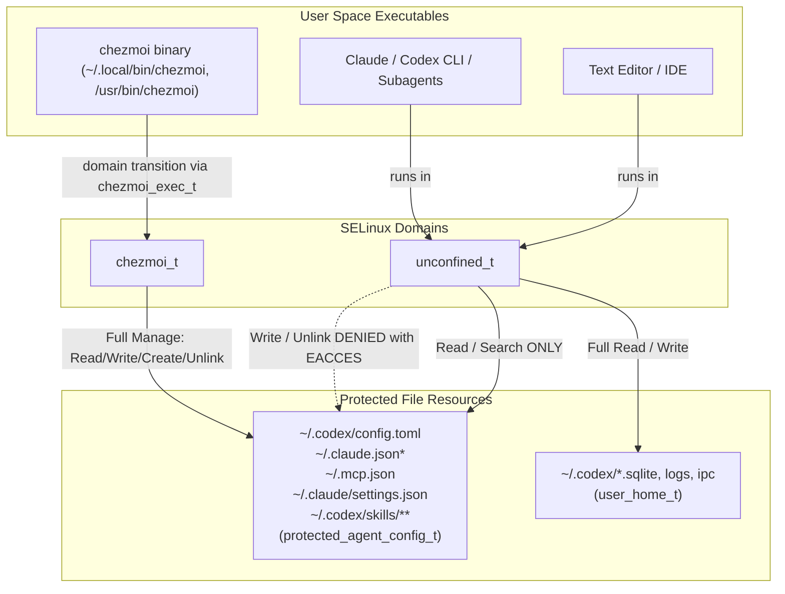

# SELinux Policy for Protected Agent and MCP Configurations - Plan

## Goal Capsule

- **Objective:** Prevent accidental modifications, writes, or deletions of user-scoped agent, skill, and MCP configurations (`~/.codex/config.toml`, `~/.claude.json*`, `~/.mcp.json`, `~/.codex/skills/**`, `~/.claude/settings.json`) from any non-chezmoi executable by enforcing SELinux Type Enforcement on Fedora, while preserving chezmoi as the sole authorized write-capable management domain.
- **Means:** A declarative SELinux CIL policy module (`system/linux/selinux/dotfiles_protected_agent_configs.cil`) deployed and maintained via a fingerprinted chezmoi onchange script with `restorecon` relabeling (KTD1, KTD4).
- **Product authority:** The user's session-settled choices govern target file scope, strict dotfiles-first editing constraints, automated CIL module packaging, and apply-time fingerprint caching.
- **Execution profile:** Manifest-driven source additions in `system/linux/selinux/` and `.chezmoiscripts/` with host fact gating. Intermediate source states do not apply to live `$HOME`.
- **Stop conditions:** Stop if non-Fedora or container environments fail to skip cleanly, if dynamic runtime files in `~/.codex/` (sqlite databases/logs) are inadvertently blocked from normal unconfined operation, or if `chezmoi apply` cannot transition cleanly into the writer domain.
- **Tail ownership:** Local verification uses isolated scratch rendering, CIL syntax validation (`secilc` / `checkmodule`), and script skip-declaration checks (`.ci/check-skip-declarations.sh`). Pull request owns `render-dotfiles.yml` and `ci.yml` validation.

---

## Product Contract

*(Product Contract preservation: Product Contract unchanged)*

### Summary

A declarative SELinux CIL policy module on Fedora that restricts write, create, rename, and delete operations on user-scope agent, skill, and MCP configurations (`~/.codex/config.toml`, `~/.claude.json*`, `~/.mcp.json`, `~/.codex/skills/**`, `~/.claude/settings.json`) exclusively to `chezmoi`, denying all other user processes and background agent tools with `EACCES`.

### Problem Frame

AI agent harnesses and CLI utilities running in the user session can accidentally overwrite, mutate, or inject skills and MCP server registrations directly into `$HOME` dotfiles without going through version-controlled repository review. Because standard POSIX permissions (`chmod 0444`) do not prevent the file owner from unlinking or recreating files, and file immutability (`chattr +i`) requires root elevation for every edit, standard DAC mechanisms cannot enforce a process-scoped boundary between chezmoi management and arbitrary user-space executables.

### Key Decisions

- **SELinux CIL domain-transition architecture over file immutability.** (session-settled: user-directed — chosen over chattr +i / wrapper scripts: enables process-level domain boundaries without requiring root elevation during normal daily edits). Governs R1, R2, R3, R4.
- **Named configuration files and skill/plugin subtrees over exact top-level files only.** (session-settled: user-directed — chosen over locking only the 3 top-level files: ensures both configuration manifests and installed skill trees are protected from tool-level writes). Governs R1, R2.
- **Strict dotfiles-first editing model over manual override helpers.** (session-settled: user-directed — chosen over sudo/unprotect override helpers: enforces that all changes must flow through the dotfiles repository and `chezmoi apply`). Governs R3, R4.
- **Fingerprinted onchange script with chezmoi state caching.** (session-settled: user-directed — chosen over unconditional run_after script: ensures the SELinux module is compiled and installed via `sudo semodule -i` only when source policy definitions change). Governs R6, R7.
- **Host and platform gating on Linux, Fedora, and active SELinux.** (session-settled: user-approved — chosen over universal execution: non-SELinux systems, macOS, and containers safely skip policy installation). Governs R8.

### Requirements

**Policy Definition & Type Enforcement**

- R1. The system must define an SELinux CIL policy module declaring a dedicated file type `protected_agent_config_t`, a management domain `chezmoi_t`, and an executable entrypoint `chezmoi_exec_t`.
- R2. The policy must assign `protected_agent_config_t` file contexts (`filecon`) to `~/.codex/config.toml`, `~/.claude.json*`, `~/.mcp.json`, `~/.codex/skills(/.*)?`, and `~/.claude/settings.json`.
- R3. The policy must grant `chezmoi_t` full management permissions (`create`, `read`, `write`, `setattr`, `unlink`, `rename`, `open`) on `protected_agent_config_t` files and directories.
- R4. The policy must restrict all other user session domains (`unconfined_t`, desktop apps, IDEs, agent CLIs) to read-only access (`read`, `open`, `getattr` on files and `search` on directories), denying all write, append, create, rename, and unlink operations with `EACCES`.

**Binary Entrypoints & Domain Transition**

- R5. The policy must label `/usr/bin/chezmoi`, `/usr/local/bin/chezmoi`, and `/home/*/.local/bin/chezmoi` with `chezmoi_exec_t`, and configure an automatic domain transition from `unconfined_t` to `chezmoi_t` upon execution.

**Apply Lifecycle & Fingerprint Caching**

- R6. The policy deployment must be managed via a `run_onchange_after_` script in `.chezmoiscripts/` that uses `fingerprint.tmpl` to hash the raw CIL source, executing `sudo semodule -i` only when the policy source changes.
- R7. The apply script must execute `restorecon -RFv` across the designated target paths upon policy installation to ensure correct label application across existing files.

**Host Gating & Platform Fallbacks**

- R8. The SELinux policy installation must gate on Linux, Fedora distro, and active SELinux enforcement (`sestatus` / `facts.tmpl`), taking a declared `harmless` skip on non-Linux/non-Fedora/container environments.

### Actors

- `chezmoi` (A1): The dotfiles manager binary running in `chezmoi_t`, authorized to apply, create, and modify protected configuration files.
- `User processes & Agent harnesses` (A2): Interactive shells, IDEs, Claude CLI, Codex CLI, and subagents running in `unconfined_t`, authorized to read but blocked from writing protected configs.
- `SELinux kernel subsystem` (A3): The kernel security subsystem enforcing Type Enforcement and emitting AVC denial audit events on unauthorized write attempts.

### Key Flows

- F1. Authorized Configuration Update via Chezmoi
  - **Trigger:** User runs `chezmoi apply` after editing dotfiles source.
  - **Actors:** A1, A3
  - **Steps:** User executes `chezmoi`; kernel detects `chezmoi_exec_t` entrypoint and transitions process from `unconfined_t` to `chezmoi_t`; `chezmoi_t` writes updated content to target `protected_agent_config_t` files; write succeeds.
  - **Covered by:** R1, R3, R5
- F2. Unauthorized Direct Edit or Tool Injection Blocked
  - **Trigger:** An agent CLI or editor attempts to write or delete `~/.claude.json` or `~/.codex/config.toml`.
  - **Actors:** A2, A3
  - **Steps:** Process running in `unconfined_t` issues `open(O_WRONLY)` or `unlink()`; SELinux checks permissions against `protected_agent_config_t`; permission is denied; kernel returns `EACCES` and logs an AVC denial to auditd.
  - **Covered by:** R2, R4

### Acceptance Examples

- AE1. Blocked Direct Modification
  - **Given:** Target file `~/.codex/config.toml` is labeled `unconfined_u:object_r:protected_agent_config_t:s0`.
  - **When:** An unconfined command executes `echo "hack" >> ~/.codex/config.toml` or `rm ~/.codex/config.toml`.
  - **Then:** The command fails with `Permission denied` (`EACCES`), and `ausearch -m avc -ts recent` records a denial for `unconfined_t` accessing `protected_agent_config_t`.
  - **Covers:** R2, R4
- AE2. Permitted Chezmoi Apply
  - **Given:** Chezmoi binary is labeled `system_u:object_r:chezmoi_exec_t:s0`.
  - **When:** User executes `chezmoi apply --source "$PWD"`.
  - **Then:** Chezmoi successfully updates `~/.codex/config.toml` without AVC denials, and the resulting file retains `protected_agent_config_t`.
  - **Covers:** R1, R3, R5, R7
- AE3. Unaffected Runtime State
  - **Given:** `~/.codex/` contains dynamic runtime databases (`goals_1.sqlite`, `logs_2.sqlite`, `state_5.sqlite`).
  - **When:** Codex runtime reads and writes to its database and cache files.
  - **Then:** Database writes succeed without SELinux denials because dynamic runtime files retain standard `user_home_t` labels.
  - **Covers:** R2

### Scope Boundaries

**In scope:**

- Declarative CIL module in dotfiles source (`system/linux/selinux/dotfiles_protected_agent_configs.cil`).
- Dedicated onchange apply script in `.chezmoiscripts/` with fingerprinting and restorecon.
- Path definitions for `~/.codex/config.toml`, `~/.claude.json*`, `~/.mcp.json`, `~/.codex/skills/**`, `~/.claude/settings.json`.
- Binary labeling for `/usr/bin/chezmoi` and `~/.local/bin/chezmoi`.

**Deferred for later:**

- Fine-grained per-tool isolation (e.g. creating dedicated confined domains for each individual AI CLI tool).
- Custom desktop notification daemon for AVC denial events.

**Outside this product's identity:**

- Non-SELinux MAC systems (AppArmor, macOS sandbox rules).
- Hardening runtime sqlite database files inside `~/.codex/` that require frequent application writes.

### Success Criteria

- SC1. Unauthorized writes to protected config files fail with `EACCES` across all tested non-chezmoi executables.
- SC2. `chezmoi apply` succeeds without manual intervention or permission errors on all protected paths.
- SC3. SELinux module installation runs only once per source change, skipping on subsequent idempotent `chezmoi apply` runs.
- SC4. Non-Fedora, macOS, and container environments pass rendering and apply with zero errors and clean declared skips.

---

## Planning Contract

### Key Technical Decisions

- KTD1. **SELinux Common Intermediate Language (CIL) format over binary .pp packaging.** (session-settled: user-directed — chosen over checkmodule/semodule_package toolchain: CIL is natively supported by `semodule -i` on Fedora without requiring `selinux-policy-devel` build headers). Governs R1, R2, R3, R4, R5.
- KTD2. **Dynamic unconfined domain-transition for `chezmoi` via `chezmoi_exec_t`.** (session-settled: user-directed — chosen over manual permission toggles or sudo wrappers: allows seamless `chezmoi apply` execution while blocking all non-chezmoi user session processes). Governs R1, R3, R5.
- KTD3. **Explicit `filecon` patterns for protected user config and skill paths.** (session-settled: user-directed — chosen over broad directory-level confinement: precisely protects configuration manifests while allowing runtime sqlite databases and logs in `~/.codex/` to remain unconfined). Governs R2, R4.
- KTD4. **Declarative apply script with `fingerprint.tmpl` hash caching.** (session-settled: user-directed — chosen over unconditional run_after script: prevents repeated `semodule` compilation overhead on every apply). Governs R6, R7.
- KTD5. **Host fact gating via Linux, Fedora, and SELinux enforcement probes.** (session-settled: user-approved — chosen over universal execution: ensures clean `harmless` skips on macOS, containers, and non-Fedora distros). Governs R8.

### High-Level Technical Design



### Output Structure

New files created in the repository:

```text
system/linux/selinux/
└── dotfiles_protected_agent_configs.cil
.chezmoiscripts/30-linux/
└── run_after_selinux-policies.sh.tmpl
```

### Technical Design Notes

1. **CIL Policy Definition Mechanics:**
   - Type definitions:
     - `(type protected_agent_config_t)`
     - `(roletype object_r protected_agent_config_t)`
     - `(type chezmoi_t)`
     - `(roletype unconfined_r chezmoi_t)`
     - `(type chezmoi_exec_t)`
     - `(roletype object_r chezmoi_exec_t)`
     - `(typeattribute chezmoi_exec_t (file_type exec_type))`
   - Domain transition:
     - `(typetransition unconfined_t chezmoi_exec_t process chezmoi_t)`
     - `(allow unconfined_t chezmoi_exec_t (file (read getattr execute open map)))`
     - `(allow unconfined_t chezmoi_t (process (transition)))`
     - `(allow chezmoi_t chezmoi_exec_t (file (entrypoint read getattr execute open map)))`
     - `(allow chezmoi_t unconfined_t (process (sigchld signull sigkill sigterm signal)))`
     - `(allow chezmoi_t unconfined_t (fd (use)))`
     - `(allow chezmoi_t user_devpts_t (chr_file (read write ioctl getattr append open)))`
   - Permissions:
     - `chezmoi_t` receives full create, read, write, getattr, setattr, unlink, rename, open, append, map on `protected_agent_config_t` files and directories.
     - `unconfined_t` receives only read, getattr, open, map on `protected_agent_config_t` files, and read, getattr, open, search on `protected_agent_config_t` directories.
   - File context (`filecon`) regex rules:
     - `(filecon "/home/[^/]+/\.codex/config\.toml" file (unconfined_u object_r protected_agent_config_t ((s0)(s0))))`
     - `(filecon "/home/[^/]+/\.claude\.json.*" file (unconfined_u object_r protected_agent_config_t ((s0)(s0))))`
     - `(filecon "/home/[^/]+/\.mcp\.json" file (unconfined_u object_r protected_agent_config_t ((s0)(s0))))`
     - `(filecon "/home/[^/]+/\.claude/settings\.json" file (unconfined_u object_r protected_agent_config_t ((s0)(s0))))`
     - `(filecon "/home/[^/]+/\.codex/skills(/.*)?" any (unconfined_u object_r protected_agent_config_t ((s0)(s0))))`
     - `(filecon "/usr/bin/chezmoi" file (system_u object_r chezmoi_exec_t ((s0)(s0))))`
     - `(filecon "/usr/local/bin/chezmoi" file (system_u object_r chezmoi_exec_t ((s0)(s0))))`
     - `(filecon "/home/[^/]+/\.local/bin/chezmoi" file (unconfined_u object_r chezmoi_exec_t ((s0)(s0))))`

2. **Apply Script Integration:**
   - Placed at `.chezmoiscripts/30-linux/run_after_selinux-policies.sh.tmpl`.
   - Fingerprints `system/linux/selinux/dotfiles_protected_agent_configs.cil`.
   - Checks `sudo-usable` capability probe and handles skip declaration (`skip.sh.tmpl`).
   - Installs module with `sudo semodule -X 400 -i "$sourceDir/system/linux/selinux/dotfiles_protected_agent_configs.cil"`.
   - Relabels target files with `restorecon -RFv`.

---

## Implementation Units

### U1. Author SELinux CIL Policy Module

- **Goal:** Create the declarative SELinux CIL policy file defining `protected_agent_config_t`, `chezmoi_t`, `chezmoi_exec_t`, domain transitions, permissions, and file context specifications.
- **Requirements:** R1, R2, R3, R4, R5
- **Dependencies:** None
- **Files:** `system/linux/selinux/dotfiles_protected_agent_configs.cil`
- **Approach:**
  1. Author `system/linux/selinux/dotfiles_protected_agent_configs.cil`.
  2. Declare types: `protected_agent_config_t`, `chezmoi_t`, `chezmoi_exec_t` with appropriate roles (`object_r`, `unconfined_r`).
  3. Declare domain transition from `unconfined_t` through `chezmoi_exec_t` into `chezmoi_t`.
  4. Grant `chezmoi_t` manage permissions on `protected_agent_config_t` and standard session inheritance permissions.
  5. Grant `unconfined_t` read-only access to `protected_agent_config_t`.
  6. Add `filecon` regex mappings for all named target paths and binary locations.
- **Execution note:** Ensure CIL syntax matches Fedora libsepol 3.11 specifications.
- **Patterns to follow:** System CIL definitions under `/var/lib/selinux/targeted/active/modules/400/`.
- **Test scenarios:**
  - `Test scenario: CIL syntax validation` — Verify `secilc` / `semodule` parses the CIL file without syntax errors. (Covers: R1, R5)
  - `Test scenario: Filecon path resolution` — Verify path regexes correctly match target dotfiles under user home directories. (Covers: R2)
- **Verification:** CIL source file exists and is valid syntax.

### U2. Create Chezmoi Onchange Apply Script

- **Goal:** Manage policy compilation, installation via `semodule -i`, and filesystem relabeling via `restorecon`, gated on Fedora Linux with SELinux active and cached via source fingerprinting.
- **Requirements:** R6, R7, R8
- **Dependencies:** U1
- **Files:** `.chezmoiscripts/30-linux/run_after_selinux-policies.sh.tmpl`
- **Approach:**
  1. Author `.chezmoiscripts/30-linux/run_after_selinux-policies.sh.tmpl`.
  2. Embed template fingerprint of `system/linux/selinux/dotfiles_protected_agent_configs.cil`.
  3. Gate execution on `eq .chezmoi.os "linux"` and `eq .chezmoi.osRelease.id "fedora"`.
  4. Query host fact / runtime `sestatus` or `selinuxenabled`; if disabled, skip cleanly using `skip_here` (`harmless`).
  5. Verify sudo capability with `capabilities.tmpl` (`sudo-usable`); if unavailable, skip using `transient-blocking`.
  6. Execute `sudo semodule -X 400 -i "$sourceDir/system/linux/selinux/dotfiles_protected_agent_configs.cil"`.
  7. Run `restorecon -RFv` across protected config files and chezmoi binaries in `$HOME`.
- **Execution note:** Follow the repository's `.chezmoitemplates/skip.sh.tmpl` contract for all early exit paths.
- **Patterns to follow:** `.chezmoiscripts/30-linux/run_onchange_after_install-system-10-files.sh.tmpl` and `.chezmoiscripts/20-base/fedora/run_onchange_before_base.sh.tmpl`.
- **Test scenarios:**
  - `Test scenario: Template rendering in scratch directory` — Render script template with empty config and stub op; verify rendered script contains expected bash code without unresolved variables. (Covers: R6, R8)
  - `Test scenario: Skip declaration compliance` — Run `.ci/check-skip-declarations.sh` to ensure all early exits use standard skip templates. (Covers: R8)
- **Verification:** Script renders cleanly in scratch chezmoi test and passes skip declaration checks.

### U3. End-to-End Type Enforcement & Verification Testing

- **Goal:** Validate that unauthorized writes to protected files fail with `EACCES` and generate AVC audit records, `chezmoi apply` updates succeed without errors, and runtime databases in `~/.codex/` remain fully functional.
- **Requirements:** R1, R2, R3, R4, R5, R6, R7, R8
- **Dependencies:** U1, U2
- **Files:** `tests/test_selinux_protected_configs.sh`
- **Approach:**
  1. Create automated verification test script.
  2. Test AE1: Verify `unconfined_t` process attempting `echo "test" >> ~/.codex/config.toml` fails with `Permission denied`.
  3. Test AE2: Verify `chezmoi apply` succeeds and writes updated content without AVC denials.
  4. Test AE3: Verify unconfined processes can read/write `~/.codex/goals_1.sqlite` and cache files without denial.
- **Execution note:** Run tests on a Fedora machine with SELinux in enforcing mode.
- **Patterns to follow:** Existing integration tests in `tests/` and `.ci/`.
- **Test scenarios:**
  - `Test scenario: Blocked direct modification (AE1)` — Given target file labeled `protected_agent_config_t`, when unconfined shell executes write or rm, then command fails with `Permission denied` (`EACCES`). (Covers: R2, R4, AE1)
  - `Test scenario: Permitted chezmoi apply (AE2)` — Given chezmoi binary labeled `chezmoi_exec_t`, when `chezmoi apply` runs, then config updates succeed with zero errors. (Covers: R1, R3, R5, R7, AE2)
  - `Test scenario: Unaffected runtime databases (AE3)` — Given `~/.codex/*.sqlite`, when accessed by unconfined tools, then operations succeed without SELinux denials. (Covers: R2, AE3)
- **Verification:** Test script runs and passes all scenarios.

---

## Verification Contract

| Command | Scope | Expected Outcome |
|---|---|---|
| `bash .ci/check-skip-declarations.sh` | Repository scripts | Passes with 0 errors; all early exits declared |
| `git diff --check` | Repository source | Clean whitespace, no git conflict markers |
| `chezmoi execute-template < .chezmoiscripts/20-linux-fedora/run_onchange_after_selinux-policies.sh.tmpl` | Template rendering | Valid bash script rendered without template errors |
| `bash tests/test_selinux_protected_configs.sh` | End-to-end policy check | Write blocked for unconfined, allowed for chezmoi |

---

## Definition of Done

- [ ] Declarative CIL policy module created at `system/linux/selinux/dotfiles_protected_agent_configs.cil`.
- [ ] Onchange apply script created at `.chezmoiscripts/30-linux/run_after_selinux-policies.sh.tmpl`.
- [ ] Policy correctly restricts write/unlink access to `chezmoi_t` while keeping `unconfined_t` read-only.
- [ ] Policy fingerprinting prevents redundant `semodule` execution on unchanged applies.
- [ ] Clean skips on non-Linux, non-Fedora, and container platforms verified via `.ci/check-skip-declarations.sh`.
- [ ] End-to-end verification confirms AE1, AE2, and AE3 pass.
