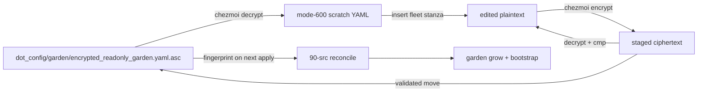

# Register fleet in the ~/src Garden Registry - Plan

## Goal Capsule

- **Objective:** Declare `https://git.jpi.app/infra/fleet.git` in the encrypted garden registry (`dot_config/garden/encrypted_readonly_garden.yaml.asc`) so `garden grow` and the 90-src bootstrap flow can provision it under `~/src/git.jpi.app/infra/fleet`.
- **Authority:** The user's request and target file define the requested change. Root `AGENTS.md` and repository instructions define the garden manifest edit and verification discipline.
- **Execution profile:** Lightweight data change — one tree stanza in `dot_config/garden/encrypted_readonly_garden.yaml.asc`.
- **Stop conditions:** Stop if the ciphertext cannot be decrypted, the edited plaintext does not round-trip byte-for-byte, or the manifest parser rejects the new tree.
- **Tail ownership:** The LFG pipeline owns commit, push, pull-request creation, and CI monitoring.

## Product Contract

### Summary

Add a `fleet` tree under `trees:` in `dot_config/garden/encrypted_readonly_garden.yaml.asc`, using the supplied URL `https://git.jpi.app/infra/fleet.git` and the standard shallow template shape for top-level group repositories. Keep decrypted YAML only in per-user scratch (`$XDG_RUNTIME_DIR`), then re-encrypt and replace the source only after the staged ciphertext passes the round-trip gate.

### Problem Frame

The garden registry is the source of truth for projects provisioned below `~/src`. The `infra/fleet` repository is absent from the registry. Adding it allows `garden grow fleet` (and the automated 90-src reconcile script) to clone the repository to `~/src/git.jpi.app/infra/fleet` and set up tracking.

### Requirements

- **R1.** A new `trees.fleet` entry exists with `url: https://git.jpi.app/infra/fleet.git`.
- **R2.** The entry resolves to path `git.jpi.app/infra/fleet` using `templates: shallow`.
- **R3.** The source change is limited to the new tree declaration; existing trees, comments, commands, and provisioner logic remain unchanged.
- **R4.** The new ciphertext decrypts to the intended YAML, the garden parser accepts it, and no plaintext registry copy enters the worktree.
- **R5.** The encrypted-source fingerprint consumed by the 90-src reconcile script changes with the ciphertext, so the next apply reconciles the newly declared tree.

### Scope Boundaries

**In scope:** One `trees:` insertion in `dot_config/garden/encrypted_readonly_garden.yaml.asc`; decrypt/edit/staged re-encrypt; round-trip, parse, fingerprint, and hygiene verification.

**Out of scope:**

- Running `garden grow`, `garden cmd`, `chezmoi apply`, or real network clone operations.
- Mutating `~/src` or creating aoe sessions.
- Changing the 90-src reconcile script or garden commands.
- Editing the deployed garden target or committing decrypted YAML.

## Planning Contract

### Key Technical Decisions

- **KTD1. Plain checkout with shallow template.** All `~/src` repositories use the `shallow` template (`depth: 1`, `single-branch: false`) with plain checkouts on their default branch.
- **KTD2. Verbatim top-level group path.** Map `https://git.jpi.app/infra/fleet.git` to `git.jpi.app/infra/fleet`. `infra` is a top-level group (not under the `products` umbrella), mirroring the pattern used for `works` (`git.jpi.app/hyperlapse/works`), `dimse-bridge` (`git.jpi.app/ohns-nav/dimse-bridge`), `knowledge-base` (`git.jpi.app/research/knowledge-base`), and `workspace` (`git.jpi.app/archer/workspace`).
- **KTD3. Preserve supplied HTTPS URL verbatim.** `https://git.jpi.app/infra/fleet.git` is authoritative and matches all other `git.jpi.app` entries.
- **KTD4. Stage ciphertext before replacing the source.** Encrypt to scratch, decrypt that staged file, and compare it to the edited plaintext before replacing `dot_config/garden/encrypted_readonly_garden.yaml.asc`. Direct redirection to the source can truncate the only ciphertext if encryption fails.
- **KTD5. No registry-specific test file.** This is data-only. Manifest parsing, ciphertext round-trip, source fingerprint check, and git hygiene provide the observable coverage without adding a test harness for one declaration.

### High-Level Technical Design



### Assumptions

- The host has the GPG private key and the configured chezmoi encryption settings needed to decrypt and re-encrypt the source.
- `chezmoi`, `garden`, `git`, and standard POSIX scratch utilities are available.

## Implementation Units

### U1. Add the fleet tree declaration

**Goal:** Add one valid tree entry for `fleet` and no unrelated manifest changes.

**Requirements:** R1, R2, R3, R4, R5

**Dependencies:** none

**Files:**

- `dot_config/garden/encrypted_readonly_garden.yaml.asc` — decrypt to scratch, edit, stage, validate, and replace the ciphertext.

**Approach:**

Create a `0700` scratch directory beneath `${XDG_RUNTIME_DIR:-$HOME/.cache}` with `umask 077` and an exit cleanup trap. Run chezmoi with `--source "$PWD"`. Decrypt the source to scratch, insert the following stanza among the top-level group trees:

```yaml
  fleet:
    templates: shallow
    path: git.jpi.app/infra/fleet
    url: https://git.jpi.app/infra/fleet.git
```

Encrypt the edited plaintext to a staged scratch file. Decrypt that staged ciphertext and compare it with the edited plaintext. Only after the comparison succeeds, move the staged ciphertext over `dot_config/garden/encrypted_readonly_garden.yaml.asc`. Remove all scratch plaintext and staged files through the cleanup trap.

**Test scenarios:**

- **Covers R1/R2.** The decrypted edited YAML contains exactly one `fleet` tree with the supplied URL, `git.jpi.app/infra/fleet` path, and `templates: shallow`.
- **Covers R3.** A plaintext diff against the pre-edit decrypt shows only the new tree lines; no existing tree, comment, or command body changes.
- **Covers R4.** Decrypting the staged ciphertext and comparing it with the edited plaintext succeeds before the source is replaced.
- **Covers R4.** `garden --config <scratch>/garden.yaml ls --all --no-commands --no-remotes --no-gardens --no-groups -v` accepts the manifest and resolves `fleet` to `git.jpi.app/infra/fleet` without growing it.
- **Covers R5.** Rendering the 90-src reconcile script shows a fingerprint for `dot_config/garden/encrypted_readonly_garden.yaml.asc` equal to the source ciphertext's SHA-256.
- **Covers hygiene.** After cleanup, no decrypted registry file exists in the worktree, `git status --porcelain` shows only the intended ciphertext and plan artifacts, and `git diff --check` is clean.

**Verification:** Run all scenarios locally. Do not run `chezmoi apply`, `garden grow`, `garden cmd`, or a command that reaches `git.jpi.app`.

## Verification Contract

Run from the checkout root. Keep plaintext only beneath a `0700` scratch directory under `${XDG_RUNTIME_DIR:-$HOME/.cache}`; never use `/tmp`, `/var/tmp`, or `/dev/shm`.

| Gate | Command | Proves |
|---|---|---|
| Decrypt | `chezmoi --source "$PWD" decrypt dot_config/garden/encrypted_readonly_garden.yaml.asc > "$scratch/current.yaml"` | The configured GPG key and source path work; plaintext stays outside the worktree |
| Staged round-trip | `chezmoi --source "$PWD" decrypt "$scratch/reenc.asc" \| cmp - "$scratch/edited.yaml"` | The replacement ciphertext preserves the exact edited plaintext before the move |
| Manifest parse | `garden --config "$scratch/edited.yaml" ls --all --no-commands --no-remotes --no-gardens --no-groups -v` | The new tree shape and path are accepted without network provisioning |
| Fingerprint | Render `.chezmoiscripts/90-src/run_onchange_after_reconcile-garden.sh.tmpl` and compare its registry fingerprint to `sha256sum dot_config/garden/encrypted_readonly_garden.yaml.asc` | The next apply sees the registry change |
| Scoped hygiene | `git diff --check`, `git status --short`, and a scoped diff review | No plaintext leak, whitespace damage, or unrelated source edit |

Prohibited as verification: `chezmoi apply`, `garden grow`, `garden cmd`, real `aoe` operations, and any operation that clones or fetches `https://git.jpi.app/infra/fleet.git`.

## Risks & Dependencies

- **Plaintext leak:** Mitigated by `umask 077`, a scratch directory outside the worktree, an exit trap, and a final status check.
- **Ciphertext loss:** Mitigated by encrypting to a staged file and validating its decrypt before `mv`; never redirect encryption directly onto the canonical source.
- **Tree shape consistency:** Verified against the standard top-level group pattern (`git.jpi.app/<group>/<project>` with `templates: shallow`).
- **Apply-time side effects:** The ciphertext fingerprint intentionally causes the existing 90-src script to run on the next user-initiated apply. Verification is strictly local and does not invoke `chezmoi apply`.

## Definition of Done

- R1 through R5 hold.
- The staged ciphertext round-trip and garden parse gates pass.
- The source ciphertext is the only requested manifest file changed; no plaintext registry copy remains.
- `git diff --check` is clean and the scoped diff contains no unrelated source edits.
- No live apply, clone, fetch, or aoe mutation was performed.
- The LFG shipping tail creates the required commit and handles remote delivery and CI.

## Sources & Research

- `dot_config/garden/encrypted_readonly_garden.yaml.asc` decrypted to scratch — current tree schema, top-level group conventions (`works`, `dimse-bridge`, `knowledge-base`, `workspace`), and the sanctioned edit procedure.
- `.chezmoiscripts/90-src/run_onchange_after_reconcile-garden.sh.tmpl` — encrypted-source fingerprint and bootstrap behavior.
- `docs/plans/2026-08-11-005-chore-garden-register-reepie-plan.md` and `docs/plans/2026-07-30-001-chore-garden-register-examvueduo-ai-plan.md` — prior plans establishing encryption and verification discipline for garden entries.
