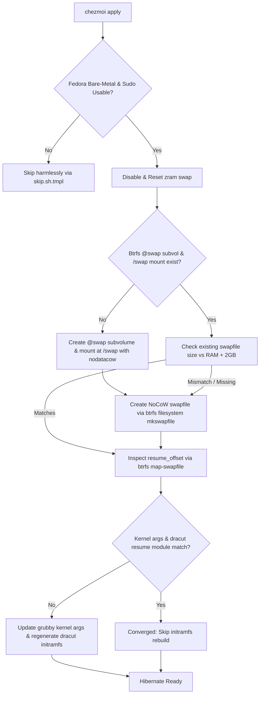

## Goal Capsule

- **Objective**: Establish reliable suspend-to-disk (hibernation) capability on Fedora systems using Btrfs through automated, idempotent dotfiles provisioning.
- **Means**: Provision a dedicated `@swap` Btrfs subvolume mounted at `/swap`, allocate a dynamic `RAM + 2GB` NoCoW swapfile, synchronize kernel resume arguments (`resume` and `resume_offset`) via `grubby`, configure the dracut initramfs resume module, and consolidate zram-swap disabling under a single modular installer (KTD1, KTD2).
- **Product Authority**: Governs Fedora bare-metal workstation system provisioning in `system/linux` and `.chezmoiscripts/30-linux/`. Non-Btrfs filesystems, multi-device RAID swapfiles, and container/cloud environments are out of scope.
- **Open Blockers**: none.

---

## Product Contract

### Summary

Automate the creation and maintenance of a Btrfs swapfile and hibernation subsystem on Fedora workstations during `chezmoi apply`. The provisioner isolates the swapfile in a dedicated `@swap` subvolume (`nodatacow`), computes a dynamic `RAM + 2GB` size, calculates physical `resume_offset` via `btrfs inspect-internal map-swapfile`, syncs kernel parameters and dracut initramfs, and relocates existing zram-swap disabling into a single swap lifecycle script.

### Problem Frame

Fedora workstations with Btrfs default to zram-only swap without disk swap, preventing suspend-to-disk (hibernation). Manually setting up a swapfile on Btrfs requires several interdependent steps: disabling Copy-on-Write (CoW), isolating the file from Btrfs snapshots to avoid snapshot creation failures, calculating physical extent offsets on disk, updating bootloader kernel command lines (`resume` and `resume_offset`), enabling dracut's `resume` module, and configuring SELinux file contexts. Integrating these steps into the dotfiles system provisioning tier guarantees that any Fedora bare-metal machine managed by this repository converges to a fully hibernate-capable state without manual interventions or SSD-wearing redundant operations.

### Key Decisions

- KD1. **Modular script provisioner in `30-linux`** (session-settled: user-directed — chosen over standalone CLI or manual guide: keeps system configuration declarative, reproducible, and automated via `chezmoi apply`). Governs R1, R2, R3, R4, R5, R6, R7, R8.
- KD2. **Dedicated `@swap` Btrfs subvolume mounted at `/swap`** (session-settled: user-directed — chosen over root subvolume `/var/swap`: isolates swapfile from snapshot utilities like Snapper/Timeshift to prevent Btrfs snapshot CoW errors). Governs R1, R2, R6.
- KD3. **Dynamic sizing policy of Physical RAM + 2GB** (session-settled: user-directed — chosen over 1:1 RAM or fixed size: guarantees sufficient swap space for complete memory image dumping with safety headroom under uncompressed memory workloads). Governs R2, R8.
- KD4. **Consolidate zram-swap disabling into swap provisioner** (session-settled: user-directed — chosen over leaving in `install-system-22-host`: unifies all swap allocation and lifecycle management under one dedicated installer module). Governs R5.



### Requirements

#### Subvolume and Storage Allocation

- R1. The provisioner must verify that the root filesystem is Btrfs and create a dedicated `@swap` subvolume mounted at `/swap` with `nodatacow` if it does not already exist.
- R2. The provisioner must calculate the swapfile size as total physical RAM plus 2GB headroom and allocate the swapfile at `/swap/swapfile` using `btrfs filesystem mkswapfile` (or explicit `chattr +C` zeroed allocation) with `0600` permissions.
- R3. The provisioner must apply the `swapfile_t` SELinux context to `/swap/swapfile` to ensure systemd and kernel activation succeed under enforcing mode.
- R4. The provisioner must persist the `/swap` subvolume mount and `/swap/swapfile` activation in `/etc/fstab` if not already present.

#### Service and Zram Lifecycle Consolidation

- R5. The provisioner must mask `systemd-zram-setup@.service`, deactivate any active `/dev/zram*` devices via `swapoff`, and reset zram devices via `zramctl --reset`, removing this logic from `.chezmoiscripts/30-linux/run_onchange_after_install-system-22-host.sh.tmpl`.

#### Kernel and Initramfs Integration

- R6. The provisioner must extract the filesystem UUID for `/swap` and compute the physical block offset using `btrfs inspect-internal map-swapfile -r /swap/swapfile`.
- R7. The provisioner must synchronize kernel arguments using `grubby --update-kernel=ALL` to ensure `resume=UUID=<btrfs-fs-uuid>` and `resume_offset=<offset>` are present across all installed kernels.
- R8. The provisioner must ensure `/etc/dracut.conf.d/resume.conf` contains `add_dracutmodules+=" resume "` and trigger an initramfs regeneration (`dracut -f`) only when kernel arguments or dracut configuration change.

#### Idempotency and Safety Verification

- R9. The provisioner must skip swapfile reallocation, formatting, and initramfs regeneration when an active swapfile of the expected size is present and the corresponding kernel parameters and dracut configuration are already in sync.
- R10. The provisioner must safely abort without modifying disks if free disk space on the target partition is less than the calculated swapfile size plus 4GB.

#### Required Package Installation

- R11. The provisioner must inspect whether required system tooling binaries (`btrfs`, `grubby`, `dracut`, `findmnt`) are present and install any missing packages (`btrfs-progs`, `grubby`, `dracut`, `util-linux`) via dnf.

### Key Flows

- KF1. **Initial Provisioning Flow**
  - **Trigger**: First `chezmoi apply` on a fresh Fedora bare-metal installation.
  - **Actors**: chezmoi provisioner script (`install-system-26-swap-hibernate`), root/sudo.
  - **Steps**:
    1. Guard probes confirm Linux, non-headless, Fedora, and usable sudo.
    2. Masks `systemd-zram-setup@.service` and deactivates existing zram swap.
    3. Verifies free disk space; creates Btrfs `@swap` subvolume on the root filesystem device and mounts it at `/swap` with `nodatacow`.
    4. Calculates target size (`RAM + 2GB`) and creates `/swap/swapfile` via `btrfs filesystem mkswapfile`.
    5. Sets `swapfile_t` SELinux context and adds fstab entries for `/swap` and `/swap/swapfile`.
    6. Computes `resume_offset` via `btrfs inspect-internal map-swapfile -r /swap/swapfile`.
    7. Updates all kernel entries via `grubby` with `resume=UUID=... resume_offset=...`.
    8. Writes `/etc/dracut.conf.d/resume.conf` and rebuilds initramfs with `dracut -f`.
    9. Activates swap with `swapon /swap/swapfile`.
  - **Outcome**: System has an active NoCoW swapfile and is configured for suspend-to-disk upon next hibernation invocation.
  - **Covered by**: R1, R2, R3, R4, R5, R6, R7, R8, R10.

- KF2. **Idempotent Convergence Flow**
  - **Trigger**: Routine subsequent `chezmoi apply`.
  - **Actors**: chezmoi provisioner script (`install-system-26-swap-hibernate`).
  - **Steps**:
    1. Detects existing active swap at `/swap/swapfile` with correct size.
    2. Computes current `resume_offset` and inspects active kernel arguments via `grubby --info=DEFAULT`.
    3. Confirms `/etc/dracut.conf.d/resume.conf` is present and matches expected content.
    4. Exits cleanly without writing to disk, recreating the swapfile, or invoking `dracut`.
  - **Outcome**: Zero SSD wear and instantaneous apply completion.
  - **Covered by**: R9.

### Acceptance Examples

- AE1. **Complete Setup on Clean Fedora Installation**
  - **Given**: A Fedora workstation with 32GB RAM, root Btrfs filesystem, and active zram swap.
  - **When**: `chezmoi apply` runs.
  - **Then**: zram swap is disabled and masked; a 34GB NoCoW swapfile exists under `/swap/swapfile`; `swapon --show` displays `/swap/swapfile`; `grubby --info=DEFAULT` contains matching `resume=UUID=...` and `resume_offset=...`; and `/etc/dracut.conf.d/resume.conf` includes the `resume` module.
  - **Covers**: R1, R2, R3, R4, R5, R6, R7, R8.

- AE2. **Idempotency on Subsequent Run**
  - **Given**: A system that has already completed AE1 setup.
  - **When**: `chezmoi apply` is executed again without hardware or configuration changes.
  - **Then**: Script completes with exit 0 in < 1 second without modifying `/swap/swapfile` or running `dracut -f`.
  - **Covers**: R9.

- AE3. **Low Disk Space Protection**
  - **Given**: A system with 32GB RAM but only 20GB free space on the Btrfs volume.
  - **When**: `chezmoi apply` runs.
  - **Then**: The script logs an informative warning about insufficient disk space and exits cleanly without creating a partial swapfile or bricking storage.
  - **Covers**: R10.

### Scope Boundaries

#### Deferred for later

- Automated testing of actual suspend/resume cycles (`systemctl hibernate` verification) across diverse BIOS/ACPI hardware in CI/test rigs.
- Dynamic RAM resizing trigger (e.g. if physical RAM module is upgraded after initial setup, re-allocating swapfile automatically).

#### Outside this product's identity

- Non-Btrfs filesystem swapfile setups (ext4/XFS swapfile configurations).
- Btrfs multi-device RAID0/RAID1/RAID5 swapfile allocation (unsupported by Linux kernel Btrfs swapfile implementation).
- Custom userspace suspend daemons (uswsusp, tuxonice) outside native systemd hibernation.

---

## Planning Contract

### Key Technical Decisions

- KTD1. **Phase-30 Modular Script Placement**: Implement as `.chezmoiscripts/30-linux/run_onchange_after_install-system-26-swap-hibernate.sh.tmpl`, running immediately after host and keyd configuration and before network. Governs U1, U3.
- KTD2. **Shared Template Guards & Skip Declarations**: Guard with `headless-guard.sh.tmpl`, `shared-host-guard.sh.tmpl`, and `sudo-skip-guard.sh.tmpl`. Declare early exits for non-Fedora or non-Btrfs hosts using `skip.sh.tmpl` with form `not_applicable` and direction `harmless`. Governs U3.
- KTD3. **Btrfs Swapfile Subsystem Integration**: Use `btrfs filesystem mkswapfile -s <size>G /swap/swapfile` if available (falling back to `truncate -s 0`, `chattr +C`, `fallocate -l`, `chmod 0600`, `mkswap`). Compute resume offset via `btrfs inspect-internal map-swapfile -r /swap/swapfile`. Governs U3.
- KTD4. **Grubby and Dracut Synchronization**: Add `resume=UUID=<UUID>` and `resume_offset=<offset>` with `grubby --update-kernel=ALL --args=...` after verifying differences with current default kernel args. Deploy `system/linux/etc/dracut.conf.d/resume.conf` via `system.yaml` or directly in the provisioner and trigger `dracut -f` only on delta. Governs U2, U3.

### High-Level Technical Design

```
+-----------------------------------------------------------------------+
|  .chezmoiscripts/30-linux/run_onchange_after_install-system-26...tmpl  |
|                                                                       |
|  1. Preflight Guards (headless, shared-host, sudo-usable, fedora/btrfs)|
|  2. Zram Deactivation (mask systemd-zram-setup@, swapoff, reset)      |
|  3. Disk & Subvol Check (ensure /swap mount with nodatacow)           |
|  4. Swapfile Allocation (RAM+2GB NoCoW, chmod 600, mkswap, restorecon)|
|  5. Fstab Persistence (/swap & /swap/swapfile entries)                |
|  6. Offset Inspection (btrfs inspect-internal map-swapfile -r)        |
|  7. Kernel Args & Dracut (grubby update-kernel, dracut.conf.d, dracut)|
+-----------------------------------------------------------------------+
```

### Assumptions & Constraints

- Host must be running Fedora Linux on bare metal with Btrfs root filesystem.
- Sudo access must be available non-interactively or via cached credentials.
- Disk space on Btrfs root volume must exceed `RAM + 4GB` for safe allocation.

---

## Implementation Units

### U1. Consolidate Zram Disabling Logic from Host Script

- **Goal**: Remove zram masking and swapoff logic from `install-system-22-host` to centralize all swap lifecycle responsibilities in the dedicated swap provisioner.
- **Files**:
  - `.chezmoiscripts/30-linux/run_onchange_after_install-system-22-host.sh.tmpl`
- **Requirements**: R5
- **Approach**:
  - Delete lines 17-28 in `run_onchange_after_install-system-22-host.sh.tmpl` that mask `systemd-zram-setup@.service` and loop over `/dev/zram*`.
  - Retain linger setup and rootful podman socket masking in `install-system-22-host`.
- **Test Scenarios**:
  - Verify template renders cleanly with `chezmoi execute-template < .chezmoiscripts/30-linux/run_onchange_after_install-system-22-host.sh.tmpl`.
- **Verification**: `git diff .chezmoiscripts/30-linux/run_onchange_after_install-system-22-host.sh.tmpl` confirms zram logic is removed without syntax breakage.

### U2. System Manifest and Dracut Drop-in Configuration

- **Goal**: Declare `/etc/dracut.conf.d/resume.conf` in system manifest or file tree.
- **Files**:
  - `system/linux/etc/dracut.conf.d/resume.conf`
  - `.chezmoidata/system.yaml`
- **Requirements**: R8
- **Approach**:
  - Create `system/linux/etc/dracut.conf.d/resume.conf` containing `add_dracutmodules+=" resume "` so dracut automatically packages the hibernation resume module into initramfs.
  - Ensure system manifest tracks `/etc/dracut.conf.d/resume.conf`.
- **Test Scenarios**:
  - Check file format and ensure no trailing syntax errors.
- **Verification**: Verify file presence and permissions under `system/linux/etc/dracut.conf.d/`.

### U3. Implement Btrfs Swap & Hibernation Provisioner Script

- **Goal**: Create `.chezmoiscripts/30-linux/run_onchange_after_install-system-26-swap-hibernate.sh.tmpl` implementing subvolume creation, swapfile allocation, offset inspection, grubby/dracut update, and idempotency guards.
- **Files**:
  - `.chezmoiscripts/30-linux/run_onchange_after_install-system-26-swap-hibernate.sh.tmpl`
- **Requirements**: R1, R2, R3, R4, R5, R6, R7, R8, R9, R10, R11
- **Approach**:
  - Include template header with OS gate `{{ if eq .chezmoi.os "linux" -}}`, sudo capability check, `headless-guard.sh.tmpl`, `shared-host-guard.sh.tmpl`, and `sudo-skip-guard.sh.tmpl`.
  - Add OS/Btrfs check: if not Fedora or root filesystem is not Btrfs, declare skip with `skip.sh.tmpl` (form: `not_applicable`, direction: `harmless`, reason: `this host is not Fedora or not using Btrfs`).
  - Check and install missing required packages (`btrfs-progs`, `grubby`, `dracut`, `util-linux`) using dnf if any corresponding binary is not found on PATH.
  - Disable zram: mask `systemd-zram-setup@.service`, `swapoff /dev/zram*`, and reset zram devices.
  - Subvolume check: Check if `/swap` is mounted as `@swap` with `nodatacow`. If not, mount or create subvolume `@swap` on the root btrfs filesystem and mount to `/swap`.
  - Calculate target swap size: Read total RAM in MiB/GiB from `/proc/meminfo`, add 2GiB. Check available disk space; if free space < target size + 4GiB, abort gracefully with an error log.
  - Check existing swapfile: If `/swap/swapfile` exists, has correct size, and is active, skip recreation. Otherwise, allocate via `btrfs filesystem mkswapfile -s <size>G /swap/swapfile` (or `chattr +C`, `fallocate`, `chmod 0600`, `mkswap /swap/swapfile`).
  - Apply SELinux context: `restorecon -v /swap/swapfile` (and `semanage fcontext` if applicable).
  - Persistence: Ensure `/etc/fstab` contains entries for `/swap` (`UUID=<root-uuid> /swap btrfs subvol=@swap,nodatacow 0 0`) and `/swap/swapfile` (`/swap/swapfile none swap defaults 0 0`).
  - Compute offset: Run `btrfs inspect-internal map-swapfile -r /swap/swapfile` to get the physical resume offset.
  - Sync grubby: Inspect current kernel args via `grubby --info=DEFAULT`. If `resume=UUID=<btrfs-fs-uuid>` and `resume_offset=<offset>` are missing or different, run `grubby --update-kernel=ALL --args="resume=UUID=$UUID resume_offset=$OFFSET"`.
  - Sync dracut: Ensure `/etc/dracut.conf.d/resume.conf` exists; if kernel args changed or resume.conf was newly created, trigger `dracut -f`.
  - Activate swap: `swapon /swap/swapfile` if not already active in `/proc/swaps`.
- **Test Scenarios**:
  - Template rendering test with stub `op` and empty config.
  - `.ci/check-skip-declarations.sh` validation.
- **Verification**: Render template locally; verify syntax with `bash -n` and skip declaration check.

### U4. Update Documentation

- **Goal**: Update `system/README.md` to document the new `install-system-26-swap-hibernate.sh.tmpl` script in the 30-linux modular installer table.
- **Files**:
  - `system/README.md`
- **Requirements**: R1, R5, R8
- **Approach**:
  - Add a row to the table in `system/README.md` for `run_onchange_after_install-system-26-swap-hibernate.sh.tmpl` explaining its role (zram disable, Btrfs @swap subvol, swapfile creation, grubby/dracut hibernation setup).
- **Test Scenarios**:
  - Markdown formatting check.
- **Verification**: `git diff system/README.md`.

---

## Verification Contract

| Check | Command | Expected Output |
|---|---|---|
| Skip Declarations | `.ci/check-skip-declarations.sh` | Clean exit 0, all skip sites validly declared |
| Template Rendering | `chezmoi --config <empty> --source "$PWD" --destination <scratch> execute-template < .chezmoiscripts/30-linux/run_onchange_after_install-system-26-swap-hibernate.sh.tmpl` | Valid rendered bash script |
| Host Script Rendering | `chezmoi --config <empty> --source "$PWD" --destination <scratch> execute-template < .chezmoiscripts/30-linux/run_onchange_after_install-system-22-host.sh.tmpl` | Valid rendered bash script without zram logic |
| Shell Syntax | `bash -n` on rendered scripts | Exit code 0, no syntax errors |

---

## Definition of Done

- All 4 Implementation Units (U1–U4) completed.
- `run_onchange_after_install-system-22-host.sh.tmpl` no longer contains zram-swap disabling logic.
- `.chezmoiscripts/30-linux/run_onchange_after_install-system-26-swap-hibernate.sh.tmpl` cleanly provisions `@swap`, `/swap/swapfile` with `RAM+2GB` size, `resume` & `resume_offset` kernel arguments, dracut resume module, and SELinux contexts.
- `.ci/check-skip-declarations.sh` passes without errors.
- `system/README.md` accurately documents the new modular installer.
