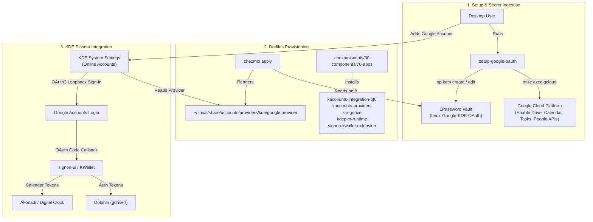

## Goal Capsule

- **Objective**: Enable full Google account integration (Google Drive, Calendar, Tasks, Contacts) in KDE Plasma using a dedicated private Google Cloud OAuth 2.0 application managed securely via 1Password and Chezmoi.
- **Product Authority**: Single-user workstation configuration in `github.com/hyperlapse122/dotfiles` with 1Password secret resolution and Fedora KDE Spin desktop environment.
- **Means**: Provision `~/.local/share/accounts/providers/kde/google.provider` via a Chezmoi template reading private OAuth credentials from 1Password (`op://`), provide a `gcloud` + `op` setup helper to configure GCP APIs and store credentials, and declare required KDE KAccounts/KIO/Akonadi packages. (KTD1, KTD2, KTD3)
- **Execution Profile**: `code`
- **Open Blockers**: None

---

## Product Contract

### Summary

This feature integrates a personal Google account into KDE Plasma desktop services (Dolphin `gdrive:/`, Digital Clock calendar events, Akonadi tasks and contacts) using a dedicated private Google OAuth 2.0 client. Private OAuth credentials (Client ID and Secret) are managed in 1Password and injected into `~/.local/share/accounts/providers/kde/google.provider` via a Chezmoi template, bypassing Google's third-party OAuth quota restrictions and unverified app blocks. A companion setup helper uses `gcloud` (`mise exec gcloud -- gcloud`) and `op` to enable required GCP APIs and persist generated credentials into 1Password.

### Problem Frame

KDE Plasma's upstream `kaccounts-providers` package ships with a shared public Google OAuth Client ID. Over time, Google restricts or disables access for shared open-source OAuth clients, triggering "This app is blocked" or "Unverified app" warnings and breaking desktop calendar, contact, and Google Drive syncing.

Using a personal Google Cloud project with a private OAuth 2.0 client resolves authentication reliability. However, manual setup involves navigating the GCP Console to enable multiple APIs, creating desktop/web OAuth credentials, and manually editing XML provider files. Integrating credential management with 1Password (`op://`) and automating GCP API activation with `gcloud` and `op` CLI provides a reproducible, secure, and declarative dotfiles workflow.

### Key Decisions

- **Private Google Cloud OAuth 2.0 app credentials** (session-settled: user-directed — chosen over public/shared KDE credentials: prevents Google unverified app blocks and shared quota exhaustion). Governs R1, R4.
- **Automated credential injection via Chezmoi template with 1Password op://** (session-settled: user-directed — chosen over manual local file creation or static unencrypted config: keeps secrets out of git while ensuring automated deployment). Governs R2, R3.
- **Full service integration scope (Drive + Calendar/Tasks + Contacts)** (session-settled: user-directed — chosen over Drive-only or Calendar-only: provides complete desktop environment integration). Governs R1, R5, R6, R7.
- **Scripted GCP API setup and 1Password storage via gcloud and op CLI** (session-settled: user-directed — chosen over manual GCP web console clicks: automates API enablement and secret upload). Governs R4.

### Actors

- **A1: Desktop Operator / User**: Initiates one-time GCP/1Password provisioning and logs in via KDE System Settings Online Accounts.
- **A2: Chezmoi Provisioner**: Renders `dot_local/share/accounts/providers/kde/google.provider.tmpl` with live secrets resolved from 1Password.
- **A3: KDE KAccounts & Signon-UI**: Reads the user-level `google.provider` override, drives OAuth 2.0 authorization code flow via loopback redirect, and manages tokens in KWallet.
- **A4: Google Cloud Platform**: Authenticates OAuth requests and serves Google Drive, Calendar, Tasks, and People (Contacts) APIs.

### Requirements

**OAuth Provider & Credential Management**
- R1. Provide a user-level KDE accounts provider template at `dot_local/share/accounts/providers/kde/google.provider.tmpl` that overrides `/usr/share/accounts/providers/kde/google.provider` with dedicated Client ID and Client Secret values.
- R2. Resolve the OAuth Client ID and Client Secret in `google.provider.tmpl` from 1Password via Chezmoi's `onepasswordRead` / `op://` reference resolver.
- R3. Support configuring the 1Password item reference path in `.chezmoidata/kde.yaml` (defaulting to standard path `op://Personal/Google-KDE-OAuth/client_id` and `op://Personal/Google-KDE-OAuth/client_secret`).
- R4. Configure the OAuth provider XML with redirect URI `http://localhost/oauth2callback` and scopes covering `drive`, `calendar`, `tasks`, `https://www.google.com/m8/feeds/`, `userinfo.email`, and `userinfo.profile`.

**GCP Setup & Secret Automation**
- R5. Provide a setup script/command `setup-google-oauth` using `mise exec gcloud -- gcloud` and `op` to enable necessary GCP APIs (`drive.googleapis.com`, `calendar-json.googleapis.com`, `tasks.googleapis.com`, `people.googleapis.com`), guide OAuth client creation, and write the resulting credentials into 1Password.

**Package Provisioning & Desktop Integration**
- R6. Ensure package dependencies (`kaccounts-integration-qt6`, `kaccounts-providers`, `kio-gdrive`, `kdepim-runtime`, `signon-kwallet-extension`) are declared in `.chezmoiscripts/30-components/run_onchange_before_70-apps.sh.tmpl` or equivalent package lists for Fedora.
- R7. Enable Dolphin file manager access to Google Drive files and folders via `kio-gdrive` (`gdrive:/`).
- R8. Enable Digital Clock popup and Akonadi calendar/task synchronization for Google Calendar and Google Tasks events.

### Key Flows

- F1. **One-Time GCP Setup & Secret Ingestion**
  - **Trigger:** User runs the `setup-google-oauth` CLI command.
  - **Actors:** A1 (User), A4 (GCP), `gcloud` CLI, `op` CLI.
  - **Steps:** Helper verifies active GCP project; enables Google Drive, Calendar, Tasks, and People APIs via `gcloud`; prompts for or guides OAuth 2.0 Web Client credentials; and saves `client_id` and `client_secret` into 1Password item `Google-KDE-OAuth`.
  - **Outcome:** 1Password contains valid Google OAuth client credentials; GCP project is ready.
  - **Covered by:** R4, R5.

- F2. **Dotfiles Apply & Provider Injection**
  - **Trigger:** User runs `chezmoi apply`.
  - **Actors:** A2 (Chezmoi), 1Password CLI (`op`).
  - **Steps:** Chezmoi renders `dot_local/share/accounts/providers/kde/google.provider.tmpl`, resolves `client_id` and `client_secret` from 1Password, and writes `~/.local/share/accounts/providers/kde/google.provider`.
  - **Outcome:** KDE Plasma detects custom `google.provider` with user-specific OAuth credentials.
  - **Covered by:** R1, R2, R3, R4.

- F3. **KDE Account Sign-in & Service Activation**
  - **Trigger:** User opens KDE System Settings -> Online Accounts -> Add Google Account.
  - **Actors:** A1 (User), A3 (KDE KAccounts/Signon-UI), A4 (GCP).
  - **Steps:** Signon-ui opens browser with custom OAuth client ID; user approves consent; browser redirects to `http://localhost/oauth2callback`; Signon-ui exchanges authorization code for refresh token and stores in KWallet; KIO GDrive and Akonadi start syncing.
  - **Outcome:** Google Drive appears in Dolphin; Google Calendar events appear in KDE Digital Clock.
  - **Covered by:** R1, R6, R7, R8.

### Acceptance Examples

- AE1. **Provider template renders with 1Password credentials**
  - **Covers:** R1, R2, R3, R4
  - **Given:** 1Password contains `client_id` and `client_secret` under item `Google-KDE-OAuth`.
  - **When:** `chezmoi apply` renders `~/.local/share/accounts/providers/kde/google.provider`.
  - **Then:** The rendered file contains the custom `ClientId` and `ClientSecret` values and redirect URI `http://localhost/oauth2callback`, with no plaintext secrets committed to git.

- AE2. **GCP helper automates API enablement and 1Password storage**
  - **Covers:** R5
  - **Given:** `gcloud` authenticated via mise (`mise exec gcloud -- gcloud`) and `op` authenticated.
  - **When:** User executes `setup-google-oauth`.
  - **Then:** Drive, Calendar, Tasks, and People APIs are active on GCP, and `client_id`/`client_secret` are created in 1Password.

- AE3. **Google Drive browsing in Dolphin**
  - **Covers:** R6, R7
  - **Given:** User completes Google sign-in in KDE System Settings.
  - **When:** User navigates to `gdrive:/` in Dolphin.
  - **Then:** Google Drive directories and files are listed and readable.

- AE4. **Calendar and Task sync in Digital Clock / Akonadi**
  - **Covers:** R6, R8
  - **Given:** Google account is authenticated in KAccounts.
  - **When:** Akonadi calendar resource synchronizes.
  - **Then:** Digital Clock popup displays Google Calendar events.

### Scope Boundaries

- **In-Scope:**
  - `dot_local/share/accounts/providers/kde/google.provider.tmpl` Chezmoi template with 1Password resolution.
  - `.chezmoidata/kde.yaml` configurable 1Password reference path fields.
  - `gcloud` (`mise exec gcloud -- gcloud`) + `op` CLI setup script `setup-google-oauth` for GCP API activation and credential storage.
  - `.chezmoidata/commands.yaml` registration for `setup-google-oauth`.
  - Package declarations for `kaccounts-integration-qt6`, `kaccounts-providers`, `kio-gdrive`, `kdepim-runtime`, `signon-kwallet-extension`.
  - Verification of Google Drive, Calendar, Tasks, and Contacts integration in KDE Plasma 6.
- **Out-of-Scope:**
  - Multi-account rotation or automated token switching across multiple Google accounts.
  - Automated public OAuth app verification submission to Google.

### Outstanding Questions

- None. All scope boundaries and design decisions were settled during dialogue.

---

## Planning Contract

### Product Contract Preservation

Product Contract unchanged. Requirements R1–R8, Actors A1–A4, Flows F1–F3, Acceptance Examples AE1–AE4, and Key Decisions are preserved in full.

### Key Technical Decisions

- **KTD1. User-level XDG override for KDE accounts provider XML**
  - **Decision:** Deploy custom Google provider definition to `~/.local/share/accounts/providers/kde/google.provider` rather than mutating `/usr/share/accounts/providers/kde/google.provider`. (session-settled: user-directed — chosen over system file mutation: isolates configuration to user seat and preserves package manager state).
  - **Governs:** R1, R4.

- **KTD2. Dynamic 1Password reference path with fallback in `.chezmoidata/kde.yaml`**
  - **Decision:** Resolve 1Password reference strings through `.chezmoidata/kde.yaml` (defaulting to `op://Personal/Google-KDE-OAuth/client_id` and `op://Personal/Google-KDE-OAuth/client_secret`) with fallback support. (session-settled: user-directed — chosen over hardcoded string: enables flexible vault configuration across environments).
  - **Governs:** R2, R3.

- **KTD3. Dedicated source command `setup-google-oauth` registered in `commands.yaml`**
  - **Decision:** Implement `setup-google-oauth` in `dot_local/share/chezmoi-command-sources/executable_setup-google-oauth` and register in `.chezmoidata/commands.yaml` with `producer: source`, `safetyProfile: interpreted`. (session-settled: user-directed — chosen over manual GCP web clicks: provides native repository command lifecycle).
  - **Governs:** R5.

- **KTD4. Loopback redirect URI `http://localhost/oauth2callback` and Web Client OAuth type**
  - **Decision:** Pinned to `http://localhost/oauth2callback` in `google.provider.tmpl` matching KDE signon-ui's built-in OAuth2 web server flow, with scopes for Google Drive (`https://www.googleapis.com/auth/drive`), Calendar (`https://www.googleapis.com/auth/calendar`), Tasks (`https://www.googleapis.com/auth/tasks`), Contacts (`https://www.google.com/m8/feeds/`), and profile/email.
  - **Governs:** R4, R8.

### High-Level Technical Design



---

## Implementation Units

### U1. Declare Google OAuth reference paths in `.chezmoidata/kde.yaml`

- **Goal:** Add configuration fields in `.chezmoidata/kde.yaml` to store the 1Password reference paths for the Google OAuth Client ID and Client Secret.
- **Requirements:** R3 (Governed by KTD2)
- **Dependencies:** None
- **Files:**
  - `.chezmoidata/kde.yaml`
- **Approach:**
  1. Add a `googleOAuth` block under `kde:` in `.chezmoidata/kde.yaml`.
  2. Declare `clientIdRef: "op://Personal/Google-KDE-OAuth/client_id"` and `clientSecretRef: "op://Personal/Google-KDE-OAuth/client_secret"`.
- **Patterns to follow:**
  - Structure in `.chezmoidata/kde.yaml` alongside `kde.calendar` and `kde.settings`.
- **Test scenarios:**
  - Scenario 1 (Happy path): `chezmoi execute-template` successfully reads `.kde.googleOAuth.clientIdRef` and `.kde.googleOAuth.clientSecretRef`.
  - Scenario 2 (Edge case): Missing or nil fields fall back to sensible standard paths in templates.
- **Verification:**
  - Verify `.chezmoidata/kde.yaml` syntax is valid YAML and matches repository schema conventions.

---

### U2. Create Chezmoi template for KDE Google OAuth provider

- **Goal:** Author `dot_local/share/accounts/providers/kde/google.provider.tmpl` which renders the custom provider XML with 1Password credentials.
- **Requirements:** R1, R2, R3, R4 (Governed by KTD1, KTD2, KTD4, Covers AE1)
- **Dependencies:** U1
- **Files:**
  - `dot_local/share/accounts/providers/kde/google.provider.tmpl`
- **Approach:**
  1. Mirror the provider structure of `/usr/share/accounts/providers/kde/google.provider`.
  2. Retrieve `clientIdRef` and `clientSecretRef` from `.kde.googleOAuth` (or default).
  3. Resolve secrets using `onepasswordRead` helper.
  4. Ensure `RedirectUri` is set to `http://localhost/oauth2callback`.
  5. Include all required scopes: `https://www.googleapis.com/auth/userinfo.email`, `https://www.googleapis.com/auth/userinfo.profile`, `https://www.googleapis.com/auth/calendar`, `https://www.googleapis.com/auth/tasks`, `https://www.google.com/m8/feeds/`, `https://www.googleapis.com/auth/drive`, `https://www.googleapis.com/auth/youtube.upload`.
- **Patterns to follow:**
  - Template structure in `dot_local/share/` and 1Password secret resolution in `private_executable_import-wifi-1password.tmpl`.
- **Test scenarios:**
  - Scenario 1 (Happy path - AE1): Render template using scratch `op` stub; verify generated XML has valid XML syntax, contains the injected client ID/secret, and contains `http://localhost/oauth2callback`.
  - Scenario 2 (Security/Privacy): Verify template file does not contain hardcoded plaintext credentials and complies with repository secrets policy.
- **Verification:**
  - Run `chezmoi execute-template` with scratch 1Password stub against `dot_local/share/accounts/providers/kde/google.provider.tmpl` and validate XML structure.

---

### U3. Update package provisioning for KDE online accounts dependencies

- **Goal:** Ensure all required packages for KDE Online Accounts, Google Drive KIO worker, Akonadi PIM runtime, and KWallet Signon integration are present in package manifests.
- **Requirements:** R6, R7, R8 (Covers AE3, AE4)
- **Dependencies:** None
- **Files:**
  - `.chezmoiscripts/30-components/run_onchange_before_70-apps.sh.tmpl`
- **Approach:**
  1. Review `app_packages` array in `.chezmoiscripts/30-components/run_onchange_before_70-apps.sh.tmpl`.
  2. Add `kaccounts-integration-qt6`, `kaccounts-providers`, `kio-gdrive`, `kdepim-runtime`, `signon-kwallet-extension` to `app_packages` if not already present.
  3. Ensure idempotency (only uninstalled packages are passed to `dnf install`).
- **Patterns to follow:**
  - Package installation loop in `run_onchange_before_70-apps.sh.tmpl`.
- **Test scenarios:**
  - Scenario 1 (Happy path): On Fedora host, `install_app_packages` correctly checks `rpm -q` and includes missing KDE online accounts packages.
- **Verification:**
  - Verify `run_onchange_before_70-apps.sh.tmpl` renders cleanly and passes skip/guard checks.

---

### U4. Implement `setup-google-oauth` CLI helper

- **Goal:** Provide a CLI command `setup-google-oauth` that automates GCP API enablement via `mise exec gcloud -- gcloud` and writes generated OAuth credentials to 1Password via `op`.
- **Requirements:** R5 (Governed by KTD3, Covers AE2)
- **Dependencies:** U1
- **Files:**
  - `dot_local/share/chezmoi-command-sources/executable_setup-google-oauth`
- **Approach:**
  1. Implement a clean, robust Bash script in `dot_local/share/chezmoi-command-sources/executable_setup-google-oauth`.
  2. Verify preflight dependencies: `mise`, `op`.
  3. Execute `mise exec gcloud -- gcloud services enable drive.googleapis.com calendar-json.googleapis.com tasks.googleapis.com people.googleapis.com youtube.googleapis.com` on the active GCP project.
  4. Provide interactive/parameterized flow to input or verify Google OAuth 2.0 Web Application Client ID and Secret (with redirect URI `http://localhost/oauth2callback`).
  5. Use `op item create` or `op item edit` to save fields into 1Password item `Google-KDE-OAuth` under vault `Personal` (or path configured in `.chezmoidata/kde.yaml`).
  6. Display next instructions: run `chezmoi apply` and open KDE System Settings -> Online Accounts.
- **Patterns to follow:**
  - Existing command sources in `dot_local/share/chezmoi-command-sources/executable_auth-glab` and `executable_src-audit`.
- **Test scenarios:**
  - Scenario 1 (Happy path - AE2): Script verifies `mise` and `op` presence, enables APIs, and stores item into 1Password.
  - Scenario 2 (Error path): Script gracefully handles unauthenticated `gcloud` or locked 1Password CLI with clear instructions.
- **Verification:**
  - Run syntax check (`bash -n`) and test command help/preflight logic.

---

### U5. Register `setup-google-oauth` in `commands.yaml` and verify reconciliation

- **Goal:** Register the `setup-google-oauth` command in `.chezmoidata/commands.yaml` so chezmoi command reconciliation activates and links it into `~/.local/bin/`.
- **Requirements:** R5 (Governed by KTD3)
- **Dependencies:** U4
- **Files:**
  - `.chezmoidata/commands.yaml`
- **Approach:**
  1. Add `setup-google-oauth` unit under `commands.units` in `.chezmoidata/commands.yaml`.
  2. Set `producer: source`, `safetyProfile: interpreted`, `proofEligible: false`, `mode: "0755"`, `platforms: [linux]`.
- **Patterns to follow:**
  - Existing source units in `.chezmoidata/commands.yaml` (e.g. `kde-color-picker`, `setup-luks-tpm2-unlock`).
- **Test scenarios:**
  - Scenario 1 (Happy path): Command manifest parses without schema errors and reconciles `setup-google-oauth` to `~/.local/bin/setup-google-oauth`.
- **Verification:**
  - Validate YAML formatting and run command reconciliation checks.

---

## Verification Contract

### Test Commands and Quality Gates

- **Template Rendering & Secret Gate:**
  ```bash
  scratch="$HOME/.cache/agent-scratch/chezmoi-op-stub"
  mkdir -p "$scratch/bin" "$scratch/target"
  : > "$scratch/empty.toml"
  printf '#!/usr/bin/env bash\ncase "${1-}" in whoami) printf dummy@example.invalid;; *) printf dummy-secret;; esac\n' > "$scratch/bin/op"
  chmod 700 "$scratch/bin/op"
  env PATH="$scratch/bin:$PATH" chezmoi --config "$scratch/empty.toml" --source "$PWD" --destination "$scratch/target" execute-template < dot_local/share/accounts/providers/kde/google.provider.tmpl
  ```
  - **Expected Outcome:** Template renders valid XML containing `dummy-secret` for ClientId and ClientSecret, and contains `http://localhost/oauth2callback` and required scopes.

- **Manifest Validation & Shell Syntax:**
  ```bash
  bash -n dot_local/share/chezmoi-command-sources/executable_setup-google-oauth
  git diff --check
  ```
  - **Expected Outcome:** Zero syntax errors or trailing whitespace issues.

- **KDE Desktop Integration Verification:**
  1. Execute `setup-google-oauth` to enable GCP APIs and store credentials in 1Password.
  2. Execute `chezmoi apply` to render `~/.local/share/accounts/providers/kde/google.provider`.
  3. Open `systemsettings kcm_kaccounts` -> Add Google Account -> Complete OAuth login.
  4. Verify Dolphin (`gdrive:/`) and Digital Clock calendar sync.

---

## Definition of Done

- [ ] `.chezmoidata/kde.yaml` declares `googleOAuth` configuration references.
- [ ] `dot_local/share/accounts/providers/kde/google.provider.tmpl` is created with 1Password secret resolution and correct OAuth redirect/scope parameters.
- [ ] `.chezmoiscripts/30-components/run_onchange_before_70-apps.sh.tmpl` declares all required KDE accounts and KIO/Akonadi packages.
- [ ] `dot_local/share/chezmoi-command-sources/executable_setup-google-oauth` is implemented and registered in `.chezmoidata/commands.yaml`.
- [ ] Template execution test with 1Password mock passes without error.
- [ ] Git diff is clean and scoped strictly to the planned changes.
- [ ] Any dead-end or scratch files are cleaned up.
