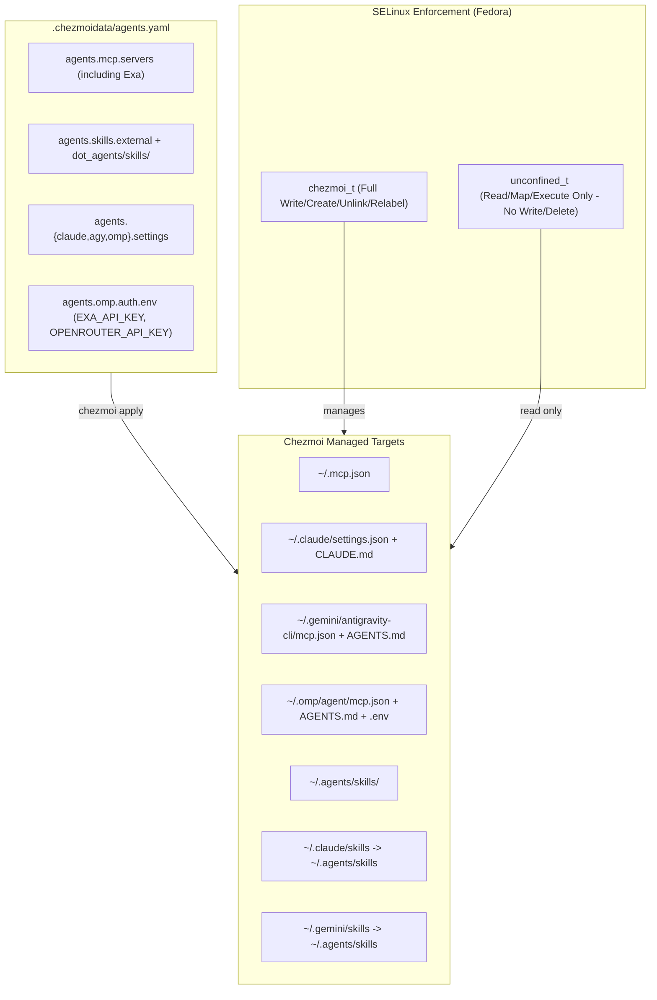

# Manage Claude Code and Antigravity Harnesses with SELinux Protection - Plan

## Goal Capsule

- **Objective:** Provision and manage Claude Code (`claude`) and Google Antigravity CLI (`agy`) as first-class agent harnesses alongside `omp` from a single source of truth in `.chezmoidata/agents.yaml`, manage `.mcp.json` and canonical skill symlinks via chezmoi, protect all agent configurations and skills from unauthorized non-chezmoi writes using an expanded Fedora SELinux policy, re-integrate Exa web search, and decommission `mxm4-haptic` integration across all agent harnesses.
- **Means:** Re-introduce `claude` and `antigravity` vendor resolvers in `packages/release-lock` and `.chezmoiexternals/ai-agents.toml` (KTD1); declare settings, Exa MCP server, and skills in `.chezmoidata/agents.yaml` and render `.mcp.json` with live 1Password secret resolution (KTD2, KTD6); deploy symlinks `~/.claude/skills` and `~/.gemini/skills` to `~/.agents/skills` (KTD3); refine `dotfiles_protected_agent_configs.cil` so all user tools retain read access while writes are restricted to `chezmoi_t` (KTD4); and strip `mxm4-haptic` build and hook provisioning (KTD5).
- **Product authority:** The user's session-settled decisions govern harness scope, binary provisioning via release-lock, strict `agents.yaml` centralization, the read-open / write-restricted SELinux policy scope, Exa re-integration, and the full haptics removal.
- **Execution profile:** Coordinated chezmoi source additions and updates across `.chezmoidata/`, `.chezmoiexternals/`, `.chezmoitemplates/`, `packages/release-lock/`, and `system/linux/selinux/`. Intermediate source states do not apply to live `$HOME`.
- **Stop conditions:** Stop if `packages/release-lock` cannot authoritatively resolve `claude` or `antigravity` binaries without network calls at template render time, if SELinux policy blocks read access for interactive user shells, or if unmanaged files outside agent configuration paths are touched.
- **Tail ownership:** Local verification via isolated template rendering, release-lock tests, and SELinux syntax/policy tests. Pull request CI watch via `ci.yml` and `render-dotfiles.yml`.

---

## Product Contract

### Summary

Re-introduce Claude Code (`claude`) and Google Antigravity CLI (`agy`) as primary managed agent harnesses alongside `omp`, centrally configuring their settings, MCP servers (including Exa web search), and skills from `.chezmoidata/agents.yaml`. Deploy `.mcp.json` and canonical skill symlinks (`~/.claude/skills` and `~/.gemini/skills` pointing to `~/.agents/skills`) via chezmoi. Update the Fedora SELinux policy (`dotfiles_protected_agent_configs.cil`) to keep agent configs, skills (`~/.agents/skills/`), plugins (`~/.agents/plugins/`), and symlinks readable by all user tools (`unconfined_t`) while strictly locking write and delete operations to `chezmoi` (`chezmoi_t`). Decommission `mxm4-haptic` build and event hook integration across all harnesses.

### Problem Frame

Managing multiple AI coding agents across machines requires consistent access to skills, MCP servers, and environment rules without configuration drift. Previously, Claude Code and Antigravity were unmanaged in favor of `omp`, and a strict SELinux policy was deployed that prevented unintended writes but lacked unified skill symlinks and full multi-harness data coverage. Reinstating Claude Code and Google Antigravity as primary harnesses requires automated binary management via release-lock, unified instruction and MCP rendering from `agents.yaml`, symlinked skill discovery, Exa web search restoration, and an adjusted SELinux Type Enforcement model that permits seamless read access for agent processes while ensuring chezmoi remains the exclusive write authority. Concurrently, removing the unused haptic feedback subsystem simplifies agent integration overhead across the entire repository.

### Key Decisions

- **KD1. Re-introduce Claude Code and Antigravity as managed harnesses.** Add `claude` and `agy` back into dotfiles management alongside `omp`, establishing multi-harness instruction, settings, and MCP management. (session-settled: user-directed — chosen over single-harness model: user requested Claude Code and Google Antigravity as primary harnesses.) Governs R1, R2, R3, R4.
- **KD2. Static release-lock binary provisioning.** Manage `claude` and `antigravity` CLI binaries through `packages/release-lock` vendor manifests and `.chezmoiexternals/ai-agents.toml`. (session-settled: user-directed — chosen over mise/PATH installs: adheres to the repository's deterministic, network-free template rendering invariant.) Governs R5, R6.
- **KD3. Strict configuration and MCP centralization in `agents.yaml`.** Centralize all MCP servers (`agents.mcp.servers`), external skills (`agents.skills.external`), and harness settings under `.chezmoidata/agents.yaml`, rendering `.mcp.json` and agent-specific configurations from this single source of truth with 1Password `op://` secret headers resolved at apply time into the SELinux-protected target. (session-settled: user-directed — chosen over per-tool manual config and environment pass-through: ensures reproducible multi-harness configuration with secure at-rest file protection.) Governs R7, R8, R9, R10.
- **KD4. Shared skill symlinks to canonical `~/.agents/skills`.** Manage symlinks `~/.claude/skills` and `~/.gemini/skills` pointing to `~/.agents/skills` via chezmoi. (session-settled: user-directed — chosen over duplicate skill folders: unifies skill discovery across all harnesses.) Governs R11, R12.
- **KD5. Read-open, write-restricted SELinux Type Enforcement.** Adjust and expand `system/linux/selinux/dotfiles_protected_agent_configs.cil` so that `protected_agent_config_t` allows unrestricted read access to `unconfined_t` (all user tools/CLIs) while write, create, unlink, rename, and append operations remain restricted exclusively to `chezmoi_t`. (session-settled: user-directed — chosen over policy deletion: prevents external tools from modifying managed files.) Governs R13, R14, R15, R16.
- **KD6. Decommission haptic integration across all harnesses.** Remove `mxm4-haptic` event hooks, plugins, and build provisioners for all agent harnesses (`omp`, `claude`, `agy`) for now. (session-settled: user-directed — chosen over retaining haptics for OMP or expanding to Claude/AGY: simplifies agent lifecycle surfaces.) Governs R17, R18.
- **KD7. Re-integrate Exa search across MCP and OMP.** Re-add the Exa websearch server to `agents.mcp.servers` and re-enable Exa provider settings and credentials in `agents.omp`. (session-settled: user-directed — chosen over Gemini-only search: provides unified Exa search across Claude, AGY, and OMP.) Governs R19, R20, R21.

### Requirements

#### Harness Management & Binary Provisioning

- R1. `claude` (Claude Code) and `agy` (Google Antigravity CLI) must be managed as first-class agent harnesses in dotfiles alongside `omp`.
- R2. `dot_claude/readonly_CLAUDE.md.tmpl` and `dot_gemini/readonly_AGENTS.md.tmpl` must render harness-tailored instructions using the shared `.chezmoitemplates/agents-instructions.tmpl`.
- R3. aoe configuration (`.chezmoidata/agents.yaml` under `agents.aoe.config.toml`) must register `claude` and `agy` custom agents.
- R4. Repository documentation (`AGENTS.md` and `README.md`) must reflect `claude`, `agy`, and `omp` as the supported managed harness set.
- R5. `packages/release-lock` must re-introduce vendor manifest resolvers for `claude` (fetching from `downloads.claude.ai`) and `antigravity` (fetching from Google release channels), regenerating `.chezmoidata/releases.json` authoritatively.
- R6. `.chezmoiexternals/ai-agents.toml` must declare external archive/binary stanzas for `claude` and `agy` referencing the locked versions and SHA digests.

#### Configuration, MCPs, and Skills Centralization

- R7. `.chezmoidata/agents.yaml` must define `agents.claude` and `agents.agy` blocks alongside `agents.omp` for declared settings and harness options.
- R8. `readonly_dot_mcp.json.tmpl` must be added to root dotfiles to render all active `agents.mcp.servers` into `~/.mcp.json` for universal MCP discovery, resolving `op://` secret references (e.g. `CONTEXT7_API_KEY`) at apply time.
- R9. Apply scripts for Claude Code settings (`.chezmoiscripts/70-agents/run_onchange_after_config-claude-settings.sh.tmpl` or dedicated config targets) and Antigravity settings must reconcile declared settings from `agents.yaml`.
- R10. Harness-specific MCP configs (e.g. `~/.gemini/antigravity-cli/mcp.json` and `~/.omp/agent/mcp.json`) must render from `agents.mcp.servers`.
- R11. Chezmoi must deploy and manage symbolic links `~/.claude/skills` -> `~/.agents/skills` and `~/.gemini/skills` -> `~/.agents/skills`.
- R12. `dot_agents/skills/` and external skills in `agents.skills.external` must continue deploying to canonical `~/.agents/skills/`.

#### SELinux Policy and File Protection

- R13. `system/linux/selinux/dotfiles_protected_agent_configs.cil` must declare `protected_agent_config_t` and grant `unconfined_t` full read/map permissions (`file (read getattr open map)` and `dir (read getattr open search)`) and symlink resolution permissions.
- R14. `dotfiles_protected_agent_configs.cil` must restrict write, create, unlink, rename, setattr, and append operations on `protected_agent_config_t` strictly to `chezmoi_t`.
- R15. `dotfiles_protected_agent_configs.cil` file context specifications (`filecon`) must encompass:
  - `HOME_DIR/\.mcp\.json`
  - `HOME_DIR/\.claude\.json.*`
  - `HOME_DIR/\.claude/settings\.json`
  - `HOME_DIR/\.claude/skills` (symlink and targets)
  - `HOME_DIR/\.gemini/antigravity-cli/mcp\.json`
  - `HOME_DIR/\.gemini/skills` (symlink and targets)
  - `HOME_DIR/\.agents/skills(/.*)?`
  - `HOME_DIR/\.agents/plugins(/.*)?`
  - `HOME_DIR/\.codex/config\.toml`
  - `HOME_DIR/\.codex/skills(/.*)?`
- R16. `.chezmoiscripts/30-linux/run_onchange_after_selinux-policies.sh.tmpl` must run `restorecon -RFv` across all newly declared protected paths on Fedora.

#### Haptic Decommissioning

- R17. All apply-time `mxm4-haptic` build and daemon scripts (`.chezmoiscripts/60-build/run_after_build-mxm4-haptic.sh.tmpl`) must be removed or disabled.
- R18. All `mxm4-haptic` plugin declarations in `agents.omp.plugins`, `.chezmoidata/haptic.yaml`, and marketplace descriptors must be pruned.

#### Exa Web Search Re-integration

- R19. `agents.mcp.servers` in `.chezmoidata/agents.yaml` must re-add the `websearch` Exa MCP server (`https://mcp.exa.ai/mcp` with `x-api-key: op://Private/Exa/API Key`) for shared MCP tool consumption in `~/.mcp.json`.
- R20. `agents.omp.auth.env` and `.chezmoiscripts/70-agents/run_after_config-omp-auth.sh.tmpl` closed set must re-add `EXA_API_KEY` (`op://Private/Exa/API Key`).
- R21. `agents.omp.settings` must re-add `providers.webSearchOrder: [exa, gemini]` and `exa.enabled: true`.

### Key Flows

- F1. **Multi-Harness Skill and Tool Invocation**
  - **Trigger:** User launches `claude`, `agy`, or `omp` from terminal.
  - **Steps:** CLI starts up in `unconfined_t` domain; reads `~/.mcp.json` or native MCP config without SELinux denial; resolves `~/.claude/skills` or `~/.gemini/skills` symlink to `~/.agents/skills/`; executes skills and MCP tools (including Exa websearch) cleanly.
  - **Outcome:** All three harnesses discover the exact same skills and MCP servers.
  - **Covered by:** R1, R8, R10, R11, R12, R13, R19

- F2. **Tamper Prevention against External Tool Mutation**
  - **Trigger:** A third-party utility or agent (e.g. `dotagents` or npm script) attempts to write or delete files in `~/.agents/skills/` or `~/.mcp.json`.
  - **Steps:** Kernel SELinux subsystem evaluates `unconfined_t` write request against `protected_agent_config_t`; denies operation with `EACCES`.
  - **Outcome:** Managed files and skill definitions remain intact and free from external tool modification.
  - **Covered by:** R14, R15

- F3. **Chezmoi Apply Reconciliation**
  - **Trigger:** Operator executes `chezmoi apply`.
  - **Steps:** `/usr/bin/chezmoi` executes in `chezmoi_exec_t` and transitions to `chezmoi_t`; updates `.mcp.json`, skill symlinks, and settings; executes `run_onchange_after_selinux-policies.sh.tmpl` with `sudo semodule -X 400 -i` and `restorecon`.
  - **Outcome:** All agent targets converge and SELinux file labels remain synchronized.
  - **Covered by:** R8, R9, R11, R15, R16

### Acceptance Examples

- AE1. **Covers R1, R5, R6.** Given `.chezmoiexternals/ai-agents.toml` after release-lock refresh, when evaluating externals on Linux and macOS, then valid locked binaries for `claude` and `antigravity` are defined with SHA-256 digests.
- AE2. **Covers R8, R10, R19.** Given `.chezmoidata/agents.yaml` declaring MCP servers `codegraph`, `glab`, `agent-browser`, `context7`, `mdn`, and `websearch` (Exa), when executing chezmoi template render, then `~/.mcp.json` contains valid JSON with all servers configured and `op://` secrets resolved.
- AE3. **Covers R11, R12.** Given a provisioned user environment, when listing `~/.claude/skills` and `~/.gemini/skills`, then both are symbolic links pointing directly to `~/.agents/skills`.
- AE4. **Covers R13, R14, R15.** Given Fedora with SELinux enforcing, when a non-chezmoi process attempts `echo test >> ~/.mcp.json` or `rm ~/.agents/skills/sample.md`, then the operation is denied by SELinux; when reading the same paths (`cat ~/.mcp.json`), the operation succeeds without denial.
- AE5. **Covers R17, R18.** Given a completed apply, then no `mxm4-haptic` background daemon is registered or running, and no agent lifecycle event triggers haptic pulses.
- AE6. **Covers R19, R20, R21.** Given rendered `~/.mcp.json` and `~/.omp/agent/.env`, then `websearch` Exa MCP is declared in `~/.mcp.json` with resolved API key, `EXA_API_KEY` is present in omp `.env`, and omp settings declare `providers.webSearchOrder: [exa, gemini]`.

### Success Criteria

- Every changed template and script renders cleanly through `chezmoi execute-template` with `--source "$PWD"`.
- `packages/release-lock` passes all unit tests and generates a sorted, authoritative `.chezmoidata/releases.json` including `claude` and `antigravity`.
- `dotfiles_protected_agent_configs.cil` compiles cleanly with `semodule` on Fedora without syntax errors or permission conflicts.
- `.ci/test-selinux-protected-configs.sh` passes syntax verification (`bash -n`) and verifies read-allow / write-deny policy rules.
- `.ci/check-skip-declarations.sh` succeeds with zero unmatched skip sites.
- Both `.github/workflows/ci.yml` and `.github/workflows/render-dotfiles.yml` pass cleanly.

### Scope Boundaries

- **Deferred for later:** Adding secondary automated plugin managers beyond the static marketplace and skill symlinks.
- **Outside this change:** Managing third-party API credentials in plaintext (all OAuth tokens stay in native credential stores; static keys remain in 1Password `op://` references).
- **Outside this change:** Windows SELinux handling (SELinux is Linux/Fedora-specific; other OS targets skip cleanly).

### Dependencies and Assumptions

- A1. `claude` CLI and `antigravity` CLI respect standard `~/.mcp.json` and `~/.claude/skills` / `~/.gemini/skills` symlinks for tool and skill discovery.
- A2. Fedora systems have SELinux active in `enforcing` or `permissive` mode with `semodule` and `restorecon` available via sudo.
- A3. Non-Linux and container hosts evaluate the SELinux template gate to false and skip execution cleanly without error.
- A4. Removing `mxm4-haptic` does not affect any non-haptic agent capabilities or CLI execution.

### Sources / Research

- `system/linux/selinux/dotfiles_protected_agent_configs.cil` — CIL policy definitions.
- `.chezmoiscripts/30-linux/run_onchange_after_selinux-policies.sh.tmpl` — SELinux onchange apply script.
- `.chezmoidata/agents.yaml` — Centralized agent configurations, MCP servers, and skills registry.
- `packages/release-lock/` — Tool release lock and vendor manifest resolvers.
- `docs/plans/2026-08-05-001-chore-unmanage-claude-codex-harnesses-plan.md` — Prior removal architecture and data models.
- `docs/plans/2026-08-31-1258-feat-selinux-protected-agent-configs-plan.md` — Initial SELinux protection plan.
- `docs/plans/2026-08-17-1353-feat-omp-gemini-websearch-remove-exa-plan.md` — Prior Exa removal plan.

---

## Planning Contract

### Key Technical Decisions

- KTD1. **Re-introduce `claude` and `antigravity` into `packages/release-lock` and `.chezmoiexternals/ai-agents.toml`.** Author `resolveClaude` and `resolveAntigravity` vendor resolvers in `vendor-manifest.ts`, update `REGISTRY` in `registry.ts`, export updated `releases.json`, and declare external download stanzas in `ai-agents.toml`. *(Governs R5, R6; cites KD2)*
- KTD2. **Universal `.mcp.json` with live 1Password secret resolution.** Deploy root target `readonly_dot_mcp.json.tmpl` that parses `agents.mcp.servers` and renders JSON with headers, passing `op://` references through `onepasswordRead`. *(Governs R8, R10; cites KD3)*
- KTD3. **Shared skill symlinks via chezmoi target declarations.** Declare `dot_claude/symlink_skills.tmpl` (`~/.claude/skills` -> `~/.agents/skills`) and `dot_gemini/symlink_skills.tmpl` (`~/.gemini/skills` -> `~/.agents/skills`) as managed symlink targets. *(Governs R11; cites KD4)*
- KTD4. **Refine CIL policy for read-open, write-locked enforcement.** Update `system/linux/selinux/dotfiles_protected_agent_configs.cil` to grant `unconfined_t` read/map permissions while preserving exclusive write/create/unlink permissions for `chezmoi_t`, expanding file contexts across all agent configs, skill directories, and symlinks. *(Governs R13, R14, R15, R16; cites KD5)*
- KTD5. **Decommission `mxm4-haptic` while preserving workspace parity.** Remove the apply-time build script `.chezmoiscripts/60-build/run_after_build-mxm4-haptic.sh.tmpl`, remove `mxm4-haptic` from `agents.omp.plugins` and `marketplace.json.tmpl`, and prune active hook settings in `haptic.yaml`. *(Governs R17, R18; cites KD6)*
- KTD6. **Restore closed-set auth reconciliation for `EXA_API_KEY`.** Add `EXA_API_KEY` back to `agents.omp.auth.env` and the required list in `.chezmoiscripts/70-agents/run_after_config-omp-auth.sh.tmpl`, and re-assert `providers.webSearchOrder: [exa, gemini]` in `agents.omp.settings`. *(Governs R19, R20, R21; cites KD7)*

### High-Level Technical Design

### Assumptions

- A1. Upstream `downloads.claude.ai` and Google Antigravity release endpoints remain accessible by `packages/release-lock` without interactive authentication during lock regeneration.
- A2. Claude Code and Antigravity CLI resolve symlinked `skills` directories identically to direct subdirectories.

### Sequencing

1. **U1 & U2:** Restore release-lock vendor resolvers for `claude` and `antigravity`, regenerate lock, and declare externals.
2. **U3 & U4:** Re-add Exa and universal `.mcp.json`, wire skill symlinks, declare harness settings, and update instruction templates and auth reconcilers.
3. **U5:** Refine and expand SELinux CIL policy, update runner script, and update CI assertions.
4. **U6:** Decommission `mxm4-haptic` build scripts, plugin registrations, and test suites.
5. **U7:** Update repository documentation and verify whole-tree consistency.

---

## Implementation Units

### U1. Re-introduce `claude` and `antigravity` into `packages/release-lock`

- **Goal:** Author vendor manifest resolvers for Claude Code and Google Antigravity in `packages/release-lock`, regenerate `.chezmoidata/releases.json`, and verify test suite.
- **Requirements:** R5 (Covers AE1)
- **Dependencies:** None
- **Files:**
  - `packages/release-lock/src/types.ts`
  - `packages/release-lock/src/vendor-manifest.ts`
  - `packages/release-lock/src/registry.ts`
  - `packages/release-lock/test/vendor-manifest.test.ts`
  - `packages/release-lock/test/registry.test.ts`
  - `.chezmoidata/releases.json`
- **Approach:**
  1. Add `"claude"` and `"antigravity"` to `VendorName` in `types.ts`.
  2. Implement `resolveClaude` (querying `https://downloads.claude.ai/claude-code-releases/manifest.json`) and `resolveAntigravity` in `vendor-manifest.ts`.
  3. Add `claude` and `antigravity` entries in `REGISTRY` in `registry.ts`.
  4. Run `packages/release-lock` CLI to regenerate `.chezmoidata/releases.json` with valid SHA-256 digests.
- **Patterns to follow:** `packages/release-lock/src/vendor-manifest.ts` existing `resolveWinbox` pattern.
- **Test scenarios:**
  - Happy path: `packages/release-lock` test suite passes (`bun test` in `packages/release-lock`).
  - Output verification: `.chezmoidata/releases.json` contains `claude` and `antigravity` with valid URL and SHA-256 properties for supported platforms.
- **Verification:** `bun test` in `packages/release-lock` succeeds; `releases.json` carries `claude` and `antigravity` keys.

---

### U2. Declare Externals and Binaries for `claude` and `agy`

- **Goal:** Declare external archive and binary stanzas for `claude` and `agy` in `.chezmoiexternals/ai-agents.toml` using locked release properties.
- **Requirements:** R1, R6 (Covers AE1)
- **Dependencies:** U1
- **Files:**
  - `.chezmoiexternals/ai-agents.toml`
  - `dot_local/bin/` executable links / wrappers (if applicable)
- **Approach:**
  1. Add `[claude]` external stanza to `.chezmoiexternals/ai-agents.toml` pulling version, URL, and SHA-256 via `release-lock-ref.tmpl`.
  2. Add `[agy]` / `[antigravity]` external stanza to `.chezmoiexternals/ai-agents.toml`.
  3. Ensure binaries are unpacked into `~/.local/share/` and linked to `~/.local/bin/claude` and `~/.local/bin/agy`.
- **Patterns to follow:** `.chezmoiexternals/ai-agents.toml` `agent-browser` and `omp` external declarations.
- **Test scenarios:**
  - Template render: `chezmoi execute-template < .chezmoiexternals/ai-agents.toml` renders valid TOML containing `[claude]` and `[agy]` blocks without syntax errors.
- **Verification:** Template rendering produces valid TOML with matching release-lock digests.

---

### U3. Universal `.mcp.json`, Exa MCP Server, and Skill Symlinks

- **Goal:** Deploy `~/.mcp.json` from `agents.mcp.servers` with live 1Password secret resolution, add Exa websearch MCP, and deploy skill symlinks `~/.claude/skills` and `~/.gemini/skills` pointing to `~/.agents/skills`.
- **Requirements:** R8, R10, R11, R12, R19 (Covers AE2, AE3, AE6)
- **Dependencies:** None
- **Files:**
  - `.chezmoidata/agents.yaml`
  - `readonly_dot_mcp.json.tmpl`
  - `dot_claude/symlink_skills.tmpl`
  - `dot_gemini/symlink_skills.tmpl`
- **Approach:**
  1. In `.chezmoidata/agents.yaml`, add `websearch` Exa server to `agents.mcp.servers` (`https://mcp.exa.ai/mcp`, `x-api-key: op://Private/Exa/API Key`).
  2. Author `readonly_dot_mcp.json.tmpl` rendering all active `agents.mcp.servers` with `mcpServers` JSON structure, resolving `op://` references.
  3. Author `dot_claude/symlink_skills.tmpl` declaring target `.agents/skills`.
  4. Author `dot_gemini/symlink_skills.tmpl` declaring target `.agents/skills`.
- **Patterns to follow:** `.chezmoitemplates/agent-mcp-servers-json.tmpl` and existing chezmoi symlink targets.
- **Test scenarios:**
  - Happy path: Rendering `readonly_dot_mcp.json.tmpl` produces valid JSON containing `codegraph`, `glab`, `agent-browser`, `context7`, `mdn`, and `websearch`.
  - Symlink verification: `dot_claude/symlink_skills.tmpl` and `dot_gemini/symlink_skills.tmpl` output `.agents/skills`.
- **Verification:** `chezmoi execute-template < readonly_dot_mcp.json.tmpl` outputs valid JSON with Exa and Context7 entries.

---

### U4. Harness Settings, Instructions, and OMP Exa Auth Reconciler

- **Goal:** Declare `agents.claude` and `agents.agy` blocks in `agents.yaml`, render instructions (`CLAUDE.md` and `AGENTS.md`), configure aoe custom agents, and restore `EXA_API_KEY` in OMP auth and settings.
- **Requirements:** R2, R3, R7, R9, R20, R21 (Covers AE2, AE6)
- **Dependencies:** U3
- **Files:**
  - `.chezmoidata/agents.yaml`
  - `dot_claude/readonly_CLAUDE.md.tmpl`
  - `dot_gemini/readonly_AGENTS.md.tmpl`
  - `.chezmoitemplates/agents-instructions.tmpl`
  - `.chezmoiscripts/70-agents/run_onchange_after_config-claude-settings.sh.tmpl`
  - `.chezmoiscripts/70-agents/run_after_config-omp-auth.sh.tmpl`
  - `.chezmoiscripts/70-agents/run_after_config-omp-settings.sh.tmpl`
  - `.ci/test-omp-agent-reconcile.sh`
- **Approach:**
  1. In `.chezmoidata/agents.yaml`, add `agents.claude` and `agents.agy` settings blocks; register `claude` and `agy` in `agents.aoe.config.toml.session.custom_agents`.
  2. Add `EXA_API_KEY` to `agents.omp.auth.env` and update `agents.omp.settings.providers.webSearchOrder` to `[exa, gemini]` with `exa.enabled: true`.
  3. In `.chezmoiscripts/70-agents/run_after_config-omp-auth.sh.tmpl`, add `"EXA_API_KEY"` to `$required` list (`list "EXA_API_KEY" "OPENROUTER_API_KEY"`).
  4. Author `dot_claude/readonly_CLAUDE.md.tmpl` and `dot_gemini/readonly_AGENTS.md.tmpl` rendering `.chezmoitemplates/agents-instructions.tmpl` with harness IDs `claude` and `agy`.
  5. Add apply script for Claude Code settings reconciliation from `agents.claude.settings`.
  6. Update `.ci/test-omp-agent-reconcile.sh` closed set assertions to require `EXA_API_KEY`.
- **Patterns to follow:** `.chezmoiscripts/70-agents/run_after_config-omp-settings.sh.tmpl` and `dot_omp/private_agent/readonly_AGENTS.md.tmpl`.
- **Test scenarios:**
  - Instruction rendering: `chezmoi execute-template < dot_claude/readonly_CLAUDE.md.tmpl` and `dot_gemini/readonly_AGENTS.md.tmpl` render cleanly without unresolved tokens.
  - Auth test suite: `bash .ci/test-omp-agent-reconcile.sh` passes with `EXA_API_KEY` in closed set.
- **Verification:** `.ci/test-omp-agent-reconcile.sh` passes with zero errors; instructions render for all three harnesses.

---

### U5. Refine and Expand Fedora SELinux CIL Policy

- **Goal:** Update `system/linux/selinux/dotfiles_protected_agent_configs.cil` to grant `unconfined_t` full read/map permissions, restrict write operations to `chezmoi_t`, expand filecon specifications to all skills, plugins, symlinks, and MCP configs, and update `.ci/test-selinux-protected-configs.sh`.
- **Requirements:** R13, R14, R15, R16 (Covers AE4)
- **Dependencies:** U3, U4
- **Files:**
  - `system/linux/selinux/dotfiles_protected_agent_configs.cil`
  - `.chezmoiscripts/30-linux/run_onchange_after_selinux-policies.sh.tmpl`
  - `.ci/test-selinux-protected-configs.sh`
- **Approach:**
  1. In `system/linux/selinux/dotfiles_protected_agent_configs.cil`, ensure `unconfined_t` has `(file (read getattr open map))` and `(dir (read getattr open search))` on `protected_agent_config_t` and `(lnk_file (read getattr))` for symlinks.
  2. Retain `chezmoi_t` exclusive create/write/unlink/rename/setattr permissions on `protected_agent_config_t`.
  3. Expand `filecon` specifications to cover:
     - `HOME_DIR/\.mcp\.json`
     - `HOME_DIR/\.claude\.json.*`
     - `HOME_DIR/\.claude/settings\.json`
     - `HOME_DIR/\.claude/skills`
     - `HOME_DIR/\.gemini/antigravity-cli/mcp\.json`
     - `HOME_DIR/\.gemini/skills`
     - `HOME_DIR/\.agents/skills(/.*)?`
     - `HOME_DIR/\.agents/plugins(/.*)?`
     - `HOME_DIR/\.codex/config\.toml`
     - `HOME_DIR/\.codex/skills(/.*)?`
  4. Update `.chezmoiscripts/30-linux/run_onchange_after_selinux-policies.sh.tmpl` `restorecon` target list.
  5. Update `.ci/test-selinux-protected-configs.sh` to validate bash syntax (`bash -n`) and verify read-allowed / write-denied rules across all declared paths.
- **Patterns to follow:** Existing `system/linux/selinux/dotfiles_protected_agent_configs.cil`.
- **Test scenarios:**
  - Syntax check: `chezmoi execute-template < .chezmoiscripts/30-linux/run_onchange_after_selinux-policies.sh.tmpl | bash -n` exits 0.
  - Test suite: `bash .ci/test-selinux-protected-configs.sh` passes all assertions.
- **Verification:** `.ci/test-selinux-protected-configs.sh` passes; CIL file contains updated types, filecons, and permissions.

---

### U6. Decommission `mxm4-haptic` Across All Agent Harnesses

- **Goal:** Remove or disable `mxm4-haptic` build provisioners, prune plugin entries from `agents.yaml` and marketplace templates, and clean up haptic CI scripts.
- **Requirements:** R17, R18 (Covers AE5)
- **Dependencies:** None
- **Files:**
  - `.chezmoiscripts/60-build/run_after_build-mxm4-haptic.sh.tmpl`
  - `.chezmoidata/agents.yaml`
  - `.chezmoidata/haptic.yaml`
  - `dot_local/share/omp-plugins/dot_omp-plugin/marketplace.json.tmpl`
  - `.ci/test-mxm4-haptic-gates.sh`
  - `.ci/test-mxm4-haptic-hook-events.sh`
- **Approach:**
  1. Remove `mxm4-haptic` entry from `agents.omp.plugins` in `.chezmoidata/agents.yaml`.
  2. Remove `mxm4-haptic` from `dot_local/share/omp-plugins/dot_omp-plugin/marketplace.json.tmpl`.
  3. Delete or disable `.chezmoiscripts/60-build/run_after_build-mxm4-haptic.sh.tmpl` so no haptic daemon or plugin build is executed.
  4. Update `.chezmoidata/haptic.yaml` and CI test gates so haptic hooks are deactivated.
- **Patterns to follow:** `docs/plans/2026-08-05-001-chore-unmanage-claude-codex-harnesses-plan.md` plugin pruning pattern.
- **Test scenarios:**
  - Template render: Rendering `dot_local/share/omp-plugins/dot_omp-plugin/marketplace.json.tmpl` produces valid JSON without `mxm4-haptic`.
  - Apply scripts: `chezmoi execute-template` across `.chezmoiscripts/` completes without referencing haptic build.
- **Verification:** No active haptic build or daemon script is present in `.chezmoiscripts/`.

---

### U7. Documentation and Repository Consistency

- **Goal:** Update `AGENTS.md`, `README.md`, and `.chezmoitemplates/agents-instructions.tmpl` to describe `claude`, `agy`, and `omp` as the managed agent set, document SELinux protection, and verify whole-repo CI workflows.
- **Requirements:** R4
- **Dependencies:** U1, U2, U3, U4, U5, U6
- **Files:**
  - `AGENTS.md`
  - `README.md`
  - `.chezmoitemplates/agents-instructions.tmpl`
  - `.chezmoiignore`
- **Approach:**
  1. Update `AGENTS.md` and `README.md` to list `claude`, `agy`, and `omp` as managed agent harnesses.
  2. Document the single-source `.mcp.json` generation, symlinked skill discovery, and SELinux read-open / write-protected model.
  3. Update `.chezmoiignore` to properly handle any new or removed target paths.
- **Patterns to follow:** `AGENTS.md` "Agent surfaces and ownership" section.
- **Test scenarios:**
  - Static checks: `git diff --check` passes with zero trailing whitespace or conflict markers.
  - Skip declaration matrix: `.ci/check-skip-declarations.sh` passes.
- **Verification:** `git diff --check` passes; `.ci/check-skip-declarations.sh` succeeds.

---

## Verification Contract

| Test / Command | Applicability | What it Proves |
|---|---|---|
| `bun test` in `packages/release-lock` | U1 | Proves `release-lock` resolves `claude` and `antigravity` vendor manifests and validates registry. |
| `chezmoi --source "$PWD" execute-template < .chezmoiexternals/ai-agents.toml` | U2 | Proves externals render valid TOML with locked hashes for `claude` and `agy`. |
| `chezmoi --source "$PWD" execute-template < readonly_dot_mcp.json.tmpl` | U3 | Proves `~/.mcp.json` renders valid JSON containing Exa and Context7 MCP servers. |
| `bash .ci/test-omp-agent-reconcile.sh` | U4 | Proves closed-set OMP auth reconciles `EXA_API_KEY` and `OPENROUTER_API_KEY`. |
| `bash .ci/test-selinux-protected-configs.sh` | U5 | Proves SELinux policy syntax and verifies `unconfined_t` read access / `chezmoi_t` write lock. |
| `bash .ci/check-skip-declarations.sh` | All | Proves all apply script skip declarations match the site matrix. |
| `git diff --check` | All | Proves clean formatting and no merge conflict markers across the workspace. |

---

## Definition of Done

- [ ] `packages/release-lock` has `claude` and `antigravity` vendor resolvers and `.chezmoidata/releases.json` is authoritatively regenerated.
- [ ] `.chezmoiexternals/ai-agents.toml` defines locked external stanzas for `claude` and `agy`.
- [ ] `readonly_dot_mcp.json.tmpl` renders universal `~/.mcp.json` from `agents.mcp.servers` with Exa web search and live `op://` resolution.
- [ ] `~/.claude/skills` and `~/.gemini/skills` symlinks point to `~/.agents/skills`.
- [ ] `system/linux/selinux/dotfiles_protected_agent_configs.cil` grants `unconfined_t` read-only access and locks write operations to `chezmoi_t` across all agent configs and skills.
- [ ] `mxm4-haptic` build scripts and agent plugin hooks are decommissioned.
- [ ] `EXA_API_KEY` and Exa websearch provider settings are restored in OMP auth and settings.
- [ ] All verification commands pass locally (`bun test`, `test-omp-agent-reconcile.sh`, `test-selinux-protected-configs.sh`, `check-skip-declarations.sh`).
