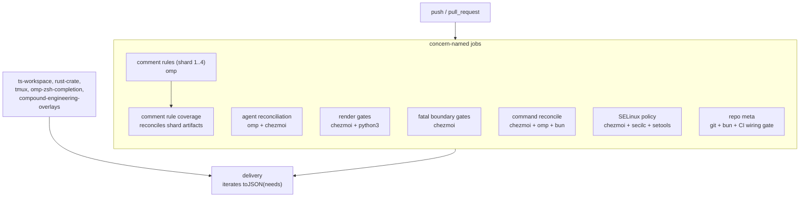
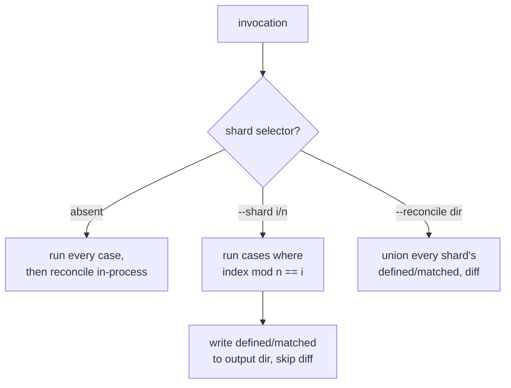

# Split the oh-my-pi Agent Integration CI Job - Plan

## Goal Capsule

- **Objective:** A contributor who pushes to this repository waits a fraction of today's four and a half minutes to learn whether CI is green, and every push proves the SELinux policy's effective write boundary rather than only its text.
- **Means:** Replace the single `oh-my-pi agent integration` job with concern-named jobs that run concurrently, shard the gate that dominates its runtime, and install the SELinux policy tooling in the job that now owns that test (KTD1, KTD7).
- **Product authority:** The four Key Decisions below govern the split axis, job topology, sharding mechanism, and the wiring gate's inclusion. GitHub issue #334 governs the SELinux tooling acceptance criteria.
- **Execution profile:** Two `.ci` shell scripts change, one is added, and `.github/workflows/ci.yml` is restructured. No chezmoi source, no deployed `$HOME` state, and no production behavior is touched.
- **Stop conditions:** Stop if the split would drop an assertion that runs today, if the sharded gate cannot reproduce the unsharded case set, or if `delivery` would pass while any job is skipped or cancelled.
- **Tail ownership:** Local verification by running the changed `.ci` scripts directly; CI verification by the `delivery` job on the pull request, plus the per-job durations from the run's jobs API.

---

## Product Contract

**Product Contract preservation:** changed — R11. The gate must scan every workflow under `.github/workflows/`, not `ci.yml` alone. Five scripts are wired only through `render-dotfiles.yml` and one only through `merge-commit-only.yml`, so a `ci.yml`-only scan would report six false violations. R10 stays `ci.yml`-scoped because `delivery` lives there. No other requirement changed.

### Summary

Split `.github/workflows/ci.yml`'s `oh-my-pi agent integration` job into several jobs named after the concern each verifies, and shard `.ci/test-omp-comment-rules.sh` across matrix legs so no single leg carries its full 149-second cost. Convert the `delivery` aggregate to iterate `needs` instead of naming every job in three places, and add a gate that fails when a CI job or a `.ci` test script is not wired in. Install `secilc` and `python3-setools` in the job that runs the SELinux test, which resolves issue #334.

### Problem Frame

`oh-my-pi agent integration` takes 276 seconds. Every other job in the workflow finishes within 45 seconds, so this one job is the entire critical path — a contributor waits four and a half minutes for a signal that the five other jobs delivered in under one.

The time is not spread evenly. Measured from run [33596706621](https://github.com/hyperlapse122/dotfiles/actions/runs/33596706621), the first green run after the SELinux test was wired in:

| Segment | Duration |
|---|---|
| checkout, `setup-bun`, `setup-vp`, locked `chezmoi` and `omp`, template renders | ~15s |
| `.ci/test-omp-comment-rules.sh` | 149s |
| `.ci/test-skip-declaration-gates.sh` | 35s |
| `.ci/test-omp-agent-reconcile.sh` | 29s |
| `.ci/test-git-prune-local-branches.sh` | 16s |
| `.ci/test-extension-retry.sh` + `.ci/test-capability-cache.sh` | 15s |
| the other 20 scripts, combined | ~17s |

One script is 54% of the job. `omp ttsr test` has no batch mode, so `.ci/test-omp-comment-rules.sh` spawns a fresh process per case — roughly one second each on the runner. The cost is process startup, not assertion logic, which means splitting at job boundaries alone floors the workflow at about 165 seconds.

The job also carries a coverage gap. `.ci/test-selinux-protected-configs.sh` compiles the CIL modules and queries the compiled policy for who may write what, but both steps are conditional on `secilc` and `python3-setools`, and `ubuntu-latest` ships neither. The strongest assertion in that test — the one that would have caught the `(typeattributeset file_type (protected_agent_config_t))` defect, where a blanket base grant made the read-only rule decorative — has never executed in CI. Issue #334 records the evidence.

Splitting the job introduces a new gap of its own. With one job, a new `.ci` test script had one obvious place to go. With several, a script can be written and wired nowhere, and the workflow stays green. That failure already exists today: `.ci/test-garden-shallow-pull.sh` is referenced by no workflow and no other script. It runs nowhere.

### Key Decisions

- KD1. **Split by domain and concern, not by measured duration.** Job names say what they verify, so a red job names what broke and a new test has an obvious home. (session-settled: user-directed — chosen over duration-balanced bin-packing and setup-dependency grouping: rebalancing after every timing change, and job names that identify nothing, cost more than uneven legs.) Governs R1, R2.
- KD2. **Explicit jobs with a `toJSON(needs)` aggregate.** Each job declares only the setup its scripts need; `delivery` iterates the `needs` results instead of restating every job name in a `needs` list, an `env` block, and a loop. (session-settled: user-directed — chosen over one matrix job and over a shared composite setup action: job names collapse to one place while per-job setup stays free.) Governs R2, R9.
- KD3. **Shard the dominant gate through GitHub matrix legs, not in-script parallelism.** The script gains a shard selector; GitHub runs the legs. (session-settled: user-directed — chosen over job-boundary splitting alone and over `xargs -P` inside the script: the script's failure reporting and scratch-directory isolation stay as written.) Governs R5, R8.
  - Conflict call-out: the script's cross-case coverage assertion cannot run inside a shard. KTD2 carries the mechanism that preserves it.
- KD4. **Close the wiring blindspot in this same change.** (session-settled: user-directed — chosen over aggregating coverage only and over deferring the gate: the split creates the gap, so the guard ships with it.) Governs R10, R11.
- KD5. **Shards divide cases by round-robin index, not by rule family.** Family sharding would match the domain axis, but `c-family` holds 44 of the 86 alias cases and its leg would stay near 70 seconds. Governs R6.
- KD6. **Issue #334 is resolved inside this split rather than separately.** The split decides which job owns the SELinux test, and the package installation follows that job. Governs R12.
- KD7. **No observable test behavior changes.** This is a relocation: no assertion is added, weakened, or removed, and every script keeps its standalone local invocation. Governs R4, R7, R15.

### Requirements

**Splitting and concurrency**

- R1. `oh-my-pi agent integration` is replaced by several jobs, each named after the concern it verifies.
- R2. Each job performs only the setup its own scripts require.
- R3. No job in the workflow runs longer than 90 seconds on a green run.
- R4. Every assertion that ran before the split still runs after it. No `.ci` script loses a caller.

**Sharding the dominant gate**

- R5. `.ci/test-omp-comment-rules.sh` accepts a shard selector that runs a subset of its cases. Invoked without one, it runs every case, so a developer's local run is unchanged.
- R6. Shards divide the case set evenly. No shard carries substantially more than its share.
- R7. The union of all shards is exactly the unsharded case set, with no case duplicated and none dropped.
- R8. Each shard owns its scratch directory. Concurrent shards do not observe or disturb each other's state.

**Aggregate correctness**

- R9. `delivery` verifies every result in `needs` by iterating them. A job name is written in one place, not three.
- R10. A gate fails when a job defined in `.github/workflows/ci.yml` is absent from `delivery`'s `needs`.
- R11. A gate fails when an executable `.ci/test-*.sh` or `.ci/check-*.sh` script is invoked by no job in any workflow under `.github/workflows/`. Scripts deliberately excluded from CI are declared in an explicit exception list, and a script invoked only by another script counts as wired through its caller.

**SELinux policy query (issue #334)**

- R12. The job that runs `.ci/test-selinux-protected-configs.sh` installs `secilc` and `python3-setools` before running it.
- R13. That job's log contains `test-selinux-protected-configs: compiled-policy write boundary verified.`
- R14. The comment at `.github/workflows/ci.yml:136-138` calling those packages optional is removed or rewritten to match.
- R15. The in-script conditionals guarding the compile and query steps stay, so the suite still runs on a machine without the tooling.

### Acceptance Examples

- AE1. Sharded coverage is exact.
  - **Covers R7.**
  - **Given** `.ci/test-omp-comment-rules.sh` runs across every shard of an n-shard split.
  - **When** the case labels each shard executed are collected.
  - **Then** their union equals the case set of an unsharded run, and no two shards share a case.
- AE2. The local invocation is unchanged.
  - **Covers R5.**
  - **Given** a developer runs `.ci/test-omp-comment-rules.sh` with no shard selector.
  - **Then** every case runs and the script prints the same final message it printed before this change.
- AE3. An unwired script fails CI.
  - **Covers R11.**
  - **Given** a new `.ci/test-*.sh` exists, no workflow invokes it, no other `.ci` script invokes it, and it is not in the exception list.
  - **When** CI runs.
  - **Then** the wiring gate fails and names that script.
- AE4. An unaggregated job fails CI.
  - **Covers R10.**
  - **Given** a new job is added to `.github/workflows/ci.yml` and omitted from `delivery`'s `needs`.
  - **When** CI runs.
  - **Then** the wiring gate fails and names that job.
- AE5. The policy query runs and bites.
  - **Covers R12, R13.**
  - **Given** the SELinux job runs with `secilc` and `python3-setools` installed.
  - **Then** its log contains `test-selinux-protected-configs: compiled-policy write boundary verified.`
  - **And given** the shipped module regains `(typeattributeset file_type (protected_agent_config_t))`, **then** the policy query reports `unconfined_t` as a writer and the job fails.
  - **And given** the same declaration on the mutant fixture the test builds for itself, **then** the query must report `unconfined_t` as a writer; the job fails when it does not, because the check has stopped detecting the defect.

### Scope Boundaries

- Reducing `omp`'s per-invocation startup cost, such as a batch mode for `omp ttsr test`. That is an upstream change to `omp`, not to this repository.
- Sharding `.ci/test-skip-declaration-gates.sh`. At 35 seconds it stops being the critical path once the comment-rules gate is sharded.
- `.github/workflows/render-dotfiles.yml` and the other `ci.yml` jobs. All already finish within 45 seconds.
- Extracting the shared setup steps into a composite action. It was a considered alternative to KD2 and was not chosen.

#### Deferred to Follow-Up Work

- Wiring `.ci/test-garden-shallow-pull.sh` into CI. It needs the `garden` CLI, which no runner provisions; KTD6 records it as a declared exception instead.

### Dependencies and Assumptions

- `secilc` (3.5-1) and `python3-setools` (4.4.4-1build1) are present in the Ubuntu 24.04 (noble) archive. Confirmed 2026-09-02. `.ci/lib/apt-install.sh` already handles the mirror substitution and timeouts these installs need, per `docs/solutions/integration-issues/github-actions-ubuntu-runner-apt-mirrorlist-hang.md`.
- `main` carries no branch protection, so adding and renaming jobs breaks no required status check. Confirmed 2026-09-02. If protection is enabled later, the required-check list must be updated to the new job names.
- The repository is public, so GitHub-hosted runner minutes are free. Repeating setup across jobs costs queue slots, not money.
- `omp ttsr test` has no batch mode, so per-case process startup is the floor for `.ci/test-omp-comment-rules.sh` short of an upstream change.
- `.ci/check-skip-declarations.sh` has no workflow reference but is invoked by `.ci/test-skip-declaration-gates.sh`, which exercises both the fixture cases and the production declaration surface. It is wired through its caller, not orphaned, per R11.
- The runner image is not assumed to ship PyYAML. KTD5 installs `python3-yaml` explicitly.

### Sources

- Run [33596706621](https://github.com/hyperlapse122/dotfiles/actions/runs/33596706621) — the timing baseline in Problem Frame, taken from per-step and per-line log timestamps of the job and the two test steps.
- `.github/workflows/ci.yml:13-152` — the job under split. `:136-138` — the optional-packages comment R14 removes. `:266-308` — the `delivery` aggregate and the comment stating why grey must not read as green.
- `.ci/lib/apt-install.sh` — the existing apt helper R12's install step should use.
- `.github/workflows/render-dotfiles.yml:56-64, 300-311` — the repository's existing matrix-with-container job shape, a precedent for the shard legs.
- `.ci/test-omp-comment-rules.sh:26-47, 69-97` — `run_case` and the alias loop that produce the case set R5 through R7 shard. `:142-150` — the cross-case coverage reconciliation KTD2 must preserve.
- `.ci/test-chezmoiignore-script-paths.sh:154-166` — the repository's mutant-fixture pattern, the model for KTD7 and for the wiring gate's own self-tests.
- `.ci/check-omp-seat-routing.sh:1-40` — the house shape for a `.ci` meta-gate: contract comment, `repo_root` resolution, scratch under `${XDG_RUNTIME_DIR:-$HOME/.cache}`, trap cleanup.
- GitHub issue [#334](https://github.com/hyperlapse122/dotfiles/issues/334) — the SELinux coverage gap, its evidence, and its acceptance criteria.

---

## Planning Contract

### Key Technical Decisions

- KTD1. **Eight concern-named jobs, with the comment-rule gate as a four-leg matrix.** The grouping follows setup affinity within each concern, and four shards put the dominant gate below the longest remaining job. Governs R1, R3; instantiates KD1 and KD3.
- KTD2. **Shards emit their coverage data; a follow-on job reconciles it.** `.ci/test-omp-comment-rules.sh:142-150` diffs the accumulated `defined.*` against `matched.*` for every rule, asserting each declared condition matched at least one trigger fixture. That assertion spans the whole case set, so a shard running a subset would report false unmatched conditions. Each shard writes its accumulation to an output directory and skips the diff; the legs upload it, and one reconcile job downloads every leg's data and runs the diff over the union. Governs R4, R7.
- KTD3. **The shard selector picks by a running case index, and the case order is made deterministic.** `run_case` increments a counter and returns early when the counter does not belong to this shard. The family loop currently iterates `"${!aliases[@]}"`, whose order is a bash hash order rather than a stable sequence, so it is iterated over a sorted family list instead. Without that, shard membership is not reproducible across runs. Governs R6, R7.
- KTD4. **`delivery` iterates `toJSON(needs)` and fails closed on an empty object.** One `needs` list is the single place a job name appears. The step prints each job's result, then asserts every result is `success`; an empty or absent `needs` object fails rather than passing vacuously. Governs R9; instantiates KD2.
- KTD5. **The wiring gate parses every workflow with `python3` and PyYAML.** It scans all of `.github/workflows/*.yml` for `.ci/` invocations, and additionally treats a script referenced by another `.ci` script as wired through its caller. It reads `ci.yml`'s job map and `delivery`'s `needs`, exempting `delivery` itself, which cannot appear in its own `needs`. The gate's job installs `python3-yaml` through `.ci/lib/apt-install.sh`; grep-based YAML parsing was rejected as fragile against structure. Governs R10, R11.
- KTD6. **`.ci/test-garden-shallow-pull.sh` is a declared exception, not a wiring failure.** It exits 1 when `garden` is absent from `PATH` (`.ci/test-garden-shallow-pull.sh:11-14`), and no runner provisions that CLI. The exception list stores a mandatory reason per entry and fails when an entry names a file that no longer exists, so a stale exception cannot silently accumulate. Governs R11.
- KTD7. **Issue #334's one-time scratch-branch proof becomes a standing mutant assertion.** The SELinux test already compiles CIL in a scratch directory. It additionally compiles a mutant copy of `system/linux/selinux/dotfiles_protected_agent_configs.cil` with `(typeattributeset file_type (protected_agent_config_t))` restored, and fails if the policy query does *not* report `unconfined_t` as a writer of the protected types. This proves the same property on every push instead of once on a branch, and follows the existing mutant pattern at `.ci/test-chezmoiignore-script-paths.sh:154-166`. Governs R12, R13.
- KTD8. **Setup is per-job, not shared.** A job installs locked `chezmoi` only when its scripts render templates, locked `omp` only when they invoke it, and `setup-bun` / `setup-vp` only when they need a JavaScript runtime. The no-dependency jobs start at checkout. Governs R2; instantiates KD2.

### High-Level Technical Design

Job topology after the split. Every concern job and shard leg converges on the existing `delivery` aggregate; the reconcile job is the only intra-group dependency.

The comment-rule gate's three run modes. Only the unsharded mode exists today; the other two are what KTD2 and KTD3 add.

### Assumptions

- Four shards is chosen against the measured 149 seconds. The split adds jobs, and the GitHub Free plan caps concurrent jobs at 20; the post-split run schedules roughly 18. If that ceiling causes queuing, three shards still satisfies R3.
- Installing `secilc` and `python3-setools` costs 15 to 25 seconds. That lands inside the SELinux job's budget with wide margin, because the test itself runs in under a second.
- The reconcile job's artifact round trip costs under 15 seconds. Its inputs are small text files.

### Sequencing

The three script changes are independent of each other and all precede the workflow rewrite, because the workflow calls them with their new interfaces. The delivery rewrite follows the job split, because it consumes the final `needs` list.

---

## Implementation Units

### U1. Shard the comment-rule gate

- **Goal:** `.ci/test-omp-comment-rules.sh` can run one deterministic slice of its cases and emit its coverage data, and can reconcile the coverage data of a full set of slices.
- **Requirements:** R5, R6, R7, R8; KTD2, KTD3.
- **Dependencies:** none.
- **Files:** `.ci/test-omp-comment-rules.sh`.
- **Approach:**
  1. Add `--shard <i>/<n>` and `--reconcile <dir>` argument parsing. No arguments keeps today's behavior exactly: every case runs, then the in-process reconciliation diff runs.
  2. Iterate the family loop over a sorted family list rather than `"${!aliases[@]}"`, so the case index is reproducible (KTD3).
  3. Increment a case counter inside `run_case` and return early when the case does not belong to the active shard. Count every case, including ones the shard skips, so indices stay aligned across shards.
  4. Put `run_deployed` (`.ci/test-omp-comment-rules.sh:174-193`) on the same counter. Its seven cases invoke `omp` without passing through `run_case`, so leaving them out would run all seven in every leg and break R7's no-duplication clause. The deployed-home setup above them stays per-process; only the cases are sharded.
  5. In shard mode, write the accumulated `defined.<rule>` / `matched.<rule>` files to a directory named by `--coverage-out` and skip the reconciliation diff at `:142-150`.
  6. In `--reconcile` mode, union every shard subdirectory's `defined.*` / `matched.*` per rule, then run the existing diff over the union. Fail when a shard's data is missing, so a dropped leg cannot pass silently.
- **Patterns to follow:** the existing `run_case` / `run_snippet` helpers and `fail` reporting; keep the scratch-directory convention (`mktemp -d` under `${XDG_RUNTIME_DIR:-$HOME/.cache}`) untouched, which is what already satisfies R8.
- **Test scenarios:**
  - Covers AE2. No arguments: every case runs and the script prints `omp comment rule tests passed`.
  - Covers AE1. Four shards run with `--coverage-out` into separate directories, then `--reconcile` over the parent passes, and the concatenated case labels equal the unsharded run's labels with no duplicates.
  - A shard index outside `1..n`, a malformed `--shard` value, and `--shard` without `--coverage-out` each exit non-zero with a message naming the argument.
  - `--reconcile` over a directory missing one shard's data exits non-zero.
  - A rule condition that matches no trigger fixture is still caught: removing one trigger case from the set makes `--reconcile` fail with the same diff output the unsharded run produces.
- **Verification:** the unsharded run and the four-shard-plus-reconcile run both pass, and their case-label sets are identical.

### U2. Make the SELinux policy regression standing

- **Goal:** the compiled-policy query proves the write boundary and proves it would catch the defect it exists for, on every run that has the tooling.
- **Requirements:** R13, R15; KTD7. Covers issue #334's regression criterion.
- **Dependencies:** none.
- **Files:** `.ci/test-selinux-protected-configs.sh`.
- **Approach:**
  1. Keep the `secilc` and `setools` conditionals at `:220` and `:342` intact (R15).
  2. Inside the guarded block, compile a second policy from a mutant copy of `system/linux/selinux/dotfiles_protected_agent_configs.cil` with `(typeattributeset file_type (protected_agent_config_t))` restored, against the same base stub.
  3. Assert the query reports `unconfined_t` as a writer of `protected_agent_config_t` on the mutant. A mutant that passes the write-boundary check means the check no longer detects the defect, so fail with a message saying so.
  4. Leave the existing `compiled-policy write boundary verified.` message as the success signal R13 asserts on.
- **Patterns to follow:** `.ci/test-chezmoiignore-script-paths.sh:154-166` — build the mutant in the scratch directory, run the real checker against it in a subshell, and fail when it does not fail.
- **Test scenarios:**
  - Covers AE5. With `secilc` and `python3-setools` present, the script prints `compiled-policy write boundary verified.` and exits 0.
  - The mutant policy is reported as writable by `unconfined_t`; if it is not, the script exits non-zero naming the mutant assertion.
  - Without the tooling, the script still exits 0 after its text assertions and does not print the compiled-policy line.
- **Verification:** run on a host with `secilc` and `python3-setools` installed; both the real and mutant assertions report as expected.

### U3. Add the CI wiring gate

- **Goal:** a script that fails when a `ci.yml` job escapes the `delivery` aggregate, or when a `.ci` gate script is invoked by nothing.
- **Requirements:** R10, R11; KTD5, KTD6.
- **Dependencies:** none.
- **Files:** `.ci/test-ci-wiring.sh` (new).
- **Approach:**
  1. Parse every `.github/workflows/*.yml` with `python3` + PyYAML. Collect each workflow's `.ci/<name>.sh` invocations from its steps' `run` strings.
  2. Collect the `.ci` scripts referenced by other `.ci` scripts, so a helper invoked only by its caller counts as wired (R11).
  3. Enumerate executable `.ci/test-*.sh` and `.ci/check-*.sh`. Fail on any that no workflow and no other `.ci` script invokes and that the exception list does not name.
  4. Hold the exception list in the script as name-to-reason pairs. Fail when an entry names a file that does not exist. Seed it with `.ci/test-garden-shallow-pull.sh` and its reason (KTD6).
  5. From `ci.yml`, read the job map and `delivery`'s `needs`. Fail on any job absent from `needs`, exempting `delivery`.
  6. Fail with a message naming the missing package when PyYAML is unavailable, rather than falling back to text parsing.
- **Patterns to follow:** `.ci/check-omp-seat-routing.sh:1-40` for the contract comment, `repo_root` resolution, scratch handling, and trap cleanup; `.ci/test-chezmoiignore-script-paths.sh` for the mutant-fixture self-tests below.
- **Test scenarios:**
  - Covers AE4. A fixture `ci.yml` with a job missing from `delivery.needs` fails, naming that job.
  - Covers AE3. A fixture tree with an unreferenced `.ci/test-*.sh` fails, naming that script.
  - A script referenced only by another `.ci` script passes.
  - An exception entry naming a nonexistent file fails.
  - The real repository tree passes.
- **Verification:** the gate passes on the repository as it stands after U4 and U5, and each mutant fixture fails for its own reason.

### U4. Split the job into concern-named jobs

- **Goal:** `oh-my-pi agent integration` is gone, replaced by concern-named jobs that run concurrently, each with only the setup its scripts need.
- **Requirements:** R1, R2, R3, R4, R12, R14; KTD1, KTD8.
- **Dependencies:** U1, U2, U3.
- **Files:** `.github/workflows/ci.yml`.
- **Approach:**
  1. Create the concern jobs and distribute the 26 scripts across them so no script loses a caller (R4). The grouping in the topology diagram is the intended shape: comment rules (matrix, 4 legs), comment rule coverage, agent reconciliation, render gates, fatal boundary gates, command reconcile, SELinux policy, repo meta.
  2. Give each job only the setup steps its scripts need (KTD8). The template renders currently in `Render agent reconciler scripts` and `Render the fatal-boundary scripts under test` move to the jobs that consume their outputs.
  3. In the shard legs, invoke the gate with `--shard ${{ matrix.shard }}/4 --coverage-out ...` and upload the coverage directory. The coverage job downloads every leg's artifact and invokes `--reconcile`.
  4. In the SELinux job, install `secilc` and `python3-setools` before running the test (R12), and delete the optional-packages comment at `:136-138` (R14). Pass the helper's `-` sentinel, not a probe command: `.ci/lib/apt-install.sh:23` exits early when its first argument names a command already on `PATH`, so probing on `secilc` would skip `python3-setools` whenever `secilc` alone is present and silently restore the gap #334 closes.
  5. In the repo meta job, install `python3-yaml` through the same helper with the same `-` sentinel, then run `.ci/test-ci-wiring.sh`.
- **Patterns to follow:** `.github/workflows/render-dotfiles.yml:56-64` for matrix job shape and `:258-262` for the artifact upload step KTD2's shard legs need; the existing `Install locked chezmoi` and `Install locked OMP` steps, copied verbatim into the jobs that need them; the `.ci/lib/apt-install.sh` call sites at `:192` and `:226` for the install-step shape.
- **Execution note:** this is workflow configuration whose proof is a real CI run. Land it, push, and read the per-job durations from the run's jobs API rather than reasoning about the timing from the file.
- **Test scenarios:** `Test expectation: none` — no behavioral code changes here. The proof is U4's verification below plus `.ci/test-ci-wiring.sh` from U3, which fails if this unit drops a script.
- **Verification:** the run is green; `.ci/test-ci-wiring.sh` passes; the set of `.ci` scripts invoked across the new jobs equals the set the old job invoked; no job exceeds 90 seconds (R3); the SELinux job's log contains `compiled-policy write boundary verified.` (R13).

### U5. Iterate needs in the delivery aggregate

- **Goal:** `delivery` names each job once and fails on any non-success result, including skipped and cancelled.
- **Requirements:** R9, R10; KTD4.
- **Dependencies:** U4.
- **Files:** `.github/workflows/ci.yml`.
- **Approach:**
  1. Replace the per-job `env` block and the hand-written loop at `:286-308` with a single `NEEDS` env value holding `toJSON(needs)`.
  2. Print each job's result, then assert every result is `success` with `jq`.
  3. Fail when the object is empty or absent, so a mis-edited `needs` list cannot pass vacuously.
  4. Update `needs` to the post-split job list, and keep the comment explaining why grey must not read as green.
- **Patterns to follow:** the existing `if: always()` and `runs-on: ubuntu-24.04` shape at `:270-284`; the repository's existing `jq -e` assertion style in `.ci/test-omp-comment-rules.sh:199-205`.
- **Test scenarios:** `Test expectation: none` — workflow configuration. `.ci/test-ci-wiring.sh` from U3 is the standing assertion that `needs` stays complete.
- **Verification:** `delivery` is green on a green run; the step log lists every job with its result; `.ci/test-ci-wiring.sh` passes.

---

## Verification Contract

| Gate | Command | Applies to | Done signal |
|---|---|---|---|
| Comment rules, unsharded | `.ci/test-omp-comment-rules.sh` | U1 | prints `omp comment rule tests passed` |
| Comment rules, sharded | `.ci/test-omp-comment-rules.sh --shard <i>/4 --coverage-out <dir>/<i>` for each `i`, then `--reconcile <dir>` | U1 | all five invocations exit 0; case labels match the unsharded set |
| SELinux policy | `.ci/test-selinux-protected-configs.sh` | U2 | prints `compiled-policy write boundary verified.`; requires `secilc` and `python3-setools` (Fedora: `sudo dnf install secilc python3-setools`) |
| CI wiring | `.ci/test-ci-wiring.sh` | U3, U4, U5 | exits 0 on the repository tree; each mutant fixture fails |
| Full CI | the pull request's `delivery` job | U4, U5 | `delivery` green |
| Wall-clock budget | the run's jobs API, comparing each job's `started_at` and `completed_at` | R3 | no job over 90 seconds |
| Coverage parity | compare the `.ci` script set invoked by the new jobs against the pre-split `ci.yml` in git history | R4 | sets are equal |

---

## Definition of Done

**Global**

- Every requirement R1 through R15 is satisfied or explicitly deferred in Scope Boundaries.
- A CI run on the pull request is green, and its jobs API shows no job over 90 seconds.
- The SELinux job's log contains `test-selinux-protected-configs: compiled-policy write boundary verified.`
- `.ci/test-ci-wiring.sh` passes and is itself invoked by a job in `ci.yml`.
- Issue #334's four acceptance criteria are met. Its regression criterion is met by U2's standing mutant assertion rather than a one-time scratch branch; state that in the pull request body so the substitution is visible.
- No abandoned experiment remains in the diff: no commented-out job, no unused shard mode, no leftover fixture.

**Per unit**

- U1: unsharded and four-shard runs produce identical case-label sets; every argument-error scenario exits non-zero.
- U2: the mutant assertion fails a policy that regains `file_type`, and the tooling-absent path still exits 0.
- U3: the gate passes on the real tree and fails on each mutant fixture; the exception list carries a reason per entry.
- U4: every `.ci` script the old job invoked is invoked by exactly one new job; the optional-packages comment is gone.
- U5: `delivery` lists every job's result and fails on any non-success; job names appear only in `needs`.
