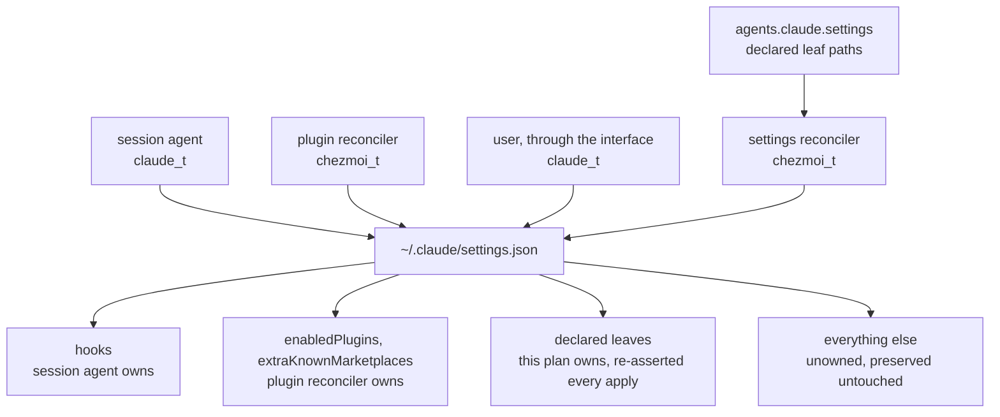
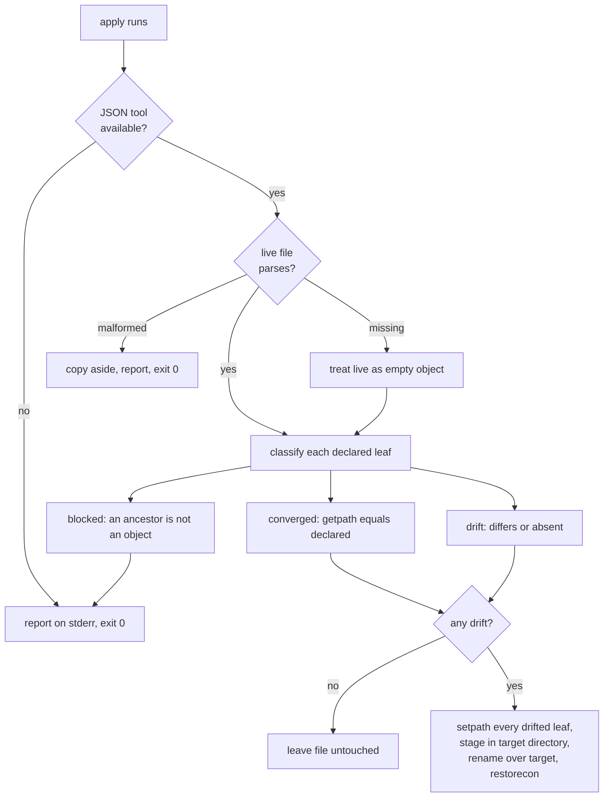

# Claude Code Settings Reconciliation - Plan

## Goal Capsule

- **Objective:** Claude Code behaviour and notification settings are the same on every host without anyone setting them by hand, and a value changed outside the declaration returns to the declared value on the next apply.
- **Means:** Assert each declared leaf path into the live settings file with a deep merge on every apply (KTD1, KTD2).
- **Product authority:** The user's session-settled decisions govern the scope, the ownership unit, the authority of the declaration, and which values are declared. Each is recorded in Key Decisions with its provenance.
- **Execution profile:** Chezmoi source-state changes across `.chezmoidata/`, `.chezmoitemplates/`, `.chezmoiscripts/70-agents/`, `.ci/`, and `.github/workflows/`. Verification renders templates against a throwaway destination; no step deploys to the live `$HOME`.
- **Stop conditions:** Stop and report if the live settings file cannot be parsed on the verification host, or if rendering the validation partial cannot be made to fail on a forbidden path — both mean the validation partial is not actually validating.
- **Tail ownership:** This plan owns the declaration, the reconciler, the validation partial, the test, and the ownership paragraph in `AGENTS.md`. It does not own the Antigravity harness or any config surface outside the settings file.
- **Open blockers:** None.

**Product Contract preservation:** restructured, no scope change — the two `Deferred to Planning` questions are resolved into KTD3 and KTD4 and the Outstanding Questions section is removed as a result. All R-IDs and AE-IDs are unchanged.

---

## Product Contract

### Summary

Fill the empty `agents.claude.settings` declaration and change the reconciler's merge from a top-level shallow overlay to leaf-path deep merge, so nested values can be owned without clobbering the records that hold them. The declaration becomes authoritative: every apply re-asserts it.

### Problem Frame

The reconciler already exists and runs on every apply, but `agents.claude.settings` is `{}`, so nothing is actually managed. Settings values were managed once, removed when the harness was unmanaged, and restored as an empty stub when the harness came back — the machinery survived the round trip and the data did not.

The cost lands on every new host. The values that decide how the tool behaves — interface language, whether the dangerous-mode prompt is skipped, the effort level for the default model, whether notifications fire — are set by hand, one host at a time, and drift apart silently afterwards. There is no record of what they are supposed to be.

The shallow merge is the reason the gap cannot be closed by filling in data alone. `jq '. + $declared'` replaces whole top-level keys, so owning one value inside `modelSettings` means declaring the entire record, and every model entry Claude Code adds there afterwards is erased on the next apply. Three writers already share this file — the session agent writes hook definitions, the plugin reconciler writes the marketplace and enabled-plugin sets, and the user writes preferences through the interface — so a merge that cannot address a single leaf cannot coexist with them.

### Key Decisions

- **This plan owns value declaration and ownership rules only.** (session-settled: user-directed — chosen over extending to `agy` or to config surfaces beyond the settings file: one coherent work unit with a clear acceptance boundary.) Governs R2, and the boundary in Scope Boundaries.
- **Ownership unit is the leaf path, applied as a deep merge.** (session-settled: user-directed — chosen over the current top-level shallow merge and over leaf assert with removal tracking: nested records must survive vendor writes, and removal tracking would introduce a state file this repository has avoided.) Governs R1, R5, R6.
- **The declaration is authoritative on every apply.** (session-settled: user-directed — chosen over a per-key assert/seed mode and over seed-only: one rule keeps the contract legible; a value that should stay adjustable is left undeclared instead.) Governs R4.
- **Declared set is the behaviour and notification values, not appearance.** (session-settled: user-directed — chosen over also declaring theme, editor mode, and verbosity: those are worth changing per host through the interface, and declaring them would revert those changes.) Governs R2.
- **Paths owned by another writer are rejected, not merely avoided.** A convention that lives only in a comment is a convention the next edit breaks. Governs R3, R8.
- **Path segments are separated by dots, so a settings key whose own name contains a dot cannot be declared.** The flat notation makes the owned set greppable; the cost is that one shape of key has no expressible form and stays out of scope until an escape form exists. Governs R1, R8.

The file has three other writers, and leaf ownership is what lets a fourth join them:

### Requirements

**Declaration data**

- R1. `agents.claude.settings` is a flat map whose keys are dot-separated paths to a leaf in the settings file and whose values are the JSON values to write at that leaf.
- R2. The declared set is `language`, `skipDangerousModePermissionPrompt`, `modelSettings.claude-opus-5.effortLevel`, `inputNeededNotifEnabled`, `agentPushNotifEnabled`, and `remoteControlAtStartup`.
- R3. A declared path may not address `hooks`, `enabledPlugins`, or `extraKnownMarketplaces`, or anything below them. The session agent owns the first and the plugin reconciler owns the other two.

**Reconciliation behaviour**

- R4. The reconciler runs on every apply and asserts every declared leaf, so a value changed outside the declaration returns to the declared value.
- R5. An assert writes only the addressed leaf; sibling keys at that path and other members of the records above it are unchanged in value. A write reserializes the whole document, so formatting is normalized on any apply that finds drift; a converged apply writes nothing at all (R7) and so changes no bytes.
- R6. A path that is not declared is never written, and removing a path from the declaration leaves its live value in place.
- R7. When every declared leaf already holds its declared value, the reconciler leaves the file untouched.

**Validation and failure visibility**

- R8. The declaration is validated at render time and a violation stops the apply: a path R3 forbids, an empty segment (a leading, trailing, or doubled dot), and an empty path.
- R9. When the reconciler cannot assert — a missing dependency, an unreadable or malformed target — it reports what it skipped on stderr rather than exiting silently, because under R4 a silent skip leaves the user believing values are pinned when they are not.
- R10. Repository tests cover sibling survival under R5, the render-time rejections under R8, and the diagnostic under R9.

**Coexistence with live writers**

- R11. The reconciler stages its write in the same directory as the target file and replaces the target by rename within that filesystem, so the staged file inherits the target directory's SELinux type and the replacement is atomic.
- R12. A write by a running Claude Code session concurrent with an apply does not leave the settings file corrupt or truncated.

### Acceptance Examples

- AE1. **Covers R5.** **Given** `modelSettings` holds an entry for a model other than the declared one, **when** an apply asserts `modelSettings.claude-opus-5.effortLevel`, **then** the other model's entry is unchanged in value and only the declared leaf is written.
- AE2. **Covers R4.** **Given** the interface language was changed away from the declared value, **when** the next apply runs, **then** the language is the declared value again.
- AE3. **Covers R6.** **Given** `remoteControlAtStartup` is removed from the declaration, **when** the next apply runs, **then** its live value is whatever it was and the key is not deleted.
- AE4. **Covers R3, R8.** **Given** a declaration addressing a path under `hooks`, **when** the template renders, **then** the apply stops and names the offending path.
- AE5. **Covers R8.** **Given** a declared path with an empty segment such as `modelSettings..effortLevel`, **when** the template renders, **then** the apply stops rather than nesting the value at a guessed boundary.
- AE6. **Covers R7.** **Given** every declared leaf already holds its declared value, **when** an apply runs, **then** the file's modification time is unchanged.
- AE7. **Covers R9.** **Given** the dependency the reconciler needs to edit JSON is unavailable, **when** an apply runs, **then** the apply reports that settings were not asserted.

<!-- ce-section: work-relationships -->
### How This Work Fits Together

This plan owns the Claude Code settings declaration and the ownership rules that make it safe. The breakdown below is how the surrounding work is understood now, not a committed roadmap; a later plan may revise, split, or discard any of it and should cite this plan by path.

- Antigravity settings reconciliation
  - Depends on this plan for the leaf-path and validation shape, which it would mirror rather than reinvent.
  - Still to decide: where that harness keeps its settings and whether the same file shape applies. `agents.agy.settings` stays declared and unused until then.
- Config surfaces beyond the settings file — subagent, command, and output-style directories
  - Can proceed independently of this plan; they are directory trees, not values in a shared file.
  - Shares the ownership question with this plan wherever the session agent also writes those trees.
- Permission policy declaration
  - Enables nothing here, but is the most likely first addition to the declared set once the leaf-path mechanism is proven, because it is the remaining settings area with a nested shape.

### Scope Boundaries

- Antigravity settings reconciliation. `agents.agy.settings` remains declared and unconsumed; no reconciler is built for it here.
- Appearance values — theme, editor mode, verbosity. Left adjustable through the interface, per the declared-set decision in Key Decisions.
- Permission policy values.
- Config surfaces outside the settings file.
- Reverting a value when its path is removed from the declaration. R6 fixes the behaviour as leave-in-place; removal tracking would need persistent state.
- Declaring a settings key whose own name contains a dot. The flat notation gives it no expressible form and render-time validation cannot distinguish it from an extra segment, so it stays out of scope until an escape form exists.

#### Deferred to Follow-Up Work

- Sharing the validation partial with a future Antigravity settings reconciler. The partial is written for one caller now; generalizing it before a second caller exists would invent a contract with no consumer.

### Dependencies / Assumptions

- The SELinux policy permits the write. Verified against the running policy: the target file and its directory carry `claude_config_t`, that type is a member of `protected_agent_config_type`, and the module grants `chezmoi_t` create, write, rename, and relabel on that attribute. R11 preserves the label inheritance this depends on.
- The tool offers no command-line interface for setting a configuration value, so the settings file is edited directly. Verified against the installed version: a `config` argument is treated as a prompt, not a subcommand.
- The reconciler runs on every apply rather than on a source-content change, because a value overwritten by the tool does not change any source fingerprint. The always-run lifecycle also exempts it from the repository's skip-declaration check, so its early exits are governed by R9 rather than by that check.
- A JSON-editing dependency is present on hosts that reconcile. R9 covers its absence.

### Sources / Research

- `.chezmoidata/agents.yaml` — `agents.claude.settings` is `{}` today; `agents.agy.settings` likewise.
- `.chezmoiscripts/70-agents/run_after_config-claude-settings.sh.tmpl` — the existing reconciler, currently a top-level shallow merge.
- `.chezmoiscripts/70-agents/run_after_config-omp-settings.sh.tmpl` — the precedent for per-path assertion, convergence detection, and a stderr diagnostic on a skipped assert.
- `.chezmoitemplates/omp-settings-validate.tmpl` — the precedent for render-time, fail-closed validation of a settings declaration, including its stated reason for living in a partial rather than inline.
- `docs/solutions/security-issues/selinux-user-scope-agent-config-protection.md` — records "SELinux label stripping when setting files are atomically moved from /tmp" as a known symptom. R11 is the standing guard against that recurrence.
- `system/linux/selinux/dotfiles_protected_agent_configs.cil` — the type membership and the writer grants that R11 relies on.
- `STRATEGY.md` — "Idempotent-apply cleanliness: a second apply on unchanged source changes zero" is the stated metric R7 serves.
- `docs/plans/2026-07-20-002-feat-manage-claude-settings-plan.md` — the original introduction of this reconciler, including why the settings file is not a managed target.
- No repository test currently covers this reconciler; R10 adds the first.

---

## Planning Contract

### Key Technical Decisions

- KTD1. **Assert each declared leaf with `setpath` over the path split on dots.** (session-settled: user-directed — chosen over the current top-level `jq '. + $declared'` and over leaf assert with removal tracking: nested records must survive vendor writes, and removal tracking would introduce a state file this repository has avoided.) Governs R1, R5, R6. `setpath` creates missing intermediate objects, so a host whose settings file has no `modelSettings` record needs no special case.
- KTD2. **Keep the `run_after_` always-run lifecycle.** Governs R4. A value the tool overwrites changes no chezmoi source fingerprint, so an onchange script would not re-assert until the declaration itself changed — the same reasoning recorded in the header of the omp settings reconciler.
- KTD3. **Satisfy concurrency with the same-directory rename alone; do not acquire `~/.claude/settings.json.lock`.** Governs R11, R12. The rename is atomic, so a concurrent reader sees either the whole old file or the whole new one and never a truncated one, which is exactly what R12 requires. The lock file is zero bytes with no documented protocol, so taking it would guess at the vendor's locking discipline and risk stalling every apply. A lost update in the other direction is self-healing only for the declared leaves: R4 re-asserts those on the next apply, but a write by another owner that lands between the read and the rename is lost and nothing restores it, because the plugin reconciler is onchange and the session agent writes at session start. Narrow that window by recording the target's inode and modification time immediately after the read and re-checking both immediately before the rename; on a change, discard the staged file and report on stderr so the next apply retries. (Resolves the deferred concurrency question.)
- KTD4. **Put the validation partial in `.chezmoitemplates/claude-settings-validate.tmpl`, not in the reconciler's render header.** Governs R3, R8. This mirrors `omp-settings-validate.tmpl`, whose own header states the reason: a validation partial written inline can silently exist for one consumer only. A partial is also directly renderable, which is what lets the test assert a rejection without rendering the whole script. (Resolves the deferred validation-location question.)
- KTD5. **A declared JSON null writes a literal null; it is not a reset.** Governs R1. The omp reconciler treats null as "reset to upstream default" because its CLI has a `reset` verb. There is no such verb here, so importing that meaning would be a silent behavioural divergence between two adjacent declarations; the validation partial rejects nothing on this axis and the value is written as given.
- KTD6. **A malformed live file is backed up and reported, not overwritten.** Governs R9. Under leaf semantics, rebuilding from the declaration alone would produce a file holding only the declared leaves, discarding whatever the session agent and plugin reconciler had written. The reconciler copies the file aside, reports on stderr, and exits without writing, so the apply continues and the next one retries.
- KTD7. **An empty declaration renders a notice and no assertion loop.** Governs R8. The eligible set is a render-time constant, matching how the plugin updaters already handle an empty set, so "manage nothing" stays a valid state rather than a runtime skip or a hard failure.

### High-Level Technical Design

The reconciler resolves one state per declared leaf before it decides whether to write at all. Only the drift state produces output, which is what keeps a converged apply byte-clean.

The `blocked` state is the case the path cannot express: an ancestor of a declared path exists but holds a scalar or an array. Both the read probe and the write raise on it, so the classifier must test each ancestor's type — or catch the error — and emit `blocked` as a state on the stream rather than letting the whole pass exit non-zero. It is reported rather than repaired, because coercing a vendor-written value into an object is a data change the declaration did not ask for.

### Assumptions

- The live settings file is a JSON object at its root on every host that reconciles. A root of any other type is treated as malformed under KTD6.
- Declared values are non-secret. The declaration is rendered into the script body, so a credential there would land in the rendered script; the validation partial's charset rule is not a credential check and the declared set carries none.

### Sequencing

U1 and U2 are independent and can land in either order. U3 depends on both: it consumes the declaration and includes the partial. U4 depends on U3 because it renders the finished script. U5 documents the behaviour U3 establishes.

---

## Implementation Units

### U1. Declare the managed settings set

- **Goal:** `agents.claude.settings` carries the six declared leaf paths instead of an empty map.
- **Requirements:** R1, R2.
- **Dependencies:** none.
- **Files:** `.chezmoidata/agents.yaml` (modify).
- **Approach:**
  1. Replace `settings: {}` under `agents.claude` with the six paths from R2, quoting each dotted key so YAML reads it as one scalar key rather than a nested map.
  2. Keep native YAML types — booleans stay unquoted booleans so `toJson` marshals them as JSON booleans, and `language` stays a string.
  3. Add a header comment naming the reconciler and the validation partial as consumers, in the style of the existing `agents.omp` block.
  4. Leave `agents.agy.settings` at `{}` and untouched.
- **Patterns to follow:** the comment style and key ordering of the `agents.omp.settings` block in the same file.
- **Test scenarios:**
  - Rendering `{{ .agents.claude.settings | toJson }}` yields an object with exactly six keys, where `skipDangerousModePermissionPrompt`, `inputNeededNotifEnabled`, and `agentPushNotifEnabled` are JSON `true`, `remoteControlAtStartup` is JSON `false`, and `language` and the effort level are strings.
  - The key `modelSettings.claude-opus-5.effortLevel` survives the YAML load as a single key, not as three nested maps.
- **Verification:** the rendered declaration is valid JSON with the R2 key set at the correct types.

### U2. Add the render-time validation partial

- **Goal:** a bad declaration stops the apply before the reconciler renders a line.
- **Requirements:** R3, R8.
- **Dependencies:** none.
- **Files:** `.chezmoitemplates/claude-settings-validate.tmpl` (create).
- **Approach:**
  1. Take `ctx` and `settings` in a dict, matching the call shape of `omp-settings-validate.tmpl`.
  2. Fail when `settings` is not a map. An empty map is valid and returns without further checks, per KTD7.
  3. Fail on a key that is empty, that has an empty segment, or that does not match a dotted-path grammar whose segments permit letters, digits, underscore, and hyphen — hyphen is required because model ids such as `claude-opus-5` are path segments.
  4. Fail on a key whose first segment is `hooks`, `enabledPlugins`, or `extraKnownMarketplaces`, naming the owning writer in the message, per R3.
  5. Write a header comment stating what each check protects and why it cannot be deferred to runtime, following the partial it mirrors.
- **Patterns to follow:** `.chezmoitemplates/omp-settings-validate.tmpl` — the numbered header rationale, the `fail` messages that name the offending path, and the `ctx` guard.
- **Test scenarios:**
  - Covers AE4. A declaration containing `hooks.SessionStart` fails the render and the message names `hooks`.
  - Covers AE5. A declaration with an empty segment — a leading, trailing, or doubled dot — fails the render.
  - A declaration whose key is the empty string fails the render.
  - A declaration containing `enabledPlugins` fails, and one containing `extraKnownMarketplaces` fails.
  - The R2 declaration renders without error, and `modelSettings.claude-opus-5.effortLevel` is accepted, proving the grammar admits hyphens and digits in a segment.
  - An empty map renders without error.
- **Verification:** each forbidden shape aborts `chezmoi execute-template` with a message naming the offending path, and the real declaration renders clean.

### U3. Convert the reconciler to leaf-path deep merge

- **Goal:** the reconciler asserts declared leaves without disturbing anything else, and never fails silently.
- **Requirements:** R4, R5, R6, R7, R9, R11, R12.
- **Dependencies:** U1, U2.
- **Files:** `.chezmoiscripts/70-agents/run_after_config-claude-settings.sh.tmpl` (modify).
- **Approach:**
  1. Include the U2 partial at the top of the template so a bad declaration aborts before any script text renders.
  2. Keep the existing `CLAUDE_SETTINGS` environment override and the non-Windows guard; the override is what lets U4 exercise the script against a fixture.
  3. Replace the `. + $declared` merge with a reduction that splits each declared key on dots and applies `setpath`, per KTD1.
  4. Classify before writing, in one pass: probe each declared leaf against the live document, skip the write entirely when none drifted (R7), and emit `blocked` for a path whose ancestor holds a scalar or an array. The probe raises on such an ancestor exactly as the write does, so test each ancestor's type or catch the error — a bare probe kills the stream before any blocked path can be reported.
  5. On a missing target, reduce onto an empty object; on a malformed one, copy aside and report without writing, per KTD6.
  6. Give each cannot-assert exit a stderr diagnostic naming what was skipped, per R9: the missing-dependency guard, the malformed target, and a blocked ancestor. The converged path exits silently and writes nothing (R7) — convergence is the success case, not a skip.
  7. Keep the staged file in the target directory and the `mv` plus `restorecon`, per KTD3 and R11, and re-check the target's identity immediately before the rename per KTD3.
- **Execution note:** this is a reconciler whose failure mode is silent success, so prove the converged case first — an apply that changes nothing must leave the file's inode and mtime alone before any drift case is worth testing.
- **Patterns to follow:** `.chezmoiscripts/70-agents/run_after_config-omp-settings.sh.tmpl` for the declared-versus-live classification stream and the diagnostic wording; the existing script for the temp-file and `restorecon` handling.
- **Test scenarios:**
  - Covers AE1. A fixture whose `modelSettings` holds an unrelated model keeps that entry after the run, and the declared effort level is set.
  - Covers AE2. A fixture whose `language` differs is returned to the declared value.
  - Covers AE3. A key absent from the declaration but present in the fixture is unchanged in value and still present.
  - Covers AE6. A converged fixture is not rewritten — assert on inode identity, mirroring the existing auth-reconciler test.
  - Covers AE7. With the JSON tool absent from `PATH`, the run reports on stderr and exits without touching the fixture.
  - `hooks`, `enabledPlugins`, and `extraKnownMarketplaces` in the fixture are unchanged in value after a run that asserts every declared leaf — compare the parsed subtrees, not the raw bytes, because a drift write reformats the document.
  - A fixture missing the file entirely gains a file containing exactly the declared leaves.
  - A malformed fixture is left unchanged, a `.bak` copy appears, and the run reports on stderr.
  - A fixture where `modelSettings` is a string is reported as blocked and not written.
  - The staged temp file is created inside the target's directory, so a fixture on a separate filesystem still completes by rename.
- **Verification:** every scenario above passes against a fixture directory driven by `CLAUDE_SETTINGS`, with no write to the real `$HOME`.

### U4. Add the reconciler test and wire it into CI

- **Goal:** the behaviours above are enforced on every CI run.
- **Requirements:** R10.
- **Dependencies:** U3.
- **Files:** `.ci/test-claude-settings-reconcile.sh` (create), `.github/workflows/ci.yml` (modify).
- **Approach:**
  1. Take the rendered settings script path as the first argument, matching how the sibling reconciler tests are invoked.
  2. Build fixtures under a scratch directory derived from `XDG_RUNTIME_DIR`, mode 0700, removed by an `EXIT` trap.
  3. Drive the script with `CLAUDE_SETTINGS` pointed at each fixture and assert the U3 scenarios, including the inode-identity check for the converged case.
  4. Add render assertions for the U2 rejections using the `--override-data` and `execute-template` helpers the omp reconcile test already uses. `--override-data` deep-merges into the real declaration and can only add keys, so it cannot express the empty-map case once U1 declares six paths: drive the two positive cases — the empty map and the real declaration proving the grammar admits hyphens and digits — through an inline template that builds its own settings dict and calls the partial, the mechanism the existing negative helper already uses.
  5. Render the settings script into `$RUNNER_TEMP` as `claude-settings.sh` by adding it to the existing render loop. Do not name it `settings.sh` — that output already belongs to the omp reconciler and is consumed by `.ci/check-omp-agent-roster.sh`. Then invoke the new test with that path from the same CI step.
- **Patterns to follow:** `.ci/test-omp-agent-reconcile.sh` for `assert_render_fails` / `assert_render_ok`, the stub `op` and scratch `HOME`, and the inode-identity assertion; `.github/workflows/ci.yml` "Test agent reconciliation" for the render-then-invoke shape.
- **Test scenarios:** the test file is itself the scenario set; it must cover every scenario enumerated in U2 and U3 and fail if any is removed from the reconciler.
- **Verification:** the test passes locally against a rendered script and fails when the merge is reverted to `. + $declared`.

### U5. Correct the ownership documentation

- **Goal:** `AGENTS.md` describes the merge that actually ships.
- **Requirements:** none directly; it prevents the repository's own instruction file from contradicting U3.
- **Dependencies:** U3.
- **Files:** `AGENTS.md` (modify).
- **Approach:**
  1. Replace the sentence stating that the reconciler "merges declared settings additively" — that describes the shallow merge being removed.
  2. State the leaf-path ownership rule, that undeclared paths and sibling members are preserved, and that the three writer-owned prefixes are rejected at render time.
  3. Add `.chezmoidata/agents.yaml` `agents.claude.settings` to the single-source-of-truth listing alongside the existing agent data rows.
- **Patterns to follow:** the surrounding "Agent surfaces and ownership" prose, which already documents the omp per-key assertion boundary in the same register.
- **Test scenarios:** Test expectation: none — documentation change with no behavioural surface.
- **Verification:** the paragraph names the leaf-path rule and no sentence in `AGENTS.md` still describes an additive top-level merge.

---

## Verification Contract

| Gate | Command or check | Applies to |
|---|---|---|
| Template render | `chezmoi execute-template` against the stub-`op` scratch recipe in `AGENTS.md` "Verification", with `--source "$PWD"` and a throwaway destination | U1, U2, U3 |
| Guard rejects | `chezmoi ... --override-data <bad declaration> execute-template` exits non-zero and names the path | U2 |
| Reconciler behaviour | `.ci/test-claude-settings-reconcile.sh <rendered script>` | U3, U4 |
| Skip declarations | `.ci/check-skip-declarations.sh` still reports the rendered surface matching the matrix | U3 |
| Whitespace and scope | `git diff --check` and a diff limited to the five files named above | all |

No step runs `chezmoi apply`. The reconciler is exercised only through `CLAUDE_SETTINGS` against fixtures, never against the live `~/.claude/settings.json`.

---

## Definition of Done

- The six R2 paths are declared in `.chezmoidata/agents.yaml` and render as JSON at the correct types.
- The validation partial exists and aborts the render for each forbidden shape in U2, while the real declaration renders clean.
- The reconciler asserts declared leaves by `setpath`, preserves every undeclared key and sibling member, writes nothing when converged, and reports on stderr for the missing-dependency, malformed-target, and blocked-ancestor paths.
- The staged file is created in the target directory and moved into place by rename, with the target's identity re-checked immediately before the rename and `restorecon` applied afterwards.
- `.ci/test-claude-settings-reconcile.sh` exists, covers every scenario in U2 and U3, and runs in the CI agent-reconciliation step.
- `AGENTS.md` no longer describes an additive top-level merge and states the leaf-path ownership rule.
- No experimental or dead-end code from abandoned approaches remains in the diff.
- Every verification gate above has been run and reported, with any skipped gate named and justified.
