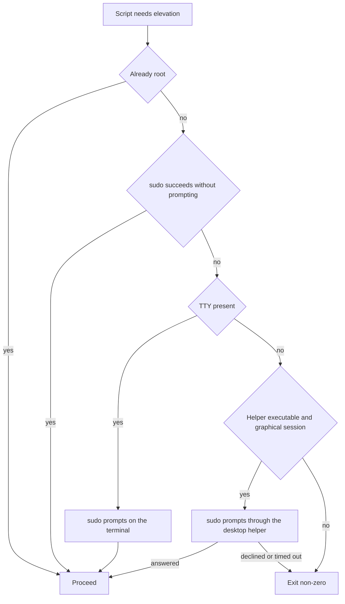
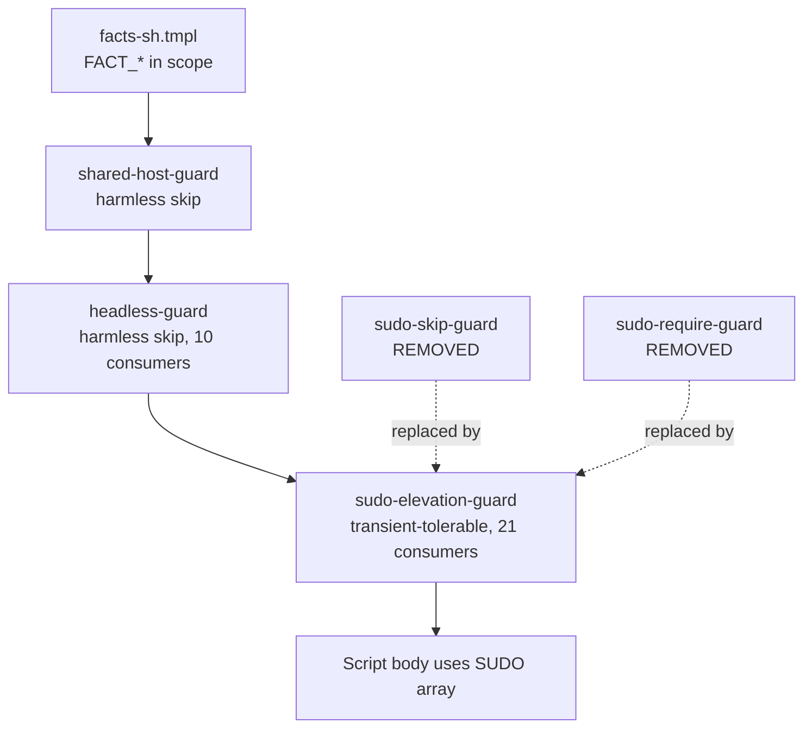

# Sudo Elevation as a Hard Precondition with a Desktop Askpass Rung - Plan

## Goal Capsule

- **Objective**: A `chezmoi apply` on a host that has any elevation path provisions the system, whether or not the run has a TTY. On a host that has none, the run fails loudly instead of recording unprovisioned scripts as successful.
- **Means**: Replace the two sudo guard partials with one hard-failing guard whose elevation ladder adds a `SUDO_ASKPASS` rung between the terminal prompt and the failure. (KTD1, KTD2)
- **Authority hierarchy**: R-IDs govern elevation behavior, credential ownership, and the guard surface. KTDs govern the guard's mechanism, the declaration form, and the call signature within those R constraints. Units execute; they amend neither.
- **Stop conditions**: `.ci/check-skip-declarations.sh` cannot be reconciled to the new site set; a render test cannot express a ladder branch; `sudo -A` proves able to fall back to a TTY read.
- **Execution profile**: Template and shell changes across two retired guard partials, one new guard partial, 21 consumer scripts (one of which is also the package script that gains the helper), one environment file, two operator-facing docs, two CI gates plus the skip matrix, and one new render test.
- **Tail ownership**: `lfg` owns commit, push, PR, and CI watch after `ce-work` returns.

**Product Contract preservation**: changed — R12, and R4's bound narrowed.

R12 no longer deletes the `no-cached-sudo` declaration; it re-declares it. That carries three consequences the original wording did not disclose: the matrix row's direction moves from `transient-blocking` (exit 0, capability-probe-driven re-run) to `transient-tolerable` (exit 1); this reverses `sudo-skip-guard.sh.tmpl`'s own documented rationale that a non-zero exit at these sites "is not an option"; and it requires an early-phase exception in `skip.sh.tmpl`'s shared contract comment, which every other guard and skip site reads (KTD8).

R4 now bounds the priming dialog only, not every dialog the rung can open. Post-priming re-prompts fall to sudo's own `passwd_timeout`. No other requirement changed meaning; no R-ID was split or moved.

---

## Product Contract

### Summary

Collapse `sudo-skip-guard.sh.tmpl` and `sudo-require-guard.sh.tmpl` into one guard that never exits 0 without doing its work. The guard walks an elevation ladder — root, cached sudo, terminal prompt, desktop askpass helper — and fails when every rung fails. The askpass rung is the new capability: it lets a TTY-less apply inside a graphical session obtain the password from the desktop's own credential store, which this repository never reads or writes.

### Problem Frame

An agent or editor-launched `chezmoi apply` runs without a TTY. `sudo` reads a password only from a terminal, so such a run cannot elevate even while the user sits at an unlocked desktop whose credential store holds the password.

The repository has two responses today and neither provisions the host.

`.chezmoitemplates/sudo-skip-guard.sh.tmpl` takes a declared skip when `[[ ! -t 0 ]] && ! sudo -n true`. Twelve `30-linux/` scripts then do nothing. The skip exits 0 because a non-zero exit aborts every later script in the apply, so chezmoi records the run as successful. That is the deeper defect: an unprovisioned host is indistinguishable from a provisioned one, and recovery depends on a `sudo-usable` capability token flipping to change the script's rendered content.

`.chezmoitemplates/sudo-require-guard.sh.tmpl` only checks `command -v sudo`, so nine `30-components/` and `20-base/fedora/` scripts proceed and die at the first password prompt rather than exiting on a stated precondition.

Ten of the twelve skip-guard consumers already sit behind `headless-guard.sh.tmpl`, which skips the whole desktop and system provisioning set on a server install. That skip is correct and final. The sudo skip is neither: the host is eligible and merely missing a credential that is reachable.

### Key Decisions

- **All sudo guards fail hard; the skip guard is removed.** chezmoi records an exit-0 skip as a successful run, so the current design writes "done" over an unprovisioned host. (session-settled: user-directed — chosen over keeping the skip guard's exit 0, which the originating issue's own acceptance criteria preserved: a silent success is worse than an aborted apply.) Governs R2, R10, R11, R12, R14.
- **The terminal-prompt rung stays.** A run with a TTY already elevates correctly, so the real change belongs to TTY-less runs only. (session-settled: user-directed — chosen over failing hard whenever sudo would need to prompt: removing that rung would regress `ssh -t` and every plain terminal apply.) Governs R1, R3.
- **A GUI dialog is an acceptable response path.** TTY-less applies happen only while the user is at the desktop. (session-settled: user-directed — chosen over designing for unattended background runs, which would have ruled out a GUI helper entirely.) Governs R4, R5.
- **The desktop's own askpass helper supplies the password.** The credential stays in KWallet or the Secret Service, so no secret backend question falls to this repository. Governs R6, R7, R8, R9.
- **No capability probe may prompt.** The capability cache resolves every registry entry once per chezmoi command, `status` and `diff` included, so a `sudo -A true` probe would open a dialog on read-only commands. Governs R15.
- **Neither desktop routes through the Secret Service; the dialog count is whatever sudo's timestamp scope yields.** Routing it would put this repository back in the business of handling the password. Governs R6.
- **No per-host opt-in fact.** `.chezmoidata/facts.yaml` excludes momentary runtime state from host identity by design, and helper availability already follows from the `desktop` fact plus the helper's presence. Governs R7.

### Requirements

**Elevation ladder**

- R1. One guard resolves elevation by trying rungs in this order: already root; sudo succeeds without prompting; a TTY is present so sudo may prompt on the terminal; a usable desktop askpass helper exists so sudo may prompt through the session.
- R2. The guard exits non-zero when every rung fails. No sudo-conditioned script exits 0 without doing its work.
- R3. A run that has a TTY behaves exactly as it does today: sudo prompts on the terminal and the script proceeds.
- R4. The guard bounds the dialog it opens while resolving the ladder. An unanswered dialog there produces the same failure as no elevation path at all, per R2. A dialog sudo opens later, after the ladder has already succeeded, is bounded by sudo's own `passwd_timeout` rather than by the guard.
- R5. The askpass rung is attempted only when the helper path is executable and the run has a graphical session. Otherwise the ladder moves on without opening anything.

**Credential ownership**

- R6. Nothing in this repository reads, prints, stores, or defaults a sudo password. `SUDO_ASKPASS` names the desktop's own helper and nothing else.
- R7. The helper is selected at render time from the `desktop` fact. A host whose `desktop` fact is `none` renders no helper, because a `SUDO_ASKPASS` pointing at an absent binary is a new failure surface.
- R8. The helper packages are declared in the existing desktop-gated package sets, next to the per-desktop pinentry entries.
- R9. `SUDO_ASKPASS` is exported from a desktop-gated `dot_config/environment.d/` file so interactive sessions carry it, and the guard supplies the same value in-script for apply runs that do not inherit the user manager environment.

**Guard surface**

- R10. `.chezmoitemplates/sudo-skip-guard.sh.tmpl` is removed and its twelve consumers move to the unified guard.
- R11. The nine `sudo-require-guard.sh.tmpl` consumers move to the same guard and gain the same ladder.
- R12. The `sudo-skip-guard/no-cached-sudo` owner in `.ci/skip-declaration-site-matrix.yaml` is replaced by the unified guard's own `transient-tolerable` owner, carrying the full consumer fan-out.
- R13. The `sudo-usable` row stays in `.chezmoidata/.capability-registry.tsv`. The twelve consumers drop their `sudo-usable` fingerprint blocks; `.chezmoiscripts/30-linux/run_onchange_after_luks-tpm2.sh.tmpl` and `.chezmoiscripts/30-linux/run_after_setup-podman-cluster.sh.tmpl` keep theirs unchanged.

**Recovery and probe discipline**

- R14. Recovery from a failed elevation relies on chezmoi's own error handling: a script that exits non-zero is not recorded as run, so the next apply retries it. No capability fingerprint is required to re-arm it.
- R15. No capability probe opens a dialog or refreshes a sudo timestamp. Any render-time signal about askpass reachability uses non-prompting checks only.
- R18. The guard's failure message names the action that would let the run elevate: give it a terminal, or authenticate first.

**Verification**

- R16. Script-rendering tests in `.ci/` cover every ladder branch and all three desktop renderings: `kde`, `gnome`, and `none`.
- R17. `.ci/check-skip-declarations.sh` and its site matrix are updated to the new site set, including the frozen totals the change moves.

### Key Flows

- F1. TTY-less desktop apply
  - **Trigger:** An agent session runs `chezmoi apply` on a KDE or GNOME host with the user present, no TTY, and no cached sudo credential.
  - **Steps:** The guard finds no root, no passwordless path, and no TTY. The helper is executable and a graphical session exists, so sudo prompts through the desktop. The user answers. The script provisions.
  - **Outcome:** The twelve previously skipped scripts run. Each sudo-conditioned script authenticates on its own, so the run opens one bounded dialog per script rather than one for the apply.
  - **Covers R1, R4, R5, R9.**

- F2. Apply with no elevation path
  - **Trigger:** A run reaches a sudo-conditioned script with no root, no cached credential, no TTY, and no usable helper — or with a helper whose dialog goes unanswered.
  - **Steps:** The guard exhausts the ladder and exits non-zero. chezmoi aborts the apply and reports the failing script.
  - **Outcome:** The run fails visibly and the script is not recorded as run, so the next apply retries it.
  - **Covers R2, R4, R14.**

- F3. Headless server apply
  - **Trigger:** `chezmoi apply` on a host whose `headless` fact is true.
  - **Steps:** `headless-guard.sh.tmpl` takes its existing declared skip before the sudo guard is reached, for the ten scripts it covers. The two it does not cover — `chsh-zsh` and `selinux-policies` — reach the sudo guard and follow F1 or F2.
  - **Outcome:** Desktop and system provisioning stays off the server, unchanged by this work.
  - **Covers R2, R7.**

### Acceptance Examples

- AE1. **Covers R1, R5.** Given a KDE host with no TTY, no cached sudo credential, `ksshaskpass` executable, and a graphical session, when a sudo-conditioned script runs, then sudo prompts through the desktop helper rather than skipping.
- AE2. **Covers R2, R4.** Given the same host, when the dialog is not answered within the guard's bound, then the script exits non-zero and the apply aborts rather than continuing silently.
- AE3. **Covers R3.** Given an interactive terminal apply with no cached credential, when a sudo-conditioned script runs, then sudo prompts on the terminal exactly as it does today and no dialog appears.
- AE4. **Covers R5, R7.** Given a host whose `desktop` fact is `none`, when a sudo-conditioned script runs without a TTY, then no helper is set, nothing is opened, and the guard exits non-zero.
- AE5. **Covers R15.** Given any host, when `chezmoi status` or `chezmoi diff` runs, then no capability probe and no sudo guard opens a dialog, and no probe refreshes a sudo timestamp. A sudo call made by something other than a probe or the guard is outside this example.
- AE6. **Covers R13.** Given the guard consolidation is complete, when `.chezmoiscripts/30-linux/run_onchange_after_luks-tpm2.sh.tmpl` renders, then its `sudo-usable` fingerprint block and declared skip still resolve.

### Scope Boundaries

- Extending `system/linux/etc/sudoers.d/99-vm-wheel-nopasswd` beyond virtual machines. The bare-metal exclusion is an existing deliberate security decision and is not reopened here.
- Elevation on truly headless hosts: CI, containers, and `ssh host chezmoi apply` without `-t`. A GUI helper cannot serve them, and after this change they fail on the ladder's last rung rather than skipping. The supported action there is to give the run a terminal (`ssh -t`) or to authenticate first with `sudo -v`; the guard's failure message names that action, per R18.
- The per-step sudo skips inside `run_onchange_after_luks-tpm2.sh.tmpl` and `run_after_setup-podman-cluster.sh.tmpl`. Both roll their own inline `SUDO` resolution and carry their own declared skips for optional steps (TPM2 enrollment, cgroup delegation). They share the silent-skip shape this plan rejects, but they are a separate mechanism and a separate decision. Their `sudo-usable` fingerprint blocks stay, per R13.
- `headless-guard.sh.tmpl` behavior and coverage. Its `harmless` skip is correct for a server install and stays as it is.
- Bootstrapping the helper. The askpass rung needs the helper already installed, and the package script that installs it is itself a guard consumer. The first apply on a host without the helper therefore needs a TTY or root; the rung cannot bootstrap itself.
- The sudoers `timestamp_type` and `timestamp_timeout` settings. This work observes the dialog count that follows from them; it never widens the authorization window to reduce that count.
- Every sudo call outside the guard and the capability probes. Exporting the helper path into the desktop session means sudo will also consult it for a terminal-less call made elsewhere — the prerequisites hook's package-install path when the 1Password session has lapsed, and the two out-of-scope scripts with inline elevation. That widening is accepted and recorded here rather than fenced.

### Deferred to Follow-Up Work

- `.chezmoitemplates/headless-guard.sh.tmpl` states it has three consumers; the matrix records ten. Correcting that comment is unrelated to this change.
- Moving `run_onchange_after_luks-tpm2.sh.tmpl` and `run_after_setup-podman-cluster.sh.tmpl` onto the unified guard, retiring their inline `SUDO` resolution.

### Sources

- `.chezmoitemplates/sudo-skip-guard.sh.tmpl` — the declared skip, and the design note stating that a non-zero exit aborts every later script.
- `.chezmoitemplates/sudo-require-guard.sh.tmpl` — the `command -v sudo` check.
- `.chezmoitemplates/skip.sh.tmpl` — the four call forms, the three directions, and the render-time validation that a non-blocking direction may name no probe.
- `.chezmoitemplates/capabilities.tmpl` — the once-per-command resolution and the fingerprint-only contract that forbids a capability from gating anything.
- `.install-prerequisites.sh` — `CAPABILITY_REGISTRY_SIDE_EFFECTS`, the `sudo-nonrefreshing` resolver whose `-N` flag keeps read-only commands from refreshing the timestamp, and the `graphical-session` resolver this plan's runtime check mirrors.
- `.chezmoitemplates/headless-guard.sh.tmpl` — the server-install skip that already covers ten of the twelve consumers, and the dict call signature this guard follows.
- `.chezmoitemplates/facts-sh.tmpl` — `FACT_DESKTOP` emission, and the warning against inlining it twice in one script.
- `dot_config/environment.d/70-desktop.conf.tmpl` — the render-time `desktop` branch this work extends.
- `system/linux/etc/sudoers.d/99-vm-wheel-nopasswd` — the VM-only passwordless grant and its bare-metal exclusion.
- `.ci/skip-declaration-site-matrix.yaml` — the twelve-instance `sudo-skip-guard` fan-out and the audited direction counts.
- `.ci/check-skip-declarations.sh` — the `FROZEN` totals and the `shared_guard_fanout` reconciliation.
- GitHub issue hyperlapse122/dotfiles#337 — the originating proposal, whose scope this plan extends.

---

## Planning Contract

### Key Technical Decisions

- KTD1. **Emit the failure through `skip.sh.tmpl`'s `transient-tolerable` direction, not a bare `exit 1`.** (session-settled: user-directed — chosen over keeping the skip guard's exit 0: chezmoi records an exit-0 skip as a successful run.) The direction already exits 1, writes the state record `dotfiles-skips` reports, and rejects a probe at render time — the exact contract R2, R13, and R14 need. Cites R2, R10, R11, R12, R14.
- KTD2. **Prime elevation once with a bounded `sudo -A -v`, then leave `-A` on the `SUDO` array.** A timeout wrapped around each `"${SUDO[@]}"` call would kill a long `dnf install`, so the guard bounds the priming dialog only. Leaving `-A` on the array means a mid-run timestamp expiry re-prompts through the helper instead of blocking on a terminal read; that later dialog is bounded by sudo's `passwd_timeout`, not by the guard. Cites R4.
- KTD3. **Resolve the helper path at render time and emit no askpass rung at all when the `desktop` fact is `none`.** A rendered-away rung cannot point at an absent binary, and it keeps the guard free of a `FACT_DESKTOP` shell branch that would need `facts-sh.tmpl` a second time in scripts that already inline it. All three shapes must reach the declared exit from one terminal branch whose enclosing condition is byte-identical, so the skip-declaration matrix stores one predicate that holds on every render host. Cites R5, R7, R12.
- KTD4. **Test the graphical session at runtime, not through a capability probe.** `capabilities.tmpl` states a capability never gates anything and is only ever a fingerprint input, so the check mirrors the hook's `graphical-session` resolver in shell instead. Cites R5, R15.
- KTD5. **Give the unified guard one dict call signature, `(dict "ctx" . "name" "<script>")`.** It needs `ctx` for both `facts.tmpl` and `skip.sh.tmpl`; both current guards take a bare string, so all 21 call sites change either way. Follows `headless-guard.sh.tmpl`, including its `fail` on a bare string that names the fix. Cites R10, R11.
- KTD6. **Add `SUDO_ASKPASS` to the existing `dot_config/environment.d/70-desktop.conf.tmpl`.** It is already the desktop-gated environment file and already branches on the same fact; a second file would duplicate that branch. Cites R9.
- KTD7. **Declare `openssh-askpass` for GNOME, not `openssh-askpass-gnome`.** `rpm -qf /usr/libexec/openssh/gnome-ssh-askpass` reports `openssh-askpass` on Fedora 44, and `gnome-keyring` ships no askpass binary. Cites R8.
- KTD8. **Record the early-phase exception in `skip.sh.tmpl`'s own contract comment.** That comment states `transient-tolerable` is valid only when nothing later depends on the script, which is false for these consumers; the settled decision is that aborting is the correct outcome, so the contract documents the exception rather than the sites silently violating it. Cites R2.

### High-Level Technical Design

Each sudo-conditioned consumer runs a fixed guard chain. The new guard replaces the last link and is the only one that can now abort the apply.

The guard renders three shapes, chosen at render time by the `desktop` fact:

- `kde` — helper literal `/usr/bin/ksshaskpass`, full four-rung ladder.
- `gnome` — helper literal `/usr/libexec/openssh/gnome-ssh-askpass`, full four-rung ladder.
- `none` — no helper literal, no askpass rung; the ladder is root, cached sudo, TTY, fail.

### Assumptions

These are planning bets, not user decisions. Each is cheap to revise during implementation.

- One dialog per sudo-conditioned script, not one per apply. `sudoers(5)` defaults `timestamp_type` to `tty`, which behaves as `ppid` when no terminal exists, and each chezmoi script is a separate parent process. This repository sets no `timestamp_type` anywhere, so a TTY-less apply authenticates separately in each script. That is the accepted cost of a TTY-less run. Confirm the host's effective value with `sudo -V` run as root during U2 — the default is compiled in, so `/etc/sudoers` carries no line to read.
- A mid-run re-prompt is bounded by sudo's `passwd_timeout`, default five minutes. Read the host's value in the same U2 step; a host that sets it to `0` has no bound at all and is a stop condition for the askpass rung.
- Exporting the helper into the desktop session widens which sudo calls can prompt, because sudo consults `SUDO_ASKPASS` on any terminal-less invocation, not only under `-A`. The capability probes are unaffected: they pass `-n`, which forbids prompting outright. The widening is bounded to the surfaces named in Scope Boundaries and is accepted.
- 120 seconds is the right bound for KTD2's priming call — long enough for a user at the desktop to notice a dialog, short enough that a forgotten apply fails the same day.
- `timeout` signals the child's process group by default, so terminating `sudo` also reaches the helper it spawned. If a cancelled dialog survives on screen, follow the TERM with a KILL after a short grace period.
- `sudo -A` never falls back to a terminal read when `SUDO_ASKPASS` is set. Confirm against `sudo(8)` in U2; a counter-example is a stop condition.
- `run_onchange_before_base.sh.tmpl` already exits 1 through the require guard today, so giving it a declared `transient-tolerable` exit changes the record and the message, not the control flow.

### Sequencing

U1 and U2 are independent and may land in either order. U3 depends on U2. U4 depends on U1 as well as U2, because its own test scenario checks that `run_onchange_before_60-desktop-ime.sh.tmpl` still carries U1's helper-package addition. U5 depends on U3 and U4, because the matrix cannot be reconciled until the final instance set exists. U6 depends on U2 for the guard and on U5 for the checker's new totals.

---

## Implementation Units

### U1. Provision the askpass helpers and export SUDO_ASKPASS

- **Goal**: The helper binary is installed on desktop hosts and `SUDO_ASKPASS` is set in interactive desktop sessions.
- **Requirements**: R7, R8, R9. Cites KTD6, KTD7.
- **Dependencies**: none.
- **Files**:
  - `.chezmoiscripts/30-components/run_onchange_before_60-desktop-ime.sh.tmpl`
  - `dot_config/environment.d/70-desktop.conf.tmpl`
- **Approach**:
  1. In the Fedora branch of the package script, extend the existing `FACT_DESKTOP` conditional that already adds `pinentry-qt` / `pinentry-gnome3`: add `ksshaskpass` on `kde` and `openssh-askpass` on `gnome`.
  2. Leave the Ubuntu branch alone — it has no per-desktop split beyond `pinentry-qt` and is not a target host for this work.
  3. In `70-desktop.conf.tmpl`, add a `SUDO_ASKPASS` line inside a `desktop`-fact branch, emitting nothing when the fact is `none` per R7.
- **Patterns to follow**: the `{{ $f := includeTemplate "facts.tmpl" . | fromYaml }}` branch already at the top of `70-desktop.conf.tmpl`; the `desktop_ime_packages+=(...)` conditional already in the package script.
- **Test scenarios**:
  - Rendering `70-desktop.conf.tmpl` with `desktop` = `kde` emits a `SUDO_ASKPASS` line naming `/usr/bin/ksshaskpass`.
  - Rendering it with `desktop` = `gnome` emits a `SUDO_ASKPASS` line naming `/usr/libexec/openssh/gnome-ssh-askpass`.
  - Rendering it with `desktop` = `none` emits no `SUDO_ASKPASS` line at all.
  - Every rendering of the package script contains both desktop branches verbatim — `ksshaskpass` on the KDE arm and `openssh-askpass` on the GNOME arm — because that script splits by desktop with a runtime `FACT_DESKTOP` conditional, not a render-time branch.
- **Verification**: the three renderings differ only in the helper path and the package name, and the `none` rendering names no helper anywhere.

### U2. Write the unified sudo elevation guard

- **Goal**: One partial resolves the elevation ladder and takes a declared `transient-tolerable` exit when no rung succeeds.
- **Requirements**: R1, R2, R3, R4, R5, R6, R7, R9, R14, R15, R18. Cites KTD1, KTD2, KTD3, KTD4, KTD5, KTD8.
- **Dependencies**: none.
- **Files**:
  - `.chezmoitemplates/sudo-elevation-guard.sh.tmpl` (new)
  - `.chezmoitemplates/skip.sh.tmpl` (contract comment only)
- **Approach**:
  1. Take a dict of `ctx` and `name`; `fail` on a bare string with a message naming the dict form, mirroring `headless-guard.sh.tmpl`.
  2. Resolve the helper path at render time from `includeTemplate "facts.tmpl"`, and render the askpass rung only when that path is non-empty (KTD3).
  3. Emit the ladder in R1's order. The first three rungs are the current behavior of the two guards combined; only the fourth is new.
  4. In the askpass rung, set `SUDO_ASKPASS` to the render-time literal, require `[[ -x "$SUDO_ASKPASS" ]]` and a non-empty `WAYLAND_DISPLAY` or `DISPLAY`, then prime with a bounded `sudo -A -v` and set `SUDO=(sudo -A)` on success (KTD2, KTD4).
  5. Close with one `skip.sh.tmpl` call: form `skip_here`, direction `transient-tolerable`, owner `sudo-elevation-guard/no-elevation-path`, `site` `no-elevation-path`, `script` the consumer's name, a `reason` satisfying R18, and no `probe` — the template rejects a probe on this direction, and fails the render when `site` or `reason` is absent. The `reason` is interpolated into generated shell, so it must stay inside the template's printable charset: no quotes, dollars, backticks, or backslashes.
  5b. Place that call so all three render shapes reach it from one terminal branch with a byte-identical enclosing condition (KTD3). The skip-declaration matrix stores one predicate per owner and matches it against the rendered branch, so a condition that varies by desktop would make the CI oracle depend on the render host.
  6. Update `skip.sh.tmpl`'s contract comment: rename `sudo-skip-guard` to the new guard in the shared-partial list, and record KTD8's early-phase exception to the `transient-tolerable` validity note.
- **Patterns to follow**: `headless-guard.sh.tmpl` for the dict signature, the `fail` diagnostic, and the shared-partial `owner` argument; `70-desktop.conf.tmpl` for the render-time fact read; `.install-prerequisites.sh`'s `graphical-session` resolver for the display test.
- **Execution note**: this partial is not feature code with its own test file — its proof is the render tests in U6. Write it against those scenarios rather than adding inline checks.
- **Test scenarios**: covered by U6; this unit adds none of its own.
- **Verification**: the partial renders under all three `desktop` values without a template error, and the `none` rendering contains no `SUDO_ASKPASS` and no `sudo -A`.

### U3. Move the twelve skip-guard consumers onto the unified guard

- **Goal**: The twelve `30-linux/` scripts fail rather than skip when elevation is unavailable, and carry no dead `sudo-usable` fingerprint.
- **Requirements**: R10, R13. Cites KTD1, KTD5.
- **Dependencies**: U2.
- **Files**:
  - `.chezmoitemplates/sudo-skip-guard.sh.tmpl` (delete)
  - `.chezmoiscripts/30-linux/run_onchange_after_chsh-zsh.sh.tmpl`
  - `.chezmoiscripts/30-linux/run_onchange_after_selinux-policies.sh.tmpl`
  - `.chezmoiscripts/30-linux/run_onchange_after_install-system-10-desktop.sh.tmpl`
  - `.chezmoiscripts/30-linux/run_onchange_after_install-system-12-sudoers.sh.tmpl`
  - `.chezmoiscripts/30-linux/run_onchange_after_install-system-14-sysctl.sh.tmpl`
  - `.chezmoiscripts/30-linux/run_onchange_after_install-system-16-udev.sh.tmpl`
  - `.chezmoiscripts/30-linux/run_onchange_after_install-system-18-hardware.sh.tmpl`
  - `.chezmoiscripts/30-linux/run_onchange_after_install-system-20-bluetooth.sh.tmpl`
  - `.chezmoiscripts/30-linux/run_onchange_after_install-system-22-host.sh.tmpl`
  - `.chezmoiscripts/30-linux/run_onchange_after_install-system-24-keyd.sh.tmpl`
  - `.chezmoiscripts/30-linux/run_onchange_after_install-system-26-swap-hibernate.sh.tmpl`
  - `.chezmoiscripts/30-linux/run_onchange_after_install-system-30-network.sh.tmpl`
  - `dot_local/share/chezmoi-command-sources/executable_host-facts.tmpl`
  - `system/README.md`
- **Approach**:
  1. Replace each `includeTemplate "sudo-skip-guard.sh.tmpl" "<name>"` with the dict call from KTD5, keeping the same script name string.
  2. Drop the `$sudoUsable := includeTemplate "capabilities.tmpl" ...` assignment from each script.
  3. Delete the entire values-only `fingerprint.tmpl` call in the ten scripts whose only value is `sudo-usable`. Editing its keys is never correct: `fingerprint.tmpl` fails a call carrying neither `globs` nor `values`.
  4. `run_onchange_after_install-system-22-host.sh.tmpl` and `run_onchange_after_install-system-30-network.sh.tmpl` have no glob call anywhere, so both correctly end with no fingerprint block. Add the comment the repository convention requires, stating each hashes only its own rendered content. R14 justifies this: re-run now depends on the non-zero exit.
  5. `run_onchange_after_install-system-24-keyd.sh.tmpl` keeps its `keyd-keyboards` value; remove only the `sudo-usable` entry there.
  6. Update the prose comments in `run_onchange_after_chsh-zsh.sh.tmpl` and `run_onchange_after_install-system-30-network.sh.tmpl` that explain the old recorded-as-done recovery, which no longer happens.
  7. Rewrite the host-facts command source's note about the installer soft-skipping without sudo, and the `system/README.md` paragraph documenting the exit-0 skip, to describe the hard-failing guard.
  8. Delete the partial.
- **Patterns to follow**: the existing `headless-guard.sh.tmpl` dict call already present in ten of these twelve files.
- **Test scenarios**:
  - Covers AE6. Rendering `run_onchange_after_luks-tpm2.sh.tmpl` and `run_after_setup-podman-cluster.sh.tmpl` still succeeds and still contains a `sudo-usable` fingerprint value.
  - Rendering each of the twelve scripts succeeds and contains no `sudo-usable` string.
  - Rendering each of the twelve scripts contains exactly one `skip-declaration-v1` sentinel whose owner is `sudo-elevation-guard/no-elevation-path`.
  - `grep -r sudo-skip-guard` over the source tree returns nothing outside `docs/`.
- **Verification**: every one of the twelve renders, none references the deleted partial, and `.chezmoidata/.capability-registry.tsv` is unchanged.

### U4. Move the nine require-guard consumers onto the unified guard

- **Goal**: The nine provisioning scripts gain the askpass rung and a declared exit instead of a bare one.
- **Requirements**: R11. Cites KTD1, KTD5.
- **Dependencies**: U1, U2.
- **Files**:
  - `.chezmoitemplates/sudo-require-guard.sh.tmpl` (delete)
  - `.chezmoiscripts/20-base/fedora/run_onchange_before_base.sh.tmpl`
  - `.chezmoiscripts/30-components/run_onchange_before_10-nvidia.sh.tmpl`
  - `.chezmoiscripts/30-components/run_onchange_before_20-podman.sh.tmpl`
  - `.chezmoiscripts/30-components/run_onchange_before_30-tailscale.sh.tmpl`
  - `.chezmoiscripts/30-components/run_onchange_before_40-flatpaks.sh.tmpl`
  - `.chezmoiscripts/30-components/run_onchange_before_50-dotnet.sh.tmpl`
  - `.chezmoiscripts/30-components/run_onchange_before_60-desktop-ime.sh.tmpl`
  - `.chezmoiscripts/30-components/run_onchange_before_70-apps.sh.tmpl`
  - `.chezmoiscripts/30-components/run_onchange_before_80-devtools.sh.tmpl`
- **Approach**:
  1. Replace each `includeTemplate "sudo-require-guard.sh.tmpl" "<name>.sh"` with the dict call, preserving the existing `.sh`-suffixed name strings so the skip state-file identity stays readable.
  2. Confirm each consumer still calls `facts-sh.tmpl` exactly once — the new guard does not inline it.
  3. Delete the partial.
- **Patterns to follow**: `run_onchange_before_20-podman.sh.tmpl`, which already sequences `facts-sh` then `shared-host-guard` then the sudo guard.
- **Test scenarios**:
  - Rendering each of the nine scripts succeeds and contains a `sudo-elevation-guard/no-elevation-path` sentinel.
  - Rendering each of the nine contains exactly one `facts-sh.tmpl` output block.
  - `grep -r sudo-require-guard` over the source tree returns nothing outside `docs/`.
  - Rendering `run_onchange_before_60-desktop-ime.sh.tmpl` still contains U1's helper package for the KDE and GNOME renderings.
- **Verification**: all nine render, and the rendered `SUDO` array is still consumed unchanged by each script's body.

### U5. Reconcile the skip-declaration matrix and checker

- **Goal**: CI's skip-declaration oracle describes the new site set.
- **Requirements**: R12, R17. Cites KTD1.
- **Dependencies**: U3, U4.
- **Files**:
  - `.ci/skip-declaration-site-matrix.yaml`
  - `.ci/check-skip-declarations.sh`
  - `.ci/test-capability-cache.sh`
- **Approach**:
  1. Rewrite the `sudo-skip-guard/no-cached-sudo` owner row as `sudo-elevation-guard/no-elevation-path`: new template path, new anchor and predicate with recomputed digests, `direction: 'transient-tolerable'`, no `probe`, and `continuation` matching the new terminator. Record the predicate from the branch KTD3 pins as identical across all three desktop shapes.
  2. Extend that row's `instances` list from twelve to twenty-one, adding the nine former require-guard consumers.
  3. Rename the `shared_guard_fanout` key and set its count to the new instance total; both checkers compare that number against the row's instance list length.
  4. Move one owner from `audited_directions.transient-blocking` to `transient-tolerable`, and update `audited_scopes` for any phase whose owner count moved.
  5. Update the frozen totals in **both** gates — `FROZEN` in `.ci/check-skip-declarations.sh` and the separate `frozen` dict in `.ci/test-capability-cache.sh` — and rewrite the latter's hard-coded `SHARED` fan-out map entry from the retired guard name to `sudo-elevation-guard` with its new count. The capability-cache gate carries its own copy of the boundary, so a reconciliation that touches only the first checker leaves the second red.
  6. Record the direction move by editing the existing `transient_blocking` divergence entry — lower its `audited` count and extend its `reason` — rather than adding a bucket. The capability-cache gate rejects any divergence bucket outside the frozen `plan_contract` vocabulary, which has no `transient-tolerable` key.
- **Execution note**: derive every number from the gates' own output rather than by hand, and iterate against **both** `.ci/check-skip-declarations.sh` and `.ci/test-capability-cache.sh` until each passes — the first reports none of the second's assertions.
- **Test scenarios**:
  - `.ci/check-skip-declarations.sh` exits 0 against the reconciled matrix.
  - `.ci/test-capability-cache.sh` exits 0 against the same matrix.
  - Both gates pass when the checker is run with the KDE desktop binary stubbed onto `PATH` and again without it, proving the recorded predicate does not depend on the render host.
  - Removing one instance from the row's list makes the checker report a fan-out mismatch, proving the count is enforced and not cosmetic.
  - `.ci/test-skip-declaration-gates.sh` still passes.
- **Verification**: both gates pass, and no `sudo-skip-guard` or `sudo-require-guard` string remains in `.ci/`.

### U6. Add render tests for the ladder and the three desktop shapes

- **Goal**: CI proves every ladder branch and every desktop rendering.
- **Requirements**: R1, R2, R3, R4, R5, R7, R16. Cites KTD3, KTD4.
- **Dependencies**: U2, U5.
- **Files**:
  - `.ci/test-sudo-elevation-guard.sh` (new)
  - `.ci/lib/render-gate-helpers.sh`
  - `.github/workflows/ci.yml`
- **Approach**:
  1. Extend `.ci/lib/render-gate-helpers.sh`'s fact stub to take the `desktop` value as a parameter and to match the call form the new guard uses. The stub currently hard-codes one desktop value and matches only the bare `facts.tmpl` call, and a `PATH` stub cannot produce the GNOME shape on a machine that has the KDE binary, because KDE wins the tie in fact resolution. This helper — not a `PATH` stub — is how all three renderings become reachable.
  2. Build on that helper plus `render`, following `.ci/test-fingerprint-gates.sh` for the positive and negative assertion shape.
  3. Render the guard through a fixture consumer at each `desktop` value and assert on the rendered text.
  4. Exercise the rendered shell directly for the runtime rungs, with `sudo` replaced by a stub on `PATH` and the helper by an executable at the path the guard bakes in, so the ladder's branch selection is tested without a real password. A `PATH` stub cannot substitute the helper: the guard names it by absolute path.
  5. Wire the new script into the `ci.yml` job that already runs `.ci/test-skip-declaration-gates.sh`; `.ci/test-ci-wiring.sh` fails on an unwired gate.
- **Patterns to follow**: `.ci/test-fingerprint-gates.sh` for render assertions; `.ci/test-capability-cache.sh` for stubbing a command on `PATH` inside a scratch directory.
- **Test scenarios**:
  - Covers AE4. The `none` rendering contains neither `SUDO_ASKPASS` nor `sudo -A`, and still contains the `transient-tolerable` sentinel.
  - The `kde` rendering names `/usr/bin/ksshaskpass`; the `gnome` rendering names `/usr/libexec/openssh/gnome-ssh-askpass`.
  - All three renderings reach the declared exit from a branch whose enclosing condition is byte-identical, per KTD3.
  - Already-root renders `SUDO=()` and reaches no rung.
  - With a stub `sudo` that succeeds on `-n`, the guard sets `SUDO=(sudo)` without reaching the TTY or helper rungs.
  - Covers AE3. With a stub `sudo` that fails `-n` and a TTY present, the rendered guard sets `SUDO=(sudo)` and does not reach the askpass rung.
  - Covers AE1. With no TTY, an executable stub helper, and `WAYLAND_DISPLAY` set, the guard reaches the priming call and sets `SUDO=(sudo -A)`.
  - Covers AE2. With the same setup and a stub helper that never returns, the guard exits non-zero within the bound rather than hanging.
  - Covers AE5. With no TTY and the helper executable, a rendered capability probe still passes `-n` and never invokes the helper.
  - Covers R18. The failure message names the action that would let the run elevate.
  - With no TTY and no `WAYLAND_DISPLAY` or `DISPLAY`, the guard exits non-zero without invoking the helper.
- **Verification**: the new script passes locally, exercises all four rungs plus all three desktop shapes, and is named in a `ci.yml` job so `.ci/test-ci-wiring.sh` accepts it.

---

## Verification Contract

| Gate | Command | Proves |
|---|---|---|
| Skip declarations | `.ci/check-skip-declarations.sh` | R12, R17 — the matrix and the rendered sentinels agree |
| Capability cache | `.ci/test-capability-cache.sh` | R13, R17 — the second frozen boundary and fan-out map are reconciled, and `sudo-usable` still resolves once per command |
| Skip gates | `.ci/test-skip-declaration-gates.sh` | `skip.sh.tmpl`'s render-time validation still holds after the comment edit |
| Guard rendering | `.ci/test-sudo-elevation-guard.sh` | R1-R5, R7, R15, R16, R18 — every ladder branch, all three desktop shapes, and the failure message |
| Fingerprint gates | `.ci/test-fingerprint-gates.sh` | `fingerprint.tmpl` still rejects a call carrying neither `globs` nor `values` |
| CI wiring | `.ci/test-ci-wiring.sh` | the new gate is invoked by a workflow |
| Render | `.github/workflows/render-dotfiles.yml` | R13 — all 21 consumers render under every profile, so no consumer is left with an empty `fingerprint.tmpl` call |

Run `shellcheck` over the rendered output as CI does; `facts-sh.tmpl`'s `SC2034` suppression covers only its own brace group, so a new unused variable in the guard is a CI failure.

## Definition of Done

- Every requirement R1-R18 is implemented or explicitly deferred in this document.
- All seven gates in the Verification Contract pass.
- One real TTY-less `chezmoi apply` on a KDE host and one on a GNOME host are observed end to end: the dialog appears, the password is accepted, and the twelve formerly skipped `30-linux/` scripts provision. Record the observed result in the PR body beside the assumptions. Every gate above is a render assertion or a stub-driven shell test, so nothing else exercises the desktop credential store the design depends on.
- Neither `sudo-skip-guard` nor `sudo-require-guard` appears anywhere outside `docs/`.
- `.chezmoidata/.capability-registry.tsv` is byte-identical to its pre-change state.
- A `chezmoi diff` against an unchanged source produces no target changes beyond the intended ones, and a second apply reruns no onchange script.
- Each assumption in the Planning Contract is either confirmed during implementation or recorded in the PR body as still-assumed.
- No abandoned approach is left in the diff: no commented-out ladder rung, no unused stub, no dead capability wiring.
