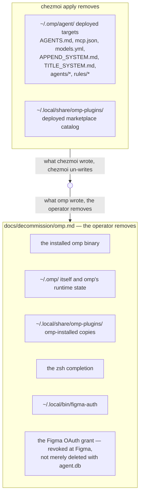
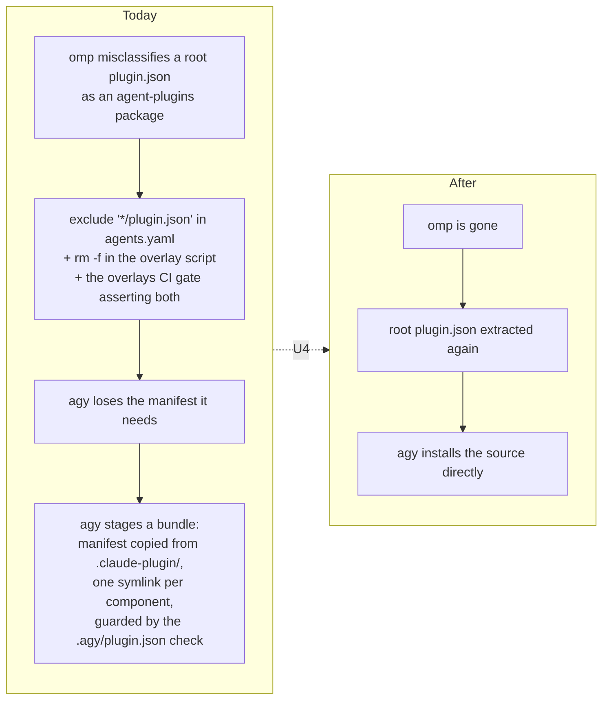

# Remove the omp Harness - Plan

## Goal Capsule

**Objective.** A host provisioned from this repository runs Claude Code and Antigravity as its only agent harnesses: no omp binary is installed, no omp target is written, and the user-scoped instruction core those two harnesses read states rules that are true for them.

**Means.** Delete omp's consumers before the declarations they read, restore the manifest its removal frees, and split the host cleanup between apply and the operator (KTD1, KTD4, and the prune-boundary Key Decision governing R33, R37, R38).

**Product authority.** Issue #345 and this plan. The issue's Settled decisions table is inherited as given.

**Product Contract preservation.** Changed: R40 narrowed to the overlay-script prune site, with R46 added for the marketplace-exclude site; R45 changed — its deferred question resolved against the staged bundle surviving (see KTD4). Added: R47, so a runtime rule that is true for both surviving harnesses is relocated rather than retired with the section around it. Every other R is unchanged in meaning and ID.

**Open blockers.** None.

---

## Product Contract

### Summary

Remove oh-my-pi (`omp`) from the repository completely and rework the shared instruction core so the two surviving harnesses read rules written for them. Apply prunes only what chezmoi deployed; the installed binary and omp's own runtime state go to an operator checklist. `packages/figma-auth` goes with omp because its only credential backend is omp's database.

### Problem Frame

omp is the most deeply wired harness in the repository. It owns a command-manifest binary, four phase-70 scripts, a settings validator, an auth reconciler, a zsh-completion installer, a local plugin marketplace, five CI gates, a package storage backend, and a large share of the instruction core. Removal is a scoped decommission, not a deletion.

The instruction core is the part that cannot be handled by deleting words. `.chezmoitemplates/agents-instructions.tmpl` renders identically to all three harnesses today, and several of its rules are written against omp's tool surface and delegation model. Its tool-preference paragraph points a reader at `xd://github`, `issue://` and `pr://`, which do not exist under either surviving harness. Its delegation section mandates a delegation-first disposition that Claude Code's own operating instructions contradict. Those rules are not stale; they are wrong, and they stay wrong after every omp word is removed.

### Key Decisions

- **One work unit covering both removal and the instruction-core rework.** (session-settled: user-directed — chosen over splitting the broad accuracy pass into a follow-up issue: the instruction core is edited once rather than twice.) Governs R21-R28.
- **`.chezmoiremove` prunes only chezmoi-deployed targets; the operator removes what omp created.** (session-settled: user-directed — chosen over a recursive `.omp` tree prune: a tree prune destroys `~/.omp/agent/agent.db`, which holds Figma OAuth tokens chezmoi never wrote, and violates the repository's no-teardown rule.) Governs R33, R37, R38.
- **The decommission document opens with one copy-paste reclaim block, not a staged checklist.** (session-settled: user-directed — chosen over reusing the `solaar.md` shape: omp has no daemon and no hardware contention, so nothing needs sequencing.) Governs R38.
- **The comment-hygiene policy survives as instruction-core prose; its per-language enforcement does not.** (session-settled: user-directed — chosen over porting both policies or deleting both: prose reaches both harnesses, and neither exposes an equivalent to omp's `condition`/`scope` rule format.) Governs R24.
- **The ADHD output style is dropped rather than ported.** (session-settled: user-directed — chosen over porting it to a Claude Code output style: `agents.skills.external` already installs the `i-have-adhd` skill for every harness, so a ported copy would duplicate it.)
- **Only the three-failure stop rule and the subagent-context rule survive the delegation section.** (session-settled: user-directed — chosen over additionally keeping the agent-CLI subprocess prohibition and the no-repeat rule: each harness's own default delegation behaviour governs the rest.) Governs R22, R23.
- **The tool-preference guidance is deleted outright and the `harness` template parameter with it.** (session-settled: user-directed — chosen over a capability-first rewrite: both surviving harnesses already state the same preference in their own system prompts, and with the paragraph gone the two renders are byte-identical.) Governs R25, R26.
- **Every behaviour that exists only because of omp is removed, not left as harmless residue.** (session-settled: user-directed — chosen over keeping dead-but-harmless branches: residue with an obsolete rationale is indistinguishable from live configuration on later reading.) Governs R40-R46.

### The removal boundary

Misreading this boundary is destructive, so it is stated once as a picture and once as R33, R37 and R38.

### Requirements

**Binary, commands, and release lock**

- R1. `.chezmoiexternals/ai-agents.toml` declares no `omp` external, checksum block, or musl comment naming it.
- R2. `.chezmoidata/commands.yaml` declares neither the `omp` command unit nor the `figma-auth` command unit, including their `legacy` paths.
- R3. `.chezmoidata/releases.json` carries no `releases.tools.omp` entry or per-platform artifacts.
- R4. `packages/release-lock` resolves no `omp` registry entry, and its README names no omp musl variant.
- R5. `.chezmoidata/.capability-registry.tsv` carries no `omp-present` row, and no `capabilities.tmpl` consumer probes it.

**Apply-time scripts and templates**

- R6. The four omp phase-70 scripts are absent: settings config, auth config, plugin update, and zsh-completion install.
- R7. `run_onchange_after_zz-prune-agent-marketplace-archives.sh.tmpl` prunes no omp archive and its ordering rationale no longer cites omp.
- R8. `.chezmoitemplates/omp-settings-validate.tmpl` is absent, and `claude-settings-validate.tmpl` cites no sibling omp partial.
- R9. `.chezmoitemplates/agent-plugin-rows.tmpl` emits no omp branch and its rationale describes the two surviving consumers.
- R10. `.chezmoitemplates/local-archive-ref.tmpl` documents no omp updater registration.
- R11. `.chezmoiscripts/60-build/run_onchange_after_build-figma-auth.sh.tmpl` is absent.

**Managed source trees and data declarations**

- R12. `dot_omp/` is absent in full.
- R13. `dot_local/share/omp-plugins/` is absent in full.
- R14. `dot_agents/skills/cross-model-review/` is absent.
- R15. `.omp/mcp.json` is absent, and `.gitignore` carries no `### omp ###` block.
- R16. `.chezmoidata/agents.yaml` declares no `agents.omp` key, no `agents.marketplaces.h82-dotfiles` entry, and no `session.custom_agents.omp` or `agent_detect_as.omp` under `agents.aoe`.
- R17. `dot_config/agent-of-empires/profiles/main/private_config.toml.tmpl` sets `default_tool = "claude"`.
- R18. `.chezmoidata/haptic.yaml` declares no `haptic.omp` waveform block, and nothing reads one.
- R19. `.chezmoitemplates/agent-mcp-servers-json.tmpl` accepts `claude` and `agy` only, and its doc comment names both as callers.
- R20. The `websearch` MCP row still renders into `~/.mcp.json` and `~/.gemini/config/mcp_config.json` with its `op://` header intact, and no `auth.env` declaration exists anywhere.

**Instruction core**

- R21. `.chezmoitemplates/agents-instructions.tmpl` contains no `## Delegation and processes` section.
- R22. The three-failure stop rule survives as prose in the section that owns blockers, stating the stop, the restoration of the last known good state, and the consultation before escalating to the user.
- R23. One sentence survives stating that a delegated subagent inherits no conversation history, so a dispatch prompt must be self-contained.
- R24. A comment-hygiene rule survives as prose: remove unnecessary comments from files touched this turn, keeping shebangs, linter and compiler directives, required BDD steps, and comments that record non-obvious constraints.
- R25. No tool-preference guidance remains anywhere in the template, including the clause inside the issue-handling section that names omp's `xd://github`, `issue://` and `pr://` schemes.
- R26. The template takes no `harness` parameter, and both consumers include it without one.
- R27. The header names no omp deploy path, no `omp run` or `omp config set` example remains, and the GitLab paragraph carries no oh-my-pi caveat.
- R28. Four surviving passages are re-read against what Claude Code and Antigravity actually do, and corrected where the omp era made them false: the header's deploy-path sentence, the issue-handling paragraph, the GitLab paragraph, and the repository-layout and blocker sections. Anything found false outside those four is recorded as follow-up rather than widened into this change.

**CI and test wiring**

- R29. `.github/workflows/ci.yml` downloads no omp binary, runs no omp or figma-auth test script, defines no `comment-rules`, `comment-rule-coverage`, `omp-zsh-completion` or `tmux-kitty-passthrough` job, and the aggregate `needs:` list matches the surviving job set.
- R30. The omp and figma-auth CI scripts are absent: the four omp checks, the omp zsh-completion test, the tmux passthrough test, and the figma-auth build test.
- R31. `.ci/test-agent-instructions.sh` renders through `dot_claude/readonly_CLAUDE.md.tmpl`. Every needle for a retired mandate moves from the positive set to the banned set rather than being deleted, covering the eleven retired delegation needles and the three tool-preference needles. The needle for the relocated runtime rule stays positive, per R47.
- R32. `.ci/skip-declaration-site-matrix.yaml` and `.ci/test-capability-cache.sh` carry no `omp-absent`, `update-omp-plugins/*`, or `build-figma-auth/*` owner, and every count stated in their prose matches the surviving set.
- R33. `.github/workflows/render-dotfiles.yml` asserts, in both matrix halves, that an apply writes no `~/.omp/` target and no `~/.local/share/omp-plugins/` tree, and renders no omp MCP config.
- R34. Fixtures that used `omp` only as a unit name are renamed to a surviving unit rather than deleted, so `command-reconcile`'s coverage of activation, staging and pruning is unchanged.

**Packages**

- R35. `packages/figma-auth/` is absent, and `packages/README.md` describes neither it nor omp.
- R36. `packages/mxm4-haptic` builds no omp plugin target and carries no omp plugin test or stale `dist/omp-plugin/`.

**Docs and operator handoff**

- R37. `.chezmoiremove` prunes every path chezmoi wrote — the deployed omp targets plus `~/.omp/agent/.env`, which the retired auth reconciler wrote with a resolved `EXA_API_KEY` — and nothing omp itself wrote.
- R38. `docs/decommission/omp.md` opens with one copy-paste reclaim block covering the binary, `~/.omp/`, `~/.local/share/omp-plugins/`, `~/.local/share/agy-plugin-bundles/`, the zsh completion and `~/.local/bin/figma-auth`. It separately instructs the operator to read omp's Figma client id out of `~/.omp/agent/agent.db` before deleting it, revoke only the Figma connected-app registration matching that client id, and leave the grant Antigravity holds in `~/.gemini/antigravity-cli/mcp_oauth_tokens.json` intact.
- R39. `AGENTS.md` and `README.md` describe a two-harness world with no omp or figma-auth section. `README.md` keeps its record of where each surviving harness stores a third-party OAuth credential and how to revoke one; only the omp-owned and figma-auth-owned lines leave it.

**Dead-end cleanup**

- R40. `run_after_compound-engineering-overlays.sh.tmpl` performs no root `plugin.json` prune, since that prune existed only to stop omp misclassifying the archive.
- R41. `dot_local/share/compound-engineering-overlays/skills/ce-sweep/references/interview.md` documents no omp invocation form.
- R42. `dot_config/tmux/tmux.conf` sets neither `allow-passthrough` nor `PI_FORCE_IMAGE_PROTOCOL`, and every surviving setting's comment justifies it without omp.
- R43. `dot_config/wezterm/wezterm.lua.tmpl` justifies its Kitty-graphics setting without omp, or drops it if nothing else needs it.
- R44. `system/linux/selinux/dotfiles_protected_agent_configs.cil` names omp in no comment and no protected path.
- R45. The agy plugin updater installs the marketplace source directly, with no staged bundle and no `.agy/plugin.json` equivalence guard, because the manifest it needs is present once R40 and R46 together restore it. A fail-closed preflight replaces the retired guard: the install aborts with a named error unless the source's root manifest exists and declares the plugin the repository asked for. Governed by KTD4.
- R46. `agents.marketplaces.compound-engineering-plugin.exclude` drops its `*/plugin.json` entry and keeps its `*/skills/ce-sweep/references/interview.md` entry, so the upstream root manifest is extracted again while the locally-overlaid ce-sweep reference stays excluded.
- R47. The rule directing servers, watches, TUIs and REPLs to a tmux or interactive shell survives in the section that owns runtime, because it names no omp mechanism and is true for both surviving harnesses.

### Acceptance Examples

- AE1. **Covers R33, R37.** Given a host whose previous apply deployed `~/.omp/agent/AGENTS.md` and whose omp wrote `~/.omp/agent/agent.db`, when the operator applies the updated dotfiles, then `AGENTS.md` is gone and `agent.db` is untouched.
- AE2. **Covers R31.** Given the rendered Claude Code instruction wrapper, when `.ci/test-agent-instructions.sh` runs, then it fails if any retired delegation or tool-preference sentence reappears, and passes with none of them present.
- AE3. **Covers R34.** Given the command-reconcile test suite with every `omp` fixture renamed, when it runs, then the same activation, staging and prune assertions execute and pass.
- AE4. **Covers R20.** Given an apply on a host with 1Password available, when `~/.mcp.json` and `~/.gemini/config/mcp_config.json` are rendered, then both carry the `websearch` row with its resolved `x-api-key` header.
- AE5. **Covers R32.** Given the skip-declaration matrix with omp's and figma-auth's owners removed, when the capability-cache test runs, then the fatal-cause count it asserts equals the count its own prose states.

### Success Criteria

- `grep -rniE 'oh-my-pi|\bomp\b|\.omp\b|omp\.sh' --exclude-dir=.git --exclude-dir=plans .` returns only intentional historical references.
- `chezmoi execute-template` renders clean on every gated platform with no omp data present.
- Full CI is green with every omp job and binary download gone.
- A fresh-host apply installs no omp binary, writes no `~/.omp/` target, and creates no `~/.local/share/omp-plugins/`.
- aoe sessions open with `claude` as the default tool.
- A reader of the rendered instruction core finds no rule that is false for the harness reading it.

### Scope Boundaries

- No teardown or revert script. Apply never uninstalls the binary or deletes `~/.omp/`.
- No replacement seat-routing table, and no per-harness delegation guidance of any kind.
- No behaviour change for Claude Code or Antigravity beyond what removing shared omp-only plumbing forces, with one named exception: U4 replaces Antigravity's staged-bundle fallback with a fail-closed preflight, so a future upstream release shipping no root manifest stops the apply instead of degrading quietly.
- No new `auth.env` declaration for either surviving harness.
- No port of the ADHD output style, and no replacement for omp's per-language rule enforcement.
- No new Antigravity settings surface: `agents.agy.settings` stays empty.

### Dependencies and Assumptions

- The `i-have-adhd` skill in `agents.skills.external` reaches both surviving harnesses, so dropping `APPEND_SYSTEM.md` loses no reachable behaviour. Verified against `.chezmoidata/agents.yaml`.
- `packages/figma-auth` has no credential backend other than omp's. Verified: `packages/figma-auth/src/storage/` holds `omp.ts` and `types.ts` only.
- The Exa criterion is already satisfied before any change, so R20 is a regression guard rather than new work. Verified: `private_readonly_dot_mcp.json.tmpl:4` and `dot_gemini/config/private_readonly_mcp_config.json.tmpl:3`.
- Removing `allow-passthrough` from tmux ends the coupling documented at `dot_config/tmux/tmux.conf:30-36`, under which naming that option suppressed aoe's own clipboard default. `agents.yaml` pins `tmux.clipboard: enabled` explicitly, so behaviour does not change, but the pin stops being load-bearing for that reason.
- `figma-auth` was refactored to a bare command on 2026-09-01. This removal retires that work two days later; nothing depends on it.

### Sources and Research

- Issue: https://github.com/hyperlapse122/dotfiles/issues/345
- Grounding dossier with `file:line` evidence for every claim above: `/tmp/compound-engineering-1000/ce-brainstorm/omp-removal-345/grounding.md`
- Harness-decommission precedent in this repository: `docs/plans/2026-09-01-1152-chore-remove-opencode-artifacts-plan.md`, `docs/plans/2026-08-05-001-chore-unmanage-claude-codex-harnesses-plan.md`, `docs/plans/2026-07-30-004-chore-unmanage-legacy-agent-harnesses-plan.md`
- Operator-checklist precedent: `docs/decommission/solaar.md`, `docs/decommission/cli-proxy-api.md`
- The instruction core and its three consumers: `.chezmoitemplates/agents-instructions.tmpl`, `dot_claude/readonly_CLAUDE.md.tmpl`, `dot_gemini/readonly_AGENTS.md.tmpl`, `dot_omp/private_agent/private_readonly_AGENTS.md.tmpl`
- The needle sets that must be retired rather than deleted: `.ci/test-agent-instructions.sh`

---

## Planning Contract

### Key Technical Decisions

- KTD1. **Delete the consumers first, then the declarations they read.** The repository fails closed on unknown data: `agent-mcp-servers-json.tmpl` aborts the render on an unrecognised harness, and `capabilities.tmpl` treats an unknown probe the same way. So retiring `agents.omp` or the `omp-present` capability while `dot_omp/` and the zsh-completion script still call for them breaks every render in between. Deleting a consumer first is always safe — a declaration nobody reads renders nothing. Governs R1-R5, R16.
- KTD2. **`.ci/test-agent-instructions.sh` retires needles by moving them, never by deleting them.** A deleted positive needle leaves no guard; a needle moved into the `BANNED` heredoc turns each retired mandate into an assertion that it has not returned. The file already carries that pattern for four earlier retirements. Governs R31.
- KTD3. **Fixtures that used `omp` only as a unit id are renamed to `agent-browser`.** It is the one surviving `producer: external` unit with `platforms: [linux, macos]`, so the manifest membership assertions keep their meaning without rewriting the assertion shape. Governs R34.
- KTD4. **Restoring the upstream root `plugin.json` is what retires the agy staged bundle, and all three prune sites must go together.** The bundle exists because `agents.marketplaces.compound-engineering-plugin.exclude` strips `*/plugin.json` and the overlay script deletes it again — both to stop omp misclassifying the archive — while `.ci/test-compound-engineering-overlays.sh` gates both of those, asserting the manifest was pruned and matching the rendered exclude list exactly. The claim that this is inert for Claude Code is about Claude Code's plugin loader, not about this repository's updater script: the script never reads a root manifest, which is precisely why it cannot witness the claim, so U4 proves the loader by comparing the exposed skill count across the change. Governs R40, R45, R46.
- KTD5. **`zz-prune-agent-marketplace-archives` keeps its last-in-phase position.** Its ordering rationale generalises: the surviving `update-claude-plugins` and `update-agy-plugins` reconcilers must succeed before older extracted versions are pruned. Only the comment naming omp changes. Governs R7.
- KTD6. **CI loses four whole jobs, not four steps.** `comment-rules`, `comment-rule-coverage`, `tmux-kitty-passthrough` and `omp-zsh-completion` exist only to gate omp surfaces; `agent-reconciliation` survives with its omp binary install, three render targets and three script calls removed. The aggregate `delivery` job's `needs:` list must lose exactly those four names. Governs R29.
- KTD7. **The skip-declaration accounting is prose plus data and must move together.** Removing the `omp-absent`, `update-omp-plugins/*` and `build-figma-auth/*` owners changes counts that `.ci/skip-declaration-site-matrix.yaml` and `.ci/test-capability-cache.sh` state in comments as well as assert in code. Governs R32.

### Assumptions

- The `omp` unit's absence from `.chezmoidata/commands.yaml` is sufficient to stop `command-reconcile` managing `~/.local/bin/omp`; the already-symlinked binary on a provisioned host is operator-owned and is covered by R38 rather than by apply.
- No host currently depends on wezterm's Kitty-graphics setting for anything but omp. Kitty remains the authoritative managed terminal, and the wezterm config is inert unless explicitly launched.
- Antigravity accepts a marketplace source whose root `plugin.json` is present; that is the shape upstream ships and the shape `.agy/plugin.json` points at. Unverified against the running CLI — U4 proves it before the staged-bundle path is deleted.
- Whether Claude Code's plugin loader ignores a root `plugin.json` beside `.claude-plugin/marketplace.json` is unverified. The repository's own updater script never reads the root manifest, but the script is not the loader, so U4 proves the loader against a skill count rather than inferring it.

### High-Level Technical Design

The omp-motivated plugin.json prune is the one coupling in this removal that reaches a surviving harness. It is worth seeing whole before U4 is executed.

The repository's Claude Code updater sits outside both halves — it preflights `.claude-plugin/marketplace.json` and reads no root manifest. That settles the script, not the `claude` binary that resolves plugins, so U4 measures the loader rather than assuming it.

### Open Questions

Neither blocks implementation; both are settled inside the unit that owns them.

- **Does Antigravity tolerate the whole extracted marketplace tree?** Today the staged bundle symlinks a closed set of components; installing the source directly hands agy the entire extracted archive, including per-harness dot-directories. U4 answers this against the running CLI before deleting the staging, and narrows the install if the answer is no.
- **Where does the tmux config parse check live?** U6 edits `dot_config/tmux/tmux.conf` by hand, and U7 and U8 delete the only job that installs tmux and runs a config through it. U6 either keeps a stripped parse-only gate or records the check as local-only; it does not ship the edit unverified.

### Sequencing

U2 deletes the omp consumers and must land before U1 retires the declarations they read (KTD1); U3 is independent of both. U4 owns all three prune sites itself and depends on nothing. U5 follows U2, which removes the third instruction-core consumer. U6 is independent. U7 follows U5, and U8 follows U1, U2, U3 and U7 — not U4, whose surfaces it does not touch. U9 is last because the prune set must match the final deleted target list.

---

## Implementation Units

### U1. Retire the omp data declarations, command manifest, and release lock

- **Goal:** No `.chezmoidata/` file declares omp, so every consumer template renders against an omp-free data set.
- **Requirements:** R1, R2 (omp entry only), R3, R4, R5, R16, R17, R18, R19, R20 (regression guard).
- **Dependencies:** U2 — the consumers that read this data must be gone first, per KTD1.
- **Files:** `.chezmoidata/agents.yaml`, `.chezmoidata/commands.yaml`, `.chezmoidata/releases.json`, `.chezmoidata/.capability-registry.tsv`, `.chezmoidata/haptic.yaml`, `.chezmoiexternals/ai-agents.toml`, `.chezmoitemplates/agent-mcp-servers-json.tmpl`, `.chezmoitemplates/capabilities.tmpl`, `dot_config/agent-of-empires/profiles/main/private_config.toml.tmpl`, `packages/release-lock/src/registry.ts`, `packages/release-lock/test/registry.test.ts`, `packages/release-lock/README.md`.
- **Approach:**
  1. Delete `agents.omp` in full, `agents.marketplaces.h82-dotfiles`, and the `omp` keys under `agents.aoe.config.toml` (`session.custom_agents`, `agent_detect_as`).
  2. Remove the `omp` command unit and the `omp` external, capability row, release entry, registry entry and haptic block.
  3. Narrow `$validHarness` in `agent-mcp-servers-json.tmpl` to `claude` and `agy`, and correct its doc comment, which already misstates omp as the sole caller.
  4. Set `default_tool = "claude"`.
- **Patterns to follow:** the data-driven deletion sequence in `docs/plans/2026-07-30-004-chore-unmanage-legacy-agent-harnesses-plan.md`, and `agent-mcp-servers-json.tmpl`'s fail-closed unknown-harness branch.
- **Test scenarios:**
  - Covers AE4. Rendering `private_readonly_dot_mcp.json.tmpl` and `dot_gemini/config/private_readonly_mcp_config.json.tmpl` still yields the `websearch` row with its resolved `x-api-key` header.
  - `agent-mcp-servers-json.tmpl` invoked with `harness "omp"` fails rendering with the unknown-harness message rather than returning an empty list.
  - `packages/release-lock` resolves its full tool set with the omp registry entry gone, and no test references an omp asset.
  - `chezmoi execute-template` over `.chezmoiexternals/ai-agents.toml` emits no omp external and still emits both localArchive marketplaces.
- **Verification:** every `.chezmoidata/` file parses, the release-lock package tests pass, and no template fails to render for want of `agents.omp`.

### U2. Delete the omp apply-time scripts, validators, and managed trees

- **Goal:** An apply runs no omp script and writes no omp target.
- **Requirements:** R6, R7, R8, R9, R10, R12, R13, R14, R15.
- **Dependencies:** none — this unit only deletes files and rewrites comments, and a declaration nobody reads renders nothing.
- **Files:** `.chezmoiscripts/70-agents/run_after_config-omp-settings.sh.tmpl`, `.chezmoiscripts/70-agents/run_after_config-omp-auth.sh.tmpl`, `.chezmoiscripts/70-agents/run_onchange_after_update-omp-plugins.sh.tmpl`, `.chezmoiscripts/70-agents/run_onchange_after_install-omp-zsh-completion.sh.tmpl`, `.chezmoiscripts/70-agents/run_onchange_after_zz-prune-agent-marketplace-archives.sh.tmpl`, `.chezmoitemplates/omp-settings-validate.tmpl`, `.chezmoitemplates/agent-plugin-rows.tmpl`, `.chezmoitemplates/claude-settings-validate.tmpl`, `.chezmoitemplates/local-archive-ref.tmpl`, `dot_omp/`, `dot_local/share/omp-plugins/`, `dot_agents/skills/cross-model-review/`, `.omp/mcp.json`, `.gitignore`.
- **Approach:**
  1. Delete the four omp phase-70 scripts, `omp-settings-validate.tmpl`, `dot_omp/`, `dot_local/share/omp-plugins/`, `dot_agents/skills/cross-model-review/` and `.omp/mcp.json`, and drop the `### omp ###` block from `.gitignore`.
  2. In `zz-prune-agent-marketplace-archives`, keep the `zz-` ordering and rewrite the two comments that name omp to name the surviving reconcilers, per KTD5.
  3. In `agent-plugin-rows.tmpl`, drop the omp branch and rewrite the WHY-THIS-EXISTS comment for two consumers; in `claude-settings-validate.tmpl` and `local-archive-ref.tmpl`, drop the sibling-omp references.
- **Patterns to follow:** the source-only, non-pruning deletion discipline stated in the repository `AGENTS.md`; `docs/plans/2026-09-01-1152-chore-remove-opencode-artifacts-plan.md`.
- **Test scenarios:**
  - `chezmoi execute-template` renders every surviving phase-70 script with no omp data present.
  - The rendered `zz-prune` script still emits both localArchive prune rows and still skips defensively when the current segment is absent.
  - `agent-plugin-rows.tmpl` invoked for `claude` and for `agy` returns the declared rows unchanged from before this unit.
- **Verification:** a dry apply against a scratch destination creates no `~/.omp/` path and no `~/.local/share/omp-plugins/` path.

### U3. Remove the figma-auth package and its build and command wiring

- **Goal:** The repository builds and installs no `figma-auth`, and no CI job compiles it.
- **Requirements:** R2 (figma-auth entry), R11, R35.
- **Dependencies:** none.
- **Files:** `packages/figma-auth/`, `packages/README.md`, `packages/bun.lock`, `.chezmoiscripts/60-build/run_onchange_after_build-figma-auth.sh.tmpl`, `.ci/test-build-figma-auth.sh`, `.chezmoidata/commands.yaml`.
- **Approach:**
  1. Delete the package directory, its build script, and its CI test.
  2. Remove the `figma-auth` command unit from `commands.yaml`, including its `fingerprintGlobs` and `legacy` path.
  3. Drop the figma-auth row and the `figma-auth` compile paragraph from `packages/README.md`, and refresh the workspace lockfile.
- **Patterns to follow:** the package-removal shape in `docs/plans/2026-09-01-1152-chore-remove-opencode-artifacts-plan.md`.
- **Test scenarios:**
  - The TypeScript workspace typechecks, lints and tests with the package gone and no dangling workspace reference.
  - The rendered command manifest contains no `figma-auth` unit and every remaining unit still declares at least one command.
- **Verification:** the workspace build succeeds and no `.chezmoiscripts/60-build/` script references figma-auth.

### U4. Restore the upstream root plugin.json and simplify the agy plugin install

- **Goal:** Antigravity installs the compound-engineering marketplace source directly, with no staged bundle.
- **Requirements:** R40, R45, R46.
- **Dependencies:** none — this unit owns all three prune sites itself. The overlay script survives U2; this unit edits it rather than deleting it.
- **Files:** `.chezmoidata/agents.yaml`, `.chezmoiscripts/00-tools/run_after_compound-engineering-overlays.sh.tmpl`, `.chezmoiscripts/70-agents/run_onchange_after_update-agy-plugins.sh.tmpl`, `.ci/test-claude-agy-plugin-reconcile.sh`, `.ci/test-compound-engineering-overlays.sh`.
- **Approach:**
  1. Drop `*/plugin.json` from `agents.marketplaces.compound-engineering-plugin.exclude` per R46, keeping the ce-sweep interview entry, then delete the `rm -f -- "$CURRENT/plugin.json"` prune and the paragraph explaining it. Both sites move together; the overlay script keeps its two ce-sweep overlay files.
  2. Invert the overlays CI gate's two prune assertions: the first-run check now expects the manifest to survive, and the rendered-external check expects the one-entry exclude list. Update the file-header comment that documents the two-entry form.
  3. Remove the staged-bundle machinery from the agy updater: the `BUNDLE_ROOT`, the `COMPONENTS` symlink loop, the manifest copy-back, and the `.agy/plugin.json` equivalence pre-check. Install from the marketplace source path, and replace the removed branch with a fail-closed preflight that aborts unless the root manifest exists and declares the plugin the repository asked for — the same shape and named-`die` style the Claude reconciler already uses.
  4. Give the updater an explicit re-resolve so a host already serving the staged bundle converges to the source install; the deferred question of whether `agy plugin install` replaces a same-named install is settled here against the running CLI, not assumed.
  5. Rewrite the WHY-A-STAGED-BUNDLE comment into a short statement of what the updater now does.
  6. Update the reconcile test's fixture, which currently constructs a source with the root manifest deliberately absent and asserts the staged shape.
- **Execution note:** this unit changes a surviving harness's install path. Prove it with the reconcile test's convergence case — a second run must not re-mutate — before trusting the shape.
- **Technical design:** the before/after chain in the Planning Contract's High-Level Technical Design is the authority for why the bundle can go.
- **Patterns to follow:** the existing fail-closed preflight in `run_onchange_after_update-claude-plugins.sh.tmpl`, which dies when the manifest it needs is absent rather than installing a source nobody vouched for.
- **Test scenarios:**
  - A marketplace source carrying a root `plugin.json` installs into the agy plugin directory in one pass.
  - A second run over the same source converges and mutates nothing.
  - A marketplace source with no root `plugin.json` fails closed with a named error rather than installing a partial bundle.
  - A marketplace source whose root `plugin.json` declares a different plugin name fails closed with a named error rather than installing a bundle nobody vouched for.
  - A host whose plugin was installed from the staged-bundle path converges to the source install on the next run, leaving no bundle path in service.
  - The Claude Code reconciler's behaviour over the same fixture is unchanged from before this unit.
  - The skill count Claude Code exposes from the pinned marketplace is the same before and after the manifest is restored — the loader-level check the updater script cannot perform.
  - The overlays CI gate passes against the restored shape and fails if the manifest is pruned again.
- **Verification:** `.ci/test-claude-agy-plugin-reconcile.sh` and `.ci/test-compound-engineering-overlays.sh` both pass against the restored shape, no `agy-plugin-bundles` path is left in service, and Claude Code's exposed skill count is unchanged.

### U5. Rework the shared instruction core for two harnesses

- **Goal:** The rendered instruction core states nothing that is false for the harness reading it.
- **Requirements:** R21, R22, R23, R24, R25, R26, R27, R28, R47.
- **Dependencies:** U2 — the third instruction-core consumer is gone.
- **Files:** `.chezmoitemplates/agents-instructions.tmpl`, `dot_claude/readonly_CLAUDE.md.tmpl`, `dot_gemini/readonly_AGENTS.md.tmpl`.
- **Approach:**
  1. Delete `## Delegation and processes` in full.
  2. Restate the three-failure stop rule as prose in the section that owns blockers, and the subagent-context rule as one sentence.
  3. Add the comment-hygiene rule as prose, carrying the policy and its exceptions from the retired omp rule bodies without their `condition`/`scope` frontmatter.
  3b. Move the rule directing servers, watches, TUIs and REPLs to a tmux or interactive shell into the section that owns runtime, per R47. It sits in the retired section today but names no omp mechanism and is true for both surviving harnesses, so it is relocated rather than retired with the section around it.
  4. Delete the tool-preference sentence inside the issue-handling section along with the retired section, per R25.
  5. Rewrite the header's deploy-path sentence, drop the `omp run` / `omp config set` examples and the oh-my-pi caveat in the GitLab paragraph.
  6. Remove the `harness` parameter from the template and from both `includeTemplate` call sites.
  7. Re-read the four passages R28 names against what Claude Code and Antigravity actually do, and correct what the omp era made false. Anything false found outside those four is recorded as follow-up rather than widened into this change.
- **Patterns to follow:** `docs/plans/2026-07-20-004-refactor-compact-agent-instructions-plan.md` and `docs/plans/2026-07-24-001-refactor-per-harness-instruction-composition-plan.md`.
- **Test scenarios:**
  - The template renders identically for both call sites, since neither passes a harness argument any more.
  - The rendered document contains none of the retired delegation or tool-preference sentences.
  - The rendered document still contains the three-failure stop rule, the subagent-context sentence, the comment-hygiene rule and the relocated runtime rule.
- **Verification:** both wrappers render, and a read of the rendered output finds no rule that names a tool or mechanism neither harness has.

### U6. Clear the omp-only residue from surviving config and comments

- **Goal:** No surviving file carries a setting or a rationale that exists only for omp.
- **Requirements:** R41, R42, R43, R44.
- **Dependencies:** none.
- **Files:** `dot_local/share/compound-engineering-overlays/skills/ce-sweep/references/interview.md`, `dot_config/tmux/tmux.conf`, `dot_config/wezterm/wezterm.lua.tmpl`, `system/linux/selinux/dotfiles_protected_agent_configs.cil`.
- **Approach:**
  1. Drop the oh-my-pi sentence from the ce-sweep interview overlay's invocation-rendering rule.
  2. Remove `allow-passthrough` and `PI_FORCE_IMAGE_PROTOCOL` from `tmux.conf` with their comment block, keep `extended-keys`, `extended-keys-format` and the hyperlink feature, and rewrite the surviving comments and the file header so none justifies a setting by omp. The aoe coupling note goes with the removed pair.
  3. Remove `config.enable_kitty_graphics` and the inline-images comment block from the wezterm config.
  4. Drop omp from the SELinux JIT-runtime comment and from any protected path.
- **Test scenarios:**
  - `tmux -f dot_config/tmux/tmux.conf` parses without error on a tmux older than 3.5 and on 3.5 or newer.
  - The SELinux module still compiles and its protected set is unchanged apart from any omp path.
  - Test expectation for the wezterm and ce-sweep edits: none — both are inert configuration and prose with no behavioural surface in CI.
- **Verification:** the surviving tmux settings each carry a rationale that stands without omp, and no file in this unit matches the omp search.

### U7. Retire the instruction-core needles and delete the omp CI scripts

- **Goal:** The instruction-core gate proves the retired mandates cannot return, and no omp CI script remains.
- **Requirements:** R30, R31.
- **Dependencies:** U5.
- **Files:** `.ci/test-agent-instructions.sh`, `.ci/check-omp-agent-roster.sh`, `.ci/check-omp-seat-routing.sh`, `.ci/test-omp-agent-reconcile.sh`, `.ci/test-omp-comment-rules.sh`, `.ci/test-omp-zsh-completion.sh`, `.ci/test-tmux-kitty-passthrough.sh`.
- **Approach:**
  1. Repoint the instruction-core wrapper from `dot_omp/private_agent/private_readonly_AGENTS.md.tmpl` to `dot_claude/readonly_CLAUDE.md.tmpl`.
  2. Move the eleven retired delegation needles and the three tool-preference needles out of the `NEEDLES` heredoc and into the `BANNED` heredoc, per KTD2. The needle for the relocated runtime rule is not among them — it stays positive, per R47.
  3. Ensure a positive needle covers each of the four rules R22-R24 and R47 preserve, so a later edit cannot quietly drop them. Two of those needles already exist; reconcile their text with the restated prose rather than adding duplicates.
  4. Delete the six omp and tmux CI scripts.
- **Patterns to follow:** the existing `BANNED` heredoc in the same file, which already retires four earlier mandates.
- **Test scenarios:**
  - Covers AE2. The gate fails when any retired delegation or tool-preference sentence is reintroduced into the template.
  - The gate fails when the three-failure stop rule, the subagent-context sentence, the comment-hygiene rule or the relocated runtime rule is removed.
  - The gate passes against the reworked template.
- **Verification:** `.ci/test-agent-instructions.sh` passes against the Claude Code wrapper and fails against a template with a retired sentence restored.

### U8. Rewire the CI job graph, the skip-declaration accounting, and the command fixtures

- **Goal:** CI is green with every omp and figma-auth gate gone and every stated count consistent.
- **Requirements:** R29, R32, R33, R34.
- **Dependencies:** U1, U2, U3, U7 — not U4, whose files this unit does not touch.
- **Files:** `.github/workflows/ci.yml`, `.github/workflows/render-dotfiles.yml`, `.ci/skip-declaration-site-matrix.yaml`, `.ci/test-capability-cache.sh`, `.ci/test-ci-wiring.sh`, `.ci/test-command-manifest.sh`, `.ci/test-command-reconcile-process.sh`, `.ci/test-command-reconcile-apply.sh`, `packages/command-reconcile/test/manifest.test.ts`, `packages/command-reconcile/test/state.test.ts`, `packages/command-reconcile/test/cli.test.ts`, `packages/command-reconcile/test/prune.test.ts`.
- **Approach:**
  1. Delete the `comment-rules`, `comment-rule-coverage`, `tmux-kitty-passthrough` and `omp-zsh-completion` jobs and remove those four names from the `delivery` job's `needs:` list, per KTD6.
  2. In `agent-reconciliation`, drop the omp binary install, the three omp render targets, and the three omp script calls; keep the claude and agy calls and the instruction-core gate.
  3. Drop the figma-auth render target and the figma-auth build-test call from the `fatal-boundary-gates` job.
  4. Remove the `omp-absent`, `update-omp-plugins/*` and `build-figma-auth/*` owners from the skip matrix and the capability-cache test, and correct every count those two files state in prose as well as assert, per KTD7.
  5. In `render-dotfiles.yml`, replace the omp prune fixtures with assertions that an apply writes no `~/.omp/` target and no `~/.local/share/omp-plugins/` tree, in both matrix halves, and drop the omp MCP render check. Keep one negative control per half: seed a file standing in for what omp itself wrote under `~/.omp/agent/` before the apply and assert it survives, so the prune set is proven to remove deployed targets without reaching operator-owned state.
  6. Rename every `omp` command fixture to `agent-browser`, per KTD3.
- **Test scenarios:**
  - Covers AE3. The command-reconcile suite runs the same activation, staging, prune and convergence assertions under the renamed fixture.
  - Covers AE5. The capability-cache test's asserted fatal-cause count equals the count its own comments state.
  - `.ci/test-ci-wiring.sh` reports a consistent job graph with no dangling `needs:` entry.
  - Covers AE1. An apply over a seeded fixture home removes the deployed omp target and leaves the file standing in for what omp itself wrote, and the assertion fails if an apply writes any `~/.omp/` target.
  - The command-manifest test still proves a unit present on both linux and macos, and still rejects a duplicate public command.
- **Verification:** the full workflow is green and the `delivery` job aggregates exactly the surviving jobs.

### U9. Add the prune set, the operator decommission doc, and the repo docs

- **Goal:** An operator applying this change knows exactly what apply removed and what they must remove themselves.
- **Requirements:** R36, R37, R38, R39.
- **Dependencies:** U1, U2, U3, U4 — the reclaim block lists the bundle tree U4 retires.
- **Files:** `.chezmoiremove`, `.chezmoiignore`, `docs/decommission/omp.md`, `AGENTS.md`, `README.md`, `packages/mxm4-haptic/vite.config.ts`, `packages/mxm4-haptic/package.json`, `packages/mxm4-haptic/test/omp-plugin.test.ts`, `packages/mxm4-haptic/src/omp-plugin.ts`.
- **Approach:**
  1. Replace the existing per-path omp entries in `.chezmoiremove` with the prune set for every path chezmoi wrote and this change stops deploying — the deployed targets plus `~/.omp/agent/.env`, which the retired auth reconciler wrote with a resolved `EXA_API_KEY` — and nothing omp itself wrote. Follow the file's convention of a prose rationale above each entry.
  2. Drop the omp paths from `.chezmoiignore`'s jetson and container skip lists.
  3. Remove the `omp-plugin` build target, its source, and its test from `packages/mxm4-haptic`, along with any stale `dist/omp-plugin/`.
  4. Write `docs/decommission/omp.md` opening with one copy-paste reclaim block covering the binary, `~/.omp/`, `~/.local/share/omp-plugins/`, `~/.local/share/agy-plugin-bundles/`, the zsh completion and `~/.local/bin/figma-auth`. Note that the bundle tree existed only because the omp-motivated manifest prune forced Antigravity to stage its own. Then add a separate, ordered revocation item: read omp's Figma client id out of `agent.db` first, revoke only the connected-app registration matching it, and leave Antigravity's own grant alone — every retired flow registered under one client name, so an unscoped revocation kills a surviving harness's Figma auth.
  5. Update the harness roster, the phase-70 description, the per-key assertion section, the plugin and marketplace section, the tool-approval and provider-gate sections, the data-file table, the container-skip line and the project-skill paragraph in `AGENTS.md`. In `README.md`, update the harness list and remove only the omp-owned and figma-auth-owned lines from the Figma credential block: the surviving harness's token-store entry and the revocation procedure stay, and the instruction to preserve omp's credential row becomes a pointer to the decommission document.
- **Patterns to follow:** `docs/decommission/cli-proxy-api.md` for the label block and the not-automated framing; the existing rationale-above-entry style in `.chezmoiremove`.
- **Test scenarios:**
  - `.chezmoiremove` renders without a template error on a container fact and on a non-container fact.
  - The mxm4-haptic package builds and tests with only its surviving targets.
- **Verification:** the decommission document names every path apply does not remove, and the repository documentation describes a two-harness world.

---

## Verification Contract

- **Render gate:** `chezmoi execute-template` over every changed template and script renders clean on each gated platform with no omp data present. This is the primary proof for U1, U2 and U5.
- **Agent reconciliation:** `.ci/test-claude-agy-plugin-reconcile.sh`, `.ci/test-claude-settings-reconcile.sh` and `.ci/test-agent-instructions.sh` pass against the rendered survivors.
- **Skip-declaration accounting:** `.ci/test-capability-cache.sh` and the skip matrix agree with each other and with the surviving owner set.
- **CI wiring:** `.ci/test-ci-wiring.sh` reports no dangling `needs:` entry and no orphaned job.
- **Command manifest and reconcile:** `.ci/test-command-manifest.sh`, `.ci/test-command-reconcile-apply.sh`, `.ci/test-command-reconcile-process.sh` and the `packages/command-reconcile` suite pass under the renamed fixtures.
- **Workspace:** the TypeScript workspace lints, typechecks and tests with `figma-auth` gone and mxm4-haptic's omp target removed.
- **Apply shape:** `.github/workflows/render-dotfiles.yml` proves, in both matrix halves, that an apply installs no omp binary, writes no `~/.omp/` target and creates no `~/.local/share/omp-plugins/`.
- **Residue sweep:** `grep -rniE 'oh-my-pi|\bomp\b|\.omp\b|omp\.sh' --exclude-dir=.git --exclude-dir=plans .` returns only intentional historical references.

## Definition of Done

- Every requirement R1-R47 holds, and every acceptance example AE1-AE5 is proven by a named test.
- The full CI workflow is green, and the `delivery` job aggregates exactly the surviving jobs.
- The residue sweep in the Verification Contract returns only intentional historical references.
- `docs/decommission/omp.md` exists and covers the binary, `~/.omp/`, `~/.local/share/omp-plugins/`, the zsh completion, `~/.local/bin/figma-auth`, and the Figma OAuth grant revocation.
- No teardown or revert script was added anywhere, and no `.chezmoiremove` entry removes a path omp itself wrote.
- Abandoned-attempt code is removed: no commented-out omp branch, no orphaned fixture, no stale `dist/` artifact left in the diff.
