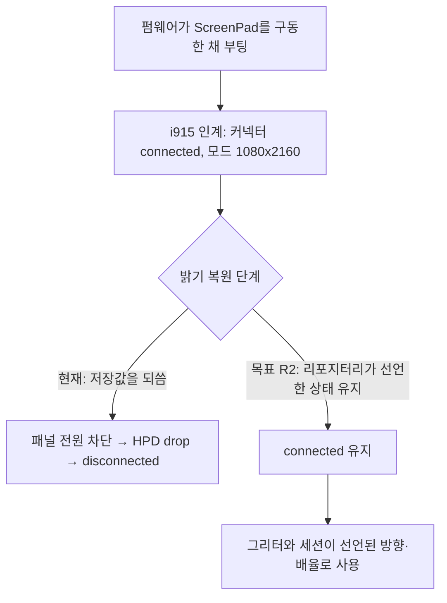
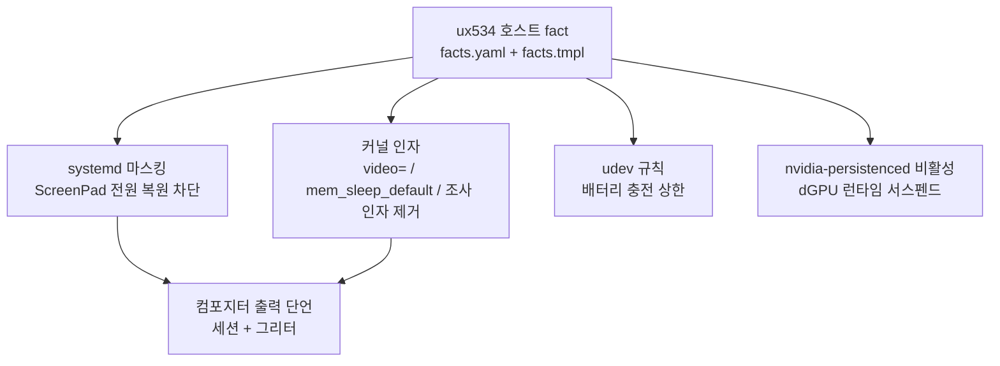

# UX534 Host Enablement - Plan

## Goal Capsule

- **Objective:** ASUS ZenBook UX534FTC에서 ScreenPad가 부팅만으로 쓸 수 있는 보조 화면이 되고, 이 노트북을 쓸 만하게 만드는 하드웨어 설정 전체가 재설치 후에도 같은 상태로 재현된다.
- **Means:** UX534 를 식별하는 호스트 fact 를 신설하고 그 게이트 아래에서 systemd 마스킹, 커널 인자, udev 규칙, 컴포지터 출력 설정을 데이터로 선언한다 (KTD1).
- **Product authority:** 이 문서의 Product Contract. 요구사항 R1–R12 와 Key Decisions 가 무엇을 만들지에 대한 권위이고, Planning Contract 는 어떻게 만들지만 다룬다.
- **Execution profile:** 이 리포지터리는 실행 코드가 아니라 호스트 구성을 선언한다. 검증은 단위 테스트가 아니라 렌더 게이트(`.ci/*.sh`)와 실제 호스트에서의 `chezmoi apply` 멱등성이다.
- **Stop conditions:** 주 패널(`eDP-1`)이 꺼지거나 부팅이 불가능해지는 변경, 그리고 UX534 게이트 없이 다른 호스트에 적용되는 변경은 즉시 중단 대상이다.
- **Tail ownership:** 이 계획은 리포지터리 변경까지 소유한다. 실제 호스트에서의 재부팅 검증은 적용 후 확인 항목이며 Definition of Done 이 명시한다.
- **Open blockers:** 없음. 남은 불확실성은 `panel_orientation`이 외부로 분류된 커넥터에 적용되는지 여부이며, Dependencies / Assumptions 에 가정과 실패 시 영향으로 기록되어 있다.

---

## Product Contract

### Summary

UX534를 이 리포지터리가 선언형으로 소유하는 호스트로 만든다. ScreenPad가 사용자 조작 없이 부팅만으로 보조 화면이 되게 하고, 회전·배율·위치와 전원 상태를 데이터로 선언한다. 같은 호스트 fact 위에 dGPU 전원 posture, 배터리 충전 상한, Fn키 매핑을 함께 게이팅한다.

### Problem Frame

이 호스트의 ScreenPad는 부팅 직후 약 3초간 정상 동작한 뒤 죽는다. 펌웨어가 패널을 구동한 채 부팅하고, i915가 인계받아 `HDMI-A-1`로 열거하며 네이티브 모드 `1080x2160`까지 잡는다. 그 직후 `systemd-backlight`가 이전 종료 때 저장해 둔 밝기를 되쓰는 순간 패널 전원이 내려가고, HPD가 끊기며 커넥터가 `disconnected`가 된다. 설치 직후 첫 부팅에서만 화면이 보였던 이유는 그때 아직 저장 파일이 없어 복원할 값이 없었기 때문이다.

증상 자체는 ScreenPad 하나지만, 원인 구조는 이 리포지터리의 일반적 문제다. 하드웨어 상태를 OS 구성요소가 자기 방식으로 기억하고 되쓰는 동안 리포지터리는 그 표면을 소유하지 않는다. `STRATEGY.md`가 "unowned live surface"로 지목한 부류이고, 손으로 고치면 재설치 때마다 같은 작업이 반복된다. 이 호스트는 방금 도입되었으므로 fact 레지스트리의 하드웨어 전제도 아직 이전 머신을 가리킨다.

### Key Decisions

- **UX534 호스트 활성화를 한 계획이 소유한다** — ScreenPad만 떼어내거나 선언형 골격만 먼저 세우지 않는다. (session-settled: user-directed — chosen over a ScreenPad-only scope: 각 영역이 같은 호스트 fact와 게이팅 경로를 공유하므로 따로 계획하면 같은 뼈대를 두 번 만든다.) Governs R1, R6, R8, R11
- **ScreenPad의 목표는 평범한 보조 화면까지다** — 전용 런처나 미디어 컨트롤 같은 ScreenPad 전용 UI는 만들지 않는다. (session-settled: user-directed — chosen over a bespoke ScreenPad surface: 먼저 보조 모니터로 쓰고 가치는 나중에 쌓기로 했다.) Governs R1, R4
- **dGPU는 PRIME 오프로드로 평소 잠재운다** — 상시 활성도, 완전 배제도 아니다. (session-settled: user-directed — chosen over an always-on dGPU and a fully disabled one: 개발이 주 용도이고 GPU 작업은 가끔이라 배터리를 기본값으로 둔다.) Governs R8
- **ScreenPad 전원 상태의 소유권을 systemd에서 회수한다** — 저장값을 맞추는 대신 복원 자체를 막고 원하는 상태를 리포지터리가 선언한다. (session-settled: user-approved — chosen over tuning the saved brightness value: 저장값은 종료할 때마다 다시 덮여 재현성이 없다.) Governs R2
- **회전은 커널 인자로, 배율과 위치는 컴포지터별로 선언한다** — KMS에 스케일 개념이 없어 한 곳에 모을 수 없다. (session-settled: user-approved — chosen over putting the whole transform on the kernel cmdline: `video=`는 모드와 방향까지만 표현하고 배율·위치는 컴포지터 상태다.) Governs R3, R4
- **ScreenPad 배율 2를 목표값으로 확정한다** — 실사용 기준 미세 조정은 이 계획이 다루지 않는다. (session-settled: user-directed — chosen over verifying legibility before committing a value: 먼저 동작하는 상태를 확보하고 조정은 별도 계획으로 돌린다.) Governs R4
- **서스펜드는 `deep`으로 전환하고 오디오 깨짐은 발생 시에만 대응한다** — 우회책을 선제적으로 넣지 않는다. (session-settled: user-directed — chosen over staying on `s2idle` and over bundling the audio workaround up front: 대기 전력이 우선이고, 이 호스트에서 버그가 실제로 재현될지 확인되지 않았다.) Governs R10

### Requirements

**ScreenPad를 보조 화면으로**

- R1. 부팅만으로 ScreenPad가 컴포지터 출력 목록에 연결·활성 상태로 존재한다. 사용자 조작이 필요 없다.
- R2. ScreenPad의 전원 상태는 이 리포지터리가 선언한 값이 결정하며, 부팅 시 밝기 복원이 그 값을 덮지 않는다.
- R3. ScreenPad의 표시 모드와 회전이 커널 인자로 선언되어, 부팅 스플래시와 로그인 그리터에서도 사용자 세션과 같은 방향으로 표시된다.
- R4. ScreenPad의 배율과 주 화면 대비 위치가 사용자 세션과 로그인 그리터 양쪽에 선언된다. 목표값은 배율 2, 회전 right, 주 화면 아래 중앙.
- R5. 서스펜드 후 재개했을 때 ScreenPad가 R1의 상태로 돌아온다.

**호스트 식별과 게이팅**

- R6. UX534를 식별하는 호스트 fact가 fact 레지스트리에 선언되고, 이 작업이 추가하는 모든 root 소유 파일과 커널 인자가 그 fact로 게이팅된다.
- R7. `.chezmoidata/facts.yaml`이 담고 있는 이전 머신 기준의 하드웨어 전제가 현재 호스트에 맞게 정정된다.

**전원과 입력**

- R8. dGPU는 유휴 시 런타임 서스펜드 상태를 유지하고 명시적 오프로드 요청에만 깨어난다.
- R9. 배터리 충전 상한이 선언된 값으로 적용된다.
- R10. 서스펜드 방식이 `deep`으로 선언되어 대기 전력 소모를 줄인다.
- R11. Fn키와 키보드 백라이트가 각인된 대로 동작하고, 그 매핑이 기존 keyd 소유 경로 안에서 선언된다.

**조사 잔여물 정리**

- R12. 조사용으로 임시 추가한 커널 인자 `drm.debug`와 `log_buf_len`이 제거된다.

### Key Flows

- F1. 부팅 시 ScreenPad 수명주기
  - **Trigger:** 호스트 전원 인가.
  - **Steps:** 펌웨어가 패널을 구동한 채 부팅한다 → i915가 인계받아 커넥터를 `connected`로 올리고 네이티브 모드를 선택한다 → 밝기 복원 단계가 도달한다 → 리포지터리가 선언한 전원 상태가 유지된다 → 로그인 그리터가 선언된 방향·배율로 ScreenPad를 사용한다.
  - **Outcome:** 사용자가 로그인하기 전부터 ScreenPad가 올바른 방향으로 켜져 있다.
  - **Covered by:** R1, R2, R3, R4

현재 동작과 목표 동작의 갈림 지점은 밝기 복원 단계 하나다.

### Acceptance Examples

- AE1. **Covers R1, R2.** **Given** 이전 세션을 종료하며 ScreenPad 밝기가 저장된 상태에서, **When** 호스트를 부팅하면, **Then** 로그인 화면이 뜨는 시점에 ScreenPad 커넥터가 `connected`이고 컴포지터 출력 목록에 존재한다.
- AE2. **Covers R3.** **Given** 커널 인자에 ScreenPad 트랜스폼이 선언된 상태에서, **When** 부팅 스플래시와 로그인 그리터가 표시되면, **Then** 두 표면 모두 사용자 세션과 같은 방향으로 표시된다.
- AE3. **Covers R5.** **Given** ScreenPad가 활성인 세션에서, **When** 서스펜드 후 재개하면, **Then** 추가 조작 없이 ScreenPad가 다시 `connected`·활성 상태가 된다.
- AE4. **Covers R6.** **Given** UX534가 아닌 호스트에서, **When** chezmoi apply를 실행하면, **Then** 이 작업이 추가한 root 소유 파일과 커널 인자가 적용되지 않는다.
- AE5. **Covers R8.** **Given** GPU 작업을 실행하지 않은 유휴 상태에서, **When** dGPU 전원 상태를 조회하면, **Then** 런타임 서스펜드 상태로 보고된다.

### Scope Boundaries

- Secure Boot MOK 등록의 선언형 소유 — 별도 GitHub 이슈에서 추적한다. 이 계획은 등록이 이미 완료된 상태를 전제한다.
- ScreenPad 전용 UI — 런처, 미디어 컨트롤, 상시 시스템 모니터 같은 것은 만들지 않는다. 보조 화면이 자리 잡은 뒤 별도로 다룬다.
- Howdy 얼굴 인식 로그인 — IR 카메라가 실재하고 ArchWiki도 다루지만 이번 요청 범위 밖이다.
- VBT 패치나 커스텀 펌웨어 서술 — ScreenPad가 표준 HDMI 커넥터로 이미 열거되므로 불필요하다.
- 재개 후 오디오 깨짐 우회책 — 선제적으로 구현하지 않는다. `deep` 전환 뒤 실제로 재현되면 그때 별도로 대응한다.
- ScreenPad 배율의 실사용 미세 조정 — 배율 2를 목표값으로 확정하고, 읽기 편한 값으로의 조정은 별도 계획에서 다룬다.
- 효력을 잃은 SDDM 그리터 설정 — 이 호스트의 로그인 관리자는 SDDM이 아니라 Plasma Login Manager이고 `sddm` 사용자도 없어 `system/linux/etc/sddm.conf.d/90-breeze.conf`가 아무 일도 하지 않는다. UX534 하드웨어와 무관한 데스크톱 설정 문제이므로 별도 작업으로 분리한다. R4가 그리터 KWin 출력 설정을 다루는 것과는 별개다.

### Dependencies / Assumptions

- Secure Boot MOK 등록이 완료되어 NVIDIA 드라이버가 정상 적재되는 상태를 전제한다. 이 세션에서 확인했다.
- `panel_orientation` 커널 인자가 외부로 분류된 커넥터에도 적용되고 컴포지터가 이를 존중하는지는 **미검증**이다. 통상 내장 패널용 속성인데 이 ScreenPad는 i915에서 외부 HDMI 커넥터로 분류된다. 검증에 실패하면 R3는 컴포지터별 선언으로 내려오고, 부팅 스플래시와 텍스트 콘솔은 방향이 맞지 않는 채 남는다.
- ScreenPad의 EDID 식별자가 안정적이라고 가정한다. 컴포지터 출력 설정이 이 식별자로 키를 잡으므로 R4가 여기에 의존한다.
- ScreenPad 전원 제어의 반전된 의미는 실측값이며 커널 업데이트로 바뀔 수 있다. R2의 구현은 이 반전에 의존하지 않는 형태가 바람직하다.
- ArchWiki의 UX534 문서는 저자가 FHD 변형에서 검증했다고 명시한다. 이 호스트는 4K 변형이므로 그 문서의 관측을 직접 근거로 쓸 수 없다.

### Outstanding Questions

**Deferred to Implementation** — 계획 시점에 알 수 없고 실제 호스트에서만 결정되는 항목이다. 어느 것도 착수를 막지 않는다.

- Fn키 매핑에서 실제로 손봐야 할 키. U7이 확인 후 어긋난 것만 선언한다.
- 서스펜드 재개 훅의 필요 여부. U8이 실측 후 결정한다.
- `nvidia-persistenced` 비활성 후에도 dGPU가 런타임 서스펜드에 도달하지 못할 경우 무엇이 잡고 있는지. U5가 기록한다.
- 16-udev 에 게이트 배선을 이식할 때 기존 네 규칙 파일(nuphy, logitech, dualsense, btd700)을 무게이트로 남길지. U4 의 기본값은 남기는 쪽이며, 게이트 선언은 이 계획의 범위 밖이다.
- `video=` 값에 모드까지 넣을지 방향만 넣을지. 네이티브 모드가 이미 선택되므로 실호스트에서 확인 후 U3 이 정한다.

계획 단계로 미뤄져 있던 나머지는 Planning Contract가 해소했다 — 컴포지터 출력 설정의 소유 방식은 KTD5, ScreenPad 밝기 기본값의 선언 계층은 U2, 배터리 충전 상한 값은 Assumptions.

### Sources / Research

이 호스트에서 직접 측정한 값이다.

| 항목 | 측정값 |
|---|---|
| 모델 / 펌웨어 | `ZenBook UX534FTC_UX534FT`, BIOS `UX534FTC.306` (2020-04-20) |
| 주 패널 | `eDP-1`, 3840x2160 (4K 변형) |
| ScreenPad 커넥터 | `HDMI-A-1` (DDI B), EDID 식별자 `ScreenXpert-` |
| ScreenPad 모드 | `1080x2160@50.03` (네이티브), `504x1000@50.03` |
| ScreenPad 전원 제어 | `asus_screenpad` 백라이트의 `bl_power` — 의미 반전 (`4`=켜짐, `0`=꺼짐) |
| 죽는 원인 | `systemd-backlight@backlight:asus_screenpad.service`의 부팅 시 복원 (커넥터 해제와 14ms 간격) |
| GPU | Intel CometLake-U UHD + NVIDIA GTX 1650 Max-Q, 드라이버 610.57.04, 유휴 P8 |
| Secure Boot | 활성, 커널 lockdown `integrity` (MMIO 직접 접근 불가) |
| 서스펜드 | `mem_sleep` = `[s2idle] deep` |
| 배터리 | `charge_control_end_threshold` 지원, 현재 100 |
| 로그인 관리자 | Plasma Login Manager (`plasmalogin.service`), 그리터 계정 `plasmalogin` |
| 플랫폼 프로파일 | 없음 (`platform_profile` 미노출) |

리포지터리 안의 기존 패턴이다.

- `.chezmoidata/facts.yaml:161` — `thinkpad` fact. 하드웨어 게이팅 fact의 기존 형태이자 R6이 따를 선례.
- `.chezmoidata/system.yaml:56` — `thinkpad` 게이트가 걸린 /etc 항목. 게이팅된 root 소유 파일의 선언 형태.
- `.chezmoiscripts/30-linux/run_onchange_after_install-system-26-swap-hibernate.sh.tmpl:156` — `grubby --update-kernel=ALL --args=`로 커널 인자를 선언형으로 다루는 기존 경로. R3, R10, R12가 여기에 얹힌다.
- `system/linux/etc/sddm.conf.d/90-breeze.conf` — 현재 로그인 관리자에서 효력이 없는 설정.
- `STRATEGY.md` — "unowned live surface"와 "manual steps to a working host" 지표가 이 작업의 판정 기준이다.

외부 자료다.

- ArchWiki, ASUS Zenbook UX534 (`https://wiki.archlinux.org/title/ASUS_Zenbook_UX534`) — 회전과 배율 권고, 재개 후 오디오 깨짐 버그와 그 우회책. 저자가 FHD 변형에서 검증했다고 명시하므로 이 호스트에는 직접 적용되지 않는다.

---

## Planning Contract

**Product Contract preservation:** Product Contract unchanged. R1–R12, F1, AE1–AE5 와 Key Decisions 는 이 확장에서 의미도 ID 도 바뀌지 않았다.

### Key Technical Decisions

- KTD1. **UX534 를 template-layer 호스트 fact `ux534` 로 식별한다.** `thinkpad` 와 같은 계층·같은 probe 형태를 쓰므로 새 메커니즘이 없다. Governs R6
- KTD2. **ScreenPad 전원 복원은 systemd 유닛 마스킹으로 막는다.** 이 리포지터리에 이미 두 개의 마스킹 선례가 있어 새 패턴이 아니다. Implements 상위 Key Decision "ScreenPad 전원 상태의 소유권을 systemd 에서 회수한다". Governs R2
- KTD3. **커널 인자는 `grubby --update-kernel=ALL` 로 선언한다.** `resume=`/`resume_offset=` 이 이미 같은 경로를 쓰고, 읽고-비교-후-쓰기로 멱등성을 확보한다. Governs R3, R10, R12
- KTD4. **배터리 충전 상한은 udev 규칙으로 건다.** `charge_control_end_threshold` 는 재부팅에 살아남지 않는 sysfs 노드이고, `system/linux/etc/udev/rules.d/` 에 기존 규칙 선례가 있다. Governs R9
- KTD5. **컴포지터 출력 설정은 파일 교체가 아니라 per-key 단언으로 소유한다.** `kwinoutputconfig.json` 은 KWin 이 스스로 다시 쓰므로 통째로 관리하면 매번 드리프트한다. `STRATEGY.md` 가 문제로 지목한 것은 *per-key assertion 이 없는* 벤더 재작성 파일이므로, 필요한 키만 단언하는 것이 그 기준을 만족하는 형태다. Governs R4
- KTD6. **dGPU 런타임 서스펜드는 새 설정을 넣는 대신 방해 요소를 제거해 확보한다.** 배포판 기본값이 이미 `power/control=auto` 와 fine-grained DPM 을 켜 두었고, 남은 방해 요소는 GPU 상태를 상주시키는 `nvidia-persistenced.service` 다. Governs R8

### High-Level Technical Design

모든 변경은 하나의 게이트 아래로 들어간다. fact 가 먼저 서고 나머지가 그 위에 얹히는 구조다.

ScreenPad 는 두 계층에서 다뤄진다. 커널 계층이 모드와 방향을 잡아 세션 이전 표면까지 덮고, 컴포지터 계층이 배율과 위치를 잡는다. 두 계층은 서로를 대체하지 못한다 — KMS 에 스케일 개념이 없기 때문이다.

### Assumptions

- 부팅 시점에 ScreenPad 는 펌웨어가 켜 둔 상태로 i915 에 인계되므로, 복원 서비스를 막는 것만으로 연결이 유지된다. 유지되지 않으면 U8 이 재개 훅과 같은 방식으로 부팅 시 전원 상태를 단언한다.
- `panel_orientation` 이 외부로 분류된 커넥터에 적용된다. 적용되지 않으면 R3 은 컴포지터 계층으로 내려오고 부팅 스플래시와 텍스트 콘솔의 방향은 맞지 않는 채 남는다.
- 배터리 충전 상한 값은 80 으로 둔다. 사용자가 값을 지정하지 않아 수명 보호의 통상 기본값을 택했고, 데이터 파일의 한 줄이라 변경 비용이 없다.
- ScreenPad 의 EDID 식별자가 부팅 간 안정적이다. 컴포지터 출력 단언이 이 식별자로 대상을 찾는다.

### Sequencing

U1 이 먼저 서야 나머지 게이트가 이름을 갖는다. U4 와 U5 는 U1 이후 서로 독립적이다. U2 와 U3 는 게이트상으로는 독립이지만 `run_onchange_after_install-system-18-hardware.sh.tmpl` 과 `.chezmoidata/system.yaml` 을 공유하므로 U2 → U3 순서로 차례대로 착수한다. U6 은 ScreenPad 가 실제로 연결 상태여야 검증되므로 U2, U3 이후다. U7 과 U8 은 나머지가 적용된 호스트에서만 판단할 수 있으므로 마지막이다.

### Risks & Dependencies

- **커널 인자 오기입은 부팅을 망칠 수 있다.** `video=` 문법 오류는 조용히 무시되지만 잘못된 커넥터 이름은 주 패널 설정을 밀어낼 수 있다. 적용 전 `grubby --info=DEFAULT` 로 현재 인자를 확인하고, 변경 후에도 `eDP-1` 이 살아 있는지 먼저 본다.
- **`.ci/test-fedora-fact-block-baseline.sh` 는 fact 픽스처와 렌더 해시를 함께 못박는다.** fact 픽스처에 `ux534` 를 더하는 것만으로는 부족하고 `baseline_hashes` 재기준선이 필요하다. `ux534` 레지스트리 항목이 `facts-gate.sh.tmpl` 의 `case` 표를 한 줄 늘려 10-desktop 과 18-hardware 의 해시를 U1 만으로 이미 옮기고, 18-hardware 편집(U2·U3), 16-udev 편집과 새 규칙 파일(U4), 24-keyd 편집(U7)이 각각 해당 해시를 다시 옮긴다.
- **`.ci/skip-declaration-site-matrix.yaml` 은 동결된 사이트 총계를 갖고 `.ci/check-skip-declarations.sh` 의 `FROZEN` 상수가 그것을 다시 못박는다.** 새 스킵 선언마다 predicate/continuation 과 digest 를 갖춘 owner 행, `totals`, `audited_*` 를 갱신해야 하고, 공유 guard 소비자를 늘리면 `shared_guard_fanout` 도 함께 올려야 한다.
- **`.ci/test-ci-wiring.sh` 는 배선되지 않은 새 `.ci` 게이트를 실패로 본다.** 새 테스트를 추가하면 워크플로에도 등록해야 한다.
- **그리터 설정 파일은 root 소유다.** `/var/lib/plasmalogin/.config/` 쓰기는 sudo 경로를 타므로 기존 elevation guard 를 재사용한다.

---

## Implementation Units

### U1. ux534 호스트 fact 신설과 낡은 하드웨어 전제 정정

- **Goal:** UX534 를 식별하는 named host fact 를 등록해 이후 모든 게이트가 이름을 갖게 하고, 이전 머신을 가리키는 주석을 현재 호스트에 맞게 고친다.
- **Requirements:** R6, R7
- **Dependencies:** 없음
- **Files:** `.chezmoidata/facts.yaml`, `.chezmoitemplates/facts.tmpl`, `.ci/test-fedora-fact-block-baseline.sh`
- **Approach:**
  1. `.chezmoidata/facts.yaml` 의 `factRegistry` 에 `ux534` 항목을 추가한다 — `type: bool`, `probe: template`, `source`/`gates`/`whenFalse` 를 `thinkpad` 항목과 같은 형태로 기술한다.
  2. `.chezmoitemplates/facts.tmpl` 의 Layer 2b 에 probe 를 추가한다. `/sys/class/dmi/id/board_name` 과 `/sys/class/dmi/id/product_name` 을 stat-guarded `include` 로 읽어 소문자 변환 후 `ux534` 포함 여부를 본다. `thinkpad` probe 바로 옆에 둔다.
  3. `thinkpad` 항목과 `facts.tmpl` 주석의 "Micro-Star International Co., Ltd." 예시를 현재 호스트 사실에 맞게 고친다.
  4. `.ci/test-fedora-fact-block-baseline.sh` 의 fact 픽스처에 `ux534: false` 를 추가하고 `baseline_hashes` 를 재기준선한다 — 레지스트리 항목이 `facts-gate.sh.tmpl` 의 `case` 표를 한 줄 늘려 10-desktop 과 18-hardware 의 렌더 해시가 이 단위만으로 이미 옮겨진다.
- **Patterns to follow:** `.chezmoitemplates/facts.tmpl` 의 `thinkpad` probe 블록, `.chezmoidata/facts.yaml:161` 의 레지스트리 항목 형태.
- **Test scenarios:**
  - `facts.tmpl` 렌더 결과에 `ux534` 키가 존재하고, DMI 파일이 `UX534FTC` 를 담은 호스트에서 `true` 로 평가된다.
  - DMI 파일이 없는 환경에서 렌더가 실패하지 않고 `ux534: false` 가 된다.
  - `facts-validate.tmpl` 이 `ux534` 를 유효한 게이트 이름으로 받아들이고, 오타 게이트는 여전히 렌더를 중단시킨다.
  - `.ci/test-fedora-fact-block-baseline.sh` 가 통과한다.
- **Verification:** 이 호스트에서 `chezmoi execute-template` 으로 facts 맵을 렌더했을 때 `ux534: true` 가 나오고, `.ci/test-fedora-fact-block-baseline.sh` 가 green 이다.

### U2. ScreenPad 전원 상태 소유

- **Goal:** 부팅 시 ScreenPad 를 꺼뜨리는 밝기 복원 서비스를 막고, 원하는 전원·밝기 상태를 이 리포지터리가 선언한다.
- **Requirements:** R1, R2
- **Dependencies:** U1
- **Files:** `.chezmoiscripts/30-linux/run_onchange_after_install-system-18-hardware.sh.tmpl`, `.chezmoidata/ux534.yaml`, `.ci/test-fedora-fact-block-baseline.sh`, `.ci/skip-declaration-site-matrix.yaml`, `.ci/check-skip-declarations.sh`
- **Approach:**
  1. 하드웨어 설치 스크립트에 `FACT_UX534` 분기를 추가한다. `FACT_THINKPAD` 분기와 같은 자리, 같은 형태다.
  2. 분기 안에서 `systemd-backlight@backlight:asus_screenpad.service` 를 마스킹한다.
  3. 이 호스트 값의 단일 출처로 `.chezmoidata/ux534.yaml` 을 신설하고 밝기 기본값을 여기 둔다. 마스킹 직후 그 값을 단언한다. U6 이 쓰는 배율·회전·위치도 같은 파일에 모아 같은 장치의 값이 두 곳으로 갈리지 않게 한다.
  4. 게이트가 false 인 호스트에서는 `skip.sh.tmpl` 로 스킵 사유를 남긴다 — `thinkpad-absent` 분기와 같은 형태다. 새 스킵 선언이므로 `.ci` 사이트 매트릭스와 동결 총계를 함께 갱신한다.
- **Patterns to follow:** `.chezmoiscripts/30-linux/run_onchange_after_install-system-26-swap-hibernate.sh.tmpl:34` 의 `systemctl mask`, `.chezmoiscripts/30-linux/run_onchange_after_install-system-22-host.sh.tmpl:19` 의 podman 마스킹, 18-hardware 의 `FACT_THINKPAD` 분기와 `skip.sh.tmpl` 사용, `.chezmoidata/kde.yaml` 의 "데이터가 단일 출처" 규약.
- **Test scenarios:**
  - `ux534: true` 픽스처로 렌더한 설치 스크립트에 마스킹 호출이 포함된다.
  - `ux534: false` 픽스처로 렌더하면 마스킹 호출이 없고 스킵 선언이 남는다.
  - 스킵 선언이 `.ci/test-skip-declaration-gates.sh` 의 매트릭스를 만족한다.
- **Verification:** 적용 후 `systemctl is-enabled systemd-backlight@backlight:asus_screenpad.service` 가 `masked` 를 보고한다.

### U3. ScreenPad 커널 인자 선언과 조사 인자 제거

- **Goal:** ScreenPad 의 표시 모드와 방향, 그리고 서스펜드 방식을 커널 인자로 선언하고, 조사용으로 남은 임시 인자를 제거한다.
- **Requirements:** R3, R10, R12
- **Dependencies:** U1
- **Files:** `.chezmoiscripts/30-linux/run_onchange_after_install-system-18-hardware.sh.tmpl`, `.chezmoidata/ux534.yaml`, `.ci/test-fedora-fact-block-baseline.sh`
- **Approach:**
  1. 선언할 인자 집합을 `.chezmoidata/ux534.yaml` 에 둔다 — ScreenPad 의 `video=HDMI-A-1:...` 항목(모드와 `panel_orientation` 값 포함), `mem_sleep_default=deep`, 그리고 제거 대상 인자 이름.
  2. `grubby --info=DEFAULT` 로 현재 인자를 먼저 읽고, 기대값이 이미 있으면 아무것도 하지 않는다.
  3. 차이가 있을 때만 `grubby --update-kernel=ALL --args=` 를 호출하고, 제거 대상은 `--remove-args=` 로 지운다.
  4. 전체를 `FACT_UX534` 게이트 아래 둔다.
- **Patterns to follow:** `.chezmoiscripts/30-linux/run_onchange_after_install-system-26-swap-hibernate.sh.tmpl:155-162` 의 읽고-비교-후-쓰기 grubby 블록.
- **Test scenarios:**
  - 기대 인자가 이미 걸린 상태를 흉내낸 입력에서 grubby 호출이 발생하지 않는다 (멱등성).
  - 기대 인자가 없는 상태에서 `--update-kernel=ALL` 호출이 한 번 발생한다.
  - 제거 대상 인자가 걸려 있으면 `--remove-args` 호출이 발생하고, 없으면 발생하지 않는다.
  - `ux534: false` 렌더에는 grubby 블록이 실행되지 않는다.
- **Verification:** 적용 후 `/etc/kernel/cmdline` 또는 `grubby --info=DEFAULT` 에 선언한 인자가 있고 `drm.debug`, `log_buf_len` 이 없다. 재부팅 후 `eDP-1` 이 정상이다. **재부팅 후 ScreenPad 커넥터가 선언한 방향으로 표시되는지 확인한다** — 커널은 인식하지 못한 `video=` 옵션을 조용히 무시하므로 인자가 걸려 있다는 사실만으로는 적용 여부를 알 수 없다. 방향이 적용되지 않았으면 R3 를 컴포지터 계층(U6)으로 내리기로 판정하고 그 사실을 기록한다.

### U4. 배터리 충전 상한 udev 규칙

- **Goal:** 배터리 충전 상한을 재부팅에 살아남는 형태로 선언한다.
- **Requirements:** R9
- **Dependencies:** U1
- **Files:** `system/linux/etc/udev/rules.d/90-ux534-battery-threshold.rules`, `.chezmoidata/system.yaml`, `.chezmoiscripts/30-linux/run_onchange_after_install-system-16-udev.sh.tmpl`, `.ci/test-fedora-fact-block-baseline.sh`, `.ci/skip-declaration-site-matrix.yaml`, `.ci/check-skip-declarations.sh`
- **Approach:**
  1. `power_supply` 서브시스템의 배터리 장치에 `charge_control_end_threshold` 를 쓰는 udev 규칙 파일을 추가한다.
  2. **게이트 배선을 먼저 만든다.** 현재 udev 설치 스크립트에는 게이트 경로가 없다 — `system/linux/etc/udev/rules.d/**` 를 통째로 글롭해 무조건 설치하고 `udev.removed` 만 읽으며, `.chezmoidata/system.yaml` 의 `udev:` 아래에도 `overrides:` 키가 없다. 18-hardware 의 `override_patterns` / `override_modes` / `override_gates` 배열, `facts-validate.tmpl` 호출, `facts-gate.sh.tmpl`, `gate_ok()` 스킵 루프를 16-udev 로 이식한다.
  3. `.chezmoidata/system.yaml` 의 `udev:` 아래에 `overrides:` 키를 신설하고 규칙 경로와 `gate: ux534` 를 등록한다.
- **Patterns to follow:** `system/linux/etc/udev/rules.d/` 의 기존 규칙 파일, `.chezmoiscripts/30-linux/run_onchange_after_install-system-18-hardware.sh.tmpl` 의 게이트 배선 전체(이식 원본), `.chezmoidata/system.yaml` 의 `hardware.overrides` 항목 형태.
- **Test scenarios:**
  - `ux534: true` 렌더에서 규칙이 설치 대상에 포함된다.
  - `ux534: false` 렌더에서 스킵되고 사유가 출력된다.
  - 매니페스트가 선언하지 않은 게이트 이름을 쓰면 렌더가 중단된다.
- **Verification:** 적용 후 `/sys/class/power_supply/BAT0/charge_control_end_threshold` 가 선언한 값이다.

### U5. dGPU 런타임 서스펜드 확보

- **Goal:** 유휴 상태에서 dGPU 가 실제로 런타임 서스펜드에 들어가게 한다.
- **Requirements:** R8
- **Dependencies:** U1
- **Files:** `.chezmoiscripts/30-components/run_onchange_before_10-nvidia.sh.tmpl`, `.chezmoidata/system.yaml`
- **Approach:**
  1. 현재 상태를 먼저 확인한다 — `power/control` 은 이미 `auto` 이고 드라이버의 동적 전원 관리도 켜져 있다. 새 설정을 넣기 전에 무엇이 GPU 를 깨워 두는지 확인한다.
  2. `nvidia-persistenced.service` 는 GPU 상태를 상주시키는 것이 목적이므로 노트북에서 런타임 서스펜드와 상충한다. UX534 게이트 아래에서 비활성화하되, **같은 스크립트의 기존 `enable_nvidia_services()` 안 `systemctl enable nvidia-persistenced` 호출을 `!ux534` 게이트 아래로 옮긴다** — 그러지 않으면 스크립트 끝의 무조건 활성화가 비활성화를 매 실행마다 되돌린다.
  3. 비활성화 후에도 `runtime_status` 가 `suspended` 에 도달하지 않으면 무엇이 잡고 있는지 기록하고 후속 항목으로 남긴다.
- **Patterns to follow:** nvidia 컴포넌트 스크립트가 이미 `nvidia-persistenced` 를 다루는 자리.
- **Test scenarios:**
  - `ux534: true` 렌더에서 비활성화 경로가 포함된다.
  - `ux534: false` 렌더에서는 기존 동작이 그대로 유지된다.
  - nvidia fact 가 false 인 호스트에서 이 경로가 아예 렌더되지 않는다.
- **Verification:** GPU 작업이 없는 유휴 상태에서 `cat /sys/bus/pci/devices/0000:02:00.0/power/runtime_status` 가 `suspended` 다.

### U6. 컴포지터 출력 설정 단언 (세션과 그리터)

- **Goal:** ScreenPad 의 배율·회전·위치를 사용자 세션과 로그인 그리터 양쪽에서 선언한 값으로 만든다.
- **Requirements:** R4
- **Dependencies:** U1, U2, U3
- **Files:** `.chezmoidata/ux534.yaml`, `.chezmoiscripts/50-linux-kde/run_onchange_after_config-screenpad-output.sh.tmpl`, `.ci/skip-declaration-site-matrix.yaml`, `.ci/check-skip-declarations.sh`
- **Approach:**
  1. 목표값을 `.chezmoidata/ux534.yaml` 에 선언한다 — 커넥터 이름, EDID 식별자, 배율, 변환, 위치. U2 가 쓰는 밝기 기본값과 같은 파일이라 같은 장치의 값이 두 곳으로 갈리지 않는다.
  2. **살아 있는 세션에는 파일이 아니라 실행 중인 컴포지터에 적용한다.** KWin 은 `kwinoutputconfig.json` 을 시작 시 읽고 출력 상태가 바뀔 때 자기 값을 되쓰므로, 세션 중 파일만 고치면 반영되지 않거나 덮어써진다. 세션 쪽은 `kscreen-doctor` 로 실행 중인 KWin 에 직접 적용한다.
  3. **JSON per-key 단언은 그리터 파일 전용으로 한정한다.** 그리터의 KWin 은 로그인 화면이 떠 있지 않은 동안 존재하지 않으므로 파일 단언이 유효한 유일한 대상이다. `jq` 로 커넥터/EDID 로 해당 출력 항목을 찾아 선언한 키만 단언하고, 다른 출력 항목과 다른 키는 건드리지 않는다. root 소유이므로 기존 elevation guard 를 재사용하고 소유권과 모드를 보존한다.
  4. 대상 파일이나 해당 출력 항목이 없으면 조용히 스킵하고 사유를 남긴다 — 아직 ScreenPad 가 붙지 않은 호스트에서 정상 경로다. 새 스킵 선언과 공유 guard 소비자 증가를 `.ci` 사이트 매트릭스와 동결 총계에 반영한다.
- **Patterns to follow:** `.chezmoiscripts/50-linux-kde/run_onchange_after_config-kde-touchpad.sh.tmpl` — 설정 파일을 고치는 대신 실행 중인 KWin 에 값을 넣는 같은 문제의 기존 해법. 그 외 `.chezmoiscripts/50-linux-kde/` 의 스크립트 구조, `.chezmoidata/kde.yaml` 의 "데이터가 단일 출처" 규약, `sudo-elevation-guard.sh.tmpl`.
- **Test scenarios:**
  - 목표값과 다른 값을 담은 픽스처 JSON 에 단언하면 선언한 키만 바뀐다.
  - 이미 목표값인 픽스처에 단언하면 파일 내용이 바뀌지 않는다 (멱등성).
  - 다른 커넥터 항목과 선언하지 않은 키는 그대로 남는다.
  - 대상 출력 항목이 없는 픽스처에서 실패하지 않고 스킵한다.
  - 잘못된 JSON 을 만나면 덮어쓰지 않고 실패한다.
- **Verification:** 두 표면을 나눠 검증한다. **세션** — 적용 직후 `kscreen-doctor -o` 가 ScreenPad 출력에 대해 선언한 배율·회전·위치를 보고한다. **그리터** — 재로그인 후 로그인 화면에서 같은 배치로 표시된다. 세션 검증을 그리터 파일 편집으로 대신하지 않는다.

### U7. Fn키와 키보드 백라이트 확인 및 필요한 매핑만 선언

- **Goal:** 각인된 Fn키와 키보드 백라이트가 실제로 동작하는지 확인하고, 어긋난 것만 기존 keyd 경로에 선언한다.
- **Requirements:** R11
- **Dependencies:** U1
- **Files:** `.chezmoidata/system.yaml`, `.chezmoiscripts/30-linux/run_onchange_after_install-system-24-keyd.sh.tmpl`, `.ci/test-fedora-fact-block-baseline.sh`
- **Approach:**
  1. **확인 대상을 이 목록으로 한정한다** — 밝기 증감, 볼륨 증감, 음소거, 마이크 음소거, 비행기 모드, 터치패드 토글, 키보드 백라이트 단계. 각 키가 내는 이벤트를 확인한다. 계획 조사 중 관측된 키맵 경고는 이 목록에 있는 키의 기능 동작에 실제로 영향을 줄 때만 조사 대상이고, 그 외에는 이 단위의 범위 밖이다.
  2. **매핑이 필요하면 선언 자리를 만드는 것 자체가 이 단위의 범위다.** 현재 `system.linux.keyd` 에는 `keyboards`(id/name) 뿐이고 실제 매핑은 24-keyd 스크립트 안 heredoc 에 하드코딩되어 있으며 호스트 게이트도 없다. 그대로 매핑을 넣으면 모든 호스트의 `/etc/keyd/default.conf` 에 들어가 R6 을 깬다. 따라서 매핑 데이터 스키마와 `ux534` 게이팅을 함께 만든 뒤 선언한다.
  3. 전부 정상이면 아무 것도 선언하지 않고 그 사실을 이 단위의 검증 결과로 기록한다. 선언 자리도 만들지 않는다.
- **Execution note:** 먼저 확인하고 어긋난 것만 바꾼다. 확인 없이 매핑을 추가하면 정상 동작하는 키를 망가뜨린다. 1단계의 키 목록이 조사의 시작점이자 종료점이다.
- **Patterns to follow:** `.chezmoidata/system.yaml` 의 `keyd.keyboards` 항목과 24-keyd 가 그것을 `[ids]` 블록으로 렌더하는 방식, 18-hardware 의 `FACT_*` 게이팅.
- **Test scenarios:**
  - 매핑을 추가한 경우, 렌더된 keyd 설정에 그 항목이 포함된다.
  - 매핑을 추가하지 않은 경우, keyd 설정이 변경되지 않는다.
- **Verification:** 각인된 Fn키가 각인대로 동작하고 키보드 백라이트 단계가 순환한다.

### U8. 서스펜드·재개 후 ScreenPad 복귀 확인

- **Goal:** ScreenPad 가 부팅 후와 서스펜드·재개 후 모두 추가 조작 없이 돌아오는지 확인하고, 돌아오지 않는 시점이 있으면 U2 가 선언한 전원 상태를 그 시점에 다시 단언하는 경로를 추가한다.
- **Requirements:** R1, R2, R5
- **Dependencies:** U2, U3, U6
- **Files:** `system/linux/etc/systemd/system-sleep/` 또는 부팅 시 단언용 유닛 (필요할 때만), `.chezmoidata/system.yaml`, `.ci/skip-declaration-site-matrix.yaml`, `.ci/check-skip-declarations.sh`
- **Approach:**
  1. U2, U3 적용 후 재부팅과 서스펜드·재개를 각각 실행하고 커넥터 상태를 확인한다.
  2. 둘 다 돌아오면 아무 것도 추가하지 않고 그 사실을 기록한다.
  3. **부팅 후 돌아오지 않으면** — 마스킹만으로 연결이 유지된다는 Assumptions 의 전제가 깨진 것이므로, 부팅 시 선언한 전원 상태를 단언하는 경로를 추가해 U2 의 완료 조건을 자기 구제한다.
  4. **재개 후 돌아오지 않으면** 재개 훅을 추가해 같은 상태를 다시 단언한다. 어느 쪽이든 매니페스트에 `gate: ux534` 로 등록하고 새 스킵 선언을 `.ci` 매트릭스에 반영한다.
- **Execution note:** 훅을 선제적으로 넣지 않는다. 필요 없는 재개 훅은 재개 시간을 늘리고 디버깅 표면을 넓힌다.
- **Test scenarios:**
  - 훅을 추가한 경우, `ux534: true` 렌더에 포함되고 `false` 렌더에서 스킵된다.
  - 훅을 추가하지 않은 경우, 시스템 파일 목록이 변경되지 않는다.
- **Verification:** 재부팅 후와 서스펜드·재개 후 모두 ScreenPad 커넥터가 `connected` 이고 컴포지터 출력 목록에 선언한 배치로 존재한다. 어느 한쪽이라도 단언 경로를 추가했다면 그 경로를 끈 상태와 켠 상태의 차이가 관측된다.

---

## Verification Contract

이 리포지터리는 실행 코드가 아니라 호스트 구성을 선언하므로, 검증은 렌더 게이트와 적용 멱등성이다.

| 게이트 | 대상 | 적용 단위 |
|---|---|---|
| `.ci/test-fedora-fact-block-baseline.sh` | fact 추가가 표준 Fedora 렌더를 깨뜨리지 않는지 | U1 |
| `.ci/test-fingerprint-gates.sh` | `fingerprint.tmpl` 파샬 자체의 회귀 (합성 픽스처 + 10-desktop) | 전 단위 (파샬 회귀) |
| `.ci/test-skip-declaration-gates.sh` | 게이트 스킵 선언이 동결된 사이트 매트릭스를 만족하는지 | U2, U4, U5, U6, U8 |
| `.ci/test-ci-wiring.sh` | 새로 추가한 `.ci` 게이트가 워크플로에 배선되었는지 | 새 테스트를 추가한 모든 단위 |
| `.ci/test-dotfiles-skips.sh` | `dotfiles-skips` 보고 CLI 의 회귀 | 전 단위 (CLI 회귀) |
| `chezmoi apply` 2회 | 두 번째 적용이 아무 대상도 바꾸지 않고 어떤 onchange 스크립트도 재실행하지 않는지 | 전 단위 |
| `chezmoi diff` | 적용 후 출력이 비는지 | 전 단위 |

위 두 회귀 게이트는 이 계획이 만드는 파일을 직접 검사하지 않는다. 단위별 실질 보장은 각 단위의 Test scenarios(픽스처 렌더 비교)와 `.ci/test-skip-declaration-gates.sh` 가 담당한다.

`STRATEGY.md` 가 정의한 idempotent-apply cleanliness 가 이 계획의 주 품질 신호다. 새 `.ci` 게이트를 추가하면 `.github/workflows/` 에 반드시 함께 등록한다.

---

## Definition of Done

**전역**

- R1–R12 가 모두 충족되거나, 충족되지 않은 것은 명시적 사유와 함께 후속 항목으로 기록되었다.
- 이 계획이 추가한 모든 root 소유 파일과 커널 인자가 `ux534` 게이트 아래 있고, 게이트가 false 인 렌더에서 적용되지 않는다.
- 같은 호스트에서 `chezmoi apply` 를 두 번 실행했을 때 두 번째가 아무 대상도 바꾸지 않는다.
- Verification Contract 의 모든 게이트가 green 이다.
- 조사 과정에서 임시로 넣은 커널 인자와 손으로 바꾼 상태가 남아 있지 않다.
- 시도했다가 접은 접근의 잔여 코드가 diff 에 남아 있지 않다.

**단위별**

- U1 — 이 호스트에서 `ux534` 가 true 로 평가되고, 다른 fact 의 동작이 변하지 않았다.
- U2 — 밝기 복원 서비스가 마스킹되었고, 재부팅 후 ScreenPad 가 조작 없이 연결 상태다.
- U3 — 선언한 커널 인자가 걸려 있고 조사용 인자가 제거되었으며, 재부팅 후 주 패널이 정상이다. ScreenPad 방향이 커널 인자로 실제 적용되었는지 확인되었고, 적용되지 않았다면 R3 를 U6 으로 내리기로 판정한 사실이 기록되었다.
- U4 — 배터리 충전 상한이 선언한 값으로 적용되고 재부팅에 살아남는다.
- U5 — 유휴 시 dGPU 가 런타임 서스펜드 상태다. 도달하지 못하면 무엇이 잡고 있는지 기록되었다.
- U6 — 세션과 로그인 화면 양쪽에서 ScreenPad 가 선언한 배율·회전·위치로 표시된다.
- U7 — 각인된 Fn키가 각인대로 동작한다. 변경이 필요 없었다면 그 사실이 기록되었다.
- U8 — 서스펜드·재개 후 ScreenPad 가 조작 없이 돌아온다.
