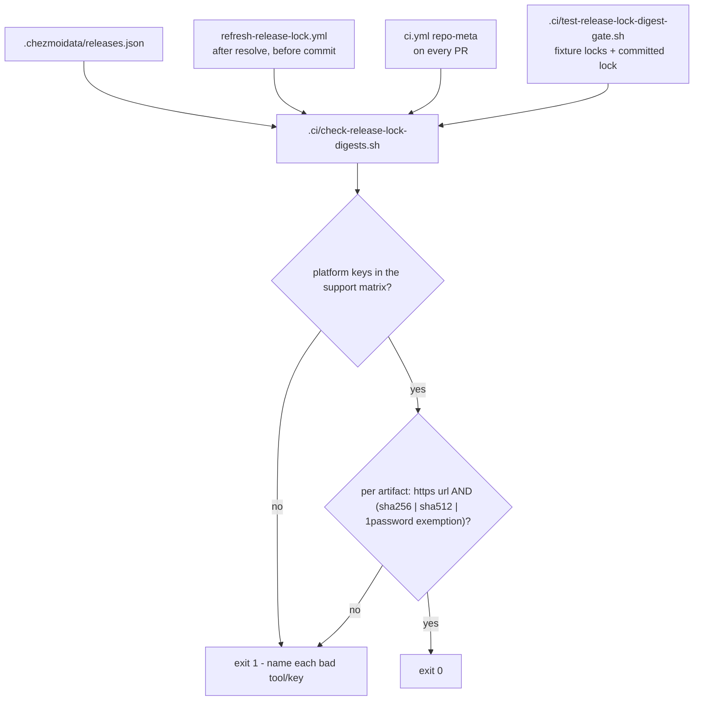

# Release Lock Digest Gate Accepts SHA-512 - Plan

## Goal Capsule

- **Objective:** The hourly release-lock refresh keeps landing upstream version, URL and checksum updates on `main`, so every workstation `chezmoi apply` installs current, checksum-verified tools instead of a lock frozen at 2026-09-02.
- **Means:** Teach the lock's digest gate that a published SHA-512 is a valid digest, and move the gate into a `.ci` script that pull requests run (KTD1, KTD2).
- **Authority:** The gate's security property is authoritative — an artifact with neither a SHA-256 nor a SHA-512 must still fail. Fixing the workflow may not soften that.
- **Stop conditions:** Stop and report if the extracted gate changes the verdict on any committed-lock artifact other than the four `agy` artifacts R1 newly accepts. Stop and report if any tool whose lock entry carries only a `sha512` is not consumed through `.chezmoitemplates/release-lock-ref.tmpl` with `field: "sha512"` — today that is `agy` alone, at `.chezmoiexternals/ai-agents.toml:38-39`.
- **Execution profile:** Single bounded change across two workflows, one new gate script, one new test with its fixture locks, and two documentation edits.
- **Tail ownership:** LFG owns commit, push, PR and CI watch.

---

## Product Contract

### Summary

Extract the release-lock validation from `.github/workflows/refresh-release-lock.yml` into `.ci/check-release-lock-digests.sh`, and make its digest rule accept a published lowercase-hex SHA-512 alongside SHA-256. Cover the extracted gate with `.ci/test-release-lock-digest-gate.sh`, and run it in `ci.yml`'s `repo-meta` job so a pull request that changes the lock catches a lock-validation regression before merge instead of the hourly scheduled run catching it after. Correct the two documentation statements that now imply SHA-256 is the only digest the lock records.

### Problem Frame

`.github/workflows/refresh-release-lock.yml` has failed on every scheduled run since 2026-09-02T08:24Z. Commit `95939c0` reintroduced the `agy` (Google Antigravity CLI) tool to the release lock. The Antigravity vendor manifest publishes only a SHA-512, so `packages/release-lock/src/vendor-manifest.ts` records `sha256: null` and a 128-hex `sha512` for each of `agy`'s four platforms. The workflow's inline `jq` gate accepts only a 64-hex `sha256`, with one hard-coded digest-less exemption for `1password` + `linux-arm64`. It therefore rejects four artifacts that are digest-protected — `.chezmoiexternals/ai-agents.toml:38-39` verifies `agy` through `[agy.checksum] sha512`.

The gate runs after the resolver step and before the commit step, so the failure also blocks the commit. The lock has not refreshed for any tool since the regression landed, and the workflow's own header comment ("The commit therefore happens even on a partial failure") no longer describes what happens.

Two things let this reach `main`. The rule was written when SHA-256 was the only digest any locked artifact carried, so it hard-codes an assumption the lock outgrew. And the gate lives inline in a scheduled workflow, so nothing exercised it on the pull request that reintroduced `agy` — the same class of blind spot `.ci/test-ci-wiring.sh` was written to close for unwired gate scripts.

### Requirements

**Digest rule**

- R1. An artifact whose `sha512` is a lowercase 128-hex string passes the digest gate, whatever its `sha256` holds.
- R2. An artifact whose `sha256` is a lowercase 64-hex string passes the digest gate, unchanged from today.
- R3. An artifact carrying neither a valid `sha256` nor a valid `sha512` fails the gate, except the existing `1password` + `vendorManifest` + 1Password RSS source + `linux-arm64` + explicit `sha256: null` exemption, which is carried over unchanged.
- R4. An artifact whose `url` is absent, non-string, or not `https://`-prefixed fails the gate, unchanged from today.
- R5. A platform key outside `linux-amd64`, `linux-arm64`, `linux-amd64-musl`, `linux-arm64-musl`, `darwin-amd64`, `darwin-arm64` fails the gate, unchanged from today. A tool with no `artifacts` key contributes no platform keys and no artifacts.
- R6. The gate names the offending tool and platform in its failure output. Today's message names neither, so a future failure is diagnosable from the log alone.

**Gate placement and coverage**

- R7. The validation logic lives in exactly one place: `.ci/check-release-lock-digests.sh`. `.github/workflows/refresh-release-lock.yml` invokes that script instead of carrying its own copy of the rule.
- R8. `.ci/test-release-lock-digest-gate.sh` exercises the gate against fixture locks covering each accept and reject case in R1-R6, and against the committed `.chezmoidata/releases.json`, which must pass.
- R9. `ci.yml` runs `.ci/check-release-lock-digests.sh` and `.ci/test-release-lock-digest-gate.sh` in the `repo-meta` job, so a pull request that changes `.chezmoidata/releases.json` fails before merge.
- R10. `.ci/test-ci-wiring.sh` passes with no new exception entry — both new scripts are reached from a workflow.

**Documentation**

- R11. `AGENTS.md`'s release-lock paragraph states that the `antigravity` vendor publishes only a SHA-512, so its tool `agy` records a `sha512` with a null `sha256` and the lock gate accepts either digest. The same paragraph states the consumer-side rule: an artifact the gate passes on its SHA-512 must be consumed by an external that declares `checksum.sha512`.
- R12. `packages/release-lock/README.md` states that the lock records a SHA-512 for a source that publishes only SHA-512, so the "Why digests are free" claim is not read as SHA-256-only.
- R13. `AGENTS.md`'s repository data-inventory row for `.chezmoidata/releases.json` names both digest fields, so it no longer describes the lock as carrying only a SHA-256.

### Success Criteria

- The next scheduled `refresh-release-lock.yml` run reaches the "Commit the lock when it changed" step.
- `.ci/check-release-lock-digests.sh` exits 0 against the committed lock, and exits 1 naming the tool and platform for a lock with an undigested artifact.

### Scope Boundaries

**Out of scope**

- Changing `packages/release-lock` resolver behavior. The resolver already records the SHA-512 the vendor publishes; the lock content is correct and the gate is what is wrong.
- Making the `1password` exemption data-driven. It stays a hard-coded conditional. Extraction makes it visible and testable, which is the improvement this change is entitled to make.
- Reordering the validate and commit steps. Today's order refuses to commit a lock the gate rejects, which is the property worth keeping, and this plan keeps it. The cost is real and stays: the gate sits between resolve and commit, so one genuinely bad artifact — a new tool whose vendor publishes no digest, or a source that flips to `http://` — blocks the commit of all 35 tools' updates and leaves the hourly job red. That is the same blast radius as the 2026-09-02 freeze; only its trigger changes from a false rejection to a true one. Making a true rejection visible is deferred, not denied — see below.
- Teaching any consumer to verify SHA-512. `.chezmoiexternals/ai-agents.toml` already does for `agy`.

**Deferred to Follow-Up Work**

- Alerting on a true gate rejection. A legitimate rejection still freezes every other tool's lock entry silently, because a red scheduled run is the only signal. The remedy — raise a visible alert, or quarantine the offending tool's entry and commit the rest — is a separate change with its own shape to settle, and it is not needed to unblock the refresh.
- Covering the registry-only pull request. `.ci/check-release-lock-digests.sh` reads the committed `.chezmoidata/releases.json`, and no CI job regenerates the lock from `packages/release-lock/src/registry.ts`. A pull request that adds a registry entry without regenerating the lock therefore passes this gate with nothing to inspect. `.chezmoitemplates/release-lock-ref.tmpl` fails closed on a missing tool or platform, so `render-dotfiles.yml` catches it today; a gate that regenerates the lock in CI would close it directly.

### Sources

- Failing run: `https://github.com/hyperlapse122/dotfiles/actions/runs/33662074470/job/100354756160`, step "Validate lock architecture and sources", `::error::lock carries an artifact without an https source URL or a valid SHA-256`.
- Regression commit: `95939c0` "feat(agents): manage claude and agy harnesses with selinux protection".
- Digest shape: `packages/release-lock/src/vendor-manifest.ts:93-137` (`AntigravityManifest`, `resolveAntigravity`), `packages/release-lock/src/types.ts:16-17`. `normalizeHex` at `packages/release-lock/src/vendor-manifest.ts:37-41` writes either a correct-length lowercase hex digest or `null`, so a machine-generated lock cannot carry a malformed digest.
- Consumer that verifies the SHA-512: `.chezmoiexternals/ai-agents.toml:38-39`.
- Gate to extend: `.github/workflows/refresh-release-lock.yml`, "Validate lock architecture and sources".
- Wiring gate and its rationale: `.ci/test-ci-wiring.sh:1-25`, `.github/workflows/ci.yml` `repo-meta` job.
- Stale documentation: `AGENTS.md` release-lock paragraph (final sentences) and its `.chezmoidata/releases.json` data-inventory row, `packages/release-lock/README.md` "Why digests are free".

---

## Planning Contract

### Key Technical Decisions

- KTD1. **Accept a valid SHA-512 as a digest, rather than exempting `agy`.** An exemption would record `agy` as unverified. It is verified — `.chezmoiexternals/ai-agents.toml:38-39` passes the locked SHA-512 to chezmoi's native `checksum.sha512`. The predicate gains one alternative, `(.sha512 | type == "string" and test("^[0-9a-f]{128}$"))`, and the undigested case still fails. Governs R1, R3.
- KTD2. **Extract the gate to `.ci/check-release-lock-digests.sh` instead of patching the inline `jq`.** A patched inline rule stays untestable and stays scheduled-only, so a lock committed with a non-SHA-256 digest repeats this failure post-merge. A script is testable locally, callable from both workflows, and covered by `.ci/test-ci-wiring.sh`. The coverage this buys is bounded by what a committed-lock gate can see: it catches a pull request that changes `.chezmoidata/releases.json`, which is the shape commit `95939c0` had, and not a registry-only pull request. Governs R7, R8, R9, R10.
- KTD3. **Default `artifacts` per element, not across the stream.** Today's platform-key check reads `[.releases.tools[].artifacts // {} | keys[]]`, where `//` applies to the whole generator rather than to each element. That form returns the correct answer for every shape the lock can take, `[]` included, so it is not a latent bug. The reason to change it is R6: only a per-element `(.value.artifacts // {})` inside a `to_entries[]` walk carries the tool key into the failure output. Governs R5, R6.
- KTD4. **Report every offending artifact, not just the first.** The gate collects violations into an array and prints one line per `tool platform reason`. A refresh that breaks several tools at once should show all of them in one run rather than one per re-run. Governs R6.

### High-Level Technical Design

The gate becomes one script with two checks, called from two workflows.



The single digest predicate, stated once here and cited by the units rather than restated in them:

```text
artifact is valid when
    url is a string starting with "https://"
  AND (
       sha256 is a string matching ^[0-9a-f]{64}$
    OR sha512 is a string matching ^[0-9a-f]{128}$
    OR ( tool == "1password"
     AND tool.kind == "vendorManifest"
     AND tool.source == "https://releases.1password.com/linux/stable/index.xml"
     AND platform == "linux-arm64"
     AND artifact has key "sha256" AND sha256 == null )
  )
```

### Assumptions

- The extracted script may assume `jq` is present. Both `ubuntu-latest` and `ubuntu-24.04` runner images ship it, and the current inline gate already depends on it with no install step.
- The script takes the lock path as an optional first argument, defaulting to `.chezmoidata/releases.json` relative to the repository root. The test needs to point it at fixture files; the workflows use the default. This mirrors how `.ci/test-claude-settings-reconcile.sh` and its siblings accept a path argument.
- Fixture locks live under `.ci/fixtures/release-lock-digests/`, matching the existing `.ci/fixtures/` convention. They are minimal hand-written JSON, not copies of the real lock.

### Sequencing

U1 must land before U2 (the test needs the script) and before U3 (the wiring needs both). U4 is documentation and is independent.

---

## Implementation Units

### U1. Extract the digest gate and accept SHA-512

- **Goal:** One script owns the lock validation rule, and that rule treats a published SHA-512 as a digest.
- **Requirements:** R1, R2, R3, R4, R5, R6, R7 (KTD1, KTD2, KTD3, KTD4)
- **Files:**
  - `.ci/check-release-lock-digests.sh` (new, executable)
  - `.github/workflows/refresh-release-lock.yml` (replace the inline `jq` body of "Validate lock architecture and sources" with the script call)
- **Approach:** Write the script with `set -euo pipefail`, resolving the repository root from `BASH_SOURCE` the way `.ci/test-ci-wiring.sh:27` does, and accepting an optional lock path argument. Implement both checks as `jq` walks over `.releases.tools | to_entries[]` so each violation carries its tool key and platform key. Emit `::error::` lines so GitHub Actions still annotates the run, and a plain summary line so local runs read cleanly. Keep the failure message's existing meaning but name the offenders per KTD4. In the workflow, keep the step name and the comment explaining the 1Password exemption; the `run:` body becomes the script invocation.
- **Test Scenarios:** Covered by U2. This unit is verified by running the script against the committed lock.
- **Verification:** `.ci/check-release-lock-digests.sh` exits 0 against `.chezmoidata/releases.json`. `shellcheck .ci/check-release-lock-digests.sh` is clean if `shellcheck` is available locally.

### U2. Cover the gate with a fixture-driven test

- **Goal:** Each accept and reject case in the digest rule has a test that fails when the rule regresses.
- **Requirements:** R8 (KTD2)
- **Files:**
  - `.ci/test-release-lock-digest-gate.sh` (new, executable)
  - `.ci/fixtures/release-lock-digests/*.json` (new)
- **Approach:** Follow the shape of an existing `.ci/test-*.sh` — a `fail`/`pass` helper pair, a `mktemp -d` scratch under `${XDG_RUNTIME_DIR:-$HOME/.cache}` with a cleanup trap, and one assertion per case naming what it proves. Each case runs `.ci/check-release-lock-digests.sh <fixture>` and asserts the exit status, plus the offender name in the output for reject cases.
- **Test Scenarios:**
  - Accept: a tool whose artifact carries a valid 64-hex `sha256` and no `sha512`.
  - Accept: a tool whose artifact carries `sha256: null` and a valid 128-hex `sha512` — the `agy` shape that broke the gate.
  - Accept: the `1password` `linux-arm64` exemption, with its exact `kind`, `source`, platform key, and explicit `sha256: null`.
  - Accept: a tool with no `artifacts` key at all, such as the `winbox` shape.
  - Accept: the committed `.chezmoidata/releases.json`.
  - Reject: an artifact with `sha256: null` and no `sha512`, naming that tool and platform in the output.
  - Reject: an artifact with `sha256: null` and a `sha512` that is uppercase, 127 hex characters, or `sha512:`-prefixed — a malformed digest is not a digest.
  - Reject: a digest-less artifact under a tool named `1password` whose platform key is `linux-amd64`, proving the exemption did not widen to the whole tool.
  - Reject: a digest-less artifact whose `kind` or `source` differs from the 1Password vendor manifest but whose tool key is `1password`, proving each exemption clause still binds.
  - Reject: an artifact whose `url` is `http://`, absent, or a non-string.
  - Reject: a lock carrying a platform key outside the support matrix, such as `windows-amd64`, naming that tool and key.
- **Verification:** `.ci/test-release-lock-digest-gate.sh` exits 0. Temporarily reverting U1's `sha512` alternative makes the `agy`-shape case fail. `shellcheck .ci/test-release-lock-digest-gate.sh` is clean if `shellcheck` is available locally — `render-dotfiles.yml` lints every `.ci/*.sh`.

### U3. Wire both scripts into pull-request CI

- **Goal:** A pull request that lands an undigested artifact or an unsupported platform key fails before merge.
- **Requirements:** R9, R10 (KTD2)
- **Files:**
  - `.github/workflows/ci.yml` (`repo-meta` job, "Run repository meta gates" step)
- **Approach:** Add `.ci/check-release-lock-digests.sh` and `.ci/test-release-lock-digest-gate.sh` to the existing command list beside `.ci/test-ci-wiring.sh`. `repo-meta` is already in `delivery`'s `needs`, so no aggregate change is needed. Confirm the job installs nothing new — both scripts need only `bash` and `jq`.
- **Test Scenarios:** Test expectation: none -- this unit is CI wiring with no behavior of its own; `.ci/test-ci-wiring.sh` is the gate that proves it.
- **Verification:** `.ci/test-ci-wiring.sh` exits 0 with no new entry in its `exceptions` map.

### U4. Correct the digest documentation

- **Goal:** The repository's digest claims describe the lock as it is, and name the consumer-side obligation that accepting a SHA-512 depends on.
- **Requirements:** R11, R12, R13
- **Files:**
  - `AGENTS.md` (release-lock paragraph, and the `.chezmoidata/releases.json` row of the repository data-inventory table)
  - `packages/release-lock/README.md` ("Why digests are free")
- **Approach:** In `AGENTS.md`'s release-lock paragraph, keep the existing `onePassword` sentences and add that the `antigravity` vendor publishes only a SHA-512, so its tool `agy` records a `sha512` with a null `sha256` and the gate accepts either digest — then state the obligation that makes that safe: an artifact the gate passes on its SHA-512 must be consumed by an external declaring `checksum.sha512`. In the same file's data-inventory table, replace the `.chezmoidata/releases.json` row's "per-platform asset URL and sha256" with wording naming both digest fields. In the README, add one sentence to "Why digests are free" noting that a vendor manifest publishing only SHA-512 is recorded in the artifact's `sha512` field with a null `sha256`. Match the surrounding ASD-STE100 style: short sentences, one idea each.
- **Test Scenarios:** Test expectation: none -- documentation only.
- **Verification:** `git diff` shows only the two `AGENTS.md` passages and the one README paragraph changed, and no claim in either file says SHA-256 is the only accepted digest.

---

## Verification Contract

| Command | Applies to | Signal |
|---|---|---|
| `.ci/check-release-lock-digests.sh` | U1 | Exits 0 against the committed lock. |
| `.ci/test-release-lock-digest-gate.sh` | U2 | Exits 0; every fixture case reports its assertion. |
| `.ci/test-ci-wiring.sh` | U3 | Exits 0 with no new exception entry. |
| `vp run -r test` in `packages/` | U1 (regression check) | Release-lock package tests still pass; this change does not touch the resolver, so a failure means something unintended moved. Matches the `ts-workspace` job in `ci.yml`. |
| `git diff --check` and `git status` | all | No whitespace errors; no unintended files. |

After push, watch `ci.yml` and `render-dotfiles.yml` to terminal success, per `AGENTS.md`. The scheduled `refresh-release-lock.yml` run is the real-world confirmation and lands within the hour after merge.

---

## Definition of Done

**Global**

- `.ci/check-release-lock-digests.sh` is the only place the lock validation rule is written.
- The committed `.chezmoidata/releases.json` passes the gate, `agy` included.
- An artifact with neither a valid SHA-256 nor a valid SHA-512 still fails, and the `1password` exemption still binds on every one of its clauses.
- Every artifact the gate accepts on its SHA-512 has a consumer that verifies that SHA-512 — checked for `agy` at `.chezmoiexternals/ai-agents.toml:38-39`.
- No abandoned experimental code remains in the diff.
- `AGENTS.md` and `packages/release-lock/README.md` no longer imply SHA-256 is the only accepted digest, the data-inventory row included.

**Per unit**

| Unit | Done when |
|---|---|
| U1 | The script exists, is executable, exits 0 on the committed lock, names tool and platform on failure, and the workflow step calls it instead of an inline rule. |
| U2 | Every scenario listed in U2 has an assertion, and the suite exits 0. |
| U3 | Both scripts run in `repo-meta`, and `.ci/test-ci-wiring.sh` passes with no new exception. |
| U4 | Both documentation surfaces name the SHA-512 case, the AGENTS.md data-inventory row included, and the release-lock paragraph states the consumer-side obligation. |
