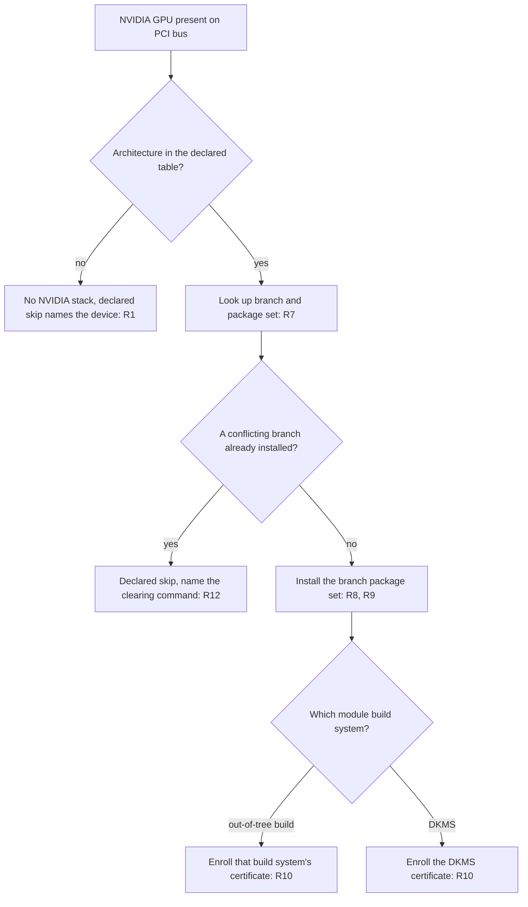
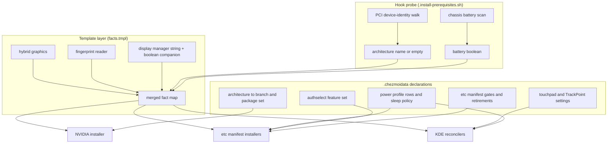

# ThinkPad P14s Gen 1 Host Fit - Plan

## Goal Capsule

- **Objective:** A hybrid-graphics ThinkPad laptop rebuilt from this repository reaches a working state with no hand-applied settings — its GPU gets a driver that binds, its touchpad and TrackPoint converge, its battery-shaped settings differ from a desktop's, its greeter matches the display manager it actually runs, and its fingerprint path survives the rebuild. Two enrollment steps stay interactive by design and are not counted against that: fingerprint enrollment per R25, and Secure Boot certificate enrollment until the defect tracked in issue #347 lands.
- **Means:** Add the missing host-identity axes to the fact registry and move NVIDIA branch policy into declared data (KTD3).
- **Product authority:** `STRATEGY.md` (declare it as data; a setting that only works because of how this host happens to be is drift) and root `AGENTS.md` (fact registry rules, `/etc` manifest model, no teardown scripts).
- **Execution profile:** Configuration and provisioning work. Proof is render-time and apply-time verification against the repository's own CI harnesses, never a live `$HOME`.
- **Stop conditions:** Stop and report if a required fact cannot be probed within the registry's three layers without the template `output` function, or if the manifest's retirement mechanism cannot express a gate without a teardown script.
- **Open blockers:** None.
- **Product Contract preservation:** Product Contract unchanged. Planning added the Planning Contract, Implementation Units, Verification Contract, and Definition of Done below; no R/F/AE ID was renumbered, split, or reworded.

---

## Product Contract

### Summary

Teach the host-fact registry the axes a hybrid-graphics laptop needs — GPU architecture, hybrid graphics, battery power, fingerprint hardware, display manager — and let the existing data-driven consumers follow those axes instead of special-casing one machine. Driver-branch policy becomes declared data rather than an assumption baked into the installer, so a GPU the current branch has dropped receives the last branch that supports it.

### Problem Frame

The repository has managed desktops. Its first laptop exposed five places where a host-shape difference has no axis to sit on, and the settings fall through to a desktop-shaped default.

The sharpest one is the GPU. `nvidia` answers only "is a `0x10de` device on the PCI bus", so every NVIDIA host receives the newest driver branch. On a Pascal Quadro P520 that branch installs, builds, signs, and then refuses the GPU at module load. The result on the audited host is not waste but damage: a persistence daemon in a permanent restart loop, a failed user unit, roughly 2.0 GB of packages rebuilt by DKMS on every kernel update, and — because the driver package blacklists the open drivers — a discrete GPU with no driver at all, held at `runtime_status=active` on battery.

The other four are quieter and share one shape. The touchpad allowlist names two device strings; a third model matches nothing and four managed settings skip in silence, because leaving an unlisted device alone is also the correct behavior. The power-profile rows write one value into the AC, Battery, and LowBattery profiles alike, because nothing in the repository knows a host runs on a battery. The ThinkPad module configuration enables fan control on every ThinkPad and no managed setting has ever consumed it. The greeter de-branding is gated on an SDDM theme, on an edition that no longer ships SDDM. The fingerprint reader works only because someone enabled an `authselect` feature and enrolled a finger by hand, and no manifest records either.

Each was found on one machine. Each will recur on the next laptop, and none of them reports that it did not converge.

### Key Decisions

- **Install the last driver branch that supports the GPU, rather than skipping the NVIDIA stack.** The discrete GPU stays usable and the driver actually binds. (session-settled: user-directed — chosen over skipping the stack entirely and letting the dGPU power down: a laptop dGPU that can work should work.) Governs R7, R8.
- **The probe reports GPU architecture; branch policy is declared data.** The next branch drop becomes a data row instead of a probe edit. (session-settled: user-directed — chosen over a probe emitting the branch verdict directly, and over an operator-declared branch per host: the first leaves generation policy in shell, the second adds a manual step to every rebuild.) Governs R1, R7.
- **An unclassifiable GPU receives no NVIDIA stack.** The registry is fail-safe about vendor absence but fail-open about branch — not knowing the branch currently means assuming the newest one. Extending the registry's own rule to the branch axis lets the architecture table list only what is known. Governs R1, R12.
- **Legacy-branch hosts get driver, CUDA runtime, and container toolkit — not the CUDA toolkit.** The current toolkit's compiler targets no architecture this GPU has. (session-settled: user-directed — chosen over driver-only and over keeping the full four-package set: the runtime and container path stay useful, the compiler does not.) Governs R8.
- **The installer never removes a conflicting branch.** Root `AGENTS.md` forbids teardown scripts, and the audited host is cleaned by hand once. (session-settled: user-directed — chosen over a package swap inside the installer and over a documented one-time reversal procedure: neither redraws the teardown boundary.) Governs R12.
- **Touchpad targeting moves from an exact-name allowlist to a device-property match with a deny-list.** The safe default inverts — from "touch only what was named" to "touch every touchpad not named for exclusion" — and in exchange the next laptop converges instead of failing silently. Governs R15, R17.
- **Fingerprint authentication is managed through `authselect`'s stock feature, never by writing PAM files.** Root `AGENTS.md` forbids the `common-auth` route on Fedora, so the platform's own feature mechanism is the only sanctioned path. Governs R23.
- **The fingerprint factor reaches `sudo` as well as polkit, and root `AGENTS.md` was amended to say so.** Fedora's feature writes `system-auth`, which `sudo` and polkit both include, so the two cannot be separated by any sanctioned mechanism. (session-settled: user-directed — chosen over a custom `authselect` profile that would confine the factor to the desktop's own fingerprint service, and over dropping fingerprint from this work: the operator accepts the factor at privilege escalation rather than lose it or hand-maintain a derived profile.) Governs R24.
- **The login greeter stays password-only, and that is a property of the profile rather than an assumption.** The feature writes `system-auth` only; every greeter that authenticates through `password-auth` is untouched by construction, and GDM additionally keeps its locked configuration key. Governs R24.
- **Battery-powered hosts suspend, then hibernate.** It reuses the swapfile and resume path the repository already provisions, so a laptop left closed does not drain while a short break keeps a fast resume. (session-settled: user-directed — chosen over plain deep suspend and over leaving the distribution default: neither uses the hibernation already in place.) Governs R20.
- **The charge threshold stays unmanaged.** (session-settled: user-directed — chosen over a fleet constant and over a new per-host data shape: battery health is a per-host operator judgment.)

### Requirements

**Host identity facts**

- R1. A fact reports the architecture generation of the host's NVIDIA GPU, resolved from the PCI device identity. Its value when the cache is absent, and its value for a device the architecture table does not list, must both be the value that skips every NVIDIA-gated path. That skip value is the empty string, so a consumer testing the fact for plain truthiness skips rather than installs. A device present on the PCI bus but absent from the architecture table declares that skip at the same registered site R12 uses, naming the unmatched PCI device identity so the operator can add a table row.
- R2. A fact reports whether the host pairs an integrated GPU with a discrete NVIDIA GPU.
- R3. A fact reports whether the host is powered by a system battery. The probe distinguishes a chassis battery from a peripheral battery, so a desktop with a battery-powered input device resolves false.
- R4. A fact reports whether the host has a fingerprint reader that `fprintd` can drive.
- R5. A fact reports which display manager the host runs, so greeter-shaped configuration gates on host identity rather than on the presence of one vendor's theme file.
- R6. Each fact added by R1 through R5 declares its probe layer, its gates, and its fail-safe direction in the registry, and reaches consumers only through the existing consumer templates. Each also declares its disposition toward the existing registry entry answering the same question — the vendor-presence fact for R1, the greeter and login-theme facts for R5, the PAM fingerprint fact for R4 — as either supersede-and-retire or coexist-with-a-stated-boundary. R22 names which fact its manifest gate reads.
- R6a. The hook fact cache carries string-valued facts as well as boolean ones. The cache writer, the cache shape check, and the absent-default type check in the fact templates all accept a string hook fact, and a cache line the shape check cannot parse does not invalidate the facts it can parse.

**NVIDIA driver delivery**

- R7. A data declaration maps GPU architecture to a driver branch and the package set that branch requires. The installer selects a package set from that declaration and holds no per-generation branch logic of its own.
- R8. A legacy-branch host receives the driver, the CUDA runtime that ships with that branch, and the container toolkit. It does not receive the current-branch CUDA toolkit or its driver metapackage.
- R9. Repository enablement and package-exclusion policy follow the resolved branch. A branch served by one package source must not be excluded by policy written for another.
- R10. Secure Boot module signing follows the resolved branch's kernel-module build system. A host on an out-of-tree-build branch enrolls that build system's own signing certificate; a host on the current DKMS branch enrolls the DKMS certificate. A host enrolls exactly one certificate per apply — the one belonging to its resolved branch. A certificate already enrolled for a branch the host no longer resolves to is left in place and reported at the same registered site R12 uses; withdrawing it is an operator action outside this scope.
- R11. `nvidia-persistenced` is enabled only on a host whose resolved branch supports its GPU.
- R12. When the host carries an installed NVIDIA branch that conflicts with the resolved one, the installer skips installation, declares the skip at a registered site, and names the operator command that clears the conflict. It removes nothing.
- R12a. When the package set declared for the resolved branch is unavailable from the enabled package source, the installer installs nothing, declares the skip at the same registered site R12 uses, and names the resolved branch and the missing packages.

**Hybrid graphics behavior**

- R13. A hybrid-graphics host receives render-offload defaults plus the driver module options that let the discrete GPU suspend and enter runtime power management.
- R14. A host with a single discrete GPU and no integrated GPU does not receive those options.

**Pointing devices**

- R15. The touchpad reconciler targets devices by the input-device property that identifies a touchpad, excluding only devices named in a deny-list.
- R16. TrackPoint settings are managed as data alongside the touchpad settings, on hosts that have one.
- R17. When a pointing device is present but excluded from configuration, the reconciler says so on its normal output rather than passing silently.
- R18. Per-device capability probes stay authoritative: a device that cannot perform a setting is skipped for that setting, whatever the data declares.

**Laptop power**

- R19. Display and idle behavior on battery and low battery are declared separately from the same behavior on AC.
- R20. A battery-powered host suspends first and hibernates after a bounded idle period, reusing the hibernation the repository already provisions. The mode is declared as data.
- R21. The ThinkPad ACPI fan-control option, which the module configuration sets on every ThinkPad while no managed setting consumes it, is either consumed by a managed setting or removed from that configuration.

**Login greeter**

- R22. Greeter configuration is gated on the display-manager fact. The manifest's retirement entries gain the same fact-gate axis its override entries already have, so a retired path is removed only on hosts matching the gate. The theme-forcing drop-in written for SDDM is retired for hosts that do not run SDDM and is never installed and then removed on the same run on a host that should keep it.

**Fingerprint authentication**

- R23. The `authselect` feature set is declared as data and applied on a host where the fingerprint fact and the Fedora distribution fact are both true.
- R24. The login greeter remains password-only. Fingerprint authentication is available at polkit prompts, at `sudo`, and at the desktop's own fingerprint service. The apply verifies the greeter guarantee against the stack the greeter actually reads, resolving `include` and `substack` chains, and declares a skip that withholds the feature if a fingerprint module would reach that stack.
- R25. Whether a user has enrolled a fingerprint is observable from the declared-skip state the repository's own reporting reads, not from apply scrollback, even though enrollment itself stays a manual, per-user step.

### Key Flows

Only the NVIDIA path is multi-step enough to need sequencing. The pointing-device, power, greeter, and fingerprint requirements are single-decision reconciliations that Requirements and Acceptance Examples already pin.

- F1. Apply on a hybrid laptop whose GPU the current branch dropped
  - **Trigger:** An apply on a Fedora host with an integrated GPU and a discrete NVIDIA GPU of a dropped architecture.
  - **Steps:** The hook probe resolves the architecture fact from PCI identity. The installer reads the branch and package set from the data declaration. Repository policy is set for that branch's package source. The package set installs. Module signing enrolls the certificate belonging to that branch's build system. The persistence service is enabled. Render-offload and power-management options are written because the hybrid fact is true.
  - **Outcome:** The module binds the GPU, the discrete GPU can enter runtime power management, and no CUDA compiler is installed.
  - **Covered by:** R1, R7, R8, R9, R10, R11, R13
- F2. Apply on a host that already carries the wrong branch
  - **Trigger:** The same apply, on a host where a conflicting branch is installed.
  - **Steps:** The architecture fact resolves. The installer detects the conflicting installed branch and stops before changing packages. It emits a declared skip naming the command that clears the conflict.
  - **Outcome:** Nothing is installed and nothing is removed. The apply succeeds and the operator has an actionable message.
  - **Covered by:** R12

### Acceptance Examples

- AE1. **Covers R1.** Given a host with an NVIDIA GPU whose device identity is absent from the architecture table, when the facts resolve, then every NVIDIA-gated path skips and no driver, CUDA, container toolkit, or certificate enrollment occurs.
- AE1a. **Covers R1.** Given a host whose NVIDIA GPU is absent from the architecture table, when the installer runs, then a declared skip appears at the registered site naming that PCI device identity, rather than the host passing silently with no driver.
- AE2. **Covers R1.** Given a host where the fact cache cannot be written, when the templates render, then the architecture fact takes its declared absent value and the NVIDIA stack skips.
- AE3. **Covers R8.** Given a host resolved to a legacy branch, when the package set installs, then the CUDA runtime and container toolkit are present and the current-branch CUDA toolkit is not.
- AE4. **Covers R10.** Given a Secure Boot host resolved to a branch built out of tree, when signing runs, then the only certificate newly enrolled belongs to that build system, and a DKMS certificate enrolled by an earlier branch is reported rather than removed.
- AE5. **Covers R12.** Given a host carrying an installed conflicting branch, when the installer runs, then no package is installed or removed, the apply exits successfully, and the declared skip names the clearing command.
- AE6. **Covers R11.** Given a host with no resolved branch, when services are configured, then the persistence service is not enabled.
- AE7. **Covers R14.** Given a desktop with a discrete NVIDIA GPU and no integrated GPU, when the driver options are written, then no render-offload or runtime-power-management option is applied.
- AE8. **Covers R15, R17.** Given a session with a touchpad named in no deny-list entry, when the reconciler runs, then its managed settings are applied. Given a touchpad named in the deny-list, then it is left alone and the reconciler reports that it was excluded.
- AE9. **Covers R19.** Given a battery-powered host, when the power settings apply, then the AC profile keeps its current value and the battery and low-battery profiles carry the battery-shaped value.
- AE10. **Covers R22.** Given a host whose display manager is not SDDM, when the system files install, then the SDDM theme drop-in is absent from the host and its retirement is recorded in the manifest.
- AE11. **Covers R23, R24.** Given a Fedora host with the fingerprint feature applied, when the greeter authenticates a user, then it accepts a password only; when a polkit prompt, `sudo`, or the desktop's fingerprint service authenticates the same user, then a fingerprint is accepted.
- AE12. **Covers R24.** Given a Fedora host whose greeter stack would reach a fingerprint module once the feature is enabled, when the apply evaluates that stack through its include chain, then the feature is not applied and the skip is declared.

### Scope Boundaries

- The battery charge threshold is not managed.
- Fingerprint enrollment is not automated. It stays an interactive, per-user step; only its observability is in scope, per R25.
- No per-host value shape is introduced. Every setting here is a fleet constant gated on a fact.
- Touchscreen configuration is out of scope. The device is present on the audited host and has nothing worth managing at the compositor level.
- Retiring the DKMS branch path is out of scope. Current-architecture hosts keep it.
- Three operator actions stay outside automation and are not counted against the Objective: clearing a conflicting installed NVIDIA branch on a converted host (R12), withdrawing a certificate belonging to a branch the host no longer resolves to (R10), and adding an architecture-table row for an unlisted GPU (R1). The audited host's one-time branch cleanup is the first of these.
- The non-interactive certificate-enrollment defect tracked separately in issue #347 is not fixed here. R10 defines which certificate a host enrolls; #347 governs how the enrollment request is queued without a terminal.

### Dependencies / Assumptions

- The legacy driver branch, its CUDA runtime, and its out-of-tree kernel-module builder are all packaged for the target Fedora release by a package source the repository can enable. Verified for the audited host's architecture at the time of writing.
- The current CUDA toolkit's compiler supports no architecture older than the audited GPU's. Verified against the installed toolkit.
- Where the platform's `authselect` fingerprint feature places the module varies by display manager, so R24 rests on a managed per-greeter control rather than on that placement. The repository already ships such a control for one display manager, gated on its own fact; the others need an equivalent before R23 may apply the feature there.
- The display manager shipped by the target edition exposes no theme selection comparable to the retired SDDM drop-in. Verified on the audited host.
- R1's fact is the registry's first string-valued hook fact, which is why R6a changes the cache format rather than assuming it.
- Root `AGENTS.md` forbids teardown scripts. R12 exists because of it.
- Issue #347 is open against the same installer. Its certificate path changes meaning once R10 lands, so whichever ships second must reconcile with the first.

### Outstanding Questions

Nothing blocks planning. Every item below is answerable during planning or from the codebase.

Planning resolved five of the six items the Product Contract deferred. The hibernate delay stays unset so the platform's battery-aware scheduling applies (KTD9); the TrackPoint set is natural scroll, middle-button emulation, and middle-button scrolling, which are the properties the audited device supports (KTD11); fan control is retired rather than consumed (KTD10); the out-of-tree builder's certificate is the one its key-generation tool writes (KTD5); and table coverage is the fleet's architectures plus the vendor's published legacy cut-lines, recorded in Assumptions. One remains.

**Deferred to Implementation**

- What keeps the architecture-to-branch table of R7 current ahead of an expiry. R12a makes a vanished package set observable at apply time, but whether the repository adds a scheduled freshness check for this table, the way it already does for other pinned external data, is a scope decision rather than a correctness one. It does not block any unit.

### Sources / Research

- `.chezmoidata/facts.yaml` — the fact registry, its three probe layers, and the fail-safe rule this plan extends to the branch axis. The `nvidia` entry is the fact R1 supersedes.
- `.chezmoiscripts/30-components/run_onchange_before_10-nvidia.sh.tmpl` — the current package set, the package-source exclusion policy R9 makes conditional, the certificate enrollment R10 redirects, and the unconditional service enablement R11 gates.
- `.chezmoitemplates/facts.tmpl` and `.chezmoitemplates/facts-validate.tmpl` — how facts merge and how gate expressions are validated. A `values:` list on a string fact is optional and checked only when declared.
- `.install-prerequisites.sh` — the hook that writes the fact cache, and the existing PCI vendor probe R1 replaces.
- `.chezmoidata/kde.yaml` — the touchpad device allowlist R15 replaces and the power-profile rows R19 splits.
- `.chezmoiscripts/50-linux-kde/run_onchange_after_config-kde-touchpad.sh.tmpl` — the reconciler, including the per-device capability probes R18 preserves.
- `.chezmoidata/system.yaml` — the `/etc` manifest, its gate field, and the `removed:` retirement lists R22 changes. The desktop subsystem's retirement loop honours neither a gate nor a distribution filter today, and it runs after the override install loop in the same script.
- `AGENTS.md` — the no-teardown rule behind the installer's report-only behavior, and the greeter-versus-polkit fingerprint boundary behind the `authselect` decision.
- `STRATEGY.md` — the declare-as-data approach and the unowned-live-surface and manual-steps metrics this work moves.
- Issues #354, #355, #356, #357, #358 carry the live-host evidence for each symptom. Issue #347 is the related open defect named in Scope Boundaries.

Surfaced during planning, and load-bearing for the units that cite them:

- `.chezmoitemplates/skip.sh.tmpl` — the four skip forms, the three directions, and the rule that a transient-blocking site must name a capability probe. Every new skip site in U4, U5 and U10 picks a form and direction from here.
- `.ci/skip-declaration-site-matrix.yaml`, `.ci/check-skip-declarations.sh`, `.ci/test-capability-cache.sh` — the site registry and the three copies of the frozen site totals behind KTD12.
- `.chezmoitemplates/facts-sh.tmpl` — how a fact reaches bash, and the character set a string fact's value must satisfy. This is what makes the empty-string skip value of KTD2 safe to export.
- `.chezmoitemplates/facts-gate.sh.tmpl` — the shared runtime gate helper, whose unmatched-name arm aborts rather than granting.
- `.chezmoiscripts/30-linux/run_onchange_after_install-system-10-desktop.sh.tmpl` — the desktop subsystem installer U9 changes: its ungated retirement loop, its gate accumulation, and its reason table.
- `.chezmoiscripts/30-linux/run_onchange_after_install-system-18-hardware.sh.tmpl` — the parallel-array filter shape KTD7 mirrors.
- `.chezmoiscripts/50-linux-kde/run_onchange_after_config-kde-settings.sh.tmpl` — the settings reconciler behind U8's profile split, including its rule that a setting needing a precondition belongs in its own script rather than the manifest.
- `.chezmoidata/.capability-registry.tsv` — the probe registry U10 extends if its installer needs a capability probe.
- `.ci/test-fedora-fact-block-baseline.sh` and `.ci/test-jetson-installer-render.sh` — the two hardcoded fact fixtures every new fact must join.
- `.ci/smoke-fedora-nvidia-repo-policy.sh` — the harness that asserts the package literals and the exclusion string U4 makes branch-conditional.
- `system/linux/etc/dconf/db/gdm.d/50-no-fingerprint-login` and its lock file — the existing managed greeter control KTD8 generalizes from.

---

## Planning Contract

### Key Technical Decisions

- KTD1. **The hook fact cache gains a string line shape, an unparseable line drops only itself, and the drop is reported.** Today one unparseable line voids every fact, and the inverted absent-defaults of the headless and virtualization facts then skip the entire `/etc` install set on an ordinary desktop. Per-line parsing bounds that, but it also removes the loud symptom, so the discarded fact's name is surfaced through the repository's declared-skip reporting — the hook rewrites the cache on every command, so a malformed line means the writer is producing it, and a silent drop would hide that indefinitely. Governs R6a.
- KTD2. **The vendor-presence fact keeps gating whether the NVIDIA installer is deployed; the architecture fact gates what it does.** The root ignore file decides whether the installer script exists on the host at all, so gating that on the architecture fact would un-deploy the very script that must declare the unlisted-device skip, and the acceptance example for that skip could never pass. The two facts coexist with a stated boundary rather than one superseding the other. The architecture fact's skip value is still the empty string, because inside the installer it reaches bash as a bare assignment and an empty value is the falsy one. Governs R1.
- KTD3. **The hook emits the raw PCI device identity; the template layer maps it to an architecture, and data maps architecture to branch and package set.** The hook is plain bash that runs before the source state is read, so it cannot see the template data map and the repository forbids adding a parser to it — its one precedent for hook-readable declared data is a deliberately TSV-shaped registry kept out of that map. Putting the device table in the hook would return the row an operator edits for a new GPU to shell, which is what this decision exists to prevent. Splitting it keeps the walk in the only layer that can traverse the device symlinks and every policy statement in data. (session-settled: user-directed — chosen over a probe emitting the branch verdict directly, and over an operator-declared branch per host: the first leaves generation policy in shell, the second adds a manual step to every rebuild.) Governs R1, R7.
- KTD4. **The legacy branch is served by RPM Fusion's out-of-tree module builder; the current branch keeps the vendor CUDA repository and DKMS.** The two are alternatives, so repository enablement and the RPM Fusion exclusion policy both become branch-conditional rather than unconditional. (session-settled: user-directed — chosen over skipping the NVIDIA stack entirely: a laptop discrete GPU that can work should work.) Governs R8, R9.
- KTD5. **The signing certificate is selected by the resolved branch's build system.** The out-of-tree builder generates `/etc/pki/akmods/certs/public_key.der`; the DKMS path keeps `/var/lib/dkms/mok.pub`. Both are host-generated, so the installer selects a path rather than shipping a certificate. Governs R10.
- KTD6. **The display-manager axis ships as a string fact plus a boolean companion.** The gate grammar rejects a negated value comparison, so "this host does not run SDDM" cannot be written as a negated string gate. The alternative — teaching the grammar to negate a value comparison — was rejected because that grammar is the validator every manifest gate passes through, and widening it to serve one retirement entry puts every existing gate at risk for no other gain. The companion boolean is local to this axis and changes nothing else. Governs R5, R22.
- KTD7. **Retirement entries gain a gate through the parallel-array shape the hardware subsystem already uses for its distribution filter.** The gate accumulation that feeds registry validation, and the source label it reports, both extend to the retirement list — otherwise a typo in a retirement gate reaches a host unvalidated. Governs R22.
- KTD8. **The greeter guarantee is checked against the resolved stack, before the feature is enabled.** The check follows `include` and `substack` chains from the greeter's own service file to the modules they pull in, and evaluates the profile as it would stand after the feature is enabled, so the withholding decision is made before the factor can land. Reading only the greeter's service file would pass on exactly the hosts the check exists to protect, because a greeter names no fingerprint module directly. GDM's locked configuration key stays as a second, independent control. Governs R24.
- KTD9. **The sleep policy names the operation and leaves the hibernate delay unset.** With a battery present and no explicit delay, the platform schedules hibernation from low-battery alarms and measured discharge rate; a hand-picked timeout would replace that with a worse constant. Governs R20.
- KTD10. **Fan control is retired rather than consumed.** Nothing in the repository has ever read the option, and removing it returns the fan to firmware control — the safe direction. Governs R21.
- KTD11. **TrackPoint is selected by pointer-without-touchpad, a different selector from the touchpad rule.** The audited TrackPoint reports `touchpad` false and `pointer` true, so the touchpad property match correctly excludes it and cannot be reused. Governs R16.
- KTD12. **Every new skip site ships with its matrix row and the frozen totals that guard it.** The site matrix, the checker's frozen counts, and the capability-cache test's copy of those counts move in one change; a new site without them fails CI rather than landing silently. Governs R1, R10, R12, R12a.

### High-Level Technical Design

### Assumptions

- The architecture table lists the architectures present in the fleet plus the vendor's published legacy cut-lines, and relies on R1's declared skip for anything else. Resolved at planning as the coverage default; no user was available to widen it.
- TrackPoint management covers natural scroll, middle-button emulation, and middle-button scrolling. Click-method and disable-while-typing properties are unsupported on the audited device and are not managed.
- The out-of-tree builder's certificate is generated on first use by its own key-generation tool, so the installer waits for that rather than minting one itself.

### System-Wide Impact

The fact registry is the widest blast radius in this plan. Every template, every `.chezmoiignore` block, and every script reads the merged fact map, so U1's cache-parsing change and U2/U3's new entries reach consumers that have nothing to do with a laptop.

- **The hook cache is read by every chezmoi command, not only apply.** A parsing regression does not fail loudly — it makes hook facts fall back to their declared defaults, and two of those defaults are inverted. The observable failure is a desktop that silently skips its whole `/etc` install set and its desktop provisioning, with a successful exit code. U1's per-line parsing exists to bound that, and its second test scenario is the one that proves it.
- **Registry-to-probe parity is bidirectional and render-time.** A fact declared without a probe, or emitted without a declaration, aborts every render — not just the one that uses it. Adding five facts therefore touches two hardcoded CI fixtures that enumerate the whole fact set; missing either turns a laptop change into a repository-wide render failure.
- **The `/etc` manifest installers share one gate helper and one validation call.** U9 changes the desktop subsystem's retirement loop and its gate accumulation. The other subsystem installers keep their current shape, so the change must not move the shared helper's contract.
- **The NVIDIA installer's package literals are asserted verbatim by a smoke test.** U4 makes them branch-conditional, so the assertion has to become branch-aware in the same change or the render gate fails on a correct implementation.
- **Skip declarations are counted, not just declared.** Three files carry frozen totals of the declared sites. Four units add sites; all four must move those totals together, or CI fails on the last one to land.
- **Authentication reaches beyond the laptop.** U10 changes the authentication stack on every managed Fedora host with a fingerprint reader, not only this one, and after the instruction-file amendment that includes accepting a fingerprint at privilege escalation there. The greeter check is what keeps the blast radius from reaching login screens.
- **This work trades one product metric against three.** It moves unowned live surface and manual steps to a working host in the right direction, and moves duplicate-knowledge defects in the wrong one: after it lands, a contributor adding a fact or a skip site edits two hardcoded fact fixtures plus four frozen counts that restate what the registry and the site matrix already own. That duplication is pre-existing and deliberately not consolidated here; a future consolidation would have to derive the fixtures and the counts from the registry and the matrix rather than restating them.

### Risk Analysis and Mitigation

| Risk | Consequence if unmitigated | Mitigation |
|---|---|---|
| The cache-parsing change regresses and voids the fact cache | A managed desktop silently skips `/etc` provisioning while the apply reports success | U1's per-line parsing plus its corrupt-line test scenario; the fact-block baseline gate catches a render-level regression |
| A new fact reaches the registry but not both CI fixtures | Every render fails, not only the laptop path | U11 lands the fixture updates with the fact that needs them, not after |
| The legacy branch stops being packaged for a future release | The installer selects a package set the source cannot satisfy | R12a's declared skip names the branch and the missing packages instead of failing the apply; the open question about a proactive freshness check stays recorded |
| A host converts between branches and accumulates a second trusted certificate | The kernel trusts a key belonging to no managed module build, and the repository cannot withdraw it | R10 reports the stale certificate at a registered site; withdrawal is stated as an operator action, so the gap is visible rather than assumed away |
| The fingerprint feature reaches a greeter with no managed password-only control | A biometric factor appears at a login screen the repository never audited | KTD8's per-greeter assertion withholds the feature and declares the skip; AE12 is the test that proves it |
| The touchpad selector inverts the safe default and configures an unintended device | An operator's deliberately unmanaged pointing device gets overwritten | The deny-list plus R18's per-device capability probes; R17's exclusion output makes every skipped device visible on the normal run |
| The audited host is not cleaned before the branch change lands | The conflicting-branch skip fires on every apply and the host never converges | Recorded in Scope Boundaries as a one-time operator action; R12's skip names the exact clearing command so the state is self-describing |

### Sequencing

U1 and U2 are the foundation: nothing else in the NVIDIA path can resolve until the cache carries a string fact and the architecture axis exists. U3 unblocks U6, U8, U9 and U10, which do not depend on one another; U7 depends on nothing and can land at any point. U11 follows U2 and U3 because it responds to the digest movement those two cause.

The riskiest edit in the plan is U1's cache parsing, and U3 sits behind it. Only the display-manager fact needs the string line; the hybrid, battery and fingerprint facts are booleans the current cache already carries. An implementer who wants the four laptop symptom fixes in hand before touching the cache can land those three booleans first and hold the display-manager fact — and therefore U9 — until U1 is proven.

---

## Implementation Units

| U-ID | Title | Key files | Depends on |
|---|---|---|---|
| U1 | String-valued facts in the hook cache | `.install-prerequisites.sh`, `.chezmoitemplates/facts.tmpl`, `.chezmoitemplates/facts-sh.tmpl` | — |
| U2 | GPU architecture fact and branch table | `.chezmoidata/facts.yaml`, `.chezmoidata/nvidia.yaml`, `.install-prerequisites.sh` | U1 |
| U3 | Hybrid, battery, fingerprint, display-manager facts | `.chezmoidata/facts.yaml`, `.chezmoitemplates/facts.tmpl`, both fact fixtures | U1 |
| U4 | Branch-aware NVIDIA package delivery | `.chezmoiscripts/30-components/run_onchange_before_10-nvidia.sh.tmpl`, `.ci/smoke-fedora-nvidia-repo-policy.sh` | U2 |
| U5 | Branch-aware module signing | `.chezmoiscripts/30-components/run_onchange_before_10-nvidia.sh.tmpl`, `.ci/smoke-fedora-dkms-mok.sh` | U4 |
| U6 | Hybrid-graphics driver options | `system/linux/etc/modprobe.d/`, `.chezmoidata/system.yaml`, `.chezmoiscripts/30-linux/run_onchange_after_install-system-18-hardware.sh.tmpl` | U3 |
| U7 | Pointing-device reconciler | `.chezmoidata/kde.yaml`, `.chezmoiscripts/50-linux-kde/run_onchange_after_config-kde-touchpad.sh.tmpl` | — |
| U8 | Laptop power profiles, sleep policy, fan retirement | `.chezmoidata/kde.yaml`, `.chezmoidata/system.yaml`, a new `systemd` subsystem installer | U3 |
| U9 | Gated retirement and greeter gating | `.chezmoidata/system.yaml`, `.chezmoiscripts/30-linux/run_onchange_after_install-system-10-desktop.sh.tmpl`, `.github/workflows/render-dotfiles.yml` | U3 |
| U10 | Fingerprint through authselect | `.chezmoidata/system.yaml`, `.chezmoiscripts/30-linux/`, `AGENTS.md` | U3 |
| U11 | Rebaseline the frozen render digests | `.ci/test-fedora-fact-block-baseline.sh` | U2, U3 |

### U1. String-valued facts in the hook cache

- **Goal:** The fact cache carries string facts, and a damaged line costs only itself.
- **Requirements:** R6a. Enables R1.
- **Dependencies:** none.
- **Files:** `.install-prerequisites.sh`, `.chezmoitemplates/facts.tmpl`, `.chezmoitemplates/facts-sh.tmpl`, `.chezmoidata/facts.yaml` (header documentation).
- **Approach:**
  1. Extend the cache writer so a string fact is emitted alongside the boolean ones, with the same charset the bash exporter already enforces.
  2. Replace the whole-file shape regex with per-line parsing: keep the lines that match either shape, discard the ones that do not, and never let a bad line void the file.
  3. Relax the absent-default type check so a string hook fact declares a string default; keep the boolean check for boolean facts and keep the hard failure when a hook fact declares no default at all.
  4. Surface the names of any discarded lines through the declared-skip state the repository's reporting reads, so a fact that fell back to its default is visible rather than silent.
  5. Update the registry header so the next contributor sees that the cache is no longer boolean-only.
- **Patterns to follow:** the existing atomic-swap and degrade-to-no-cache handling in the writer — a cache that cannot be written must still never abort a chezmoi command.
- **Test scenarios:**
  - A cache containing one string line and several boolean lines parses fully, and every fact resolves to its cached value.
  - A cache whose third line is corrupt parses the other lines, only the corrupt fact falls back to its declared default, and that fact's name appears in the repository's skip reporting.
  - Covers AE2. With no cache file at all, every hook fact takes its declared absent default and the NVIDIA-gated paths skip.
  - A string fact whose value contains a space fails the render loudly rather than emitting an unquoted assignment.
- **Verification:** rendering the fact block on a host with a mixed cache yields the expected exporter assignments, and a deliberately corrupted cache line changes exactly one fact.

### U2. GPU architecture fact and branch table

- **Goal:** The registry reports which GPU architecture a host has, and a data table says what that architecture needs.
- **Requirements:** R1, R7. Advances the Key Decision that branch policy is data.
- **Dependencies:** U1.
- **Files:** `.chezmoidata/facts.yaml`, a new `.chezmoidata` declaration for the device and branch tables, `.install-prerequisites.sh`, `.chezmoitemplates/facts.tmpl`, `.ci/test-fedora-fact-block-baseline.sh`, `.ci/test-jetson-installer-render.sh`.
- **Approach:**
  1. Have the hook emit the raw PCI device identity of the discrete NVIDIA device — the symlink walk is the only part that must live there — as its own cached value.
  2. Add the architecture fact to the registry as a template fact that maps that cached identity through a declared device table, with the empty string as its value for an unlisted device and for a missing cache.
  3. Declare the branch table: architecture to driver branch to package set, plus which module build system that branch uses.
  4. Record the vendor-presence fact's disposition as coexist-with-a-stated-boundary per R6 and KTD2: the root ignore file keeps gating installer deployment on vendor presence, while the architecture fact gates package selection, repository policy, signing and the persistence service inside the script.
  5. Add both new registry entries to the two hardcoded fact fixtures in the same change; the bidirectional parity check fails every render otherwise.
- **Patterns to follow:** the existing vendor probe's symlink-safe walk; the registry's `whenFalse` prose style, which explains the fail-safe direction rather than restating the probe.
- **Test scenarios:**
  - Covers AE1. A device identity absent from the table resolves the fact to empty and every NVIDIA-gated path skips.
  - A device identity present in the table resolves to that architecture and selects its branch row.
  - A host with no vendor device at all resolves to empty without error.
  - A gate expression naming the fact with an undeclared value fails the render with the declared values listed.
  - A host with a vendor device absent from the table still has the installer deployed, because the ignore file gates on vendor presence rather than on architecture.
- **Verification:** the fact resolves correctly on a host with a legacy-architecture device, on a host with a current-architecture device, and on a host with none; the fact-block baseline gate passes with both new entries in the fixtures.

### U3. Hybrid, battery, fingerprint, and display-manager facts

- **Goal:** The four remaining axes exist, each fail-safe and each declaring its relationship to the entry it overlaps.
- **Requirements:** R2, R3, R4, R5, R6.
- **Dependencies:** U1.
- **Files:** `.chezmoidata/facts.yaml`, `.chezmoitemplates/facts.tmpl`.
- **Approach:**
  1. Hybrid graphics: an integrated GPU present alongside the discrete one. Template layer if a stat-guarded read suffices; hook layer if the device walk is needed.
  2. Battery: a chassis battery, not a peripheral one. Discriminate on the power-supply scope rather than the mere presence of an entry, since the fleet already has desktops with battery-powered input devices.
  3. Fingerprint reader: hardware identity from a sysfs or device-class read, never by invoking the userspace daemon — that would fold this repository's own install order into the fact set.
  4. Display manager: a string fact plus the boolean companion KTD6 requires, so the retirement gate can express the negation.
  5. Every entry states its disposition toward the overlapping existing fact per R6.
- **Patterns to follow:** the existing ThinkPad fact's stat-guarded model-field read; the existing display-manager alias-symlink probe, which is the reliable positive signal.
- **Test scenarios:**
  - A desktop with a battery-powered input device resolves the battery fact false.
  - A laptop resolves the battery fact true.
  - A host whose greeter is not the GNOME one resolves the display-manager string to that greeter and the companion boolean accordingly.
  - A host with no fingerprint hardware resolves that fact false and the authselect feature does not apply.
  - Every new fact appears in the registry with a probe behind it, so the bidirectional parity check passes.
- **Verification:** the rendered fact block on the audited laptop reports battery, hybrid graphics, a fingerprint reader, and the correct display manager; the same block on a desktop reports none of them.

### U4. Branch-aware NVIDIA package delivery

- **Goal:** A host installs the package set its resolved branch declares, and a host that cannot converge says why.
- **Requirements:** R1, R7, R8, R9, R11, R12, R12a.
- **Dependencies:** U2.
- **Files:** `.chezmoiscripts/30-components/run_onchange_before_10-nvidia.sh.tmpl`, `.ci/skip-declaration-site-matrix.yaml`, `.ci/check-skip-declarations.sh`, `.ci/test-capability-cache.sh`, `.ci/smoke-fedora-nvidia-repo-policy.sh`.
- **Approach:**
  1. Replace the static package array with a selection from the branch table, and drop the current-branch CUDA toolkit and driver metapackage from the legacy set. State whether the selection happens at render time or at run time — the answer decides which arrays the smoke harness can still locate by anchored grep.
  2. Make repository enablement branch-conditional: the vendor CUDA repository for the current branch, the out-of-tree source for the legacy branch. The exclusion policy that currently blocks every out-of-tree package must not apply to the branch being installed. Enable the source through its distribution's signed release package with signature checking left at the default; never disable it to make an install succeed.
  3. Add the unlisted-architecture declared skip that R1 requires, naming the unmatched PCI device identity so the operator can add a table row. This site lives here because the installer is where the registered site is, and the ignore file keeps the script deployed on a vendor-present host.
  4. Add the conflicting-branch detection and its declared skip, naming the operator command that clears it. Remove nothing.
  5. Add the unavailable-package-set detection and its declared skip, naming the branch and the missing packages.
  6. Gate the persistence service on a resolved branch rather than on vendor presence.
  7. Carry the smoke harness with the change: make its package-literal and exclusion-string assertions branch-aware, and add an assertion that neither branch's recorded invocations disable signature checking.
- **Execution note:** this is provisioning code with no unit-test surface; prefer the repository's rendered-script smoke harness with a stubbed package manager over invented unit coverage.
- **Patterns to follow:** the existing repo-policy smoke harness, which stubs the package manager on `PATH` and asserts on its log; the existing declared-skip call sites in this same script.
- **Test scenarios:**
  - Covers AE3. A legacy-branch host installs the driver, the branch's CUDA runtime, and the container toolkit, and does not install the current-branch toolkit.
  - A current-architecture host installs exactly today's package set, unchanged.
  - Covers AE5. A host carrying a conflicting installed branch installs nothing, removes nothing, exits successfully, and emits the declared skip with the clearing command.
  - A host whose declared package set is missing from the enabled source emits the declared skip naming the branch and the packages.
  - Covers AE1a. A host whose GPU is absent from the architecture table installs nothing, removes nothing, exits successfully, and emits the declared skip naming that PCI device identity, rather than passing silently.
  - Covers AE6. A host with an empty architecture fact never reaches package installation and does not enable the persistence service.
  - Neither branch's recorded package-manager invocations disable signature checking.
  - Running the installer twice against an unchanged host produces the same repository policy exactly twice and no drift.
- **Verification:** the rendered script under the smoke harness produces the expected package set per branch and the expected repository policy per branch, and every skip path exits zero.

### U5. Branch-aware module signing

- **Goal:** A host enrolls the certificate belonging to its resolved branch's build system, and a certificate left from another branch is reported.
- **Requirements:** R10.
- **Dependencies:** U4.
- **Files:** `.chezmoiscripts/30-components/run_onchange_before_10-nvidia.sh.tmpl`, `.ci/skip-declaration-site-matrix.yaml`, `.ci/check-skip-declarations.sh`, `.ci/test-capability-cache.sh`, `.ci/smoke-fedora-dkms-mok.sh`.
- **Approach:**
  1. Select the certificate path from the resolved branch's build system rather than assuming the DKMS one.
  2. Keep the existing already-queued and already-enrolled short circuits; they apply per certificate, not globally.
  3. Add a declared skip for the case where the resolved branch's certificate has not been generated yet. Declare it `transient-tolerable`, not the DKMS no-keypair site's `not_applicable` — reusing that would record an eligible Secure Boot host with an unsigned module as a clean run and keep it off the skip report.
  4. Report a certificate enrolled for a branch the host no longer resolves to, at the same registered site the conflicting-branch skip uses. Do not withdraw it.
  5. Carry the MOK smoke harness with the change: its scratch-path substitution and keypair assertions are written against the DKMS paths by name and must become branch-aware.
  6. Leave the non-interactive enrollment defect alone — it is tracked separately and named in Scope Boundaries.
- **Patterns to follow:** the existing key-state helper's present/partial/absent tri-state, which is what keeps a half-generated key pair from being silently regenerated.
- **Test scenarios:**
  - Covers AE4. A Secure Boot host on the out-of-tree branch enrolls only that build system's certificate.
  - A host that previously enrolled the DKMS certificate and now resolves to the out-of-tree branch reports the stale certificate and removes nothing.
  - A host with Secure Boot disabled takes the existing not-applicable path unchanged.
  - An already-enrolled certificate for the resolved branch short-circuits without a second enrollment request.
  - A Secure Boot host whose branch certificate does not exist yet emits the transient-tolerable skip and appears on the skip report, rather than exiting as a clean run.
- **Verification:** the rendered script selects the correct certificate path per branch, and the MOK smoke harness passes against both branch renders after its assertions are made branch-aware.

### U6. Hybrid-graphics driver options

- **Goal:** A laptop discrete GPU can idle and suspend; a desktop discrete GPU is untouched.
- **Requirements:** R13, R14.
- **Dependencies:** U3.
- **Files:** a new drop-in under `system/linux/etc/modprobe.d/`, `.chezmoidata/system.yaml`, `.chezmoiscripts/30-linux/run_onchange_after_install-system-18-hardware.sh.tmpl`.
- **Approach:**
  1. Add the module options that enable runtime power management and preserve video memory across suspend, as a managed `/etc` file gated on the hybrid-graphics fact.
  2. Add the render-offload defaults the same way.
  3. Register both paths in the manifest with the hybrid gate and the correct subsystem.
  4. Extend the hardware installer's own file array and its fingerprint globs with the two new source paths. The manifest supplies mode and gate for files the installer already enumerates; it does not decide what gets installed, so a manifest entry alone would leave both drop-ins uninstalled while the apply reported success.
- **Patterns to follow:** the existing ThinkPad module configuration, which is a gated `/etc` drop-in declared in the manifest *and* listed in the installer's array.
- **Test scenarios:**
  - Covers AE7. A single-discrete-GPU desktop receives neither drop-in.
  - A hybrid laptop receives both, at the declared mode — the positive case, which a manifest-only change would fail while the negative case still passed.
  - A host with no vendor device receives neither.
- **Verification:** the manifest gate resolves correctly on both host shapes and the files land only where the gate is true.

### U7. Pointing-device reconciler

- **Goal:** Every touchpad converges by default, the TrackPoint is managed, and an excluded device says so.
- **Requirements:** R15, R16, R17, R18.
- **Dependencies:** none.
- **Files:** `.chezmoidata/kde.yaml`, `.chezmoiscripts/50-linux-kde/run_onchange_after_config-kde-touchpad.sh.tmpl`.
- **Approach:**
  1. Replace the exact-name allowlist with the device-property match, plus a deny-list of names to leave alone.
  2. Add the TrackPoint selector — pointer without touchpad — and its own settings block, distinct from the touchpad settings.
  3. Keep the existing per-device capability probes authoritative for both device classes.
  4. Keep and re-word the existing exclusion output so a denied or unmatched device reports rather than passing silently.
- **Patterns to follow:** the reconciler's existing capability-probe-before-write shape, which is what stops a setting being forced on a device that cannot perform it.
- **Test scenarios:**
  - Covers AE8. A touchpad named in no deny-list entry receives all four managed settings.
  - A touchpad named in the deny-list is left alone and the reconciler reports the exclusion.
  - The TrackPoint receives its own settings and none of the touchpad-only ones.
  - A device that reports a setting unsupported is skipped for that setting and configured for the rest.
  - A session with no pointing device at all takes the existing not-applicable path.
- **Verification:** on the audited laptop both the touchpad and the TrackPoint converge from a clean configuration, and a second run writes nothing.

### U8. Laptop power profiles, sleep policy, and fan retirement

- **Goal:** Battery behavior differs from AC behavior, a closed laptop stops draining, and no unowned module option remains.
- **Requirements:** R19, R20, R21.
- **Dependencies:** U3.
- **Files:** `.chezmoidata/kde.yaml`, a new `system/linux/etc/systemd/sleep.conf.d/` drop-in, `.chezmoidata/system.yaml`, a new installer under `.chezmoiscripts/30-linux/`, `system/linux/etc/modprobe.d/thinkpad_acpi.conf`.
- **Approach:**
  1. Split the power-profile rows so the AC profile keeps its current value and the battery and low-battery profiles carry the battery-shaped one. This is a data edit; the settings reconciler takes nested group paths already, and the rows are inert on a desktop.
  2. Add the sleep-policy drop-in naming the suspend-then-hibernate operation and leaving the hibernate delay unset, gated on the battery fact.
  3. Create a new `systemd` manifest subsystem with its own installer, following the shape of the existing subsystem installers: a file array, the shared gate helper, and its own fingerprint globs. Do not retrofit this onto the hibernation-storage installer — that script's whole body is wrapped in a Fedora-and-btrfs condition and includes no fact machinery, so absorbing the sleep policy there would silently narrow R20 to Fedora-on-btrfs hosts.
  4. Remove the fan-control option from the ThinkPad module configuration.
- **Patterns to follow:** the hardware and desktop subsystem installers, which are the model for a new subsystem with a gate; the hibernation-storage installer, which owns the swap and resume side this policy depends on but cannot host it.
- **Test scenarios:**
  - Covers AE9. A battery host's AC profile keeps its existing value while the battery and low-battery profiles carry the new one.
  - A desktop receives the same profile rows, which are inert there, and does not receive the sleep drop-in.
  - A battery host receives the sleep drop-in and the resulting policy names suspend-then-hibernate with no explicit delay.
  - The ThinkPad module configuration no longer sets fan control, and the file still installs on a ThinkPad.
- **Verification:** the profile rows apply through the settings reconciler without a second-run diff, and the sleep drop-in lands only on a battery host.

### U9. Gated retirement and greeter gating

- **Goal:** The greeter drop-in is retired where it is meaningless and kept where it is not, without ever being installed and removed on the same run.
- **Requirements:** R22. Enables R23.
- **Dependencies:** U3.
- **Files:** `.chezmoidata/system.yaml`, `.chezmoiscripts/30-linux/run_onchange_after_install-system-10-desktop.sh.tmpl`, `.chezmoidata/facts.yaml`, `.github/workflows/render-dotfiles.yml`, `system/README.md`.
- **Approach:**
  1. Give retirement entries a gate through the parallel-array shape the hardware subsystem already uses for its distribution filter, and switch the removal loop to index form.
  2. Extend the gate accumulation that feeds registry validation to cover the retirement list, and correct the source label it reports.
  3. Resolve the override gate with a combined fact rather than a conjunction the grammar cannot express. A manifest entry carries one gate expression and the shared helper has no conjunction form, so re-pointing the drop-in's gate at the display manager alone would drop the theme-presence guard that exists because forcing the theme without it yields a broken login screen, while keeping the theme gate alone would install and then remove the file on the same run on a non-SDDM host that happens to carry the theme. Declare one fact that is true only when the host runs SDDM *and* the theme is present, gate the override on it, and gate the retirement on its companion boolean.
  4. Re-point the workflow's undeclared-fact negative assertion, which substitutes into the SDDM entry's gate by name and would silently stop testing anything once that gate moves. Aim it at a manifest gate this plan does not touch.
  5. Add the new gate names to the installer's reason table and to the manifest documentation.
- **Patterns to follow:** the hardware installer's `distro` filter, which is the exact parallel-array shape this needs.
- **Test scenarios:**
  - Covers AE10. A host whose display manager is not SDDM does not have the drop-in on disk, and the retirement is recorded in the manifest.
  - A host that does run SDDM keeps the drop-in, and the same run does not remove it after installing it.
  - A retirement entry naming an undeclared fact fails the render with the unknown name reported.
  - A retirement entry with no gate behaves exactly as it does today.
- **Verification:** rendering the desktop installer for both host shapes produces the expected install and removal lists, and the render-time manifest gate still rejects an undeclared fact.

### U10. Fingerprint through authselect

- **Goal:** A rebuilt Fedora laptop authenticates by fingerprint at polkit, `sudo`, and the desktop's fingerprint service, the greeter still takes a password only, and the enrollment gap is visible.
- **Requirements:** R23, R24, R25.
- **Dependencies:** U3.
- **Files:** `.chezmoidata/system.yaml`, a new or extended installer under `.chezmoiscripts/30-linux/`, `.chezmoidata/.capability-registry.tsv`, `.ci/skip-declaration-site-matrix.yaml`, `.ci/check-skip-declarations.sh`, `.ci/test-capability-cache.sh`, `AGENTS.md`.
- **Approach:**
  1. Amend the repository instruction file's authentication paragraph so the standing sudo-is-password-only rule reflects the decision recorded in the Key Decisions above. Land this with the unit, not after it, so the instructions never contradict the shipped behavior.
  2. Declare the feature set as data and apply it where the fingerprint fact and the distribution fact are both true.
  3. Before enabling, resolve the greeter's authentication stack through its `include` and `substack` chain against the profile as it would stand afterwards. Withhold the feature and declare the skip if a fingerprint module would reach it.
  4. Report whether the current user has an enrollment, through the declared-skip state the repository's reporting already reads.
  5. Add a capability probe for the platform tool if the installer needs one. The existing command-present kind covers it with no hook change, but a new registry row raises the probe count hardcoded in the capability-cache test and must ship with the transient-blocking skip declaration that names it — that test asserts the registry and the matrix's blocking probes are the same set.
- **Patterns to follow:** the existing locked configuration key and its lock file, which is the second greeter control; the existing PAM fingerprint fact, whose Debian conjunction stays untouched and whose boundary against the new hardware fact R6 requires be written down.
- **Test scenarios:**
  - Covers AE11. On a host with the feature applied, the greeter accepts a password only, while polkit, `sudo`, and the desktop fingerprint service each accept a fingerprint.
  - Covers AE12. On a fixture whose greeter stack resolves to a fingerprint module, the feature is not applied and the skip is declared.
  - A greeter whose service file names no fingerprint module but whose include chain reaches one is caught, not passed.
  - A host with no fingerprint hardware never reaches the feature application.
  - A non-Fedora host is unaffected, and the existing PAM fingerprint fact still resolves as it does today.
  - A user with no enrollment is reported through the repository's own reporting rather than through apply output, and is distinguishable there from a convergence failure.
- **Verification:** on the audited laptop polkit and `sudo` accept a fingerprint while the greeter does not, the reporting names the enrollment state, and the instruction file no longer contradicts that behavior.

### U11. Rebaseline the frozen render digests

- **Goal:** The render-gate baselines account for the fact-registry growth this plan causes, instead of failing on it with a message that points at the wrong file.
- **Requirements:** Supports R1 through R6a by keeping the render gates honest.
- **Dependencies:** U2, U3.
- **Files:** `.ci/test-fedora-fact-block-baseline.sh`, and the frozen digests it carries.
- **Approach:**
  1. Decide between rebaselining the digests and extending the normalizer to cut the generated gate-dispatch table, and record which. The shared gate helper renders one dispatch arm per registry fact into every script that includes it, and the baseline normalizes away only the exporter assignment group and the shared-host guard — so the dispatch table sits inside the hashed region and three of the baseline scripts fail as soon as a fact is added, reporting a change "outside the two generated blocks" that is in fact inside a generated block nobody normalizes.
  2. Apply that choice once, so the digest movement is legible as intended rather than as drift.
- **Execution note:** the failure this unit prevents was reproduced by adding a single boolean fact to a scratch copy of the registry; expect it, rather than treating the first red baseline as a mistake.
- **Test scenarios:**
  - With the new facts present, the baseline passes.
  - Adding a further fact to the registry without touching the fixtures still fails, so the parity check is not weakened by the rebaseline.
- **Verification:** the render-gates and render-dotfiles jobs both pass on the branch.

Every other CI obligation belongs to the unit that creates it, not to a trailing unit: fact fixtures ship with U2 and U3, the repo-policy smoke harness with U4, the MOK harness with U5, the workflow's negative fact assertion with U9, and each new skip site's matrix row and frozen totals with the unit that declares it. A single trailing CI unit could not both land with the first fact change and depend on every unit that makes one.

---

## Verification Contract

| Gate | What it proves | Applies to |
|---|---|---|
| `.ci/test-fedora-fact-block-baseline.sh` | Every declared fact has a probe and appears in the fixtures; the Fedora render is otherwise byte-stable | U1, U2, U3 |
| `.ci/test-jetson-installer-render.sh` | The second fact fixture stays in parity with the registry | U2, U3 |
| `.ci/smoke-fedora-nvidia-repo-policy.sh` | Package set and repository policy are correct per branch, and idempotent across two runs | U4 |
| `.ci/smoke-fedora-dkms-mok.sh` | Module signing still selects a real certificate and the retired hook stays retired | U5 |
| `.ci/check-skip-declarations.sh` and `.ci/test-capability-cache.sh` | Every new skip site is declared, classified, and counted, and the capability registry and the matrix's blocking probes stay the same set | U1, U4, U5, U10 |
| `.ci/test-ci-wiring.sh` | Any new check script is actually invoked by a workflow | U8, U11 |
| Manifest gate in `.github/workflows/render-dotfiles.yml` | An undeclared fact in the manifest, and a declared fact with no probe, both fail the render | U2, U3, U6, U8, U9 |
| A new PAM-stack fixture check | With the declared feature set applied to stock Fedora stacks, the resolved greeter stack reaches no fingerprint module while `sudo` and polkit do, and the GDM key stays present and locked | U10 |
| `chezmoi diff` against a scratch destination, twice | A second apply on unchanged source changes zero targets | all units |

Verification never deploys to the live `$HOME`. Every apply-shaped check runs against a scratch destination.

---

## Definition of Done

**Global**

- Every requirement R1 through R25 is implemented. A requirement may be dropped only by moving it to Scope Boundaries in the same change, with the reason recorded there; declaring one deferred at the end of the work does not satisfy this.
- Both fact fixtures list every registry fact, and the bidirectional parity check passes.
- Every new skip site has a matrix row, and the frozen totals agree across all three files that carry them.
- A second apply on unchanged source changes zero targets and reruns zero onchange scripts.
- No teardown or revert script was added. Nothing removes a package, a certificate, or a file outside the manifest's retirement mechanism.
- Privilege escalation and the login greeter both still require a password on every managed host.
- Abandoned or experimental code from approaches that did not work is removed, not left in the diff.

**Per unit**

- U1: a corrupt cache line costs one fact, not the file.
- U2: an unlisted device resolves to the empty value and declares its skip.
- U3: a desktop with a battery-powered input device resolves the battery fact false.
- U4: the legacy set installs without the current-branch compiler; a conflicting branch installs and removes nothing.
- U5: exactly one certificate is newly enrolled per apply.
- U6: a single-GPU desktop receives no hybrid drop-in.
- U7: the touchpad and the TrackPoint both converge, and an excluded device reports.
- U8: the AC profile is unchanged while the battery profiles differ, and no unowned module option remains.
- U9: the greeter drop-in is never installed and removed on the same run.
- U10: the greeter takes a password only, while polkit and `sudo` accept a fingerprint, and the instruction file says so.
- U11: the render gates pass on the branch, and the parity check still fails on an unfixtured fact.
