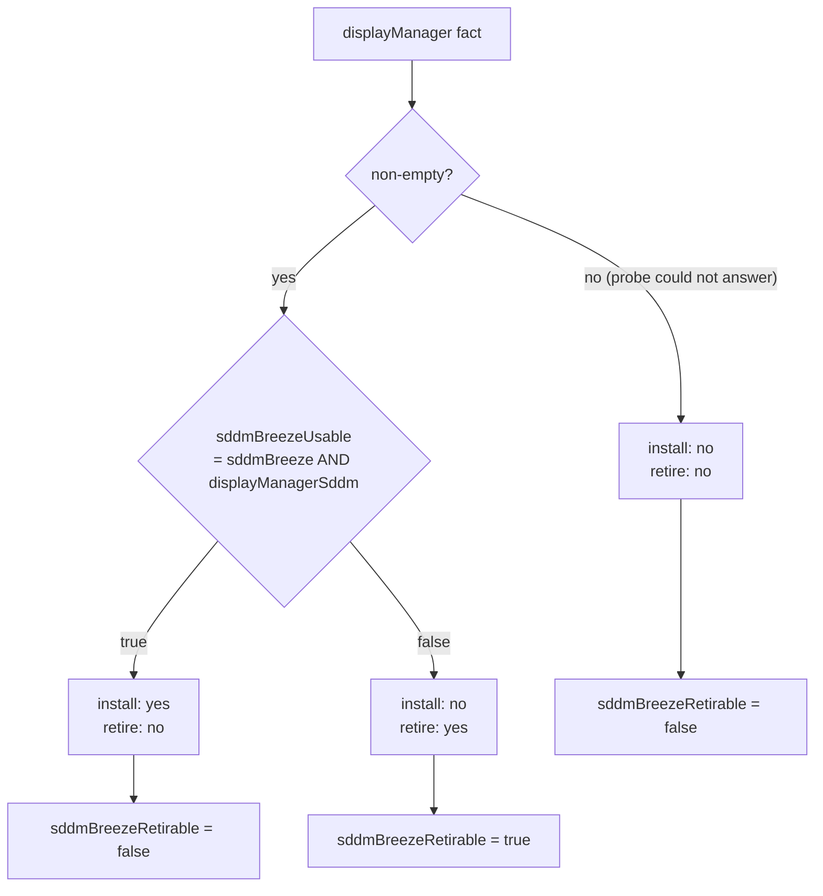
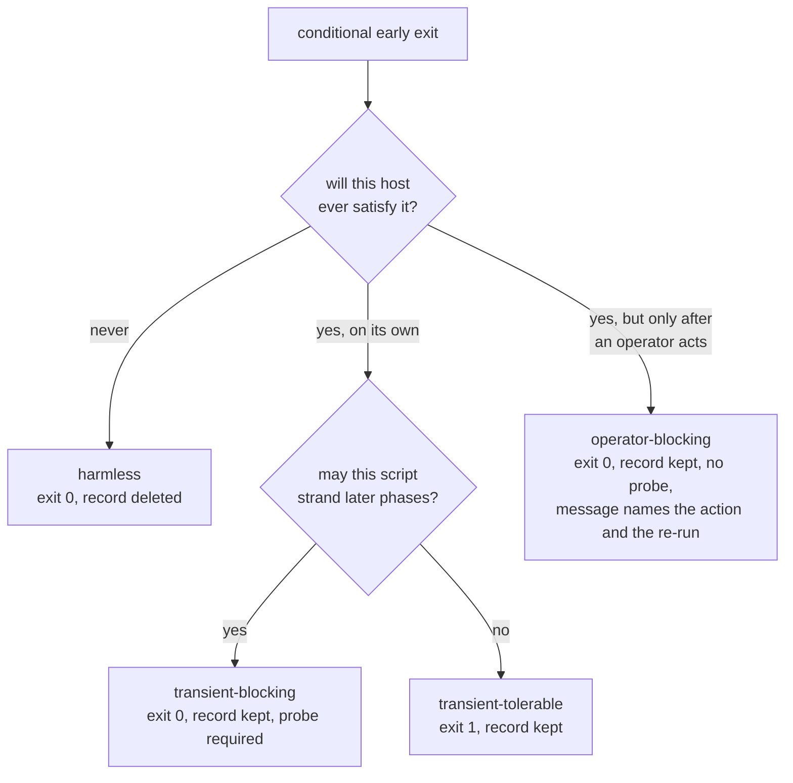

# Resolve Every Open Issue - Plan

## Goal Capsule

- **Objective:** An operator applying this repository on a Fedora host gets the driver, greeter, fingerprint and agent-settings behavior the repository claims: no host silently loses a declared setting, no host is recorded as converged while a driver or a settings leaf is missing, and no host has a login-screen or driver decision made from a fact nobody could read.
- **Means:** Close the ten open GitHub issues (#341, #343, #344, #347, #360, #361, #362, #363, #364, #365) as ten independently landable units in one branch (KTD1).
- **Authority:** Requirements win on behavior. KTDs win on mechanism. `AGENTS.md` and `.chezmoitemplates/skip.sh.tmpl` remain the owning contracts for gate direction and skip semantics; this plan changes them explicitly where a unit says so, never implicitly.
- **Execution profile:** Source-state only. No live `$HOME` deployment, no service restarts. Verification is render plus scratch-destination fixture, per `AGENTS.md` "Verification".
- **Stop conditions:** Stop and report if a fix would require writing PAM files directly, removing a package or `/etc` file the repository does not own, or weakening a CI gate to make a run green.
- **Tail ownership:** `ce-work` implements; `ce-code-review` and the repository's own `.ci` gates verify; `ci.yml` and `render-dotfiles.yml` must both reach terminal success.

---

## Product Contract

### Summary

Ten open issues describe defects and gaps across four subsystems: the KDE touchpad reconciler, the Fedora NVIDIA installer and its two smoke harnesses, the SDDM greeter drop-in gate, and the Claude Code settings reconciler. Six of them came out of one code review of #359 and were filed rather than fixed because each needed a decision. This plan makes those decisions and lands the work as ten units.

Three issues carry a real design fork, resolved here: #360 gets a fourth skip direction rather than an invented capability probe; #362 takes its own option 1 (accept the wider scope, record it); #341 narrows to stating the declarable surface and adding a render-time risk guard, declaring no permission value.

### Problem Frame

Every one of these defects shares a shape: an apply reports success while the host did not converge. A guard that tests a value instead of a capability always passes. A retirement gate that reads an unknown fact as "not SDDM" deletes a live greeter drop-in. A skip declared `harmless` deletes its own record and never looks again, so an operator who clears the condition gets no re-run. One damaged key in `~/.claude/settings.json` suppresses every declared leaf, including the supply-chain updater pin. A CI guard with no failing fixture cannot prove it still fails.

Two more are coverage gaps behind that same shape: #359 added a whole second NVIDIA driver branch and neither smoke harness exercises it, so the branch-conflict stop path and the akmod certificate path have never run.

### Requirements

**Gate and fact correctness**

- R1. A KWin device property is written only when the device declares support for it through a `supports*` capability property.
- R2. A `removed:` manifest entry never fires from a fact the host could not resolve.
- R3. A known SDDM host that lost the Breeze theme retires the drop-in that points at the missing theme.
- R4. `.chezmoidata/facts.yaml` prose for every fact this plan touches states the fact's real consumers and its real false-case behavior.

**NVIDIA branch policy**

- R5. A host resolving to a non-`cuda` branch has the current-branch driver packages excluded from the CUDA repository, so only one source can serve them.
- R6. A skip whose condition an operator can clear is not recorded as final: its state record survives and names the operator action plus how to re-run.
- R7. `mokutil --import` either queues the certificate on a non-interactive apply or takes a declared skip naming why; it never discards its own exit status.
- R8. Both NVIDIA smoke harnesses exercise the legacy akmod branch as well as the current DKMS branch.

**Claude Code settings**

- R9. A declared settings leaf whose own ancestors are writable is asserted even when an unrelated declared path is blocked; blocked paths are reported by name.
- R10. The env-type CI check has a fixture that forces its failure branch, and the check runs against every runtime fixture the reconciler successfully writes.
- R11. The declarable `permissions.*` surface is stated, and a `permissions.*` path the guard cannot safely own fails the render naming the key and the reason.

**Documentation**

- R12. `AGENTS.md` names every authentication boundary the Fedora fingerprint feature reaches on a verified host, and records the withhold direction for an unrecognized display manager.
- R13. `AGENTS.md` records whether `skipDangerousModePermissionPrompt` is host-gated or accepted as globally pinned.

### Key Decisions

- **#362 takes option 1 (accept the wider scope).** The settled decision in #359 already accepted `sudo`; the mechanism reaches more services and the record must match it. Rejected: option 2, which the issue itself shows would withhold the feature on every Fedora host — a reversal of a settled decision, not a fix. Governs R12.
- **#341 declares no permission value.** State the surface, add the guard, leave `permissions.*` undeclared like `theme` and `editorMode`. Rejected: declaring `permissions.defaultMode` — pinning a security control nobody asked to pin, reverted on every apply. Governs R11, R13.

### Scope Boundaries

- `permissions.allow` / `deny` / `ask` stay undeclarable. Owning a list wholesale clobbers co-writers; owning entries needs a list-membership path syntax that does not exist. This is an explicit non-goal, not a deferred item.
- No validation that a declared settings path names a real Claude Code setting. No machine-readable settings schema is published.
- The MokManager screen on the next boot stays manual. It is firmware-side.
- No teardown anywhere: no package removal, no repofile deletion, no `/etc` pruning beyond the existing gated `removed:` entries.

#### Deferred to Follow-Up Work

- A helper that deletes one script's `scriptState` entry so a single script can re-run without `chezmoi apply --force`. Named as out of scope in `docs/plans/2026-08-13-001-feat-skip-declaration-contract-plan.md`; U6 prints the raw `chezmoi state delete` form instead.
- Per-host gating of `agents.claude.settings` leaves. The declaration has no `gate:` grammar today; adding one is its own mechanism.

### Outstanding Questions

- Deferred, non-blocking: does Claude Code's project-scope settings precedence replace or merge a user-scope `permissions` value? U5 records the limitation without asserting the merge semantics.
- Deferred, non-blocking: the #362 enumeration was gathered on one Fedora 44 host. Another host may include `system-auth` in more services. U2 records the enumeration as host-verified, not exhaustive.

### Sources

- Live KWin 6.7.4 session, `busctl --user introspect org.kde.KWin /org/kde/KWin/InputDevice/event17 org.kde.KWin.InputDevice`: `supportsScrollOnButtonDown` exists and reads `true` on a `TPPS/2 Elan TrackPoint`. This settles the #365 fork in favour of its primary fix.
- Live Fedora 44 host, auth-phase `system-auth` consumers: `chfn`, `chsh`, `config-util`, `crond`, `kcheckpass`, `kscreensaver`, `login`, `pluto`, `su`, `sudo`, `vlock`, and `/usr/lib/pam.d/polkit-1`. This is the #362 enumeration, and it is wider than the issue's own list.
- `.chezmoitemplates/capabilities.tmpl` and `.install-prerequisites.sh` `resolve_capability`: a capability probe is two-valued and its reviewed code lives in a non-templated shell hook, so it cannot read `.chezmoidata/nvidia.yaml`. This is why #360 gets a direction rather than a probe.
- `docs/plans/2026-09-02-1529-feat-reconcile-claude-settings-plan.md` is authoritative for what the settings reconciler already ships; U5 cites it rather than extending it.
- `docs/plans/2026-08-13-001-feat-skip-declaration-contract-plan.md` owns the three-direction vocabulary U6 extends.

---

## Planning Contract

### Key Technical Decisions

- KTD1. **Ten units in one branch, ordered by contract dependency.** The skip-direction change (U6) precedes both NVIDIA installer units; the installer units precede the harness rewrite (U9) that asserts them; the three settings units are serialized because they edit one test file.
- KTD2. **#360 gets a fourth skip direction, `operator-blocking`, not a capability probe.** A probe must be two-valued and resolved by reviewed shell in `.install-prerequisites.sh`, which runs before the source state and cannot read `.chezmoidata/nvidia.yaml`; encoding the branch marker set there would duplicate the policy table the NVIDIA axis exists to centralize. `operator-blocking` exits 0, retains the state record so `dotfiles-skips` keeps reporting it, forbids a probe, and prints the operator action plus the re-run command. It is the issue's own stated alternative: keep the report visible without claiming convergence. Governs R6.
- KTD3. **The CUDA exclusion is symmetric and unconditional on repository presence.** `configure_nvidia_repo_policy` splits into an RPM Fusion half, which keeps the existing `rpmfusion-nonfree-absent` skip, and a CUDA half that runs regardless — a legacy host that carries `cuda-fedora*.repo` from an earlier apply must gain the exclusion even where RPM Fusion is missing. A `cuda` host clears the same key, so a host that flips back is repaired rather than left excluded. Governs R5.
- KTD4. **`sddmBreezeRetirable` is one positive fact consuming `displayManagerSddm`.** True when `displayManager` is non-empty AND `sddmBreezeUsable` is false. An unknown display manager removes nothing; a known non-SDDM host and a known SDDM host that lost the theme both retire. Routing the comparison through `displayManagerSddm` also gives that fact a real consumer and removes the duplicated `eq displayManager "sddm"` in `.chezmoitemplates/facts.tmpl`. Governs R2, R3, R4.
- KTD5. **The MOK enrollment passphrase is the stored LUKS passphrase, handed to `expect` through the environment only.** `.chezmoiscripts/30-linux/run_onchange_after_luks-tpm2.sh.tmpl` is the model: render-time `decryptAES` through `.chezmoitemplates/config-secrets-key.tmpl`, env not argv, cleared immediately, same SECURITY NOTES block. The operator must retype this value at the MokManager screen, and a generated one would have to be recorded somewhere. Governs R7.
- KTD6. **The settings reconciler partitions rather than aborts.** Each declared path is an independent leaf with no invariant tying it to the others, so writing the writable ones is not a torn write. Blocked paths are reported by name and the run still exits 0. Governs R9.
- KTD7. **The settings guard gains a security-sensitive allowlist, not a blocklist.** A second render-time list beside `$ownedElsewhere` names security-sensitive path prefixes and exact keys; a path matching one is accepted only when it also appears in an explicit reviewed-path allowlist. A blocklist would need updating for every new permission key; an allowlist fails closed. Governs R11.

### High-Level Technical Design

The SDDM gate is the one place where two entries in one manifest disagree, and the fix has to satisfy three host classes at once.

The skip vocabulary gains one direction. The existing three are unchanged.

### Assumptions

- The KWin property name `supportsScrollOnButtonDown` is stable across the KDE 6 series. Verified on 6.7.4; the guard degrades to skipping the write if a future release drops it, which is the safe direction.
- `expect` is installable from the Fedora base repositories on every managed Fedora host. U8 gates on the capability probe anyway, so an absent `expect` takes a declared skip rather than failing the apply.
- The `.ci/skip-declaration-site-matrix.yaml` predicate digests survive moving a branch into a new function, because the checker recomputes the digest from the recorded predicate text and never asserts the line number. U6 and U7 both rely on this. A predicate whose text *does* change — U6's split of the availability probe is the case — requires updating that row's recorded `predicate` and `predicate_digest` together; the freeze policy is unchanged either way.
- No managed host currently has a damaged ancestor in `~/.claude/settings.json`, so U3 changes no live host's outcome today.

### Risks & Dependencies

- **Review surface.** Ten units in one PR touch a frozen CI oracle, a Secure Boot enrollment path, a security control, and a login-screen gate. Mitigation: one commit per unit, each unit independently verified by its own named gate, so a reviewer can read the diff unit by unit.
- **Secret surface widens by one script.** U8 renders the stored LUKS passphrase into the NVIDIA installer's transient run-script, a second consumer after the LUKS wrapper. Mitigation: U8 carries the same SECURITY NOTES block, and its verification confirms the passphrase reaches neither argv nor the onchange fingerprint, which fingerprints raw source and cached probe values only.
- **The frozen skip matrix is a hard gate.** U6 and U8 both add or reclassify matrix rows, and `.ci/check-skip-declarations.sh` fails the build on any sentinel that does not reconcile. Mitigation: run that checker after every edit to `.chezmoitemplates/skip.sh.tmpl` rather than at the end.
- **`expect` availability.** U8 depends on `expect` being installable from the Fedora base repositories. Mitigation: the capability probe makes an absent `expect` a declared skip, not an apply failure.
- **The KWin property name is upstream's.** U1 depends on `supportsScrollOnButtonDown`, verified on 6.7.4. A future removal makes the guard skip the write, which is the safe direction.

### Sequencing

U1, U2 and U10 are independent and can land in any order. U3 → U4 → U5 are serialized on `.ci/test-claude-settings-reconcile.sh`. U6 → U7 → U8 → U9 are serialized on the NVIDIA installer and its harnesses.

---

## Implementation Units

### Unit Index

| U-ID | Title | Key files | Depends on |
|---|---|---|---|
| U1 | KWin capability guard for `scrollOnButtonDown` | `.chezmoiscripts/50-linux-kde/run_onchange_after_config-kde-touchpad.sh.tmpl`, `.ci/test-kde-touchpad-devices.sh` | — |
| U2 | Record the real fingerprint auth boundary | `AGENTS.md`, `.chezmoiscripts/30-linux/run_onchange_after_install-system-32-fingerprint.sh.tmpl` | — |
| U3 | Partition the blocked-path classification | `.chezmoiscripts/70-agents/run_after_config-claude-settings.sh.tmpl`, `.ci/test-claude-settings-reconcile.sh`, `AGENTS.md` | — |
| U4 | Force the env-type check to fail in a fixture | `.ci/test-claude-settings-reconcile.sh` | U3 |
| U5 | Permission-policy contract for the settings declaration | `.chezmoitemplates/claude-settings-validate.tmpl`, `.ci/test-claude-settings-reconcile.sh`, `AGENTS.md` | U4 |
| U6 | `operator-blocking` skip direction | `.chezmoitemplates/skip.sh.tmpl`, `.ci/check-skip-declarations.sh`, `.ci/skip-declaration-site-matrix.yaml`, `dot_local/share/chezmoi-command-sources/executable_dotfiles-skips`, `AGENTS.md` | — |
| U7 | CUDA-repo exclusions on a legacy-branch host | `.chezmoidata/nvidia.yaml`, `.chezmoiscripts/30-components/run_onchange_before_10-nvidia.sh.tmpl` | U6 |
| U8 | Non-interactive MOK enrollment through `expect` | `.chezmoiscripts/30-components/run_onchange_before_10-nvidia.sh.tmpl`, `.chezmoidata/.capability-registry.tsv`, `.install-prerequisites.sh`, `.chezmoiscripts/20-base/fedora/run_onchange_before_base.sh.tmpl` | U6 |
| U9 | Branch-aware NVIDIA smoke harnesses | `.ci/smoke-fedora-dkms-mok.sh`, `.ci/smoke-fedora-nvidia-repo-policy.sh` | U7, U8 |
| U10 | SDDM Breeze retirement gate | `.chezmoidata/facts.yaml`, `.chezmoitemplates/facts.tmpl`, `.chezmoidata/system.yaml`, `.ci/test-system-removed-gates.sh` | — |

---

### U1. KWin capability guard for `scrollOnButtonDown`

**Goal:** The TrackPoint `scrollOnButtonDown` write is gated on device support, matching the two guards above it, and the reconciler gains its first device-set fixture.

**Requirements:** R1. Closes #365.

**Dependencies:** none.

**Files:**
- `.chezmoiscripts/50-linux-kde/run_onchange_after_config-kde-touchpad.sh.tmpl`
- `.ci/test-kde-touchpad-devices.sh` (new)
- `.github/workflows/ci.yml`

**Approach:**
1. Replace the value probe at the `scrollOnButtonDown` guard with `[[ "$(_dbus_get "$path" supportsScrollOnButtonDown)" == "true" ]]`, matching `supportsNaturalScroll` and `supportsMiddleEmulation` directly above it. The property name is verified against a live KWin 6.7.4 session (see Sources), so the issue's fallback branch does not apply.
2. Add `.ci/test-kde-touchpad-devices.sh`: render the script, stub `busctl` to serve a controlled device set, and drive the device loop.
3. Wire the new gate into `ci.yml` beside the other KDE gates, so `.ci/test-ci-wiring.sh` stays green.

**Patterns to follow:** `.ci/test-kde-theme-dark-apply.sh` for rendering a KDE script and driving it against stubs; `.ci/test-fact-cache-parsing.sh` for the scratch-source render recipe.

**Test scenarios:**
- A device with `touchpad=false, pointer=true` whose name matches no `kde.trackpoint.matchDevices` pattern is reported and left alone — no property write is attempted for it.
- A device with `touchpad=false, pointer=true` whose name matches a pattern takes the TrackPoint set.
- A matched TrackPoint whose `supportsScrollOnButtonDown` reads `false` prints the not-supported message and issues no `scrollOnButtonDown` write.
- A matched TrackPoint whose `supportsScrollOnButtonDown` reads `true` issues exactly one `scrollOnButtonDown` write.
- A device with `touchpad=true` is configured as a touchpad and never consults the TrackPoint match list.
- The rendered script contains no `-n "$(_dbus_get ... scrollOnButtonDown)"` value probe.

**Verification:** the new gate exits 0, `.ci/test-ci-wiring.sh` reports the script as wired, and the rendered script passes `bash -n` and the repository's shellcheck gate.

---

### U2. Record the real fingerprint auth boundary

**Goal:** `AGENTS.md` names every authentication boundary the Fedora fingerprint feature reaches, so the record matches the mechanism.

**Requirements:** R12. Closes #362.

**Dependencies:** none.

**Files:**
- `AGENTS.md`
- `.chezmoiscripts/30-linux/run_onchange_after_install-system-32-fingerprint.sh.tmpl`

**Approach:**
1. Amend the `AGENTS.md` authentication paragraph. Replace "which `sudo` and polkit both include" with the verified enumeration of auth-phase `system-auth` consumers on Fedora 44: `sudo`, `polkit-1`, `su`, `login`, `vlock`, `chsh`, `chfn`, `config-util`, `crond`, `kcheckpass`, `kscreensaver`. State that console `login` and `su` are inside the accepted scope, and that the enumeration is host-verified rather than exhaustive.
2. State the withhold direction in the same paragraph: a display manager `greeter_service()` does not recognize withholds the feature rather than assuming it safe.
3. Update the matching comment block at the head of the fingerprint script so the code's own account of what the feature reaches agrees with `AGENTS.md`.

**Execution note:** documentation only. Do not change `greeter_would_gain_fingerprint` — extending it to treat `/etc/pam.d/login` as a login boundary is the rejected option 2, and would withhold the feature on every Fedora host.

**Test expectation: none -- documentation change with no behavioral surface.** `.ci/test-fingerprint-greeter-guard.sh` must still pass unchanged, which is the assertion that no behavior moved.

**Verification:** `.ci/test-fingerprint-greeter-guard.sh` and `.ci/test-fingerprint-gates.sh` exit 0 with no edits, and `AGENTS.md` and the script comment carry the same list.

---

### U3. Partition the blocked-path classification

**Goal:** One damaged key in `~/.claude/settings.json` no longer suppresses every declared leaf.

**Requirements:** R9. Closes #343.

**Dependencies:** none.

**Files:**
- `.chezmoiscripts/70-agents/run_after_config-claude-settings.sh.tmpl`
- `.ci/test-claude-settings-reconcile.sh`
- `AGENTS.md`

**Approach:**
1. Keep the existing three-state classification stream. Stop treating a non-empty `blocked` list as an abort.
2. Build the write set from the declared entries whose state is `drift`, excluding every `blocked` path, and reduce `setpath` over that set only. Count drift over the same filtered set, so a run whose only drifted path is blocked still writes nothing.
3. Report blocked paths on stderr by name, and say what happened to the rest: the message must no longer claim "asserted nothing".
4. Keep the truncated-stream check, the concurrent-write comparison, the staged-file discipline and exit 0 unchanged.
5. Update the reconciler's header comment and the `AGENTS.md` sentence describing the cannot-assert paths.

**Patterns to follow:** the existing `jq -rn` classification pass in the same file; the `--argjson declared` shape it already uses.

**Test scenarios:**
- With `{"modelSettings":"oops"}` as the live file, `modelSettings` stays exactly `"oops"` and every declared leaf whose ancestors are writable is present afterwards.
- The same run reports `modelSettings.claude-opus-5.effortLevel` by name on stderr and exits 0.
- The same run with `{"modelSettings":[1,2]}` behaves identically.
- A live file with a blocked ancestor and no other drift writes nothing and leaves the inode unchanged.
- Every existing assertion in the suite still holds: sibling preservation, undeclared-key survival, mode 0600, silent convergence, the concurrent-write discard, the malformed and empty targets, the planted `.bak` symlink, and the missing-`jq` path.

**Verification:** `.ci/test-claude-settings-reconcile.sh` exits 0 against the rendered script, and the blocked-ancestor loop asserts the unblocked leaves rather than only the untouched ancestor.

---

### U4. Force the env-type check to fail in a fixture

**Goal:** The env-type sweep has a fixture that exercises its failure branch, and it runs against every runtime fixture the suite builds.

**Requirements:** R10. Closes #344.

**Dependencies:** U3.

**Files:**
- `.ci/test-claude-settings-reconcile.sh`

**Approach:**
1. Extract the existing env-type sweep into a named helper taking a file and a label, so it can run more than once.
2. Add a synthetic negative that does not depend on the current `agents.yaml` declaration: write a settings JSON whose `env` value is an object holding a JSON number, run the same filter, and assert it names the offending key. Add the bare-`env`-scalar case too, which the current filter's `else "env"` arm handles.
3. Call the helper after the drift run and the rebuilt-from-empty run as well as the from-absent run.
4. Add a fixture whose live settings file already carries an `env` record from another writer, and assert that record's siblings survive the assert — the convergence claimed for Claude Code's own legacy `autoUpdates` migration.

**Patterns to follow:** the suite's existing `fail` helper and its per-branch fixture style; `assert_declared_present` for the positive side.

**Test scenarios:**
- A settings file with `env.SOME_KEY` as a JSON number is flagged by the sweep, naming `SOME_KEY`.
- A settings file with `env` as a bare scalar is flagged as `env` rather than aborting the suite.
- A correctly typed settings file passes the sweep silently.
- The drift-run fixture and the rebuilt-from-empty fixture both pass the sweep after their runs.
- A live file carrying `env.EXISTING_FROM_OTHER_WRITER` keeps that key after the assert, alongside the declared `env.DISABLE_AUTOUPDATER`.

**Verification:** `.ci/test-claude-settings-reconcile.sh` exits 0, and deleting the sweep's `select` clause makes the synthetic negative fail.

---

### U5. Permission-policy contract for the settings declaration

**Goal:** The declarable `permissions.*` surface is stated, a permission path the guard cannot safely own fails the render, and `skipDangerousModePermissionPrompt` is settled on the record.

**Requirements:** R11, R13. Closes #341.

**Dependencies:** U4.

**Files:**
- `.chezmoitemplates/claude-settings-validate.tmpl`
- `.ci/test-claude-settings-reconcile.sh`
- `AGENTS.md`

**Approach:**
1. Add a security-sensitive check to the guard, beside `$ownedElsewhere`. Declare a prefix list (`permissions`) and a reviewed-path allowlist (`permissions.defaultMode`, `skipDangerousModePermissionPrompt`). A declared path whose first segment is in the prefix list, or whose full path is a security-sensitive exact key, is accepted only when the full path is in the allowlist; otherwise the render fails naming the key and the reason.
2. Declare no `permissions.*` value in `.chezmoidata/agents.yaml`. The allowlist states what could be owned; leaving it undeclared is the decision, in the same shape as `theme` and `editorMode`.
3. Document the surface in the guard's header comment as check 6, with the reason the three rule lists are unexpressible: `setpath` writes a container wholesale, and the path grammar addresses object keys, not list indices.
4. Amend `AGENTS.md` next to the settings-ownership paragraph: record `skipDangerousModePermissionPrompt` as accepted globally pinned on every managed host, state that the declarable permission surface is `permissions.defaultMode` alone and is deliberately undeclared, and note that project-scope settings participate in Claude Code's precedence chain, so a user-scope declaration is not a project-wide guarantee.
5. Cite `docs/plans/2026-09-02-1529-feat-reconcile-claude-settings-plan.md` in the guard comment as the authority for what already shipped; do not edit that plan.

**Patterns to follow:** the existing `$ownedElsewhere` check and its `fail (printf ...)` diagnostic shape; `assert_render_fails` and `assert_partial_ok` in the test suite.

**Test scenarios:**
- `permissions.allow` fails the render naming `permissions.allow` and the list-ownership reason.
- `permissions.deny.0` fails the render naming the key.
- `permissions` as a bare scalar fails the render.
- `permissions.defaultMode` renders clean through the partial, proving the allowlist admits it.
- `skipDangerousModePermissionPrompt` renders clean, proving the existing declaration is unaffected.
- A non-permission key such as `inputNeededNotifEnabled` renders clean, proving the check does not widen.
- The real declaration in `.chezmoidata/agents.yaml` still renders clean.

**Verification:** `.ci/test-claude-settings-reconcile.sh` exits 0 with the new render-negative and render-positive cases, and `.chezmoidata/agents.yaml` gains no new declared key.

---

### U6. `operator-blocking` skip direction

**Goal:** A skip whose condition an operator can clear is declarable as such: the record survives, nothing claims convergence, and the message names the action and the re-run.

**Requirements:** R6. Closes #360.

**Dependencies:** none.

**Files:**
- `.chezmoitemplates/skip.sh.tmpl`
- `.ci/check-skip-declarations.sh`
- `.ci/skip-declaration-site-matrix.yaml`
- `.ci/test-skip-declaration-gates.sh`
- `.ci/test-dotfiles-skips.sh`
- `dot_local/share/chezmoi-command-sources/executable_dotfiles-skips`
- `.chezmoiscripts/30-components/run_onchange_before_10-nvidia.sh.tmpl`
- `AGENTS.md`

**Approach:**
1. Add `operator-blocking` to `skip.sh.tmpl`'s `$directions`. It is valid for `skip_here` and `skip_step` only. It forbids a probe (same rule as `harmless`), requires no cached fingerprint, and emits the form's ordinary terminator — `exit 0` for `skip_here`, `return 0` for `skip_step`.
2. Emit a retained state record for it, in the same `v1` TSV shape the two transient directions use, with `operator-blocking` as the direction field. Do not delete the record the way `harmless` does. The printed message states the condition, that it does not clear itself, and that after the operator action the script must be re-run explicitly — the rendered content does not change, so chezmoi will not re-run it on its own.
3. Document the new direction in the partial's header block beside the existing three, including why it exists: the condition is real and clearable, but no two-valued render-time probe can observe it.
4. Teach `.ci/check-skip-declarations.sh` the new direction: add it to `DIRECTIONS`, allow it with no probe and `fingerprint=none`, and require the form's ordinary exit token.
5. Teach `dotfiles-skips` to report it alongside the two transient directions, so an outstanding operator action is visible without reading apply scrollback.
6. Reclassify the NVIDIA sites. `nvidia-branch-conflict` and `nvidia-branch-packages-unavailable` become `operator-blocking`. Split the availability probe: when `dnf list --available` produced no output at all, take a new site `nvidia-package-availability-unknown`, also `operator-blocking`, whose reason says availability could not be determined — do not report the declared packages as missing from a probe that answered nothing.
7. Update the three existing matrix rows and add the new one. Predicates that do not change keep their recorded text and digest; the new site gets its own row.
8. Update the `AGENTS.md` skip paragraph, which currently says "one of three skip directions".

**Execution note:** run `.ci/check-skip-declarations.sh` after every edit to `skip.sh.tmpl` — the checker reconciles the rendered sentinel against the frozen matrix, and a direction added in one place and not the other fails loudly rather than silently.

**Test scenarios:**
- A rendered `operator-blocking` `skip_here` writes its state file and exits 0.
- A rendered `operator-blocking` `skip_step` writes its state file and returns 0, leaving the caller running.
- A second run over the same condition leaves exactly one record, not a duplicate.
- `skip.sh.tmpl` fails the render when an `operator-blocking` site names a probe.
- `skip.sh.tmpl` fails the render when `done_here` or `not_applicable` is given `operator-blocking`.
- `dotfiles-skips` lists an `operator-blocking` record with its script, site, direction and reason, and does not warn about an unknown direction.
- `.ci/check-skip-declarations.sh` rejects a sentinel claiming `operator-blocking` with `fingerprint=required`.
- The three reclassified NVIDIA sites render with `direction=operator-blocking` and match their matrix rows.
- A `dnf list --available` call producing no output takes `nvidia-package-availability-unknown`, not `nvidia-branch-packages-unavailable`.

**Verification:** `.ci/check-skip-declarations.sh`, `.ci/test-skip-declaration-gates.sh` and `.ci/test-dotfiles-skips.sh` all exit 0, and no site in the repository still declares `harmless` for an operator-clearable condition.

---

### U7. CUDA-repo exclusions on a legacy-branch host

**Goal:** A host resolving to a non-`cuda` branch cannot be served the current-branch driver packages by the CUDA repository.

**Requirements:** R5. Closes #364.

**Dependencies:** U6.

**Files:**
- `.chezmoidata/nvidia.yaml`
- `.chezmoiscripts/30-components/run_onchange_before_10-nvidia.sh.tmpl`

**Approach:**
1. Add `legacyBranchCudaExcludes` to `.chezmoidata/nvidia.yaml` beside `currentBranchRpmfusionExcludes`, holding the current-branch driver globs the CUDA repository owns. Exclude driver and toolkit package names only; leave the container-toolkit packages out, because both branches install them from the container-toolkit repository. Carry a comment saying why the list exists, in the file's existing voice.
2. Split `configure_nvidia_repo_policy` into two halves, keeping the RPM Fusion half's existing `rpmfusion-nonfree-absent` skip declaration byte-identical so its matrix digest holds. Keep `configure_nvidia_repo_policy` itself as the entry point that calls both halves, and keep its single call site inside `setup_nvidia_repos` — `.ci/smoke-fedora-nvidia-repo-policy.sh` anchors on that function name and asserts the call sits inside `setup_nvidia_repos`.
3. Add the CUDA half. When `nvidia_branch_source` is not `cuda`, set `cuda-fedora*.excludepkgs` to the new list. When it is `cuda`, set the same key to empty, so a host that resolves back to the current branch after a hardware change is repaired.
4. Render the list as a generated array from the data, matching how `nvidia_rpmfusion_excludes` is generated, so run-time branch selection stays the only decision the script makes.
5. Do not disable or remove `cuda-fedora*.repo`. `AGENTS.md` forbids teardown, and the same host may resolve back.

**Patterns to follow:** the existing `nvidia_rpmfusion_excludes` array and the `local IFS=,` join in `configure_nvidia_repo_policy`.

**Test scenarios:** covered by U9's harness rewrite, which drives both branches against a stubbed `dnf`. This unit's own check is that the rendered script contains both `excludepkgs` writes and that the data list is generated, not literal.

**Verification:** `chezmoi execute-template` renders the installer clean, `bash -n` passes, and the rendered text carries a `cuda-fedora*.excludepkgs` write on both branch arms.

---

### U8. Non-interactive MOK enrollment through `expect`

**Goal:** A non-interactive apply on a Secure Boot host either queues the certificate or takes a declared skip naming why; it never discards the import's exit status.

**Requirements:** R7. Closes #347.

**Dependencies:** U6.

**Files:**
- `.chezmoiscripts/30-components/run_onchange_before_10-nvidia.sh.tmpl`
- `.chezmoidata/.capability-registry.tsv`
- `.install-prerequisites.sh`
- `.chezmoiscripts/20-base/fedora/run_onchange_before_base.sh.tmpl`
- `.ci/skip-declaration-site-matrix.yaml`
- `.ci/test-capability-cache.sh`

**Approach:**
1. Add `expect` to the Fedora core package set so the tool is present by the time the NVIDIA installer runs.
2. Add an `expect-present` row to `.chezmoidata/.capability-registry.tsv` in sorted position, kind `command-present`, side-effect `none`, platform `linux`. The derived-name resolver in `.install-prerequisites.sh` already handles this kind; no new reviewed code is needed. Hash the probe into the installer's fingerprint alongside the two it already carries.
3. Decrypt `luksPassphraseCipher` at render time through `.chezmoitemplates/config-secrets-key.tmpl`, following `run_onchange_after_luks-tpm2.sh.tmpl` exactly, and carry the same SECURITY NOTES block including the warning against `chezmoi apply --verbose` and `--dry-run` while a passphrase is stored.
4. Guard the automation with three declared skips before the import: a blank or undecryptable passphrase, an absent `expect`, and a passphrase that is not printable US-ASCII. The US-ASCII rule exists because MokManager reads the password on a US-layout UEFI console. Each skip prints the actionable fallback: run `sudo mokutil --import <cert>` by hand and reboot.
5. Drive `mokutil --import` under `expect` with the passphrase in the environment, never in argv, under the existing `"${SUDO[@]}"`, and propagate the exit status. Remove `2>/dev/null || true`.
6. Print the residual manual step: the MokManager screen on the next boot still needs a physical console.
7. Add the new skip sites to the matrix beside the existing `install-nvidia-fedora/mok-*` owners.
8. Leave the already-queued and already-enrolled short circuits above the import untouched.

**Execution note:** the passphrase renders into the transient run-script file. Verify with the `AGENTS.md` stub-`op` recipe against a scratch destination and confirm no passphrase reaches the onchange fingerprint beyond what the LUKS wrapper already accepts.

**Test scenarios:**
- The rendered import call places the passphrase in the environment and never in an argument vector.
- A blank passphrase takes its declared skip, prints the manual instruction, and does not invoke `expect`.
- An absent `expect` takes its declared skip and does not invoke the import.
- A passphrase containing a non-ASCII character takes its declared skip naming the keyboard-layout reason.
- A failing `mokutil --import` fails the function loudly rather than returning success.
- An already-queued certificate short-circuits before reaching the import.
- An already-enrolled certificate short-circuits before reaching the import.
- The capability cache carries `expect-present` and its absence renders the skip branch.

**Verification:** `.ci/test-capability-cache.sh` and `.ci/check-skip-declarations.sh` exit 0, the rendered installer passes `bash -n` and shellcheck, and U9's harness asserts the argv property.

---

### U9. Branch-aware NVIDIA smoke harnesses

**Goal:** Both smoke harnesses exercise the legacy akmod branch, the branch-conflict stop path, and the repository-policy shape U7 introduced.

**Requirements:** R8. Closes #361.

**Dependencies:** U7, U8.

**Files:**
- `.ci/smoke-fedora-dkms-mok.sh`
- `.ci/smoke-fedora-nvidia-repo-policy.sh`

**Approach — `smoke-fedora-dkms-mok.sh`:**
1. Extend both `sed` rewrites to map `/etc/pki/akmods` onto `${MOK_DIR}` as they already do for `/var/lib/dkms`, so the akmod certificate paths become relocatable.
2. Loop the state and ensure assertions over both `SMOKE_BUILD_SYSTEM=dkms` and `SMOKE_BUILD_SYSTEM=akmod`, instead of the single pinned default.
3. For the akmod branch, assert `mok_cert_path` resolves to the akmods certificate, and that `ensure_dkms_mok_generated` declares `mok-generate-awaiting-builder` and returns without reaching the `openssl req` mint. Stop stubbing `report_awaiting_builder_key` for that branch.
4. Add coverage for `cert_path_for_marker`: each branch marker resolves to its own build system's certificate, and an unknown marker returns non-zero.
5. Add coverage for `report_stale_mok`: a certificate belonging to a non-resolved branch that `mokutil --test-key` reports enrolled produces the operator message; one that is absent or not enrolled produces none.
6. Add the U8 assertions: the passphrase never reaches argv, and each declared skip fires on its own condition.

**Approach — `smoke-fedora-nvidia-repo-policy.sh`:**
1. Widen the array extraction beyond the anchored top-level `nvidia_rpmfusion_excludes=(`, so the `=()` reset inside `resolve_nvidia_branch` is seen.
2. Extract `resolve_nvidia_branch` and drive it with `FACT_GPU_ARCH=pascal` as well as the current-branch case.
3. Assert on the legacy branch: `nvidia_rpmfusion_excludes` empties, the akmod package set is selected, the CUDA repofile is skipped, and the `cuda-fedora*.excludepkgs` write carries the current-branch driver globs.
4. Assert on the current branch: the existing RPM Fusion exclusion string still lands, and `cuda-fedora*.excludepkgs` is cleared.
5. Assert the branch-conflict path: with a marker for a non-resolved branch installed, `conflicting_nvidia_branch` names it and the site declares `operator-blocking`.
6. Replace the four fixed current-branch package literals with a check driven from both branches' package sets.
7. Follow the split from U7 when locating `configure_nvidia_repo_policy` and its halves.

**Patterns to follow:** the existing stub-`dnf` logging harness in the repo-policy script; the `run_mok_state` / `run_ensure` relocation shells in the MOK script. Neither harness needs a live host — both take a rendered script path.

**Test scenarios:** the harnesses are themselves the tests. Each assertion above is one scenario. The failure mode to prove for each is that reverting the matching production change makes the harness fail, not pass.

**Verification:** both harnesses exit 0 against the rendered installer in `render-dotfiles.yml`, and each new assertion fails when its production change is reverted.

---

### U10. SDDM Breeze retirement gate

**Goal:** The greeter drop-in is retired from a known non-usable host and never from a host whose display manager could not be resolved.

**Requirements:** R2, R3, R4. Closes #363.

**Dependencies:** none.

**Files:**
- `.chezmoidata/facts.yaml`
- `.chezmoitemplates/facts.tmpl`
- `.chezmoidata/system.yaml`
- `.chezmoiscripts/30-linux/run_onchange_after_install-system-10-desktop.sh.tmpl`
- `system/README.md`
- `.ci/test-system-removed-gates.sh` (new)
- `.github/workflows/ci.yml`

**Approach:**
1. Declare `sddmBreezeRetirable` in `.chezmoidata/facts.yaml` as a template bool, with its source, its gate consumer, and a `whenFalse:` that names both false cases: the display manager is unknown, or the drop-in is usable here.
2. Implement it in `.chezmoitemplates/facts.tmpl`: true when `displayManager` is non-empty AND `sddmBreezeUsable` is false. Route `sddmBreezeUsable` through the existing `displayManagerSddm` value rather than re-comparing `displayManager`, so the boolean companion has one definition and a real consumer.
3. Re-point the `removed:` entry's gate in `.chezmoidata/system.yaml` from `!displayManagerSddm` to `sddmBreezeRetirable`, and rewrite its comment to state the three host classes.
4. Correct the `displayManagerSddm` prose in `.chezmoidata/facts.yaml`: it no longer gates a manifest entry directly, and its false case is no longer a no-op claim.
5. Add a `gate_reason` case for `sddmBreezeRetirable` in the desktop installer, and drop the `'!displayManagerSddm'` case it replaces.
6. Update the `system/README.md` per-path row for `etc/sddm.conf.d/90-breeze.conf` to name both gates.
7. Add `.ci/test-system-removed-gates.sh`: render the desktop installer against crafted fact caches and assert the fail-safe direction of a `removed:` entry — an unresolved fact must not produce a removal. Wire it into `ci.yml`.
8. `.github/workflows/render-dotfiles.yml`'s undeclared-fact substitution already targets `gate: gdm`, not this entry, so re-pointing does not disable it. Confirm this rather than assume it.

**Patterns to follow:** `.ci/test-fact-cache-parsing.sh` for crafting a per-line fact cache and rendering the real templates against it; the existing `REMOVED_PATHS` / `REMOVED_GATES` parallel arrays in the desktop installer.

**Test scenarios:**
- A cache with the `displayManager` line dropped renders `sddmBreezeRetirable` false, and the removal loop skips `/etc/sddm.conf.d/90-breeze.conf`.
- A cache with `displayManager: sddm` and the Breeze theme present renders install true and retire false.
- A cache with `displayManager: sddm` and the theme absent renders install false and retire true.
- A cache with `displayManager: plasmalogin` renders install false and retire true.
- A cache with `displayManager` empty renders both false, and no `rm` is emitted for the drop-in.
- The undeclared-fact negative in `render-dotfiles.yml` still fails the render, proving the substitution still matches a live gate.
- `facts-validate` accepts the new fact and still rejects an unknown one.

**Verification:** `.ci/test-system-removed-gates.sh` exits 0, `.ci/test-host-fact-probes.sh` and `.ci/test-fact-cache-parsing.sh` still pass, `.ci/test-ci-wiring.sh` reports the new script as wired, and the render workflow's undeclared-fact step still fails as designed.

---

## Verification Contract

| Gate | Command | Covers |
|---|---|---|
| Render | `chezmoi execute-template` under the `AGENTS.md` stub-`op` recipe with `--source "$PWD"` and a throwaway destination, for every changed template | U1, U6, U7, U8, U10 |
| Settings reconciler | `.ci/test-claude-settings-reconcile.sh <rendered-script>` | U3, U4, U5 |
| Skip contract | `.ci/check-skip-declarations.sh`, `.ci/test-skip-declaration-gates.sh`, `.ci/test-dotfiles-skips.sh` | U6, U8 |
| NVIDIA repo policy | `.ci/smoke-fedora-nvidia-repo-policy.sh <rendered-installer>` | U7, U9 |
| NVIDIA MOK | `.ci/smoke-fedora-dkms-mok.sh <rendered-installer> <rendered-etc>` | U8, U9 |
| Facts and gates | `.ci/test-fact-cache-parsing.sh`, `.ci/test-host-fact-probes.sh`, `.ci/test-system-removed-gates.sh` | U10 |
| KDE touchpad | `.ci/test-kde-touchpad-devices.sh` | U1 |
| Fingerprint guard | `.ci/test-fingerprint-greeter-guard.sh`, `.ci/test-fingerprint-gates.sh` | U2 |
| Capability cache | `.ci/test-capability-cache.sh` | U8 |
| CI wiring | `.ci/test-ci-wiring.sh` | U1, U10 |
| Workflows | `ci.yml` and `render-dotfiles.yml` both terminal green | all |

Two new `.ci` scripts land in this plan (`test-kde-touchpad-devices.sh`, `test-system-removed-gates.sh`). Both must be invoked from a workflow, or `.ci/test-ci-wiring.sh` fails.

---

## Definition of Done

**Global**

- All ten issues are closed by this PR, each named with its own `Closes #N` keyword in the description.
- No `.ci` gate is weakened, skipped, or made conditional to reach green.
- No package, repofile, `/etc` path, or MOK certificate is removed anywhere in the change.
- No secret reaches argv, a fingerprint, or a committed file.
- Both workflows reach terminal success.
- Abandoned or experimental code from approaches that did not work is removed from the diff.

**Per unit**

| Unit | Done when |
|---|---|
| U1 | The rendered script gates on `supportsScrollOnButtonDown`, and the device-set fixture proves the unsupported case skips the write. |
| U2 | `AGENTS.md` and the script comment carry the same verified consumer list, and the greeter guard is byte-unchanged. |
| U3 | A blocked ancestor leaves its own key untouched while every writable declared leaf is asserted, and the blocked path is named on stderr. |
| U4 | The env-type sweep fails against a synthetic numeric `env` leaf and runs against all three runtime fixtures. |
| U5 | `permissions.allow` fails the render naming the key; `permissions.defaultMode` renders clean and stays undeclared; `AGENTS.md` records the `skipDangerousModePermissionPrompt` acceptance. |
| U6 | `operator-blocking` renders, validates, reports through `dotfiles-skips`, and the three NVIDIA sites plus the new availability-unknown site carry it. |
| U7 | Both branch arms write a `cuda-fedora*.excludepkgs` value, and the glob list is data. |
| U8 | A non-interactive render carries the `expect`-driven import with the passphrase in the environment, three declared skips, and no `\|\| true` on the import. |
| U9 | Both harnesses drive both branches, and each new assertion fails when its production change is reverted. |
| U10 | An unresolved `displayManager` produces no removal, a themeless SDDM host does, and the new gate test is wired into CI. |
