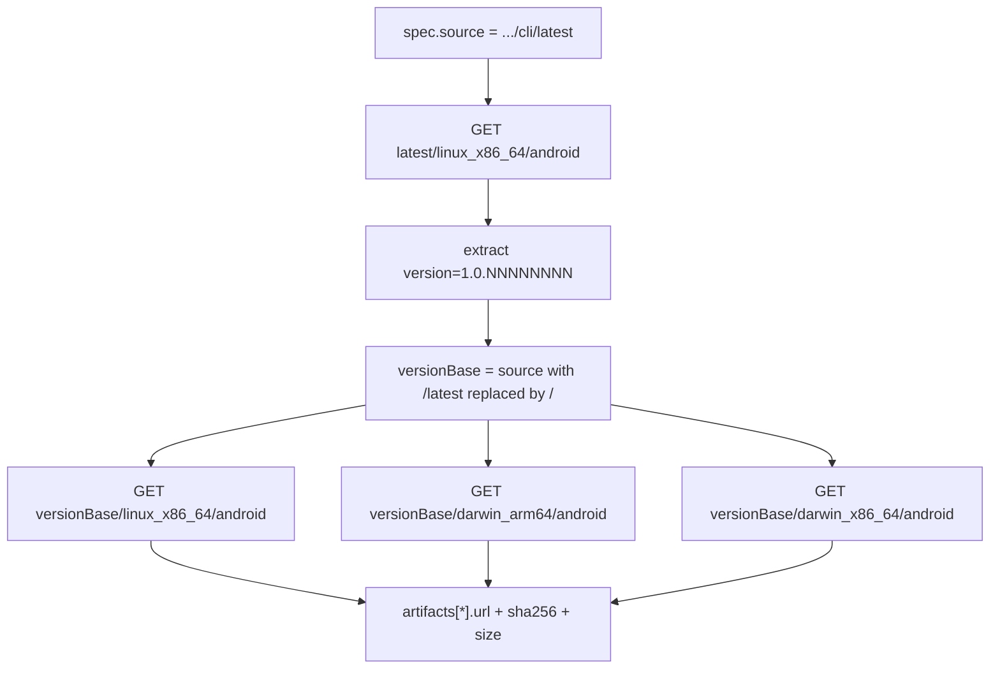

# Android CLI Version-Pinned Lock URLs - Plan

## Goal Capsule

- **Objective:** A host that already downloaded an older Android CLI build still applies its dotfiles successfully after the release lock moves to a newer build.
- **Means:** Record immutable per-version artifact URLs for the `android` lock entry instead of the moving `latest` URL (KTD1).
- **Authority:** GitHub issue [#367](https://github.com/hyperlapse122/dotfiles/issues/367) states the problem, the evidence, and the acceptance criteria. `AGENTS.md` owns the release-lock rules: the lock is machine-generated and MUST NOT be hand-edited.
- **Execution profile:** One resolver function, its tests, one generated lock entry, one documentation line.
- **Stop conditions:** Stop and report if the version-pinned path stops serving the current release, or if a full lock refresh moves entries other than `android` (see U2).
- **Tail ownership:** `ce-work` implements and verifies locally; the calling pipeline owns commit, PR, and CI.

---

## Product Contract

### Summary

`resolveAndroidCli` keeps probing `https://dl.google.com/android/cli/latest` to discover the current version, then records `https://dl.google.com/android/cli/<version>/<platform>/android` in the lock's `artifacts[*].url`, with each digest taken from the version-pinned response body. Every URL the lock hands to chezmoi then addresses immutable bytes, so a cached body and a locked digest can no longer disagree.

### Problem Frame

`android` is the only lock entry whose artifact URL carries no version segment. Its bytes change under a stable URL. chezmoi caches an external body by URL in `~/.cache/chezmoi/httpcache`, so once Google publishes a new build and the lock records the new digest, a host holding the previous body fails `chezmoi apply` with a SHA256 mismatch on every run, permanently — the cache does not self-heal, and the only recoveries are `chezmoi apply -R` or deleting the cache entry by hand. The failure was observed on 2026-09-03 with a body cached on 2026-09-01 from release `1.0.15985488`.

### Requirements

**Lock content**

- R1. The `android` lock entry records a version-pinned artifact URL for each of `linux-amd64`, `linux-arm64`, `darwin-amd64`, and `darwin-arm64`.
- R2. Each recorded `sha256` and `size` is computed from the body served by that same recorded URL.
- R3. `linux-arm64` keeps pointing at the `linux_x86_64` artifact and keeps `emulated: true`.
- R4. The lock entry's `source` field stays the registry spec source (`https://dl.google.com/android/cli/latest`), which is provenance and not a fetch target.

**Resolution behavior**

- R5. Version discovery still reads the `latest` linux binary and extracts the version from its body.
- R6. A resolver run whose version-pinned URL cannot be fetched raises `ResolutionError` naming the failing URL, so the refresh fails loudly instead of recording an unreachable URL.
- R7. A spec source that does not end in `/latest` raises `ResolutionError` instead of producing a moving URL.
- R9. A version string extracted from the binary that is not a well-formed version segment raises `ResolutionError` naming the rejected value, so a degenerate value cannot normalize the version segment out of the recorded URL.

**Consumers**

- R8. `.chezmoiexternals/dev-tools.toml` and `.chezmoiscripts/00-tools/run_onchange_after_android-sdk.sh.tmpl` need no edit; they read `url`, `sha256`, and `version` through `.chezmoitemplates/release-lock-ref.tmpl`.

### Success Criteria

- A rendered `.chezmoiexternals/dev-tools.toml` shows the `android` external `url` carrying the version segment.
- A host that failed with the SHA256 mismatch reported in issue #367 applies cleanly without cache surgery, because the new URL was never cached.

### Scope Boundaries

- The other five `vendorManifest` vendors keep their current URL shapes; this plan changes only `android`, the one entry that today resolves to a version-less moving URL.
- The chezmoi HTTP cache itself is not touched. The fix removes the condition that poisons it; it does not add cache invalidation.
- No new registry entries, no platform-key changes, no `emulatedPlatforms` changes.

### Sources

- Issue [#367](https://github.com/hyperlapse122/dotfiles/issues/367) — failure evidence, the `max-age=0` versus `max-age=86400` cache-control contrast, and byte parity between `latest` and `1.0.16251017` — by digest for the two linux and darwin-arm64 binaries, by size only for `darwin_x86_64`.
- `packages/release-lock/src/vendor-manifest.ts:321-368` — `resolveAndroidCli` as it stands.
- `packages/release-lock/test/vendor-manifest.test.ts:391-464` — the existing android tests and the prefix-routed `stubRoutes` fetch stub.
- `packages/release-lock/src/registry.ts:195-200` — the `android` spec, `source` and `emulatedPlatforms`.
- `packages/release-lock/src/vendor-manifest.ts:59-91` — `resolveClaude`, the in-repo precedent for probing `latest` for a version and recording version-pinned artifact URLs.
- `packages/release-lock/src/cli.ts:59-61` — the overlay base is read from the output path, which is why KTD4 inspects with `--stdout`.
- `AGENTS.md` — the release-lock section: machine-generated lock, no hand edits, `refresh-release-lock.yml` overlay semantics, `.ci/check-release-lock-digests.sh`.

---

## Planning Contract

### Key Technical Decisions

- KTD1. **Record the version path; keep `latest` for discovery only.** `spec.source` ends in `/latest`, so the resolved version replaces that final segment. `latest` remains the only way to learn which version is current. Governs R1, R5.
- KTD2. **Take digests from the version-pinned body, not from the `latest` body.** After the version is known, fetch each platform binary from the version path and hash what that URL served. This is one extra download per refresh and makes the recorded digest provably the digest of the recorded URL. Chosen over reusing the `latest` digests on assumed byte parity, which would record a digest for bytes never fetched at that URL and would still be wrong if `latest` rotated mid-run. Governs R2, R6.
- KTD3. **Fail hard on an unexpected input shape, on both sides.** A `spec.source` without a trailing `/latest` segment raises `ResolutionError` rather than falling back to the `latest`-shaped URLs. The version lifted out of the downloaded binary is network-derived and gets the same treatment: it must match `^[0-9]+(\.[0-9]+)*$` before it becomes a path segment. A silent fallback on either side would reintroduce the exact defect this change removes. Governs R7, R9.
- KTD4. **Adopt a refreshed lock only when the refresh diff is `android`-only.** `cli.ts` resolves every registered tool, so a local refresh can drag unrelated version bumps into this change. Inspect the resolution with `--stdout`, diff it, and adopt only an `android`-only diff; otherwise leave the committed lock to `.github/workflows/refresh-release-lock.yml`, which re-resolves hourly on the default branch. `--stdout` is what makes the diff meaningful: `cli.ts` overlays its resolution onto the lock read from the output path, so `--stdout` overlays onto the committed lock and a source that fails to resolve keeps its committed entry instead of vanishing. Chosen over `--out <temp path>`, which reads an absent lock as empty and renders every unresolved tool as a deletion. This keeps the lock machine-generated, as `AGENTS.md` requires, and keeps the change scoped.

### High-Level Technical Design

The linux binary is fetched twice by design: once from `latest` to learn the version, once from the version path to produce the recorded digest. That second fetch is what makes R2 true.

### Assumptions

- The per-version path is retained rather than rotated. Issue #367 confirmed `1.0.15985488` is still retrievable after `1.0.16251017` shipped. If that ever breaks, the failure mode changes shape: a host on a pruned version path fails to download rather than failing a digest check, and recovers by pulling the lock `refresh-release-lock.yml` has already moved forward — unlike the current defect, which no lock update can clear.
- The version string extracted from the binary (`version=([0-9.]+)`) is exactly the path segment Google uses. Verified for `1.0.16251017` and `1.0.15985488` in issue #367.
- `dl.google.com` is reachable from the implementing environment, so U2 can attempt a real refresh. Verified during planning.

### Sequencing

U1 first — it defines the resolver behavior. U2 depends on U1 being merged into the working tree, because it runs the changed resolver. U3 is independent of both and can land in any order.

---

## Implementation Units

### U1. Version-pinned URL resolution in `resolveAndroidCli`

- **Requirements:** R1, R2, R3, R5, R6, R7, R9 (per KTD1, KTD2, KTD3)
- **Files:**
  - `packages/release-lock/src/vendor-manifest.ts` — `resolveAndroidCli`
  - `packages/release-lock/test/vendor-manifest.test.ts` — the `resolveVendorManifest android` describe block
- **Approach:** Derive the version base by replacing the trailing `/latest` segment of the trimmed `spec.source`; raise `ResolutionError` when that segment is absent, and again when the extracted version is not a well-formed version segment (KTD3). Fetch only `latest/linux_x86_64/android` for version discovery, then fetch the three platform binaries from the version base and build `artifacts` from those responses (KTD2). Keep the existing `ResolutionError` messages for the fetch failure and the version-extraction failure. Keep `linux-arm64` mirroring the linux amd64 artifact with `emulated: true`. `resolveClaude` in the same file is the established shape for this — it reads `<source>/latest` for an id, then builds `<source>/<id>/<platform>/<binary>` URLs — so follow it rather than inventing a new one.
- **Test Scenarios:**
  - Happy path: with distinct bodies stubbed for the `latest` linux URL and each version-path URL, all four artifact URLs carry the version segment, and every `sha256`/`size` matches the version-path body — not the `latest` body.
  - Happy path: `locked.version` is still the version parsed from the `latest` linux body, and `locked.source` is unchanged.
  - Happy path: `linux-arm64` shares the `linux_x86_64` version-path URL and digest, and carries `emulated: true`.
  - Edge case: the recorded request log shows the `latest` URL fetched for discovery, and no darwin fetch against `latest`.
  - Error path: a version-path URL returning 404 raises `ResolutionError` naming the version-path URL.
  - Error path: the `latest` linux URL returning 404 raises `ResolutionError` naming the source (existing test, kept).
  - Error path: a `latest` body with no `version=` match raises `ResolutionError` containing "could not extract version" (existing test, kept).
  - Error path: a spec whose `source` is `https://dl.google.com/android/cli` (no `/latest`) raises `ResolutionError`.
  - Error path: a `latest` body whose `version=` match is not a well-formed version segment raises `ResolutionError` naming the rejected value.
- **Verification:** From `packages/`: `vp run -r typecheck` and `vp run -r test` pass; the android describe block is green.

### U2. Refresh the `android` lock entry

- **Requirements:** R1, R2, R4 (per KTD4)
- **Files:** `.chezmoidata/releases.json` (generated; never hand-edited)
- **Approach:** Inspect the resolution with `CHEZMOI_GITHUB_ACCESS_TOKEN="$(gh auth token)" bun run packages/release-lock/src/cli.ts --stdout > "$tmp"` — the token rides that one invocation rather than the environment, matching the per-invocation pattern in `dot_config/zsh/dot_zshrc`, and `--stdout` overlays onto the committed lock so an unresolved source keeps its committed entry (KTD4). A non-zero exit means a partial resolution: do not adopt. Otherwise diff `$tmp` against the committed lock and adopt it only when the diff touches `releases.tools.android` alone — a concurrent upstream version bump is still an `android`-only diff. When any other entry moved, discard it, leave `.chezmoidata/releases.json` untouched, and record in the handoff that `refresh-release-lock.yml` will carry the lock forward on the default branch. Never hand-edit an entry either way.
- **Test Scenarios:** Test expectation: none -- this unit regenerates a machine-produced data file and adds no behavior; U1's tests own the resolver behavior and the gate below owns the file's shape.
- **Verification:** `.ci/check-release-lock-digests.sh` passes. When the lock is adopted, every `android` artifact URL carries the entry's own recorded `version` as a path segment, and each recorded `sha256` and `size` matches a fresh fetch of that same recorded URL.

### U3. Document the android URL shape

- **Requirements:** R4, R8
- **Files:** `AGENTS.md` — the release-lock paragraph that already records `onePassword`'s null digest and `antigravity`'s sha512-only quirk
- **Approach:** Add one sentence stating that `android` records version-pinned artifact URLs while its spec `source` stays the `latest` path, and why: a moving URL lets a chezmoi HTTP cache entry outlive the digest locked beside it. While in that paragraph, scope its "the refresh never downloads an artifact to hash it" claim to the GitHub-release path it describes — the `android` resolver has always downloaded its binaries, and this change adds one more such fetch. Match the surrounding prose style.
- **Test Scenarios:** Test expectation: none -- documentation only.
- **Verification:** The new sentence appears in the release-lock paragraph of the repository-root `AGENTS.md`, confirmed by diff review. No CI gate covers that file: `.ci/test-agent-instructions.sh` gates the rendered user-scoped instruction core, not this one.

---

## Verification Contract

| Gate | Command | Applies to |
| --- | --- | --- |
| TypeScript workspace | from `packages/`: `vp install --frozen-lockfile`, `vp run -r build`, `vp run -r typecheck`, `vp run -r test`, `vp check` | U1 |
| Lock digest gate | `.ci/check-release-lock-digests.sh` | U2 |
| Documentation | The release-lock paragraph of the repository-root `AGENTS.md` carries the new sentence, confirmed by diff review; no CI gate covers that file | U3 |
| Consumer render (adopt branch) | `chezmoi --source "$PWD" --config <empty.toml> execute-template < .chezmoiexternals/dev-tools.toml` shows the `android` `url` carrying the version segment | U2, when the lock was adopted |
| Lock untouched (discard branch) | `git diff --quiet -- .chezmoidata/releases.json`, and the handoff records that `refresh-release-lock.yml` carries the lock forward on the default branch | U2, when the refresh was discarded |
| Working tree | `git diff --check` clean; the diff stays within the four files named above | all |

The issue's third acceptance criterion — `chezmoi apply` succeeding against a cache primed with a superseded `latest` body — is a host-level check and is out of scope for repository verification, which never deploys the live `$HOME`. The consumer-render gate is the repository-side proof: chezmoi keys its HTTP cache by URL, so a version-pinned URL cannot collide with the cached `latest` body that caused the failure.

---

## Definition of Done

- R1 through R9 hold.
- U1's tests cover every scenario listed for it, and the full `packages/` gate set passes.
- The `android` lock entry either carries version-pinned URLs (U2 adopted the refresh) or is explicitly reported as left to `refresh-release-lock.yml`, with the reason.
- `AGENTS.md` records the version-pinned URL shape.
- No exploratory or abandoned code remains in the diff; the change is confined to `packages/release-lock/src/vendor-manifest.ts`, `packages/release-lock/test/vendor-manifest.test.ts`, `AGENTS.md`, and — conditionally — `.chezmoidata/releases.json`.
