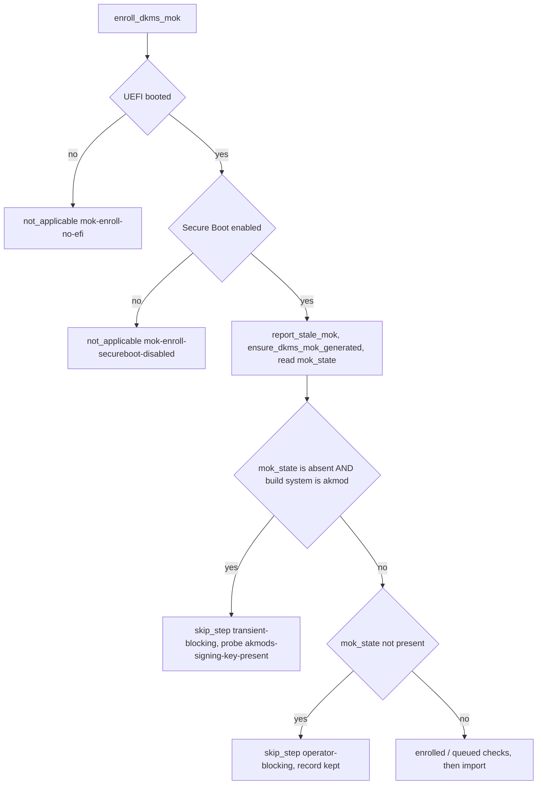

# NVIDIA MOK Enrollment Skip Classification and Audit Anchor Accuracy - Plan

## Goal Capsule

- **Objective:** an operator whose NVIDIA module-signing key could not be created sees the host reported as outstanding by `dotfiles-skips`, instead of being told the work does not apply to the host — and the skip audit matrix's recorded evidence agrees with the source it cites.
- **Means:** split the enrollment keypair guard by build system so each half declares its own honest direction (KTD1, KTD2), and re-read the `anchor_line` of every matrix row whose recorded `anchor` describes current source (KTD3).
- **Authority:** GitHub issues #376 and #377; the skip-direction contract in `AGENTS.md` and `.chezmoitemplates/skip.sh.tmpl`. Where they disagree, `skip.sh.tmpl` is the runtime contract and wins.
- **Execution profile:** source-state edits plus local CI gate scripts. No `chezmoi apply` against a live `$HOME`, and no live host is provisioned by this change.
- **Stop conditions:** stop and report if `.ci/check-skip-declarations.sh` cannot reconcile the new sentinels after two corrective passes; if a counter move requires touching `totals` buckets this plan does not name; or if the DKMS half turns out to need a capability probe after all (that reopens KTD2 and adds a new reviewed probe *kind* to `.install-prerequisites.sh`, which is a scope change).
- **Tail ownership:** the invoking pipeline owns commit, push, PR, and the `ci.yml` / `render-dotfiles.yml` watch.

---

## Product Contract

### Summary

Two defects in the NVIDIA Secure Boot MOK path, both low severity and both reporting-only. `install-nvidia-fedora/mok-enroll-no-keypair` declares `not_applicable` on a branch that is reachable only on a fully eligible host, and `not_applicable` deletes its own state record — so a host with no enrollable signing key reports nothing at all. Separately, two rows in the CI audit matrix carry an `anchor_line` that no longer holds the `anchor` text recorded beside it, because a later commit in the same run shifted the source by 25 lines — and this change's own edit shifts two more rows that are accurate today.

### Problem Frame

`enroll_dkms_mok` returns early on four conditions. The first two — not UEFI-booted, Secure Boot disabled — are honest `not_applicable` opt-outs and return before anything else. The third is `[[ "${mok_state}" != present ]]`, and by the time control reaches it the host has already passed both honest opt-outs: it is UEFI-booted, Secure Boot is enabled, and a driver branch resolved. Reaching it means `ensure_dkms_mok_generated` could not produce the keypair, or `dkms_mok_state` could not read it. That is an unconverged host, not one the work does not apply to — and because `not_applicable` `rm -f`s its own record (`.chezmoitemplates/skip.sh.tmpl`), the host is silent while its module cannot be trusted by firmware.

The condition is not one thing. When the probe positively answers `absent` on the `akmod` build system it is a wait the builder clears by itself the moment `kmodgenca` mints its key, and the `akmods-signing-key-present` probe already describes it. On the DKMS build system, on a `partial` keypair, and whenever the privileged probe could not be read at all, reaching this branch means the mint or the probe failed outright, and nothing in the repository will clear it without an operator. One site cannot honestly declare both.

The record-deletion silence is a DKMS-branch outcome. An akmod host with no key was already reported, by the generate-time `mok-generate-awaiting-builder` record that the `not_applicable` `rm -f` does not touch — so the akmod half of this change removes a dishonest `not applicable` on an eligible host rather than restoring a missing report.

The audit-matrix defect is narrower. `anchor`/`anchor_line` pairs are pre-conversion snapshots by design and no CI gate validates the line number, so 123 of the 135 owner rows carry a line that has since moved. The two rows in #377 are different: their `anchor` text was deliberately rewritten to the current source (5213209, 7b1044f), which makes the pair a claim about the code as it is now, and then da6a52d shifted the source without them being re-read.

### Requirements

**Skip classification (#376)**

- R1. A host that is UEFI-booted with Secure Boot enabled and reaches MOK enrollment with no readable signing keypair is not reported as `not applicable`, and keeps a state record that `dotfiles-skips` lists.
- R2. On the `akmod` build system, and only when `dkms_mok_state` positively answered `absent`, the condition is declared `skip_step` with direction `transient-blocking` naming `akmods-signing-key-present`, so `prune_stale_skip_records` retires its record once the key appears and the changed fingerprint re-runs the script.
- R3. Every other reachable state takes `skip_step` with direction `operator-blocking`: any other build system, a `partial` keypair, and — on any build system, `akmod` included — a `dkms_mok_state` that could not be read at all. It keeps its record, names both causes and both by-hand mints, and names the `chezmoi state delete-bucket --bucket=scriptState` re-run. `unreadable` never takes the akmod branch: a probe that could not look is not a key that is merely absent, which is the conflation `dkms_mok_state` exists to refuse.
- R4. Control flow is unchanged. Both declarations abandon the enrollment step with `return 0`, `main` continues, and no later phase is stranded.

**Audit matrix accuracy (#377)**

- R5. Every matrix row whose recorded `anchor` describes current source records the line that anchor actually occupies once this change lands: `install-nvidia-fedora/mok-generate-awaiting-builder`, plus `mok-already-enrolled` and `mok-already-queued`, which hold their anchors today and are pushed down by the U1 edit above them.
- R6. The matrix header states the `anchor_line` maintenance rule in words, so the next editor does not have to infer it: a row whose `anchor` still describes current source is a live claim whose line is re-read whenever an edit moves it, every other row is a pre-conversion snapshot that is left alone, CI validates neither, and the two are not distinguishable from the row alone.
- R7. Every counter the changed rows feed moves with them — `audited_forms`, `audited_directions`, `audited_scopes`, `totals`, the affected `divergence` entries — and the frozen totals in `.ci/check-skip-declarations.sh` and `.ci/test-capability-cache.sh` are re-frozen in the same change.

### Key Decisions

- KD1. **Ship both issues as one change.** Governs R1–R7. `mok-enroll-no-keypair` is one of the two rows #377 names, and #376 rewrites that row wholesale. Landing them separately would mean re-editing the same row twice.

### Scope Boundaries

- The 121 other rows whose `anchor_line` has drifted are left alone. They are pre-conversion snapshots the header already describes as such, and refreshing them is a different change from correcting a row that claims to describe current source (KTD3).
- No CI gate is added for `anchor_line`. See KTD3.
- No new entry is added to `.chezmoidata/.capability-registry.tsv`, and no new probe kind is added to `.install-prerequisites.sh`. See KTD2.
- The generate-time and enroll-time split of the akmod wait is not restructured; the second record it produces is accepted (A1).
- `mok-enroll-no-passphrase` and `mok-enroll-passphrase-untypeable` keep their `harmless` direction. They are a second way an eligible host ends up with an untrusted module, and R1's guarantee covers only the no-keypair condition.
- No live `chezmoi apply`, and no change to the enrollment mechanism itself (`mokutil --import`, the `expect` path, the passphrase handling).

### Deferred to Follow-Up Work

- A reviewed two-path probe kind that observes `/var/lib/dkms/mok.pub` and `/var/lib/dkms/mok.key` together, which would let the DKMS half take `transient-blocking` and self-heal. KTD2 explains why it is not in this change.
- A per-row marker distinguishing a live-claim `anchor` from a pre-conversion snapshot, so the rule R6 writes into the header becomes machine-checkable. `.ci/test-capability-cache.sh` rejects unknown row fields, so this needs the gate's field allowlist extended as well.
- A success-path declaration that clears the `mok-enroll-no-keypair` record once a DKMS host converges. Nothing retires an `operator-blocking` record today (A5).

### Sources

- `https://github.com/hyperlapse122/dotfiles/issues/376` — the misclassified enrollment guard.
- `https://github.com/hyperlapse122/dotfiles/issues/377` — the two stale `anchor_line` values.
- `.chezmoitemplates/skip.sh.tmpl` — form and direction vocabulary, the record-writing behaviour of each direction, and the render-time gates.
- `AGENTS.md` — the four skip directions and the "a probe that COULD exist is a probe to add" rule.
- `docs/solutions/integration-issues/fedora-akmods-builder-missing-nvidia-mok-deadlock.md` — the akmods branch history this change sits on top of.

---

## Planning Contract

### Key Technical Decisions

- KTD1. **Split the enrollment keypair guard by build system rather than reclassifying the single site.** Governs R2, R3. The issue's option 2 (one site, `operator-blocking`) is rejected: on the akmod branch, when the probe answers `absent`, the condition self-heals once the builder mints its key, and `prune_stale_skip_records` never touches an `operator-blocking` record, so an akmod host that later converged would report an outstanding skip forever — the same class of defect 9e15bef (`fix(skips): retire records whose condition cleared`) was written to remove. That self-healing depends on the `akmods-signing-key-present` probe actually flipping, which A4 records as an assumption rather than a fact. Option 3 (leave it) is rejected because it is the defect the issue reports.
- KTD2. **The DKMS half takes `operator-blocking`, and the probe kind that could serve it is deferred.** Governs R3. File mode is not the obstacle — `dkms_mok_state` tests existence (`[ -f ]`) rather than reading content, and `.install-prerequisites.sh` resolves `absolute-file` as an unprivileged `[[ -f "$path" ]]`, so 0600 on `/var/lib/dkms/mok.key` would not hide it. The obstacle is the registry's shape: every probe kind binds exactly **one** reviewed path per key, and `dkms_mok_state` calls the host `present` only when **both** `mok.pub` and `mok.key` exist. A `.pub`-only probe would read `available` on the `partial` keypair that `ensure_dkms_mok_generated` explicitly refuses to regenerate, retiring the record while the host is still broken — so the pair needs a new reviewed *kind* in `.install-prerequisites.sh`, not a new registry row. That hook runs before the source state and its kind list is reviewed shell, which puts it outside this change; `AGENTS.md`'s rule that a probe which could exist is a probe to add is honored by scheduling it as deferred follow-up work, not by shipping a probe this repository has no kind for. Until then `operator-blocking` is the honest direction: it claims no convergence, keeps the record, and names the operator action. Consequence: no registry entry, so `totals` moves only by the one added owner.
- KTD3. **`anchor_line` stays a snapshot, and the header says so.** Governs R5, R6. A sweep of the matrix found 123 of 135 rows whose recorded line no longer holds their recorded anchor, which is exactly what the header's "anchors are PRE-CONVERSION snapshots" already asserts. Only the rows whose `anchor` already describes current source are corrected, because those rows alone claim to describe the code as it is now — the two that #377 names, plus the two this change's own edit pushes down. Adding a CI gate on the field is rejected: it would fail on 123 rows, and re-reading all of them would destroy the pre-conversion evidence the freeze exists to hold. The gate scripts already call `anchor`/`anchor_line` "the RAW pre-conversion snapshot (evidence)" and guard named rows against having that raw shape overwritten, so the field is deliberately unvalidated. What forces an anchor to be rewritten at all is `predicate`, which CI does check against the rendered branch: when the code changes, the anchor text must follow it, and the line number is then the only half left free to drift.
- KTD4. **Two sibling `if` branches, not one nested branch.** Governs R2, R3, R4. `.ci/check-skip-declarations.sh` requires the generated `# skip-declaration-v1` sentinel to be the first line of the branch it declares. A nested shape would put the outer declaration after the inner `if`, so the outer sentinel would no longer open its branch. Two siblings each carry their own predicate and keep the checker's branch derivation intact.

### High-Level Technical Design

Directional only — the implementer owns the exact shell.

Control flow through `enroll_dkms_mok` after the change:



Call-site shape, replacing the current single subshell block at `.chezmoiscripts/30-components/run_onchange_before_10-nvidia.sh.tmpl:475`:

```bash
  if [[ "${mok_state}" == absent && "$nvidia_build_system" == 'akmod' ]]; then
    # skip_step / transient-blocking / akmods-signing-key-present
    # the partial emits `return 0`, so no ( ... ) wrapper
  fi
  if [[ "${mok_state}" != present ]]; then
    # skip_step / operator-blocking / no probe
    # catches DKMS, `partial` on any branch, and `unreadable` on any branch
  fi
```

`== absent` rather than `!= present` is load-bearing on the first branch. `mok_state` carries four values — `present`, `partial`, `absent`, and `unreadable` when `dkms_mok_state` could not run at all — and only `absent` is the self-healing wait. Routing `unreadable` into a probe-backed record would let `prune_stale_skip_records` retire it the moment the unprivileged probe reads available, on a host whose privileged probe never answered: the same conflation of cannot-look with not-there that the comment above this guard says `dkms_mok_state` exists to refuse. `partial` falls through for the same reason — `ensure_dkms_mok_generated` refuses to regenerate it and prints a manual-removal instruction, which is an operator action.

The subshell that the current site wraps around its declaration exists only because `not_applicable` emits `exit 0`. `skip_step` emits `return 0`, so both new branches drop the wrapper and the trailing bare `return 0` that followed it — which is also what keeps the recorded `continuation: abandon-step-return-0` and its digest unchanged for the surviving row.

Counter movement, all of it mechanical and all of it in one commit:

| Field | Location | From | To |
|---|---|---|---|
| `totals.classified_owners` | matrix | 135 | 136 |
| `totals.rendered_instances` | matrix | 204 | 205 |
| `totals.phase_local_instances` | matrix | 130 | 131 |
| `audited_forms.not_applicable` | matrix | 20 | 19 |
| `audited_forms.skip_step` | matrix | 39 | 41 |
| `audited_directions.transient-blocking` | matrix | 61 | 62 |
| `audited_directions.operator-blocking` | matrix | 3 | 4 |
| `audited_scopes.30-components` | matrix | 20 | 21 |
| `divergence[not_applicable].audited` | matrix | 20 | 19 |
| `divergence[transient_blocking].audited` | matrix | 61 | 62 |
| `divergence[scope:20-linux-fedora].audited` | matrix | 25 | 26 |
| `FROZEN` | `.ci/check-skip-declarations.sh:197` | 135 / 204 / 130 | 136 / 205 / 131 |
| `frozen` | `.ci/test-capability-cache.sh:106` | 135 / 204 / 130 | 136 / 205 / 131 |

`audited_buckets` in `.ci/test-capability-cache.sh` reconciles only `harmless`, `transient_blocking`, `done_here`, `not_applicable`, `hard_error_owners`, and the `scope:*` buckets against `plan_contract`. `skip_step` and `operator-blocking` have no `plan_contract` counterpart, so they need no `divergence` entry; adding one would fail the "divergence names unknown bucket" check. `scope:20-linux-fedora` is the sum of `20-base` and `30-components`, which is why the scope bucket moves with the single added `30-components` owner.

### Assumptions

- A1. `report_awaiting_builder_key` always returns success, so on an akmod host with no key the generate-time wait (`mok-generate-awaiting-builder`) always fires before enrollment is reached. The new enrollment-time akmod declaration is therefore a second record describing the same condition. Both are `transient-blocking` on the same probe and retire together, so the redundancy is accepted rather than restructuring the generate/enroll split.
- A2. The CI gate scripts run on this workstation without a live apply, given `chezmoi` on `PATH` and a writable `$HOME/.cache`. If a gate cannot run locally, fall back to the `ci.yml` and `render-dotfiles.yml` results and say so.
- A3. Nothing outside `.chezmoiscripts/30-components/run_onchange_before_10-nvidia.sh.tmpl` and `.ci/skip-declaration-site-matrix.yaml` names `mok-enroll-no-keypair`; a repository-wide grep confirmed this at plan time. Re-confirm before renaming anything.
- A4. The akmod half self-heals only if `akmods-signing-key-present` can read `available` once the key is minted. `.install-prerequisites.sh` resolves it unprivileged as `[[ -f /etc/pki/akmods/certs/public_key.der ]]`, while `docs/solutions/integration-issues/fedora-akmods-builder-missing-nvidia-mok-deadlock.md` records that directory as `drwxr-x---. root akmods`, and nothing here adds the applying user to that group. This is a pre-existing property of the probe that `mok-generate-awaiting-builder` already depends on, so it is assumed rather than fixed here — but U1 resolves the probe and records the verdict, and a negative verdict is a Stop condition, because it would mean the split buys no self-healing.
- A5. The DKMS `operator-blocking` record is never retired, even after the host converges: `prune_stale_skip_records` skips the direction by contract and no success path emits a clearing declaration for the same `script`/`site` pair. Accepted here and scheduled as deferred follow-up work; the alternative — a clearing declaration on the converged path — is another owner row and another set of counter moves.

### Sequencing

U1 must land before U2 and U4: both read line numbers and predicate text out of the post-U1 source. U3 may be done alongside U2. U4 is last so the awaiting-builder line is read from the final source.

---

## Implementation Units

### U1. Split the enrollment keypair guard by build system

- **Requirements:** R1, R2, R3, R4 (per KTD1, KTD2, KTD4; assumptions A4, A5).
- **Files:** `.chezmoiscripts/30-components/run_onchange_before_10-nvidia.sh.tmpl`
- **Approach:** replace the single `if [[ "${mok_state}" != present ]]` block — subshell, `not_applicable` declaration, `return 0` — with the two sibling branches sketched in High-Level Technical Design. The akmod branch guards on `[[ "${mok_state}" == absent && "$nvidia_build_system" == 'akmod' ]]` and declares `form: skip_step`, `direction: transient-blocking`, `probe: akmods-signing-key-present`, `site: mok-enroll-awaiting-builder-key`. The second branch keeps the existing predicate and `site: mok-enroll-no-keypair`, and declares `form: skip_step`, `direction: operator-blocking`, no `probe` (the partial fails the render if a non-`transient-blocking` site names one). Keep the existing block comment above the branch — it records why `dkms_mok_state` is the whole answer — and extend it with two sentences: why the guard now branches on the build system, and why the akmod half tests `== absent` rather than `!= present`. `reason` strings must match `^[A-Za-z0-9 ._,;:()/=+-]+$`; the operator-blocking reason names **both** causes (the keypair could not be minted, or the privileged probe could not be run) and both by-hand mints (`sudo /usr/lib/dkms/mok_signing_setup` for DKMS, `sudo kmodgenca -a` for akmods, since `partial` and `unreadable` reach this branch on either build system), and the partial appends the re-run instruction itself, so do not restate it.
- **Test Scenarios:**
  - Render the template with the AGENTS.md scratch stub. Both branches appear, each opening with its own `# skip-declaration-v1` sentinel line.
  - The akmod sentinel reads `form=skip_step direction=transient-blocking probe=akmods-signing-key-present fingerprint=required exit=return-0`.
  - The no-keypair sentinel reads `form=skip_step direction=operator-blocking probe=none fingerprint=none exit=return-0`.
  - The rendered akmod branch writes `transient-blocking:akmods-signing-key-present` into `.../chezmoi/skips/install-nvidia-fedora__mok-enroll-awaiting-builder-key`; the rendered no-keypair branch writes `operator-blocking` into `install-nvidia-fedora__mok-enroll-no-keypair`. Neither emits `rm -f`.
  - No `(` subshell wrapper and no trailing bare `return 0` survives on either branch; `grep -c 'return 0'` inside `enroll_dkms_mok` accounts for every occurrence.
  - The akmod branch's rendered predicate tests `== absent`, so a host whose `mok_state` is `unreadable` or `partial` falls through to the operator-blocking branch on every build system.
  - Resolve `akmods-signing-key-present` the way `.install-prerequisites.sh` does — `[[ -f /etc/pki/akmods/certs/public_key.der ]]` as the applying user — on a host where the certificate exists, and record the verdict. `unavailable` there means the akmod half never self-heals, which is a Stop condition per A4, not something to work around.
  - Error path: temporarily passing `probe` to the operator-blocking call fails the render with skip.sh.tmpl's "Only transient-blocking consumes a probe" message. Revert after confirming.
- **Verification:** `chezmoi --config <scratch>/empty.toml --source "$PWD" --destination <scratch>/target execute-template < .chezmoiscripts/30-components/run_onchange_before_10-nvidia.sh.tmpl`, then read the rendered `enroll_dkms_mok`.

### U2. Re-record the two enrollment rows in the audit matrix

- **Requirements:** R2, R3, R7.
- **Files:** `.ci/skip-declaration-site-matrix.yaml`
- **Approach:** rewrite the `install-nvidia-fedora/mok-enroll-no-keypair` row to `form: skip_step`, `direction: operator-blocking`, no `probe`, no `fingerprint_placement`, with `anchor`, `anchor_line`, `predicate` and `predicate_digest` read out of the post-U1 source. Add a new `install-nvidia-fedora/mok-enroll-awaiting-builder-key` row beside it with `fingerprint_placement` matching how the akmod probe's fingerprint block is already carried for `mok-generate-awaiting-builder`, and one `instances:` entry naming the same template. `predicate` is the anchor line normalized by `normalize_predicate` in `.ci/check-skip-declarations.sh` — leading `if`/`elif`, trailing `; then` and continuations removed, whitespace collapsed — and `predicate_digest` is `sha256:` plus the SHA-256 of that exact string; compute both rather than hand-writing them. `continuation` stays `abandon-step-return-0` with its existing digest for both rows. The new row's `anchor` and `predicate` contain single quotes around `akmod`; double them inside the matrix's single-quoted YAML scalars or the file will not parse.
- **Test Scenarios:**
  - The no-keypair row's `predicate` is unchanged (`[[ "${mok_state}" != present ]]`), so its `predicate_digest` is byte-identical to the current value; a changed digest means the predicate was edited by accident.
  - The new row's recomputed `predicate_digest` matches the digest the checker derives from the rendered branch.
  - Both rows' `anchor_line` holds their recorded `anchor` in the post-U1 file.
  - Each row declares exactly one instance, and the instance names its owner after `#`.
  - Error path: the checker rejects a row whose `predicate` is not in normal form; confirm the recorded values pass `normalize_predicate` unchanged.
- **Verification:** `.ci/check-skip-declarations.sh`

### U3. Move the counters and re-freeze the totals

- **Requirements:** R7.
- **Files:** `.ci/skip-declaration-site-matrix.yaml`, `.ci/check-skip-declarations.sh`, `.ci/test-capability-cache.sh`
- **Approach:** apply every row of the counter-movement table in High-Level Technical Design. Extend the reason text of the three touched `divergence` entries to name this move — the `not_applicable` entry says the enrollment guard left the bucket because the branch it guards is reachable only on an eligible host; the `transient_blocking` entry says the akmod half joined it behind the existing `akmods-signing-key-present` probe; the `scope:20-linux-fedora` entry says the split added one `30-components` owner. Also restate the header paragraph that still cites the superseded frozen totals ("131 owners, 8 hard errors, 200 instances, 126 + 74") so the prose matches the `totals:` block it describes.
- **Test Scenarios:**
  - `audited_forms`, `audited_directions` and `audited_scopes` each equal the counts recomputed from the rows.
  - `totals` matches the frozen dicts in both CI scripts; a mismatch in either script is reported by name.
  - Every bucket that differs from `plan_contract` carries a `divergence` entry with the same two numbers, and no bucket that now matches still carries one.
  - No `divergence` entry is added for `skip_step` or `operator-blocking`; adding one trips "divergence names unknown bucket".
  - Error path: revert one counter and confirm `.ci/test-capability-cache.sh` names the specific bucket before restoring it.
- **Verification:** `.ci/test-capability-cache.sh`

### U4. Refresh the live-claim anchor lines and state the field's rule

- **Requirements:** R5, R6 (per KTD3).
- **Files:** `.ci/skip-declaration-site-matrix.yaml`
- **Approach:** set `install-nvidia-fedora/mok-generate-awaiting-builder`'s `anchor_line` to the line its recorded `anchor` occupies in the final source (416 before U1; it sits above U1's edit, so confirm rather than assume it moved). Then refresh `install-nvidia-fedora/mok-already-enrolled` and `install-nvidia-fedora/mok-already-queued` the same way: their anchors already describe current source at 481 and 489, and U1's edit above them pushes both down, so leaving them would recreate the exact drift #377 reports. Then extend the header's `FIELDS.` paragraph with the maintenance rule, worded around the two populations rather than around one event: a row whose `anchor` still describes current source is a **live claim**, and its `anchor_line` is re-read whenever an edit moves that line — including an edit that only rewrites the `anchor` because `predicate` had to change. Every other row is a pre-conversion snapshot: no gate validates its `anchor_line`, most such lines have since moved, and they are deliberately left where they are. Say that the two are not distinguishable from the row alone today and name it as known follow-up work.
- **Test Scenarios:**
  - The recorded `anchor_line` for `mok-generate-awaiting-builder` holds its recorded `anchor` exactly.
  - `mok-already-enrolled` and `mok-already-queued` hold their recorded anchors at their refreshed lines, and the two enrollment rows from U2 do too.
  - The Appendix sweep reports no MOK row from this region among its mismatches.
  - Rows whose `anchor` text was never rewritten — `mok-enroll-no-efi` at 475, `mok-enroll-secureboot-disabled` at 479, and the other 119 — are untouched, and the new header rule explains why.
  - Test expectation for the header edit: documentation only, covered by the sweep below rather than a unit test.
- **Verification:** the anchor sweep in the Appendix, run against the final tree.

---

## Verification Contract

| Command | Proves | Units |
|---|---|---|
| `chezmoi --config <scratch>/empty.toml --source "$PWD" --destination <scratch>/target execute-template < .chezmoiscripts/30-components/run_onchange_before_10-nvidia.sh.tmpl` | the template renders and both new branches emit the expected sentinels and record writes | U1 |
| `.ci/check-skip-declarations.sh` | every rendered sentinel reconciles with a matrix row; predicates, digests and continuations still match the rendered branches; no undeclared conditional `return 0` | U1, U2 |
| `.ci/test-capability-cache.sh` | row counts, frozen totals, form/direction/scope counters, and the two-way `divergence` reconciliation | U2, U3 |
| `.ci/test-skip-declaration-gates.sh` | the declaration-gate fixtures still pass with the new direction in play | U1 |
| `.ci/test-skip-record-pruning.sh` | regression gate on the pruning contract for `transient-blocking` and `operator-blocking` records; it runs on hand-written fixtures and never reads this template, so it does not evidence this change's own records | — |
| `.ci/test-dotfiles-skips.sh` | regression gate on the reader's parsing of both record shapes, on the same fixture basis | — |
| the Appendix anchor sweep | every row this change rewrote or shifted has an `anchor_line` that holds its `anchor` | U2, U4 |

The evidence for this change's own two records is U1's rendered-branch inspection of the `printf ... > .../chezmoi/skips/...` lines, not the two fixture-based gates above.
| `git diff --check` and a scope-limited `git status` | no whitespace damage and no file outside the four named paths | all |

Run the gate scripts from the worktree root with `chezmoi` on `PATH` and `$HOME/.cache` present. If a gate cannot run locally, say so explicitly and fall back to `ci.yml` and `render-dotfiles.yml`.

---

## Definition of Done

**Global**

- R1–R7 are each satisfied and traceable to a unit.
- Every Verification Contract command passes, or a failure is reported with its output rather than worked around.
- The change touches only `.chezmoiscripts/30-components/run_onchange_before_10-nvidia.sh.tmpl`, `.ci/skip-declaration-site-matrix.yaml`, `.ci/check-skip-declarations.sh`, and `.ci/test-capability-cache.sh`.
- No experimental or dead-end code survives in the diff: no commented-out declaration variants, no temporary probe rows, no leftover render-debug edits.
- The commit subject is a lowercase Conventional Commit under 50 characters where possible, and the PR description carries `Closes #376, Closes #377`.

**Per unit**

- U1: the rendered `enroll_dkms_mok` has two sibling declared branches, each returning 0, with no subshell wrapper and no bare `return 0`.
- U2: both enrollment rows carry recomputed anchors, predicates and digests read from the post-U1 source.
- U3: every counter in the movement table has moved, and both frozen dicts and the header prose agree with `totals`.
- U4: `mok-generate-awaiting-builder`, `mok-already-enrolled` and `mok-already-queued` each hold their recorded anchor at their recorded line, and the header states the maintenance rule.

---

## Appendix

### Anchor sweep

The evidence behind KTD3 and the check U4 verifies against. Run from the worktree root; it reports every row whose recorded line does not hold its recorded anchor, and where that anchor actually appears.

```python
import os, yaml
d = yaml.safe_load(open('.ci/skip-declaration-site-matrix.yaml'))
cache, bad = {}, []
for r in d['owners']:
    t, a, ln = r.get('template'), r.get('anchor'), r.get('anchor_line')
    if not (t and a is not None and ln is not None):
        continue
    if t not in cache:
        cache[t] = open(t).read().split('\n') if os.path.exists(t) else None
    lines = cache[t]
    if lines is None:
        print('MISSING TEMPLATE', t)
        continue
    if not (0 < ln <= len(lines)) or lines[ln - 1] != a:
        bad.append((r['owner'], ln, [i + 1 for i, l in enumerate(lines) if l == a]))
print(len(d['owners']) - len(bad), 'rows match;', len(bad), 'do not')
for owner, ln, actual in bad:
    print(f'  {owner}: recorded {ln}, actual {actual}')
```

At plan time this reported 12 matching rows and 123 mismatched ones, which is the basis for leaving the untouched rows alone.

### Why the akmod branch already had a correct declaration

`ensure_dkms_mok_generated` runs `kmodgenca -a`, re-probes, and on failure fires `mok-generate-awaiting-builder` (`skip_step`, `transient-blocking`, `akmods-signing-key-present`) before `return 0`. `enroll_dkms_mok` then re-reads `mok_state` and reaches the enrollment guard with the same answer. That is why the akmod half of the split is a second record for one condition (A1) and why `operator-blocking` on a single shared site would have stranded that record permanently (KTD1).
