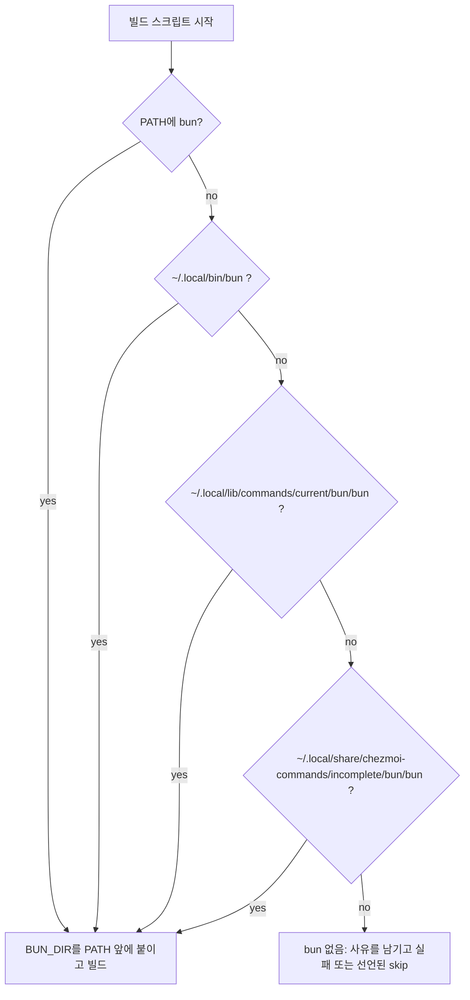

# Bun from chezmoiexternals - Plan

## Goal Capsule

- **Objective:** 관리되는 모든 호스트가 저장소에 기록된 동일한 bun 버전을 쓰고, 그 사실이 저장소 안 한 곳에만 존재한다. apply와 CI는 bun이 PATH에 없어도 bun을 찾아 빌드를 완료한다.
- **Means:** bun의 소유권을 mise에서 `.chezmoiexternals` + release-lock으로 옮긴다 (KTD1).
- **Product authority:** 이 계획은 bun 하나만 소유한다. mise가 관리하는 다른 도구의 재현성 격차는 같은 문제지만 활성 범위가 아니다.
- **Execution profile:** 패키징·설정 작업이다. 옳은 증거는 단위 테스트가 아니라 렌더 게이트, 선언 게이트, 그리고 apply 스모크다.
- **Stop conditions:** release-lock이 bun 자산을 해석하지 못하면 중단한다. `.ci/check-skip-declarations.sh`가 통과하지 못하면 중단한다. bun이 mise에서 제거된 뒤 `10-build-command-reconcile`이 bun을 찾지 못하면 중단한다.
- **Tail ownership:** 커밋, PR, CI 감시는 호출한 파이프라인이 소유한다.

---

## Product Contract

**Product Contract preservation:** 변경됨 — R6. 원래 R6는 mise 없이 settings-reconcile을 빌드한다는 요구였으나, 그 형태가 skip 레코드 정리를 깨뜨린다는 것이 리뷰에서 확인되어 R6를 이 스크립트의 하위 프로세스가 bun을 해석한다는 요구로 좁혔다. 사유는 KTD6, 남은 부분은 Deferred to Follow-Up Work에 있다. Outstanding Questions의 `Deferred to Planning` 3건은 KTD2, KTD4, KTD5와 Assumptions로 해소되어 그 섹션은 제거됐고, Dependencies의 `bunx` 가정은 검증된 사실로 승격됐다. 나머지 R과 Key Decisions는 원문 그대로다.

### Summary

bun을 mise의 `[tools]` 선언 대신 release-lock으로 버전·digest가 고정된 chezmoi external로 배포한다. `bun`과 `bunx`를 모두 호스트 명령으로 유지하고, bun을 호출하는 apply·CI 스크립트에 `mise` 바이너리가 이미 쓰는 것과 같은 해석 사다리를 준다.

### Problem Frame

전역 mise 설정은 `bun = "latest"`이고 `lockfile = true`이지만 그 lock 파일은 저장소에 없다. 실제로 `~/.config/mise/mise.lock`은 존재하지 않는다. 결과적으로 bun 버전을 결정하는 것은 각 호스트가 `mise install`을 마지막으로 돌린 시점이다. 현재 이 호스트에는 `1.3.14`와 `1.4.0`이 함께 남아 있고 `latest`는 `1.4.0`을 가리키는 반면, 업스트림 최신은 `1.4.1`이다.

이 격차는 STRATEGY.md의 두 지표에 직접 걸린다. 재빌드한 호스트가 오늘의 호스트와 같은 bun을 받는다는 보장이 없고, bun 버전이라는 사실을 저장소가 어디에도 소유하지 않는다. 같은 저장소가 `mise` 바이너리 자체를 포함한 다른 릴리스 아티팩트에는 이미 버전+digest 고정을 적용하고 있어서, bun만 예외로 남아 있다.

비용은 조용하다. 빌드가 깨지지 않고 드리프트만 쌓이므로, bun 동작 차이로 무언가 어긋날 때까지 어떤 호스트가 어떤 bun을 쓰는지 알 수 없다.

### Key Decisions

- **bun 하나만 옮긴다.** (session-settled: user-directed — chosen over `dot_config/mise/mise.lock`을 커밋하고 `locked = true`로 전체를 고정하는 안: 한 번의 변경으로 감당 가능한 크기를 택함) Governs R8.
- **`bunx`를 명령으로 유지한다.** 지금 mise가 제공하는 호스트 명령 표면을 보존한다. (session-settled: user-directed — chosen over `bun`만 배포하고 `bunx`를 떨어뜨리는 안: 대화형 셸에서 쓰던 명령이 사라지지 않게) Governs R3.
- **`mise` 바이너리가 통과한 경로를 그대로 재사용한다.** bun은 자기 트리를 다시 쓰지 않는 단일 바이너리이고 자산별 digest를 제공하므로, 기존 external 모델이 예외 없이 적용된다. Governs R1, R2, R4.
- **문서화된 분담 규칙을 bun에 한해 개정한다.** 규칙 개정은 부수 작업이 아니라 산출물의 일부다. Governs R9.
- **externals 경로의 갱신 주기를 그대로 수용한다.** mise의 `minimum_release_age = "24h"` 쿨다운을 잃고 다른 모든 external 도구와 같은 시간당 갱신을 받는다. Governs R1.

```mermaid
flowchart TB
  subgraph before["개정 전: 버전 사실이 호스트에 있음"]
    M["dot_config/mise/config.toml: bun = latest"]
    M --> I["호스트별 mise install 시점"]
    I --> P1["PATH의 bun"]
  end
  subgraph after["개정 후: 버전 사실이 저장소에 있음"]
    REG["packages/release-lock 레지스트리"]
    REG --> J[".chezmoidata/releases.json: 버전 + sha256"]
    J --> TMPL[".chezmoitemplates/release-lock-ref.tmpl"]
    TMPL --> EXT[".chezmoiexternals/dev-tools.toml"]
    EXT --> CMD[".chezmoidata/commands.yaml: producer external"]
    CMD --> P2["bun, bunx 명령"]
    P2 --> S["apply 및 CI 스크립트"]
  end
```

### Requirements

**배포와 고정**

- R1. bun의 버전과 아티팩트 digest는 `.chezmoidata/releases.json`에 커밋된 상태로만 존재한다. 항목은 `packages/release-lock` 레지스트리에 추가하며, lock 파일 자체는 손으로 편집하지 않는다.
- R2. 배포 대상은 linux와 macOS의 x86_64·aarch64를 모두 덮고, musl 리눅스 호스트는 musl 빌드를 받는다.
- R3. `bun`과 `bunx`가 모두 호스트 명령으로 남는다.
- R4. bun은 `.chezmoiexternals/dev-tools.toml`의 external과 `.chezmoidata/commands.yaml`의 `producer: external` 선언을 통해 배치된다. 전용 설치 스크립트를 새로 만들지 않는다.

**스크립트의 bun 해석**

- R5. bun을 호출하는 chezmoi 스크립트는 bun이 PATH에 없어도 관리 설치 경로에서 bun을 찾는다.
- R6. `.chezmoiscripts/60-build/run_onchange_after_build-settings-reconcile.sh.tmpl`이 띄우는 `vp run build`의 하위 `bun` 프로세스가 관리 설치 경로의 bun을 해석한다.
- R7. `.ci/`에서 bun을 호출하는 스크립트도 R5와 같은 해석 경로를 쓴다.

**마이그레이션과 문서**

- R8. bun 선언이 `dot_config/mise/config.toml`과 저장소 루트 `mise.toml` 양쪽에서 제거된다.
- R9. `AGENTS.md`의 분담 규칙 문장과 `dot_config/mise/config.toml` 헤더 주석이 bun의 새 소유자를 반영하도록 개정된다.
- R10. mise가 이전에 설치한 bun 트리가 호스트에 남아 있어도 `bun`은 새 external을 해석한다.

### Key Flows

- F1. apply 시점의 bun 해석
  - **Trigger:** `chezmoi apply`가 `00-tools` 또는 `60-build`의 빌드 스크립트에 도달한다.
  - **Steps:** 스크립트가 bun을 찾는다 → PATH에 없으면 관리 설치 경로를 순서대로 확인한다 → 찾으면 그 bun으로 빌드한다 → 어디에도 없으면 무엇이 없어서 실패했는지 밝히고 중단한다.
  - **Outcome:** 새 호스트의 첫 apply에서도 bun 부재로 조용히 스킵되는 경로가 없다.
  - **Covered by:** R5, R6, R7

### Acceptance Examples

- AE1. musl 호스트의 배포
  - **Covers R2.**
  - **Given** musl 리눅스 호스트에서 apply한다.
  - **Then** glibc 빌드가 아니라 musl bun 아티팩트가 배치된다.
- AE2. PATH에 bun이 없는 apply
  - **Covers R5, R6.**
  - **Given** bun이 PATH에 없고 관리 설치 경로에만 있다.
  - **When** 빌드 스크립트가 실행된다.
  - **Then** 스크립트와 그것이 띄우는 `bun build` 하위 프로세스가 모두 관리 경로의 bun을 해석한다.
- AE3. bun이 어디에도 없는 apply
  - **Covers R5.**
  - **Given** PATH와 관리 설치 경로 어디에도 bun이 없다.
  - **Then** 스크립트는 조용히 스킵하지 않고, bun을 찾지 못했다는 사실을 남기고 실패한다.
- AE4. mise 잔여 설치가 있는 기존 호스트
  - **Covers R10.**
  - **Given** 이전 mise 설치 트리가 남아 있는 호스트에서 apply한다.
  - **When** `bun --version`을 실행한다.
  - **Then** `.chezmoidata/releases.json`이 기록한 버전이 나온다.

### Success Criteria

- 변경 없는 소스에 대한 두 번째 apply가 대상을 0건 바꾸고 onchange 스크립트를 0회 재실행한다.
- 임의의 관리 호스트에서 `bun --version`이 `.chezmoidata/releases.json`의 기록과 일치한다.
- mise에서 bun을 제거한 뒤에도 command-reconcile과 settings-reconcile 빌드가 통과한다.
- 관리 호스트에 배포되는 bun 버전이 저장소 안에 한 곳에만 존재한다. 개발 툴체인 핀 두 곳(`packages/package.json`의 `packageManager`, `refresh-release-lock.yml`의 `bun-version`)은 호스트 배포 버전이 아니며 이번 범위 밖이다.

### Scope Boundaries

- node, go, python, rust, yarn 등 나머지 mise 도구의 버전 고정. 같은 재현성 격차지만 이번 변경에 묶지 않는다.
- `dot_config/mise/mise.lock` 커밋과 `locked = true` 전환.
- `dot_bunfig.toml`과 `packages/bunfig.toml`의 설치 하드닝 설정 변경.
- externals 경로에 mise의 `minimum_release_age` 쿨다운을 재현하는 것.
- `vp`, `aube`를 포함한 다른 mise 도구의 소유권 이동.
- 개발 툴체인의 bun 핀 두 곳: `packages/package.json`의 `"packageManager": "bun@1.4.0"`과 `.github/workflows/refresh-release-lock.yml`의 `bun-version: "1.4.0"`. 둘 다 호스트에 배포되는 bun이 아니라 워크스페이스와 CI 러너가 쓰는 bun이다. 이번 변경으로 호스트 버전이 lock을 따라 움직이면 이 둘과 갈릴 수 있다.

#### Deferred to Follow-Up Work

- 다중 명령 단위의 실제 결함: `command-manifest.tmpl`이 `producer: external` 단위의 스테이징 경로를 디렉터리로 주는 탓에 `producer.ts`의 명령별 복사 루프가 죽어 있고, 그래서 `~/.local/bin/antigravity`가 끊어진 링크로 남아 있다. 이 계획은 `uv`/`uvx` 형태로 우회하므로 결함 자체는 건드리지 않는다. 별도 과제로 제기한다.
- 개발 툴체인 bun 핀 두 곳을 `.chezmoidata/releases.json`에서 끌어올지 결정하는 것.
- mise 없이 settings-reconcile을 빌드하는 경로. 원래 R6가 요구했으나 보류한다. 빌드가 요구하는 `vp`가 mise 도구라 bun만으로는 대체되지 않고, skip을 이접으로 넓히면 정리가 깨진다(KTD6). 진짜로 하려면 `skip.sh.tmpl`과 `prune_stale_skip_records`가 probe 목록을 받아 any-of로 정리하도록 공유 계약을 넓혀야 하는데, 그건 199개 사이트에 걸친 변경이라 이 브랜치의 범위 밖이다.
- 나머지 mise 도구를 externals나 커밋된 lock으로 옮기는 후속 과제.

### Dependencies / Assumptions

- 확인됨: `oven-sh/bun`의 최신 태그는 `bun-v1.4.1`이고, 자산 이름은 `bun-{linux,darwin}-{x64,aarch64}[-musl].zip` 형태다. `-baseline`, `-profile`, `-android` 변형은 쓰지 않는다.
- 확인됨: GitHub 릴리스 API가 자산별 sha256을 제공한다 (`bun-linux-x64.zip` → `sha256:74c1c3bee7cd998500c8f969cd8972355ac6a07207e94a39eece1999b56ffabf`). 표준 `githubRelease` 경로로 충분하다.
- 확인됨: `~/.config/mise/mise.lock`이 존재하지 않는다. 현재 bun은 어떤 방식으로도 고정돼 있지 않다.
- 확인됨: `bun-linux-x64.zip`의 중앙 디렉터리에는 `bun-linux-x64/bun` 하나만 있다. `bunx`는 아카이브에 없고, 공식 설치가 만드는 별칭이다.
- 확인됨: bun 바이너리는 argv[0]을 읽는다. 바이너리를 `bunx`라는 이름으로 복사해 실행하면 `bun x`로 동작한다. 심볼릭 링크가 필요하지 않다.
- 확인됨: `producer: external` 단위는 스테이징 **디렉터리**를 받으므로 명령별 복사 루프를 타지 않는다. 단위 하나에 명령 이름 두 개를 다는 형태는 두 번째 이름을 끊어진 링크로 남긴다. 이 호스트의 `antigravity`가 그 상태다(`command not found`).
- 확인됨: `packages/settings-reconcile`은 `smol-toml` 런타임 의존성을 갖고 `src/reconcile.ts`가 그것을 import한다. `packages/command-reconcile`은 런타임 의존성이 없다. 두 빌드의 폴백 경로는 같을 수 없다.
- 확인됨: `skip.sh.tmpl`은 사이트마다 probe를 하나만 받고, `.ci/check-skip-declarations.sh`는 선언 probe가 매트릭스 probe와 같고 그 토큰이 지문 블록에 있기를 요구한다.
- 확인됨: `.install-prerequisites.sh`의 `prune_stale_skip_records`는 레코드에 담긴 그 **하나의** probe가 `available`일 때만 낡은 skip 레코드를 지운다. 그래서 이접 술어를 쓰면 다른 쪽 도구로 조건을 해소한 호스트가 레코드를 영원히 안고 간다. 같은 파일의 주석이 이 실패 유형을 과거 실제 사고로 기록하고 있다.
- 확인됨: `vp`는 node로 실행된다. bun이 mise를 떠나도 `mise exec -- vp`의 실행 자체는 깨지지 않는다.
- 확인됨: `vp run build` 태스크의 명령이 `bun build --compile`이다. 그래서 mise 경로로 빌드해도 bun이 PATH에 있어야 한다.
- 가정: 관리 대상 x86_64 호스트는 AVX2를 지원하므로 `-baseline` 변형이 필요 없다 (KTD4).

---

## Planning Contract

### Key Technical Decisions

- KTD1. **bun을 `githubRelease` 레지스트리 항목과 `archive-file` external로 배포한다.** `mise` 항목과 같은 형태에 `linuxMusl: true`를 붙이고, 자산 선택자는 bun의 `x64`/`aarch64` 표기를 쓴다. 레지스트리에 이미 `x64Arch` 헬퍼가 있다. Governs R1, R2, R4.
- KTD2. **`bunx`는 두 번째 external과 두 번째 `commands.yaml` 단위로 만든다.** `uv`/`uvx`가 쓰는 형태다. 단위 하나에 명령 이름 두 개를 다는 형태는 쓸 수 없다. `.chezmoitemplates/command-manifest.tmpl`이 `producer: external` 단위의 `stagingPath`를 단위 **디렉터리**로 설정하므로 `producer.ts`가 디렉터리 분기(재귀 복사)를 타고 명령별 복사 루프에 도달하지 않는다. 그래서 두 번째 명령 이름은 저장소에 실체가 없는 채 공개 심볼릭 링크만 생긴다. 아카이브 멤버를 두 번 추출하므로 스테이징과 저장소에 각각 사본이 하나씩 더 생긴다. bun 바이너리는 77 MiB다. (session-settled: user-directed — chosen over `bun`만 배포하고 `bunx`를 떨어뜨리는 안: 대화형 셸에서 쓰던 명령이 사라지지 않게) Governs R3.
- KTD3. **bun 해석 사다리는 공유 템플릿 partial 하나로 만들고, 찾은 bun의 디렉터리를 PATH 앞에 붙인다.** 절대 경로 호출만으로는 부족하다. `vp run build`가 `bun build --compile`을 하위 프로세스로 띄우고 그 프로세스는 PATH에서 bun을 찾기 때문이다. Governs R5, R6, R7.
- KTD4. **`-baseline` 빌드를 쓰지 않는다.** 비-baseline x64 빌드는 AVX2를 요구한다. 실패 신호는 `bun` 실행 시 SIGILL이고, 그때 레지스트리에 baseline 변형을 추가한다.
- KTD5. **기존 mise bun 설치를 자동으로 정리하지 않는다.** `~/.local/bin`이 PATH 최선두이고 mise 설치 트리는 chezmoi 대상 상태가 아니다. mise 설정에서 bun이 빠지면 mise가 그 경로 주입을 멈춘다. Governs R10.
- KTD6. **`60-build`의 skip 선언은 건드리지 않는다.** 이 스크립트에는 bun 전용 빌드 분기를 두지 않고 사다리를 PATH prepend 목적으로만 포함한다. 빌드가 요구하는 `vp`는 mise 도구라 bun이 mise를 대체할 수 없고, skip을 `mise도 bun도 없음`으로 넓히면 정리가 깨진다. transient-blocking 레코드는 probe를 하나만 담고 `prune_stale_skip_records`가 그 하나가 `available`일 때만 지우므로, 다른 쪽 도구를 설치해 조건을 해소한 호스트는 레코드를 영원히 안고 간다. Governs R6.

### High-Level Technical Design

부트스트랩 순환이 사다리의 마지막 단계를 결정한다. 공개 `~/.local/bin/bun` 링크는 `run_after_90-activate-command-links`가 만들고, 그 스크립트는 `10-build-command-reconcile`이 만드는 바이너리를 요구한다. 그래서 첫 apply에서 빌드 스크립트가 볼 수 있는 유일한 bun은 external이 방금 쓴 스테이징 경로다. `mise` 바이너리가 같은 폴백을 갖는 이유와 동일하다.

### Assumptions

- 관리 대상 x86_64 호스트는 AVX2를 지원한다 (KTD4).
- `releases.json`의 bun 항목은 시간당 갱신 워크플로가 유지한다. 사람이 편집하지 않는다.
- `~/.local/bin`이 PATH 최선두라는 현재 배치가 유지된다. R10은 이 순서에 의존한다.

### Sequencing

배포 경로(U1, U2)와 해석 사다리(U3, U4, U5)가 모두 자리를 잡은 뒤에만 mise에서 bun을 제거한다(U6). 순서를 뒤집으면 bun이 어디에서도 오지 않는 상태가 생긴다.

---

## Implementation Units

### U1. release-lock 레지스트리에 bun 추가

- **Goal:** bun의 버전과 자산별 digest가 커밋된 lock에서 해석된다.
- **Requirements:** R1, R2
- **Dependencies:** 없음
- **Files:**
  - `packages/release-lock/src/registry.ts`
  - `packages/release-lock/test/registry.test.ts`
  - `.chezmoidata/releases.json`
- **Approach:**
  1. `REGISTRY`에 `bun` 항목을 추가한다. `kind: "githubRelease"`, `source: "oven-sh/bun"`, `linuxMusl: true`.
  2. 자산 선택자를 작성한다. 형태는 `bun-<os>-<arch><musl 접미사>.zip`이고, arch는 기존 `x64Arch`로 `amd64 → x64`를 얻되 `arm64`는 `aarch64`로 바꾼다. `x64Arch`는 `arm64`를 그대로 돌려주므로 별도 처리가 필요하다.
  3. lock을 재생성해 `.chezmoidata/releases.json`에 bun 항목을 넣는다.
- **Patterns to follow:** `packages/release-lock/src/registry.ts`의 `mise` 항목이 `linuxMusl`과 os 표기 변환의 참고 형태다.
- **Test scenarios:**
  - `registry asset selectors` 스위트가 bun에 대해 `ALL_PLATFORMS_WITH_MUSL`의 6개 플랫폼 키를 모두 산출하고, 각 이름이 실제 릴리스 자산 이름과 일치한다.
  - `linux-arm64` 키가 `bun-linux-aarch64.zip`을 산출한다. `x64Arch`를 그대로 쓰면 잘못된 `bun-linux-arm64.zip`이 나오므로 이 케이스를 명시적으로 고정한다.
  - `linux-amd64-musl` 키가 `bun-linux-x64-musl.zip`을 산출한다.
  - `darwin-arm64` 키가 `bun-darwin-aarch64.zip`을 산출한다.
  - 선택자가 `-baseline`, `-profile`, `-android` 변형을 절대 산출하지 않는다.
- **Verification:** lock 갱신 후 `.ci/check-release-lock-digests.sh`가 bun 항목을 통과시킨다. 6개 플랫폼 모두 sha256이 채워져 있다.

### U2. bun/bunx external과 명령 선언

- **Goal:** bun과 bunx가 호스트 명령으로 배치된다.
- **Requirements:** R3, R4
- **Dependencies:** U1
- **Files:**
  - `.chezmoiexternals/dev-tools.toml`
  - `.chezmoidata/commands.yaml`
- **Approach:**
  1. `dev-tools.toml`에 `[bun]`과 `[bunx]` 두 external을 `type = "archive-file"`로 추가한다. `targetPath`는 각각 `.local/share/chezmoi-commands/incomplete/bun/bun`과 `.local/share/chezmoi-commands/incomplete/bunx/bunx`, 둘 다 `executable = true`.
  2. 두 external은 같은 `url`과 같은 아카이브 내부 `path`를 읽는다. 아카이브에는 `bun` 하나뿐이고, `bunx`는 그 바이너리를 다른 이름으로 놓은 것이다.
  3. 내부 `path`는 플랫폼마다 다르다(`bun-<os>-<arch>[-musl]/bun`). 자산 이름과 같은 접미사 규칙이므로 템플릿 변수 하나로 계산해 두 external의 `url`과 `path`가 함께 어긋나지 않게 한다.
  4. 각 external에 `checksum.sha256`을 넣는다. URL과 digest는 모두 `release-lock-ref.tmpl`로 읽는다.
  5. `commands.yaml`의 `units`에 `bun`과 `bunx` 두 단위를 추가한다. 둘 다 `producer: external`, `tool: bun`이고 각각 명령 이름 하나만 갖는다.
  6. 파일 상단 주석의 도구 목록에 bun을 넣는다.
- **Patterns to follow:** `.chezmoiexternals/dev-tools.toml`의 `[uv]`/`[uvx]`가 한 아카이브에서 두 external을 내고 `.chezmoidata/commands.yaml`의 `uv`/`uvx` 단위가 `tool: uv`를 공유하는 형태다. `[mise]`가 `release-lock-ref.tmpl`에 `musl` 인자를 넘기는 형태를 함께 참고한다.
- **Test scenarios:**
  - `.ci/test-command-external-render.sh`가 두 external과 두 명령 선언의 대응을 통과시킨다.
  - `.ci/test-command-manifest.sh`가 `tool: bun`을 공유하는 두 단위를 받아들인다.
  - musl 리눅스 렌더에서 두 external의 `url`과 내부 `path`가 모두 musl 변형을 가리킨다. 하나만 musl이면 압축 해제가 실패한다. Covers AE1.
  - darwin arm64 렌더에서 두 external의 내부 `path`가 모두 `bun-darwin-aarch64/bun`이다.
  - 두 external의 `targetPath`가 서로 다른 단위 디렉터리를 가리킨다. 같은 디렉터리를 쓰면 한쪽이 다른 쪽을 덮는다.
- **Verification:** 렌더된 두 external이 각 플랫폼에서 URL과 내부 경로가 짝을 이룬다. apply 후 `~/.local/bin/bun`과 `~/.local/bin/bunx`가 **둘 다 실제 파일로 해석되고**(끊어진 링크가 아니고), `bunx --help`가 bunx 사용법을 출력한다.

### U3. bun 해석 사다리 공유 partial과 00-tools 적용

- **Goal:** bun을 호출하는 chezmoi 스크립트가 PATH 밖에서도 bun을 찾는다.
- **Requirements:** R5
- **Dependencies:** 없음. U6보다 먼저 끝나야 한다.
- **Files:**
  - `.chezmoitemplates/bun-resolve.sh.tmpl` (신규)
  - `.chezmoiscripts/00-tools/run_onchange_after_10-build-command-reconcile.sh.tmpl`
  - `.ci/test-build-command-reconcile.sh`
- **Approach:**
  1. `bun-resolve.sh.tmpl`을 만든다. KTD3의 사다리 순서로 bun을 찾고, `BUN_BIN`과 `BUN_DIR`을 설정하고, `BUN_DIR`을 PATH 앞에 붙인다. bun을 찾지 못하면 변수를 비운 채 돌아온다. 판단은 호출 쪽이 한다.
  2. `10-build-command-reconcile`에서 기존 `command -v bun` 두 곳을 partial 호출로 바꾼다.
  3. 기존 치명 오류 메시지 `build-command-reconcile: neither mise nor bun is installed`는 그대로 둔다. 사다리는 탐색 범위만 넓히고 실패 계약은 바꾸지 않는다.
- **Patterns to follow:** 같은 파일의 `MISE_BIN` 해석 사다리가 형태와 순서의 참고다.
- **Execution note:** 이 단위의 옳은 증거는 부재 조건 스모크다. bun과 mise가 없는 가짜 PATH에서 스크립트를 돌려 사다리가 어디까지 내려가는지 확인한다.
- **Test scenarios:**
  - PATH에 bun이 없고 스테이징 경로에만 bun이 있을 때 스크립트가 그 bun으로 빌드한다. Covers AE2.
  - PATH와 세 폴백 경로 어디에도 bun이 없고 mise도 없을 때 스크립트가 기존 메시지를 내고 0이 아닌 코드로 끝난다. Covers AE3.
  - `~/.local/bin/bun`과 스테이징 bun이 모두 있을 때 `~/.local/bin/bun`이 선택된다.
  - PATH 앞에 붙인 `BUN_DIR` 덕분에 `mise exec -- vp run build`의 하위 `bun build`가 같은 bun을 해석한다.
  - PATH에 이미 bun이 있으면 PATH를 중복해서 늘리지 않는다.
- **Verification:** `.ci/test-build-command-reconcile.sh`가 통과한다. `missing-toolchain` 케이스의 표준 오류 문자열이 바뀌지 않는다.

### U4. settings-reconcile 빌드의 bun 경로

- **Goal:** settings-reconcile 빌드가 띄우는 `bun build` 하위 프로세스가 관리 경로의 bun을 해석한다.
- **Requirements:** R6
- **Dependencies:** U3
- **Files:**
  - `.chezmoiscripts/60-build/run_onchange_after_build-settings-reconcile.sh.tmpl`
- **Approach:**
  1. `bun-resolve.sh.tmpl`을 skip 블록 뒤에 넣는다. 목적은 PATH prepend 하나다. `vp run build`가 `bun build --compile`을 하위 프로세스로 띄우고 그 프로세스는 PATH에서 bun을 찾는다.
  2. 기존 `mise-absent` skip과 두 `mise exec -- vp` 줄은 손대지 않는다. skip 술어와 두 hard-error 줄이 매트릭스의 digest로 고정돼 있고, KTD6에 따라 이 사이트는 넓히지 않는다.
  3. bun 전용 빌드 분기를 만들지 않는다. 따라서 새 capability probe도, 매트릭스 수정도 없다.
- **Patterns to follow:** `.chezmoiscripts/00-tools/run_onchange_after_10-build-command-reconcile.sh.tmpl`이 같은 partial을 포함하는 방식.
- **Test scenarios:** Test expectation: none — 이 단위는 스크립트에 해석 사다리를 포함시킬 뿐 분기를 바꾸지 않는다. 대체 검증은 아래 Verification의 렌더 확인과 기존 게이트다.
- **Verification:** 렌더된 스크립트에 사다리가 들어 있고, `.ci/test-build-settings-reconcile.sh`, `.ci/check-skip-declarations.sh`, `.ci/test-skip-declaration-gates.sh`가 기존 그대로 통과한다.

### U5. .ci 스크립트의 bun 해석

- **Goal:** CI 게이트 스크립트가 PATH 밖의 bun도 찾는다.
- **Requirements:** R7
- **Dependencies:** 없음
- **Files:**
  - `.ci/lib/bun.sh` (신규)
  - `.ci/test-command-reconcile-process.sh`
  - `.ci/test-command-reconcile-apply.sh`
  - `.ci/test-merge-commit-only-gates.sh`
  - `.ci/test-release-lock-digest-gate.sh`
- **Approach:**
  1. `.ci/lib/bun.sh`에 `resolve_bun`을 둔다. KTD3과 같은 사다리를 셸 함수로 제공하고 `BUN_BIN`을 내보낸다.
  2. 네 스크립트가 이 함수를 source해서 쓰도록 바꾼다. 직접 `bun`을 부르는 자리를 `"$BUN_BIN"`으로 바꾼다.
  3. `test-merge-commit-only-gates.sh`의 `for tool in bun jq` 선행 검사와 `test-release-lock-digest-gate.sh`의 CI 필수 조건은 그대로 둔다. CI에서 bun이 없으면 여전히 실패해야 한다.
- **Patterns to follow:** `.ci/lib/apt-install.sh`가 `.ci/lib/`의 공유 헬퍼 형태다.
- **Test scenarios:**
  - CI 러너처럼 bun이 PATH에 있을 때 동작이 바뀌지 않는다.
  - bun이 PATH에 없고 `~/.local/bin/bun`만 있는 로컬 실행에서 네 스크립트가 모두 성공한다.
  - CI 환경 변수가 설정된 상태에서 bun이 어디에도 없으면 `test-release-lock-digest-gate.sh`가 스킵하지 않고 실패한다.
- **Verification:** `.ci/test-ci-wiring.sh`가 통과하고, 네 스크립트를 로컬에서 PATH의 bun 없이 실행해도 통과한다.

### U6. mise 선언 제거와 문서 규칙 개정

- **Goal:** bun의 소유자가 한 곳으로 정리되고 문서가 그 사실을 말한다.
- **Requirements:** R8, R9, R10
- **Dependencies:** U1, U2, U3, U4, U5
- **Files:**
  - `dot_config/mise/config.toml`
  - `mise.toml`
  - `AGENTS.md`
- **Approach:**
  1. `dot_config/mise/config.toml`의 `[tools]`에서 `bun = "latest"`를 지운다.
  2. `mise.toml`의 `[tools]`에서 `bun = "latest"`를 지운다.
  3. `dot_config/mise/config.toml` 헤더 주석의 분담 설명을 고친다. bun이 예외인 이유를 한 줄로 적는다.
  4. `AGENTS.md`의 "language runtimes/registry backends belong in mise" 문장을 고쳐 bun의 새 소유자와 그 이유를 적는다.
- **Test scenarios:** Test expectation: none — 선언 제거와 문서 개정이라 동작 변경이 없다. 실제 증거는 아래 Verification의 apply 스모크다.
- **Verification:** bun 제거 후 `chezmoi apply`가 command-reconcile과 settings-reconcile 빌드를 모두 통과한다. `bun --version`이 lock의 버전과 일치한다. Covers AE4.

---

## Verification Contract

| 게이트 | 명령 | 대상 단위 |
|---|---|---|
| TypeScript 워크스페이스 | `packages/`에서 `vp install --frozen-lockfile`, `vp run -r build`, `vp run -r typecheck`, `vp run -r test`, `vp check` | U1 |
| release-lock digest | `.ci/check-release-lock-digests.sh` | U1 |
| 명령 external 렌더 | `.ci/test-command-external-render.sh`, `.ci/test-command-manifest.sh` | U2 |
| 명령 리콘사일 | `.ci/test-command-reconcile-apply.sh`, `.ci/test-command-reconcile-process.sh` | U2, U5 |
| 치명 경계 | `.ci/test-build-command-reconcile.sh`, `.ci/test-build-settings-reconcile.sh` | U3, U4 |
| skip 선언 | `.ci/check-skip-declarations.sh`, `.ci/test-skip-declaration-gates.sh` | U4 (회귀 없음 확인) |
| CI 배선 | `.ci/test-ci-wiring.sh` | U5 |
| 멱등 apply | `chezmoi apply` 두 번 연속, 두 번째가 대상 0건 변경 | U6 |

관리 호스트에서의 최종 스모크: `bun --version`이 `.chezmoidata/releases.json`의 bun 버전과 일치하고, `bunx --help`가 bunx 사용법을 출력한다.

---

## Definition of Done

- R1–R10이 모두 참이다.
- U1–U6이 모두 랜딩됐고 각 단위의 Verification이 통과한다.
- Verification Contract의 모든 게이트가 통과한다.
- `.chezmoidata/releases.json`의 bun 항목이 6개 플랫폼 키를 모두 갖고 각각 sha256을 갖는다.
- `~/.local/bin/bun`과 `~/.local/bin/bunx`가 둘 다 실제 파일로 해석된다. 끊어진 링크가 아니다.
- `bun`이 `dot_config/mise/config.toml`과 `mise.toml` 어디에도 남아 있지 않다.
- `AGENTS.md`와 `dot_config/mise/config.toml` 주석이 새 소유자를 말한다.
- 시도했다가 접은 접근의 잔여 코드가 diff에 남아 있지 않다.

---

## Sources / Research

- `dot_config/mise/config.toml:1-11` — 분담 규칙 주석과 현재 bun 선언.
- `mise.toml:3` — 저장소 자체 툴체인의 bun 선언.
- `AGENTS.md:118` — 분담 규칙 문장과 Flutter 실패 모드 기록.
- `AGENTS.md:114,120` — `.chezmoidata/releases.json`의 소유권, 손편집 금지, 시간당 갱신 워크플로.
- `.chezmoiexternals/dev-tools.toml:169-182` — `mise` external 스탠자. `linuxMusl` 처리의 참고 형태.
- `packages/release-lock/src/registry.ts:90-96` — `mise` 레지스트리 항목. `x64Arch`는 같은 파일 30행.
- `packages/release-lock/src/platforms.ts` — `ALL_PLATFORMS_WITH_MUSL`과 플랫폼 키 규칙.
- `.chezmoiexternals/dev-tools.toml:155-167`, `.chezmoidata/commands.yaml:187-209` — `uv`/`uvx`. 한 아카이브에서 external 두 개, `tool`을 공유하는 단위 두 개. KTD2가 따르는 형태.
- `.chezmoitemplates/command-manifest.tmpl:31` — `producer: external` 단위의 스테이징 경로를 단위 디렉터리로 설정하는 지점.
- `packages/command-reconcile/src/producer.ts:142-152` — 디렉터리면 재귀 복사, 파일이면 명령별 복사. 앞 줄 때문에 external 단위는 늘 앞쪽 분기를 탄다. `.chezmoidata/commands.yaml:43-54`의 `agy` 단위가 그 결과로 깨져 있다.
- `.chezmoitemplates/skip.sh.tmpl:158,179-183`, `.ci/check-skip-declarations.sh:920-921,1030-1044` — 사이트당 probe 하나 제약과 지문 페어링 규칙.
- `.install-prerequisites.sh:937-945,998-1020` — 낡은 skip 레코드 정리. 단일 probe로만 지우며, 주석이 과거 사고 두 건을 기록한다. KTD6의 근거.
- `packages/settings-reconcile/package.json`, `packages/settings-reconcile/src/reconcile.ts:5` — `smol-toml` 런타임 의존성. U4 3단계의 근거.
- `packages/package.json:5`, `.github/workflows/refresh-release-lock.yml:31` — 범위 밖으로 명시한 개발 툴체인 bun 핀 두 곳.
- `.chezmoiscripts/00-tools/run_onchange_after_10-build-command-reconcile.sh.tmpl:23-49` — `MISE_BIN` 사다리와 bun PATH 폴백.
- `.chezmoiscripts/00-tools/run_after_90-activate-command-links.sh.tmpl` — 공개 링크 생성 시점. 부트스트랩 순환의 다른 쪽 끝.
- `.chezmoiscripts/60-build/run_onchange_after_build-settings-reconcile.sh.tmpl:25-32` — mise 하드 요구와 `mise-absent` skip.
- `.ci/skip-declaration-site-matrix.yaml:1781-1796` — 건드리지 않는 skip 선언 항목. 술어와 digest가 여기 고정돼 있다.
- `packages/command-reconcile/vite.config.ts`, `packages/settings-reconcile/vite.config.ts` — build 태스크가 `bun build --compile`인 지점. KTD3의 근거.
- `STRATEGY.md` — "Hermetic supply chain" 트랙, idempotent-apply cleanliness 및 duplicate-knowledge defects 지표.
- `docs/plans/2026-08-31-1800-feat-manage-mise-binary-plan.md` — mise 바이너리를 externals로 옮긴 선행 계획.
- https://bun.com/docs/pm/bunx.md — `bunx`는 `bun x`의 별칭이며 bun 설치 시 함께 제공된다.
