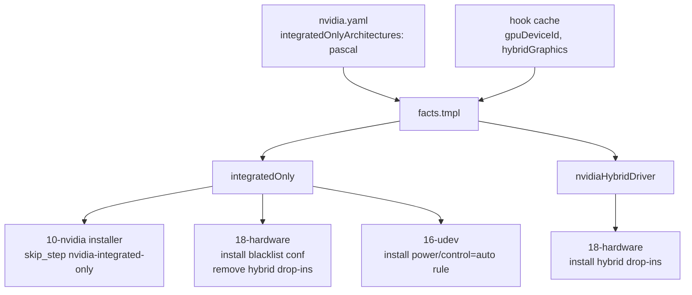
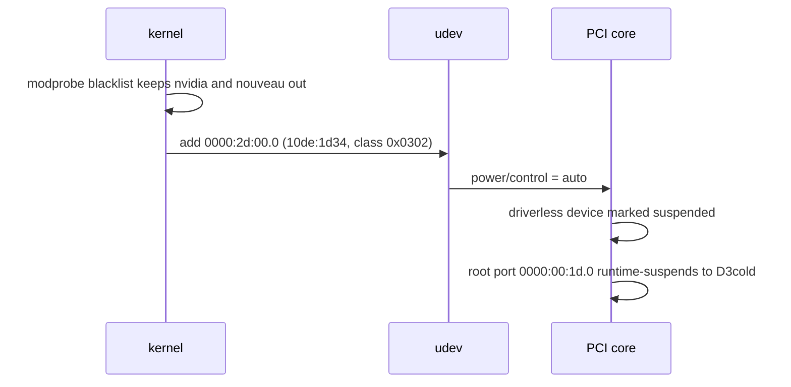

# Pascal Hybrid Hosts Use Integrated Graphics Only - Plan

## Goal Capsule

- **Objective:** A laptop with a Pascal discrete GPU next to an integrated GPU runs on the integrated GPU alone, with the discrete GPU powered off and no NVIDIA driver stack installed or maintained by dotfiles.
- **Means:** A hardware policy row in the NVIDIA data table resolves to two template facts; those facts skip the NVIDIA installer, swap the hybrid modprobe drop-ins for a driver blacklist, and install a udev rule that hands the driverless GPU to PCI runtime power management so its root port enters D3cold (KTD1, KTD2).
- **Authority:** The operator's own fleet policy, decided in the brainstorm recorded in the Product Contract. No issue is in play.
- **Execution profile:** Chezmoi data, template, shell-template, `/etc` tree, and CI fixture changes. No production code beyond shell and Go templates.
- **Stop conditions:** Stop if a render gate in `.ci/` or `.ci/check-skip-declarations.sh` fails after two fix attempts, or if AE2 cannot be met on the host and the fallback in Open Questions is needed.
- **Tail ownership:** The invoking `lfg` pipeline owns implementation, simplification, code review, commit, push, PR, and CI watch.
- **Product Contract preservation:** changed: R3, R5, R6, AE1, AE4 and Key Decision 4 — planning found that a driverless PCI device with runtime PM `auto` is suspended by the PCI core and lets its root port enter D3cold without removing the device from the bus. Keeping the device enumerated is what makes R3 hold with no persisted state, so the mechanism wording moved from "detached from the PCI bus" to "powered off with no driver bound". The user-visible outcome is unchanged. PCI removal stays the documented fallback (Open Questions).

---

## Product Contract

### Summary

Classify Pascal hybrid-graphics hosts as integrated-only and have dotfiles stop installing the NVIDIA stack there, withdraw the two hybrid modprobe drop-ins, and power the discrete GPU off at boot. Removal of the stack already present on the ThinkPad P14s Gen 1 is a one-time manual step that the repository documents but does not automate.

### Problem Frame

On the ThinkPad P14s Gen 1 the Quadro P520 is never used: the operator runs no CUDA work on this laptop. The dotfiles hybrid-graphics drop-ins set the driver's runtime power-management options, but the 580xx driver reports `Runtime D3 status: Not supported` for this Pascal GPU, and the device has never entered runtime suspend since boot. The card therefore stays powered on battery at all times while contributing nothing. On top of the power cost, the host carries an akmod rebuild and a signed module on every kernel update, a persistence daemon, and MOK enrollment, all for a driver whose only job is to keep an idle GPU awake. Lenovo's firmware offers no option to disable the discrete GPU, so the fix has to come from the operating system.

### Key Decisions

- **Remove the whole NVIDIA stack rather than only powering the GPU off** (session-settled: user-directed — chosen over keeping the stack installed with the GPU powered off, and over switching to nouveau runtime power management: the stack has no user on this host and costs a rebuild on every kernel). Governs R1, R2, R7.
- **Express the rule as a hardware policy, not a per-host opt-out** (session-settled: user-directed — chosen over an operator marker on this host alone: a Pascal hybrid laptop is always integrated-only in this fleet, and a future host of the same kind must inherit the rule without hand declaration). Governs R1, R3.
- **Manual one-time removal of the installed stack; dotfiles only stops installing** (session-settled: user-directed — chosen over an installer-owned removal path: keeps removal logic out of the repository at the price of repeating the manual steps on any later Pascal host). Governs R7, R8.
- **Power the GPU off by leaving it driverless under PCI runtime power management, so the root port enters D3cold.** The host allows D3cold on the device and runtime PM `auto` on its root port. Governs R4, R5, R6.
- **The classification must survive the GPU being powered off.** The GPU stays enumerated on the PCI bus while powered off, so the hook probe keeps seeing it. Governs R3.

### Requirements

**Policy and classification**

- R1. A host whose GPU architecture resolves to `pascal` and whose `hybridGraphics` fact is true is classified integrated-only, and the classification is a data row in the NVIDIA policy table rather than a probe verdict.
- R2. On an integrated-only host the NVIDIA installer installs nothing, enables no NVIDIA service, and declares the skip naming the policy that caused it.
- R3. An integrated-only classification, once made on a host, holds on every later apply and boot while the discrete GPU is powered off.

**Discrete GPU power-off**

- R4. On an integrated-only host the proprietary and nouveau drivers never bind to the discrete GPU.
- R5. On an integrated-only host the discrete GPU is powered off during boot and its root port enters D3cold before the desktop session starts.
- R6. After suspend or hibernate resume the discrete GPU is again powered off without operator action.

**Retirement of hybrid configuration**

- R7. On an integrated-only host dotfiles withdraws the two hybrid modprobe drop-ins it previously installed, and no other host's hybrid drop-ins change.
- R8. The repository documents the one-time manual removal of an already-installed NVIDIA stack on an integrated-only host: the packages, the persistence daemon, the container toolkit CDI spec, the repository exclusion settings, and the command to withdraw the enrolled MOK certificate.

**Fleet safety**

- R9. Ampere desktops and Jetson hosts see no change in installed packages, enabled services, or system configuration.
- R10. The structural CI checks for the NVIDIA installer and the system manifest cover the integrated-only branch.

### Key Flows

- F1. First apply on a freshly classified Pascal hybrid host
  - **Trigger:** `chezmoi apply` on a host whose facts resolve to `gpuArch=pascal`, `hybridGraphics=true`.
  - **Steps:** Facts classify the host integrated-only; the NVIDIA installer skips and names the policy; the system installers withdraw the two hybrid drop-ins and install the GPU-off configuration; the operator runs the documented manual removal; the host reboots.
  - **Outcome:** Next boot, no NVIDIA module loads, the discrete GPU has no driver, and its root port reports D3cold.
  - **Covers R1, R2, R4, R5, R7, R8.**
- F2. Later apply while the GPU is powered off
  - **Trigger:** `chezmoi apply` on the same host after F1.
  - **Steps:** The PCI probe still enumerates the NVIDIA device; the classification still resolves integrated-only; no NVIDIA-gated path changes state.
  - **Outcome:** The host stays integrated-only; nothing is installed or withdrawn.
  - **Covers R3.**
- F3. Suspend and resume
  - **Trigger:** Lid close, then lid open.
  - **Steps:** The kernel restores the root port on resume; the driverless GPU keeps runtime PM `auto` and returns to suspended.
  - **Outcome:** The discrete GPU is powered off again with no operator action.
  - **Covers R6.**

### Acceptance Examples

- AE1. Integrated-only host after reboot
  - **Covers R4, R5.**
  - **Given** the ThinkPad P14s Gen 1 has applied the policy and completed the manual removal.
  - **When** the operator inspects the NVIDIA PCI device and kernel modules after login.
  - **Then** the device `0000:2d:00.0` has no `driver` link, neither `nvidia` nor `nouveau` is loaded, the device reports `runtime_status=suspended`, and the root port `0000:00:1d.0` reports `runtime_status=suspended` with `power_state` D3cold.
- AE2. Power draw drops
  - **Covers R5.**
  - **Given** AE1 holds and the laptop is on battery at an idle desktop.
  - **When** the operator reads the battery discharge rate.
  - **Then** it is measurably below the idle rate recorded with the GPU active before the change, which was about 17.8 W on this host.
- AE3. Classification survives power-off
  - **Covers R3.**
  - **Given** AE1 holds.
  - **When** the operator runs `chezmoi apply` again.
  - **Then** the host facts still report integrated-only, the NVIDIA installer still skips naming the policy, and the GPU-off configuration is not withdrawn.
- AE4. Resume keeps the GPU off
  - **Covers R6.**
  - **Given** AE1 holds.
  - **When** the laptop suspends and resumes.
  - **Then** within a short interval after resume the NVIDIA device is again `runtime_status=suspended` and the root port is again in D3cold.
- AE5. Other hosts unchanged
  - **Covers R9.**
  - **Given** an Ampere desktop with `hybridGraphics=false`.
  - **When** it applies the same repository revision.
  - **Then** its NVIDIA installer resolves the `latest` branch as before and no GPU-off configuration is installed.

### Scope Boundaries

- No on-demand toggle to re-enable the discrete GPU for PRIME offload or CUDA; reversal is a policy-table edit followed by reinstalling the stack.
- No installer-owned removal path; removal of an already-installed stack is manual and documented (R8).
- No change to the Ampere desktop, Jetson, or Ubuntu paths of the NVIDIA installer.
- Turing or newer hybrid hosts keep the current runtime-power-management behavior; the policy covers Pascal only.

### Deferred to Follow-Up Work

- Teaching the udev subsystem's `removed:` list to take a `gate:` is not needed by this plan and stays out.

### Dependencies / Assumptions

- A driverless PCI device with `power/control=auto` is treated as runtime-suspended by the PCI core, which lets its parent root port enter D3cold. The host reports `d3cold_allowed=1` and root-port runtime PM `auto`, which are the preconditions; the power drop itself is verified by AE2.
- Lenovo's firmware offers no BIOS setting to disable the discrete GPU on this model, so the operating system owns the power-off.
- The preuninstall scriptlet of `xorg-x11-drv-nvidia-580xx` runs `grubby --remove-args` for `rd.driver.blacklist=nouveau,nova_core modprobe.blacklist=nouveau,nova_core` on last uninstall, and dracut's host-only DRM module puts nouveau into the initramfs for the present GPU. The runbook therefore re-adds those kernel arguments and rebuilds the initramfs after the package removal so the modprobe blacklist reaches early boot (R4).

### Outstanding Questions

**Deferred to Planning** — resolved in the Planning Contract:

- Classification persistence (R3): resolved by KTD2; the device stays enumerated.
- Detach mechanism and resume re-fire (R6): resolved by KTD2 and KTD3; a udev `add` rule sets runtime PM `auto`, which persists across resume.
- Hybrid sleep-hook enablement: resolved by KTD4; the installer skips before `enable_nvidia_services` runs, and the units vanish with the driver package.

**Deferred to Implementation**

- If AE2 does not hold on the host after the first reboot, the fallback is a udev rule with `ATTR{remove}="1"` for the GPU function; that path needs a persisted classification for R3 and is a separate plan.

### Sources / Research

- Host evidence recorded on 2026-09-05 from the ThinkPad P14s Gen 1: `/proc/driver/nvidia/gpus/*/power` reports `Runtime D3 status: Not supported`; `runtime_suspended_time` of the GPU is 0; `d3cold_allowed=1`; root port `0000:00:1d.0` has runtime PM `auto`; idle discharge about 17.8 W. The GPU exposes only the 3D function `10de:1d34` on the bus, no audio or USB functions.
- Policy table and branch mapping: `.chezmoidata/nvidia.yaml`.
- Fact registry entries `nvidia`, `gpuDeviceId`, `gpuArch`, `hybridGraphics`: `.chezmoidata/facts.yaml`; derivation in `.chezmoitemplates/facts.tmpl`; hook probes `scan_pci_bus`, `fact_hybrid_graphics` in `.install-prerequisites.sh`.
- Hybrid drop-ins and their manifest gate: `system/linux/etc/modprobe.d/nvidia-hybrid-power.conf`, `system/linux/etc/modprobe.d/nvidia-hybrid-modeset.conf`, `.chezmoidata/system.yaml` hardware subsystem; the desktop subsystem's gated `removed:` entry for `90-breeze.conf` is the precedent for a gated retirement.
- NVIDIA installer and its structural CI: `.chezmoiscripts/30-components/run_onchange_before_10-nvidia.sh.tmpl`, `.ci/smoke-fedora-nvidia-repo-policy.sh`, `.ci/skip-declaration-site-matrix.yaml`.
- Prior work on the same host class: `docs/plans/2026-09-04-1335-fix-nvidia-sleep-hooks-and-logind-lid-plan.md`, `docs/solutions/integration-issues/fedora-akmods-builder-missing-nvidia-mok-deadlock.md`.
- External: community udev recipes for powering down an NVIDIA dGPU set `ATTR{power/control}="auto"` on the GPU's PCI functions and use `ATTR{remove}="1"` only for the audio and USB functions that would otherwise bind drivers ([openSUSE SUSEPrime rules](https://github.com/openSUSE/SUSEPrime/blob/master/90-nvidia-udev-pm-G05.rules), [Mark Watkinson](https://markwatkinson.uk/knowledge/linux/nvidia-dgpu-power/), [Victor Bayas](https://victorbayas.com/posts/turn-off-nvidia-udev)). Verification is `power_state` D3cold on the device or its bridge.

---

## Planning Contract

### Key Technical Decisions

- KTD1. **The policy is a list of architectures in `nvidia.yaml`, and two template facts derive from it.** `nvidia.integratedOnlyArchitectures: [pascal]` is the data row R1 asks for. `facts.tmpl` derives `integratedOnly` (gpuArch is listed AND hybridGraphics) and `nvidiaHybridDriver` (hybridGraphics AND NOT integratedOnly). The gate grammar has no conjunction, so each conjunction is its own fact, the way `sddmBreezeUsable` already is. Both are `probe: template`, both fail-safe to false. Governs R1, R7, R9.
- KTD2. **The GPU is powered off by runtime power management, not PCI removal** (instantiates the Product Contract's fourth and fifth Key Decisions; cites R3, R5, R6). With no driver bound and `power/control=auto`, the PCI core reports the device suspended and the root port, already `auto` on this host, enters D3cold. The device stays in `/sys/bus/pci/devices`, so `scan_pci_bus` keeps finding it and R3 needs no persisted state. Resume restores the same attributes, which covers R6. Kernel grounding: `drivers/pci/pci-driver.c` documents that an unbound device is left in D0 by `pci_pm_runtime_suspend` "but it may go to D3cold when the bridge above it runtime suspends", its `runtime_idle` returns 0 so the suspend proceeds, and `pci_pm_init` calls `pm_runtime_forbid` for every device, which is why the udev rule must set `auto`. Bridge D3cold additionally requires `d3cold_allowed` on every descendant, which this host reports as `1`. Rejected alternative: a udev `ATTR{remove}="1"` rule, which powers the port down the same way but erases the device from sysfs and would flip the hook facts on the next apply.
- KTD3. **One modprobe blacklist and one udev rule carry the power-off, both gated on `integratedOnly`.** `system/linux/etc/modprobe.d/nvidia-integrated-only.conf` blacklists `nvidia`, `nvidia_drm`, `nvidia_modeset`, `nvidia_uvm`, `nouveau`, and `nova_core`. `system/linux/etc/udev/rules.d/80-nvidia-integrated-only.rules` matches `SUBSYSTEM=="pci"`, vendor `0x10de`, class `0x03*` on `ACTION=="add"` and sets `power/control` to `auto`. The udev installer today installs every rule file unconditionally, so it gains the same `overrides:` gate lookup the hardware installer has; the rule must never land on an Ampere desktop or a hybrid host that keeps its driver (R9). A one-off inline conditional in the installer was considered and rejected: the manifest owns every `/etc` gate in this repository (AGENTS.md "Edit the manifest and tree, not installers"), and a gate that lives only in script text is the drift the strategy doc names.
- KTD4. **The NVIDIA installer skips on `FACT_INTEGRATED_ONLY=1` before branch resolution.** A new declared skip site `install-nvidia-fedora/nvidia-integrated-only` (`skip_step`, `harmless`) sits first in `main()`, prints the runbook path, and returns before `install_nvidia_packages` and `enable_nvidia_services`, so no service and no sleep unit is enabled (R2). The site is registered in `.ci/skip-declaration-site-matrix.yaml` with recomputed digests.
- KTD5. **The two hybrid drop-ins are re-gated on `nvidiaHybridDriver` and retired under a gated `removed:` entry on `integratedOnly`.** The hardware installer gains the gated-removal loop the desktop installer already has, so a retirement never fires on a host whose facts are unknown (R7, fail-safe rule of `.ci/test-system-removed-gates.sh`).
- KTD6. **The manual removal procedure is a `docs/solutions/` entry.** `docs/solutions/integration-issues/fedora-pascal-hybrid-integrated-only-stack-removal.md` carries the frontmatter the directory uses and the exact commands; the installer skip prints its path (R8).

### High-Level Technical Design

Boot-time effect on an integrated-only host:

### Assumptions

- The udev installer's new gate support mirrors the hardware installer's `overrides:` arrays and `gate_ok()`; no other udev rule file gets a gate, so behavior on every existing host is unchanged.
- The hardware installer keeps its explicit `hw_files` list and fingerprint globs; the new blacklist file is added to both, as the hybrid drop-ins were.
- Existing fixtures that enumerate every fact (`.ci/test-fedora-fact-block-baseline.sh`, `.ci/test-jetson-installer-render.sh`) gain the two new facts set to `false`; the registry-parity check would otherwise abort the render.
- The manual runbook is written for this host's 580xx akmod branch; a later Pascal host on the same branch reuses it unchanged.

### Sequencing

U1 first (facts exist before any gate names them). U2 and U3 depend on U1 and can proceed in either order. U4 is independent; its path is fixed by KTD6.

---

## Implementation Units

### U1. Policy row and derived facts

- **Goal:** Add the integrated-only policy to the NVIDIA data table and derive the `integratedOnly` and `nvidiaHybridDriver` facts.
- **Requirements:** R1, R3, R9; KTD1.
- **Dependencies:** none.
- **Files:**
  - `.chezmoidata/nvidia.yaml` (add `integratedOnlyArchitectures`)
  - `.chezmoitemplates/facts.tmpl` (derive both facts after `gpuArch`)
  - `.chezmoidata/facts.yaml` (register both facts: type, probe, gates, whenFalse)
  - `.ci/test-fact-cache-parsing.sh` (new cases)
  - `.ci/test-fedora-fact-block-baseline.sh`, `.ci/test-jetson-installer-render.sh` (fixture fact lists)
- **Approach:**
  1. In `nvidia.yaml`, add a commented `integratedOnlyArchitectures` list next to `deviceArchitectures` with `pascal` as its only row, explaining why a Pascal hybrid host is integrated-only.
  2. In `facts.tmpl`, after `gpuArch` is set, compute `integratedOnly` as `has $gpuArch .nvidia.integratedOnlyArchitectures` AND the `hybridGraphics` value already in `$facts`, guarding the key with `hasKey`. Compute `nvidiaHybridDriver` as `hybridGraphics` AND NOT `integratedOnly`.
  3. Register both in `facts.yaml` under the hardware block with `probe: template`, gates naming the consumers from KTD3, KTD4, and KTD5, and `whenFalse` stating the skip direction.
  4. Add the two facts as `false` to every fixture that replaces `facts.tmpl` wholesale.
- **Patterns to follow:** `gpuArch` derivation and the `sddmBreezeUsable` conjunction fact in `facts.tmpl`; registry entry shape of `hybridGraphics` in `facts.yaml`.
- **Test scenarios:**
  - Cache with `gpuDeviceId: "1d34"` and `hybridGraphics: true` renders `integratedOnly: true` and `nvidiaHybridDriver: false`.
  - Cache with `gpuDeviceId: "1d34"` and `hybridGraphics: false` renders `integratedOnly: false` and `nvidiaHybridDriver: false`.
  - Cache with `gpuDeviceId: "2487"` and `hybridGraphics: true` renders `integratedOnly: false` and `nvidiaHybridDriver: true`.
  - Missing cache renders both facts `false`.
  - `facts-validate.tmpl` parity passes with both facts declared and emitted (covered by any full render in the render gates).
- **Verification:** `.ci/test-fact-cache-parsing.sh`, `.ci/test-fedora-fact-block-baseline.sh`, and `.ci/test-jetson-installer-render.sh` pass.

### U2. GPU-off system files and manifest gates

- **Goal:** Install the blacklist and udev rule on integrated-only hosts, re-gate the hybrid drop-ins, and retire them where the policy holds.
- **Requirements:** R4, R5, R6, R7, R9; KTD3, KTD5.
- **Dependencies:** U1.
- **Files:**
  - `system/linux/etc/modprobe.d/nvidia-integrated-only.conf` (new)
  - `system/linux/etc/udev/rules.d/80-nvidia-integrated-only.rules` (new)
  - `.chezmoidata/system.yaml` (hardware overrides and gated removed entries; udev overrides)
  - `.chezmoiscripts/30-linux/run_onchange_after_install-system-18-hardware.sh.tmpl` (hw_files, fingerprint globs, gated removal loop)
  - `.chezmoiscripts/30-linux/run_onchange_after_install-system-16-udev.sh.tmpl` (override gate lookup)
  - `system/README.md` (layout table rows)
  - `.ci/test-system-removed-gates.sh` (hardware installer case)
  - `.ci/test-fedora-fact-block-baseline.sh` (rebaselined digests for the two installers)
- **Approach:**
  1. Write the blacklist conf with a header stating it is installed only where `integratedOnly` holds and why nouveau and `nova_core` are included; `nova_core` is not built on the current Fedora kernel, so the header says the entry is forward-looking, matching the arguments the driver package uses.
  2. Write the udev rule with one line per KTD3 and a header naming the D3cold mechanism.
  3. In `system.yaml` hardware: change the two hybrid drop-ins' gate to `nvidiaHybridDriver`; add the blacklist conf with `gate: integratedOnly`; add both hybrid drop-in `/etc` paths to `removed:` with `gate: integratedOnly`.
  4. In `system.yaml` udev: add an `overrides:` list with the new rule at `gate: integratedOnly`.
  5. In the hardware installer: add the conf to `hw_files` and the fingerprint globs; extend the `removed:` loop to read an optional `gate` per entry and skip when `gate_ok` fails; validate removal gates with `facts-validate.tmpl` like the overrides.
  6. In the udev installer: add `override_patterns` and `override_gates` arrays rendered from `system.linux.udev.overrides`, validate them, and skip a matched file whose gate fails; keep the unconditional path for unmatched files.
  7. `.ci/test-system-removed-gates.sh` hardcodes the desktop installer, its drop-in path, and an awk extraction of the removal loop; parameterize it by installer and path so the hardware case reuses the harness, and make the extraction tolerate the hardware loop's `REMOVED_DISTROS` array.
  8. Both installers' hand-written control flow sits inside the region `.ci/test-fedora-fact-block-baseline.sh` hashes: run it with `BASELINE_REPRINT=1`, replace the `baseline_hashes` entries for the udev and hardware installers, and extend the REBASELINED comment with the reason.
- **Patterns to follow:** gated removal loop in `run_onchange_after_install-system-10-desktop.sh.tmpl`; override gate lookup in the hardware installer.
- **Test scenarios:**
  - Covers AE5. Rendered hardware installer with `integratedOnly: false`, `nvidiaHybridDriver: false` installs neither hybrid drop-in nor the blacklist and removes nothing.
  - Rendered hardware installer with `nvidiaHybridDriver: true` installs both hybrid drop-ins and skips the blacklist.
  - Rendered hardware installer with `integratedOnly: true` installs the blacklist, skips both hybrid drop-ins, and removes both `/etc/modprobe.d/nvidia-hybrid-*.conf` paths.
  - Fail-safe: a cache missing `hybridGraphics` renders `integratedOnly: false` and the removal branch does not fire.
  - Rendered udev installer with `integratedOnly: false` prints a skip line for `80-nvidia-integrated-only.rules` and still installs the other rule files.
  - Rendered udev installer with `integratedOnly: true` installs the rule.
- **Verification:** `.ci/test-system-removed-gates.sh` passes with the new hardware case; both installers render under the AGENTS.md stub-`op` recipe; `shellcheck` on the rendered scripts is clean.

### U3. NVIDIA installer skip and CI coverage

- **Goal:** Make the NVIDIA installer declare and take the integrated-only skip before any branch work, and prove it in CI.
- **Requirements:** R2, R9, R10; KTD4.
- **Dependencies:** U1.
- **Files:**
  - `.chezmoiscripts/30-components/run_onchange_before_10-nvidia.sh.tmpl`
  - `.ci/skip-declaration-site-matrix.yaml`
  - `.ci/check-skip-declarations.sh`, `.ci/test-capability-cache.sh` (frozen totals)
  - `.ci/smoke-fedora-nvidia-repo-policy.sh`
- **Approach:**
  1. Add `report_integrated_only()` that prints the policy name and the runbook path from KTD6.
  2. In `main()`, before `resolve_nvidia_branch`, branch on `FACT_INTEGRATED_ONLY` being `1` and declare the `skip_step` site `nvidia-integrated-only` with direction `harmless`; the declaration is the first line of the branch.
  3. Add the matrix row for the new owner with `anchor_line`, `predicate`, `predicate_digest`, `continuation: abandon-step-return-0`, and `continuation_digest`, computing digests the way `.ci/check-skip-declarations.sh` does. Bump the matrix `totals:` block by one owner and one instance (`classified_owners` 136 to 137, `rendered_instances` 205 to 206, `phase_local_instances` 131 to 132) and the matching `FROZEN` dict in `.ci/check-skip-declarations.sh` and `frozen` dict in `.ci/test-capability-cache.sh`.
  4. Extend the smoke test: assert the rendered `main()` tests `FACT_INTEGRATED_ONLY` before `resolve_nvidia_branch`; drive the extracted `main()` with `FACT_INTEGRATED_ONLY=1` and stubs and assert no `dnf`, `systemctl`, or `mokutil` call is logged; the harness has no `mokutil` stub today, so add one that logs like the `dnf` stub.
- **Patterns to follow:** the `nvidia-architecture-unlisted` skip site and its matrix row; the `enable_nvidia_services` assertions added by commit 32f3aca.
- **Test scenarios:**
  - Covers AE3. `FACT_INTEGRATED_ONLY=1` with `FACT_GPU_ARCH=pascal`: the run logs the skip sentinel and no package, service, or MOK call.
  - `FACT_INTEGRATED_ONLY=0` with `FACT_GPU_ARCH=pascal`: existing legacy-branch assertions still hold.
  - `FACT_INTEGRATED_ONLY=0` with `FACT_GPU_ARCH=ampere`: existing current-branch assertions still hold.
  - `.ci/check-skip-declarations.sh` reconciles the new site with its matrix row.
- **Verification:** `.ci/smoke-fedora-nvidia-repo-policy.sh <rendered-installer>` and `.ci/check-skip-declarations.sh` pass.

### U4. Manual removal runbook

- **Goal:** Document the one-time manual removal of an installed 580xx stack on an integrated-only host.
- **Requirements:** R8; KTD6.
- **Dependencies:** none; the path is fixed by KTD6, and U3's smoke test checks that the printed path matches.
- **Files:**
  - `docs/solutions/integration-issues/fedora-pascal-hybrid-integrated-only-stack-removal.md` (new)
- **Approach:**
  1. Use the frontmatter fields the directory uses (`module`, `component`, `problem_type`, `tags`).
  2. List, in order: the `dnf remove` set for the 580xx branch packages plus their dependents `xorg-x11-drv-nvidia-580xx-libs` (x86_64 and i686), `xorg-x11-drv-nvidia-580xx-kmodsrc`, `kmod-nvidia-580xx*`, `nvidia-persistenced`, `nvidia-modprobe`, `nvidia-container-toolkit*`, and `libnvidia-container*`; removal of `/etc/cdi/nvidia.yaml`; clearing the `rpmfusion-nonfree*` and `cuda-fedora*` `excludepkgs` settings; `mokutil --delete /etc/pki/akmods/certs/public_key.der` with the reboot prompt; then, because the package's preuninstall scriptlet strips them, `sudo grubby --update-kernel=ALL --args='rd.driver.blacklist=nouveau,nova_core modprobe.blacklist=nouveau,nova_core'` followed by `sudo dracut -f` so the installed modprobe blacklist is in the initramfs; a reboot; and the AE1 and AE2 checks the operator runs afterwards.
  3. State that dotfiles installs the blacklist and udev rule and that the operator does not hand-edit them.
- **Patterns to follow:** `docs/solutions/integration-issues/fedora-akmods-builder-missing-nvidia-mok-deadlock.md`.
- **Test expectation:** none — documentation only; the path is asserted by U3's smoke test through the skip message.
- **Verification:** The file renders as markdown, and the path it lives at matches the one U3 prints.

---

## Verification Contract

| Gate | Command | Proves |
|---|---|---|
| Fact derivation | `.ci/test-fact-cache-parsing.sh` | U1 scenarios |
| Fact fixtures | `.ci/test-fedora-fact-block-baseline.sh`, `.ci/test-jetson-installer-render.sh` | registry parity with the new facts |
| Gated removal fail-safe | `.ci/test-system-removed-gates.sh` | U2 removal scenarios |
| Installer policy | `.ci/smoke-fedora-nvidia-repo-policy.sh <rendered>` after rendering the installer with the AGENTS.md stub-`op` recipe | U3 scenarios |
| Skip declarations | `.ci/check-skip-declarations.sh` | U3 matrix row |
| Rendered scripts | `chezmoi execute-template` per AGENTS.md for every changed `.tmpl`, then `shellcheck` on the output | scripts parse and lint |
| Repo hygiene | `git diff --check`, `git status` | no whitespace or stray files |
| Host acceptance (manual, after merge) | AE1 to AE4 on the ThinkPad P14s Gen 1 | R3 to R6 |

CI on push: both `render-dotfiles.yml` and `ci.yml` must reach terminal success.

---

## Definition of Done

- U1 to U4 are implemented and every gate in the Verification Contract passes locally.
- Every declared skip site has a matching matrix row.
- No deployed `$HOME` or `/etc` file was edited by hand; only source under this checkout changed.
- Abandoned experiments and dead code from attempts that did not pan out are removed from the diff.
- The plan's Product Contract preservation note matches the final R text.
- The PR description lists the manual host steps the operator still owes: the runbook run and the AE1 to AE4 checks.
