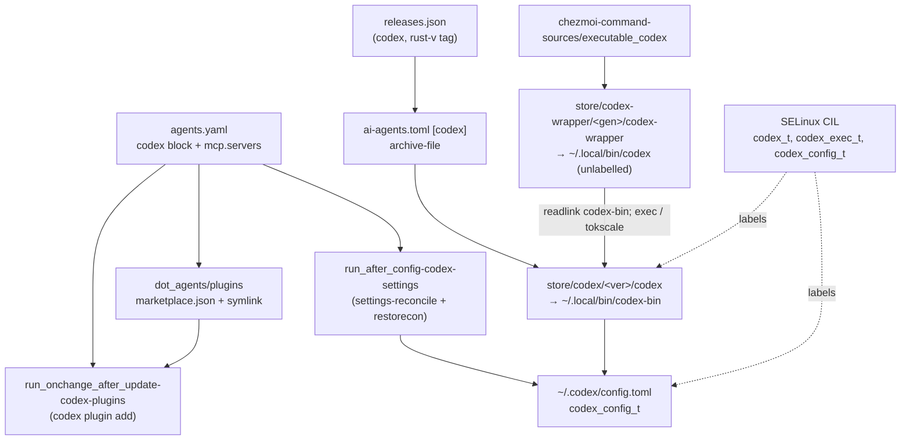

# Manage Codex as a Third Agent Harness - Plan

## Goal Capsule

- **Objective:** A host that applies these dotfiles gets OpenAI Codex CLI (`codex`) with the same instructions, skills, MCP servers, and compound-engineering plugin as Claude Code and Antigravity, with its configuration protected the same way, and with headless `codex exec` usage metered by tokscale.
- **Means:** Restore `codex` as a managed harness declared in `.chezmoidata/agents.yaml`, provisioned through the release lock and the command store (KTD1), asserting declared `config.toml` leaves and MCP tables through the existing TOML-leaf reconciler (KTD2), installing the plugin through Codex's personal marketplace (KTD3), confining it under a `codex_t` domain (KTD4), and metering `codex exec` through a command-store wrapper (KTD5).
- **Product authority:** The user's session-settled decisions govern surface coverage, the `config.toml` ownership model, and the tokscale scope. The root `AGENTS.md` governs repository convention; `docs/plans/2026-09-02-1124-feat-manage-claude-antigravity-harnesses-selinux-protection-plan.md` is the harness-management precedent this plan mirrors.
- **Execution profile:** Coordinated chezmoi source additions across `.chezmoidata/`, `.chezmoiexternals/`, `.chezmoitemplates/`, `.chezmoiscripts/`, `dot_codex/`, `dot_agents/`, `dot_local/share/chezmoi-command-sources/`, `packages/release-lock/`, `system/linux/selinux/`, `.ci/`, and `.github/workflows/`. Every render is proven in an isolated scratch destination with `--source "$PWD"`; nothing applies to the live `$HOME`.
- **Stop conditions:** Stop if the release lock cannot resolve an `openai/codex` asset for every declared platform; if the installed `codex` binary exposes no plugin-install command and no marketplace discovery path this plan can drive; if a SELinux rule would grant a protected type a base attribute or label a file outside `~/.codex` or the command store; or if a change would touch state belonging to `claude`, `agy`, or `aoe`.
- **Tail ownership:** Local proof is isolated rendering plus the `.ci/` and `packages/` test suites. The pull request owns `ci.yml` and `render-dotfiles.yml`. The host-local operator steps in Documentation / Operational Notes are documented, not automated.
- **Product Contract preservation:** changed: R11 — the `model` leaf is not declared; the declared set is the approval, sandbox, and reasoning-effort posture (see Assumptions A6). R8 gained a qualifier: removal from the inventory does not prune a server from `config.toml`. R12 gained a qualifier: no named transition labels a file outside `~/.codex` or the command store. R13 and R15 gained a qualifier: the wrapper carries no entrypoint label. Added R21 (prune the stale `~/.codex/codex.toml`) and R22 (the wrapper and the real binary hold distinct public command names). All other R-IDs unchanged.

---

## Product Contract

### Summary

Add `codex` to the managed harness set beside `claude` and `agy`. One `agents.yaml` block declares its settings, plugins, and removals; the shared instruction core renders `~/.codex/AGENTS.md`; `~/.codex/skills` links to the canonical skills root; MCP servers render into `config.toml`; the compound-engineering plugin is reconciled; a `codex_t` SELinux domain lets Codex and chezmoi write `config.toml` while every other process only reads it. The `codex exec` tokscale wrapper returns with its test.

### Problem Frame

Codex was unmanaged on 2026-08-05 together with Claude Code, when `omp` was the sole harness. Claude Code and Antigravity were re-managed on 2026-09-02, but Codex was not. Today the repository carries only fragments of Codex: the SELinux module labels `~/.codex/config.toml` and `~/.codex/skills` as chezmoi-only, and `dot_codex/` holds a single 0-byte `readonly_codex.toml` that deploys an empty `~/.codex/codex.toml`, a filename Codex never reads. The host has no `codex` binary and a bare `~/.codex/skills` directory.

The user wants Codex mainly for headless `codex exec` runs. Without management, each host needs a manual install, a hand-written `config.toml` for MCP servers, a separate skills copy, and no usage metering. Because the existing SELinux label makes `config.toml` chezmoi-only, a manually installed Codex could not even persist project trust or hook state on Fedora.

### Key Decisions

- **KD1. Codex is a full-parity managed harness.** All four surfaces are managed: instructions plus skills symlink, MCP servers, compound-engineering plugin, and settings leaves. (session-settled: user-directed — chosen over an instructions-plus-skills baseline: every harness should see the same tool set.) Governs R1, R5, R6, R8, R9, R10. Conflict call-out on R6: Codex already scans `~/.agents/skills` natively and treats `~/.codex/skills` as a deprecated compatibility root, so the symlink is parity, not necessity; U2 verifies that skills are listed once and records the fallback if they are not.
- **KD2. `config.toml` is asserted per key, with a dedicated `codex_t` domain.** Declared leaves are asserted on every apply; undeclared keys survive; SELinux lets `chezmoi_t` and `codex_t` write the file and every other domain read it. (session-settled: user-directed — chosen over a whole-file managed-readonly target and over dropping the SELinux label: Codex must persist project trust, `codex mcp add` results, and hook state itself.) Governs R8, R10, R11, R12, R13, R14.
- **KD3. The `codex exec` tokscale wrapper is in scope.** Headless exec is the primary use, so usage metering is core value, not a follow-up. (session-settled: user-directed — chosen over deferring the wrapper: the user picked inclusion over the recommended deferral.) Governs R17, R18, R22.
- **KD4. Binary provisioning goes through the release lock.** The `codex` CLI is an external resolved from `openai/codex` GitHub releases by `packages/release-lock`, never a render-time fetch or a package-manager install. Repository convention; mirrors KD2 of the 2026-09-02 plan. Governs R2.
- **KD5. Child `codex exec` launched from another agent stays confined.** The `codex_t` transition is granted from the other agent domains as well as from unconfined shells, so a Codex started by Claude Code, Antigravity, or aoe does not fall back to `unconfined_t` and lose write access to its own config. Governs R13.
- **KD6. aoe registration stays in scope as a low-cost inclusion.** Headless use is primary, but registering `codex` as an aoe custom agent costs one declared leaf. Governs R4.
- **KD7. The stray empty target is removed and pruned.** `dot_codex/readonly_codex.toml` is deleted; hosts that already received `~/.codex/codex.toml` lose it through `.chezmoiremove`, because the file holds no live state. Governs R7, R21.

### Requirements

**Harness declaration and binary**

- R1. `codex` is a member of the managed harness set everywhere the repository enumerates harnesses: the MCP helper's valid harness list, the plugin row validator's `agents.<harness>` lookup, the SELinux apply script, and the documentation.
- R2. The `codex` CLI is provisioned on Linux and macOS as a release-lock external from `openai/codex` releases, with its URL and digest read from `.chezmoidata/releases.json`; no template resolves a release at render time.
- R3. `agents.yaml` carries an `agents.codex` block with `settings`, `plugins`, and `pluginsRemoved`, in the same shape as `agents.claude`.
- R4. aoe's declared config registers `codex` as a custom agent with its agent-detection entry, alongside `claude`.

**Instructions and skills**

- R5. `~/.codex/AGENTS.md` renders from the shared instruction core and receives text byte-identical to the Claude Code and Antigravity instruction files; the core's opening line names all three targets.
- R6. `~/.codex/skills` is a chezmoi-managed symlink to `~/.agents/skills`, matching the Claude Code and Antigravity symlinks.
- R7. `dot_codex/readonly_codex.toml` is deleted; no `~/.codex/codex.toml` is deployed.
- R21. A `.chezmoiremove` entry prunes `~/.codex/codex.toml` from hosts that already received it.

**MCP servers**

- R8. Every eligible server in `agents.mcp.servers` renders into the `mcp_servers` table of `~/.codex/config.toml`, stdio and HTTP alike, with `op://` header references resolved at apply time; a `harnessSkip` entry naming `codex` is valid. A server removed from the inventory, or newly skipped for `codex`, stays in `config.toml` until removed by hand.

**Plugins**

- R9. The compound-engineering plugin declared in `agents.codex.plugins` is installed and enabled in Codex from the pinned local archive through Codex's personal plugin marketplace discovery, and `pluginsRemoved` rows are uninstalled; the reconciliation is idempotent across applies.

**Settings**

- R10. Each leaf declared in `agents.codex.settings` is asserted into `~/.codex/config.toml` on every apply; every undeclared key, including project trust entries and hook state written by Codex, is preserved.
- R11. The declared leaf set covers the headless-exec posture: the approval policy, the sandbox mode with its network access, and the reasoning effort; the `model` leaf stays undeclared so Codex follows its vendor default.

**SELinux protection (Fedora)**

- R12. `~/.codex/config.toml` moves from `protected_agent_config_t` to a Codex-owned config type writable by `chezmoi_t` and `codex_t`; `~/.codex/skills` lands in that type and resolves into the chezmoi-only skills root. Codex runtime state under `~/.codex` stays on `user_home_t`, and no named file transition may label a file outside `~/.codex` or the command store.
- R13. A `codex_t` domain with a `codex_exec_t` entrypoint is labelled on the real binary in the versioned command store by a named file transition, and the domain transition is granted from `unconfined_domain_type`, which already contains `claude_t`, `agy_t`, and `aoe_t`; the wrapper carries no entrypoint label and runs in its launcher's domain.
- R14. `codex_t` receives read, traverse, map, execute, and watch on the other harnesses' config types and nothing more; the other agent domains receive the same on the Codex config type.
- R15. The SELinux apply script relabels the Codex paths, including the command-store entrypoint, includes the Codex config type in its reclaim sweep, and lists running `codex` processes that are not yet in an agent domain, as it does for `claude`, `agy`, and `aoe`.
- R16. `.ci/test-selinux-protected-configs.sh` asserts the Codex filecons, the writer and non-writer pairs for the Codex config type, the absence of any base-attribute grant on it, and the absence of any transition that labels a `user_home_t` file with it.

**tokscale wrapper**

- R17. Invoking `codex exec …` routes through tokscale; every other invocation reaches the real binary with arguments, output, and exit status unchanged, without recursion, and without bypassing the `codex_exec_t` entrypoint.
- R18. The wrapper has an isolated behaviour test under `.ci/` that CI runs.
- R22. The public command `codex` is the wrapper; the real binary keeps a distinct public command name, so the command store never places two links at one path, and a pre-existing regular file at `~/.local/bin/codex` is taken over rather than reported as a conflict.

**Documentation and CI**

- R19. `AGENTS.md` and `README.md` describe `claude`, `agy`, and `codex` as the managed set; the README host-cleanup section that calls Claude Code and Codex unmanaged is rewritten.
- R20. `.github/workflows/render-dotfiles.yml` and `ci.yml` render and assert the Codex targets on Linux and macOS; SELinux assertions run only where the existing `selinux-policy` job runs.

### Key Flows

- F1. Apply converges a host
  - **Trigger:** Operator runs `chezmoi apply`.
  - **Steps:** The release-lock external installs the `codex` binary into the command store; the instruction file, skills symlink, and wrapper deploy; the settings reconciler asserts declared `config.toml` leaves and MCP entries; the plugin reconciler installs compound-engineering; the SELinux module installs and relabels.
  - **Outcome:** Codex sees the same instructions, skills, MCP servers, and plugin as the other harnesses.
  - **Covered by:** R2, R5, R6, R8, R9, R10, R15

- F2. Headless run from another agent
  - **Trigger:** A Claude Code session runs `codex exec "…"` as a child process.
  - **Steps:** The wrapper routes the call through tokscale; the real binary execs from the command store; the kernel transitions `claude_t` to `codex_t`; Codex reads `config.toml` and writes its session state and any trust entry.
  - **Outcome:** The run is metered and Codex keeps write access to its own config.
  - **Covered by:** R13, R17

- F3. Codex's own edit survives apply
  - **Trigger:** Codex writes a project trust entry or hook state into `config.toml`; the operator applies later.
  - **Steps:** The reconciler re-asserts declared leaves only.
  - **Outcome:** The Codex-written keys remain; a declared key changed by hand is reverted.
  - **Covered by:** R10

### Acceptance Examples

- AE1. **Covers R7, R21.** Given the source tree after this change, when listing `dot_codex/`, then no `readonly_codex.toml` exists, a rendered apply creates no `~/.codex/codex.toml`, and an isolated apply against a home seeded with that file removes it.
- AE2. **Covers R10.** Given `config.toml` containing a Codex-written `[projects."/home/user/repo"]` table and a declared `approval_policy` leaf edited by hand, when apply runs, then the projects table is unchanged and the leaf equals the declared value.
- AE3. **Covers R13.** Given Fedora enforcing and a `claude` process in `claude_t`, when it runs `codex exec`, then the child runs in `codex_t` and a write to `~/.codex/config.toml` succeeds; when a login shell runs `echo >> ~/.codex/config.toml`, then it is denied.
- AE4. **Covers R17, R22.** Given the wrapper on PATH, when `codex exec "task"` runs, then tokscale wraps the real binary; when `codex --version` runs, then output and exit status match the real binary exactly.
- AE5. **Covers R8.** Given `agents.mcp.servers` declaring `codegraph` (stdio) and `websearch` (HTTP with an `op://` header), when the render runs, then `config.toml` carries both under `mcp_servers` with the header resolved.
- AE6. **Covers R6.** Given a provisioned host, when listing `~/.codex/skills`, then it is a symlink to `~/.agents/skills`.

### Success Criteria

- Every changed template renders through `chezmoi execute-template --source "$PWD"` without error in the isolated scratch setup `AGENTS.md` prescribes.
- `packages/release-lock` tests pass and the regenerated lock carries a `codex` entry with per-platform digests.
- `.ci/test-selinux-protected-configs.sh`, the wrapper test, the settings and plugin reconcile tests, `.ci/check-skip-declarations.sh`, `.ci/test-ci-wiring.sh`, and `.ci/check-release-lock-digests.sh` pass; `ci.yml` and `render-dotfiles.yml` are green.
- The three instruction files are byte-identical after render.

### Scope Boundaries

- The former Codex `mxm4-haptic` hook plugin is not restored; haptics were removed from every harness on 2026-09-02.
- Windows is out; `agents.validOS` is Linux and macOS.
- Codex sign-in and OAuth stores are not managed; authentication stays in Codex's native flow.
- No aoe default session is repointed to `codex`; only the custom-agent registration is added.
- Codex TUI-specific tuning beyond the declared leaves is out.
- Pruning MCP servers from `config.toml` when they leave the inventory is out (R8); the inventory only adds and updates.

#### Deferred to Follow-Up Work

- Moving the host-local `~/.codex/skills/android-cli` skill into a managed source under `dot_agents/skills/`; this change only documents the operator step.
- An in-place write mode for `packages/settings-reconcile` so a reconciled file keeps its SELinux label without `restorecon`; this change repairs the label after the write, as the Claude Code reconciler does.
- Pinning `tokscale` to an exact version in its own command-source wrapper.
- The `settings.json` named transitions still let `claude_t` and `aoe_t` stamp `claude_config_t` onto a project's `.vscode/settings.json` under `~/src`; U6 narrows their source so `codex_t` is not affected, and the remaining capture for the Claude writers is a separate narrowing.
- A prune path for MCP servers removed from `agents.mcp.servers` (R8 boundary).

### Dependencies and Assumptions

- A1. Codex reads `~/.codex/AGENTS.md` unconditionally as global instructions and `mcp_servers` from `~/.codex/config.toml`; confirmed against Codex source on 2026-09-05.
- A2. Codex discovers a personal plugin marketplace at `~/.agents/plugins/marketplace.json`, requires local plugin paths to start with `./`, and installs with `codex plugin add <plugin>@<marketplace>`; confirmed against Codex source, except that the exact `codex plugin` subcommand names and where Codex records installed plugins are checked against the installed binary in U4.
- A3. Codex follows a symlinked `~/.codex/skills`; confirmed for user-scope roots in Codex source. Whether it deduplicates a skill reachable through both `~/.codex/skills` and `~/.agents/skills` is unverified until U2's host check.
- A4. `openai/codex` publishes `codex-<rust-target>.tar.gz` assets for linux musl and darwin under `rust-v` tags, with the GitHub release API supplying per-asset digests; confirmed for `rust-v0.153.4`. The same prefix also carries `rust-v…-alpha.N` prereleases, so the lock resolver must skip prereleases (KTD6). The entry inside each archive is expected to carry the platform triple in its name; U1 confirms it against one tarball.
- A5. `packages/settings-reconcile` asserts nested TOML tables recursively, replaces arrays whole, preserves undeclared keys, accepts any home directory with a `config.toml` target, and writes through a temp file plus rename; confirmed by reading its source.
- A6. The `model` leaf is left undeclared because the plan cannot verify a current Codex model id without a running binary, and the vendor default tracks the recommended model. Un-validated bet: the user may prefer a pinned model, as `agents.claude.settings` does.
- A7. The declared headless posture is `approval_policy = "never"`, `sandbox_mode = "workspace-write"`, `sandbox_workspace_write.network_access = true`, and `model_reasoning_effort = "high"`. Un-validated bet: this mirrors the Claude Code `skipDangerousModePermissionPrompt` posture while keeping the workspace sandbox; the user may prefer `danger-full-access` for unattended runs.
- A8. Resolved `op://` MCP header values land in `config.toml`, which every process of the user can read under the read-open policy; this matches `~/.mcp.json` today. Accepted parity; Codex's own `codex mcp list` and `codex mcp get` output is the one new disclosure path and is covered by an operator note.

### Outstanding Questions

**Deferred to Planning:** none remain; every fork from the requirements-only plan is resolved in the Planning Contract.

**Deferred to Implementation**

- The exact entry name inside the `codex-<target>.tar.gz` archive (U1).
- The exact `codex plugin` subcommand names, their exit status when a plugin is already installed, and whether the install writes anything under `~/.agents/plugins` (U4).
- Whether Codex lists a skill once when it is reachable through both roots (U2).

### Sources

- `docs/plans/2026-09-02-1124-feat-manage-claude-antigravity-harnesses-selinux-protection-plan.md` — the harness-management precedent.
- `docs/plans/2026-08-05-001-chore-unmanage-claude-codex-harnesses-plan.md` — what was removed and where.
- `docs/plans/2026-07-25-002-feat-codex-tokscale-wrapper-plan.md` — the wrapper's original contract.
- `docs/solutions/security-issues/selinux-user-scope-agent-config-protection.md` — the six SELinux corrections KTD4 applies.
- Git tree at `7e20338^` — the last managed Codex state: `dot_codex/readonly_AGENTS.md.tmpl`, `dot_local/bin/executable_codex`, `.ci/test-codex-tokscale-wrapper.sh`, and the `codex` release-lock registry entry.
- `system/linux/selinux/dotfiles_protected_agent_configs.cil` and `AGENTS.md` lines 62–70 — the domain and type model to extend.
- `packages/settings-reconcile/src/reconcile.ts` and `.chezmoiscripts/70-agents/run_after_config-aoe.sh.tmpl` — the TOML-leaf reconciler and its consumer shape.
- `packages/command-reconcile/src/reconcile.ts`, `packages/command-reconcile/src/producer.ts`, `.chezmoitemplates/command-manifest-validate.tmpl`, `.chezmoidata/commands.yaml` (`tokscale`, `aoe`, `codegraph` units) — the command store's source and external producers, `relPath`, and `legacy.path`.
- `.chezmoitemplates/agent-mcp-servers-json.tmpl`, `.chezmoitemplates/agent-plugin-rows.tmpl`, `.chezmoitemplates/local-archive-ref.tmpl` — the harness list, the plugin row validator, and the archive path owner.
- Codex source on `main` (2026-09-05): `codex-rs/config/src/mcp_types.rs`, `codex-rs/core-plugins/src/marketplace.rs`, `codex-rs/core-plugins/src/installed_marketplaces.rs`, `codex-rs/ext/skills/src/host_roots.rs`, `codex-rs/exec/src/cli.rs`, `codex-rs/config/src/config_layer_source.rs`; release `rust-v0.153.4` asset list.

---

## Planning Contract

### Key Technical Decisions

- KTD1. **Two command units share one tool: external unit `codex` publishes `codex-bin`, source unit `codex-wrapper` publishes `codex`.** The release-lock external lands the real binary in `store/codex/<version>/codex` (`relPath: codex`, as the `codegraph` unit does) with public link `~/.local/bin/codex-bin`; the `producer: source` unit deploys the wrapper script as public `codex` from a store file named `codex-wrapper` (`relPath: codex-wrapper`), so the `codex` named file transition never labels it, and declares `legacy: {path: .local/bin/codex}` so a host that still holds the pre-2026-08-05 wrapper file is taken over instead of reported as an ownership conflict. The manifest validator rejects duplicate public names, so this split is the only shape the store accepts. Cites R2, R17, R22. Rationale: the external unit id must stay `codex` so the SELinux filecon keeps the `store/<tool>/[^/]+/<tool>` shape the other harnesses use.
- KTD2. **One reconciler run asserts settings leaves and MCP tables into `config.toml`, with a stated ownership split.** `agents.codex.settings` owns scalar leaves; `agents.mcp.servers` owns each declared `mcp_servers.<name>` table; Codex owns `projects`, `hooks`, `plugins`, `marketplaces`, and every undeclared `mcp_servers.*` entry, including `codex mcp add` results. A new `run_after_config-codex-settings.sh.tmpl` composes one declared object from the two owners (the leaves validated at render time by a new `codex-settings-validate.tmpl`, which rejects the Codex-owned prefixes and `mcp_servers` because the declaration is not its owner), calls `settings-reconcile settings "$HOME/.codex" config.toml <declared.json>`, and restores the file's SELinux label afterwards, reporting rather than swallowing a failure to do so. (session-settled: user-directed — chosen over a whole-file `dot_codex/config.toml` target and over asserting without a protecting label: Codex writes project trust, hook state, and `codex mcp add` results into the same file.) Cites R8, R10, R11. Rationale: the reconciler's recursive overlay touches only declared keys, so hand-added `[mcp_servers.foo]` and `[projects."…"]` survive; its temp-and-rename write drops the label, so the script repairs it exactly as the Claude Code settings script does. Codex's system and managed config layers were also weighed and rejected: they live in root-owned, per-OS paths outside `$HOME`, and the user layer overrides the system layer, so a declared leaf there would not be authoritative.
- KTD3. **The compound-engineering archive is exposed to Codex through the chezmoi-owned personal marketplace.** `dot_agents/plugins/` deploys `~/.agents/plugins/marketplace.json`, whose `name` is one `agents.codex.personalMarketplace` key, listing one plugin per eligible `agents.codex.plugins` row with `source.path` `./<registry key>`, plus a symlink `~/.agents/plugins/<registry key>` whose absolute target is the row's resolved archive path from `agent-plugin-rows.tmpl`, so every path inside the file is `./`-relative as Codex requires and the archive path is computed in one place. A `run_onchange_after_update-codex-plugins.sh.tmpl` then runs `codex plugin add <plugin>@<personal marketplace>` per row and the matching removal for `pluginsRemoved`, treating "already installed" as converged. Cites R9. Rationale: the personal marketplace path is discovered without registration, `~/.agents/plugins` is already chezmoi-only under SELinux, and a version bump moves the symlink target with no re-registration. The symlink source filename hardcodes the registry key, so its template fails at render time when that key is not a `localArchive` marketplace, and a second local archive needs a second symlink source. Two fallbacks, by trigger: if `codex plugin add` cannot enable from the personal marketplace, register the same `~/.agents/plugins` directory through a `[marketplaces.<name>]` table composed inside the settings script beside `mcp_servers`, never through `agents.codex.settings`; if Codex writes install state under `~/.agents/plugins`, deploy `marketplace.json` and the archive symlink under a Codex-writable root such as `~/.codex/marketplaces/<name>/`, which carries no protected filecon, and register that path instead.
- KTD4. **`codex_config_t` joins `protected_agent_config_type`; `codex_t` joins `dotfiles_agent_domain`; no name-based transition targets `user_home_t`.** The new config type inherits the shared read grant, the `chezmoi_t` writer and relabel rules, and the five `associate` rules through the attribute, and gets writer rules for `codex_t` alone (file, dir, lnk_file, no relabel). The new domain inherits `unconfined_domain_type` membership through `dotfiles_agent_domain`, so the single `typetransition unconfined_domain_type codex_exec_t process codex_t` covers shells, `claude_t`, `agy_t`, `aoe_t`, and `chezmoi_t`. The named file transition `(typetransition chezmoi_t gconf_home_t file "codex" codex_exec_t)` labels the real binary at creation, and a filecon covers its store path; the wrapper's store file is named `codex-wrapper`, carries no exec label, and runs in its launcher's domain, so tokscale, mise, and node never enter `codex_t` and the transition fires only when the real binary execs. The two `settings.json` named transitions move from `dotfiles_agent_domain` to a new `claude_config_writer` attribute holding `claude_t` and `aoe_t`, so a `codex_t` process creating a project's `.vscode/settings.json` is not stamped with a type it cannot write. The `~/.codex/config.toml` and `~/.codex/skills` filecons are retyped in place to `codex_config_t`. There is no `config.toml` name transition: `~/.codex` is `user_home_t`, so such a rule would also capture a project's `.codex/config.toml` under `~/src` and lock git and editors out of it; label durability comes from the settings script's `restorecon` and the apply script's reclaim sweep instead. Cites R12, R13, R14, R15. Rationale: mirrors the `agy_t`/`gemini_config_t` block line for line and applies every correction in the SELinux solution doc.
- KTD5. **The wrapper resolves the real binary through the public `codex-bin` link, never through PATH or an environment override.** The wrapper resolves `~/.local/bin/codex-bin` with `readlink -f` (its test controls `HOME`, not an override variable), execs that file directly for every subcommand except `exec`, and for `exec` prepends the resolved file's directory to PATH before `exec tokscale headless codex "$@"`, so tokscale's own `codex` lookup hits the real binary and cannot recurse into the wrapper. (session-settled: user-directed — chosen over deferring the wrapper: metering headless runs is the primary value.) Cites R17, R22. Rationale: the store's public contract is the `~/.local/bin` link; its internal `current/` layout belongs to `command-reconcile`.
- KTD6. **Release-lock entry uses `tagPrefix: "rust-v"`, a prerelease-skipping resolver, and the bare `codex-<target>.tar.gz` asset.** The registry entry mirrors the old one but selects the single-binary tarball rather than the `codex-package` bundle; the external is `archive-file` whose entry path is composed per platform from `.chezmoi.os` and `.chezmoi.arch`, as the `aoe` stanza does. The prefix resolver today takes the first tag with the prefix and ignores GitHub's `prerelease` and `draft` flags, so it would pin `rust-v…-alpha.N` builds; U1 extends it to skip prereleases and drafts. Cites R2. Rationale: the release API's per-asset digest covers the tarball, so no sidecar parsing is needed; the prefix filter skips the npm tags and the prerelease filter skips the alphas.
- KTD7. **Codex-specific CI tests mirror the Claude Code ones file for file.** New `.ci/test-codex-settings-reconcile.sh` and `.ci/test-codex-tokscale-wrapper.sh`, an extended `.ci/test-claude-agy-plugin-reconcile.sh`, and an extended `.ci/test-agent-instructions.sh` that renders `dot_codex/readonly_AGENTS.md.tmpl` and compares all three renders byte for byte, all wired into the existing `agent reconciliation` job. Cites R16, R18, R20. Rationale: `.ci/test-ci-wiring.sh` fails any unwired test, and the render workflow asserts deployed targets in an isolated home.

### High-Level Technical Design

Exec chain and domains at runtime: a shell or `claude_t` execs `~/.local/bin/codex` (wrapper, no exec label) and stays in its own domain; for `exec`, bash execs `tokscale` → `mise` → `node` (all in the launcher's domain) → real binary (`codex_exec_t`) → `codex_t`; for every other subcommand bash execs the real binary directly, which transitions the same way.

### System-Wide Impact

- **Enumerations that must change together:** the SELinux module gains a fourth object type and a fifth domain; the apply script's relabel list, reclaim sweep, stale-process filter and warning text, and the CI test's token list, writer matrix, path mirror, and reclaim selectors change in the same commit or CI fails. The MCP helper's harness list and the documentation's harness sentences are the other two enumerations.
- **Label lifecycle of `config.toml`:** the reconciler creates a `user_home_t` temp file, renames it over the target, and the script relabels it; Codex's own rewrites keep the label when in place and lose it when done by rename, until the next apply. During that window every unconfined process of the user may write the file. The policy script does not repair it because it runs only on policy change; the settings script does, on every apply, and reports when it cannot.
- **Label lifecycle of the entrypoint:** the real binary's store file is labelled at creation by the `gconf_home_t` transition and by filecon on relabel; the wrapper's store file, `current/` links, and `~/.local/bin` links carry no exec label by design; staging copies under `~/.local/share` stay on their default type. `~/.agents/plugins` is created by this change after the policy script's relabel step, so the plugin reconciler relabels that directory itself before the first `codex plugin add`.
- **Failure propagation, missing entrypoint label:** an unlabelled real binary drops Codex to `unconfined_t`, and its own `config.toml` writes fail with EACCES. The wrapper and the tokscale chain run in the launcher's domain by design, so nothing they execute can write `codex_config_t`.
- **Cross-domain named transitions:** `codex_t` joins `dotfiles_agent_domain`, so every named transition sourced from that attribute now fires for Codex; the `settings.json` transitions are re-sourced to `claude_config_writer` in U6 so a Codex-created project file is not stamped with a type Codex cannot write.
- **Security boundary, config:** `codex_config_t` is writable by `chezmoi_t` and `codex_t`, readable by every user domain; `claude_t`, `agy_t`, `aoe_t` cannot write it, and `codex_t` cannot write `claude_config_t`, `gemini_config_t`, or `protected_agent_config_t`, so `~/.agents/skills` and `~/.agents/plugins` stay chezmoi-only through the symlinks.
- **Security boundary, supply chain:** `npx -y tokscale` runs in the launcher's domain, never in `codex_t`, so network-fetched code gains no write on `codex_config_t`; the wrapper's own next hops (`tokscale`, `mise`, `npx`) are PATH lookups in that same domain.
- **Security boundary, secrets:** resolved `op://` headers live in `config.toml` at mode 0600 with the same read set as `~/.mcp.json`; `codex mcp list` and `codex mcp get` print them, and an orphaned reconciler temp file would hold them, so the settings script removes stale temp files before writing.
- **Policy reinstall side effect:** installing the module strands running `claude`, `agy`, `aoe`, and pre-policy `codex` processes in `unconfined_t`; the apply script lists `codex` too and the apply runs from a plain shell.
- **Cross-harness effect:** `agents.mcp.servers` now renders into three targets, so a header rotation triggers a `config.toml` drift write and a relabel on the next apply; `~/.codex/AGENTS.md` and the skills symlink are managed-readonly like `~/.gemini`.
- **State touched by removal:** `.chezmoiremove` prunes only `~/.codex/codex.toml`; sessions, logs, and sqlite state under `~/.codex` stay `user_home_t` and are never relabelled, keeping the Bun-cache hardlink guarantee.
- **CI coverage boundary:** SELinux assertions run only in the `selinux-policy` job; the wrapper, settings, plugin, and instruction tests run on every leg. The label window and the plugin write location are provable only by the compiled-policy checks and the host smoke steps in U3, U4, and U6.

### Assumptions

- A6, A7, and A8 in the Product Contract are the un-validated bets this headless run made; they are recorded there once and not restated.
- The `codex plugin add` command exists on `rust-v0.153.4` with the `<plugin>@<marketplace>` form and records installs in `config.toml`; U4 checks the installed binary and audit log before writing the reconciler and switches to the KTD3 fallback when either fails.
- `chezmoi` extracts `.tar.gz` entries for `archive-file` externals on both platforms, as it does for `aoe`.

### Sequencing

U1 first (the lock and command units everything else links to), then U2, then U3 (which depends on U2), U4 after U2 and U3 (it needs the codex block and the marketplace symlink), U5 after U1, U6 after U1 (it labels the real binary's store path), U7 last. The change lands as one pull request, so a Fedora host never applies U3 without U6.

---

## Implementation Units

### U1. Provision the codex binary through the release lock and the command store

- **Goal:** `codex` resolves in the lock, lands in the command store, and is reachable as `~/.local/bin/codex-bin`.
- **Requirements:** R2, R22; KTD1, KTD6.
- **Dependencies:** none.
- **Files:** `packages/release-lock/src/registry.ts`, `packages/release-lock/test/registry.test.ts`, `.chezmoidata/releases.json` (regenerated, never hand-edited), `.chezmoiexternals/ai-agents.toml`, `.chezmoidata/commands.yaml`.
- **Approach:**
  1. Extend the prefix resolver in `packages/release-lock/src/github.ts` to skip releases whose `prerelease` or `draft` flag is true, with a test case where an alpha-tagged prerelease precedes a stable `rust-v` release.
  2. Add a `codex` registry entry: `githubRelease`, source `openai/codex`, `tagPrefix: "rust-v"`, asset `codex-${rustArch(arch)}-${muslTarget(os)}.tar.gz` for linux and darwin.
  3. Add the four expected asset rows to the registry test's `EXPECTED` table.
  4. Regenerate the lock and run `.ci/check-release-lock-digests.sh`.
  5. Add a `[codex]` `archive-file` stanza to `ai-agents.toml` with `targetPath .local/share/chezmoi-commands/incomplete/codex/codex`, `checksum.sha256` from the lock, and `path` composed from `.chezmoi.os` and `.chezmoi.arch` with the registry's replacement chain (`codex-<x86_64|aarch64>-<unknown-linux-musl|apple-darwin>`); confirm against one downloaded tarball that the entry name equals the asset name without `.tar.gz`.
  6. Add a `commands.yaml` external unit `codex` (`tool: codex`, `commands: [{name: codex-bin, relPath: codex}]`, platforms linux and macos, mode 0755, no legacy path).
- **Patterns to follow:** the `aoe` stanza and unit; `codegraph`'s `relPath`; the `agent-browser` musl handling in `registry.ts`.
- **Test scenarios:**
  - `registry.test.ts` passes with the four codex rows and the selector partition check.
  - The prefix resolver test selects the stable `rust-v` release when an alpha prerelease and a draft precede it in the list.
  - The regenerated lock carries `releases.tools.codex` with `version` matching `rust-v<major>.<minor>.<patch>` with no prerelease suffix, and a sha256 for `linux-amd64`, `linux-arm64`, `darwin-amd64`, `darwin-arm64`.
  - `.ci/check-release-lock-digests.sh` passes.
  - Rendering `ai-agents.toml` in the isolated scratch setup yields a `[codex]` stanza whose URL matches the lock URL for the host platform, and rendering it for each of the four platforms yields four distinct `path` values matching the composed pattern.
  - The rendered command manifest contains unit `codex` publishing `codex-bin` and no unit publishing `codex` yet (U5 adds it).
- **Verification:** the lock, externals, and manifest render without error and name the same version; no template performs network I/O.

### U2. Declare the codex harness: data block, instructions, skills symlink, stale-target cleanup

- **Goal:** `agents.codex` exists, the harness lists accept `codex`, `~/.codex/AGENTS.md` and `~/.codex/skills` deploy, and the stray `codex.toml` is removed and pruned.
- **Requirements:** R1, R3, R4, R5, R6, R7, R21; KD1, KD6, KD7.
- **Dependencies:** none.
- **Files:** `.chezmoidata/agents.yaml`, `.chezmoitemplates/agent-mcp-servers-json.tmpl`, `.chezmoitemplates/agents-instructions.tmpl`, `dot_codex/readonly_AGENTS.md.tmpl` (new), `dot_codex/symlink_skills` (new), `dot_codex/readonly_codex.toml` (delete), `.chezmoiremove`, `.ci/test-agent-instructions.sh`.
- **Approach:**
  1. Add `agents.codex` with `settings` (values per A7), `personalMarketplace: dotfiles`, `plugins: [{name: compound-engineering, marketplace: compound-engineering-plugin}]`, `pluginsRemoved: []`; add `codex: codex` to `aoe.config.toml.session.custom_agents` and `agent_detect_as`.
  2. Widen `$validHarness` to `claude`, `agy`, `codex` and update the helper's header comment.
  3. Name `~/.codex/AGENTS.md` for Codex in the instruction core's opening line; add the one-line `dot_codex` wrapper template and the `../.agents/skills` symlink source, both copied from `dot_gemini/`.
  4. Delete `readonly_codex.toml`; add `.codex/codex.toml` to `.chezmoiremove` with the three-part comment the file's existing entries use (what was retired, what deleting the source left behind, why no gate), ungated because every OS received the file.
  5. Extend `.ci/test-agent-instructions.sh` to render the codex wrapper and assert byte-identity across the three renders.
- **Execution note:** After the first real apply on the Fedora host, confirm with the Codex skill listing that each skill appears once; if it appears twice, record the finding and keep the symlink pending the user's call (KD1 conflict call-out).
- **Patterns to follow:** `dot_gemini/readonly_AGENTS.md.tmpl`, `dot_gemini/symlink_skills`, the "Removed shared hub" block in `.chezmoiremove`.
- **Test scenarios:**
  - Covers AE1. Rendering the source with a scratch destination produces `~/.codex/AGENTS.md` and a `~/.codex/skills` symlink and no `~/.codex/codex.toml`; an isolated `apply` against a home seeded with an empty `.codex/codex.toml` removes it.
  - Covers AE6. The rendered symlink target is `../.agents/skills`.
  - The three instruction renders are byte-identical.
  - Rendering `agent-mcp-servers-json.tmpl` with harness `codex` returns every server that lacks a `harnessSkip` naming `codex`; harness `omp` still fails.
  - Rendering `run_after_config-aoe.sh.tmpl` emits `codex` under both `custom_agents` and `agent_detect_as`.
- **Verification:** all renders succeed in the isolated scratch setup; `.ci/test-agent-instructions.sh` passes.

### U3. Reconcile settings leaves and MCP servers into `~/.codex/config.toml`

- **Goal:** Every apply asserts the declared leaves and the `mcp_servers` table into `config.toml`, preserves undeclared keys, and restores the file's label.
- **Requirements:** R8, R10, R11; KTD2.
- **Dependencies:** U2 (the `codex` harness id and data block).
- **Files:** `.chezmoiscripts/70-agents/run_after_config-codex-settings.sh.tmpl` (new), `.chezmoitemplates/codex-settings-validate.tmpl` (new), `.ci/test-codex-settings-reconcile.sh` (new), `.github/workflows/ci.yml`.
- **Approach:**
  1. Write the validator with the six checks of `claude-settings-validate.tmpl`: map shape, dotted-path grammar, leaves only, no overlap, rejected namespaces `mcp_servers`, `projects`, `hooks`, `plugins`, `marketplaces`, and a security allowlist that names `approval_policy`, `sandbox_mode`, and `sandbox_workspace_write.network_access` as reviewed keys.
  2. Compose the declared JSON at render time: expand dotted leaves into nested objects, add `mcp_servers.<name>` entries mapped from the neutral inventory (`command`, `args`, optional `env` for stdio; `url` plus `http_headers` with `op://` values resolved by `resolve-op-refs-json.tmpl` for HTTP; no `type` discriminator, which is a `~/.mcp.json` shape Codex does not use).
  3. At apply, clone the aoe script's shape: check the reconciler contract, remove any stale `.config.toml.*.tmp` under `~/.codex`, write the JSON to a 0600 scratch file, run `settings-reconcile settings "$HOME/.codex" config.toml <json>`, then restore the file's label when `restorecon` exists and print a notice when it is absent or the resulting context is not the Codex config type. Allow a `CODEX_HOME` override for the test.
  4. Wire the new test into the `agent reconciliation` job next to the Claude one.
- **Patterns to follow:** `run_after_config-aoe.sh.tmpl` (reconciler call shape), `run_after_config-claude-settings.sh.tmpl` (header rationale, restorecon, test override), `claude-settings-validate.tmpl`, `private_readonly_dot_mcp.json.tmpl` (server mapping and header resolution), `.ci/test-claude-settings-reconcile.sh` (render-time validator assertions).
- **Test scenarios:**
  - Covers AE2. A seeded `config.toml` with `[projects."/tmp/repo"] trust_level = "trusted"`, a hand-changed `approval_policy`, and a hand-added `[mcp_servers.foo]` ends with the projects table and `foo` intact and `approval_policy` equal to the declared value.
  - Covers AE5. The rendered declared JSON carries `codegraph` with `command` and `args` and `websearch` with `url` and a resolved `http_headers` value from the stub `op`, and no `type` key.
  - Every resolved header value in the rendered output appears only under `mcp_servers.<name>.http_headers`.
  - A missing `config.toml` is created with only the declared content and mode 0600.
  - A declaration naming `mcp_servers.x` or `projects.x` fails at render time with the namespace error; an undeclared security-sensitive key outside the allowlist fails too.
  - A second run on the converged file writes nothing (the reconciler reports no change).
  - The script exits non-zero with a clear message when `settings-reconcile` is absent or its contract differs.
  - A stale `.config.toml.deadbeef.tmp` in the home is removed before the write.
- **Verification:** `.ci/test-codex-settings-reconcile.sh` passes locally and in CI; the render in the scratch setup contains no unresolved `op://`.

### U4. Reconcile the compound-engineering plugin into Codex

- **Goal:** Codex sees the pinned archive through the personal marketplace and has the plugin installed and enabled after apply, idempotently.
- **Requirements:** R9; KTD3.
- **Dependencies:** U2, U3.
- **Files:** `dot_agents/plugins/readonly_marketplace.json.tmpl` (new), `dot_agents/plugins/symlink_compound-engineering-plugin.tmpl` (new), `.chezmoiscripts/70-agents/run_onchange_after_update-codex-plugins.sh.tmpl` (new), `.ci/test-claude-agy-plugin-reconcile.sh` (extend), `.github/workflows/ci.yml`.
- **Approach:**
  1. Render `marketplace.json` from `agent-plugin-rows.tmpl` rows for `codex`: `name` from `agents.codex.personalMarketplace`, one plugin per row with `source: {source: local, path: ./<registry key>}` and the `AVAILABLE`/`ON_INSTALL` policy. Render the symlink target from the same row's resolved archive path (its fourth field), absolute, and fail the render when the filename's registry key is not a `localArchive` marketplace.
  2. Write the onchange reconciler with the Claude script's skeleton: fingerprint on `agents.yaml` and `releases.json`, PATH prefix, a hard `die` when `codex` is absent (the binary lands earlier in the same apply, as for `claude`), a best-effort relabel of `~/.agents/plugins` when `restorecon` exists (the directory is created after the policy script's relabel step), removals first, then `codex plugin add <name>@<personal marketplace>` per row with the already-installed message treated as converged; any other conditional exit goes through `skip.sh.tmpl` and gets its skip-matrix row.
  3. Before finalising the subcommand names, run the store binary's `codex plugin --help` on the host and adjust; after the first host `codex plugin add`, check the audit log for denials on `protected_agent_config_t` and confirm nothing new appeared under `~/.agents/plugins`. If the plugin cannot be enabled, apply KTD3's first fallback in U3's script; if Codex wrote under `~/.agents/plugins`, apply KTD3's second fallback and move the marketplace root.
  4. Extend the plugin-reconcile CI test to render the codex script and assert the row needle, the CLI verbs, and the no-bare-`exit 0` scan.
- **Execution note:** This is packaging and CLI choreography; prove it with the rendered-script test plus one host smoke run rather than unit coverage.
- **Patterns to follow:** `run_onchange_after_update-claude-plugins.sh.tmpl`, `agent-plugin-rows.tmpl` consumers, `.ci/test-claude-agy-plugin-reconcile.sh` needles. There is no templated symlink source in the repo yet; this is the first.
- **Test scenarios:**
  - The rendered `marketplace.json` is valid JSON, names `compound-engineering` with path `./compound-engineering-plugin`, and contains no absolute path.
  - The rendered symlink target equals the archive path the plugin row resolves for the lock's current segment.
  - Renaming the symlink source to a key absent from `agents.marketplaces` makes the render fail.
  - The rendered reconciler carries the `compound-engineering\tcompound-engineering-plugin\tlocalArchive\t` row needle and the `codex plugin` verbs.
  - With an empty `agents.codex.plugins`, the script renders the no-eligible-plugins notice and no loop.
  - `.ci/check-skip-declarations.sh` accepts the script.
- **Verification:** the reconcile test and skip check pass; on the host, `codex plugin list` shows `compound-engineering` enabled after apply and the audit log shows no denial on `protected_agent_config_t`.

### U5. Restore the `codex exec` tokscale wrapper as a command-store source unit

- **Goal:** `~/.local/bin/codex` is the wrapper; `codex exec` is metered; everything else passes through.
- **Requirements:** R17, R18, R22; KTD1, KTD5.
- **Dependencies:** U1.
- **Files:** `dot_local/share/chezmoi-command-sources/executable_codex` (new), `.chezmoidata/commands.yaml`, `.ci/test-codex-tokscale-wrapper.sh` (new), `.github/workflows/ci.yml`.
- **Approach:**
  1. Write the wrapper per KTD5: `set -euo pipefail`, resolve `$HOME/.local/bin/codex-bin` with `readlink -f` (no environment override; the test controls `HOME`), exec it directly except for `exec`, where its directory is prepended to PATH before `exec tokscale headless codex "$@"`.
  2. Add a `commands.yaml` source unit `codex-wrapper` with `safetyProfile: interpreted`, mode 0755, platforms linux and macos, `sourcePath` to the wrapper, `commands: [{name: codex, relPath: codex-wrapper}]`, and `legacy: {path: .local/bin/codex}`.
  3. Port the old wrapper test: fake real binary behind a fake `codex-bin` link, fake `tokscale`, `mise`, and `npx` capture scripts; keep the argv and exit-status matrix; replace the retired installer guard with an assertion that no source other than the wrapper unit publishes `codex`.
  4. Wire the test into `ci.yml`.
- **Patterns to follow:** the `tokscale` source unit, the old `dot_local/bin/executable_codex` and `.ci/test-codex-tokscale-wrapper.sh` at `7e20338^`.
- **Test scenarios:**
  - Covers AE4. `codex exec task` invokes `tokscale headless codex exec task` and tokscale resolves `codex` to the real binary path.
  - Covers AE4. `codex --version` and `codex login --help` reach the real binary with identical argv and propagate its exit status, including a non-zero one.
  - `codex` with no arguments reaches the real binary with empty argv.
  - Arguments containing spaces and leading dashes pass through unchanged in both paths.
  - The wrapper fails with a clear message when `~/.local/bin/codex-bin` is missing.
  - The rendered manifest publishes `codex` from `codex-wrapper` (store file `codex-wrapper`) and `codex-bin` from `codex` with no duplicate public name, and `codex-wrapper` declares the legacy path.
  - The wrapper source contains no environment-variable override for the real binary's path.
- **Verification:** `.ci/test-codex-tokscale-wrapper.sh` passes; the manifest validator renders without the duplicate-command error.

### U6. Confine Codex under `codex_t` with a Codex-owned config type

- **Goal:** `config.toml` is writable only by `chezmoi_t` and `codex_t`; the real binary transitions from every launcher; the apply script and CI test cover Codex.
- **Requirements:** R12, R13, R14, R15, R16; KTD4.
- **Dependencies:** U1.
- **Files:** `system/linux/selinux/dotfiles_protected_agent_configs.cil`, `.chezmoiscripts/00-tools/run_onchange_before_00-selinux-policies.sh.tmpl`, `.ci/test-selinux-protected-configs.sh`.
- **Approach:**
  1. Declare `codex_t`, `codex_exec_t`, `codex_config_t` with roletypes; add `codex_t` to `dotfiles_agent_domain`, `codex_exec_t` to `dotfiles_agent_exec`, `codex_config_t` to `protected_agent_config_type`.
  2. Add the process transition from `unconfined_domain_type`, the entrypoint allow, the three writer rules for `codex_t` on `codex_config_t` mirroring the `agy_t` lines, and the one named file transition for the store file named `codex`. Add no `config.toml` transition. Declare a `claude_config_writer` attribute holding `claude_t` and `aoe_t` and re-source the two `settings.json` named transitions from `dotfiles_agent_domain` to it.
  3. Retype the existing `~/.codex/config.toml` and `~/.codex/skills` filecons in place to `codex_config_t` (the skills entry as a symlink class, like `~/.gemini/skills`); add `store/codex/[^/]+/codex` as `codex_exec_t`; add no filecon for the wrapper's store file or for `~/.local/bin/codex`; leave `~/.codex/sessions` and other runtime state unlabelled.
  4. In the apply script, add the `store/codex` path to the relabel list, `codex_config_t` to the reclaim sweep, `codex` to the stale-process `pgrep` alternation and `codex_t` to the domain `case`, and `codex` to the warning text.
  5. Extend the CI test: the new and retyped filecon tokens, the fourth `gconf_home_t` transition token, the re-sourced `settings.json` transition tokens, `codex_config_t` in the base-attribute rejection loop, the six forbidden-writer pairs (`claude_t`, `agy_t`, `aoe_t` on `codex_config_t`; `codex_t` on the three other protected types), no relabel permission for `codex_t`, no transition whose target is `user_home_t` and result `codex_config_t`, no transition sourced from `dotfiles_agent_domain` whose result is `claude_config_t`, and the path mirror and reclaim selectors.
  6. Update the AGENTS.md sentence that documents the type split (U7 carries the edit).
- **Execution note:** Compile the module with `secilc` against the CI stub before touching the host; a policy reinstall strands running agent sessions, so the host apply is an operator step from a plain shell. On the host, after apply, trigger one Codex-side rewrite of `config.toml` (for example `codex mcp add` then `codex mcp remove`) and record in Risks & Dependencies whether the file kept `codex_config_t`; that answer decides whether the writer split holds between applies or only until Codex's first write.
- **Patterns to follow:** the `agy_t`/`gemini_config_t` block in the CIL; the solution doc's six corrections.
- **Test scenarios:**
  - Covers AE3. The compiled policy allows `codex_t` and `chezmoi_t` `write` on `codex_config_t` and denies it for `unconfined_t`, `claude_t`, `agy_t`, `aoe_t`.
  - `codex_t` has read, getattr, open, map on `claude_config_t`, `gemini_config_t`, `protected_agent_config_t` and no write or relabel permission.
  - `unconfined_domain_type` transitions to `codex_t` on `codex_exec_t`, and `codex_t` may enter `codex_exec_t`.
  - No `typeattributeset` places `codex_config_t` in a base attribute; the five `associate` rules cover it through the shared attribute.
  - No `typetransition` with target `user_home_t` results in `codex_config_t`.
  - `codex_t` creating a file named `settings.json` in a `user_home_t` directory yields `user_home_t`; `claude_t` and `aoe_t` doing the same still yield `claude_config_t`.
  - The apply script's rendered text lists the `store/codex` path, the reclaim selector, and `codex` in the process enumeration; the CI test's mirrors match.
- **Verification:** `.ci/test-selinux-protected-configs.sh` passes with `secilc` and `setools` present; the apply script renders in the scratch setup.

### U7. Update documentation and CI wiring

- **Goal:** Docs describe three harnesses; every new test runs in CI; the render workflow asserts the new targets.
- **Requirements:** R19, R20; KTD7.
- **Dependencies:** U1–U6.
- **Files:** `AGENTS.md`, `README.md`, `.github/workflows/ci.yml`, `.github/workflows/render-dotfiles.yml`.
- **Approach:**
  1. Rewrite the managed-set sentences in `AGENTS.md` (script-tree table, harness set, instruction targets, the SELinux type split and its four object types, the settings-assertion paragraph, the data-file table) to include `codex`, the wrapper split, and the `config.toml` ownership statement from KTD2.
  2. Replace the README host-cleanup section: Claude Code and Codex are managed again; document the operator steps from the Operational Notes below.
  3. Add the codex reconciler renders to the `agent reconciliation` job's render loop and its test list; confirm `.ci/test-ci-wiring.sh` passes.
  4. In the render workflow, seed `~/.codex/codex.toml` as a prune canary and assert it is gone after apply; assert `~/.codex/AGENTS.md` exists, `~/.codex/skills` is a symlink, and `~/.agents/plugins/marketplace.json` exists.
- **Patterns to follow:** the 2026-09-02 plan's documentation unit; the render workflow's existing canary and target assertions.
- **Test scenarios:**
  - `Test expectation: none -- documentation and workflow wiring; proven by the CI runs themselves.`
- **Verification:** `.ci/test-ci-wiring.sh` passes; `render-dotfiles.yml` and `ci.yml` are green on the PR.

---

## Verification Contract

| Check | Command | Applies to |
|---|---|---|
| Isolated render of every changed template and script | `env PATH="$scratch/bin:$PATH" chezmoi --config "$scratch/empty.toml" --source "$PWD" --destination "$scratch/target" execute-template < <file>` per `AGENTS.md` | U1–U6 |
| Release-lock tests and lock regeneration | `bun run packages/release-lock/src/cli.ts --out .chezmoidata/releases.json`; `.ci/check-release-lock-digests.sh`; `vp run -r test` from `packages/` | U1 |
| Settings reconcile | `.ci/test-codex-settings-reconcile.sh` and `.ci/test-build-settings-reconcile.sh` | U3 |
| Plugin reconcile and skip declarations | `.ci/test-claude-agy-plugin-reconcile.sh` (extended); `.ci/check-skip-declarations.sh` | U4 |
| Wrapper behaviour | `.ci/test-codex-tokscale-wrapper.sh` | U5 |
| SELinux policy | `.ci/test-selinux-protected-configs.sh` (with `secilc`, `python3-setools`) | U6 |
| Instruction parity | `.ci/test-agent-instructions.sh` | U2 |
| CI wiring and workflows | `.ci/test-ci-wiring.sh`; `render-dotfiles.yml`; `ci.yml` | U7 |

Every script is compared as rendered text on both sides; no verification step applies to the live `$HOME`.

---

## Definition of Done

- Every requirement R1–R22 is implemented and traced to a unit.
- All commands in the Verification Contract pass locally in the isolated scratch setup, and both workflows are green on the PR.
- No template or script resolves a release at render time; the lock is regenerated, not hand-edited.
- No protected SELinux type carries a base attribute; no name-based transition yields `codex_config_t` from `user_home_t`; no transition sourced from `dotfiles_agent_domain` yields `claude_config_t`; the CI test's writer matrix includes Codex.
- `AGENTS.md` and `README.md` describe three harnesses and the operator steps.
- No dead-end or experimental code remains; the old `~/.codex/packages/standalone` layout is not reintroduced.

---

## Documentation / Operational Notes

- **Operator step 1 (this host):** `~/.codex/skills` is a real directory holding `android-cli/`. Before the first apply, move that skill into `~/.agents/skills/android-cli` and remove the directory so the symlink can be placed.
- **Operator step 2 (Fedora hosts):** the policy reinstall strands running `claude`, `agy`, `aoe`, and `codex` processes; run the apply from a plain shell and re-exec listed agents, as the apply script instructs.
- **Operator step 3 (first host apply):** run `codex plugin --help` and `codex plugin add` once by hand as U4 describes, then check the audit log for denials before trusting the reconciler.
- `codex mcp list` and `codex mcp get` print resolved header values; do not paste their output into issues or pull requests.
- `.chezmoiremove` prunes `~/.codex/codex.toml`; nothing else under `~/.codex` is touched by removal.

## Risks & Dependencies

- Codex's `plugin` CLI surface and its write location are the least verified pieces; U4 checks both against the installed binary and carries a fallback (KTD3).
- Between a Codex-initiated rewrite of `config.toml` and the next apply, the file may sit on `user_home_t` if Codex writes through a temp-and-rename; the label is repaired at apply, matching the Claude Code settings precedent, and the reclaim sweep covers the type.
- Whether Codex rewrites `config.toml` in place or by rename is unverified; U6's host step records the observed label after a Codex write, and the deferred in-place write mode plus a repair path are the follow-up if the label does not survive.
- The lock refresh workflow must find a stable `rust-v` release with all four assets; a missing asset is a hard error by design, and prereleases are skipped by the resolver.
