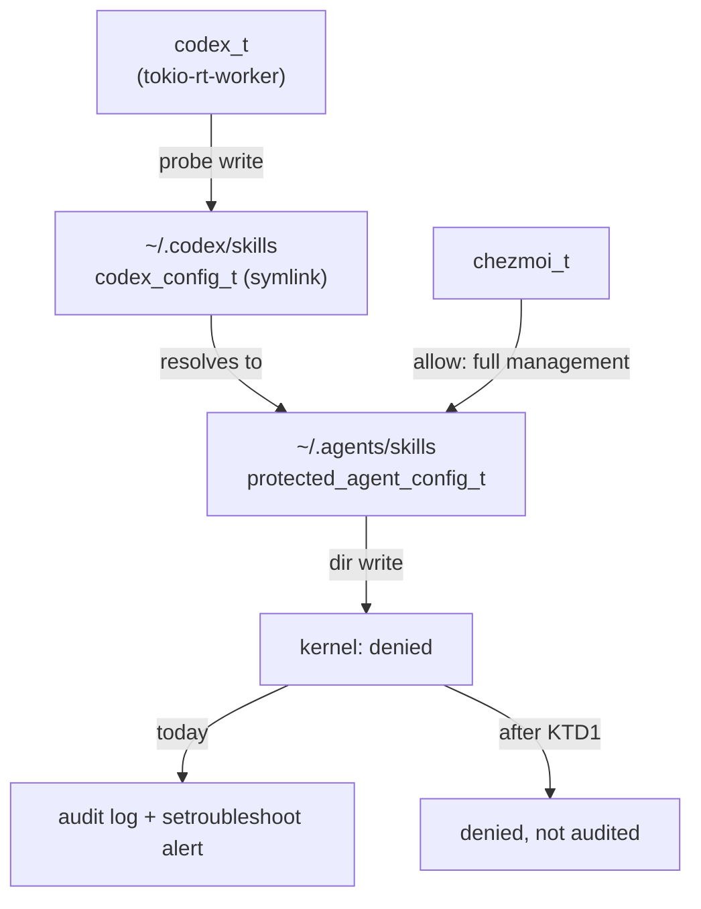

# Codex Skills-Root Write Denial - Plan

## Goal Capsule

- **Objective:** The operator stops receiving SELinux alerts raised by a confined agent harness for a denial the policy is designed to produce, and the canonical skills root stays writable by chezmoi alone.
- **Means:** Suppress the by-design denial for the one domain observed producing it, and close the gaps the diagnosis and review exposed (`~/.codex/skills` label drift; a CI boundary that accepted a directory-class grant on the protected roots). (KTD1)
- **Authority hierarchy:** Product Contract requirements (R-IDs) govern behavior. Key Technical Decisions (KTD-IDs) govern mechanism. The `AGENTS.md` SELinux section and `docs/solutions/security-issues/selinux-user-scope-agent-config-protection.md` are binding prior art.
- **Execution profile:** Small, policy-and-script change in one repository. No runtime service depends on it. U5 needs a live Codex observation before U1 lands; the closing confirmation needs a `chezmoi apply`.
- **Stop conditions:** Stop and report if any change would grant a write, create, unlink, rename, or relabel permission on `protected_agent_config_t` to a domain other than `chezmoi_t`. Stop if U5 finds the denial causes a user-visible Codex failure. Stop if `.ci/test-selinux-protected-configs.sh` cannot compile the module with `secilc`.
- **Tail ownership:** LFG owns commit, push, PR, and CI watch.

---

## Product Contract

### Summary

Add one `dontaudit` rule to `system/linux/selinux/dotfiles_protected_agent_configs.cil`, sourced from `codex_t` alone, so the observed writability probe against the chezmoi-only roots stops filling the audit log. Grant no new access. Restore the `~/.codex/skills` label on every apply instead of only when the policy file changes. Pin the rule as an active line in CI and, from the compiled policy, reject any other `dontaudit` that touches a protected type; the review that found the pre-existing `file`-only write matrix also required widening it to the `dir` class, which the boundary actually gates on. The rule removes the only runtime signal these roots had and nothing replaces it — see R8. Record the episode in the SELinux learning document.

### Problem Frame

Host `MS-7D91` reported a repeating AVC on 2026-09-07:

```
avc: denied { write } for pid=2121859 comm="tokio-rt-worker" name="skills"
  dev="dm-0" ino=15071
  scontext=unconfined_u:unconfined_r:codex_t:s0-s0:c0.c1023
  tcontext=unconfined_u:object_r:protected_agent_config_t:s0 tclass=dir permissive=0
```

Inode 15071 is `~/.agents/skills`, the canonical skills root. The policy assigns it `protected_agent_config_t`, whose sole writer is `chezmoi_t`. Codex reached it through the `~/.codex/skills` symlink and asked for directory write. The kernel refused, which is exactly what the split is built to do.

The setroubleshoot plugin proposed `ausearch … | audit2allow -M my-tokiortworker` followed by `semodule -X 300 -i`. That module would grant `codex_t` write on `protected_agent_config_t`. The same type also labels `~/.agents/plugins`, so the suggestion dissolves the chezmoi-only boundary for both roots. The learning document already records this class of suggestion as the one that must never be taken, and `.ci/test-selinux-protected-configs.sh:179` already rejects that exact grant.

The denial repeats. `sudo ausearch -m AVC` shows six occurrences from the same pid between 09:11:52 and 09:12:36. An identical denial fired on 2026-09-02 from `comm=libuv-worker` against the same inode, under `unconfined_t`, before Claude Code had its own domain. No policy change short of suppression will stop the alert, because the access decision is correct.

The diagnosis surfaced one adjacent defect and one gap this work closes:

- `~/.codex/skills` carries `user_home_t`, not the `codex_config_t` its `filecon` declares. The relabel that would fix it lives in `.chezmoiscripts/00-tools/run_onchange_before_00-selinux-policies.sh.tmpl`, which is fingerprinted on `system/linux/selinux/**`. chezmoi deployed the symlink when the Codex harness landed; the policy tree had not changed, so no `restorecon` ran. Any managed protected path chezmoi re-creates between policy edits has the same gap. `~/.codex/config.toml` is already compensated for in `run_after_config-codex-settings.sh.tmpl`; the skills symlink is not.
- The same non-firing fingerprint means the reclaim sweep in the policy script — the repository's only detector for a protected label that drifted — also runs only on a policy-tree change. Suppressing the audit record removes the other signal, so the plan adds a per-apply context assertion in its place.

The CI boundary is **not** a gap. `forbidden_writer 'codex_t' 'claude_config_t'`, `'codex_t' 'gemini_config_t'`, and `'codex_t' 'protected_agent_config_t'` have existed at `.ci/test-selinux-protected-configs.sh:177-179` since commit `9aaa7d7` (2026-09-05), and the compiled-policy matrix carries `('codex_t', 'protected_agent_config_t'): False` at line 497. This work adds no `forbidden_writer` call; it adds only the cover for the rule it introduces.

### Key Decisions

- **Refuse the `audit2allow` suggestion.** A local module granting `codex_t` write on `protected_agent_config_t` would also open `~/.agents/plugins`, because both roots share the type. Governs R2, R3.
- **Suppress the denial rather than grant it.** The write is refused by design. Codex discovers and runs skills through read and search, which the policy already grants. Governs R1.
- **Suppress in the policy module, not in the host's audit configuration.** An `auditctl` exclude rule or a setroubleshoot filter would stop the operator's alert while keeping the AVC in the log, which is the signal `dontaudit` gives up. It is rejected because this repository manages the policy module and does not manage `/etc/audit/rules.d` or setroubleshoot state, so a host-local filter would live outside version control and outside every managed host. The lost log line is not replaced: the per-apply detector this decision assumed was attempted and withdrawn (see R8), so the residual is recorded at the rule and in the solutions document instead. Governs R1.

### Requirements

**Audit noise**

- R1. A `codex_t` process that probes a `protected_agent_config_t` directory for writability produces no audit record.
- R2. No domain other than `chezmoi_t` gains write, create, unlink, rename, or relabel access to `protected_agent_config_t`.
- R3. Every domain other than `codex_t` that is denied on `protected_agent_config_t`, and `codex_t` itself when denied on any other protected type or object class, stays audited.

**Label durability and detection**

- R4. `~/.codex/skills` carries `codex_config_t` after any `chezmoi apply` that deploys or re-creates it, not only after a policy-tree change.
- R8. **Withdrawn during implementation — not delivered.** The intent was a per-apply stderr report when `~/.agents/skills` or `~/.agents/plugins` loses `protected_agent_config_t`. It was implemented in `run_after_config-codex-settings.sh.tmpl` and removed: that script's test isolates only `CODEX_HOME`, injects a stub `stat`, and asserts a converged re-run is silent, so a check reading global `$HOME` state read the stub's canned answer and broke the contract. No runtime detector replaces the suppressed audit record. The gap is recorded at the CIL rule and in the solutions document rather than compensated, and a correct home for the check is left to a follow-up.

**Regression cover**

- R5. `.ci/test-selinux-protected-configs.sh` rejects any grant of `codex_t` access to `protected_agent_config_t`, `claude_config_t`, or `gemini_config_t` — including one written against the `protected_agent_config_type` attribute or in the `dir` class, which the pre-existing `file`-only matrix accepted. This change adds no duplicate of the assertions that already existed.
- R6. `.ci/test-selinux-protected-configs.sh` fails if the suppression rule is removed, commented out, or altered, and if any other `dontaudit` in the compiled policy touches a protected type — including one indented, wrapped across lines, or routed through an alias attribute. Each of those evasions ships as an expect-fail mutant.

**Record**

- R7. `docs/solutions/security-issues/selinux-user-scope-agent-config-protection.md` records why the denial is correct, why the suggested module is refused, why suppression was chosen over both a grant and a host-local audit filter, and what the suppression hides.

### Scope Boundaries

**In scope**

- The `dontaudit` rule, its comment, and its CI cover.
- The `~/.codex/skills` label restore, the protected-root context assertion, and the documentation of both.

**Deferred for later**

- Suppressing the same probe from `unconfined_t` or from another harness domain. Only `codex_t` has been observed producing it. Each further domain is added on its own observed evidence, never pre-emptively.

**Outside this work**

- Any change to which paths `protected_agent_config_t` claims, and any split of the skills root from the plugins root into separate types.
- Making Codex able to install skills. Skills are chezmoi-managed through `dot_agents/skills/` and `.chezmoiexternals/ai-agents.toml`; an out-of-band install is the thing the boundary exists to refuse.

### Sources

- `system/linux/selinux/dotfiles_protected_agent_configs.cil` — module under change; `(dontaudit pasta_t dri_device_t …)` at line 253 is the precedent for suppressing a by-design denial.
- `.ci/test-selinux-protected-configs.sh:17-102` — the declaration-token loop, whose entries are matched with `grep -qF` against the CIL file. There is no `require_line` helper; the loop is the mechanism.
- `.ci/test-selinux-protected-configs.sh:162-179` — `forbidden_writer`; its `^\(allow ` anchor leaves a `dontaudit` line alone, and the `codex_t` rows already exist.
- `.ci/test-selinux-protected-configs.sh:477-497` — the compiled-policy `EXPECTED` matrix; `may_mutate` filters on `ruletype == 'allow'`, so a `dontaudit` does not disturb it.
- `.chezmoiscripts/70-agents/run_after_config-codex-settings.sh.tmpl:80,107-118` — `CODEX_HOME` indirection and the existing label-restore step with its `stat -c %C` context assertion.
- `.chezmoiscripts/00-tools/run_onchange_before_00-selinux-policies.sh.tmpl:49-52,93-99` — the relabel list and the reclaim sweep, both behind the policy-tree fingerprint.
- `docs/solutions/security-issues/selinux-user-scope-agent-config-protection.md` — six recorded surprises; this work adds the seventh.
- `AGENTS.md:62`, `AGENTS.md:73` — the type-split paragraph and the Codex assertion-case paragraph.

---

## Planning Contract

### Key Technical Decisions

- KTD1. **Suppress with `(dontaudit codex_t protected_agent_config_t (dir (write)))`.** The rule is scoped four ways. Source is `codex_t` alone — the only domain with an observed denial — rather than `dotfiles_agent_domain`, so the blind spot KTD2 accepts is not multiplied across five domains that have never produced the probe. Target is `protected_agent_config_t` alone rather than the `protected_agent_config_type` attribute, so a harness reaching another harness's config type stays audited (R3). Class is `dir` alone, so file and symlink denials on the protected roots still surface. Permission is `write` alone. The target type labels both `~/.agents/skills` and `~/.agents/plugins`, so the rule covers directory-write denials on both canonical roots, not the skills root only — the plugins root is the more attractive target for an out-of-band install, and a reader must see that blast radius. Chosen over `(allow codex_t protected_agent_config_t …)`, which is the setroubleshoot suggestion.

- KTD2. **Accept that the rule silences every parent-directory-gated mutation attempt, and record the lost detector rather than replace it.** The kernel checks `dir { write }` in `inode_permission()` before the more specific `dir { add_name }` or `dir { remove_name }`, so a create, unlink, rmdir, or rename by `codex_t` under `~/.agents/skills` or `~/.agents/plugins` is denied at `write` and never reaches the specific permission. The rule therefore hides the same verb set R2 defends, not a probe only. No control this repository ships detects such a runtime attempt after the rule lands: CI inspects the policy source at build time and observes no runtime behavior, and the reclaim sweep finds a label that already escaped, only during an apply, and only when the policy tree changed. R8 attempted a per-apply drift detector and was withdrawn (see R8), so the residual stands unmitigated. State it honestly rather than presenting CI as covering it.

- KTD3. **Restore the `~/.codex/skills` label from `run_after_config-codex-settings.sh.tmpl`, not by widening the policy script's trigger.** That script already owns the Codex label-restore concern for `config.toml` and runs on every apply. It is the wrong home for a check on the canonical roots — see R8 — but the right one for a `$CODEX_HOME` path. Widening the `run_onchange` fingerprint in `run_onchange_before_00-selinux-policies.sh.tmpl` to cover the whole source tree would re-run `semodule` and the full-`$HOME` reclaim sweep on every unrelated edit — roughly six seconds and a `sudo` prompt for no gain.

- KTD4. **Extend `.ci/test-selinux-protected-configs.sh` rather than add a script.** The file already holds the declaration-token loop (lines 17-102, matched with `grep -qF`) and the `forbidden_writer` helper; a second script would split one boundary's cover across two files. R6's widening clause needs a negative assertion the loop cannot express, so it is added as its own `grep` guard beside `forbidden_writer`.

### High-Level Technical Design



The access decision does not change. Only the audit record for one domain does, and nothing replaces it.

### Assumptions

- `~/.codex/skills` drifted because the policy script's `run_onchange` fingerprint did not fire, not because Codex replaced the symlink. Evidence: the symlink target and mode are correct. `run_before_guard-codex-skills.sh.tmpl` refuses the apply only when `~/.codex/skills` is a **non-empty** real directory, so it would not have caught an empty one — the guard is weaker than a full disproof. U3 fixes the label either way.
- Labelling `~/.codex/skills` as `codex_config_t` lets Codex unlink or repoint that symlink, because the module already grants `codex_t` `lnk_file (create unlink rename)` on its own type. This is the policy the `filecon` already declares; U3 makes reality match it rather than introducing a new grant. The canonical root behind the symlink stays chezmoi-only either way.

### Sequencing

U5 runs first and gates U1: it establishes whether the denial is user-visible while the denial is still observable. U1 and U3 are then independent. U2 depends on U1. U4 depends on U1, U3, and U5.

---

## Implementation Units

### U5. Observe what the failed probe costs Codex, before suppressing it

- **Goal:** A recorded, Codex-side answer to whether the denial degrades anything the user sees, gathered while the audit record still exists.
- **Requirements:** R1 (KTD2)
- **Files:** none — this unit produces an observation recorded in U4, not a code change.
- **Approach:** On the live host under the current enforcing policy, start Codex and reproduce the probe. Capture three things: whether `sudo ausearch -m AVC -ts recent` shows the denial again, whether Codex reports any error or missing capability to the user, and whether Codex still enumerates the skills served from `~/.agents/skills`. This has to precede U1 because the rule removes the observable permanently. If the probe cannot be reproduced, record that and proceed; the rule is still correct for the denials already in the log.
- **Test Scenarios:**
  - Codex started under the current policy lists the skills in `~/.agents/skills`.
  - The reproduction produces a `codex_t` / `protected_agent_config_t` AVC, or the inability to reproduce it is recorded.
  - Codex surfaces no user-visible error attributable to the denial. If it does, stop and report rather than continuing to U1.
- **Verification:** Operator observation on the live host; the result is written into U4's record.

### U1. Add the scoped `dontaudit` to the CIL module

- **Goal:** A `codex_t` process probing a `protected_agent_config_t` directory for write produces no audit record, and no access changes.
- **Requirements:** R1, R2, R3 (KTD1, KTD2)
- **Files:** `system/linux/selinux/dotfiles_protected_agent_configs.cil`
- **Approach:** Add the rule beside the existing `(dontaudit pasta_t dri_device_t …)` line, the module's established home for by-design suppression. Write the comment so it carries four things a later editor needs: that the denial is correct; that the `audit2allow` suggestion for it must be refused because `~/.agents/plugins` shares the type; that the rule silences create, unlink, rmdir, and rename as well as the probe, because `dir { write }` is checked first; and that the source is one domain on purpose, so another harness is added only on its own observed evidence. Add no `allow` rule and change no `typeattributeset`.
- **Test Scenarios:**
  - `secilc -N` compiles the module against the CI stub with the new rule present.
  - The compiled-policy matrix still reports no write from any domain except `chezmoi_t` to `protected_agent_config_t`.
  - The `file_type` mutant in the existing CI test still fails for the right reason, proving the boundary check was not weakened.
  - The module contains no `(allow codex_t protected_agent_config_t` line and no `dontaudit` naming `protected_agent_config_type`.
- **Verification:** `.ci/test-selinux-protected-configs.sh`

### U2. Pin the suppression rule's scope in CI

- **Goal:** CI fails if the suppression rule is removed, altered, or joined by a broader one.
- **Requirements:** R6 (KTD4)
- **Files:** `.ci/test-selinux-protected-configs.sh`
- **Approach:** Add the exact U1 rule text to the declaration-token loop at lines 17-102, matched with `grep -qF` like every other entry. Then add a negative guard beside `forbidden_writer`: fail when the module contains any `dontaudit` line naming `protected_agent_config_type`, or any `dontaudit` line naming `protected_agent_config_t` other than the exact U1 rule. The loop alone cannot express the widening clause, because it only proves a line is present. Add no `forbidden_writer` call — the `codex_t` rows already exist at lines 177-179.
- **Test Scenarios:**
  - The suite passes on the U1 module.
  - Temporarily deleting the `dontaudit` line from `system/linux/selinux/dotfiles_protected_agent_configs.cil` fails the token loop; revert after the run. The text assertions read that path directly and accept no scratch copy, so every mutant here is a reverted in-place edit.
  - Temporarily widening the rule to `protected_agent_config_type` fails both the token loop and the new negative guard.
  - Temporarily appending a second `(dontaudit codex_t protected_agent_config_t (dir (write add_name create)))` line fails the negative guard while the token loop still passes, which is the case the guard exists for.
- **Verification:** `.ci/test-selinux-protected-configs.sh`

### U3. Restore the `~/.codex/skills` label on every apply

- **Goal:** `~/.codex/skills` carries `codex_config_t` after an apply that deploys it.
- **Requirements:** R4 (KTD3)
- **Files:** `.chezmoiscripts/70-agents/run_after_config-codex-settings.sh.tmpl`
- **Approach:** Extend the script's existing `restorecon` step to also target `"$CODEX_HOME/skills"`, mirroring the `target="$CODEX_HOME/config.toml"` line above it. Use `$CODEX_HOME`, not `$HOME/.codex`: the script sets `CODEX_HOME="${CODEX_HOME:-$HOME/.codex}"` at line 80 and `.ci/test-codex-settings-reconcile.sh` drives every case through a fixture `CODEX_HOME`, so a hardcoded path would never be exercised by the gate this unit is verified against. Omit `-R` because the target is a single symlink and recursion adds nothing; the policy script's `restorecon -RFv` on the same path is equally safe, since `restorecon` does not follow a symlink argument. Skip the skills path when it does not exist.
- **Test Scenarios:**
  - A fixture `CODEX_HOME` carrying a `skills` symlink passes both it and `config.toml` to `restorecon`, and the converged run stays silent.
  - A dangling `skills` symlink is still relabelled and still does not fail the apply.
  - A wrong resulting context names the skills path in its notice.
  - Rendering on a non-Fedora or container fact set produces the same skip the file already declares, with no new `restorecon` call.
  - A scratch `CODEX_HOME` without a `skills` entry runs to completion, stays silent, and hands `restorecon` no skills path.
  - On a host without `restorecon`, the script reports the unrestored label on stderr and exits successfully.
- **Verification:** `.ci/test-codex-settings-reconcile.sh` and `.ci/test-codex-skills-guard.sh`, plus a rendered-text diff of the template per `AGENTS.md` Verification.

### U4. Record the episode and update the repository description

- **Goal:** A future reader finds why the denial is correct, why both the grant and the host-local filter were refused, and what the suppression hides.
- **Requirements:** R7
- **Files:** `docs/solutions/security-issues/selinux-user-scope-agent-config-protection.md`, `AGENTS.md`
- **Approach:** Add a seventh-surprise section to the solutions document following the existing numbered form: the raw AVC, the inode-to-path resolution that identifies `~/.agents/skills`, the 2026-09-02 `libuv-worker` precedent showing the probe is not Codex-specific, U5's observation of what the denial costs Codex, the refusal of the `audit2allow` suggestion with the `~/.agents/plugins` reason, the refusal of a host-local audit filter with the not-version-controlled reason, and KTD2's blind spot — that `dir { write }` precedes `add_name` and `remove_name`, so create, unlink, rmdir, and rename go silent too, with the per-apply drift report as the replacement detector. Add the `~/.codex/skills` label-drift finding to the same section, since it shares the root cause of a `run_onchange` fingerprint that did not fire. While editing, correct the stale script path in the sixth-surprise text: it cites `.chezmoiscripts/30-linux/run_onchange_after_selinux-policies.sh.tmpl`, but the live script is `.chezmoiscripts/00-tools/run_onchange_before_00-selinux-policies.sh.tmpl`. Update `last_updated` to `2026-09-07`. In `AGENTS.md`, extend the SELinux paragraph with one sentence naming the `dontaudit` and its four-axis scope, and the Codex paragraph with one sentence naming the skills-symlink label restore and the drift report.
- **Test Scenarios:** Documentation unit; no behavioral test. `Test expectation: none -- documentation only.`
- **Verification:** The repository ships no markdown link or lint gate, so this unit is verified by review of the rendered document and by the repository CI run over the touched files.

---

## Verification Contract

| Gate | Command | Applies to | Signal |
|---|---|---|---|
| SELinux boundary | `.ci/test-selinux-protected-configs.sh` | U1, U2 | Token loop, negative `dontaudit` guard, `forbidden_writer`, `secilc` compile, compiled-policy write matrix, and the `file_type` mutant all pass |
| Codex settings | `.ci/test-codex-settings-reconcile.sh` | U3 | Passes with the added label and drift steps |
| Codex skills guard | `.ci/test-codex-skills-guard.sh` | U3 | Passes unchanged |
| Template render | `chezmoi execute-template` per `AGENTS.md` Verification, into a scratch destination with the stub `op` | U3 | Rendered script text differs only in the added `restorecon` target |
| Repository CI | `.github/workflows/ci.yml` and `.github/workflows/render-dotfiles.yml` | all | Both watched to terminal success after push |

Never apply against the live `$HOME` during verification. U5's observation and the confirmation below are operator steps on the live host, outside that gate.

**Live-host confirmation (operator, after merge).** Run `chezmoi apply`. Then check four things, three of which are falsifiable — the ausearch check alone is not, because after U1 an empty result also follows from a module that failed to load:

1. `ls -Zd ~/.codex/skills` reports `codex_config_t`, and `ls -Zd ~/.agents/skills ~/.agents/plugins` still report `protected_agent_config_t`.
2. `sudo semodule -l | grep dotfiles_protected_agent_configs` confirms the module is loaded, so the quiet log is suppression and not absence.
3. After restarting Codex, it still enumerates the skills served from `~/.agents/skills`, and `sudo ausearch -m AVC -ts recent` shows no `codex_t` denial on `protected_agent_config_t`.
4. `touch ~/.agents/skills/probe` from a plain login shell still produces an AVC. This is what distinguishes the narrow rule from an over-broad one; a silent result means the suppression reached further than KTD1 intends.

A Codex process that started before the policy reinstall keeps its old domain; the apply script already enumerates such processes.

---

## Definition of Done

**Global**

- `.ci/test-selinux-protected-configs.sh`, `.ci/test-codex-settings-reconcile.sh`, and `.ci/test-codex-skills-guard.sh` pass locally.
- The module grants no new access: `grep -E '^\(allow (codex_t|claude_t|agy_t|aoe_t) protected_agent_config_t '` returns nothing, and the compiled-policy matrix confirms it, since a grant written against the `protected_agent_config_type` attribute would evade the text grep alone.
- No `audit2allow`-generated module, `.pp` file, or `semodule -X 300` instruction is added anywhere in the repository.
- U5's observation is recorded in the solutions document, including the case where the probe could not be reproduced.
- `git diff --check` is clean and the diff is limited to the four files this plan names.
- No experimental or dead-end code remains in the diff.
- Both repository workflows watched to terminal success.

**Per unit**

| Unit | Done when |
|---|---|
| U5 | The three observations are recorded, and none of them is a user-visible Codex failure |
| U1 | The `dontaudit` rule and its four-point comment are in the module, the compile passes, and the write matrix is unchanged |
| U2 | The token-loop entry and the negative `dontaudit` guard are present, and each fails on its reverted in-place mutant |
| U3 | The rendered script restores the `~/.codex/skills` label through `$CODEX_HOME`, the reconcile suite covers that target, and both Codex CI scripts pass |
| U4 | The solutions document carries the seventh surprise, U5's observation, and the corrected script path, with `last_updated: 2026-09-07`; both `AGENTS.md` paragraphs name the new behavior |
