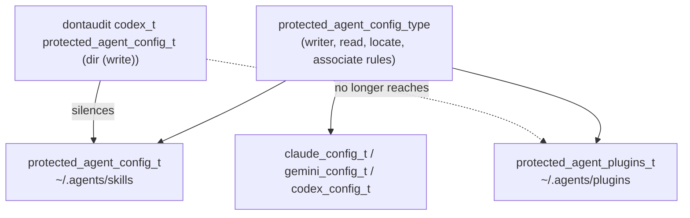

# Give ~/.agents/plugins its own SELinux type - Plan

## Goal Capsule

- **Objective:** An out-of-band plugin install into the operator's personal marketplace root leaves an audit record the operator can find, instead of failing silently.
- **Means:** Label `~/.agents/plugins` with a new type that the Codex skills-root suppression does not name (KTD1).
- **Authority hierarchy:** The R-IDs own the boundary behavior. The KTDs own the CIL and CI mechanism. `AGENTS.md` and `docs/solutions/security-issues/selinux-user-scope-agent-config-protection.md` own the standing rules the new type must obey.
- **Stop conditions:** Stop and report if the new type cannot inherit the `protected_agent_config_type` grants without also joining a base-policy attribute, or if the compiled-policy matrix cannot be exercised anywhere in the run.
- **Execution profile:** Policy-source and CI change. The proof is the CI test plus a host label check, not a runtime AVC reproduction.
- **Tail ownership:** The pipeline owns commit, push, PR, and CI.

---

## Product Contract

### Summary

Declare a second chezmoi-only type, `protected_agent_plugins_t`, and move the `~/.agents/plugins(/.*)?` file context onto it. The existing `(dontaudit codex_t protected_agent_config_t (dir (write)))` rule stays byte-identical and then covers only `~/.agents/skills`. Extend `.ci/test-selinux-protected-configs.sh` so the split is asserted in policy source, in the compiled `file_contexts`, in the compiled write-boundary matrix, and in the compiled suppression surface, with an expect-fail mutant that reverts the split.

### Problem Frame

`protected_agent_config_t` labels two canonical roots with different risk profiles. `~/.agents/skills` takes a known per-session write attempt from Codex, which reinstalls `~/.agents/skills/.system` at every session start; the boundary refuses it by design and the denial repeats forever. Issue #393 silenced that flood with a `dontaudit` scoped to the type, not the path.

`~/.agents/plugins` holds the personal marketplace manifest that harnesses only read (`MARKETPLACE_ROOT`, `.chezmoiscripts/70-agents/run_onchange_after_update-codex-plugins.sh.tmpl:34`). A `codex_t` write attempt there is not routine. It is the out-of-band plugin install the boundary exists to refuse, and the shared type makes it unaudited. The kernel checks `dir { write }` in `inode_permission()` before `add_name` and `remove_name`, so the suppression also covers `create`, `unlink`, `rmdir`, and `rename` on the plugins root. No runtime detector survives it; #393's R8 was withdrawn for that reason.

### Key Decisions

- KD1. **Split the type rather than narrow the `dontaudit`.** CIL `dontaudit` is keyed by type, not by path, so a path-scoped suppression does not exist. Governs R1, R2, R3.
- KD2. **The suppression rule text does not change.** Leaving it byte-identical keeps #393's reasoning and CI pins intact and makes the split the only variable. Governs R3.

### Requirements

**Policy**

- R1. `system/linux/selinux/dotfiles_protected_agent_configs.cil` declares `protected_agent_plugins_t` with `object_r` and adds it to `protected_agent_config_type`.
- R2. The `HOME_DIR/\.agents/plugins(/.*)?` file context resolves to `protected_agent_plugins_t` in the compiled `file_contexts`.
- R3. `(dontaudit codex_t protected_agent_config_t (dir (write)))` is unchanged, so a `codex_t` directory write on `protected_agent_plugins_t` is audited.
- R4. `protected_agent_plugins_t` carries no base-policy attribute other than `protected_agent_config_type`.
- R5. In the compiled policy, `chezmoi_t` may mutate `protected_agent_plugins_t`, and `codex_t`, `claude_t`, `agy_t`, `aoe_t`, `unconfined_t`, and `rpm_script_t` may not.
- R6. `protected_agent_plugins_t` may `associate` with `fs_t`, and every unconfined domain keeps read, traverse, map, execute, and watch on it.

**Verification**

- R7. `.ci/test-selinux-protected-configs.sh` pins the new declarations, the repointed `filecon`, and the new type's `file_contexts` mapping.
- R8. The compiled-policy matrix, the associate check, the read-only check, the relabel check, and the `PROTECTED` suppression-surface set all cover `protected_agent_plugins_t`.
- R9. An expect-fail mutant that repoints the plugins `filecon` back to `protected_agent_config_t` makes the test fail, and fails for that reason rather than a compile error.
- R10. The reclaim sweep selects `protected_agent_plugins_t`, and CI asserts that selector alongside the existing four.

**Documentation**

- R11. `AGENTS.md`, `README.md`, and `docs/solutions/security-issues/selinux-user-scope-agent-config-protection.md` describe five object types and state which root each suppression covers.

### Scope Boundaries

- Only the plugins root moves. The skills root, the three harness config types, and every existing writer rule stay as they are.
- No new suppression, no new writer, and no runtime detector for the skills-root blind spot. That residual stays recorded, not compensated.
- No change to the harness plugin installers or the marketplace manifest format.

### Sources

- Issue: https://github.com/hyperlapse122/dotfiles/issues/396
- Prior plan: `docs/plans/2026-09-07-0917-fix-selinux-codex-skills-root-write-denial-plan.md` (#393, KTD1 and the withdrawn R8)
- Solution doc: `docs/solutions/security-issues/selinux-user-scope-agent-config-protection.md`
- Suppression rule and its comment block: `system/linux/selinux/dotfiles_protected_agent_configs.cil:255-294`
- Reclaim sweep: `.chezmoiscripts/00-tools/run_onchange_before_00-selinux-policies.sh.tmpl:74-105`

---

## Planning Contract

### Key Technical Decisions

- KTD1. **Declare `protected_agent_plugins_t` and add it to `protected_agent_config_type` only.** The attribute already carries the chezmoi-only writer rules, the `unconfined_domain_type` read grants, the `locate_t` index grants, and the five `filesystem associate` rules, so membership is the whole inheritance and no rule is duplicated per type. Any other attribute would reach the base policy and make the type writable by every unconfined process. Governs R1, R4, R5, R6.
- KTD2. **Tighten the `filecon` pin to name the type.** The current token `(filecon \"HOME_DIR/\\.agents/plugins(/.*)?\"` stops at the path, so it would pass unchanged after the split and prove nothing. Pin the type in the token, as the `~/.codex/config\.toml` and `~/.claude/skills` pins already do. Governs R7.
- KTD3. **Prove the split in the compiled `file_contexts`, not only in source text.** `expect_context` already reads the compiled artifact restorecon consumes. Repoint its plugins row and keep the skills row on `protected_agent_config_t`, so the two roots are asserted apart. Governs R2, R7.
- KTD4. **Build the expect-fail mutant by rewriting the `filecon` line, not by appending CIL.** The existing mutants append a rule, which cannot express "this path went back to the old type" — a second `filecon` for the same spec is a duplicate, not a revert. Extract the `file_contexts` lookup that `expect_context` performs into a reusable helper, compile a `sed`-rewritten copy of the module, and require the helper to report `protected_agent_config_t` for the plugins spec on that copy. Governs R9.
- KTD5. **Add `protected_agent_plugins_t` to the reclaim sweep's selector set.** The sweep finds the plugins root today through `protected_agent_config_t`, so the first apply relabels it. The selector keeps the invariant that every protected type is reclaimable on a later `filecon` change, and it can only lower a label. Governs R10.

### High-Level Technical Design

### Assumptions

- The `~/.agents/plugins` inode currently carries `protected_agent_config_t` on the operator host, so the apply-time reclaim sweep already selects it and no manual relabel is needed. Verified in U4.
- `python3-setools` is absent from this workstation, so the compiled-policy matrix is skipped locally and CI is where R5, R8, and R9 are first proven end to end. `secilc` is present, so the `file_contexts` assertions do run locally.

### Sequencing

U1 changes the policy. U2 changes the CI test and is meaningless before U1. U3 touches the apply script and its CI assertion. U4 is a read-only host check that needs no code. U5 updates prose and depends on U1 through U3 being settled.

---

## Implementation Units

### U1. Split the plugins root onto its own type

- **Goal:** `~/.agents/plugins` is labelled `protected_agent_plugins_t`, with every inherited grant intact and the suppression rule untouched.
- **Requirements:** R1, R2, R3, R4, R6 (KTD1)
- **Files:** `system/linux/selinux/dotfiles_protected_agent_configs.cil`
- **Approach:**
  - Add `(type protected_agent_plugins_t)` and `(roletype object_r protected_agent_plugins_t)` beside the existing protected-type declarations.
  - Extend the `typeattributeset protected_agent_config_type` member list with the new type. Keep the existing members and their order; append the new one after `protected_agent_config_t`.
  - Repoint the plugins `filecon` to `protected_agent_plugins_t`. Leave the skills `filecon` alone.
  - Sweep every count-bearing phrase in the header block for the fifth type: the "FOUR OBJECT TYPES" heading, the sentence that says `protected_agent_config_t` keeps its meaning for "the canonical ~/.agents skills and plugins roots", and each later "four protected types" reference in the `file_type` and inherited-attribute paragraphs.
  - Rewrite the two claims in the `dontaudit` comment that depend on the shared type: that `audit2allow`'s `allow codex_t protected_agent_config_t` grant "would open BOTH canonical roots", and that the suppression silences mutations "under ~/.agents/skills or ~/.agents/plugins". After the split the suppression reaches the skills root only; say that, and say that a `codex_t` directory write on the plugins root is audited again.
  - Add no rule naming `protected_agent_plugins_t` directly. Every grant comes through the attribute.
- **Test Scenarios:**
  - `secilc` compiles the module against the test's base stub with no error.
  - The compiled `file_contexts` maps `HOME_DIR/\.agents/plugins(/.*)?` to `protected_agent_plugins_t` and `HOME_DIR/\.agents/skills(/.*)?` to `protected_agent_config_t`.
  - `grep -c` finds exactly one `dontaudit` naming a protected type, and it is the sanctioned line, unchanged.
  - No `typeattributeset` line puts `protected_agent_plugins_t` into an attribute other than `protected_agent_config_type`.
- **Verification:** `bash .ci/test-selinux-protected-configs.sh` (passes on the pre-U2 test too, which proves the split broke no existing pin).

### U2. Extend the CI test to cover the new type

- **Goal:** Every guard that protects the other four types protects the new one, and the split cannot silently regress.
- **Requirements:** R7, R8, R9 (KTD2, KTD3, KTD4)
- **Files:** `.ci/test-selinux-protected-configs.sh`
- **Approach:**
  - Declaration tokens: add `(type protected_agent_plugins_t)`, `(roletype object_r protected_agent_plugins_t)`, and the updated `typeattributeset protected_agent_config_type` line. Replace the old member-list token; leaving both would pin a string the module no longer carries.
  - Replace the plugins `filecon` token with one that names `protected_agent_plugins_t` (KTD2).
  - `forbidden_writer`: add `protected_agent_plugins_t` rows for `claude_t`, `agy_t`, `aoe_t`, and `codex_t`.
  - Source-text `dontaudit` enumeration: add `protected_agent_plugins_t` to the alternation, so a new suppression on the plugins root fails the source scan too.
  - Base-policy attribute guard: add `protected_agent_plugins_t` to the `for protected in ...` list, and to the `\b(...)\b` alternation in the follow-on `typeattributeset` scan.
  - `expect_context`: repoint the plugins row to `protected_agent_plugins_t` (KTD3).
  - setools matrix: add `('chezmoi_t', 'protected_agent_plugins_t'): True` and `False` rows for `claude_t`, `agy_t`, `aoe_t`, `codex_t`, `unconfined_t`, and `rpm_script_t`. Add the type to the `may_associate` loop and to `READ_ONLY`, and to `PROTECTED`.
  - Expect-fail mutant (KTD4): factor the `file_contexts` row lookup out of `expect_context` into a helper both callers use. Compile a copy of the module whose plugins `filecon` is rewritten back to `protected_agent_config_t`, and fail the test when that copy still maps the plugins spec to `protected_agent_plugins_t`. Place it beside the existing mutants so it runs under the same `secilc` guard.
- **Test Scenarios:**
  - The test passes on the U1 module.
  - Reverting U1's `filecon` alone makes the test fail, and the message names the plugins mapping rather than a compile error.
  - Removing `protected_agent_plugins_t` from `protected_agent_config_type` makes the test fail on a missing declaration token.
  - Adding `(typeattributeset file_type (protected_agent_plugins_t))` makes the base-policy attribute guard fail.
  - Adding `(dontaudit codex_t protected_agent_plugins_t (dir (write)))` fails the source-text scan, and fails the compiled suppression-surface check where setools is present.
  - The existing four mutants still fail for their existing reasons.
- **Verification:** `bash .ci/test-selinux-protected-configs.sh`, plus one temporary hand-applied revert per mutant scenario above, reverted before commit.

### U3. Add the new type to the reclaim sweep

- **Goal:** A stale `protected_agent_plugins_t` label is reclaimable by the only domain that can clear it.
- **Requirements:** R10 (KTD5)
- **Files:** `.chezmoiscripts/00-tools/run_onchange_before_00-selinux-policies.sh.tmpl`, `.ci/test-selinux-protected-configs.sh`
- **Approach:** Add `-o -context '*:protected_agent_plugins_t:*'` to the `find` selector list, and the matching `reclaim_selector` entry to the CI loop. The sweep stays a lowering sweep: it selects paths that already carry a protected type and asks `restorecon` for the policy default. Do not add the path to the `restorecon -RFv` list — `"$HOME/.agents/plugins"` is already there.
- **Test Scenarios:**
  - The rendered script contains all five `-context` selectors.
  - The rendered script still passes `bash -n` and still contains no `-R` in the reclaim pipeline.
  - The `restorecon -RFv` relabel list is unchanged.
- **Verification:** `bash .ci/test-selinux-protected-configs.sh`.

### U4. Confirm the label migration on the host

- **Goal:** The claim that the first apply relabels `~/.agents/plugins` is confirmed by observation, not assumed.
- **Requirements:** R2 (supporting evidence for the Assumptions entry)
- **Files:** none
- **Approach:** Read the current label with `ls -Zd ~/.agents/plugins`, and confirm the reclaim selector finds it with `find "$HOME/.agents/plugins" -maxdepth 0 -context '*:protected_agent_config_t:*'`. A hit proves the sweep selects the path on the apply that installs the split, and `restorecon -Fi` then writes the new policy default. Do not run `chezmoi apply` from this worktree: the policy install belongs to an apply from the primary checkout after merge. Record the observed label and the find result in the PR body.
- **Test expectation: none -- read-only host observation, no code changes.**
- **Verification:** Both commands run and their output is recorded.

### U5. Update the standing documentation

- **Goal:** The repo's prose describes five object types and names which root the suppression covers.
- **Requirements:** R11
- **Files:** `AGENTS.md`, `README.md`, `docs/solutions/security-issues/selinux-user-scope-agent-config-protection.md`
- **Approach:**
  - `AGENTS.md`: in the SELinux paragraph, change "four object types" to five, list `protected_agent_plugins_t` (`~/.agents/plugins/`) beside `protected_agent_config_t` (`~/.agents/skills/`), and correct the suppression sentence that says the `audit2allow` grant would open the plugins root through the shared type.
  - `README.md`: the first-apply checklist tells the operator to check the audit log for denials on `protected_agent_config_t`; name both types so a plugins-root denial is not missed.
  - Solution doc: update the type/path/writer table, the CIL excerpt showing the plugins `filecon`, the paragraph on what the `dontaudit` hides, the `semodule -DB` recovery note, and the `setroubleshoot` paragraph that argues from the shared type. Bump `last_updated`.
  - Do not restate the CIL rules in prose. Cite the type names and the paths.
- **Test Scenarios:**
  - `grep -c 'protected_agent_config_t' README.md AGENTS.md` returns no sentence that still implies the plugins root shares the skills root's type.
  - `bash .ci/test-agent-instructions.sh` passes.
- **Verification:** `bash .ci/test-agent-instructions.sh` and a read of each changed paragraph.

---

## Verification Contract

| Gate | Command | Applies to | Done signal |
|---|---|---|---|
| Policy and CI boundary | `bash .ci/test-selinux-protected-configs.sh` | U1, U2, U3 | `all assertions passed.`, and where setools is present the two existing proven-against lines |
| Instruction files | `bash .ci/test-agent-instructions.sh` | U5 | exits 0 |
| Compiled matrix | same script with `python3-setools` available | U2 | `compiled-policy write boundary verified.` |
| Host label | `ls -Zd ~/.agents/plugins` | U4 | current label recorded in the PR body |

The compiled-policy matrix is the load-bearing gate and it is skipped when `python3-setools` is missing. Install it locally if possible; otherwise the GitHub Actions run in `.github/workflows/ci.yml:261` is the first place R5, R8, and R9 are proven, and the run must be watched to green before merge.

## Definition of Done

- Every R-ID above is implemented and covered by a named gate.
- The `dontaudit` rule is byte-identical to its pre-change text.
- `protected_agent_plugins_t` appears in no rule of its own; it inherits through `protected_agent_config_type` alone.
- The new expect-fail mutant fails for the plugins mapping, not for a compile or query error.
- The host label observation from U4 is recorded in the PR body.
- No temporary mutant edit, debug print, or abandoned approach remains in the diff.
- CI is green on the PR.
